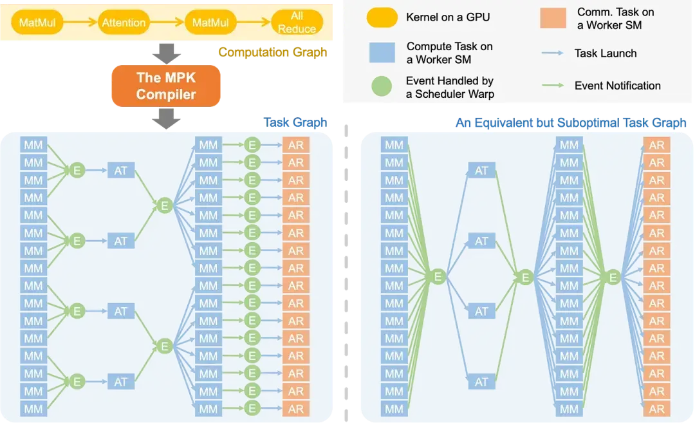
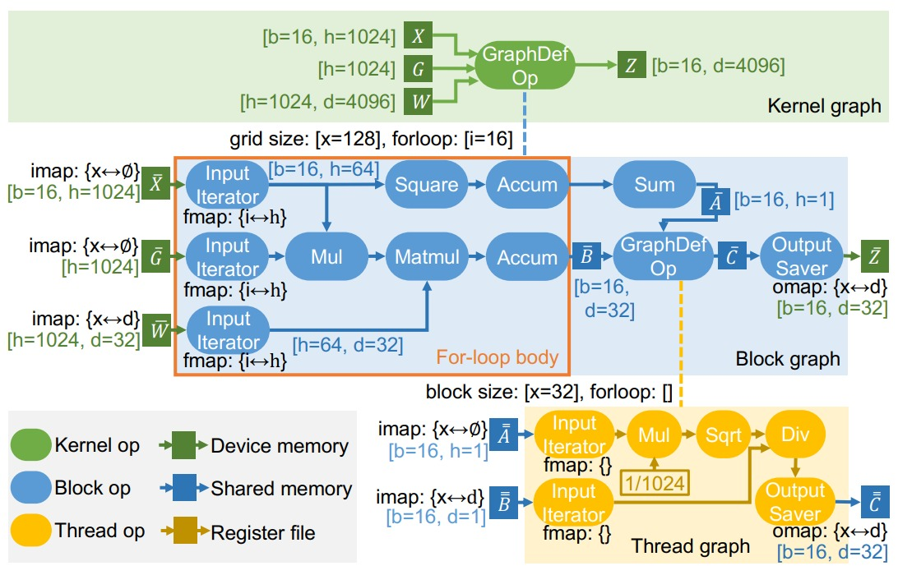
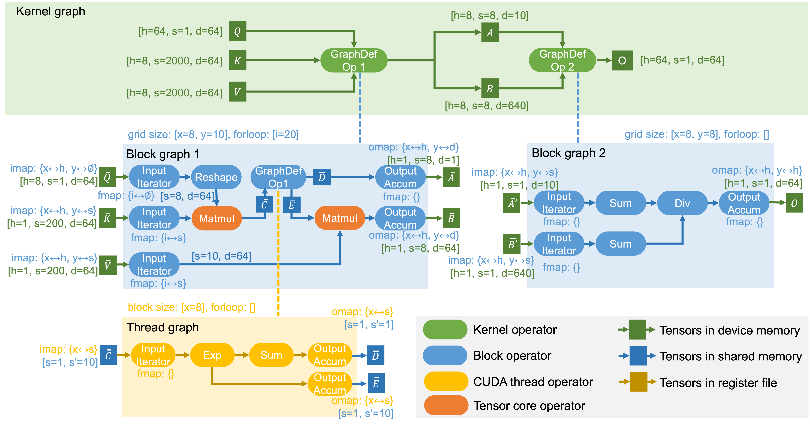
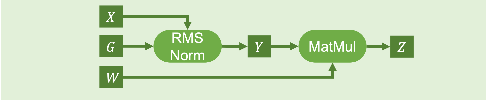
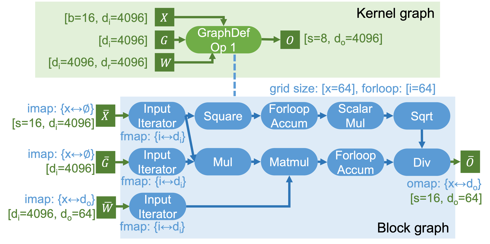

# MPK（Mirage Persistent Kernel）源码笔记（2）--- 多层结构化图模型

目录

* [MPK（Mirage Persistent Kernel）源码笔记（2）--- 多层结构化图模型](#mpkmirage-persistent-kernel源码笔记2----多层结构化图模型)
  + [0x00 概要](#0x00-概要)
  + [0x01 机制](#0x01-机制)
    - [1.1 当前问题](#11-当前问题)
    - [1.2 解决方案](#12-解决方案)
      * [1.2.1 μGraphs：多层次计算图表示](#121-μgraphs多层次计算图表示)
      * [1.2.2 归纳式程序合成：优化范式](#122-归纳式程序合成优化范式)
  + [0x02 多层次计算图表示](#0x02-多层次计算图表示)
    - [2.1 概念](#21-概念)
    - [2.2 层级关系](#22-层级关系)
    - [2.3 对比](#23-对比)
    - [2.4 执行关系](#24-执行关系)
  + [0x03 内核图](#0x03-内核图)
    - [3.1 PersistentKernel调用](#31-persistentkernel调用)
    - [3.2 Python 代码](#32-python-代码)
    - [3.3 桥梁](#33-桥梁)
    - [3.4 C++ 代码](#34-c-代码)
    - [3.5 KNOperator](#35-knoperator)
    - [3.6 生成样例](#36-生成样例)
  + [0x04 线程块图](#0x04-线程块图)
    - [4.1 属性](#41-属性)
      * [4.1.1 网格尺寸](#411-网格尺寸)
      * [4.1.2 For-loop 尺寸](#412-for-loop-尺寸)
    - [4.2 Python 代码](#42-python-代码)
    - [4.3 桥梁](#43-桥梁)
    - [4.4 C++代码](#44-c代码)
    - [4.5 TBOperator](#45-tboperator)
    - [4.6 生成样例](#46-生成样例)
      * [4.6.1 Python代码直接构建](#461-python代码直接构建)
      * [4.6.2 PersistentKernel 的 layer 方法间接构建](#462-persistentkernel-的-layer-方法间接构建)
      * [4.6.3 C++代码直接构建](#463-c代码直接构建)
  + [0x05 线程图](#0x05-线程图)
  + [0xFF 参考](#0xff-参考)

## 0x00 概要

Mirage 使用 uGraph 来指定在 GPU 上执行张量程序。uGraph 包含多个级别的层次化图，以表示在内核、块和线程级别的计算。下图是GQA对应的μGraphs，显示了一个用于计算GQA的 uGraph。我们用它作为运行示例来解释 uGraph 的关键组成部分。


## 0x01 机制

### 1.1 当前问题

LLM 的计算过程通常以计算图的形式表示，其中每个节点对应一个计算算子（如矩阵乘法、注意力机制）或集合通信原语（如 all-reduce），边表示算子间的数据依赖关系。现有系统通常为每个算子启动独立的 GPU 内核。然而，这种“单算子单内核”的执行模型难以实现 pipeline 优化，因为依赖关系是在整个内核的粗粒度层面强制执行的，而非实际数据单元层面。

例如，矩阵乘法（matmul）后接 all-reduce 操作：现有系统中，all-reduce 内核必须等待整个 matmul 内核完成。而实际上，all-reduce 的每个数据分块仅依赖 matmul 输出的局部结果。这种逻辑依赖与实际依赖的错配，严重限制了计算与通信的重叠潜力。下图的右侧展示次优方案 —— 其引入不必要的数据依赖与全局屏障，导致跨层流水线优化机会受限。



### 1.2 解决方案

为了解决这一问题，Mirage实现了多层次计算图表示（μGraphs）与归纳式程序合成（Inductive Program Synthesis）。这两大机制协同作用，实现了从宏观调度到微观计算的全链路优化，高效生成GPU程序，显著提升了张量计算的性能。

Mirage 的编译流程清晰且目标明确：

* 输入：来自预定义算子集合的计算图子图（如 GQA 注意力计算子图），确保输入逻辑的规范性与可优化性；
* 核心优化步骤：包含图重写（Graph Rewrite，调整图结构以适配 GPU 架构）、算子融合（Operator Fusion，减少内存访问次数）等，所有优化均基于 μGraphs 的跨层级表示展开；
* 输出：优化后的 CUDA 程序，直接适配 GPU 硬件执行，可直接JIT嵌入pytorch。

#### 1.2.1 μGraphs：多层次计算图表示

MPK 编译器将 LLM 计算图自动转化为细粒度任务图，最大化暴露并行性。该任务图在子内核级别显式捕获依赖关系，实现更激进的跨层流水线优化。具体而言，在 MPK 任务图中（参见上图）：

* 任务（矩形表示）：代表分配给单个 GPU 流式多处理器（SM）的计算或通信单元。
* 事件（圆形表示）：表示任务间的同步点。
* 触发机制：每个任务发出指向触发事件的边，该事件在关联任务全部完成后激活。
* 依赖机制：每个任务接收来自依赖事件的边，表明事件激活后任务立即启动。

任务图使 MPK 能够发掘计算图中无法实现的 pipeline 优化机会。例如，MPK 可以构建优化任务图 —— 其中每个 all-reduce 任务仅依赖于生成其输入的对应 matmul 任务，从而实现分块执行与计算通信重叠。

除生成优化任务图外，MPK 还通过 Mirage 内核超优化器自动为每个任务生成高性能 CUDA 实现，确保任务在 GPU 流式多处理器（SM）上高效执行。

#### 1.2.2 归纳式程序合成：优化范式

归纳式程序合成是Mirage的另一大核心机制。与传统的演绎式程序合成（如基于规则的重写系统）不同，归纳式程序合成直接从语法出发构造程序，并借助SMT求解器验证构造程序与原程序的等价性。这种方法能够突破传统优化方法的局限，发现将代数变换、调度变换和新自定义内核生成相结合的创新优化路径。

通过归纳式程序合成，Mirage能够自动生成高性能的GPU内核代码，不仅简化了开发流程，还提升了程序的运行效率，使得开发者能够更专注于高层逻辑的设计，而无需深入底层硬件细节。

传统机器学习编译器（如 TVM、TensorRT）采用演绎式程序合成（Deductive Program Synthesis，又称 Term Rewrite） ：从原始程序出发，通过等价重写规则（如图模式匹配、循环调度原语）逐步变换，始终在 “程序等价类” 内搜索更优实现 —— 这种方式依赖手工设计规则，难以突破现有等价类的性能上限。

Mirage 则采用归纳式程序合成：不依赖原始程序的逐步变换，而是直接基于算子语法构造全新候选程序，再通过 “μGraphs 语义校验 + 概率等价验证”（如有限域随机测试）确认候选程序与原始程序的功能一致性。这种范式无需受限于等价重写规则，可探索更灵活的跨层级优化方案（如 Kernel-Graph 合成算子与 Block-Graph 共享内存复用的协同），同时通过概率验证保障正确性。

下图是Mirage找出的最佳μGraphs。



## 0x02 多层次计算图表示

Mirage 实现了多层次计算图表示（μGraphs），通过 kernel-graph（内核图）、block-graph（块图）和 thread-graph（线程图）这三层结构化图模型，精确映射 GPU 程序从内核到线程的执行逻辑与存储层级。这种三层结构与 CUDA 程序的执行层级及 GPU 的存储体系紧密对应，每层均清晰定义了 “算子类型 — 张量存储 — 核心功能” 的关联关系。

### 2.1 概念

三层的概念如下：

1. kernel-graph（内核图）：属于高层次抽象，用于表示整个计算图（即完整的计算任务），包含粗粒度的高层操作（如完整的矩阵乘法、规约运算等）与对应数据。该层负责全局调度，重点关注数据流与任务间的依赖关系，对应 GPU 的全局内存，主要处理宏观层面的任务分配与协同。其包含的算子（举例）类型有：
   1. 高层操作：KN\_INPUT\_OP（输入算子）、KN\_OUTPUT\_OP（输出算子）、KN\_MATMUL\_OP（矩阵乘法算子）；
   2. 数学操作：KN\_EXP\_OP（指数运算算子）、KN\_ADD\_OP（加法算子）、KN\_MUL\_OP（乘法算子）；
   3. 规约操作：KN\_REDUCTION\_0\_OP（零阶规约算子）等；
   4. 自定义操作：KN\_CUSTOMIZED\_OP（自定义算子）等。
2. block-graph（块图）：属于中等层次抽象，嵌套在 KN\_CUSTOMIZED\_OP（自定义内核算子）中，定义 threadblock（线程块）级别的计算逻辑。该层包含细粒度操作，负责管理线程块级别的并行计算，重点关注内存访问模式、循环结构等中观细节，对应 GPU 的共享内存，核心目标是优化中观层面的资源利用与数据共享效率。其包含的算子类型（举例）有：
   1. 输入操作：TB\_INPUT\_OP（线程块输入算子）；
   2. 内存操作：TB\_MATMUL\_OP（线程块矩阵乘法算子）、TB\_EXP\_OP（线程块指数运算算子）；
   3. 特殊操作：TB\_FORLOOP\_ACCUM\_NO\_RED\_OP（线程块循环累加无规约算子）、TB\_RMS\_NORM\_OP（线程块 RMS 归一化算子）。
3. thread-graph（线程图）：在 block-graph 的具体操作中体现，定义线程级别的执行细节。该层专注于线程级别的微观计算逻辑，对应 GPU 的寄存器，核心作用是确保每个线程的高效执行，最大化单线程的计算吞吐量。

这种三层结构支持系统在不同抽象层级开展针对性优化：

* 在 kernel-graph 层，主要进行全局任务调度与数据流优化，明确整体计算流程与资源分配方向；
* 在 block-graph 层，侧重线程块级别的并行策略优化，提升中观层面的并行效率与数据共享能力；
* 在 thread-graph 层，聚焦具体的内存访问模式优化与计算指令调度，确保微观执行的高效性。

若用通俗语言概括三层结构的分工：kernel-graph 决定 “要做什么”（明确整体计算任务与目标），block-graph 决定 “该怎么做”（规划线程块级的执行方案），thread-graph 负责 “具体执行”（完成线程级的微观计算）。

这种从宏观到微观的层次化设计，使 μGraphs 能够实现从全局调度到局部执行的全链路优化，有效减少计算冗余与资源浪费，确保 GPU 计算资源的高效利用。

### 2.2 层级关系

三级图结构的关系如下图所示。

```
  muGraph(Kernel Graph)                                    
  │                                                        
  ├────► KNOperator(各种标准操作)                                       
  │                                   
  │                                                        
  └────► KNCustomizeOp(自定义操作)                                   
            │                                              
            └───► block-graph(Threadblock Graph)           
                   │                                       
                   ├────► TBOperator(各种线程块操作)                     
                   │                                       
                   └────► TBInputOp(连接到muGraph的张量)                      
                             │                             
                             └───► thread-level execution(线程级执行)
```

### 2.3 对比

三层的对比如下。

| 计算图层级 | 对应 CUDA 执行层级 | 张量存储位置 | 算子类型与功能 | 核心属性 / 逻辑 |
| --- | --- | --- | --- | --- |
| Kernel-Graph | 整个 GPU 内核（多流处理器 SM 协同） | 设备全局内存（Device DRAM） | 1. **预定义算子**：直接调用厂商库内核（如 cuBLAS 的 GEMM 矩阵乘、cuDNN 的卷积）； 2. **合成算子**：需通过更低层级的 Block-Graph 描述，承载算子融合、自定义算法等复杂逻辑 | 无额外属性，核心是 “调度多 SM 协同”，通过预定义算子复用成熟库性能，合成算子支持灵活优化 |
| Block-Graph | 单个流处理器 SM（线程块协作） | 共享内存（Shared Memory） | 1. **预定义算子**：调用 CUTLASS、ThunderKittens 等库的共享内存操作（如块内矩阵乘、累加）； 2. **合成算子**：由 Thread-Graph 描述，实现线程块内细粒度计算 | 1. **并行切分属性**：imap（输入分块，映射 Grid 维度到输入张量维度）、omap（输出拼接，映射 Grid 维度到输出张量维度）、fmap（循环迭代，映射 For-Loop 维度到数据迭代器 / 累加器维度）； 2. **执行逻辑**：支持线程块循环迭代，通过共享内存复用与 “计算 - 访存重叠”，将全局内存读写延迟隐藏在计算过程中 |
| Thread-Graph | 单个线程（寄存器操作） | 线程私有寄存器（Register File） | 仅含**预定义算子**，描述单个线程内的寄存器级流水操作（如 load 数据→元素级计算→store 结果），支持循环迭代与寄存器累加；默认通过 “规则化融合” 快速生成，避免细粒度层级的冗余搜索 | 核心是 “单线程高效流水”，通过寄存器操作最小化内存访问，提升计算密度 |

### 2.4 执行关系

persistent\_kernel.py是 Persistent Kernel的Python接口，本质是Python到CUDA持久化内核系统的桥梁，允许用户用python定义复杂的计算图，然后在GPU上高效执行。

persistent\_kernel.py与三层计算图的关系如下：

1. Persistent Kernel 创建并管理 Kernel Graph
2. Kernel Graph 通过 KN\_CUSTOMIZED\_OP 包含多个 Block Graph
3. 每个 Block Graph 定义线程块内的操作序列
4. Kernel Graph 转换为 Task Graph 用于执行
5. Task Execution Engine 在 Persistent Kernel 中执行任务
6. Event System 管理任务间的依赖和同步
7. Thread Graph 在实际GPU线程中执行具体操作

## 0x03 内核图

每个张量程序对应一个内核图，其中每个节点代表在整個 GPU 上运行的内核，每条边是内核之间共享的张量。内核图中的所有张量都存储在 GPU 设备内存中，因为不同的内核不能在寄存器文件或共享内存中共享数据。内核图中的每个节点都可以是现有内核库（如 cuDNN 的卷积和 cuBLAS 的矩阵乘法）支持的预定义内核操作符。此外，为了启用细粒度的内核间优化（如内核融合），内核图中的节点也可以是图定义的内核操作符，其语义和行为由较低级别的（即块）图定义。下图中的两个内核操作符都是图定义的操作符，每个都由块图指定。


### 3.1 PersistentKernel调用

在PersistentKernel内部，kn\_graph负责实际的计算图构建。

```
self.kn_graph = KNGraph(CyKNGraph(disable_fingerprint=True))
```

每个attach\_input和new\_tensor调用都会在kn\_graph中创建张量节点。每个layer调用也会在kn\_graph中添加相应的计算节点。最后compile()调用self.kn\_graph.generate\_task\_graph生成任务图。

### 3.2 Python 代码

内核图在Python中的类是KNGraph。KNGraph用于构建和管理内核计算图。比如，new\_input会创建新的输入变量。attach\_torch\_tensor管理PyTorch变量。attach\_cuda\_tensor关联CUDA变量。compile会生成最终的执行代码。

KNGraph的特点如下：

* Kernel graph的节点是：

  + 预定义算子（pre-defined operator），比如cuBLAS GEMM、cuDNN Conv
  + 合成算子（graph-defined operator），用更低一层的block graph描述，可承载fusion/新算法。
* Kernel graph的边是：位于全局内存（Device DRAM）的Tensor。

KNGraph 代码举例如下：

```
class KNGraph:
    def __init__(self, graph):
        self.cygraph = graph
        self._is_compiled = False
        self.run = None
        self._valid_cuda_kernels = False
        self._cached_results = None
        self.visualizer = None

        self.backend = "cuda"
        
    def new_input(
        self, dims: tuple, strides: tuple = None, dtype: dtype = float16
    ) -> DTensor:
        # use the default strided layout if strides = None
        if strides is None:
            total_elements = 1
            strides = []
            for d in reversed(dims):
                strides.append(total_elements)
                total_elements *= d
            strides = reversed(strides)
        return self.cygraph.new_input(dims, tuple(strides), dtype)      
    

    def compile(self, async_=False, **kwargs):
        if self._is_compiled:
            return self._cached_results
        input_tensors = kwargs.get("inputs", [])
        input_strides = []

        for i in range(len(dtensors)):
            dims, strides = self.cygraph.get_input_dtensor_shape_and_stride(dtensors[i])
            input_strides.append(strides)
        target_cc = kwargs.get(
            "target_cc",
            torch.cuda.get_device_properties(0).major * 10
            + torch.cuda.get_device_properties(0).minor,
        )
        num_warp_groups = kwargs.get("num_warp_groups", 2)
        pipeline_stages = kwargs.get("pipeline_stages", 2)
        enable_online_softmax = kwargs.get("enable_online_softmax", False)

        result = generate_cuda_program(
            self.cygraph,
            target_cc=target_cc,
            input_strides=input_strides,
            num_warp_groups=num_warp_groups,
            pipeline_stages=pipeline_stages,
            profiling=profiling,
            enable_online_softmax=enable_online_softmax,
        )
        if result["max_smem_size"] > get_shared_memory_capacity(target_cc):
            self._is_compiled = True
            self._valid_cuda_kernels = False
            self._error_message = "shared memory usage exceed limit"

            if async_:
                return Handle([], None)
            else:
                return None

        MIRAGE_ROOT, INCLUDE_PATH, DEPS_PATH = get_key_paths()
        tempdir_obj = tempfile.TemporaryDirectory()
        tempdir = tempdir_obj.name
        saved_addr = ""
        file_id = kwargs.get("file_id", -1)
        if file_id != -1:
            print(f"file_id: {file_id}")
            saved_addr = f"./generated_codes/{file_id}/"
        FILE_NAME = os.path.join(tempdir, "test.cu")
        so_path = os.path.join(tempdir, "test.cpython-38-x86_64-linux-gnu.so")

        with open(FILE_NAME, "w") as f:
            f.write(result["code"] + HARD_CODE)
            if saved_addr != "":
                print(f"saved_addr: {saved_addr}")
                os.makedirs(saved_addr, exist_ok=True)
                with open(saved_addr + "test" + str(file_id) + ".cu", "w") as f:
                    f.write(result["code"] + HARD_CODE)

        cc = shutil.which("nvcc")
        # This function was renamed and made public in Python 3.10
        if hasattr(sysconfig, "get_default_scheme"):
            scheme = sysconfig.get_default_scheme()
        else:
            scheme = sysconfig._get_default_scheme()
        if scheme == "posix_local":
            scheme = "posix_prefix"
        py_include_dir = sysconfig.get_paths(scheme=scheme)["include"]
        cc_cmd = get_cc_cmd(
            target_cc,
            cc,
            FILE_NAME,
            py_include_dir,
            INCLUDE_PATH,
            DEPS_PATH,
            so_path,
            profiling,
        )

        def remain_op():
            import importlib.util

            try:
                spec = importlib.util.spec_from_file_location(
                    "__mirage_launcher", so_path
                )
                mod = importlib.util.module_from_spec(spec)
                spec.loader.exec_module(mod)
                self.run = getattr(mod, "launch")
                self._is_compiled = True
                self._valid_cuda_kernels = True
                self._cached_results = result
                self._error_message = "No error"
                tempdir_obj.cleanup()
                return self._cached_results
            except ImportError:
                self._is_compiled = True
                self._valid_cuda_kernels = False
                self._cached_results = None
                self._error_message = "CUDA compilation error"
                return None

        if async_:
            if global_config.bypass_compile_errors:
                ret = subprocess.Popen(
                    cc_cmd, stdout=subprocess.DEVNULL, stderr=subprocess.STDOUT
                )
            else:
                ret = subprocess.Popen(cc_cmd)
            return Handle([ret], remain_op)
        else:
            ret = subprocess.check_call(cc_cmd)
            return remain_op()
```

### 3.3 桥梁

PersistentKernel 中，通过如下方式进行设置 Kernel Graph。

```
self.kn_graph = KNGraph(CyKNGraph(disable_fingerprint=True))
```

在python\mirage\_cython\core.pyx 文件中，CyKNGraph 中有定义 CppKNGraph。

```
cdef class CyKNGraph:
    cdef CppKNGraph *p_kgraph #Hold a CppKNGraph instance

    def __cinit__(self, graph = None, bool disable_fingerprint = False):
        cdef unsigned long long ptr
        cdef dim3 c_gpu_dim
        if graph is None:
            c_gpu_dim.x = 1
            c_gpu_dim.y = 1
            c_gpu_dim.z = 1
            self.p_kgraph = new CppKNGraph(c_gpu_dim, disable_fingerprint)
        else:
            ptr = ctypes.cast(graph, ctypes.c_void_p).value
            self.p_kgraph = <CppKNGraph*>(ptr)
```

在 python\mirage\_cython\CCore.pxd 文件中，指明 CppKNGraph 对应了 "mirage::kernel::Graph"，这便是C++代码中，Kernel Graph 的实现。

```
    cdef cppclass CppKNGraph "mirage::kernel::Graph":
        CppKNGraph(dim3 gpu_dim, bool disable_fingerprint)
        CppDTensor* new_input_ptr(vector[int] dims,
                                  vector[size_t] strides,
                                  DataType data_type,
                                  DmemLayout layout)
        void mark_output(const CppDTensor* A, vector[size_t] strides)
        CppDTensor* matmul(const CppDTensor* A, const CppDTensor* B)
        CppDTensor* reduction(const CppDTensor* input, int dim, int size)
        CppDTensor* rms_norm(const CppDTensor* input, vector[int])
        CppDTensor* exp(const CppDTensor* input)
        CppDTensor* silu(const CppDTensor* input)
        CppDTensor* gelu(const CppDTensor* input)
        CppDTensor* relu(const CppDTensor* input)
        CppDTensor* clamp(const CppDTensor* input, float min_val, float max_val)
        CppDTensor* sqrt(const CppDTensor* input)
        CppDTensor* square(const CppDTensor* input)
        CppDTensor* add(const CppDTensor* op1, const CppDTensor* op2)
        CppDTensor* mul(const CppDTensor* op1, const CppDTensor* op2)
        CppDTensor* div(const CppDTensor* op1, const CppDTensor* op2)
        CppDTensor* pow(const CppDTensor* op1, const CppDTensor* op2)
        int customized(vector[const CppDTensor*] inputs,
                       CppDTensor** outputs,
                       CppTBGraph* bgraph)
        int get_num_input_dtensors()
        int get_num_output_dtensors()
        int get_input_dtensors(CppDTensor** cinputs)
        int get_input_dtensor_shape_and_stride(const CppDTensor *input, int *strides, int *dims)
        void generate_triton_program(const char *filepath)
        void generate_cuda_program(const char *filepath)
        size_t get_owner_independent_hash() const
        # Persistent kernel functions
        void attach_torch_tensor(const CppDTensor *input,
                                 void *torch_data_ptr,
                                 const char *name)
        void attach_cuda_tensor(const CppDTensor *input,
                                const char *name)
        void attach_nvshmem_tensor(const CppDTensor *input,
                                   const char *name)
        CppDTensor* fuse_tensors(vector[const CppDTensor*] inputs,
                                 int fused_dim,
                                 int num_groups,
                                 const char *name)
        void register_task(const char *task_type,
                           vector[int] params)
        TaskGraphResult generate_task_graph(int num_gpus, int my_gpu_id)

        vector[CppKNOperator*] operators
```

### 3.4 C++ 代码

muGraph在c++代码中体现为mirage::kernel::Graph类，这是最高层次的计算图。

```
namespace mirage {
namespace kernel {

class Graph {
private:
  struct pair_hash {
    size_t operator()(std::pair<int, int> const &p) const;
  };

public:
  Graph(dim3 gpu_dim = {1, 1, 1}, bool disable_fingerprint = false);
  ~Graph();
  Graph(Graph const &) = delete;
  Graph &operator=(Graph const &) = delete;
  // input operator
  DTensor new_input(std::vector<int> const &dims,
                    std::vector<size_t> const &strides,
                    mirage::type::DataType data_type,
                    mirage::layout::DmemLayout layout);
  DTensor elementunary(DTensor const &input,
                       mirage::type::KNOperatorType _type);
  // 忽略其它函数  

public:
  std::vector<mirage::kernel::KNOperator *> operators; // 操作符列表
  dim3 gpu_dim;
  off_t dmem_data_offset, dmem_fp_offset;
  std::vector<std::pair<off_t, size_t>> allocated_data_tensors,
      allocated_fp_tensors;
  // Fields for persistent kernels
  std::map<mirage::type::GuidType, mirage::runtime::IODesc> io_config;
  std::unordered_map<mirage::kernel::KNOperator const *,
                     std::tuple<int, int, runtime::TaskType, int>>
      task_config;

  using OpType = KNOperator;
  using TensorType = DTensor;
};
```

mirage::kernel::Graph的主要特征是：

* 操作符类型：使用KNOperatorType 枚举定义操作类型。
* 张量表示：使用DTensor（Device Tensor）表示数据。
* 操作节点：包括输入（KN\_INPUT\_OP），输出（KN\_OUTPUT\_OP），矩阵乘法（KN\_MATMUL\_OP）等。

mirage::kernel::Graph的成员函数以 elementunar 为例，代码如下：

```
DTensor Graph::elementunary(DTensor const &input,
                            mirage::type::KNOperatorType type) {
  KNOperator *op = create_elementunary_op(input, type);
  assert(op != nullptr);
  operators.push_back(op);
  assert(op->output_tensors.size() == 1);
  DTensor output = op->output_tensors[0];
  return output;
}
```

### 3.5 KNOperator

Graph包含多个KNOperator对象。

KNOperator是内核级别的操作符基类，用于表示计算图中的节点。作为计算图中每个操作的基本单元，可以维护输入和输出张量的信息，提供操作类型表示。而且，通过输入输出张量的连接关系，可以建立操作间的依赖关系，为后续的任务调度和事件管理提供基础。

在runtime.cc中，系统通过遍历Graph中的operators来生成任务图。

```
class KNOperator {
public:
  KNOperator(Graph *graph, mirage::type::KNOperatorType _type);
  KNOperator(Graph *graph,
             mirage::type::KNOperatorType _type,
             DTensor const &input1);
  KNOperator(Graph *graph,
             mirage::type::KNOperatorType _type,
             DTensor const &input1,
             DTensor const &input2);
  KNOperator(Graph *graph,
             mirage::type::KNOperatorType _type,
             std::vector<DTensor> const &inputs);
  int get_input_dtensors(DTensor **inputs);
  int get_output_dtensors(DTensor **inputs);

  virtual ~KNOperator();
  virtual bool fingerprint(void) = 0;
  virtual operator json() const = 0; // 将操作序列转换为JSON格式

  // hash related functions
  virtual size_t get_owner_independent_hash() const;

public:
  Graph *kgraph; // 通过该指针维护与所属计算图的关联
  mirage::type::KNOperatorType op_type; // 标识操作类型
  std::vector<DTensor> input_tensors; // 存储操作的输入张量
  std::vector<DTensor> output_tensors; // 存储操作的输出张量
};
```

KNCustomizedOp，KNInputOp，KNOutputOp是KNOperator的派生类。KNOperator的派生类举例。

```
class KNInputOp : public KNOperator {
public:
  KNInputOp(Graph *_graph,
            std::vector<int> const &dims,
            std::vector<size_t> const &strides,
            mirage::type::DataType data_type,
            mirage::layout::DmemLayout layout,
            int3 input_map = {-1, -1, -1});
  ~KNInputOp();
  bool fingerprint(void);

  operator json() const override;

public:
  std::vector<size_t> input_strides;
  int3 input_map;
};

class KNOutputOp : public KNOperator {
public:
  KNOutputOp(Graph *_graph,
             DTensor const &A,
             std::vector<size_t> const &strides,
             int3 output_map = {-1, -1, -1});
  ~KNOutputOp();
  bool fingerprint(void);

  operator json() const override;

public:
  std::vector<size_t> output_strides;
  int3 output_map;
};

class KNCustomizedOp : public mirage::kernel::KNOperator {
public:
  KNCustomizedOp(Graph *_kgraph,
                 std::vector<DTensor> const &inputs,
                 mirage::threadblock::Graph const &_graph);
  virtual ~KNCustomizedOp();
  bool fingerprint(void);
  size_t get_owner_independent_hash() const override;

  operator json() const override;

public:
  mirage::threadblock::Graph bgraph;
  void get_bgraph(mirage::threadblock::Graph **bgraph);
};
```

KNOperatorType 的全量为：

```
enum KNOperatorType {
  KN_UNKOWN = 1000,
  KN_INPUT_OP = 1001,
  KN_OUTPUT_OP = 1002,
  KN_MATMUL_OP = 1003,
  // ElementUnary
  KN_EXP_OP = 1100,
  KN_SQUARE_OP = 1101,
  KN_SQRT_OP = 1102,
  KN_MUL_SCALAR_OP = 1103,
  KN_SILU_OP = 1104,
  KN_SIGMOID_OP = 1105,
  KN_GELU_OP = 1106,
  // non-lax elementunary ops
  KN_RELU_OP = 1150,
  KN_CLAMP_OP = 1151,
  KN_LOG_OP = 1160,
  // ElementBinary
  KN_ADD_OP = 1200,
  KN_MUL_OP = 1201,
  KN_DIV_OP = 1202,
  KN_POW_OP = 1203,
  // Reduction & Normalization
  KN_REDUCTION_0_OP = 1300,
  KN_REDUCTION_1_OP = 1301,
  KN_REDUCTION_2_OP = 1302,
  KN_RMS_NORM_OP = 1350,
  // Concat & Split
  KN_CONCAT_FIRST_OP_ID = 1400,
  KN_CONCAT_0_OP = 1400,
  KN_CONCAT_1_OP = 1401,
  KN_CONCAT_2_OP = 1402,
  KN_CONCAT_LAST_OP_ID = 1409,
  KN_SPLIT_FIRST_OP_ID = 1420,
  KN_SPLIT_0_OP = 1420,
  KN_SPLIT_1_OP = 1421,
  KN_SPLIT_2_OP = 1422,
  KN_CHUNK_0_OP = 1423,
  KN_CHUNK_1_OP = 1424,
  KN_CHUNK_2_OP = 1425,
  KN_SPLIT_LAST_OP_ID = 1429,
  // Communication
  KN_ALLREDUCE_OP = 1900,
  KN_CUSTOMIZED_OP = 1999,
};
```

### 3.6 生成样例

Kernel & block图的生成逻辑如下：

* 从输入节点出发，以x，y，z输入张量为起点，初始化一个空前缀。
* 迭代增长，枚举算子来构造新节点，每次枚举一个算子加入（枚举matmul、add、exp...，合成算子），当枚举到合成算子，马上进入block graph的synthesis，每次扩张会检查合法性：形状、显存/SMEM容量、路径约束。
* 抽象剪枝，计算当前前缀的抽象表达式E，当和canonical form E0不一致时剪枝，生成结束后会得到没有thread graph的kernel/block图候选集合。

下面代码中给出了kernel graph和block graph的生成样例。

```
import mirage as mi

def new_kernel_graph():
    kgraph = core.CyKNGraph()
    return KNGraph(kgraph)

def get_rms_linear():
    graph = mi.new_kernel_graph() # kernel graph
    X = graph.new_input(dims=(num_tokens, 4096), dtype=mi.float16)
    W = graph.new_input(dims=(4096, n_local_heads * head_dim + 2 * n_local_kv_heads * head_dim), dtype=mi.float16)
    # block graph
    tb_graph = mi.new_threadblock_graph(grid_dim=(384,1,1), block_dim=(128,1,1), forloop_range=32, reduction_dimx=64)
    tX = tb_graph.new_input(dtensor=X, input_map=(-1, -1, -1), forloop_dim=1)
    tW = tb_graph.new_input(dtensor=W, input_map=(1, -1, -1), forloop_dim=0)
    tM = tb_graph.matmul(tX, tW)
    tAccX = tb_graph.forloop_accum(tX, "rms")
    tAccM = tb_graph.forloop_accum(tM)
    tO = tb_graph.div(tAccM, tAccX)
    tb_graph.new_output(stensor=tO, output_map=(1, -1, -1))
    O = graph.customized([X, W], tb_graph)
    return graph, O
    
def mirage_llama(X, Wqkv, Wo, W13, W2, Kcache, Vcache, kernels):
    func = kernels[0]
    outputs = func(inputs=[X, Wqkv])
    Xqkv = outputs[0]
    Xq = Xqkv[:, : (n_local_heads * head_dim)]
    output_shape = Xq.shape
    Xkv = Xqkv[:, (n_local_heads * head_dim) :]
    Xk, Xv = Xkv.chunk(2, 1)
    Xq = Xq.view(Xq.shape[0], n_local_heads, head_dim)
    Xk = Xk.view(Xk.shape[0], n_local_kv_heads, head_dim)
    Xv = Xv.view(Xv.shape[0], n_local_kv_heads, head_dim)
    output = flashinfer.single_prefill_with_kv_cache(Xq, Kcache, Vcache, causal=True)
    output = torch.matmul(output.reshape(output_shape), Wo)
    X = output
    func = kernels[1]
    outputs = func(inputs=[X, W13])
    X13 = outputs[0]
    X1, X3 = X13.chunk(2, -1)
    output = torch.matmul(X1, W2)
    return output    
 
if __name__ == "__main__":
    X = torch.randn(num_tokens, 4096, dtype=torch.float16, device='cuda:0')
    Wqkv = torch.randn(4096, n_local_heads * head_dim + 2 * n_local_kv_heads * head_dim, dtype=torch.float16, device='cuda:0')
    Wo = torch.randn(n_local_heads * head_dim, 4096, dtype=torch.float16, device='cuda:0')
    W13 = torch.randn(4096, intermediate_size * 2, dtype=torch.float16, device='cuda:0')
    W2 = torch.rand(14336, 4096, dtype=torch.float16, device='cuda:0')
    Kcache = torch.rand(num_kv_tokens, n_local_kv_heads, head_dim, dtype=torch.float16, device='cuda:0')
    Vcache = torch.rand(num_kv_tokens, n_local_kv_heads, head_dim, dtype=torch.float16, device='cuda:0')

    k1 = get_rms_linear() # 此处生成计算图
    k2 = get_rms_linear2() # 此处生成计算图
    kernels = [k1, k2]

    for _ in range(16):
        mirage_llama(X, Wqkv, Wo, W13, W2, Kcache, Vcache, kernels)
    torch.cuda.synchronize()
```

from\_json()函数也会生成。以下是创建操作。g是内核图。

```
void from_json(json const &j, Graph &g) {
    switch (op_type) {
      case type::KNOperatorType::KN_INPUT_OP: {
        int num_dim, dim[mirage::config::MAX_TENSOR_DIMS];
        type::DataType data_type;
        layout::DmemLayout layout;
        std::vector<size_t> input_strides;
        size_t guidO;
        jop.at("output_tensors")[0].at("num_dims").get_to(num_dim);
        jop.at("output_tensors")[0].at("dim").get_to(dim);
        jop.at("input_strides").get_to(input_strides);
        jop.at("output_tensors")[0].at("data_type").get_to(data_type);
        jop.at("output_tensors")[0].at("layout").get_to(layout);
        jop.at("output_tensors")[0].at("guid").get_to(guidO);
        std::vector<int> dims = to_vector(num_dim, dim);
        // 调用KNGraph的函数
        DTensor const &output =
            g.new_input(dims, input_strides, data_type, layout);
        guid_mapping[output.guid] = guidO;
        break;
      }
```

new\_input是KNGraph的函数。

```
class KNGraph:
    def new_input(
        self, dims: tuple, strides: tuple = None, dtype: dtype = float16
    ) -> DTensor:
        # use the default strided layout if strides = None
        if strides is None:
            total_elements = 1
            strides = []
            for d in reversed(dims):
                strides.append(total_elements)
                total_elements *= d
            strides = reversed(strides)
        return self.cygraph.new_input(dims, tuple(strides), dtype)
```

最终到CyTBGraph

```
cdef class CyTBGraph:
    cdef CppTBGraph *p_bgraph #Hold a CppTBGraph instance

    def __cinit__(self, tuple grid_dim = (), tuple block_dim = (), int forloop_range = -1, int dimx = -1, bgraph = None):
        cdef unsigned long long ptr
        cdef dim3 c_grid_dim
        cdef dim3 c_block_dim
        if bgraph is None:
            c_grid_dim.x = grid_dim[0]
            c_grid_dim.y = grid_dim[1]
            c_grid_dim.z = grid_dim[2]
            c_block_dim.x = block_dim[0]
            c_block_dim.y = block_dim[1]
            c_block_dim.z = block_dim[2]
            self.p_bgraph = new CppTBGraph(c_grid_dim, c_block_dim, forloop_range, dimx)
        else:
            ptr = ctypes.cast(bgraph, ctypes.c_void_p).value
            if isinstance(bgraph, int):
                self.p_bgraph = <CppTBGraph*>(ptr)
            elif isinstance(bgraph, ctypes.c_void_p):
                self.p_bgraph = <CppTBGraph*>(ptr)
    
    def new_input(self, DTensor dtensor, tuple input_map, int forloop_dim, bool store_in_dmem = False):

        cdef int3 c_input_map
        c_input_map.x = input_map[0]
        c_input_map.y = input_map[1]
        c_input_map.z = input_map[2]
        cdef CppDTensor* dtensor_cptr = NULL
        if dtensor is not None:
            dtensor_cptr = dtensor.c_ptr
        cdef CppSTensor* ptr = self.p_bgraph.new_input(dtensor_cptr, c_input_map, forloop_dim, SmemRowMajor, store_in_dmem)
        t = ctypes.cast(<unsigned long long>ptr, ctypes.c_void_p)
        return STensor(t)

    def new_output(self, STensor stensor, tuple output_map, int forloop_dim, str epilogue = None):
        cdef int3 c_output_map
        c_output_map.x = output_map[0]
        c_output_map.y = output_map[1]
        c_output_map.z = output_map[2]
        epilogue_type = string_to_tbepilogue(epilogue)
        self.p_bgraph.new_output(stensor.c_ptr, c_output_map, forloop_dim, epilogue_type)  

    def matmul(self, STensor A, STensor B):
        cdef CppSTensor* ptr = self.p_bgraph.matmul(A.c_ptr, B.c_ptr)
        t = ctypes.cast(<unsigned long long>ptr, ctypes.c_void_p)
        return STensor(t)

    def exp(self, STensor A):
        cdef CppSTensor* ptr = self.p_bgraph.exp(A.c_ptr)
        t = ctypes.cast(<unsigned long long>ptr, ctypes.c_void_p)
        return STensor(t)

    def silu(self, STensor A):
        cdef CppSTensor* ptr = self.p_bgraph.silu(A.c_ptr)
        t = ctypes.cast(<unsigned long long>ptr, ctypes.c_void_p)
        return STensor(t)
```

## 0x04 线程块图

kernel graph 管理整体计算流，block\_graph 管理线程块级别的并行计算，从而实现高效的 GPU 执行。

块图指定与线程块相关的计算，其中每个节点表示一个块操作符，指定线程块内的计算，每条边是线程块操作符之间共享的张量。Mirage 将块图中的所有中间张量保存在 GPU 共享内存中，有两个考虑。首先，GPU 共享内存提供的带宽远高于设备内存，这种设计允许 Mirage 通过最大限度地将中间结果保存在共享内存中来减少设备内存访问。其次，对于大小超过共享内存容量且必须存储在设备内存中的张量，Mirage 使用这些张量将计算分割成多个块图，每个块图仅包含共享内存中的张量。这种分离不会引入对设备内存的额外访问。

### 4.1 属性

每个块图还与一些属性相关联，以指定其执行。



#### 4.1.1 网格尺寸

内核中的所有线程块都由最多 3 维的网格组织，标识为 x、y 和 z。相应地，块图与最多三个网格尺寸相关联，指定沿 x、y 和 z 尺寸的块数。上图中的两个块图启动了 80（即 8 × 10）和 64（即 8 × 8）个块。

首先，对于图定义的内核操作符（例如内核图中的 Q、K 和 V）的每个输入张量，相关的块图包含一个 imap，它指定如何将输入张量划分为各个块的子张量。对于每个网格尺寸（即 x、y 或 z），imap 将其映射到（1）输入张量的数据维度或（2）特殊的副本维度 𝜙。对于（1），映射的数据维度在网格尺寸上的块之间均匀划分。对于（2），输入张量在这些线程块之间复制。

其次，对于块图的每个输出张量，块图包括一个 omap，它指定所有块的输出如何连接以构建内核操作符的最终输出。在 omap 中，每个网格尺寸必须映射到输出张量的数据维度，因为不同的块必须保存到设备内存中的不相交张量。对于上图中形状为 [h=1, s=8, d=64] 的 B，其 omap={x<->h, y<->d} 表示具有相同 x 索引的块沿 h 维度连接，具有相同 y 索引的块沿 d 维度连接，从而得到形状为 [h=8, s=8, d=640] 的张量 B。

#### 4.1.2 For-loop 尺寸

为了适应大输入张量在共享内存中并允许缓存重用，与每个块图相关的第二个属性是 for-loop 尺寸，它们共同指定块图执行多少次以完成内核。相应地，每个输入张量首先被发送到输入迭代器，该迭代器从设备内存加载张量的一部分到共享内存。每个输入迭代器都与 fmap 关联，以指定每次迭代加载输入张量的哪一部分。形式上，fmap 将每个 for-loop 维度映射到（1）输入张量的数据维度或（2）副本维度 𝜙。与 imap 的语义类似，输入张量沿该维度均匀划分为（1）并在（2）中复制。

此外，块图包含输出累加器，以在共享内存中跨迭代累积其输出，并将最终结果保存回设备内存。与输入迭代器类似，输出累加器也与 fmap 关联，以指定不同迭代的输出张量如何组合以产生最终结果。具体来说，fmap 将每个 for-loop 维度映射到数据维度，这导致输出沿该维度连接，或副本维度 𝜙，这导致输出在共享内存中累积。

### 4.2 Python 代码

TBGraph 是块图的实现。每个自定义操作（embedding，attention，MLP）都会创建对应的thread block，用于定义该级别的具体执行方式，这些thread block 被编译为CUDA 内核，在GPU上以warp和线程方式并行执行。

TBGraph的特点如下：

* 节点分类如下：

  + 预定义算子，对应CUTLASS或者ThunderKittens等CUDA组件库中封装好的共享内存上的一些操作（例如MatMul、Mul、Accum等block ops）
  + 合成算子，包含一个thread graph
* 边的特点是：

  + Tensor，SEME tensor，所有暂存tensor默认放在共享内存，减少DRAM访问

```
class TBGraph:
    def __init__(self, graph):
        self.cygraph = graph

    def new_input(
        self,
        dtensor: DTensor,
        input_map: tuple,
        forloop_dim: int,
        store_in_dmem: bool = False,
    ):
        return self.cygraph.new_input(dtensor, input_map, forloop_dim, store_in_dmem)

    def new_output(self, stensor: STensor, output_map: tuple, forloop_dim: int = -1):
        return self.cygraph.new_output(stensor, output_map, forloop_dim)

    def matmul(self, A: STensor, B: STensor):
        return self.cygraph.matmul(A, B)

    def exp(self, A: STensor):
        return self.cygraph.exp(A)

    def silu(self, A: STensor):
        return self.cygraph.silu(A)

    def gelu(self, A: STensor):
        return self.cygraph.gelu(A)

    def relu(self, A: STensor):
        return self.cygraph.relu(A)

    def clamp(self, A: STensor, min_val: float, max_val: float):
        return self.cygraph.clamp(A, min_val, max_val)

    def square(self, A: STensor):
        return self.cygraph.square(A)

    def sqrt(self, A: STensor):
        return self.cygraph.sqrt(A)

    def mul_scalar(self, A: STensor, scalar: float):
        return self.cygraph.mul_scalar(A, scalar)

    def add(self, A: STensor, B: STensor):
        return self.cygraph.add(A, B)

    def mul(self, A: STensor, B: STensor):
        return self.cygraph.mul(A, B)

    def div(self, A: STensor, B: STensor):
        return self.cygraph.div(A, B)

    def sub(self, A: STensor, B: STensor):
        return self.cygraph.sub(A, B)

    def reduction(self, A: STensor, dim: int):
        return self.cygraph.reduction(A, dim)

    def reduction_max(self, A: STensor, dim: int):
        return self.cygraph.reduction_max(A, dim)

    def rms_norm(self, A: STensor):
        return self.cygraph.rms_norm(A)

    def concat(self, A: STensor, B: STensor, dim: int):
        return self.cygraph.concat(A, B, dim)

    def forloop_accum(self, A: STensor, acc: str = None):
        return self.cygraph.forloop_accum(A, acc)

    def forloop_accum_rescale(self, A: STensor, B: STensor, acc: str = None):
        return self.cygraph.forloop_accum_rescale(A, B, acc)

    def forloop_accum_max(self, A: STensor):
        return self.cygraph.forloop_accum_max(A)
```

TBGraph 构造函数传参 graph 是 CyTBGraph 类型。因此，TBGraph 的所有操作都转交给 CyTBGraph 进行处理。

```
TBGraph(CyTBGraph(grid_dim, block_dim, 1, 64))
```

生成时候TBGraph，传入

```
grid_dim=(X,Y,Z) // 线程块网格维度

block_dim=(128,1,1) // 线程块内线程维度
```

这表明每个thread block包含128个线程，按一维方式组织。

grid\_dim和block\_dim这两个参数被CyTBGraph使用。

### 4.3 桥梁

new\_threadblock\_graph函数中，会看到CyTBGraph。

```
def new_threadblock_graph(
    grid_dim: tuple, block_dim: tuple, forloop_range: int, reduction_dimx: int
):
    bgraph = core.CyTBGraph(grid_dim, block_dim, forloop_range, reduction_dimx)
    return TBGraph(bgraph)
```

CyTBGraph会调用到CppTBGraph。

```
cdef class CyTBGraph:
    cdef CppTBGraph *p_bgraph #Hold a CppTBGraph instance

    def __cinit__(self, tuple grid_dim = (), tuple block_dim = (), int forloop_range = -1, int dimx = -1, bgraph = None):
        cdef unsigned long long ptr
        cdef dim3 c_grid_dim
        cdef dim3 c_block_dim
        if bgraph is None:
            c_grid_dim.x = grid_dim[0]
            c_grid_dim.y = grid_dim[1]
            c_grid_dim.z = grid_dim[2]
            c_block_dim.x = block_dim[0]
            c_block_dim.y = block_dim[1]
            c_block_dim.z = block_dim[2]
            self.p_bgraph = new CppTBGraph(c_grid_dim, c_block_dim, forloop_range, dimx)
        else:
            ptr = ctypes.cast(bgraph, ctypes.c_void_p).value
            if isinstance(bgraph, int):
                self.p_bgraph = <CppTBGraph*>(ptr)
            elif isinstance(bgraph, ctypes.c_void_p):
                self.p_bgraph = <CppTBGraph*>(ptr)
            else:
                assert False, "bgraph must be an integer or ctypes.c_void_p, but got " + str(type(bgraph))
```

CppTBGraph 对应 "mirage::threadblock::Graph"，这就是 C++的实现。

```
cdef cppclass CppTBGraph "mirage::threadblock::Graph"
```

### 4.4 C++代码

块图在代码中是mirage::threadblock::Graph类，这是中间层次的计算图。下面是精简版代码。

Block graph主要包含以下属性来表示程序并行切分的信息

* Grid Dims(x, y, z)：kernel启动多少block
* imap：作用是输入分块，grid-dims到input tensor dims的映射
* omap：作用是输出拼接，grid-dims到output tensor dims的映射
* For-loop body：允许block多次迭代来复用SMEM，流水线形式来充分计算和访存重叠，把DRAM读写完全隐藏到计算时间里，同时也充分服用SMEM，形如InputIterator->...->Accum->...->OutputSaver
* fmap：决定每次迭代取哪一块数据，比如 fmap={i↔h} 沿 h 维滑窗。

```
namespace mirage {
namespace threadblock {

class Graph {
private:
  struct pair_hash {
    size_t operator()(std::pair<int, int> const &p) const;
  };

public:
  Graph();
  Graph(dim3 grid_dim, dim3 block_dim, int forloop_range, int reduction_dimx);
  ~Graph();
  Graph(Graph const &) = delete;
  Graph &operator=(Graph const &) = delete;
  // input operator

  STensor new_input(mirage::kernel::DTensor const &dtensor,
                    int3 input_map,
                    int forloop_dim,
                    mirage::layout::SmemLayout layout,
                    bool store_in_dmem = false);
  STensor *new_input(mirage::kernel::DTensor const *dtensor,
                     int3 input_map,
                     int forloop_dim,
                     mirage::layout::SmemLayout layout,
                     bool store_in_dmem = false);
  TBOperator *create_input_op(mirage::kernel::DTensor const &dtensor,
                              int3 input_map,
                              int forloop_dim,
                              mirage::layout::SmemLayout layout,
                              bool store_in_dmem = false);
  // matmul operator
  STensor matmul(STensor const &A, STensor const &B);
  STensor *matmul(STensor const *A, STensor const *B);
  TBOperator *create_matmul_op(STensor const &A, STensor const &B);
  // element unary operator
  STensor exp(STensor const &A);
  STensor *exp(STensor const *A);
  STensor square(STensor const &A);
  STensor *square(STensor const *A);
  STensor sqrt(STensor const &A);
  STensor *sqrt(STensor const *A);
  STensor silu(STensor const &A);
  STensor *silu(STensor const *A);
  STensor gelu(STensor const &A);
  STensor *gelu(STensor const *A);
  STensor relu(STensor const &A);
  STensor *relu(STensor const *A);

  // element binary operators
  STensor add(STensor const &A, STensor const &B);
  STensor *add(STensor const *A, STensor const *B);
  STensor mul(STensor const &A, STensor const &B);
  STensor *mul(STensor const *A, STensor const *B);
  STensor div(STensor const &A, STensor const &B);
  STensor *div(STensor const *A, STensor const *B);
  STensor sub(STensor const &A, STensor const &B);
  STensor *sub(STensor const *A, STensor const *B);
  STensor pow(STensor const &A, STensor const &B);
  STensor *pow(STensor const *A, STensor const *B);

  // reduction operator
  STensor reduction(STensor const &A, int dim);
  STensor *reduction(STensor const *A, int dim);
  TBOperator *create_reduction_op(STensor const &A, int dim);

  // reduction_to_dimx operator
  STensor reduction_to_dimx(STensor const &A, int dim);
  TBOperator *create_reduction_to_dimx_op(STensor const &A, int dim);

  // reduction_max operator
  std::vector<STensor> reduction_max(STensor const &A, int dim);
  std::vector<STensor *> reduction_max(STensor const *A, int dim);
  TBOperator *create_reduction_max_op(STensor const &A, int dim);

  // rms_norm operator
  STensor rms_norm(STensor const &A);
  STensor *rms_norm(STensor const *A);
  TBOperator *create_rms_norm_op(STensor const &A);

public:
  dim3 grid_dim, block_dim, cluster_dim{4, 4, 1};
  int forloop_range;
  int reduction_dimx;
  std::vector<mirage::threadblock::TBOperator *> operators;
  // memory allocator
  off_t smem_offset;
  std::vector<std::pair<off_t, size_t>> allocated_tensors;

  using OpType = TBOperator;
  using TensorType = STensor;
};

void from_json(json const &j, Graph &g);

} // namespace threadblock
} // namespace mirage
```

以 reduction\_max 为例，代码如下：

```
std::vector<STensor *> Graph::reduction_max(STensor const *input, int dim) {
  TBOperator *op = create_reduction_max_op(*input, dim);
  assert(op != nullptr);
  operators.push_back(op);
  return std::vector<STensor *>{&op->output_tensors[0], &op->output_tensors[1]};
}

TBOperator *Graph::create_reduction_max_op(STensor const &input, int dim) {
  TBOperator *op =
      new TBReductionOp(this, input, dim, -1 /*size = -1 for max*/);
  // Check shmem usage
  size_t smem_usage = calculate_shared_memory_usage(op);
  if (smem_usage > mirage::config::MAX_SMEM_SIZE) {
    delete op;
    return nullptr;
  } else {
    return op;
  }
}
```

### 4.5 TBOperator

块图在CUDA thread block级别执行，使用TBOperator来表示所包含的操作。也使用TBInputOp连接到上层的mu'Graph的张量。

以 Attention 层为例，其 thread block 可能包含如下结构：

```
Thread Block for Attention:
TB_INPUT_OP（输入QKV张量）
    ↓
TB_MATMUL_OP（计算QK^T）
    ↓
TB_REDUCTION_OP（Softmax归一化）
    ↓
TB_MATMUL_OP（计算Attention输出）
    ↓
TB_FORLOOP_ACCUM_NO_RED_OP（累积计算）
```

TBOperator的定义如下：

```
namespace mirage {
namespace threadblock {

class Graph;

class TBOperator {
public:
  TBOperator(Graph *graph, mirage::type::TBOperatorType);
  TBOperator(Graph *graph, mirage::type::TBOperatorType, STensor const &input1);
  TBOperator(Graph *graph,
             mirage::type::TBOperatorType,
             STensor const &input1,
             STensor const &input2);
  TBOperator(Graph *graph,
             mirage::type::TBOperatorType,
             std::vector<STensor> const &inputs);
  int get_input_stensors(STensor **inputs);
  int get_output_stensors(STensor **inputs);

  virtual ~TBOperator();

  virtual operator json() const = 0;

public:
  Graph *bgraph;
  mirage::type::TBOperatorType op_type;
  std::vector<STensor> input_tensors;
  std::vector<STensor> output_tensors;
};
```

TBOperator 的派生类举例。

```
class TBInputOp : public TBOperator {
public:
  TBInputOp(Graph *_graph,
            mirage::kernel::DTensor const &dtensor,
            int3 input_map,
            int forloop_dim,
            mirage::layout::SmemLayout layout,
            bool store_in_dmem);
  ~TBInputOp();

  operator json() const override;
  size_t get_dtensor_guid();

public:
  mirage::kernel::DTensor dtensor;
  int3 input_map;
  int forloop_dim;
};

class TBOutputOp : public TBOperator {
public:
  TBOutputOp(Graph *_graph,
             STensor const &stensor,
             int3 output_map,
             int forloop_dim,
             mirage::type::TBEpilogueType allreduce);
  ~TBOutputOp();

  operator json() const override;
  size_t get_dtensor_guid();

public:
  mirage::kernel::DTensor dtensor;
  int3 output_map;
  int forloop_dim;
  mirage::type::TBEpilogueType epilogue;
};
```

TBOperatorType的类型为：

```
enum TBOperatorType {
  TB_UNKOWN = 2000,
  TB_INPUT_OP = 2001,
  TB_OUTPUT_OP = 2002,
  TB_MATMUL_OP = 2003,
  // ElementUnary
  TB_EXP_OP = 2100,
  TB_SQUARE_OP = 2101,
  TB_SQRT_OP = 2102,
  TB_MUL_SCALAR_OP = 2103,
  TB_SILU_OP = 2104,
  TB_SIGMOID_OP = 2105,
  TB_GELU_OP = 2106,
  // non-lax elementunary ops
  TB_RELU_OP = 2150,
  TB_CLAMP_OP = 2151,
  TB_LOG_OP = 2160,
  // ElementBinary
  TB_ADD_OP = 2200,
  TB_MUL_OP = 2201,
  TB_DIV_OP = 2202,
  TB_SUB_OP = 2203,
  TB_POW_OP = 2204,
  // Reduction and Normalization
  TB_REDUCTION_FIRST_OP_ID = 2300,
  TB_REDUCTION_0_OP = 2301,
  TB_REDUCTION_1_OP = 2302,
  TB_REDUCTION_2_OP = 2303,
  TB_REDUCTION_0_TO_DIMX_OP = 2304,
  TB_REDUCTION_1_TO_DIMX_OP = 2305,
  TB_REDUCTION_2_TO_DIMX_OP = 2306,
  TB_REDUCTION_0_MAX_OP = 2307,
  TB_REDUCTION_1_MAX_OP = 2308,
  TB_REDUCTION_2_MAX_OP = 2309,
  TB_REDUCTION_LAST_OP_ID = 2349,
  TB_RMS_NORM_OP = 2350,
  // Concat & Split
  TB_CONCAT_FIRST_OP_ID = 2400,
  TB_CONCAT_0_OP = 2400,
  TB_CONCAT_1_OP = 2401,
  TB_CONCAT_2_OP = 2402,
  TB_CONCAT_LAST_OP_ID = 2409,
  TB_CONCAT_THEN_MATMUL_OP = 2411,
  TB_SPLIT_FIRST_OP_ID = 2420,
  TB_SPLIT_0_OP = 2420,
  TB_SPLIT_1_OP = 2421,
  TB_SPLIT_2_OP = 2422,
  TB_SPLIT_LAST_OP_ID = 2429,
  // Forloop Accum
  // LD indicates last dimension
  TB_FORLOOP_ACCUM_FIRST_OP = 2500,
  TB_FORLOOP_ACCUM_NO_RED_OP = 2500,
  TB_FORLOOP_ACCUM_RED_LD_SUM_OP = 2501,
  TB_FORLOOP_ACCUM_RED_LD_MEAN_OP = 2502,
  TB_FORLOOP_ACCUM_RED_LD_RMS_OP = 2503,
  TB_FORLOOP_ACCUM_REDTOX_LD_SUM_OP = 2504,
  TB_FORLOOP_ACCUM_NO_RED_RESCALE_OP = 2505,
  TB_FORLOOP_ACCUM_RED_LD_SUM_RESCALE_OP = 2506,
  TB_FORLOOP_ACCUM_MAX_OP = 2507,
  TB_FORLOOP_ACCUM_LAST_OP = 2599,
  TB_CUSTOMIZED_OP = 2999
};
```

我们用 TBReductionOp 来看看具体实现。

```
class TBReductionOp : public TBOperator {
public:
  TBReductionOp(Graph *graph,
                STensor const &_input,
                int reduce_dim,
                int reduce_size);
  ~TBReductionOp();

  operator json() const override;

public:
  int reduce_dim, reduce_size;
};

TBReductionOp::TBReductionOp(Graph *bgraph,
                             STensor const &input,
                             int dim,
                             int size)
    : TBOperator(bgraph,
                 size == 1 ? (mirage::type::TBOperatorType)(
                                 mirage::type::TB_REDUCTION_0_OP + dim)
                 : size == -1
                     ? (mirage::type::TBOperatorType)(
                           mirage::type::TB_REDUCTION_0_MAX_OP + dim)
                     : (mirage::type::TBOperatorType)(
                           mirage::type::TB_REDUCTION_0_TO_DIMX_OP + dim),
                 input),
      reduce_dim(dim), reduce_size(size) {
  STensor output = input;
  assert(output.num_dims > reduce_dim);
  assert(output.layout == mirage::layout::SmemRowMajor);
  output.dim[reduce_dim] = reduce_size == -1 ? 1 : reduce_size;
  output.owner_op = this;
  output.owner_ts_idx = 0;
  output.guid = STensor::next_guid++;
  output.after_accum = input.after_accum;
  output.smem_offset = bgraph->allocate_fingerprint(output);
  output_tensors.push_back(output);
  if (reduce_size == -1) {
    // For max reduction, we need to allocate another tensor for difference
    STensor diff = output;
    diff.owner_ts_idx = 1;
    diff.guid = STensor::next_guid++;
    diff.smem_offset = bgraph->allocate_fingerprint(diff);
    output_tensors.push_back(diff);
  }
}
```

### 4.6 生成样例

在Mirage项目中，block\_graph是在创建自定义操作时插入得。

* 可以在Python代码直接通过mi.new\_threadblock\_graph()直接构建。
* 在 demo.py 中逐层构建模型时，每一层都会插入相应的 block\_graph 来定义该层在线程块级别的具体执行方式。即，每个自定义操作的创建过程中：每当调用 PersistentKernel 的 layer 方法时，都会在内部创建一个包含具体线程块级计算的 block\_graph。比如，attention\_layer()，rmsnorm\_linear\_layer()， def embed\_layer()内部都会构建block\_graph。
* 也可以在C++代码直接构建。

#### 4.6.1 Python代码直接构建

原始的rms\_linear公式为：

\[ y\_i = \frac{ x\_i \* g\_i }{ \sqrt{\frac{1}{n} \sum\_{i=1}^{n}{x\_i^2}} }
\]

逻辑如下：



针对rms\_linear，MPK的转换代码如下：

```
def get_rms_linear():
    graph = mi.new_kernel_graph() # kernel graph
    X = graph.new_input(dims=(num_tokens, 4096), dtype=mi.float16)
    W = graph.new_input(dims=(4096, n_local_heads * head_dim + 2 * n_local_kv_heads * head_dim), dtype=mi.float16)
    # block graph
    tb_graph = mi.new_threadblock_graph(grid_dim=(384,1,1), block_dim=(128,1,1), forloop_range=32, reduction_dimx=64)
    tX = tb_graph.new_input(dtensor=X, input_map=(-1, -1, -1), forloop_dim=1)
    tW = tb_graph.new_input(dtensor=W, input_map=(1, -1, -1), forloop_dim=0)
    tM = tb_graph.matmul(tX, tW)
    tAccX = tb_graph.forloop_accum(tX, "rms")
    tAccM = tb_graph.forloop_accum(tM)
    tO = tb_graph.div(tAccM, tAccX)
    tb_graph.new_output(stensor=tO, output_map=(1, -1, -1))
    O = graph.customized([X, W], tb_graph)
    return graph, O
```

其中，new\_threadblock\_graph()内部会直接构建TBGraph(bgraph)。

```
def new_threadblock_graph(
    grid_dim: tuple, block_dim: tuple, forloop_range: int, reduction_dimx: int
):
    bgraph = core.CyTBGraph(grid_dim, block_dim, forloop_range, reduction_dimx)
    return TBGraph(bgraph)
```

调整之后，其对应的逻辑如下：



#### 4.6.2 PersistentKernel 的 layer 方法间接构建

比如：rmsnorm\_linear\_layer()，attention\_layer()等函数中，都构建了TBGrapattach\_inputh(CyTBGraph(grid\_dim, block\_dim, 1, 64))。

```
mpk.embed_layer(input=x, weight=w_embed, output=embed_out, grid_dim=(1, 1, 1), block_dim=(128, 1, 1))
mpk.rmsnorm_linear_layer(input=x, weight_norm=w_norm_attn, weight_linear=w_qkv, output=attn_in, grid_dim=(96, 1, 1), block_dim=(128, 1, 1))
```

在embed\_layer函数内部，会构建 TBGraph(bgraph)。

```
    def embed_layer(
        self,
        input: DTensor, # [batch_size, num_spec_tokens]
        weight: DTensor, # [vocab_size, hidden_size]
        output: DTensor, # [batch_size, hidden_size]
        grid_dim: tuple,
        block_dim: tuple,
        input_source: int = 0, # 0: all_tokens, 1: input_token
    ):
        tb_graph = TBGraph(CyTBGraph(grid_dim, block_dim, 1, 64))
        tb_graph.new_input(input, (-1, 1, -1), -1, True)
        tb_graph.new_input(weight, (1, -1, -1), -1, True)
        tb_graph.new_input(output, (1, 0, -1), -1, True)
        self.kn_graph.customized([input, weight, output], tb_graph)
        self.kn_graph.register_task(tb_graph, "embedding", [input_source])
```

#### 4.6.3 C++代码直接构建

在graph.cc，自定义操作也会构建block graph。这个是把python定义的图进行转换到c++。

```
void from_json(json const &j, Graph &g) {
      case type::KNOperatorType::KN_CUSTOMIZED_OP: {
        std::vector<DTensor> inputs;
        for (auto const &jinput : jop.at("input_tensors")) {
          size_t guid;
          jinput.at("guid").get_to(guid);
          inputs.push_back(get_tensor_from_guid(guid));
        }
        threadblock::Graph bgraph;
        from_json(jop.at("bgraph"), bgraph);
        // 将muGraph的张量连接到block-graph的输入
        for (size_t i = 0; i < bgraph.operators.size(); ++i) {
          if (bgraph.operators[i]->op_type == type::TB_INPUT_OP) {
            static_cast<threadblock::TBInputOp *>(bgraph.operators[i])
                ->dtensor = inputs[i];
          }
        }
        std::vector<DTensor> outputs = g.customized(inputs, bgraph);
        for (size_t i = 0; i < outputs.size(); ++i) {
          size_t guidO;
          jop.at("output_tensors")[i].at("guid").get_to(guidO);
          guid_mapping[outputs[i].guid] = guidO;
        }

        break;
      }
```

## 0x05 线程图

线程图进一步将计算范围从块缩小到单个线程。与块图类似，每个线程图也与块尺寸相关联，指定块内线程的组织，以及 for-loop 尺寸，定义完成定义计算的总迭代次数。每个线程图包括输入迭代器，每个迭代器从 GPU 共享内存加载输入张量到寄存器文件，以及输出累加器，每个累加器从寄存器文件保存输出张量回到共享内存。线程图是 uGraph 中的最低级别图，仅包含预定义的线程操作符。

线程图是最底层的计算图，在代码中没有显式定义为独立的图结构，而是在block-graph的操作中体现。

主要特征：

* 执行单位：在CUDA thread warp或者单个thread级别执行
* 操作细节：包含具体的线程级别计算和内存访问模式

* Thread graph
* + 边：Tensor，thread graph的张量位于寄存器
  + 节点：描述单个thread内寄存器上的流水，load->emelent-wise->store。只包含预定义算子，对应封装好的寄存器上的一些操作，也支持for loop维+寄存器累加，不过mirage默认用规则化融合快速合成，避免在最细层再做大搜索
* 对每个候选内的block图，找出符合form的子图（通常是一串element-wise+reduce），把它们融成thread graph节点，表示这段计算可以放在寄存器里完成
* 规则化、无需大搜索。thread只做局部融合和固定模式的for-loop，避免搜索指数爆炸，这样仍能让大多数逐元素算子留在寄存器中，减少shared-memory访问

## 0xFF 参考

[如何评价CMU将LLM转化为巨型内核的Mirage Persistent Kernel(MPK)工作？](https://www.zhihu.com/question/1927927257713849225/answer/1928955491515602157)

[Mirage: A Multi-Level Superoptimizer for Tensor Programs 简记](https://zhuanlan.zhihu.com/p/1490006494) [尘伊光](https://www.zhihu.com/people/yi-guang-99-48)

[OSDI2025论文笔记：Mirage: A Multi-Level Superoptimizer for Tensor Programs](https://zhuanlan.zhihu.com/p/1929963179133338885) [画饼充饥](https://www.zhihu.com/people/tu-ling-92-25)

Mirage: A Compiler for High-Performance Tensor Programs on GPUs

<https://mirage-project.readthedocs.io/en/latest/mugraph.html>

<https://mirage-project.readthedocs.io/en/latest/transpiler.html>

<https://zhihaojia.medium.com/compiling-llms-into-a-megakernel-a-path-to-low-latency-inference-cf7840913c17>

[舍弃CUDA编程！CMU等用代码将LLM编译成巨型内核，推理延迟降6.7倍](https://baijiahao.baidu.com/s?id=1835685949555398711) [机器之心Pro](https://author.baidu.com/home?from=bjh_article&app_id=1536769991067070)
