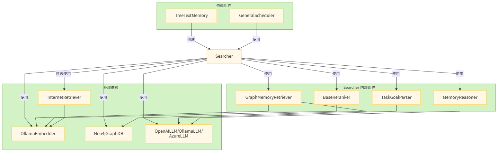
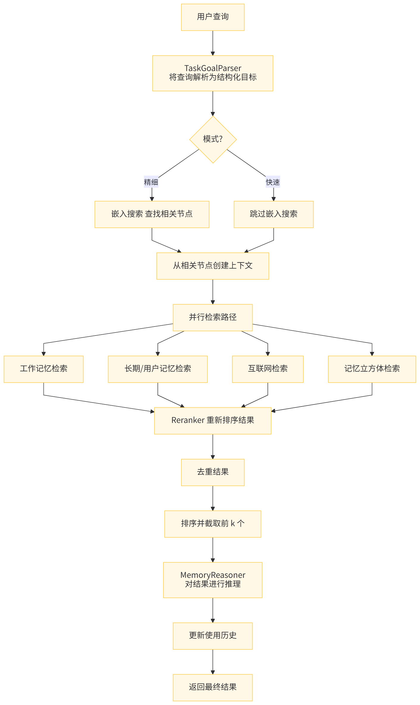

# 【Agent】MemOS 源码笔记---(3)---搜索

目录

* [【Agent】MemOS 源码笔记---(3)---搜索](#agentmemos-源码笔记---3---搜索)
  + [0x00 摘要](#0x00-摘要)
  + [0x01 分类](#0x01-分类)
  + [0x02 混合搜索（Hybrid Search）--- Searcher](#0x02-混合搜索hybrid-search----searcher)
    - [2.1 定义](#21-定义)
    - [2.2 核心函数](#22-核心函数)
    - [2.3 依赖关系和关联关系](#23-依赖关系和关联关系)
      * [2.3.1 依赖项（Searcher 依赖的组件）](#231-依赖项searcher-依赖的组件)
      * [2.3.2 依赖 Searcher 的组件](#232-依赖-searcher-的组件)
    - [2.4 图例](#24-图例)
      * [2.4.1 Searcher 组件关系流程图](#241-searcher-组件关系流程图)
      * [2.4.2 Searcher 详细搜索过程流程](#242-searcher-详细搜索过程流程)
    - [2.5 TaskGoalParser](#25-taskgoalparser)
      * [2.5.1 主要功能](#251-主要功能)
      * [2.5.2 工作模式](#252-工作模式)
        + [Fast 模式](#fast-模式)
        + [Fine 模式](#fine-模式)
      * [2.5.3 输出结构](#253-输出结构)
      * [2.5.4 prompt](#254-prompt)
      * [2.5.5 优势](#255-优势)
    - [2.6 GraphMemoryRetriever](#26-graphmemoryretriever)
      * [2.6.1 主要功能](#261-主要功能)
      * [2.6.2 核心方法](#262-核心方法)
      * [2.6.3 工作流程总结](#263-工作流程总结)
    - [2.7 Reranker](#27-reranker)
      * [2.7.1 主要功能](#271-主要功能)
      * [2.7.2 工作流程总结](#272-工作流程总结)
    - [2.8 MemoryReasoner](#28-memoryreasoner)
      * [2.8.1 主要功能](#281-主要功能)
      * [2.8.2 核心方法](#282-核心方法)
      * [2.8.3 提示词](#283-提示词)
      * [2.8.4 工作流程总结](#284-工作流程总结)
      * [2.8.5 优势](#285-优势)
    - [2.9 Reranker 和 Reasoner](#29-reranker-和-reasoner)
      * [2.9.1 Reranker 的作用](#291-reranker-的作用)
      * [2.9.2 Reasoner 的作用](#292-reasoner-的作用)
      * [2.9.3 为什么需要两者结合？](#293-为什么需要两者结合)
      * [2.9.4 具体示例](#294-具体示例)
  + [0x03 子图检索](#0x03-子图检索)
    - [3.1 功能](#31-功能)
    - [3.2 代码](#32-代码)
  + [0x04 图数据库](#0x04-图数据库)
    - [4.1 示例](#41-示例)
    - [4.2 get\_neighbors\_by\_tag](#42-get_neighbors_by_tag)
      * [4.2.1 功能概述](#421-功能概述)
      * [4.2.2 应用场景](#422-应用场景)
      * [4.2.3 参数说明](#423-参数说明)
      * [4.2.4 筛选机制](#424-筛选机制)
      * [4.2.5 检索流程](#425-检索流程)
      * [4.2.6 性能优化](#426-性能优化)

## 0x00 摘要

TreeTextMemory 提供了一个完整的记忆管理系统，能存储、组织、检索和维护各种类型的文本记忆、适用需要复杂记忆管理的AI系统。这是一个基于图的、树形明文记忆，支持以结构化方式组织、关联并检索记忆，同时保留丰富的上下文信息与良好的可解释性。我们可以通过这个TreeTextMemory 对象与庞大的知识库进行交互，为AI赋予专业的领域记忆。当前使用Neo4j作为后端，未来计划支持更多图数据库。

因为字数太多，因此把TreeTextMemory拆分为两部分，上一篇介绍基本概念和如何管理，本篇介绍如何搜索。

## 0x01 分类

TreeTextMemory 主要支持几种搜索（注，有些是从其他途径透出）：

* 混合搜索（Hybrid Search），通过 Searcher.search 方法对外提供服务，整合多种检索策略的结果，具体策略如下：
  + 结合向量相似度搜索和图遍历：在 GraphMemoryRetriever中利用图结构和向量信息
  + 全文检索：虽然没有显式的全文搜索API，但可以通过互联网检索器从搜索引擎获取相关内容  
    InternetRetriever 组件允许集成外部搜索服务（如Google、Bing、Bocha）
* 子图检索（Subgraph Retrieval），通过 get\_relevant\_subgraph 方法可以直接进行子图搜索
  + 使用 graph\_store.search\_by\_embedding 方法获取指定节点周围的局部子图结构
  + 支持设置遍历深度和中心节点状态条件
  + 返回包含核心节点、邻居节点和边的完整子图信息

以下是图数据库的API，比如位于MemOS-main\src\memos\graph\_dbs\nebular.py中，在一些示例中也直接使用：

* 基于元数据的结构化查询（Metadata-based Structured Query）

  + 通过 get\_by\_metadata方法根据节点元数据字段进行精确匹配或条件查询
  + 支持多种操作符：等于（=）、包含（contains）、在列表中（in）等
  + 可以组合多个条件进行复杂查询
* 标签重叠查询（Tag Overlap Query）

  + 使用 get\_neighbors\_by\_tag方法查找具有相似标签的相邻节点
  + 通过计算标签交集大小来确定相关性
  + 支持设置最小标签重叠数要求
* 向量相似度搜索（Vector Similarity Search）

  + 基于嵌入（embedding）的语义相似度搜索
  + 使用 search\_by\_embedding 方法根据查询向量找到最相似的记忆节点
  + 支持设置相似度阈值和返回结果数量限制

其中最主要的查询接口是 search方法，它内部整合了多种检索策略来提供最优的搜索结果。

## 0x02 混合搜索（Hybrid Search）--- Searcher

Searcher 由 TreeTextMemory 创建并作为主要的搜索接口使用，Searcher 是整个记忆检索系统的核心协调者，负责整合各种检索源并提供高质量的检索结果。Searcher 类的主要功能是执行记忆检索任务。以下是其核心职责和工作流程：

* 多路径并行检索，同时从多个来源检索相关信息：
  + 工作记忆（WorkingMemory）
  + 长期记忆（LongTermMemory）
  + 用户记忆（UserMemory）
  + 互联网检索器（可选）
  + MemCubes（可选）
* 任务解析与查询优化
  + 使用 TaskGoalParser 解析用户查询意图
  + 根据不同模式（fast/fine）采用不同的检索策略
  + 在精细模式下先进行嵌入搜索获取上下文
* 结果重排序与去重
  + 使用 reranker 对检索结果进行重新排序
  + 去除重复的记忆项
  + 保留最相关的结果
* 高级推理处理
  + 利用 MemoryReasoner 对检索到的记忆进行推理和知识综合
  + 提取最有价值的信息片段
* 使用历史追踪
  + 更新记忆项的使用历史记录
  + 并发处理使用统计更新

### 2.1 定义

```
class Searcher:
    def __init__(
        self,
        dispatcher_llm: OpenAILLM | OllamaLLM | AzureLLM,
        graph_store: Neo4jGraphDB,
        embedder: OllamaEmbedder,
        reranker: BaseReranker,
        internet_retriever: InternetRetrieverFactory | None = None,
        moscube: bool = False,
    ):
        self.graph_store = graph_store
        self.embedder = embedder

        self.task_goal_parser = TaskGoalParser(dispatcher_llm)
        self.graph_retriever = GraphMemoryRetriever(self.graph_store, self.embedder)
        self.reranker = reranker
        self.reasoner = MemoryReasoner(dispatcher_llm)

        # Create internet retriever from config if provided
        self.internet_retriever = internet_retriever
        self.moscube = moscube

        self._usage_executor = ContextThreadPoolExecutor(max_workers=4, thread_name_prefix="usage")
```

### 2.2 核心函数

其核心方法如下：

* search()：主入口，协调整个检索过程
* \_parse\_task()：解析任务和查询
* \_retrieve\_paths()：执行多路径检索
* \_deduplicate\_results()：结果去重
* \_sort\_and\_trim()：排序和截断结果
* update\_usage\_history()：更新使用历史

主入口如下，或者说Searcher 编排搜索流水线如下：

* 查询解析和理解
* 从多个来源并行检索
* 结果重新排序
* 去重处理
* 对结果进行推理
* 使用情况跟踪

```
    @timed
    def search(
        self,
        query: str,
        top_k: int,
        info=None,
        mode="fast",
        memory_type="All",
        search_filter: dict | None = None,
    ) -> list[TextualMemoryItem]:
        """
        Search for memories based on a query.
        User query -> TaskGoalParser -> GraphMemoryRetriever ->
        MemoryReranker -> MemoryReasoner -> Final output
        Args:
            query (str): The query to search for.
            top_k (int): The number of top results to return.
            info (dict): Leave a record of memory consumption.
            mode (str, optional): The mode of the search.
            - 'fast': Uses a faster search process, sacrificing some precision for speed.
            - 'fine': Uses a more detailed search process, invoking large models for higher precision, but slower performance.
            memory_type (str): Type restriction for search.
            ['All', 'WorkingMemory', 'LongTermMemory', 'UserMemory']
            search_filter (dict, optional): Optional metadata filters for search results.
        Returns:
            list[TextualMemoryItem]: List of matching memories.
        """
        logger.info(
            f"[SEARCH] Start query='{query}', top_k={top_k}, mode={mode}, memory_type={memory_type}"
        )
        if not info:
            logger.warning(
                "Please input 'info' when use tree.search so that "
                "the database would store the consume history."
            )
            info = {"user_id": "", "session_id": ""}
        else:
            logger.debug(f"[SEARCH] Received info dict: {info}")

        parsed_goal, query_embedding, context, query = self._parse_task(
            query, info, mode, search_filter=search_filter
        )
        results = self._retrieve_paths(
            query, parsed_goal, query_embedding, info, top_k, mode, memory_type, search_filter
        )
        deduped = self._deduplicate_results(results)
        final_results = self._sort_and_trim(deduped, top_k)
        self._update_usage_history(final_results, info)

        logger.info(f"[SEARCH] Done. Total {len(final_results)} results.")
        res_results = ""
        for _num_i, result in enumerate(final_results):
            res_results += "\n" + (
                result.id + "|" + result.metadata.memory_type + "|" + result.memory
            )
        logger.info(f"[SEARCH] Results. {res_results}")
        return final_results
```

### 2.3 依赖关系和关联关系

#### 2.3.1 依赖项（Searcher 依赖的组件）

Searcher 依赖的组件如下：

* 大语言模型组件：
  + dispatcher\_llm – 用于任务解析和推理
  + TaskGoalParser – 将用户查询解析为结构化目标
* 存储组件：
  + graph\_store – Neo4j 图数据库用于存储记忆
  + GraphMemoryRetriever – 从图存储中检索记忆
* 处理组件：
  + embedder – 为查询和记忆创建嵌入向量
  + reranker – 对检索结果进行重新排序
  + MemoryReasoner – 对检索到的记忆进行推理
  + internet\_retriever – 可选的互联网搜索功能

#### 2.3.2 依赖 Searcher 的组件

依赖 Searcher 的组件如下：

* TreeTextMemory – 在其 search 方法中使用 Searcher
* GeneralScheduler – 通过检索器在 process\_session\_turn 中使用 Searcher

### 2.4 图例

Searcher 被调度器系统用于在查询处理过程中检索相关记忆，总的来说，Searcher 充当一个中央协调者，将各种组件整合在一起，为跨不同记忆源和外部数据提供全面的检索能力。

#### 2.4.1 Searcher 组件关系流程图



#### 2.4.2 Searcher 详细搜索过程流程

用户查询 → TaskGoalParser 解析 → 多路径并行检索 → 结果重排序 → 去重处理 → 推理优化 → 返回最终结果。

各组件详细说明

**主要阶段**

* 任务解析：使用 TaskGoalParser 解析查询，根据模式决定是否使用 LLM
* 并行检索：同时执行多个检索路径
* 结果重排：使用 Reranker 对各路径的结果进行重排
* 合并去重：合并所有路径的结果并去除重复项
* 排序截取：按分数排序并截取前 K 个结果
* 更新记录：更新使用历史记录

**并行检索路径**

* 路径 A：工作内存检索 (WorkingMemory)
* 路径 B：长期和用户内存检索 (LongTermMemory, UserMemory)
* 路径 C：互联网检索（可选）
* 路径 D：MemCubes 检索（可选）

**数据流向**

输入查询经过解析后，被分发到多个检索路径并行处理，每个路径都会产生一批候选结果。这些结果经过重排、合并，最后经过去重、排序和截取得到最终结果。整个过程中还会更新使用历史记录以便后续优化。



用户搜索流程如下：用户查询 → TaskGoalParser 解析 → 多路径并行检索 → 结果重排序 → 去重处理 → 推理优化 → 返回最终结果。

其中涉及到如下组件：


因此，我们按照如下流程进行分析。

### 2.5 TaskGoalParser

\_parse\_task 方法主要是使用 TaskGoalParser 来分析query。

```
        parsed_goal = self.task_goal_parser.parse(
            task_description=query,
            context="\n".join(context),
            conversation=info.get("chat_history", []),
            mode=mode,
        )
```

TaskGoalParser 是一个任务目标解析器，负责将用户的自然语言查询解析为结构化的语义层表示，以便后续的检索系统能够更有效地理解和处理查询。

#### 2.5.1 主要功能

TaskGoalParser 主要功能为：

* 查询解析。

  + 将用户输入的自然语言查询转换为结构化的查询表示
  + 提供两种解析模式：快速模式（fast）和精细模式（fine）
* 结构化语义表示

  + 将查询分解为多个语义层次：主题（topic）、关键词（keys）、标签（tags）等  
    提取查询的核心意图和相关信息

#### 2.5.2 工作模式

##### Fast 模式

```
def _parse_fast(self, task_description: str, limit_num: int = 5) -> ParsedTaskGoal:
    # 快速模式：简单的分词处理
    return ParsedTaskGoal(
        memories=[task_description],
        keys=[task_description],
        tags=[],
        goal_type="default",
        rephrased_query=task_description,
        internet_search=False,
```

##### Fine 模式

```
def _parse_fine(
    self, query: str, context: str = "", conversation: list[dict] | None = None
) -> ParsedTaskGoal:
    # 精细模式：使用 LLM 进行结构化解析
    # 构建提示词并调用 LLM 进行解析
    prompt = Template(TASK_PARSE_PROMPT).substitute(
        task=query.strip(), context=context, conversation=conversation_prompt
    )
    response = self.llm.generate(messages=[{"role": "user", "content": prompt}])
    return self._parse_response(response)
```

#### 2.5.3 输出结构

TaskGoalParser 解析后的结果存储在 ParsedTaskGoal 对象中，包含以下字段：

* memories：相关记忆项列表
* keys：关键词列表
* tags：标签列表
* rephrased\_query：重述的查询（更清晰的表达）
* internet\_search：是否需要联网搜索
* goal\_type：目标类型

#### 2.5.4 prompt

```
TASK_PARSE_PROMPT = """
You are a task parsing expert. Given a user task instruction, optional former conversation and optional related memory context,extract the following structured information:
1. Keys: the high-level keywords directly relevant to the user’s task.
2. Tags: thematic tags to help categorize and retrieve related memories.
3. Goal Type: retrieval | qa | generation
4. Rephrased instruction: Give a rephrased task instruction based on the former conversation to make it less confusing to look alone. If you think the task instruction is easy enough to understand, or there is no former conversation, set "rephrased_instruction" to an empty string.
5. Need for internet search: If the user's task instruction only involves objective facts or can be completed without introducing external knowledge, set "internet_search" to False. Otherwise, set it to True.
6. Memories: Provide 2–5 short semantic expansions or rephrasings of the rephrased/original user task instruction. These are used for improved embedding search coverage. Each should be clear, concise, and meaningful for retrieval.

Former conversation (if any):
\"\"\"
$conversation
\"\"\"

Task description(User Question):
\"\"\"$task\"\"\"

Context (if any):
\"\"\"$context\"\"\"

Return strictly in this JSON format, note that the
keys/tags/rephrased_instruction/memories should use the same language as the
input query:
{
  "keys": [...],
  "tags": [...],
  "goal_type": "retrieval | qa | generation",
  "rephrased_instruction": "...", # return an empty string if the original instruction is easy enough to understand
  "internet_search": True/False,
  "memories": ["...", "...", ...]
}
"""
```

#### 2.5.5 优势

总的来说，TaskGoalParser 在记忆检索系统中扮演着“查询理解器”的角色，通过解析用户查询为结构化表示，为后续的检索和推理过程提供更精确的输入。其优势为：

* 灵活性：支持两种解析模式，适应不同性能和精度需求
* 结构化：将自然语言查询转换为结构化表示，便于后续处理
* 上下文感知：在精细模式下可以考虑上下文和对话历史
* 错误处理：当精细模式失败时会回退到快速模式

### 2.6 GraphMemoryRetriever

GraphMemoryRetriever 是一个统一的记忆检索器，结合了图结构检索和向量相似性检索两种方式，用于从知识图谱中检索相关记忆项。

#### 2.6.1 主要功能

GraphMemoryRetriever 实现混合检索，这种设计使得系统既能利用结构化信息进行精确检索，又能通过向量相似性捕获语义相关的内容，从而提高了检索的准确性和召回率。

* 混合检索机制
  + 结构化图检索：基于解析后的任务目标（keys/tags）进行精确匹配
  + 向量相似性检索：基于查询嵌入进行语义相似度搜索
  + 合并两种检索结果并去重
* 多范围记忆检索
  + 支持不同类型的记忆范围：WorkingMemory、LongTermMemory、UserMemory
  + 针对不同范围采用不同的检索策略

#### 2.6.2 核心方法

* retrieve 方法：这是主要的检索入口，执行以下步骤：

  + 对于 WorkingMemory，直接获取所有条目；
  + 对于其他记忆类型，同时执行 \_graph\_recall 和 \_vector\_recall；
  + 合并结果并去除重复项。
* \_graph\_recall 方法：执行基于图结构的检索：

  + 基于 keys 进行精确匹配检索；
  + 基于 tags 进行包含匹配检索；
  + 对候选结果进行后过滤，确保至少有 2 个标签重叠。
* \_vector\_recall 方法：执行基于向量的相似性检索：

  + 使用查询嵌入在图数据库中搜索最相似的记忆项；
  + 支持带过滤条件的搜索和不带过滤条件的搜索路径；
  + 并发执行多个搜索任务以提高效率。
* retrieve\_from\_cube 方法：专门用于从特定的 cube 中检索记忆项，这在多租户或分片场景中很有用。

#### 2.6.3 工作流程总结

* 接收用户查询和解析后的任务目标
* 并行执行图结构检索和向量检索
* 合并两种检索结果
* 去除重复项并返回最终结果

### 2.7 Reranker

使用 CosineLocalReranker 做解析。CosineLocalReranker 是一个本地实现的重排序器，它使用余弦相似度算法对检索到的记忆项进行重新排序，以提高检索结果的相关性。

#### 2.7.1 主要功能

主要功能是余弦相似度计算

* 计算查询向量与候选记忆项向量之间的余弦相似度
* 支持单个查询向量与多个候选向量的同时计算

#### 2.7.2 工作流程总结

* 接收来自 GraphMemoryRetriever 的初步检索结果
* 获取查询的嵌入向量和候选记忆项的嵌入向量
* 计算查询向量与每个候选向量的余弦相似度
* 根据记忆项的层级类型应用相应权重
* 按照加权相似度分数对结果进行排序
* 返回前 K 个最相关的结果给下一个处理阶段

这种设计使得系统能够在本地快速完成重排序操作，而无需依赖外部服务，同时通过层级权重机制可以优先考虑某些类型的记忆项，从而提高检索结果的质量。

### 2.8 MemoryReasoner

MemoryReasoner 是一个专门负责对检索到的记忆项进行推理和知识综合的组件。它的主要职责是对从不同来源检索到的记忆进行分析、筛选和优化，从而提供更精确和相关的记忆结果。

#### 2.8.1 主要功能

* 记忆推理与综合
  + 接收原始查询和已检索的相关记忆项
  + 利用大型语言模型分析多个检索到的记忆项
  + 根据用户的查询目标综合相关信息
  + 生成更加精确和相关的记忆响应

* 智能筛选
  + 通过 LLM 判断哪些记忆项与当前查询最相关
  + 只返回经过筛选的相关记忆项

#### 2.8.2 核心方法

reason 是主要的推理方法，执行以下步骤：

* 构建提示词：

  + 使用模板 REASON\_PROMPT 构建推理提示词
  + 将检索到的记忆项格式化为字符串列表
* 调用 LLM：

  + 将构建好的提示词发送给语言模型生成响应
* 解析响应：

  + 提取模型选择的记忆项 ID
  + 返回对应的记忆项列表

parse\_selected\_ids 方法负责从模型响应中提取选定的记忆项 ID：

* JSON 解析：首先尝试将响应解析为 JSON 格式
* 正则表达式回退：如果 JSON 解析失败，则使用正则表达式匹配 UUID 格式的 ID

#### 2.8.3 提示词

```
REASON_PROMPT = """
You are a reasoning agent working with a memory system. You will synthesize knowledge from multiple memory cards to construct a meaningful response to the task below.

Task: ${task}

Memory cards (with metadata):
${detailed_memory_list}

Please perform:
1. Clustering by theme (topic/concept/fact)
2. Identify useful chains or connections
3. Return a curated list of memory card IDs with reasons.

Output in JSON:
{
  "selected_ids": [...],
  "explanation": "..."
}
"""
```

#### 2.8.4 工作流程总结

* 接收来自上一阶段的检索和重排序结果
* 构建推理提示词：

  + 将用户的查询、解析后的任务目标以及检索到的记忆项组合成一个结构化的提示词
  + 使用预定义的 REASON\_PROMPT 模板
* 调用 LLM 进行推理：

  + 将构建好的提示词发送给大型语言模型
  + 使用 LLM 进一步分析和推理这些记忆项的相关性
  + 获取模型的响应，该响应包含对记忆项的相关性判断
* 解析和筛选结果：

  + 解析 LLM 的响应，提取被选中的记忆项 ID
  + 支持两种解析方式：
    - JSON 格式：直接提取 selected\_ids 字段
    - 文本格式：通过正则表达式匹配 UUID 模式
* 返回精选记忆：

  + 根据解析出的 ID 列表筛选原始记忆项
  + 返回最相关的结果子集

这种设计使得系统能够利用 LLM 的理解和推理能力，从大量检索到的记忆中选出最符合用户需求的部分，提高了系统的准确性和智能化水平。

#### 2.8.5 优势

* 智能化处理：利用 LLM 的理解能力对记忆项进行语义层面的分析
* 灵活性：支持多种输出格式的解析
* 精准性：能够进一步提升检索结果的相关性和质量

总的来说，MemoryReasoner 在整个记忆检索系统中扮演着“智能筛选器”的角色，通过引入 LLM 的推理能力，使系统能够更准确地理解用户需求并返回最相关的记忆项。

### 2.9 Reranker 和 Reasoner

在系统中同时使用 Reranker 和 Reasoner 是为了实现不同层次的检索结果处理和优化，它们各自承担不同的职责。

#### 2.9.1 Reranker 的作用

Reranker（重排序器）主要负责对初步检索结果进行相关性重新排序：

* 功能：基于查询和候选结果的相似度计算，对检索结果进行重新排序
* 方法：通常使用数学计算（如余弦相似度）来评估相关性
* 输出：返回按相关性得分排序的记忆项列表

```
def rerank(self, query, graph_results, top_k, **kwargs):
    # 计算相似度
    sims = _cosine_one_to_many(query_embedding, cand_vecs)
    # 应用权重调整
    weighted = [sim * get_weight(it) for sim, it in zip(sims, items_with_emb)]
    # 排序并返回前 K 个结果
    scored_pairs.sort(key=lambda x: x[1], reverse=True)
    return scored_pairs[:top_k]
```

#### 2.9.2 Reasoner 的作用

Reasoner（推理器）主要负责对排序后的结果进行语义理解和推理：

* 功能：基于语言模型对检索到的记忆项进行语义理解和推理
* 方法：使用大语言模型分析查询和记忆项之间的深层语义关系
* 输出：返回经过语义推理筛选后的最终记忆项

```
def reason(self, query, ranked_memories, parsed_goal):
    # 构建推理提示
    prompt = prompt_template.substitute(task=query, detailed_memory_list=memory_detailed_str)
    # 使用 LLM 进行推理
    response = self.llm.generate([{"role": "user", "content": prompt}])
    # 解析并返回推理结果
    selected_ids = self._parse_selected_ids(content)
    return [m for m in ranked_memories if m.id in id_set]
```

#### 2.9.3 为什么需要两者结合？

1. 不同的处理层次

Reranker：在数学向量空间中进行快速相关性计算

Reasoner：在语义层面进行深度理解和推理

2. 互补的优势

   效率 vs 精度：Reranker 快速筛选，Reasoner 精确推理

   定量 vs 定性：Reranker 基于数值计算，Reasoner 基于语义理解

系统设计优势

* 性能优化：避免直接对大量候选结果使用昂贵的 LLM 推理
* 精度提升：先用数学方法粗筛，再用语义方法精筛
* 模块化设计：两个组件职责分明，便于独立优化和替换
* 适应不同场景：
  + 快速模式：可能只使用 Reranker
  + 精细模式：两者都使用以获得最佳结果

这种设计使得系统既能在保证检索质量的同时控制计算成本，又能根据不同的应用场景灵活调整处理流程。

#### 2.9.4 具体示例

假设用户查询：“机器学习中的梯度下降算法如何工作？”

* 初始检索：系统可能检索到 100 个相关记忆项
* Reranker 处理：
  + 计算查询与每个记忆项的余弦相似度
  + 根据层级权重（topic/concept/fact）调整得分
  + 返回前 20 个最相关的记忆项
* Reasoner 处理：
  + 将前 20 个记忆项和查询一起交给 LLM
  + LLM 分析哪些记忆项真正回答了用户的问题
  + 可能发现只有其中 5 个记忆项真正相关且互补
  + 返回这 5 个最合适的记忆项

## 0x03 子图检索

### 3.1 功能

get\_relevant\_subgraph方法的功能是：

* 查找与查询相关的局部子图（Find Relevant Local Subgraph）

  + 接收用户查询字符串作为输入
  + 通过嵌入模型将查询转换为向量表示
  + 在图数据库中搜索与查询向量最相似的前k个节点
* 构建邻域子图（Build Neighborhood Subgraphs），对每个相似节点：

  + 确保其状态符合指定条件（默认为"activated"）
  + 获取以该节点为中心、指定深度（默认2跳）的局部子图
  + 收集中心节点、邻居节点和连接边

* 合并多个子图为统一结构（Merge Subgraphs）
  + 将所有检索到的局部子图合并成一个连通的子图
  + 去除重复节点和边
  + 返回包含以下信息的字典结构：
    - core\_id: 最匹配的核心节点ID
    - nodes: 合并后的唯一节点列表
    - edges: 合并后的唯一边列表

这种方法特别适用于需要理解复杂关系和上下文的场景，比如：

* 查找与特定主题相关的知识网络片段
* 进行多跳推理以发现间接关联
* 提供可解释的记忆检索结果，展示节点间的关系路径

主要优势在于它不仅返回相关节点，还保留了它们之间的语义关系结构，这对于高级推理任务非常有用。

### 3.2 代码

具体代码如下：

```
    def get_relevant_subgraph(
        self, query: str, top_k: int = 5, depth: int = 2, center_status: str = "activated"
    ) -> dict[str, Any]:
        """
        Find and merge the local neighborhood sub-graphs of the top-k
        nodes most relevant to the query.
         Process:
             1. Embed the user query into a vector representation.
             2. Use vector similarity search to find the top-k similar nodes.
             3. For each similar node:
                 - Ensure its status matches `center_status` (e.g., 'active').
                 - Retrieve its local subgraph up to `depth` hops.
                 - Collect the center node, its neighbors, and connecting edges.
             4. Merge all retrieved subgraphs into a single unified subgraph.
             5. Return the merged subgraph structure.

         Args:
             query (str): The user input or concept to find relevant memories for.
             top_k (int, optional): How many top similar nodes to retrieve. Default is 5.
             depth (int, optional): The neighborhood depth (number of hops). Default is 2.
             center_status (str, optional): Status condition the center node must satisfy (e.g., 'active').

         Returns:
             dict[str, Any]: A subgraph dict with:
                 - 'core_id': ID of the top matching core node, or None if none found.
                 - 'nodes': List of unique nodes (core + neighbors) in the merged subgraph.
                 - 'edges': List of unique edges (as dicts with 'from', 'to', 'type') in the merged subgraph.
        """
        # Step 1: Embed query
        query_embedding = self.embedder.embed([query])[0]

        # Step 2: Get top-1 similar node
        similar_nodes = self.graph_store.search_by_embedding(query_embedding, top_k=top_k)
        if not similar_nodes:
            logger.info("No similar nodes found for query embedding.")
            return {"core_id": None, "nodes": [], "edges": []}

        # Step 3: Fetch neighborhood
        all_nodes = {}
        all_edges = set()
        cores = []

        for node in similar_nodes:
            core_id = node["id"]
            score = node["score"]

            subgraph = self.graph_store.get_subgraph(
                center_id=core_id, depth=depth, center_status=center_status
            )

            if not subgraph["core_node"]:
                logger.info(f"Skipping node {core_id} (inactive or not found).")
                continue

            core_node = subgraph["core_node"]
            neighbors = subgraph["neighbors"]
            edges = subgraph["edges"]

            # Collect nodes
            all_nodes[core_node["id"]] = core_node
            for n in neighbors:
                all_nodes[n["id"]] = n

            # Collect edges
            for e in edges:
                all_edges.add((e["source"], e["target"], e["type"]))

            cores.append(
                {"id": core_id, "score": score, "core_node": core_node, "neighbors": neighbors}
            )

        top_core = cores[0]
        return {
            "core_id": top_core["id"],
            "nodes": list(all_nodes.values()),
            "edges": [{"source": f, "target": t, "type": ty} for (f, t, ty) in all_edges],
        }
```

## 0x04 图数据库

因为图数据库比较复杂，我们通过示例来进行学习，以管窥豹。

### 4.1 示例

run\_user\_session 函数中便有搜索内容。

```
def run_user_session(
    user_name: str,
    db_name: str,
    topic_text: str,
    concept_texts: list[str],
    fact_texts: list[str],
):
    print(f"\n=== {user_name} starts building their memory graph ===")

    # Manually initialize correct GraphDB class
    config = GraphDBConfigFactory(
        backend="nebular",
        config={
            "uri": json.loads(os.getenv("NEBULAR_HOSTS", "localhost")),
            "user": os.getenv("NEBULAR_USER", "root"),
            "password": os.getenv("NEBULAR_PASSWORD", "xxxxxx"),
            "space": db_name,
            "user_name": user_name,
            "use_multi_db": False,
            "auto_create": True,
            "embedding_dimension": embedder_dimension,
        },
    )
    graph = GraphStoreFactory.from_config(config)

    # Start with a clean slate for this user
    graph.clear()

    now = datetime.now(timezone.utc).isoformat()

    # === Step 1: Create a root topic node (e.g., user's research focus) ===
    topic = TextualMemoryItem(
        memory=topic_text,
        metadata=TreeNodeTextualMemoryMetadata(
            memory_type="LongTermMemory",
            key="Research Topic",
            hierarchy_level="topic",
            type="fact",
            memory_time="2024-01-01",
            status="activated",
            visibility="public",
            tags=["research", "rl"],
            updated_at=now,
            embedding=embed_memory_item(topic_text),
        ),
    )
    graph.add_node(topic.id, topic.memory, topic.metadata.model_dump(exclude_none=True))

    # === Step 2: Create two concept nodes linked to the topic ===
    concept_items = []
    for i, text in enumerate(concept_texts):
        concept = TextualMemoryItem(
            memory=text,
            metadata=TreeNodeTextualMemoryMetadata(
                memory_type="LongTermMemory",
                key=f"Concept {i + 1}",
                hierarchy_level="concept",
                type="fact",
                memory_time="2024-01-01",
                status="activated",
                visibility="public",
                updated_at=now,
                embedding=embed_memory_item(text),
                tags=["concept"],
                confidence=90 + i,
            ),
        )
        graph.add_node(concept.id, concept.memory, concept.metadata.model_dump(exclude_none=True))
        graph.add_edge(topic.id, concept.id, type="PARENT")
        concept_items.append(concept)

    # === Step 3: Create supporting facts under each concept ===
    for i, text in enumerate(fact_texts):
        fact = TextualMemoryItem(
            memory=text,
            metadata=TreeNodeTextualMemoryMetadata(
                memory_type="WorkingMemory",
                key=f"Fact {i + 1}",
                hierarchy_level="fact",
                type="fact",
                memory_time="2024-01-01",
                status="activated",
                visibility="public",
                updated_at=now,
                embedding=embed_memory_item(text),
                confidence=85.0,
                tags=["fact"],
            ),
        )
        graph.add_node(fact.id, fact.memory, fact.metadata.model_dump(exclude_none=True))
        graph.add_edge(concept_items[i % len(concept_items)].id, fact.id, type="PARENT")

    # === Step 4: Retrieve memory using semantic search ===
    vector = embed_memory_item("How is memory retrieved?")
    search_result = graph.search_by_embedding(vector, top_k=2)
    for r in search_result:
        node = graph.get_node(r["id"])
        print("🔍 Search result:", node["memory"])

    # === Step 5: Tag-based neighborhood discovery ===
    neighbors = graph.get_neighbors_by_tag(["concept"], exclude_ids=[], top_k=2)
    print("📎 Tag-related nodes:", [neighbor["memory"] for neighbor in neighbors])

    # === Step 6: Retrieve children (facts) of first concept ===
    children = graph.get_children_with_embeddings(concept_items[0].id)
    print("📍 Children of concept:", [child["memory"] for child in children])

    # === Step 7: Export a local subgraph and grouped statistics ===
    subgraph = graph.get_subgraph(topic.id, depth=2)
    print("📌 Subgraph node count:", len(subgraph["neighbors"]))

    stats = graph.get_grouped_counts(["memory_type", "status"])
    print("📊 Grouped counts:", stats)

    # === Step 8: Demonstrate updates and cleanup ===
    graph.update_node(
        concept_items[0].id, {"confidence": 99.0, "created_at": "2025-07-24T20:11:56.375687"}
    )
    graph.remove_oldest_memory("WorkingMemory", keep_latest=1)
    graph.delete_edge(topic.id, concept_items[0].id, type="PARENT")
    graph.delete_node(concept_items[1].id)

    # === Step 9: Export and re-import the entire graph structure ===
    exported = graph.export_graph()
    graph.import_graph(exported)
    print("📦 Graph exported and re-imported, total nodes:", len(exported["nodes"]))

    # ====================================
    # 🔍 Step 10: extra function
    # ====================================
    print(f"\n=== 🔍 Extra Tests for user: {user_name} ===")

    print(" - Memory count:", graph.get_memory_count("LongTermMemory"))
    print(" - Node count:", graph.count_nodes("LongTermMemory"))
    print(" - All LongTermMemory items:", graph.get_all_memory_items("LongTermMemory"))

    if len(exported["edges"]) > 0:
        n1, n2 = exported["edges"][0]["source"], exported["edges"][0]["target"]
        print(" - Edge exists?", graph.edge_exists(n1, n2, exported["edges"][0]["type"]))
        print(" - Edges for node:", graph.get_edges(n1))

    filters = [{"field": "memory_type", "op": "=", "value": "LongTermMemory"}]
    print(" - Metadata query result:", graph.get_by_metadata(filters))
    print(
        " - Optimization candidates:", graph.get_structure_optimization_candidates("LongTermMemory")
    )
    try:
        graph.drop_database()
    except ValueError as e:
        print(" - drop_database raised ValueError as expected:", e)
```

### 4.2 get\_neighbors\_by\_tag

get\_neighbors\_by\_tag 功能说明如下：

#### 4.2.1 功能概述

get\_neighbors\_by\_tag 是基于标签的邻居节点检索方法，用于在图数据库中查找与给定节点具有相似标签的相邻节点。通过计算标签重叠度识别语义相关节点，支持基于标签的图遍历与推荐。

#### 4.2.2 应用场景

记忆重组阶段发现具有共同主题或概念的相关记忆节点。

支持推理与关联分析，构建记忆之间的语义连接。

用于聚类分析，识别标签组合相似的节点群组。

#### 4.2.3 参数说明

* tags (list[str])：目标标签列表，用于匹配相似节点。
* \_exclude\_ids (list[str])：需排除的节点 ID 列表，避免返回自身或已知节点。
* top\_k (int)：返回结果数量上限，默认通常为 5。
* min\_overlap (int)：最小标签重叠数，仅返回满足该条件的节点。

#### 4.2.4 筛选机制

* 标签交集计算：比较目标标签与候选节点标签的交集大小确定相关性。
* 最小重叠阈值：仅返回标签重叠数≥min\_overlap 的节点。
* 排除机制：过滤 \_exclude\_ids 指定的节点，防止循环引用。

#### 4.2.5 检索流程

* 根据输入标签在图数据库中查找包含这些标签的所有节点。
* 计算每个候选节点与目标标签集合的交集大小。
* 过滤不满足最小重叠要求的节点。
* 按标签重叠程度排序并截取前 k 个节点。

#### 4.2.6 性能优化

* 利用图数据库索引加速标签查询。
* 通过批量操作减少数据库访问次数。
* 支持并发执行，提高大规模图检索效率。

MemOS-main\src\memos\graph\_dbs\nebular.py 代码如下：

```
    @timed
    def get_neighbors_by_tag(
        self,
        tags: list[str],
        exclude_ids: list[str],
        top_k: int = 5,
        min_overlap: int = 1,
        include_embedding: bool = False,
    ) -> list[dict[str, Any]]:
        """
        Find top-K neighbor nodes with maximum tag overlap.

        Args:
            tags: The list of tags to match.
            exclude_ids: Node IDs to exclude (e.g., local cluster).
            top_k: Max number of neighbors to return.
            min_overlap: Minimum number of overlapping tags required.
            include_embedding: with/without embedding

        Returns:
            List of dicts with node details and overlap count.
        """
        if not tags:
            return []

        where_clauses = [
            'n.status = "activated"',
            'NOT (n.node_type = "reasoning")',
            'NOT (n.memory_type = "WorkingMemory")',
        ]
        if exclude_ids:
            where_clauses.append(f"NOT (n.id IN {exclude_ids})")

        where_clauses.append(f'n.user_name = "{self.config.user_name}"')

        where_clause = " AND ".join(where_clauses)
        tag_list_literal = "[" + ", ".join(f'"{_escape_str(t)}"' for t in tags) + "]"

        return_fields = self._build_return_fields(include_embedding)
        query = f"""
            LET tag_list = {tag_list_literal}

            MATCH (n@Memory /*+ INDEX(idx_memory_user_name) */)
            WHERE {where_clause}
            RETURN {return_fields},
               size( filter( n.tags, t -> t IN tag_list ) ) AS overlap_count
            ORDER BY overlap_count DESC
            LIMIT {top_k}
            """

        result = self.execute_query(query)
        neighbors: list[dict[str, Any]] = []
        for r in result:
            props = {k: v.value for k, v in r.items() if k != "overlap_count"}
            parsed = self._parse_node(props)
            parsed["overlap_count"] = r["overlap_count"].value
            neighbors.append(parsed)

        neighbors.sort(key=lambda x: x["overlap_count"], reverse=True)
        neighbors = neighbors[:top_k]
        result = []
        for neighbor in neighbors[:top_k]:
            neighbor.pop("overlap_count")
            result.append(neighbor)
        return result
```
