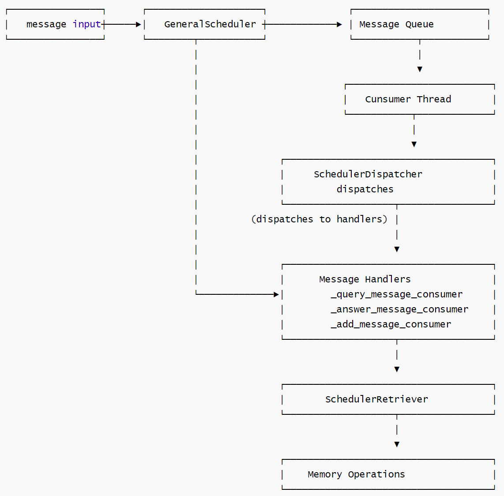
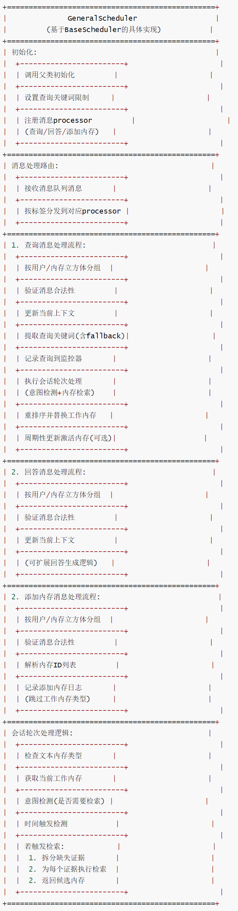
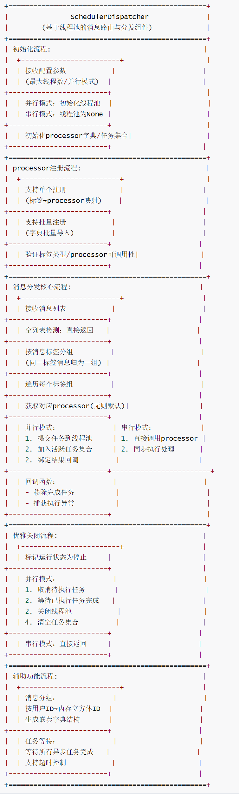
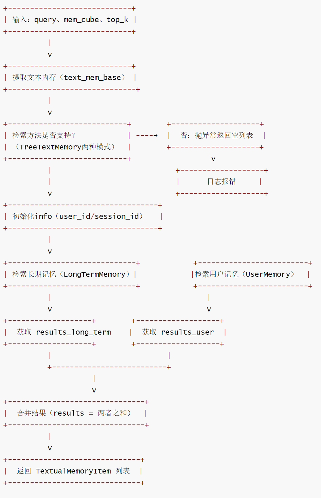
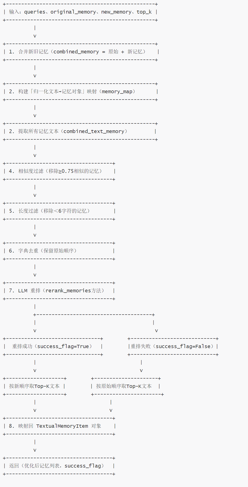
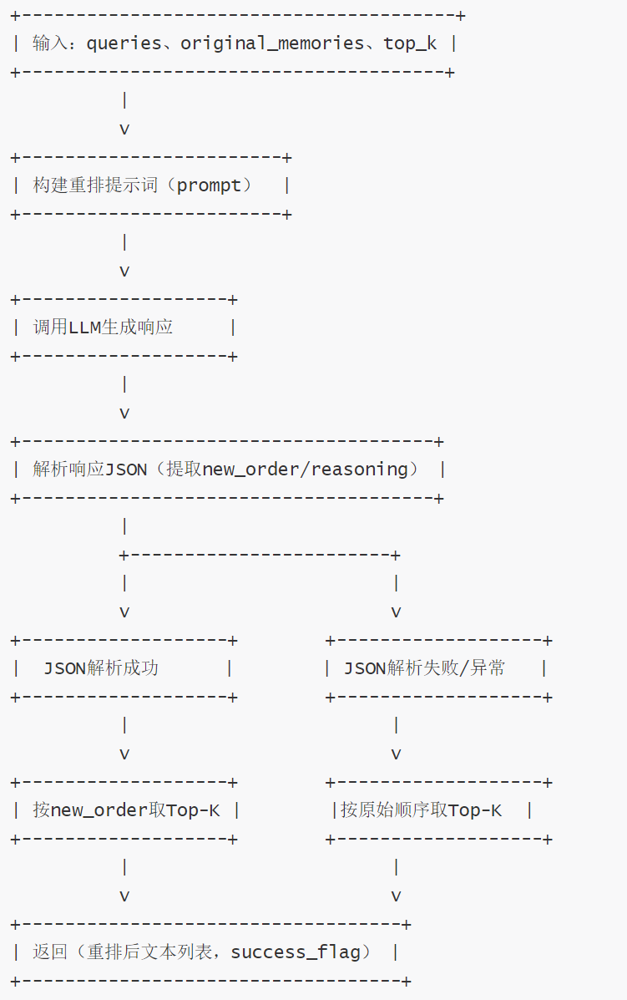

# 【Agent】MemOS 源码笔记---(7)---MemScheduler 细节

目录

* [【Agent】MemOS 源码笔记---(7)---MemScheduler 细节](#agentmemos-源码笔记---7---memscheduler-细节)
  + [0x00 摘要](#0x00-摘要)
  + [0x01 组件关系](#0x01-组件关系)
  + [0x02 实现](#0x02-实现)
    - [2.1 GeneralScheduler](#21-generalscheduler)
      * [2.1.1 消息处理](#211-消息处理)
        + [消息类型与processor注册](#消息类型与processor注册)
        + [消息分发过程](#消息分发过程)
      * [2.1.2 流程](#212-流程)
      * [2.1.3 完整代码](#213-完整代码)
    - [2.2 SchedulerDispatcher](#22-schedulerdispatcher)
      * [2.2.1 分发逻辑](#221-分发逻辑)
      * [2.2.2 流程](#222-流程)
      * [2.2.3 代码](#223-代码)
    - [2.3 SchedulerRetriever](#23-schedulerretriever)
      * [2.3.1 功能](#231-功能)
      * [2.3.2 详细步骤说明](#232-详细步骤说明)
      * [2.3.3 调用关系](#233-调用关系)
      * [2.3.4 实现](#234-实现)
        + [记忆检索流程（search 方法）](#记忆检索流程search-方法)
        + [记忆全流程处理与重排（process\_and\_rerank\_memories 方法）](#记忆全流程处理与重排process_and_rerank_memories-方法)
        + [LLM 记忆重排流程（rerank\_memories 方法）](#llm-记忆重排流程rerank_memories-方法)
        + [代码](#代码)
  + [0x03 关联](#0x03-关联)
    - [3.1 SchedulerDispatcher 和 GeneralScheduler](#31-schedulerdispatcher-和-generalscheduler)
    - [3.2 GeneralScheduler 和 TreeTextMemory](#32-generalscheduler-和-treetextmemory)
    - [3.3 总结](#33-总结)
    - [3.4 MosCore](#34-moscore)
  + [0xFF 参考](#0xff-参考)

## 0x00 摘要

记忆调度就像大脑的注意力机制，动态决定在合适的时刻调用合适的记忆。

在 MemOS 中，**记忆调度（Memory Scheduling）** 通过对【不同使用效率（参数>激活>工作>其他明文）的记忆】的相互调度，让模型能更高效、准确地获取用户所需的记忆。在对话和任务进行时，通过预测用户后续对话所需记忆并提前调入高效率记忆类型如激活记忆工作记忆，加速推理链路。

记忆调度的具体实现就是MemScheduler ，这是一个与 MemOS 系统并行运行的并发记忆管理系统，它协调 AI 系统中工作记忆、长时记忆和激活记忆之间的记忆操作。它通过事件驱动调度处理记忆检索、更新和压缩。该系统特别适合需要动态记忆管理的对话代理和推理系统。

备注：本文基于MemOS的文档和源码进行学习，似乎其文档并没有跟上源码更新的速度，而且也有部分功能未实现或者未开源。

前一篇介绍了 MemScheduler 的总体概念，本篇来看看实现细节。

## 0x01 组件关系

最核心的几个组件关系如下：

* GeneralScheduler 是整个调度系统的核心组件，继承自 BaseScheduler，负责处理不同类型的消息（查询、回答、添加等），并协调其他组件完成具体任务。
* SchedulerDispatcher 是消息分发器，负责将不同类型的消息分发给对应的processor，支持并行处理（可选）。
* SchedulerRetriever 是记忆检索器，负责从记忆库中搜索、重排序和过滤记忆项，提供智能记忆管理功能。



MemOS-main\src\memos\templates\mem\_scheduler\_prompts.py 中可以看到使用的prompt。

```
PROMPT_MAPPING = {
    "intent_recognizing": INTENT_RECOGNIZING_PROMPT,
    "memory_reranking": MEMORY_RERANKING_PROMPT,
    "query_keywords_extraction": QUERY_KEYWORDS_EXTRACTION_PROMPT,
    "memory_filtering": MEMORY_FILTERING_PROMPT,
    "memory_redundancy_filtering": MEMORY_REDUNDANCY_FILTERING_PROMPT,
    "memory_combined_filtering": MEMORY_COMBINED_FILTERING_PROMPT,
    "memory_answer_ability_evaluation": MEMORY_ANSWER_ABILITY_EVALUATION_PROMPT,
}
```

## 0x02 实现

### 2.1 GeneralScheduler

BaseScheduler是基类，而GeneralScheduler才是真正起作用的派生类。

GeneralScheduler采用生产者-消费者模型进行工作，是基于消息队列的内存调度器。

* 该类是 MemOS 中基于`BaseScheduler`的具体调度器实现，专注于处理查询、回答和添加内存等核心任务。核心组件架构：

  + 消息队列：使用 memos\_message\_queue 来存储待处理的消息。
  + 消费者线程：使用 \_message\_consumer 方法持续轮询队列并处理消息。
  + 分发器：SchedulerDispatcher 负责将消息路由到对应的processor。
  + 处理器：针对不同消息类型的具体processor。
* 核心功能包括：

  + 注册消息类型（查询 / 回答 / 添加）注册对应的processor，实现任务的定向分发；
  + 处理查询消息时，提取关键词、更新查询监控、执行内存检索与重排序，并支持激活内存的周期性更新；
  + 处理添加内存消息时，记录新增内存日志并同步到监控系统；
  + 基于会话对话轮次逻辑，根据意图检测和时间触发机制决定决定是否执行内存检索，确保工作内存的时效性和相关性。
* 特色是基于消息类型的模块化处理机制，结合意图识别和时间触发的混合调度策略，支持按用户和内存立方体分组处理消息，保证多用户场景下的内存隔离和处理效率。

#### 2.1.1 消息处理

SchedulerDispatcher将消息路由到适当的处理器。

##### 消息类型与processor注册

初始化时注册了三种消息processor。

```
        # register handlers
        handlers = {
            QUERY_LABEL: self._query_message_consumer,
            ANSWER_LABEL: self._answer_message_consumer,
            ADD_LABEL: self._add_message_consumer,
        }
        self.dispatcher.register_handlers(handlers)
```

* \_query\_message\_consumer：处理用户查询 QUERY\_LABEL，触发记忆检索和重排序
* \_answer\_message\_consumer：处理系统回答 ANSWER\_LABEL。
* \_add\_message\_consumer：处理新增记忆请求 ADD\_LABEL。

QUERY\_LABEL在memos/mem\_scheduler/schemas/general\_schemas.py文件中定义为一个常量：

* QUERY\_LABEL="query"
* ANSWER\_LABEL ="anSwer"
* ADD\_LABEL = "add"

这是一个预定义的字符串常量，值为"query"。

##### 消息分发过程

* 消息提交：通过submit\_messages 将ScheduleMessageItem放入消息队列。
* 消息消费：\_message\_consumer 线程定期从队列中取出所有消息。
* 消息分发：调用self.dispatcher.dispatch(messages)按消息标签分发到对应的processor。

#### 2.1.2 流程

GeneralScheduler的流程如下。



#### 2.1.3 完整代码

```
class GeneralScheduler(BaseScheduler):
    """通用调度器，实现查询、回答和添加内存等具体任务的处理逻辑"""

    def __init__(self, config: GeneralSchedulerConfig):
        """使用给定定配置初始化通用调度器"""
        super().__init__(config)

        # 查询关键词数量限制（从配置获取，默认20）
        self.query_key_words_limit = self.config.get("query_key_words_limit", 20)

        # 注册消息processor（按消息标签绑定对应的处理方法）
        handlers = {
            QUERY_LABEL: self._query_message_consumer,  # 处理查询消息
            ANSWER_LABEL: self._answer_message_consumer,  # 处理回答消息
            ADD_LABEL: self._add_message_consumer,  # 处理添加内存消息
        }
        self.dispatcher.register_handlers(handlers)

    def _query_message_consumer(self, messages: list[ScheduleMessageItem]) -> None:
        """
        处理和响应队列中的查询触发消息

        参数:
            messages: 要处理的查询消息列表
        """
        # 按用户和内存立方体分组处理消息
        grouped_messages = self.dispatcher.group_messages_by_user_and_cube(messages=messages)

        # 验证消息合法性（确保标签与消息类型匹配）
        self.validate_schedule_messages(messages=messages, label=QUERY_LABEL)

        # 遍历分组消息，按用户和内存立方体处理
        for user_id in grouped_messages:
            for mem_cube_id in grouped_messages[user_id]:
                messages = grouped_messages[user_id][mem_cube_id]
                if len(messages) == 0:
                    return

                # 获取当前内存立方体实例
                mem_cube = messages[0].mem_cube

                # 从消息更新当前上下文（线程安全）
                self._set_current_context_from_message(msg=messages[0])

                # 更新查询监控器（为每个消息注册查询记录）
                for msg in messages:
                    # 若监控器不存在则创建
                    self.monitor.register_query_monitor_if_not_exists(
                        user_id=user_id, mem_cube_id=mem_cube_id
                    )

                    # 提取查询内容和关键词
                    query = msg.content
                    query_keywords = self.monitor.extract_query_keywords(query=query)

                    # 关键词提取失败时的 fallback 逻辑
                    if len(query_keywords) == 0:
                        stripped_query = query.strip()
                        # 根据语言类型选择分词方式
                        if is_all_english(stripped_query):
                            words = stripped_query.split()  # 英文按空格分词
                        elif is_all_chinese(stripped_query):
                            words = stripped_query  # 中文按字符处理
                        else:
                            words = stripped_query  # 混合语言默认按字符处理

                        # 取前N个关键词（去重）
                        query_keywords = list(set(words[: self.query_key_words_limit]))

                    # 创建查询监控项并添加到数据库
                    item = QueryMonitorItem(
                        user_id=user_id,
                        mem_cube_id=mem_cube_id,
                        query_text=query,
                        keywords=query_keywords,
                        max_keywords=DEFAULT_MAX_QUERY_KEY_WORDS,
                    )

                    # 同步到数据库
                    query_db_manager = self.monitor.query_monitors[user_id][mem_cube_id]
                    query_db_manager.obj.put(item=item)
                    query_db_manager.sync_with_orm()  # 添加后同步到数据库

                # 提取所有查询内容
                queries = [msg.content for msg in messages]

                # 执行会话轮次处理（检索相关内存）
                cur_working_memory, new_candidates = self.process_session_turn(
                    queries=queries,
                    user_id=user_id,
                    mem_cube_id=mem_cube_id,
                    mem_cube=mem_cube,
                    top_k=self.top_k,
                )

                # 重排序内存重排序并替换工作内存
                new_order_working_memory = self.replace_working_memory(
                    user_id=user_id,
                    mem_cube_id=mem_cube_id,
                    mem_cube=mem_cube,
                    original_memory=cur_working_memory,
                    new_memory=new_candidates,
                )

                # 若启用激活内存，执行周期性更新
                if self.enable_activation_memory:
                    self.update_activation_memory_periodically(
                        interval_seconds=self.monitor.act_mem_update_interval,
                        label=QUERY_LABEL,
                        user_id=user_id,
                        mem_cube_id=mem_cube_id,
                        mem_cube=messages[0].mem_cube,
                    )

    def _answer_message_consumer(self, messages: list[ScheduleMessageItem]) -> None:
        """
        处理和响应队列中的回答触发消息

        参数:
          messages: 要处理的回答消息列表
        """
        # 按用户和内存立方体分组处理消息
        grouped_messages = self.dispatcher.group_messages_by_user_and_cube(messages=messages)

        # 验证消息合法性
        self.validate_schedule_messages(messages=messages, label=ANSWER_LABEL)

        # 遍历分组消息，更新上下文（具体回答逻辑可在此扩展）
        for user_id in grouped_messages:
            for mem_cube_id in grouped_messages[user_id]:
                messages = grouped_messages[user_id][mem_cube_id]
                if len(messages) == 0:
                    return

                # 从消息更新当前上下文
                self._set_current_context_from_message(msg=messages[0])

    def _add_message_consumer(self, messages: list[ScheduleMessageItem]) -> None:
        """处理和响应队列中的添加内存消息"""
        # 按用户和内存立方体分组处理消息
        grouped_messages = self.dispatcher.group_messages_by_user_and_cube(messages=messages)

        # 验证消息合法性
        self.validate_schedule_messages(messages=messages, label=ADD_LABEL)
        try:
            # 遍历分组消息，处理每个添加内存请求
            for user_id in grouped_messages:
                for mem_cube_id in grouped_messages[user_id]:
                    messages = grouped_messages[user_id][mem_cube_id]
                    if len(messages) == 0:
                        return

                    # 从消息更新当前上下文
                    self._set_current_context_from_message(msg=messages[0])

                    # 处理每条消息中的内存ID列表
                    for msg in messages:
                        try:
                            # 解析消息内容中的内存ID列表（JSON格式）
                            userinput_memory_ids = json.loads(msg.content)
                        except Exception as e:
                            userinput_memory_ids = []

                        # 遍历内存ID，记录添加日志（跳过工作内存类型）
                        mem_cube = msg.mem_cube
                        for memory_id in userinput_memory_ids:
                            mem_item: TextualMemoryItem = mem_cube.text_mem.get(memory_id=memory_id)
                            mem_type = mem_item.metadata.memory_type
                            mem_content = mem_item.memory

                            # 跳过工作内存（通常不需要手动添加）
                            if mem_type == WORKING_MEMORY_TYPE:
                                continue

                            # 记录添加内存的日志
                            self.log_adding_memory(
                                memory=mem_content,
                                memory_type=mem_type,
                                user_id=msg.user_id,
                                mem_cube_id=msg.mem_cube_id,
                                mem_cube=msg.mem_cube,
                                log_func_callback=self._submit_web_logs,
                            )

        except Exception as e:
            logger.error(f"Error: {e}", exc_info=True)

    def process_session_turn(
        self,
        queries: str | list[str],
        user_id: UserID | str,
        mem_cube_id: MemCubeID | str,
        mem_cube: GeneralMemCube,
        top_k: int = 10,
    ) -> tuple[list[TextualMemoryItem], list[TextualMemoryItem]] | None:
        """
        处理对话轮次：
        - 当查询列表达到窗口大小时，触发内存检索；
        - 若检索被触发，立即切换到新内存。
        """

        # 获取文本内存实例（仅支持TreeTextMemory类型）
        text_mem_base = mem_cube.text_mem
        if not isinstance(text_mem_base, TreeTextMemory):
            logger.error(
                f"未实现！期望TreeTextMemory，但获取到{type(text_mem_base).__name__} "
                f"（mem_cube_id={mem_cube_id}，user_id={user_id}）。 "
                f"text_mem_base值：{text_mem_base}",
                exc_info=True,
            )
            return None

        # 获取当前工作内存及文本内容
        cur_working_memory: list[TextualMemoryItem] = text_mem_base.get_working_memory()
        text_working_memory: list[str] = [w_m.memory for w_m in cur_working_memory]
        # 检测查询意图（判断是否需要触发检索）
        intent_result = self.monitor.detect_intent(
            q_list=queries, text_working_memory=text_working_memory
        )

        # 检查是否达到时间触发条件
        time_trigger_flag = False
        if self.monitor.timed_trigger(
            last_time=self.monitor.last_query_consume_time,
            interval_seconds=self.monitor.query_trigger_interval,
        ):
            time_trigger_flag = True

        # 根据意图和时间触发条件决定是否执行检索
        if (not intent_result["trigger_retrieval"]) and (not time_trigger_flag):
            return None
        elif (not intent_result["trigger_retrieval"]) and time_trigger_flag:
            intent_result["trigger_retrieval"] = True
            intent_result["missing_evidences"] = queries
        else:
            logger.info(
                f"触发查询调度（user_id={user_id}，mem_cube_id={mem_cube_id}）。 "
                f"缺失证据：{intent_result['missing_evidences']}"
            )

        # 处理缺失的证据（需要检索的内容）
        missing_evidences = intent_result["missing_evidences"]
        num_evidence = len(missing_evidences)
        # 为每个证据分配Top-K配额（确保至少返回1条）
        k_per_evidence = max(1, top_k // max(1, num_evidence))
        new_candidates = []

        # 为每个缺失证据执行检索
        for item in missing_evidences:
            info = {
                "user_id": user_id,
                "session_id": "",
            }

            # 执行检索
            results: list[TextualMemoryItem] = self.retriever.search(
                query=item,
                mem_cube=mem_cube,
                top_k=k_per_evidence,
                method=self.search_method,
                info=info,
            )
            new_candidates.extend(results)

        # 返回当前工作内存和新检索到的候选内存
        return cur_working_memory, new_candidates
```

### 2.2 SchedulerDispatcher

SchedulerDispatcher 负责将消息路由到对应的processor。SchedulerDispatcher 不使用任何模型进行消息分发或分类判断。下面是它的工作原理：

* 该类是基于线程池的消息分发器，核心作用是根据消息标签（label）将消息路由到对应的processor，实现消息的定向批量处理。
* 核心功能包括：支持单个 / 批量注册消息processor、按用户 ID 和内存立方体 ID 分组消息、串行 / 并行两种分发模式、优雅关闭和任务监控。
* 特色是采用上下文感知线程池（ContextThreadPoolExecutor），支持并行任务执行以提升效率；消息分组机制保证同用户同内存立方体的消息集中处理，避免上下文混乱；完善的任务生命周期管理（取消、等待、异常捕获）确保系统稳定。

#### 2.2.1 分发逻辑

SchedulerDispatcher 是基于消息标签进行操作的，而不是使用任何机器学习模型或大语言模型进行分类，具体分发逻辑如下：

* 消息分组：将消息按标签进行分组。
* processor查找：依据标签查找注册的processor。处理函数在初始化时被明确注册。
* 执行模式：
  + 串行模式：直接调用processor
  + 并行模式：通过线程池异步执行

消息通过其标签属性进行分发

```
class ScheduleMessageItem:
    def __init__(self, label: str, content: str, ...):
        self.label = label  # 分发键
        self.content = content
        # ... 其他属性
```

调度器使用简单的字典查找来路由消息到处理函数，在 SchedulerDispatcher.dispatch() 中：

```
label_groups = defaultdict(list)
for message in msg_list:
    label_groups[message.label].append(message)  # 按标签分组

for label, msgs in label_groups.items():
    handler = self.handlers.get(label, self._default_message_handler)
    handler(msgs)  # 基于标签直接调用函数
```

当启用并行分发时，也只是并行执行处理函数，但仍不使用模型进行路由：

```
if self.enable_parallel_dispatch and self.dispatcher_executor is not None:
    future = self.dispatcher_executor.submit(handler, msgs)  # 并行执行
```

消息流程示例

```
传入消息
├── 带有标签的消息 "query"
│       ├── 没有模型参与确定使用哪个处理函数
│       │
│       ├── 按标签分组
│       │
│       └── 查找 "query" 处理函数
│           ├── 调用已注册的 _query_message_consumer 函数直接调用
│
└── 并行处理（如果启用）
```

#### 2.2.2 流程

SchedulerDispatcher的流程如下。



#### 2.2.3 代码

```
class SchedulerDispatcher(BaseSchedulerModule):
    """
    基于线程池的消息分发器，根据消息标签将消息路由到专用processor。

    特性：
    - 每个消息标签对应独立的线程池处理逻辑
    - 支持批量消息处理
    - 支持优雅关闭
    - 支持批量注册processor
    """

    def __init__(self, max_workers=30, enable_parallel_dispatch=False):
        super().__init__()
        self.max_workers = max_workers  # 线程池最大工作线程数

        # 仅在并行模式下初始化线程池
        self.enable_parallel_dispatch = enable_parallel_dispatch
        self.thread_name_prefix = "dispatcher"  # 线程名称前缀
        if self.enable_parallel_dispatch:
            self.dispatcher_executor = ContextThreadPoolExecutor(
                max_workers=self.max_workers, thread_name_prefix=self.thread_name_prefix
            )
        else:
            self.dispatcher_executor = None  # 串行模式下线程池为None

        self.handlers: dict[str, Callable] = {}  # 已注册的消息processor（标签→processor映射）
        self._running = False  # 分发器运行状态标识
        self._futures = set()  # 用于监控的活跃任务集合

    def register_handler(self, label: str, handler: Callable[[list[ScheduleMessageItem]], None]):
        """
        为特定消息标签注册processor函数。

        参数:
            label: 要处理的消息标签
            handler: 处理该标签消息的可调用对象，接收消息列表作为参数
        """
        self.handlers[label] = handler

    def register_handlers(
        self, handlers: dict[str, Callable[[list[ScheduleMessageItem]], None]]
    ) -> None:
        """
        从字典中批量注册多个processor。

        参数:
            handlers: 标签到processor函数的映射字典，格式：{标签: processor可调用对象}
        """
        for label, handler in handlers.items():
            # 验证标签类型（必须为字符串）
            if not isinstance(label, str):
                continue
            # 验证processor是否可调用
            if not callable(handler):
                continue
            # 注册单个processor
            self.register_handler(label=label, handler=handler)

    def _default_message_handler(self, messages: list[ScheduleMessageItem]) -> None:
        """默认消息processor（当找不到对应标签的processor时使用）"""
        logger.debug(f"使用默认消息processor处理消息：{messages}")

    def group_messages_by_user_and_cube(
        self, messages: list[ScheduleMessageItem]
    ) -> dict[str, dict[str, list[ScheduleMessageItem]]]:
        """
        将消息按用户ID和内存立方体ID分组，生成嵌套字典结构。

        参数:
            messages: 要分组的ScheduleMessageItem对象列表

        返回:
            嵌套字典，结构如下：
            {
                "user_id_1": {
                    "mem_cube_id_1": [消息1, 消息2, ...],
                    "mem_cube_id_2": [消息3, 消息4, ...],
                    ...
                },
                "user_id_2": {
                    ...
                },
                ...
            }
            其中每个消息保持原始ScheduleMessageItem对象
        """
        # 初始化嵌套默认字典（自动创建不存在的键）
        grouped_dict = defaultdict(lambda: defaultdict(list))

        # 按用户ID→内存立方体ID的层级分组消息
        for msg in messages:
            grouped_dict[msg.user_id][msg.mem_cube_id].append(msg)

        # 将默认字典转换为普通字典，输出更简洁
        return {user_id: dict(cube_groups) for user_id, cube_groups in grouped_dict.items()}

    def _handle_future_result(self, future: Future):
        """处理异步任务结果，捕获异常并清理任务集合"""
        self._futures.remove(future)  # 从活跃任务集合中移除已完成任务
         future.result()  # 获取任务结果，触发可能的异常

    def dispatch(self, msg_list: list[ScheduleMessageItem]):
        """
        将消息列表分发到对应的processor。

        参数:
            msg_list: 要处理的ScheduleMessageItem对象列表
        """
        if not msg_list:
            return

        # 按消息标签分组（同一标签的消息交给同一个processor）
        label_groups = defaultdict(list)
        for message in msg_list:
            label_groups[message.label].append(message)

        # 处理每个标签对应的消息组
        for label, msgs in label_groups.items():
            # 获取该标签对应的processor，无则使用默认processor
            handler = self.handlers.get(label, self._default_message_handler)
            # 并行模式：提交任务到线程池异步执行
            if self.enable_parallel_dispatch and self.dispatcher_executor is not None:
                # 提交任务到线程池，捕获变量避免循环引用问题
                future = self.dispatcher_executor.submit(handler, msgs)
                self._futures.add(future)  # 将任务添加到活跃任务集合
                # 绑定任务完成回调函数
                future.add_done_callback(self._handle_future_result)
                logger.info(f"已将 {len(msgs)} 条消息作为异步任务分发")
            # 串行模式：直接调用processor同步执行
            else:
                handler(msgs)

    def join(self, timeout: float | None = None) -> bool:
        """等待所有已分发任务完成。

        参数:
            timeout: 最大等待时间（秒），None表示无限等待

        返回:
            bool: 所有任务完成返回True，超时返回False
        """
        # 串行模式下无异步任务，直接返回True
        if not self.enable_parallel_dispatch or self.dispatcher_executor is None:
            return True

        # 等待所有活跃任务完成
        done, not_done = concurrent.futures.wait(
            self._futures, timeout=timeout, return_when=concurrent.futures.ALL_COMPLETED
        )

        # 检查已完成任务中的异常
        for future in done:
            try:
                future.result()
            except Exception:
                logger.error("关闭过程中processor执行失败", exc_info=True)

        # 返回是否所有任务都已完成
        return len(not_done) == 0
```

### 2.3 SchedulerRetriever

SchedulerRetriever 是MemOS中负责记忆检索和重排序的核心模块，是连接查询和记忆存储的关键桥梁，负责确保系统能够准确、高效地检索和排序相关记忆。

内存检索与推理的本质是：在正确时间找到正确信息。

#### 2.3.1 功能

SchedulerRetriever 的功能如下：

* 记忆检索功能
  + 搜索实现：通过 search 方法在文本记忆库中查找与查询相关的记忆项
  + 支持多种搜索模式：
    - 快速搜索（fast mode）
    - 精细搜索（fine mode）
    - 多类型记忆检索：同时搜索长期记忆和用户记忆
* 记忆重排序
  + LLM辅助重排序：使用 rerank\_memories 方法通过大语言模型对检索到的记忆进行重新排序
  + 智能相关性判断：基于查询内容判断记忆的相关性，提升记忆使用的准确性
* 记忆处理与过滤
  + 记忆去重：使用 filter\_vector\_based\_similar\_memories 过滤过于相似的记忆项
  + 长度过滤：使用 filter\_too\_short\_memories 移除过短的记忆项
  + 无关记忆过滤：通过 filter\_unrelated\_memories 移除与当前查询历史无关的记忆
  + 冗余记忆过滤：通过 filter\_redundant\_memories 移除重复的记忆项
* 记忆整合：在 process\_and\_rerank\_memories 方法中整合原始记忆和新检索的记忆，进行统一处理

#### 2.3.2 详细步骤说明

SchedulerRetriever 的详细步骤如下：

* 搜索阶段：根据查询在 TreeTextMemory 中搜索相关记忆项
* 合并阶段：将原始记忆和新检索的记忆合并成一个列表
* 相似度过滤：使用相似度移除过于相似的记忆项
* 长度过滤：移除过短的记忆项（默认阈值为6个字符）
* 去重处理：确保记忆项唯一性，同时保持原有顺序
* LLM重排序：利用大语言模型根据查询相关性对记忆进行重新排序
* 无关记忆过滤：移除与查询历史无关的记忆项
* 返回结果：返回优化后的记忆列表供系统使用

#### 2.3.3 调用关系

一般来说，业界的**检索时机**有两种主要方法：

* **主动检索**：在每轮开始时自动加载记忆，确保上下文始终可用，但会为不需要记忆访问的轮次引入不必要延迟
* **反应式检索**（内存即工具）：代理被赋予查询记忆的工具，自行决定何时检索上下文，更高效但需要额外LLM调用

SchedulerRetriever 作为 BaseScheduler 的核心组件，主要在处理用户查询和更新工作记忆时被调用，负责记忆的检索、处理、重排序和过滤等核心功能，具体场景为：

* 初始化：在BaseScheduler 的initialize\_modules中建立SchedulerRetriever 实例。
* 查询处理：当 GeneralScheduler 接收到 QUERY\_LABEL 消息时，调用 process\_session\_turn 方法触发 self.retriever.search() 来检索相关记忆。
* 工作记忆更新：在 replace\_working\_memory 过程中对候选记忆进行处理和重排序

```
└── GeneralScheduler._query_message_consumer()
  └── BaseScheduler.process_session_turn()
      └── SchedulerRetriever.search() --------> 检索相关记忆

└── BaseScheduler.replace_working_memory()
  └── SchedulerRetriever.process_and_rerank_memories() ------> 处理和重排序记忆
      └──SchedulerRetriever.filter_unrelated_memories() -----> 过滤无关记忆
```

#### 2.3.4 实现

##### 记忆检索流程（search 方法）

作为对比，从业界角度看，一般会从多个维度评估潜在记忆，单纯依赖基于向量的相关性是常见陷阱。相似性得分可能找出概念相似但过时或琐碎的记忆。最有效策略是结合所有三个维度的混合方法：

* **相关性**（语义相似性）：与当前对话的概念关联度
* **新鲜度**（基于时间）：记忆创建的时间远近
* **重要性**（显著性）：记忆的整体关键程度

SchedulerRetriever的 search方法会 调用TreeTextMemory的功能来进行搜索。



##### 记忆全流程处理与重排（process\_and\_rerank\_memories 方法）



##### LLM 记忆重排流程（rerank\_memories 方法）



##### 代码

```
class SchedulerRetriever(BaseSchedulerModule):
    """
    MemOS 记忆检索与优化调度器
    核心功能：检索树状文本内存、合并新旧记忆、多维度过滤、LLM 智能重排，为 Agent 提供精准记忆支持
    继承自 BaseSchedulerModule，遵循 MemOS 调度器模块统一接口规范
    """
    def __init__(self, process_llm: BaseLLM, config: BaseSchedulerConfig):
        """
        初始化检索调度器实例
        Args:
            process_llm: 用于记忆重排的 LLM 实例（BaseLLM 基类对象）
            config: 调度器配置对象（BaseSchedulerConfig 基类，包含过滤、检索等参数）
        """
        super().__init__()  # 调用父类 BaseSchedulerModule 的初始化方法

        # 超参数配置：记忆过滤阈值
        self.filter_similarity_threshold = 0.75  # 相似度过滤阈值（≥0.75 的记忆视为重复）
        self.filter_min_length_threshold = 6     # 长度过滤阈值（字符数＜6 的记忆视为过短，将被过滤）

        self.config: BaseSchedulerConfig = config  # 保存调度器配置
        self.process_llm = process_llm             # 保存用于重排的 LLM 实例

        # 初始化记忆过滤器：委托处理「无关记忆」和「冗余记忆」过滤逻辑
        self.memory_filter = MemoryFilter(process_llm=process_llm, config=config)

    def search(
        self,
        query: str,
        mem_cube: GeneralMemCube,
        top_k: int,
        method: str = TreeTextMemory_SEARCH_METHOD,
        info: dict | None = None,
    ) -> list[TextualMemoryItem]:
        """
        根据查询语句在文本内存中检索相关记忆
        Args:
            query: 检索查询字符串（如 Agent 的当前对话查询）
            mem_cube: 记忆立方体（GeneralMemCube，MemOS 中存储各类记忆的核心数据结构）
            top_k: 返回的Top-K 相关记忆数量
            method: 检索方法（默认使用 TreeTextMemory 的标准搜索方法）
            info: 检索附加信息（需包含 user_id、session_id，用于记录记忆使用历史）

        Returns:
            检索到的文本型记忆项列表（list[TextualMemoryItem]）；检索失败返回空列表
        """
        text_mem_base = mem_cube.text_mem  # 从记忆立方体中提取文本内存核心实例
        try:
            # 仅支持 TreeTextMemory 的两种检索方法
            if method in [TreeTextMemory_SEARCH_METHOD, TreeTextMemory_FINE_SEARCH_METHOD]:
                # 断言文本内存类型为 TreeTextMemory（确保检索方法兼容性）
                assert isinstance(text_mem_base, TreeTextMemory)
                # 若未传入 info，打印警告并初始化空信息（用于历史记录存储）
                if info is None:
                    info = {"user_id": "", "session_id": ""}

                # 根据检索方法设置模式：快速搜索（fast）或精细搜索（fine）
                mode = "fast" if method == TreeTextMemory_SEARCH_METHOD else "fine"
                # 检索长期记忆（LongTermMemory）
                results_long_term = text_mem_base.search(
                    query=query, top_k=top_k, memory_type="LongTermMemory", mode=mode, info=info
                )
                # 检索用户记忆（UserMemory）
                results_user = text_mem_base.search(
                    query=query, top_k=top_k, memory_type="UserMemory", mode=mode, info=info
                )
                # 合并长期记忆和用户记忆的检索结果
                results = results_long_term + results_user
            else:
                # 不支持的检索方法：抛出未实现异常（传入文本内存类型）
                raise NotImplementedError(str(type(text_mem_base)))
        except Exception as e:
            # 检索异常：打印错误日志（包含堆栈信息），返回空列表
            logger.error(f"Fail to search. The exeption is {e}.", exc_info=True)
            results = []
        return results

    def rerank_memories(
        self, queries: list[str], original_memories: list[str], top_k: int
    ) -> Tuple[list[str], bool]:
        """
        基于 LLM 对记忆进行相关性重排（根据查询语句调整记忆顺序）
        Args:
            queries: 用于判断相关性的查询列表（通常为当前对话查询）
            original_memories: 待重排的记忆文本列表
            top_k: 重排后返回的 Top-K 记忆数量

        Returns:
            Tuple[重排后的记忆文本列表（长度≤top_k）, 重排成功标志（bool）]

        Note:
            若 LLM 重排失败（如 JSON 解析异常），降级为原始记忆顺序（截断至 top_k）
        """

        logger.info(f"Starting memory reranking for {len(original_memories)} memories")

        # 构建 LLM 重排提示词（使用 "memory_reranking" 模板）
        prompt = self.build_prompt(
            "memory_reranking",
            queries=[f"[0] {queries[0]}"],  # 格式化查询（仅取第一个查询，标记为 [0]）
            current_order=[f"[{i}] {mem}" for i, mem in enumerate(original_memories)],  # 格式化原始记忆顺序
        )

        # 调用 LLM 生成重排结果（构造用户角色消息）
        response = self.process_llm.generate([{"role": "user", "content": prompt}])

        try:
            # 解析 LLM 响应中的 JSON 数据（期望格式：{"new_order": [索引列表], "reasoning": "重排理由"}）
            response = extract_json_dict(response)
            new_order = response["new_order"][:top_k]  # 提取 Top-K 索引顺序
            # 根据新索引映射回原始记忆文本
            text_memories_with_new_order = [original_memories[idx] for idx in new_order]
            success_flag = True  # 重排成功标志
        except Exception as e:
            # 重排异常（如 JSON 解析失败、键缺失）：打印错误日志，使用原始顺序降级
            text_memories_with_new_order = original_memories[:top_k]  # 截断原始记忆至 top_k
            success_flag = False  # 重排失败标志
        return text_memories_with_new_order, success_flag

    def process_and_rerank_memories(
        self,
        queries: list[str],
        original_memory: list[TextualMemoryItem],
        new_memory: list[TextualMemoryItem],
        top_k: int = 10,
    ) -> Tuple[Optional[list[TextualMemoryItem]], bool]:
        """
        记忆全流程处理：合并新旧记忆 → 过滤冗余/过短记忆 → LLM 重排 → 返回优化后记忆
        Args:
            queries: 用于重排的查询列表（判断记忆相关性的依据）
            original_memory: 原始记忆列表（已存储的历史记忆，TextualMemoryItem 类型）
            new_memory: 新记忆列表（待合并的新增记忆，TextualMemoryItem 类型）
            top_k: 最终返回的最大记忆数量（默认 10）

        Returns:
            Tuple[优化后的 TextualMemoryItem 列表（长度≤top_k）, 处理成功标志（bool）]；失败返回 (None, False)
        """
        # 1. 合并原始记忆和新记忆（形成完整记忆池）
        combined_memory = original_memory + new_memory

        # 2. 构建「归一化文本→记忆对象」的映射（用于后续重排后还原记忆对象）
        # transform_name_to_key：文本归一化函数（如去空格、小写，确保匹配一致性）
        memory_map = {
            transform_name_to_key(name=mem_obj.memory): mem_obj for mem_obj in combined_memory
        }

        # 2. 提取所有记忆的文本内容（用于过滤和重排）
        combined_text_memory = [m.memory for m in combined_memory]

        # 4. 相似度过滤：移除过于相似的记忆（基于向量相似度，阈值 0.75）
        filtered_combined_text_memory = filter_vector_based_similar_memories(
            text_memories=combined_text_memory,
            similarity_threshold=self.filter_similarity_threshold,
        )

        # 5. 长度过滤：移除过短记忆（字符数＜6 的记忆视为无效，阈值 6）
        filtered_combined_text_memory = filter_too_short_memories(
            text_memories=filtered_combined_text_memory,
            min_length_threshold=self.filter_min_length_threshold,
        )

        # 6. 去重：基于归一化文本的字典去重（保留原始顺序）
        unique_memory = list(dict.fromkeys(filtered_combined_text_memory))

        # 7. LLM 智能重排：按与查询的相关性调整记忆顺序
        text_memories_with_new_order, success_flag = self.rerank_memories(
            queries=queries,
            original_memories=unique_memory,
            top_k=top_k,
        )

        # 8. 映射回原始记忆对象（从文本列表还原为 TextualMemoryItem 列表）
        memories_with_new_order = []
        for text in text_memories_with_new_order:
            normalized_text = transform_name_to_key(name=text)  # 文本归一化（确保与 memory_map 键匹配）
            if normalized_text in memory_map:  # 检查归一化文本是否存在于映射中
                memories_with_new_order.append(memory_map[normalized_text])
            else:
                # 日志警告：记忆文本未找到映射（可能是归一化异常或记忆对象缺失）
                logger.warning(
                    f"Memory text not found in memory map. text: {text};\n"
                    f"Keys of memory_map: {memory_map.keys()}"
                )

        return memories_with_new_order, success_flag

    def filter_unrelated_memories(
        self,
        query_history: list[str],
        memories: list[TextualMemoryItem],
    ) -> Tuple[list[TextualMemoryItem], bool]:
        """
        过滤与查询历史无关的记忆（委托给 MemoryFilter 实现）
        Args:
            query_history: 查询历史列表（Agent 的对话历史）
            memories: 待过滤的记忆列表（TextualMemoryItem 类型）
        Returns:
            Tuple[过滤后的记忆列表, 过滤成功标志]
        """
        return self.memory_filter.filter_unrelated_memories(query_history, memories)

    def filter_redundant_memories(
        self,
        query_history: list[str],
        memories: list[TextualMemoryItem],
    ) -> Tuple[list[TextualMemoryItem], bool]:
        """
        过滤冗余记忆（委托给 MemoryFilter 实现）
        Args:
            query_history: 查询历史列表（判断冗余的上下文依据）
            memories: 待过滤的记忆列表（TextualMemoryItem 类型）
        Returns:
            Tuple[过滤后的记忆列表, 过滤成功标志]
        """
        return self.memory_filter.filter_redundant_memories(query_history, memories)

    def filter_unrelated_and_redundant_memories(
        self,
        query_history: list[str],
        memories: list[TextualMemoryItem],
    ) -> Tuple[list[TextualMemoryItem], bool]:
        """
        同时过滤「无关记忆」和「冗余记忆」（基于 LLM 分析，委托给 MemoryFilter 实现）
        Args:
            query_history: 查询历史列表（上下文依据）
            memories: 待过滤的记忆列表（TextualMemoryItem 类型）
        Returns:
            Tuple[过滤后的记忆列表, 过滤成功标志]
        """
        return self.memory_filter.filter_unrelated_and_redundant_memories(query_history, memories)
```

## 0x03 关联

SchedulerDispatcher、GeneralScheduler 和 TreeTextMemory 之间存在明确的依赖和协作关系。

### 3.1 SchedulerDispatcher 和 GeneralScheduler

SchedulerDispatcher 负责消息的分发和处理，是一个底层的消息处理组件。GeneralScheduler 是一个更高级别的调度器，利用 SchedulerDispatcher 来管理不同类型的消息（如查询、回答、添加记忆等）。

* GeneralScheduler 依赖 SchedulerDispatcher
* SchedulerDispatcher 是 GeneralScheduler 的一个组件，在 GeneralScheduler 的 init 方法中，创建了一个 SchedulerDispatcher 实例并赋值给 self.dispatcher

GeneralScheduler 使用 self.dispatcher 来：

* 注册消息处理器（handlers）
* 分发消息（通过 self.dispatcher.dispatch()）
* 批量处理消息（通过 self.dispatcher.group\_messages\_by\_user\_and\_cube()）
* 等待任务完成（通过 self.dispatcher.join()）
* 关闭调度器（通过 self.dispatcher.shutdown()）

### 3.2 GeneralScheduler 和 TreeTextMemory

TreeTextMemory 是记忆存储和检索的核心组件，提供了添加、搜索、更新和删除记忆的功能，GeneralScheduler 利用 TreeTextMemory 来管理记忆的生命周期，处理与记忆相关的各种操作。

* GeneralScheduler 依赖 TreeTextMemory来执行实际的记忆操作
* TreeTextMemory 提供了 GeneralScheduler 所需的记忆存储和检索功能

GeneralScheduler 通过 mem\_cube.text\_mem 访问 TreeTextMemory 实例，GeneralScheduler 使用 TreeTextMemory 来：

* TreeTextMemory 包含了 MemoryManager 和 Searcher 等组件，这些组件被 GeneralScheduler 间接使用
* 获取工作记忆（通过 text\_mem\_base.get\_working\_memory()）
* 搜索记忆（通过 self.retriever.search()，其中 retriever 使用 TreeTextMemory 的搜索功能），检索过程涉及：
  + 使用 TaskGoalParser 解析查询
  + 使用 GraphMemoryRetriever 从图数据库检索记忆
  + 使用 Reranker 对检索到的记忆进行重排序
  + 使用 MemoryReasoner 进行推理以优化结果
* 添加记忆（通过 self.memory\_manager.add()，其中 memory\_manager 与 TreeTextMemory 相关联）
* 替换工作记忆（通过 text\_mem\_base.replace\_working\_memory()）
* 获取记忆（通过 mem\_cube.text\_mem.get(memory\_id=memory\_id)）
* GeneralScheduler 接收不同类型的消息（查询、回答、添加记忆等），根据消息类型，GeneralScheduler 调用相应的处理器，处理器使用 TreeTextMemory 的方法来执行具体操作

GeneralScheduler 和 TreeTextMemory 之间是一种协作关系，其中：

* GeneralScheduler 是一个高级调度器，负责处理不同类型的消息并协调记忆操作
* TreeTextMemory 是记忆操作的实际执行者，提供了存储、检索、更新和组织记忆的功能

两者通过定义良好的接口进行交互，GeneralScheduler 调用 TreeTextMemory 的方法来执行具体操作  
这种设计实现了关注点分离，使调度逻辑和记忆管理逻辑可以独立开发和维护。

协作范例如下：

```
# GeneralScheduler 处理查询消息的简化流程
def process_query(self, query, mem_cube):
    # 1. 获取当前工作记忆
    current_memory = mem_cube.text_mem.get_working_memory()
    # 2. 检索相关记忆
    new_candidates = mem_cube.text_mem.search(query, top_k=self.top_k)
    # 3. 更新工作记忆
    mem_cube.text_mem.replace_working_memory(new_candidates)
```

### 3.3 总结

三者之间的依赖关系可以概括为：

* GeneralScheduler → SchedulerDispatcher（使用其进行消息分发）
* GeneralScheduler → TreeTextMemory（使用其进行记忆操作）

具体来说：

* SchedulerDispatcher 是一个消息分发器，负责将不同类型的消息路由到相应的处理器
* GeneralScheduler 是一个高级调度器，它使用 SchedulerDispatcher 来管理消息，并使用 TreeTextMemory 来处理与记忆相关的操作
* TreeTextMemory 是记忆存储和检索的核心组件，为 GeneralScheduler 提供底层的记忆操作支持

这种设计使得系统能够有效地处理不同类型的消息，并对记忆进行相应的操作，实现了消息处理和记忆管理的解耦。

### 3.4 MosCore

MosCore 是一个很好的范例。

```
MosCore
- uses GeneralMemCube
- uses GeneralScheduler
  - uses MemoryManager
  - uses TreeTextMemory
- uses UserManager
```

在如下代码中，可以管窥。

```
class MOSCore:
    """
    The MOSCore (Memory Operating System Core) class manages multiple MemCube objects and their operations.
    It provides methods for creating, searching, updating, and deleting MemCubes, supporting multi-user scenarios.
    MOSCore acts as an operating system layer for handling and orchestrating MemCube instances.
    """

    def __init__(self, config: MOSConfig, user_manager: UserManager | None = None):
        self.config = config
        self.user_id = config.user_id
        self.session_id = config.session_id
        self.chat_llm = LLMFactory.from_config(config.chat_model)
        self.mem_reader = MemReaderFactory.from_config(config.mem_reader)
        self.chat_history_manager: dict[str, ChatHistory] = {}
        # use thread safe dict for multi-user product-server scenario
        self.mem_cubes: OptimizedThreadSafeDict[str, GeneralMemCube] = (
            OptimizedThreadSafeDict() if user_manager is not None else {}
        )
        self._register_chat_history()

        # Use provided user_manager or create a new one
        if user_manager is not None:
            self.user_manager = user_manager
        else:
            self.user_manager = UserManager(user_id=self.user_id if self.user_id else "root")

        # Initialize mem_scheduler
        self._mem_scheduler_lock = Lock()
        self.enable_mem_scheduler = self.config.get("enable_mem_scheduler", False)
        if self.enable_mem_scheduler:
            self._mem_scheduler = self._initialize_mem_scheduler()
            self._mem_scheduler.mem_cubes = self.mem_cubes
        else:
            self._mem_scheduler: GeneralScheduler = None
```

## 0xFF 参考
