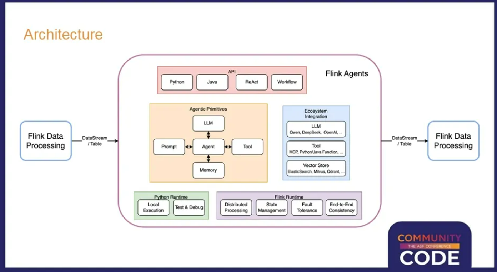
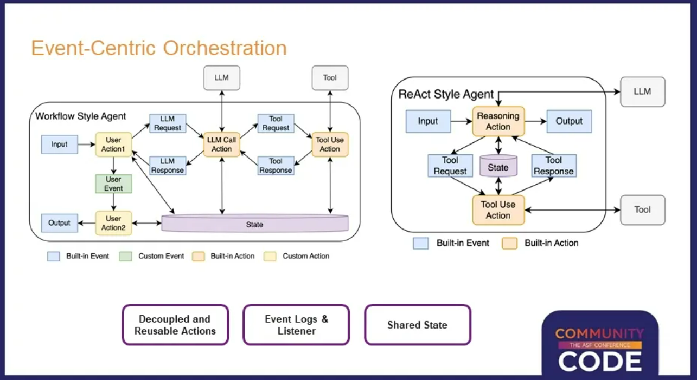

# 【大数据 & AI】Flink Agents 源码解读 --- (1) --- 设计

目录

* [【大数据 & AI】Flink Agents 源码解读 --- (1) --- 设计](#大数据--aiflink-agents-源码解读-----1------设计)
  + [0x00 概述](#0x00-概述)
  + [0x01 目标](#0x01-目标)
    - [1.1 事件驱动的智能体](#11-事件驱动的智能体)
    - [1.2 典型应用场景](#12-典型应用场景)
    - [1.3 事件驱动智能体的技术要求](#13-事件驱动智能体的技术要求)
    - [1.4 核心设计理念](#14-核心设计理念)
    - [1.5 事件驱动编排架构](#15-事件驱动编排架构)
    - [1.6 技术展望](#16-技术展望)
  + [0x02 设计分析](#0x02-设计分析)
    - [2.1 Flink Agents 要解决的核心问题](#21-flink-agents-要解决的核心问题)
      * [2.1.1 问题1：单机局限](#211-问题1单机局限)
      * [2.1.2 问题2：异步 / 分阶段处理](#212-问题2异步--分阶段处理)
      * [2.1.3 问题3：适配鸿沟](#213-问题3适配鸿沟)
      * [2.1.4 问题4：状态一致性](#214-问题4状态一致性)
      * [2.1.5 问题5：兼容性](#215-问题5兼容性)
    - [2.2 针对问题的核心设计](#22-针对问题的核心设计)
      * [2.2.1 问题1：单机局限](#221-问题1单机局限)
      * [2.2.2 问题2：异步 / 分阶段处理](#222-问题2异步--分阶段处理)
      * [2.2.3 问题3：适配鸿沟](#223-问题3适配鸿沟)
      * [2.2.4 问题4：状态一致性](#224-问题4状态一致性)
      * [2.2.5 问题5：兼容性](#225-问题5兼容性)
    - [2.3 关键设计的落地示例](#23-关键设计的落地示例)
    - [2.4 总结](#24-总结)
  + [0xFF 参考](#0xff-参考)

## 0x00 概述

Flink Agents 是Apache Flink社区最近推出的一个全新的项目，一个专门为事件驱动场景设计的智能体框架。该项目聚焦事件驱动型AI智能体，结合Flink的实时处理能力，推动AI在工业场景中的工程化落地，涵盖智能运维、直播分析等典型应用，展现其在AI发展第四层次——智能体AI中的重要意义。

本系列从源码入手，深入解析 / 反推 Flink Agents项目的架构设计。因为属于反推，肯定存在各种错误，还请大家不吝指出。

## 0x01 目标

本节内容 摘录于官方分享"Flink Agents：基于Apache Flink的事件驱动AI智能体框架"。

在人工智能技术快速发展的今天，AI应用从简单的对话交互正在向更加复杂和智能化的方向演进。智能体AI就像给AI的"大脑"配上了"身体"。AI不仅能够思考和分析，还能够像人一样以特定目标为导向，自主分析应该采取什么行动。在这个过程中，AI可以主动获取所需的信息，查阅相关资料，甚至使用各种工具来真正对外界产生影响。

### 1.1 事件驱动的智能体

Flink Agents项目专注于智能体AI的工程化实现。

为什么Apache Flink社区还要开发一个新的框架呢？答案在于Flink Agents专注于一个特殊的应用场景——事件驱动的智能体。

传统的AI应用大多属于对话式（Conversational）智能体，这种模式下用户通过对话框用自然语言描述问题或任务，然后让AI去执行。这是一种用户主动触发的交互模式，比如常见的 AI Coding、ChatBI、DeepResearch等产品都属于这一类型。

与之相对的是事件驱动（Event-Driven）智能体，这种应用由系统自动产生的实时事件或数据更新来触发AI的处理过程。随着AI技术的发展和成熟，未来智能体的发展方向必然是工业化的，也就是说会有更多的AI请求由系统自动触发，而不需要人工手动操作。这个趋势就像数据分析领域的发展历程一样，从最初的人工编写SQL查询，发展到今天大量的OLAP分析都基于模板自动生成，能够达到每秒数百QPS的处理能力。

### 1.2 典型应用场景

一个典型应用场景是实时直播分析。在网络直播或直播带货过程中，热门直播间会产生大量的观众评论和弹幕。主播无法实时逐条阅读和分析所有内容，传统做法需要配备后台分析团队和导播来完成这项工作。

通过事件驱动的AI智能体，系统可以实时分析最近几分钟内的所有弹幕评论，进行信息提取和汇总。比如识别出观众询问最多的问题，或者及时发现技术问题（如音画不同步、声音延迟等），让主播能够及时响应和解决。

更进一步，结合多模态AI模型，系统还可以识别当前直播的主题和商品，分析观众的用户画像。基于这些分析结果，AI可以提供有价值的建议，比如根据观众的性别和年龄分布来调整商品推荐策略，或者根据观众的年龄特征来选择合适的背景音乐。

### 1.3 事件驱动智能体的技术要求

事件驱动智能体的几个关键技术特点如下：

* 首先是实时性要求，事件产生后通常需要实时处理。其次是规模处理能力，系统自动触发的事件数量和频率远大于人工触发的请求，需要大规模分布式计算能力支撑。
* 稳定性是另一个重要要求。与对话式智能体不同，事件驱动的智能体需要7×24小时长时间运行，没有人能够持续监控，因此必须具备强大的容错和自我恢复能力。数据处理能力也必不可少，因为在整个应用的端到端流程中，往往伴随着AI模型的非结构化处理和传统的结构化数据处理。
* 最后是连接能力，需要能够从不同系统中消费各种实时事件。这些技术要求恰好与Apache Flink的核心能力高度吻合：毫秒级实时性、大规模分布式处理、状态管理和容错能力、丰富的数据处理功能，以及对主流存储系统的广泛支持。

### 1.4 核心设计理念

Flink Agents的架构设计体现了几个核心设计理念。在智能体核心概念方面，沿用 AI Agent 的核心概念，对熟悉 Agent 的开发者没有额外学习成本。在API层面，项目支持Python和Java两种编程语言，同时提供不同接口来支持Workflow和ReAct两种编程模式。

在生态系统方面，项目集成了市面上主流的模型提供商，支持MCP协议兼容以及Java、Python函数直接作为工具使用。对于向量存储等常用组件，也提供了相应的抽象和标准实现，同时支持用户自定义扩展。

在运行时层面，项目提供了轻量级的Python运行时用于本地开发测试，以及基于完整Flink运行时的分布式版本，能够提供完整的分布式执行、状态管理、容错和端到端一致性保障。

### 1.5 事件驱动编排架构

在智能体内部，Flink Agents采用了以事件为中心的编排方式。每个Agent由一系列Action组成，每个Action由特定的事件触发，同时在执行过程中也可以通过发出新的事件来触发其他Action的执行。

这种架构提供了足够的灵活性，能够同时支持Workflow和ReAct两种主流的智能体开发方式。Workflow模式允许用户对智能体行为进行精细化控制，明确定义先做什么、后做什么，但编程复杂度相对较高。ReAct模式则将更多控制权交给AI模型，用户只需要指定模型版本、提示词和可用工具，其余工作交给AI自动处理。

项目中提到的Action和事件既可以是框架内置的，也可以是用户自定义的，还支持两者混合使用。这种设计既支持框架本身的开发扩展，也满足了企业级应用中平台型部门提供通用库供业务部门使用的需求。

所有智能体内部发生的事情都以事件为载体进行传递，框架甚至可以提供关于事件更新、Action执行开始和结束等元事件。结合这些事件信息，系统能够提供详细的事件日志来帮助用户理解智能体的执行过程，同时支持在线回调机制进行运行时监控。

### 1.6 技术展望

Flink Agents项目的推出标志着Apache Flink社区在AI领域的重要布局。通过将Flink强大的流处理能力与AI智能体技术相结合，为事件驱动的AI应用提供了一个工业级的解决方案。

对于希望构建大规模、高可靠性AI应用的开发者和企业来说，Flink Agents提供了一个全新的技术选择。它不仅继承了Apache Flink在流处理领域的技术优势，还针对AI应用的特殊需求进行了专门的设计和优化，有望成为下一代AI应用开发的重要工具。

## 0x02 设计分析

既然初步了解了Flink Agents下面，我们来反推下其设计。看看 Flink Agents 框架的核心解决目标，以及针对这些问题的核心设计思路和具体方案，本质是理解该框架的 “问题 - 设计” 对应逻辑。

Flink Agents 是基于 Flink 流处理能力构建的 Agent 运行时框架，核心解决**传统 Agent 框架在分布式、高并发、流处理场景下的短板**，同时适配 Agent 特有的 “事件驱动、动作执行、状态管理” 需求。以下是问题与设计的对应分析：

### 2.1 Flink Agents 要解决的核心问题

#### 2.1.1 问题1：单机局限

传统 Agent 框架（如 LangChain、AutoGPT）多基于单机运行，存在 “单机局限”—— 无法应对大规模流数据 / 高并发事件。具体而言，传统 Agent 框架面对**实时流数据（如用户指令流、设备事件流）** 或高并发 Agent 调用时，存在如下问题：

* 无法横向扩展，并发量受限；
* 无内置的流处理能力，难以处理持续输入的事件流；
* 缺乏分布式容错机制，单点故障导致 Agent 执行中断。

#### 2.1.2 问题2：异步 / 分阶段处理

Agent 执行时存在 “异步 / 分阶段处理” 难题 —— 难以管理复杂动作的生命周期。具体而言，Agent 的核心是 “事件→决策→动作执行→结果反馈” 的循环，而动作执行常包含：

* 异步操作（如调用外部 API、执行 Python 脚本）；
* 分阶段任务（如先发起 HTTP 请求，等待响应后再处理）；
* 动态生成后续任务（如一次决策触发多个动作）；

传统框架难以标准化管理这类 “非原子化” 的动作执行，易出现任务丢失、状态混乱。

#### 2.1.3 问题3：适配鸿沟

Agent 与流处理场景之间存在 “适配鸿沟”—— 原生 Flink 不支持 Agent 语义。具体而言，原生 Flink 是通用流处理引擎，缺乏 Agent 特有的语义抽象：

* 无 “Agent”“Action（动作）”“Event（事件）” 的原生定义，用户需手动封装；
* 无内置的 Agent 状态管理（如会话上下文、工具调用记录）；
* 无工具 / 资源的统一注册与调度机制，需重复开发适配逻辑。

#### 2.1.4 问题4：状态一致性

Agent 执行存在 “状态一致性” 问题 —— 分布式场景下状态易丢失 / 不一致。具体而言，Agent 执行过程中需维护：

* 短期状态（如当前会话的动作执行上下文）；
* 长期状态（如 Agent 实例的运行状态、工具调用记录）；

传统分布式框架若直接适配 Agent，易出现状态分片混乱、故障恢复后状态丢失的问题。

#### 2.1.5 问题5：兼容性

目前仍存在“多语言动作执行”的兼容难题——Agent 的 Tool/Function 可能分别用 Java（高性能）或 Python（生态丰富）实现，传统框架暴露出两类弱点：

* 进程通信或 RPC 需手工编写，开发成本高；
* 缺乏统一的多语言任务调度器，易形成执行阻塞。

### 2.2 针对问题的核心设计

#### 2.2.1 问题1：单机局限

核心设计思路为：基于 Flink 分布式流处理内核，封装 Agent 语义的流处理能力。

具体实现方案为：

* **Agent 作为流作业抽象**：将 Agent 逻辑封装为 Flink DataStream 作业，天然支持横向扩展、并行执行；
* **事件驱动的流输入适配**：定义 InputEvent / OutputEvent 等标准化事件，直接对接 Flink 的流数据输入，处理实时事件流；
* **Flink 原生容错**：复用 Flink 的 Checkpoint/StateBackend 机制，实现 Agent 执行的故障恢复。

#### 2.2.2 问题2：异步 / 分阶段处理

核心设计思路为：标准化 “动作执行 - 任务拆分 - 队列调度” 的生命周期管理。

具体实现方案为：

* **ActionTask 原子化拆分**：将复杂 Action 拆分为最小执行单元（ActionTask），支持异步 / 分阶段执行；
* **动态任务生成与队列管理**：
  + ActionTask.invoke () 可返回新的 ActionTask，实现任务的动态扩展；
  + 基于 `ListState` 存储待执行任务，通过 Mailbox 机制调度，避免阻塞；
* **任务执行闭环**：`processActionTaskForKey` 实现 “执行→结果处理→新任务入队→循环调度”，确保任务不丢失。

#### 2.2.3 问题3：适配鸿沟

核心设计思路为：抽象 Agent 核心语义层，适配原生 Flink 执行引擎。

具体实现方案为：

* **核心语义抽象**：
  + `Agent`：封装 Agent 逻辑（动作、资源、事件绑定）；
  + `AgentPlan`：将 Agent 编译为 Flink 可执行的计划（对应 JobGraph）；
  + `Action`：定义 Agent 可执行的动作，通过 `@action` 装饰器绑定事件；
* **事件 - 动作绑定机制**：Action 与 Event 解耦绑定（如 `@action(UserCommandEvent)`），支持事件触发指定动作；
* **资源统一注册**：通过 `ResourceProvider` 注册工具 / 资源（如 `menu_db`），Agent 按需获取，无需重复初始化。

#### 2.2.4 问题4：状态一致性

核心设计思路为：基于 Flink 键控状态实现 Agent 状态隔离与持久化。

具体实现方案为：

* **Keyed State 状态隔离**：按 Agent 实例 / 会话 ID 作为 key，隔离不同 Agent 的状态（如上下文、任务队列）；
* **分层状态管理**：
  + 短期状态：`LocalRunnerContext` 存储会话级临时数据；
  + 长期状态：复用 Flink 的 StateBackend（如 RocksDB）持久化 Agent 运行状态；
* **Checkpoint 状态快照**：定期快照 Agent 状态，故障恢复时还原执行上下文。

#### 2.2.5 问题5：兼容性

核心设计思路为：统一的多语言 ActionTask 封装与调度。

具体实现方案为：

* **多语言 ActionTask 实现**：
  + `JavaActionTask`：处理 Java 实现的 Action；
  + `PythonActionTask`：封装 Python 脚本执行，支持异步调用；
* **跨语言通信标准化**：通过结构化数据（JSON）传递参数 / 结果，避免语言间适配成本；
* **Python 生成器适配**：`PythonGeneratorActionTask` 支持 Python 生成器的分阶段执行，适配异步场景。

### 2.3 关键设计的落地示例

我们以 “用户发送‘显示菜单’指令” 为例，设计如何解决问题：

1. **流处理适配**：用户指令以事件形式进入 Flink 流，Agent 作业并行处理该事件流，支持高并发；
2. **任务拆分**：任务动作被封装为 `PythonActionTask`，执行时先获取 `menu_db` 资源（统一注册的资源），再发送 `MenuDisplayEvent`；
3. **状态管理**：按用户 ID 作为 key，隔离不同用户的菜单查询状态，Checkpoint 确保状态不丢失；
4. **分布式执行**：ActionExecutionOperator 运行在多个 TaskManager 上，横向扩展处理海量用户指令。

### 2.4 总结

1. Flink Agents 的核心目标是**让 Agent 框架具备分布式、高并发、流处理能力**，同时解决 Agent 特有的任务管理、状态一致性、多语言执行问题；
2. 核心设计逻辑是 **“Agent 语义抽象 + Flink 原生能力复用”**：既封装 Agent 所需的 Event/Action/State 语义，又复用 Flink 的分布式、容错、流处理内核；
3. 关键设计落地：ActionTask 解决任务拆分，ActionExecutionOperator 解决执行调度，Keyed State 解决状态一致性，多语言 ActionTask 解决跨语言执行。

## 0xFF 参考

[Flink Agents：基于Apache Flink的事件驱动AI智能体框架](https://developer.aliyun.com/article/1681147)
