# 【机器人 / 强化学习】SERL：让真机强化学习从“难用”走向“可复现”的强化学习框架 ----（1）全景篇

目录

* [【机器人 / 强化学习】SERL：让真机强化学习从“难用”走向“可复现”的强化学习框架 ----（1）全景篇](#机器人--强化学习serl让真机强化学习从难用走向可复现的强化学习框架-----1全景篇)
  + [0x00 概要](#0x00-概要)
  + [0x01 基础知识 & 背景](#0x01-基础知识--背景)
    - [1.1 论文基本信息](#11-论文基本信息)
    - [1.2 为什么需要 SERL：真机 RL 的瓶颈不只是算法](#12-为什么需要-serl真机-rl-的瓶颈不只是算法)
      * [问题所在](#问题所在)
      * [核心痛点](#核心痛点)
    - [1.3 SERL 的核心理念](#13-serl-的核心理念)
  + [0x02 SERL 的总体架构：一个垂直整合的真机 RL 栈](#0x02-serl-的总体架构一个垂直整合的真机-rl-栈)
    - [2.1 SERL 的核心价值](#21-serl-的核心价值)
    - [2.2 代码结构：SERL 是一个"软件套件"](#22-代码结构serl-是一个软件套件)
      * [2.2.1 serl\_launcher — 核心算法引擎](#221-serl_launcher--核心算法引擎)
      * [2.2.2 serl\_robot\_infra — 真实机器人基础设施](#222-serl_robot_infra--真实机器人基础设施)
      * [2.2.3 franka\_sim — 仿真环境](#223-franka_sim--仿真环境)
    - [2.3 全局概览](#23-全局概览)
      * [2.3.1 系统全景图](#231-系统全景图)
      * [2.3.2 数据流图](#232-数据流图)
  + [0x03 SERL 的算法脉络](#0x03-serl-的算法脉络)
    - [3.1 主要算法](#31-主要算法)
    - [3.2 算法演化关系](#32-算法演化关系)
    - [3.3 算法特色](#33-算法特色)
      * [3.3.1 SAC（Soft Actor-Critic）算法底座](#331-sacsoft-actor-critic算法底座)
      * [3.3.2 RLPD (RL with Prior Data) — 性能加速器](#332-rlpd-rl-with-prior-data--性能加速器)
      * [3.3.3 High UTD (Update-to-Data): 从 "看一遍就扔" 到 "研读二十遍"](#333-high-utd-update-to-data-从-看一遍就扔-到-研读二十遍)
      * [3.3.4 REDQ 风格的陪审团（Critic）机制：压制 High UTD 带来的估值爆炸](#334-redq-风格的陪审团critic机制压制-high-utd-带来的估值爆炸)
      * [3.3.5 Soft Update 的力量：维持真机控制平滑度的数学底座](#335-soft-update-的力量维持真机控制平滑度的数学底座)
      * [3.3.6 DrQ（Data-Regularized Q-learning）的空间不变性](#336-drqdata-regularized-q-learning的空间不变性)
      * [3.3.7 VICE 的审美逻辑](#337-vice-的审美逻辑)
  + [0x04 SERL 在机器人 RL 方法谱系中的多维定位](#0x04-serl-在机器人-rl-方法谱系中的多维定位)
    - [4.1 维度一：学习范式 - 离线性 vs 在线性](#41-维度一学习范式---离线性-vs-在线性)
    - [4.2 维度二：数据利用 - 演示数据权重](#42-维度二数据利用---演示数据权重)
    - [4.3 维度三：感知模态 - 视觉 vs 状态](#43-维度三感知模态---视觉-vs-状态)
    - [4.4 维度四：探索策略 - 确定性 vs 随机](#44-维度四探索策略---确定性-vs-随机)
    - [4.5 维度五：学习范式 - 离线性 vs 在线性](#45-维度五学习范式---离线性-vs-在线性)
    - [4.6 维度六：安全策略 - 软约束 vs 硬约束](#46-维度六安全策略---软约束-vs-硬约束)
    - [4.7 维度七：计算效率 - 样本效率 vs 计算成本](#47-维度七计算效率---样本效率-vs-计算成本)
  + [0x05 SERL 的工程脉络](#0x05-serl-的工程脉络)
    - [5.1 分布式 Actor-Learner 深度解析](#51-分布式-actor-learner-深度解析)
      * [5.1.1 核心矛盾：控制实时性 vs 算力吞吐](#511-核心矛盾控制实时性-vs-算力吞吐)
      * [5.1.2 端云解耦：控制实时性与算力吞吐的完美分离](#512-端云解耦控制实时性与算力吞吐的完美分离)
      * [5.1.3 Robot Actor（执行端）](#513-robot-actor执行端)
      * [5.1.4 Cloud Learner（学习端 / 中央训练端）](#514-cloud-learner学习端--中央训练端)
    - [5.2 通信拓扑](#52-通信拓扑)
      * [5.2.1 机器人通信架构图](#521-机器人通信架构图)
      * [5.2.2 FrankaServer vs FrankaEnv](#522-frankaserver-vs-frankaenv)
      * [5.2.3 异步通讯机制](#523-异步通讯机制)
      * [5.2.4 协议：ZeroMQ（ZMQ）](#524-协议zeromqzmq)
      * [5.2.5 如何保证参数下载不卡控制循环](#525-如何保证参数下载不卡控制循环)
    - [5.3 混合训练流程](#53-混合训练流程)
    - [5.4 组件](#54-组件)
      * [5.4.1 清单启动顺序](#541-清单启动顺序)
      * [5.4.2 组件依赖图](#542-组件依赖图)
      * [5.4.3 核心组件解释](#543-核心组件解释)
    - [5.5 JAX 全栈化：为什么 JAX 是处理高频真机数据的唯一选择](#55-jax-全栈化为什么-jax-是处理高频真机数据的唯一选择)
      * [5.5.1 原因](#551-原因)
      * [5.5.2 pmap 在大规模 SOP 系统中的潜在价值](#552-pmap-在大规模-sop-系统中的潜在价值)
      * [5.5.3 JaxRL 训练状态 — 训练状态管理核心](#553-jaxrl-训练状态--训练状态管理核心)
      * [5.5.4 JIT 边界处理：SERL 的两阶段分离策略](#554-jit-边界处理serl-的两阶段分离策略)
      * [5.5.5 设计哲学总结](#555-设计哲学总结)
  + [0x06 SERL 与 HIL-SERL、LWD 的演进关系](#0x06-serl-与-hil-serllwd-的演进关系)
    - [6.1 关键设计总结](#61-关键设计总结)
    - [6.2 与主流方法的对比](#62-与主流方法的对比)
    - [6.3 未来演进方向](#63-未来演进方向)
    - [6.4 从 SERL 到 HIL-SERL：人类干预进一步强化](#64-从-serl-到-hil-serl人类干预进一步强化)
    - [6.5 从 SERL 到 LWD：从单任务专家到车队级通用策略](#65-从-serl-到-lwd从单任务专家到车队级通用策略)
  + [0xFF 参考](#0xff-参考)

## 0x00 概要

在具身智能从实验室原型走向工业应用的过程中，开发者面临的不是单纯的 AI 模型问题，而是 "物理世界的确定性" 与"数据获取的高昂成本"之间的残酷对撞。SERL 的诞生，正是为了给真机机器人提供一套高效、稳健且可扩展的"软件大脑"。

SERL（Sample-Efficient Robotic Reinforcement Learning）为我们证明了一件非常关键的事情：只要算法、控制、奖励、重置、数据管理和分布式训练实现足够细致，真实机器人强化学习可以在几十分钟级别完成复杂技能学习。

注：

* **本系列的最终目标是“通过一系列相关项目/算法的解读，来深入学习/分析/反推 LWD（Learning while Deploying）这篇论文的机理和可能实现”**。之所以从SERL入手，是因为 SERL，HIL-SERL，SOP（没有开源）都是罗剑岚博士的一系列论文，可以从中管窥作者的思路脉络。
* 本文依然是从工程/论文进行反推，还请读者不吝指出问题，多谢。

## 0x01 基础知识 & 背景

### 1.1 论文基本信息

* 论文全称：SERL: A Software Suite for Sample-Efficient Robotic Reinforcement Learning
* 论文地址：<https://arxiv.org/pdf/2401.16013v4>
* 项目地址： <https://serl-robot.github.io/>
* 核心目标：让真实机器人在 1-2 小时内从零学会复杂任务（如 PCB 插件、电缆走线、物体搬运）。

### 1.2 为什么需要 SERL：真机 RL 的瓶颈不只是算法

#### 问题所在

长期以来，机器人学习被困在两个极端之间。

**"模拟器依赖症"（Sim-to-Real Gap）**

开发者可以在 Isaac Gym 或 MuJoCo 等仿真环境中训练出完美的动作。然而，物理世界中的摩擦力非线性、传感器噪声、线缆的弹性以及光照的变化，构成了一道"真实性屏障"。这种鸿沟致使仿真里的"盖世武功"回到现实往往变成了"笨拙的颤抖"。

**"真机学习的绝望"（Real-world Scarcity）**

如果直接在真机上跑强化学习，传统算法可能需要数万小时的尝试。这意味着：

* **硬件损耗**：在学会抓取前，机器人的减速器可能已经报废。
* **时间成本**：极低的采样效率让一个简单的任务需要耗费数周的实验时间。
* **安全性风险**：随机的探索动作随时可能导致机器人伤人或自残。

#### 核心痛点

具体来看，真实机器人强化学习长期难以普及，有四大核心痛点：

* **第一，真机数据极其昂贵。**理论上，强化学习很适合机器人。机器人可以在环境中尝试动作，获得奖励，再通过试错逐步改进策略。但一旦走出仿真环境，问题马上变得非常现实。仿真里可以一秒跑几千步，真机机械臂却必须按真实物理时间运动。一次抓取、插入、搬运可能需要数秒甚至数十秒。算法如果需要几十万次尝试，实验周期就会从小时变成周甚至月。
* **第二，真机探索存在硬件风险。**随机动作在仿真中只是失败，在真实机器人上可能是撞机、折断工件、损坏夹爪，甚至触发安全停机。这对于需要大量探索的 RL 算法来说是一个致命的约束。
* **第三，奖励函数很难写。**在图像观测下，很多任务的成功与失败并不能靠一个简单距离函数判断。比如"电缆是否正确卡入槽位""物体是否被放到正确 bin 里"，往往需要视觉判定。手工设计一个好的奖励函数本身就是一个耗时且需要领域专长的任务。
* **第四，工程细节决定成败。**真实机器人系统不是一个纯 Python 脚本。它涉及底层控制器、相机、实时控制频率、网络通信、replay buffer、GPU 训练、参数同步、重置流程等多个环节。任何一个环节抖动，都会导致训练不稳定。这也是许多在仿真中验证过的算法直接搬到真机上失败的原因——不是算法本身有问题，而是工程实现没有处理好真机的特殊性。

### 1.3 SERL 的核心理念

SERL 正是为了解决这些问题而提出的。论文的定位非常清楚：SERL 不是一个"算法炫技"项目，而是一套面向真实机器人 RL 的软件套件。它把样本高效 off-policy RL、奖励推断、自动重置、机器人控制器和示例任务整合起来，降低真实机器人 RL 的使用门槛。

SERL 提出了一套哲学：既然真机数据昂贵且难以获取，那我们就必须在算法和工程上实现"极致的压榨"。其核心理念可以概括为以下三点：

* **极高样本利用率（Sample Efficiency）**。不再浪费机器人跑出来的每一帧画面。通过 High UTD 等手段，让模型对少量数据进行深度"消化"。这意味着从机器人控制端采集的每一个 transition 都会被充分学习和利用，而不是仅仅完成几次梯度更新就被丢弃。
* **工程化解耦（System Decoupling）**。将复杂的训练逻辑（Learner）从受限的机器人控制端（Actor）中剥离，利用分布式算力实现训练的"快进"。通过异步 actor-learner 架构，控制线程专注于实时性要求高的动作执行，而训练线程可以在后台利用 GPU 高速迭代，互不干扰。
* **拥抱物理约束**。不再试图在算法里模拟一切，而是通过阻抗控制等物理手段，让机器人具备处理物理交互的"先天本能"。这意味着 SERL 没有选择在仿真环境中追求完美的轨迹，而是直接在真实物理世界中工作，并设计出能够应对接触、摩擦、变形等物理特性的控制器。

这三个理念贯穿 SERL 的整个系统设计，从算法选择到工程实现，都能看到它们的体现。

## 0x02 SERL 的总体架构：一个垂直整合的真机 RL 栈

### 2.1 SERL 的核心价值

SERL 的核心价值不是提出一个全新的强化学习算法，而是把一组已经被验证有效的算法、控制、数据、奖励与分布式训练工程整合成一套可直接用于真实机器人的样本高效 RL 软件栈，提供了一套从底层机器人到上层训练的"垂直整合"系统。论文中也明确指出，SERL 的目标不是提出全新的算法或方法论，而是提供一个高质量、可复现、可扩展的工程基础。换句话说，SERL 的贡献在于"把真机 RL 真的跑起来，并且跑得足够快、足够稳"。

我们可以把 SERL 理解为一套"真机 RL 操作系统"。它不仅告诉你应该用什么算法，还把相机、控制、奖励、重置、replay buffer、训练循环全部放进一个可运行的软件框架中：

* RLPD 提供 prior data + online replay 的样本效率；
* SAC / DrQ 提供连续控制与视觉 RL 能力；
* High UTD 提高每条真机数据的利用率；
* critic regularization 和 ensemble 思想抑制高 UTD 带来的过估计；
* 奖励指定方法：包括 hand-specified reward、binary classifier reward、VICE 等，learned reward 和 VICE 可以降低 reward engineering 成本；
* 面向真实机器人学习的 off-policy RL 实现可以支持图像观测和 demonstration 数据；
* forward-backward controllers 减少人工 reset；

* 机器人接口与环境适配：支持 Gym-like environment，并提供 Franka 机械臂示例；

* impedance controller 适合 contact-rich manipulation，让真实接触任务更安全、更可学；
* actor-learner 解耦让控制实时性和训练吞吐不再互相拖累。

这也是为什么论文强调 SERL 是 full-stack pipeline，而不是普通 RL library。普通 RL library 更偏"横向"提供很多算法；SERL 更偏"纵向"打通真实机器人训练的全流程。这种垂直整合的设计，使得开发者不需要自己从头搭建每一个环节，而是可以直接在一个经过验证的框架基础上开始自己的真机 RL 实验。

如果说 LWD 描绘的是车队级通用机器人在真实部署中持续进化的未来，那么 SERL 就是这条路线的工程起点：它让我们看到，真实世界里的机器人并不是不能强化学习，而是需要一套真正尊重物理约束、系统约束和数据成本的软件栈。

### 2.2 代码结构：SERL 是一个"软件套件"

SERL 的代码结构清晰地体现了其"软件套件"的定位。可以概括成三大子包，每一层都有明确的职责边界。这三层加起来，构成了一个从仿真到真机、从算法到控制的完整栈。

#### 2.2.1 serl\_launcher — 核心算法引擎

这部分负责"学习怎么发生"，包括算法实现、数据管理、网络架构、视觉编码等核心功能。

```
serl_launcher/
├─ agents/continuous/    # RL 算法实现
│   ├─ sac.py           # SAC 基类（核心）
│   ├─ drq.py           # DrQ: SAC + 数据增强（主力算法）
│   ├─ vice.py          # VICE: DrQ + 学习奖励分类器
│   └─ bc.py            # 行为克隆
├─ common/               # 基础设施
│   ├─ common.py         # JaxRLTrainState, ModuleDict
│   ├─ encoding.py      # EncodingWrapper (图像+本体感知编码)
│   ├─ optimizers.py    # 优化器构造
│   └─ typing.py        # 类型定义
├─ data/                # 数据管理
│   ├─ replay_buffer.py # 标准回放缓冲区
│   ├─ memory_efficient_replay_buffer.py # 内存高效版（帧堆叠去重）
│   ├─ data_store.py    # DataStore 适配层（线程安全 + agentlace 接口）
│   └─ dataset.py       # Dataset 基类
├─ networks/            # 网络架构
│   ├─ actor_critic_nets.py # Policy, Critic, ensemblize
│   ├─ mlp.py           # MLP
│   ├─ lagrange.py      # Lagrange 乘子（自动温度调节）
│   └─ reward_classifier.py # VICE 奖励分类器
├─ vision/              # 视觉编码器
│   ├─ resnet_v1.py     # ResNet-10 (含预训练)
│   ├─ small_encoders.py # 轻量 4 层 CNN
│   ├─ spatial.py       # Spatial Softmax
│   ├─ film_conditioning_layer.py # FiLM 条件层
│   └─ data_augmentations.py # 随机裁剪、颜色抖动等
├─ wrappers/            # Gym 环境包装器
│   ├─ chunking.py      # 动作分块
│   ├─ norm.py          # 归一化
│   ├─ serl_obs_wrappers.py # 观测格式适配
│   └─ video_recorder.py # 视频录制
└─ utils/               # 工具函数
    ├─ launcher.py      # Agent/Buffer/Logger 工厂函数
    ├─ train_utils.py   # concat_batches, _unpack, resnet10 权重加载
    └─ timer_utils.py   # 计时器
```

#### 2.2.2 serl\_robot\_infra — 真实机器人基础设施

这部分负责"机器人怎么动"，包括 Franka robot server、gripper server、Gym 环境封装、相机驱动和 SpaceMouse 遥操作。

```
serl_robot_infra/
├─ robot_servers/               # 机器人控制服务端
│   ├─ franka_server.py         # Franka 阻抗控制器（Flask HTTP API）
│   ├─ franka_gripper_server.py
│   ├─ robotiq_gripper_server.py
│   └─ gripper_server.py        # 夹爪抽象基类
├─ franka_env/                  # Gym 环境封装
│   └─ envs/
│       ├─ franka_env.py        # 基础 Franka 环境（核心）
│       ├─ peg_env/            # 插钉任务
│       ├─ pcb_env/            # PCB 插件任务
│       ├─ cable_env/          # 电缆走线任务
│       └─ bin_relocation_env/ # 物体搬运任务
├─ camera/                      # 相机驱动
│   ├─ rs_capture.py           # RealSense 相机
│   └─ video_capture.py        # 线程化视频捕获
└─ spacemouse/                 # SpaceMouse 遥操作
    ├─ pyspacemouse.py
    └─ spacemouse_expert.py    # 人类干预专家策略
```

#### 2.2.3 franka\_sim — 仿真环境

这部分提供 MuJoCo / Gym 风格仿真环境，便于调试和开发。

```
franka_sim/
├─ envs/
│   └─ panda_pick_gym_env.py # MuJoCo 仿真环境
├─ xmls/                     # MuJoCo XML 模型
├─ controllers/
│   └─ opspace.py            # 操作空间控制器
└─ mujoco_gym_env.py         # 基础 Gym 环境
```

### 2.3 全局概览

#### 2.3.1 系统全景图

SERL 系统全景图如下：

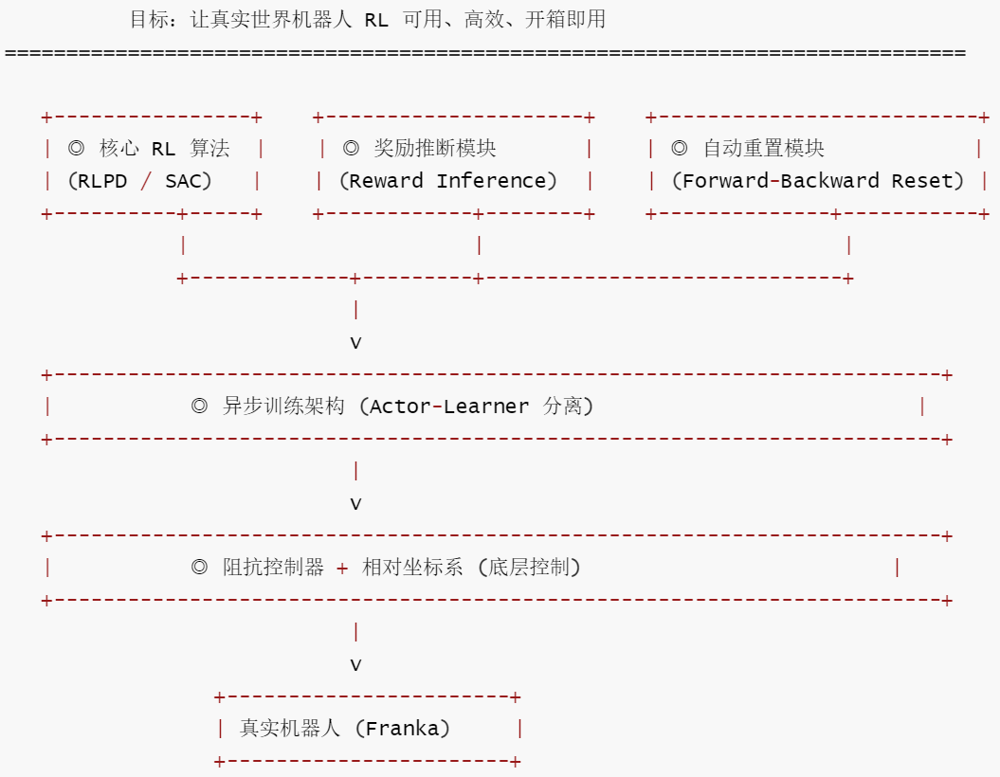

#### 2.3.2 数据流图

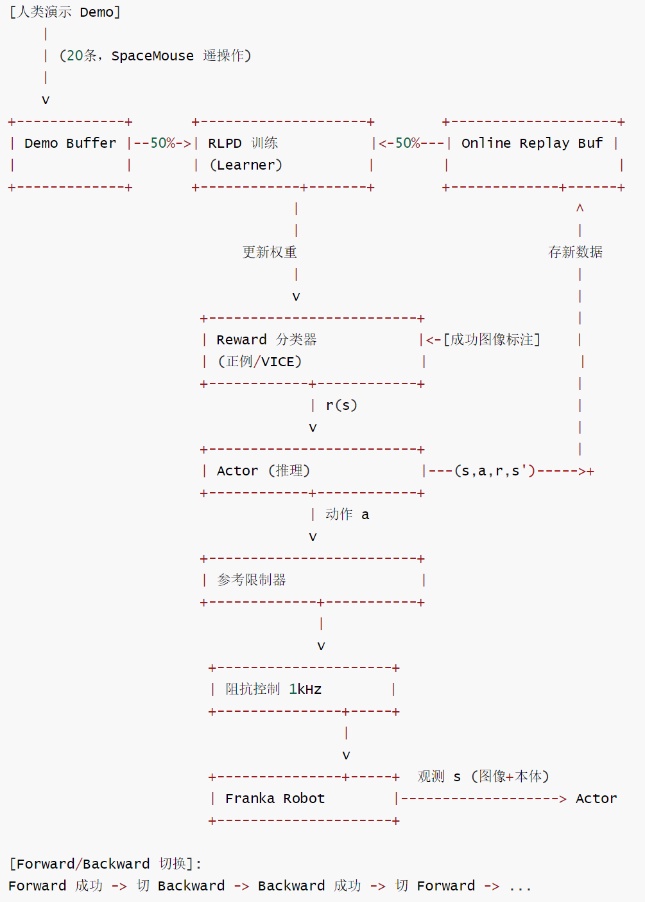

## 0x03 SERL 的算法脉络

SERL 的核心使命是：在真实世界中，让机器人在 20-40 分钟内学会高精度的机械操作。这要求SERL 不仅需要"采集数据"，更需要通过一套复杂的算法引擎实现"超高效的数据消化"。SERL 通过集成 SAC、RLPD、DrQ 和 VICE，将原本需要数百万次尝试的 RL，压缩到了人类演示水平的量级。

### 3.1 主要算法

SERL 的复现不仅仅是把算法抄一遍，更是在高 UTD 的暴力计算中，平衡视觉增强的裁剪范围与本体感知的坐标对齐。SERL 涉及的主要算法和思想组件是：

* BC 是教鞭，负责"指明方向"：实现冷启动，缩短探索路径。
* SAC 是肌肉（核心引擎）：负责细腻控制和稳健的动作输出。
* RLPD 是能量：负责"海量吞噬数据"，通过高 UTD 实现暴力进化，也把 demonstration 当成训练中的"安全锚点"。
* DrQ/ResNet 负责"双眼看世界"：配合 数据增强 + 共享视觉头 看懂空间。
* VICE 是心智：在没有反馈的环境中定义"对与错"。
* REDQ 提供了刹车系统。
* Soft Update 提供了柔顺性。

这就是为什么 SERL 能在短时间内完成 PCB 插件、电缆绕线等高难度动作的原因。

### 3.2 算法演化关系

我们可以把 SERL 的算法引擎理解为一场"效率与稳定性的平衡艺术"。SERL 的核心 RL 算法来自 RLPD（Reinforcement Learning with Prior Data）。RLPD 本质上是一个 off-policy actor-critic 方法，建立在 SAC 思想上。在此基础上，SERL 利用 High UTD 提供了极致的学习动力，利用 REDQ 提供了刹车系统，利用 Soft Update 提供了柔顺性......。这些算法的耦合，使得机器人在现实世界中不仅仅是在动作，而是在高效地"思考"与"进化"。

主要算法来源与演化关系如下：

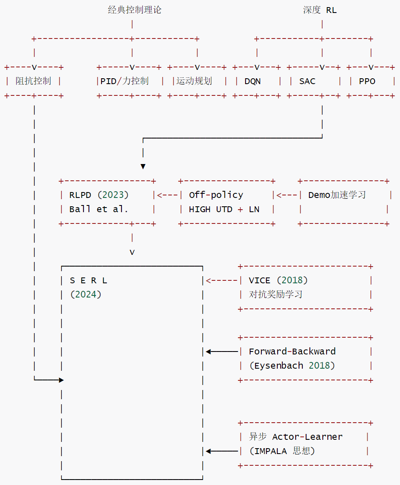

### 3.3 算法特色

#### 3.3.1 SAC（Soft Actor-Critic）算法底座

SAC 是整个系统的"引擎"，它的独特之处在于其"灵魂"——熵（Entropy）。

* 最大熵目标：不同于传统 RL 只追求奖励最大化，SAC 追求 Maximize E [ 奖励 + α × 熵 ]。

  + 如果 α=0，SAC 退化为普通 AC。引入熵是为了解决探索与利用的根本矛盾，让智能体在保证高分的同时，尽可能保持动作的多样性。
* 重参数化技巧（Reparameterization Trick）：

  + 由于"采样"动作是不可导的（黑盒），SAC 使用 a = μ + σ · ε 将随机性转移到外部噪声 ε 上，从而让梯度能够穿过采样步骤，回传给 Actor 网络。
* 双 Critic 与 Tanh 挤压：

  + 使用两个 Q 网络取最小值来抑制高估偏置。
  + 使用 tanh 限制动作范围，并辅以雅可比修正计算准确的 log π，防止梯度在边界处消失。

SAC 算法引擎具体如下：

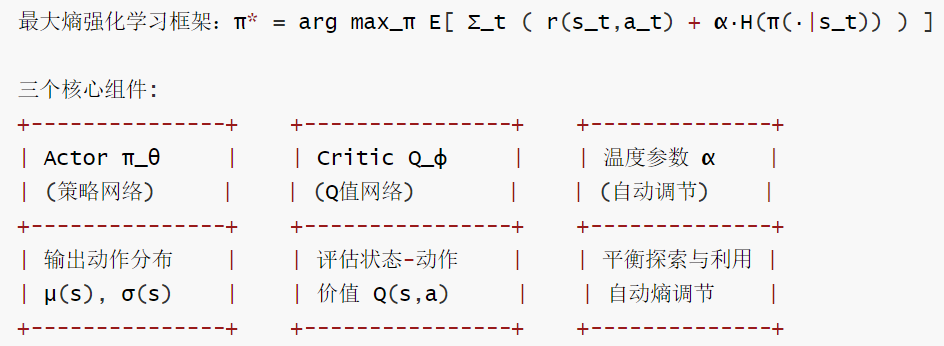

#### 3.3.2 RLPD (RL with Prior Data) — 性能加速器

RLPD 是 SERL 实现"20 分钟学会"的关键，它通过"暴力更新"和"不忘初心"来榨取每一条数据的价值。

* 逻辑： 在每个训练 Batch 中，强制按比例混合 20%–50% 的专家演示数据。
* 价值： 解决了真机探索初期的 “大海捞针” 问题，确保机器人始终在正确的轨道附近进行微调。
* 核心改进：

  + 高 UTD 比率（Update-to-Data Ratio）：SERL 通常设置 UTD=20，即每与环境交互一步，就进行 20 次网络更新。
  2. Layer Normalization（LN）：高 UTD 下 Q 值极易发散。LN 就像赛车的强力悬挂系统，在每个隐藏层后稳定数值流，使得网络能承受高频的梯度冲击。
  3. 50/50 混合采样：训练 Batch 始终由 50% 在线数据和 50% 演示数据组成。确保智能体在进化过程中"不忘初心"，既能从错误中学习，又能被高手的操作持续引导。

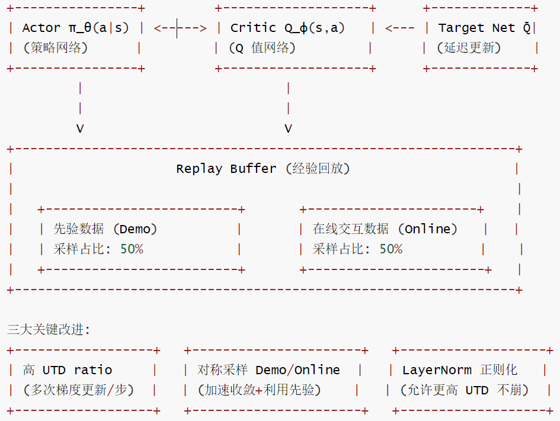

#### 3.3.3 High UTD (Update-to-Data): 从 "看一遍就扔" 到 "研读二十遍"

传统的强化学习算法通常遵循 UTD=1 的节奏，即：机器人采集 1 步数据，模型进行 1 次梯度更新。但在 SERL 中，这一比例被提升到了 20 甚至更高。

* 原理： 传统 RL 每步更新 1 次，SERL 每步更新 20–48 次。
* 目的： 极大化每一条真机样本的边际价值，将训练时间从 “天” 缩短至 “小时”。
* 数据压榨逻辑：真机采集的数据中隐藏着极其细微的物理交互特征（如手爪与工件的摩擦）。通过 High UTD，模型被迫对有限的样本进行 "深度研读"，从而在极短的物理时间内捕捉到成功的信号。
* 工程代价：High UTD 对 Learner 的算力提出了严苛要求。这要求 JAX 必须在毫秒级时间内完成多轮反向传播，以确保学习速度始终领先于采样速度。

#### 3.3.4 REDQ 风格的陪审团（Critic）机制：压制 High UTD 带来的估值爆炸

High UTD 虽然能加速学习，但会带来致命副作用： Q 值过估计（Overestimation Bias）。模型会因为反复研读少量样本而变得极端自信，最终导致策略崩溃。SERL 引入了 REDQ (Randomized Ensembled Double Q-learning) 风格的机制：

* 挑战： High UTD 会产生剧烈的 Q 值过估计（Overestimation Bias）。
* Critic Ensemble（陪审团）：同时训练 10 到 20 个独立运行的 Critic（评论家） 网络。在计算目标值时，随机抽取子集并取其最小值（Minimization）。
  + 随机子集采样（Randomized Subset）：在计算目标 Q 值时，并不看所有人的意见，而是随机抽取 k 个（SG=k） Critic。
  + 取最小值（In-sample Min）：在抽出的子集中取分数的最小值。
* 逻辑： 只要有一个裁判觉得这个动作危险，我们就保守一点。这种 "悲观主义" 巧妙地抵消了 High UTD 带来的 "狂热乐观"，使训练在极高强度下依然稳如磐石。
* 效果： 为激进的训练过程打下 “冷水”，保证策略进化的平滑。

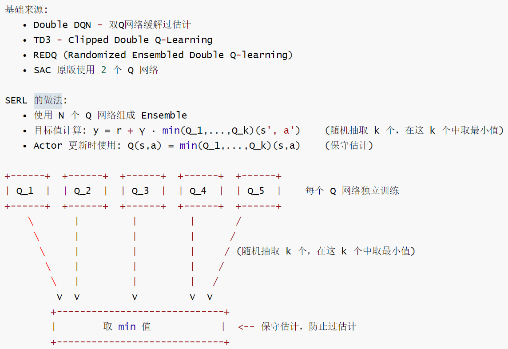

#### 3.3.5 Soft Update 的力量：维持真机控制平滑度的数学底座

在机器人控制中，动作的连续性决定了硬件的寿命。SERL 坚持使用 Soft Update（软更新） 维护目标网络：

* 平滑公式： θ(target) = τ θ\_online + (1−τ) θ{target}。其中 τ 通常设为极其微小的 0.005。
* 硬件意义：与直接拷贝权重的 Hard Update 不同，Soft Update 让目标值（Target）以一种近乎流体的方式缓慢漂移。这反映到机器人身上，就是动作的进化是 "渐进" 的，不会因为模型权重的突跳导致机械臂产生瞬时的冲击电流或抖动。

#### 3.3.6 DrQ（Data-Regularized Q-learning）的空间不变性

机器人必须通过像素看世界，DrQ 解决了视觉特征提取的泛化难题。

* 随机裁剪（Random Crop）：对 s 和 s' 使用不同的偏移种子。这种人为制造的"画面抖动"强迫网络忽略像素的绝对位置，转而理解物体的物理语义。
* 共享编码器（Shared Encoder）：Actor 和 Critic 共用一个 ResNet-10。让 Actor 站在 Critic 练好的视觉特征上"搭便车"。Critic 有明确的奖励信号，学特征更快。Actor 这种"搭便车"的行为能节省大量显存，并加速特征空间的收敛。

#### 3.3.7 VICE 的审美逻辑

VICE 解决了"真实世界没有代码奖励"的问题，让机器人拥有了"成就感"。

* 分类器即奖励：当环境没有数学公式时，VICE 通过对比"成功照片"和"失败轨迹"，训练一个二分类器。
  + VICE 是多波（即时奖励），Critic 是理财顾问（长期价值）。VICE 告诉机器人当前时刻有多像成功。
* 平滑奖励曲线：通过 Mixup 和 Gradient Penalty，让奖励信号从"死板的 0/1 变成平滑的斜坡"，引导机器人爬向终点。
  + 使用 Mixup 和 Label Smoothing 防止小样本过拟合。
  + 使用 Gradient Penalty（GP）确保奖励函数的等高线是平滑的"斜坡"而非陡峭的"台阶"，方便 Actor 爬升。

## 0x04 SERL 在机器人 RL 方法谱系中的多维定位

既然对算法有了初步了解，我们结合算法，再来看看SERL 在机器人 RL 方法谱系中的多维定位。

​ ● SERL 位置：多维度平衡的中庸之道

* 样本效率：中等（RLPD混合）
* 训练稳定性：高（REDQ + LayerNorm）
* 安全鲁棒性：极高（多层保护）
* 计算效率：高（JAX JIT + 优化）
* 实时性：高（异步架构）

### 4.1 维度一：学习范式 - 离线性 vs 在线性

SERL 定位：在纯离线方法的鲁棒性和基于演示的基础上，加入了在线适应能力

优势：结合离线方法的样本效率和在线方法的适应性

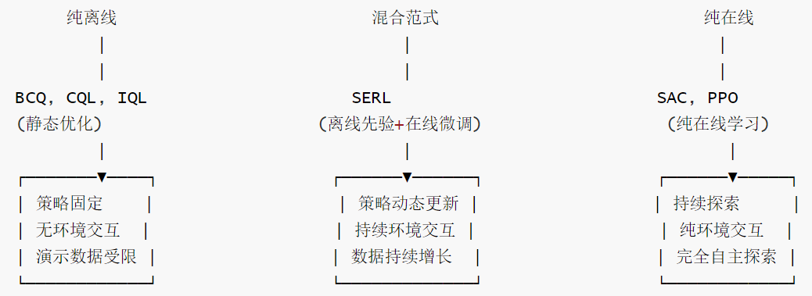

### 4.2 维度二：数据利用 - 演示数据权重

SERL 定位：通过 RLPD 机制实现演示数据与在线经验的平衡利用

优势：在保持安全性的同时，突破演示数据的质量限制

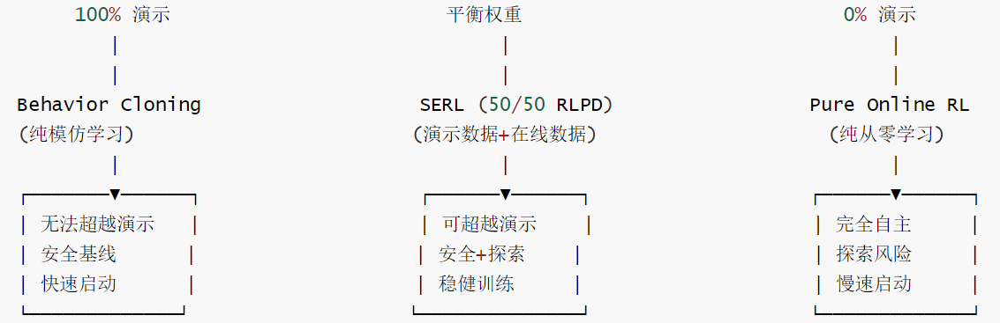

### 4.3 维度三：感知模态 - 视觉 vs 状态

SERL 定位：支持多种编码器，从轻量级 SmallEncoder 到预训练 ResNet

优势：根据计算资源和任务需求灵活选择感知架构

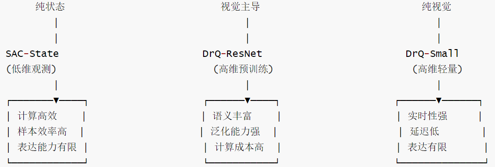

### 4.4 维度四：探索策略 - 确定性 vs 随机

SERL 定位：通过自动温度调节实现探索-利用的动态平衡

优势：在训练初期保持高熵，后期逐渐收敛到确定性策略

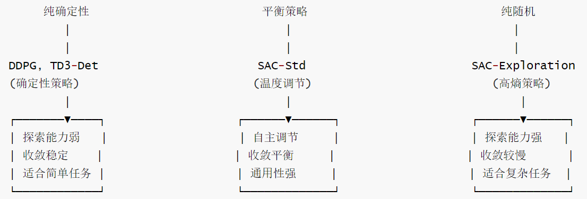

### 4.5 维度五：学习范式 - 离线性 vs 在线性

SERL 定位：通过 AgentLace 实现 Actor 与 Learner 的异步分离

优势：在保持实时交互的同时，充分利用计算资源进行训练

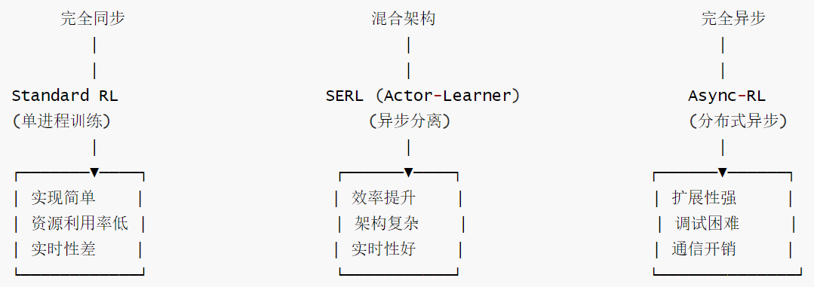

### 4.6 维度六：安全策略 - 软约束 vs 硬约束

SERL 定位：底层力限幅 +中层安全箱 +上层碰撞检测的三重保护

优势：在保证机器人安全的同时，保持足够的操作灵活性

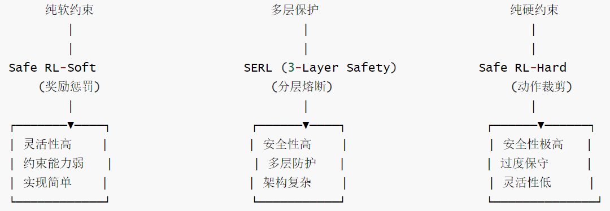

### 4.7 维度七：计算效率 - 样本效率 vs 计算成本

SERL 定位：通过 REDQ 随机子采样在ensemble容量和计算效率间平衡

优势：保持ensemble鲁棒性的同时，控制计算成本

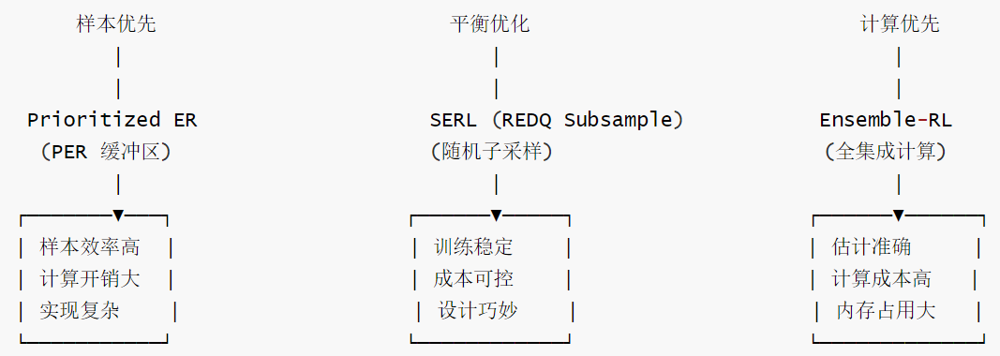

## 0x05 SERL 的工程脉络

以下是 SERL 的总体架构图。

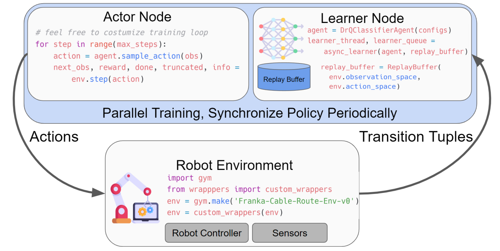

SERL 的设计充分体现了现代机器人强化学习的工程化思维，在算法创新、系统架构和工程实现之间取得了良好的平衡。

本章将从底层工程实现的角度，揭示 SERL 如何构建一个支持高频真机迭代的分布式系统。

### 5.1 分布式 Actor-Learner 深度解析

在真机强化学习中，最大的工程挑战在于：如何在高强度计算（Learner）的同时，保证机器人控制（Actor）的实时性与确定性。SERL 通过一套精妙的分布式解决方案，彻底解决了这一难题。

#### 5.1.1 核心矛盾：控制实时性 vs 算力吞吐

在真机 RL 中，一个核心矛盾是：机器人控制需要低延迟和稳定频率；神经网络训练需要高吞吐和大量 GPU 计算。如果把控制和训练塞进同一个同步循环，就会出现一个问题：机器人每执行一步，都要等 GPU 实成训练。资源不足时，框架只能等待，无法用现有资源启动下一步控制；一旦训练变慢，机器人控制频率就会抖动，严重时会触发硬件保护。

#### 5.1.2 端云解耦：控制实时性与算力吞吐的完美分离

为了支持 50Hz 的高频真机交互，SERL 采用了 异步 Actor-Learner 分布式设计。

SERL 将系统划分为两个独立运行的进程，通常部署在不同的硬件环境下：

* 实时控制 PC（Actor）： 运行 FrankaServer (C++ 实现)，直连机器人底层。它通过 Shared Memory（共享内存）与 Python 端通信，确保即使在网络波动时，机器人的安全逻辑也不会中断。
* 计算中心（Learner）： 运行在带高性能 GPU 的工作站上。它利用 JAX 的异步更新能力，在后台进行疯狂的 High UTD（Update-to-Data）训练，同时通过异步通道每隔几秒向机器人推送更新后的权重。

意义： 这种架构让 "人教机器人" 的过程变得极其丝滑。人在前面带，后台在拼命学，每过几分钟，人就能明显感觉到机器人变得 "更有灵性"。

```
┌──────────────────────┐       agentlace                  ┌─────────────────┐
│     ACTOR 节点        │ ────────网络参数同步──────────►    │   LEARNER 节点  │
│                      │  (TrainerServer/                 │                 │
│  env.step(action)    │   TrainerClient/ GPU后端 )        │  agent.update() │
│  data_store.insert() │                                  │  replay_buffer  │
│  agent.sample_act()  │  ──────transition数据────────►    │  demo_buffer    │
│  evaluate()          │                                  │  wandb logging  │
└──────────────────────┘  ◄─────────stats─────────────    └─────────────────┘
      GPU / CPU 前端                                            GPU 后端
```

**关键设计要点**：

* Actor 运行在机器人控制 PC 上，负责环境交互、数据采集、策略推理、评估
* Learner 运行在 GPU 服务器上，负责策略训练、replay buffer 管理
* 通过 agentlace 实现网络通信（基于 TrainerServer / TrainerClient）
* Actor 通过 QueuedDataStore 缓存 transition，定期 client.update () 推送到 Learner
* Learner 通过 server.publish\_network() 定期将新参数广播给 Actor
* 异步解耦：Actor 和 Learner 独立运行，互不阻塞，Actor 不需要等 Learner；Learner 也不需要等 Actor 每一步都同步回来。两边通过 replay buffer 和参数广播形成松耦合闭环，最大化 GPU 利用率。

#### 5.1.3 Robot Actor（执行端）

* **运行环境**：靠近机器人的边缘 PC
* **职责**：负责运行 `env.step()` 循环。它从摄像头抓取图像，从模型获取动作并下发
* **核心保障**：使用 C++ 编写的 FrankaServer 作为底层驱动，在 1kHz 级别监控硬件安全，并将控制权抽象为低频的 Python 接口，确保算法层的抖动不影响硬件安全

具体来说，Actor 运行在机器人控制侧或靠近机器人的机器上，主要负责：

* 调用 `env.step(action)` 与真实机器人交互
* 从相机和机器人本体状态获取 observation
* 使用当前策略进行 action inference
* 将 transition 插入本地 data store
* 定期将数据上传给 learner
* 定期接收 learner 发布的新策略参数

**Actor 的第一原则**：**不能阻塞机器人控制循环**

也就是说，即使 learner 正在训练，Actor 仍然要能持续运行当前策略。训练慢一点可以接受，机器人卡在半空中等参数更新不可接受。

#### 5.1.4 Cloud Learner（学习端 / 中央训练端）

* **运行环境**：搭载多张高性能显卡（如 A100/H100）的计算工作站
* **职责**：负责沉重的梯度计算。它不仅要处理当前的样本，还要以 High UTD（Update-to-Data）的频率反复研读历史经验
* 训练引擎： 基于 JAX + XLA。利用算子融合（Kernel Fusion）和并行计算压榨 GPU 吞吐。
* 存储逻辑： 采用 “帧存储，采样重建” 技术，支持数百万帧高清视觉数据的内存驻留。

具体来说，Learner 运行在 GPU 机器上，主要负责：

* 管理 replay buffer 与 demo buffer
* 从在线数据和 prior data 中采样 batch
* 执行 RLPD / SAC / DrQ / VICE 等更新
* 记录训练日志
* 定期向 Actor 发布最新网络参数

这一侧追求的是高吞吐。尤其在 High UTD 设置下，learner 会对每条真实样本进行多次梯度更新，因此 GPU 利用率和训练循环效率非常关键。

### 5.2 通信拓扑

SERL 的通信拓扑非常清晰：

```
Actor → Learner：transition 数据
Learner → Actor：网络参数
```

在代码层面，SERL 使用 agentlace 提供的 TrainerServer / TrainerClient 通信机制：

* Req-Rep 通道：用于 Actor 向 Learner 发送 transition
* Pub-Sub 通道：用于 Learner 向 Actor 广播网络参数
* Actor 后台线程接收参数，主控制循环不阻塞
* 使用只保留最新参数的机制，避免旧 checkpoint 堆积

#### 5.2.1 机器人通信架构图

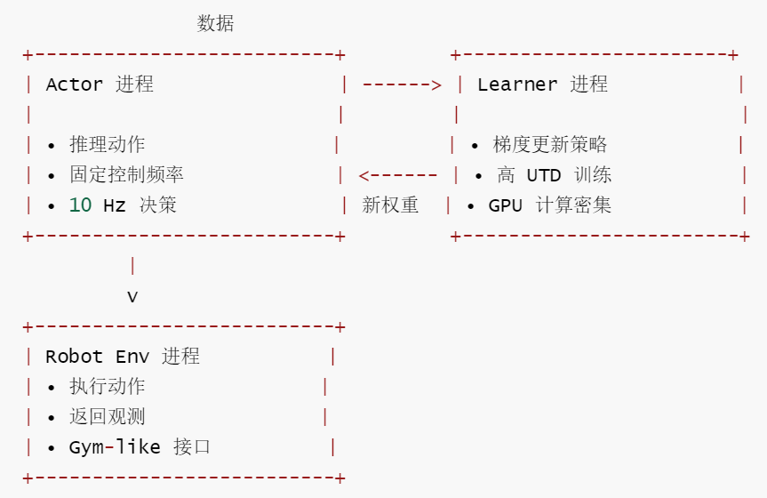

Environment 可以扩展为如下：

```
FrankaEnv (franka_env.py)
    ↓ HTTP POST 请求
FrankaServer (franka_server.py) ← Flask HTTP API
    ↓ ROS Topics
Franka Hardware
    ├─ cartesian_impedance_controller (ROS 控制器)
    ├─ franka_state_controller       (状态反馈)
    └─ Gripper Server                (Robotiq/Franka 夹爪)
```

#### 5.2.2 FrankaServer vs FrankaEnv

**1. 实时性隔离**

Franka 的阻抗控制器跑在 1kHz ROS 控制环里。如果 Python RL RL 代码和控制代码跑在同一个进程，GC 暂停、GIL 锁、JAX 编译都会导致控制周期抖动，机器人会抖动甚至触发安全保护。

拆开后，FrankaServer 进程只做轻量的 ROS pub/sub + Flask 转发，几乎无延迟。

**2. 物理部署拓扑**

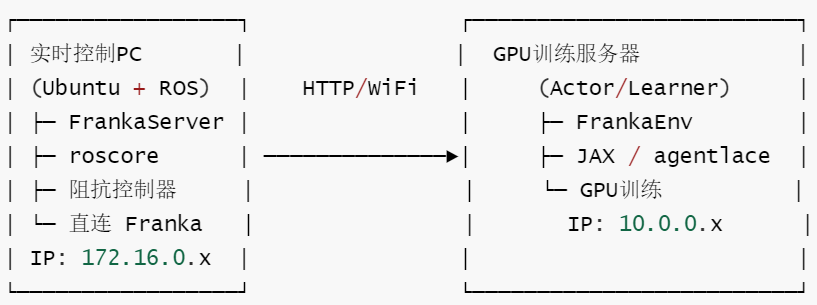

这种部署拓扑体现了真机系统的实际架构：

* 实时控制 PC 靠近机器人硬件，负责高频控制循环
* GPU 训练服务器可以远程部署，负责繁重的计算任务
* 两者通过网络通信，实现了控制与训练的物理分离

**3. 故障隔离与恢复**

* FrankaServer 可以独立执行 `/clearerr` 恢复错误，重启控制器
* FrankaEnv 崩溃不会导致机器人失控（Server 还在维持最后的位姿命令）
* FrankaServer 崩溃可以重启而不影响 GPU 上的训练进程

这种进程级别的隔离设计提高了系统的鲁棒性。即使训练进程崩溃，机器人硬件仍然处于安全状态；即使控制服务器崩溃，训练进程可以继续运行而不会丢失所有数据。

#### 5.2.3 异步通讯机制

为了不让机器人"停下来等大脑思考"，SERL 实现了完全异步的通讯链路，这是权重广播与轨迹上传的非阻塞工程实现：

**数据流**：

* Actor 采集到的 `(s, a, r, s')` 轨迹被打包成 RLDS 或自定义格式
* 通过异步 Socket 推送到 Learner 的 Replay Buffer

**权重流**：

* Learner 在完成一批次的梯度更新后，会生成一个新的权重快照（Checkpoint）
* Actor 端采用"双缓冲"机制：
  + 模型在线程 A 进行实时的动作推理
  + 后台线程 B 负责监听云端权重
  + 一旦新权重到达，线程 B 会在两个控制步的间隙，利用零拷贝技术瞬间替换线程 A 中的模型参数
  + 这保证了机器人动作的连续性

#### 5.2.4 协议：ZeroMQ（ZMQ）

| 通道 | ZMQ 模式 | 用途 | 端口 |
| --- | --- | --- | --- |
| Req-Rep (请求 - 回复) | ZMQ\_DEALER/ROUTER | Actor→Learner 发送 transition 数据 | 5488 |
| Pub-Sub (广播) | ZMQ\_PUB/SUB | Learner→Actor 推送网络参数 | 5489 |

参数同步流程如下：

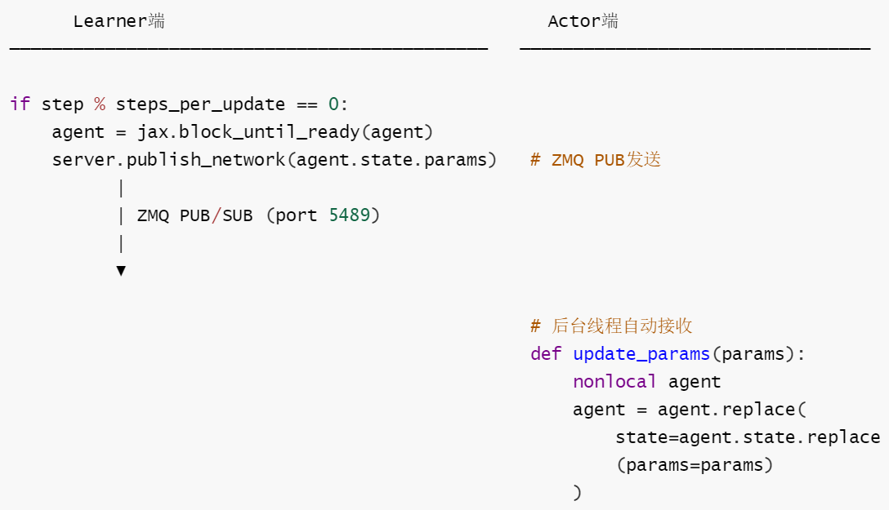

#### 5.2.5 如何保证参数下载不卡控制循环

**1. 后台线程接收参数，主循环完全不感知**

agentlace 的 `BroadcastClient.async_start()` 启动了一个独立守护线程：

```
# agentlace/zmq_wrapper/broadcast.py
def async_start(self, callback):
    def async_listen():
        while not self.is_kill:
            try:
                serialized = self.socket.recv() # ZMQ SUB接收，超时1.5s
                message = self.decompress(serialized)
                callback(message)                # 调用 update_params
            except zmq.Again:
                continue                       # 超时则继续轮询
    self.thread = threading.Thread(target=async_listen)
    self.thread.daemon = True
    self.thread.start()
```

**2. ZMQ CONFLATE — 只保留最新参数，丢弃过期的**

```
# BroadcastClient 初始化时
self.socket.setsockopt(zmq.CONFLATE, True) # ←关键
self.socket.setsockopt(zmq.RCVHWM, 3)
```

`CONFLATE=True` 意味着 ZMQ 内部缓冲区只保留最新一条消息。如果 Learner 连续发了 3 次参数更新，前两次会被自动丢弃。

**3. 参数更新是引用替换，不是原地修改**

```
# async_drq_sim.py:104-106
def update_params(params):
    nonlocal agent
    agent = agent.replace(state=agent.state.replace(params=params))
```

`replace()` 返回一个全新的 PyTreeNode 对象。Python GIL 保证了引用赋值的线程安全。

### 5.3 混合训练流程

Offline-to-Online 混合训练流程如下。

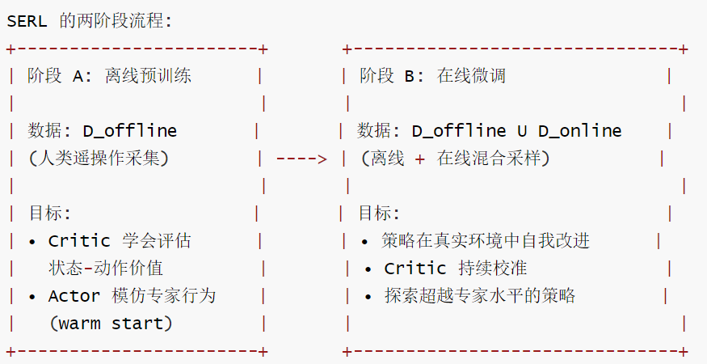

异步训练架构 (Async Training) 如下，可以和Actor-Learner对应起来。

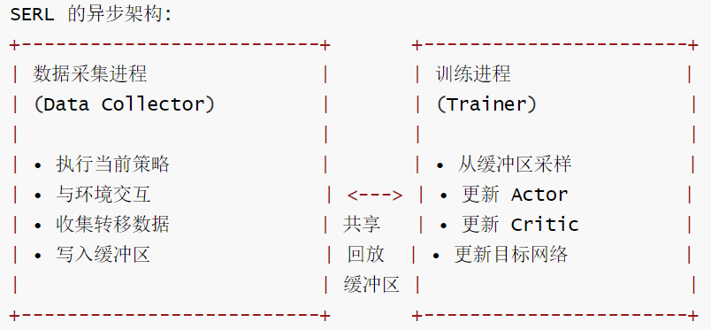

综合起来细化如下：

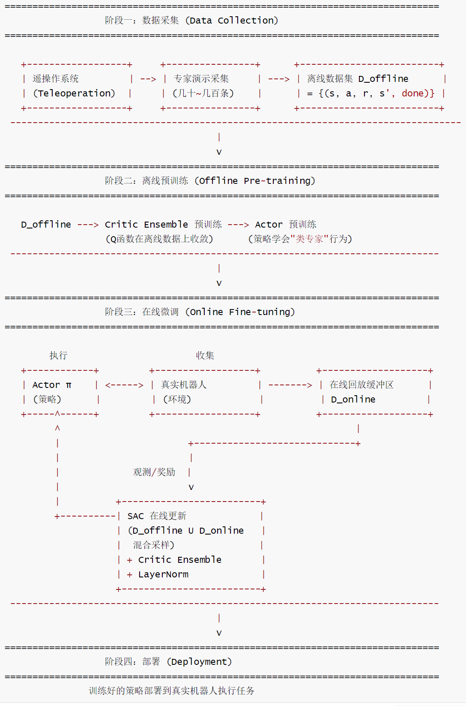

### 5.4 组件

#### 5.4.1 清单启动顺序

SERL 的组件（按启动顺序）如下：

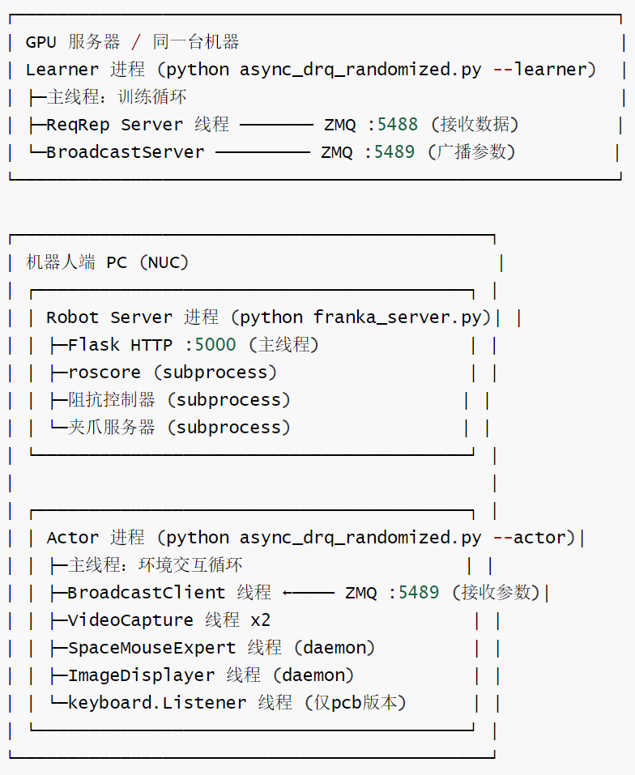

具体清单如下：

| 组件 | 进程 | 类型 | 循环方式 | 启动方式 |
| --- | --- | --- | --- | --- |
| L1 Learner 主线程 | Learner | 主线程 | for step in range(max\_steps) | bash run\_learner.sh |
| L2 TrainerServer | Learner | daemon 线程 | while not is\_kill 无限循环 | server.start(threaded=True) |
| L3 BroadcastServer | Learner | 同步调用 | 无循环，被动触发 | server.publish\_network() |
| A1 Actor 主线程 | Actor | 主线程 | for step in range(max\_steps) | bash run\_actor.sh |
| A2 BroadcastClient | Actor | 线程 | while not is\_kill 无限循环 | client.recv\_network\_callback() |
| A3 VideoCapture x2 | Actor | daemon 线程 | while enable 无限循环 | VideoCapture(cap) |
| A4 ImageDisplayer | Actor | daemon 线程 | while True 无限循环 | ImageDisplayer() |
| A5 SpaceMouseExpert | Actor | 线程（非子进程！） | while True 无限循环 | SpaceMouseExpert() |
| A6 keyboard.Listener | Actor | pynput 线程 | 无限循环（事件驱动） | 仅 pcb\_insert 版本 |
| R1 roscore | Robot Server | subprocess | 无限循环 | franka\_server.py 内部 |
| R2 阻抗控制器 | Robot Server | subprocess | 无限循环 | franka\_server.py 内部 |
| R3 关节控制器 | Robot Server | subprocess | 无限循环 | franka\_server.py 内部 |
| R4 夹爪服务器 | Robot Server | subprocess | 无限循环 | franka\_server.py 内部 |
| R5 Flask HTTP | Robot Server | 主线程 | 无限循环 | franka\_server.py 底部 |

#### 5.4.2 组件依赖图

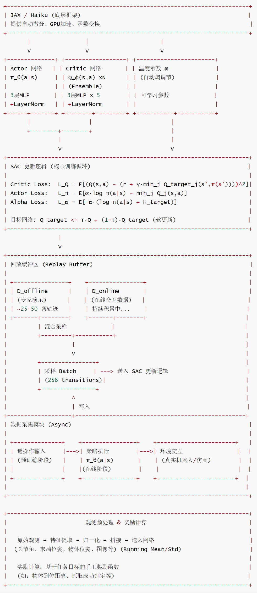

#### 5.4.3 核心组件解释

具体核心组件解释如下：

| 组件/算法 | 解决的核心问题 | 基础/来源 | 未解决 & 改进方向 |
| --- | --- | --- | --- |
| SAC (算法核心) | 探索效率低、连续动作空间 训练不稳定、超参数敏感 | 最大熵 RL Off-policy + Replay Buffer | 高维观测下样本效率不足 → 结合世界模型/表征学习 |
| Critic Ensemble (N=5, 取min) | Q值过估计、OOD动作问题 训练不稳定 | Double DQN + TD3 + SAC原版双Q网络 | 计算开销大、过度保守 → 自适应Ensemble/不确定性感知的加权策略 |
| Offline-to-Online 混合训练 | 冷启动问题、纯离线无法超越 专家、分布偏移 | Offline RL (BCQ/CQL) + Online RL + AWAC范式 | 采样比例优化、预训练过度 → 自适应采样/课程学习 |
| 网络架构 (MLP+LayerNorm) | 训练不稳定、过拟合、梯度问题 | 深度RL网络设计 + LayerNorm | 无法处理原始图像 → 集成预训练视觉编码器 → Transformer架构探索 |
| 异步训练架构 | GPU空闲等待、机器人时间浪费 训练效率低 | A3C/IMPALA + DQN Replay | 策略版本不一致、通信开销 → 多机器人并行/共享内存 |
| 工程基础设施 (遥操作/缓冲区/预处理/实验管理) | 数据采集门槛高、实验不可复现 数据管理混乱、环境不统一 | Gym/Gymnasium + JAX + ROS | 硬件平台有限、Sim-to-Real → 更多机器人/仿真集成 → AutoML超参搜索 |
| 整体框架 SERL | 机器人RL样本效率低、工程复现门槛高、缺乏统一基准 | SAC + Offline RL + 系统工程最佳实践 | • 跨任务泛化能力有限 • 奖励函数仍需手工设计 • 灵巧手等复杂场景待验证 • 与LLM/视觉基础模型结合 |

### 5.5 JAX 全栈化：为什么 JAX 是处理高频真机数据的唯一选择

SERL 把 JAX 当作高性能数值计算库而非端到端编程模型 —JIT 只用于加速矩阵运算，系统控制流完全由普通 Python 驱动。这是机器人 RL 领域的务实选择：物理世界的 I/O 时序比 XLA 优化更重要。

#### 5.5.1 原因

SERL选择 JAX 而非 PyTorch，是由真机强化学习对极高更新频率（High UTD）的刚需决定的。

1. 支撑 High UTD (样本压榨)。SERL 通常需要 UTD=20 甚至更高。这意味着机器人每采集 1 秒数据，GPU 必须在 1 秒内完成 20 次完整的梯度更新。

* **PyTorch 的痛点**: Python 的解释器开销和算子调度延迟在进行 "高频小步" 更新时非常明显。
* **JAX 的优势**: 通过 XLA 编译，JAX 能将整个训练循环（从采样到梯度更新）编译成一个单体内核（Monolithic Kernel），彻底消除 Python 的运行时开销。

2. 异步 Actor-Learner 的天然适配：JAX 采用纯函数（Pure Functions）和不可变状态的设计。在分布式系统中，同步模型参数（Weights）本质上就是传递一个 PyTree（JAX 的数据结构）。这种设计让异步的数据交换和状态管理变得极其干净，不容易产生线程冲突或内存泄露。
3. 在机器人端（Actor），JAX 可以利用编译后的图实现极低延迟的推理，确保 50Hz+ 的控制频率不受波动

#### 5.5.2 pmap 在大规模 SOP 系统中的潜在价值

SERL **设计了 pmap 支持，但默认不使用**，而是采用 `jax.device_put` + `sharding.replicate()` 的方案。

```
devices = jax.local_devices()
num_devices = len(devices)
sharding = jax.sharding.PositionalSharding(devices)

# 将 agent 复制到所有设备
agent: DrQAgent = jax.device_put(
    jax.tree_map(jnp.array, agent), sharding.replicate()
)
```

**为什么选择 device\_put 而不是 pmap？**

1. **架构灵活性**：SERL 的异步训练架构（Actor-Learner分离）中，pmap 的同步模型不太适用
2. **简化调试**：device\_put 方案更容易调试和监控单个设备性能
3. **内存效率**：对于视觉RL任务，device\_put 的内存占用更可控
4. **异步兼容性**：与 AgentLace 的异步通信框架配合更好

**结论**：SERL 设计了 pmap 接口以保持灵活性，但实际使用更简单直接的 device\_put + sharding 方案。

#### 5.5.3 JaxRL 训练状态 — 训练状态管理核心

控制必须是硬实时的（10Hz 不能断），而学习是耗时的。必须将两者分进程运行，SERL 通过 TrainState 来异步同步参数。

```
class JaxRLTrainState(struct.PyTreeNode):
    step: int
    apply_fn: Callable       # ModuleDict.apply
    params: Params           # 当前参数
    target_params: Params    # 目标网络参数
    txs: Any                 # 优化器字典 {actor, critic, temperature, ...}
    opt_states: Any          #optimizer 状态
    rng: PRNGKey             # 内部 RNG 链
```

**关键方法**：

* `target_update(tau)` → Polyak 平均更新目标网络
* `apply_gradients(grads)` → 支持多优化器 pytree 的梯度应用
* `apply_loss_fns(loss_fns)` → 核心便利方法：自动分配 RNG、计算梯度、应用更新一步完成

这种设计让 SERL 能够在高频更新场景下保持代码的清晰和可维护性。

#### 5.5.4 JIT 边界处理：SERL 的两阶段分离策略

**核心答案**: SERL 用严格的 "两阶段分离"—JIT 内只做纯计算，所有副作用（硬件 I/O、网络通信、HTTP 请求）全部在 JIT 外的普通 Python 完成。两者之间通过 `device_put` / `device_get` 传递数据。

架构全景如下。

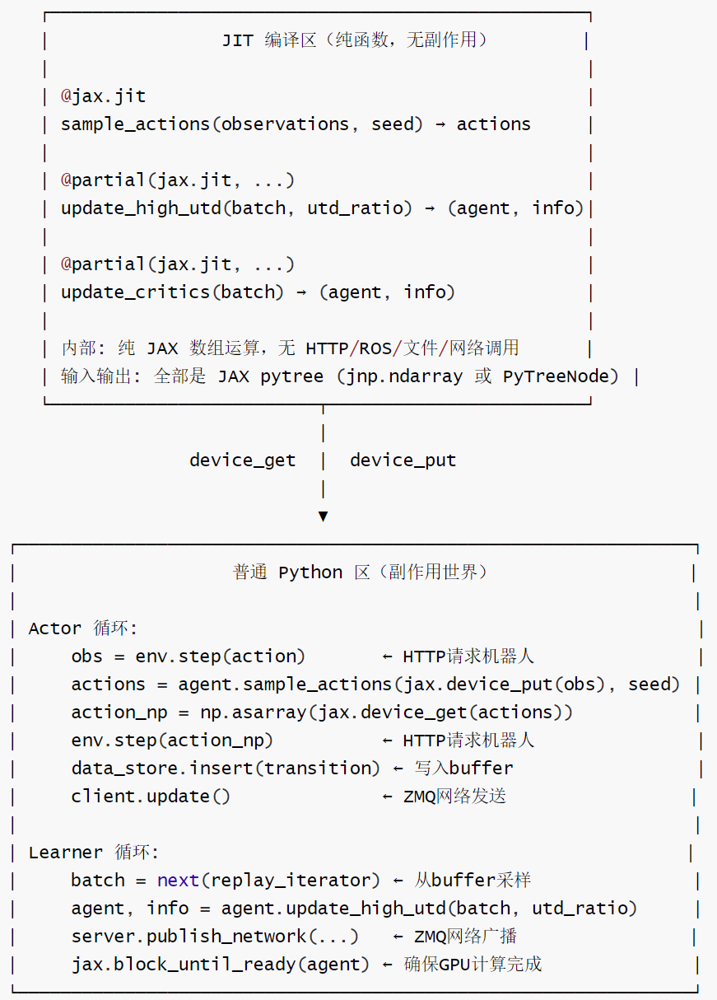

#### 5.5.5 设计哲学总结

| 策略 | 实现 |
| --- | --- |
| 严格分离 | JIT 内零副作用，I/O 全在普通 Python |
| 显式数据搬运 | `device_put` 进 JIT, `device_get` 出 JIT |
| 异步安全 | `block_until_ready` 保证参数发布前计算完成 |
| nontree\_field | 配置项不进入 JAX 追踪 |
| 不用 callback | 避免顺序不确定性和性能损失 |
| 进程隔离 | Actor/Learner 分离天然解决 JIT/I/O 矛盾 |

## 0x06 SERL 与 HIL-SERL、LWD 的演进关系

我们可以把 SERL 的系统架构理解为一次"用工程换智能"的成功实践。它通过精密的异步设计和 JAX 的高性能编译，构建了一个能够支撑"边干边学"的工业级地基。在这一架构下，机器人不再是一个孤立的机械臂，而是一个连接着云端算力风暴的进化终端。

SERL 是后续 HIL-SERL 和 LWD 的重要工程基础。理解这三者之间的关系，有助于我们把握真机机器人强化学习从研究原型到工业级应用的发展脉络。

### 6.1 关键设计总结

**★核心思想**：在系统层面消除一切样本浪费 ——— 异步训练不浪费 GPU 时间，内存高效不浪费 RAM，高 UTD 不浪费每一条 transition，预训练编码器不浪费视觉特征，RLPD 不浪费 demo 数据。

下面的设计表格体现了 SERL 的整体工程哲学：在每一个可能产生浪费的地方，都有针对性的优化。这不是单个点的优化，而是系统层面的协同，让真机 RL 在有限的数据预算下实现最大化的学习效果。

| 设计决策 | 原因 |
| --- | --- |
| 异步 Actor-Learner | 解耦推理与训练，最大化 GPU 利用率 |
| High UTD + Critic Ensemble | 样本效率核心：多 critic 更新 + ensemble min 抑制过估计 |
| MemoryEfficient Replay Buffer | 帧堆叠去重，内存节省 N 倍 |
| RLPD 50/50 采样 | 离线 demo + 在线数据混合，加速收敛 |
| DrQ 数据增强 + random crop | 正则化，提升视觉鲁棒性 |
| ResNet-10 预训练冻结 | ImageNet 特征迁移，大幅减少视觉编码训练量 |
| VICE 奖励分类器 | 替代手工稀疏奖励，自动从成功 / 失败图像学习奖励 |
| Forward-Backward 重置 | 人工重置昂贵 -> 全自主训练 |
| Flask HTTP 机器人控制 | 简单可靠，跨进程隔离，便于调试 |
| 阻抗控制 + 参考限制 | 防止接触时大力损坏物体；防止RL 探索不安全 |
| 相对坐标系 | 策略过拟合绝对位置；对抗动不鲁棒 |
| JAX + lax.scan | 高 UTD 训练内循环完全 JIT 化，零 Python 开销 |
| ZMQ CONFLATE | 参数更新不积压，Actor 永远拿到最新参数 |

### 6.2 与主流方法的对比

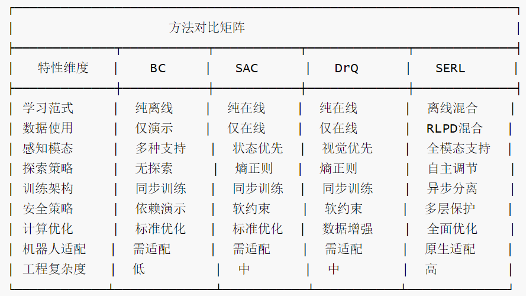

### 6.3 未来演进方向

SERL在机器人RL谱系中的定位显示：它不是某个单一极点，而是一个**务实的最优平衡点**，特别适合需要高安全性、稳定性和可部署性的真实机器人应用场景。

基于当前定位，SERL的潜在发展路径如下：

```
当前 SERL
    │
    ├─► 方向一：算法深化
    │   • 引入Transformer架构
    │   • 探索更高效的Ensemble方法
    │   • 集成世界模型
    │
    ├─► 方向二：系统扩展
    │   • 支持多机器人协同
    │   • 云端分布式训练
    │   • 边缘计算优化
    │
    └─► 方向三：应用拓展
        • 更多机器人平台支持
        • 仿真到现实迁移
        • 人机协作场景
```

### 6.4 从 SERL 到 HIL-SERL：人类干预进一步强化

SERL 已经支持 SpaceMouse 和人类干预相关组件，但 HIL-SERL 更强调 human-in-the-loop 数据流设计。SERL 是基础框架，HIL-SERL 是其扩展。

**核心区别**：

* SERL = SAC + Offline Pre-train + Online Fine-tune
* HIL-SERL = SERL + Human-in-the-Loop 纠正
* SERL 依赖离线专家数据 + 在线自主探索
* HIL-SERL 额外引入人类实时纠正，处理策略自主探索中的失败
* SERL 适合"中等精度"任务
* HIL-SERL 适合"极高精度"任务 (如 USB 插入、笔旋转等)
* SERL：干预数据作为普通的 transition 混入 replay buffer，与在线经验一同训练
* HIL-SERL：将干预数据作为更高质量的数据源单独管理，形成独立的数据通道

这种设计让 HIL-SERL 在复杂、精细、长程任务中能够进一步提高人类介入效率。通过区分在线探索数据和高质量干预数据，HIL-SERL 能够更好地利用人类专家的指导。

### 6.5 从 SERL 到 LWD：从单任务专家到车队级通用策略

SERL 主要验证的是真实机器人单任务或少量任务上的样本高效 RL。LWD 则进一步追求更宏大的愿景：

* 一个共享的 VLA（Vision-Language-Action）通用策略
* 多任务语言条件化
* 车队级部署数据回流
* 离线到在线持续后训练
* DIVL + QAM 这类适配生成式 VLA 的 RL 机制

我们可以这样看演进路线：

* SERL：证明真机 RL 可以在几十分钟内高效学会复杂任务
* HIL-SERL：加入更强的人类在环干预，提高复杂操作学习效率
* LWD：把这套思想扩展到 VLA、大规模任务和车队级部署学习

SERL 的价值在于，它提供了后续系统的工程基因：异步 Actor-Learner、prior data 混合、奖励自动化、阻抗控制、真实机器人环境封装和高样本效率训练。这些基础架构和设计理念，为 HIL-SERL 和 LWD 的发展奠定了坚实的工程基础。

## 0xFF 参考

[SERL——针对真机高效采样的RL系统：基于图像观测和RLPD算法等，开启少量演示下的RL精密插拔之路(含插入基准FMB的详解)](https://blog.csdn.net/v_JULY_v/article/details/151065525)
