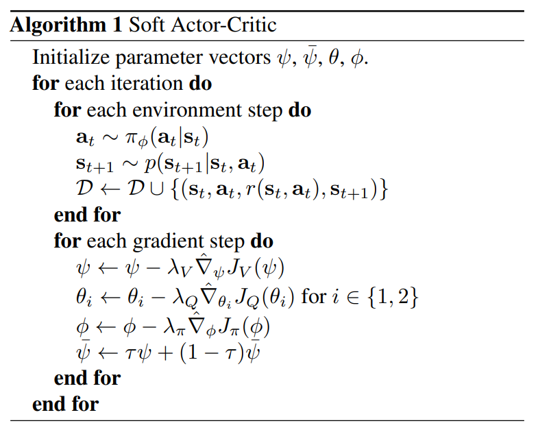
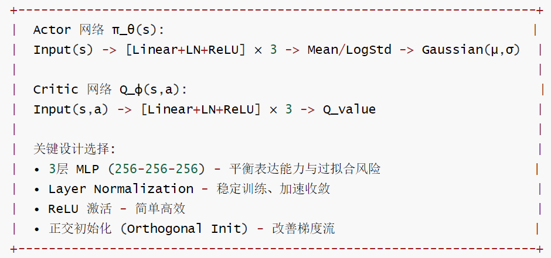
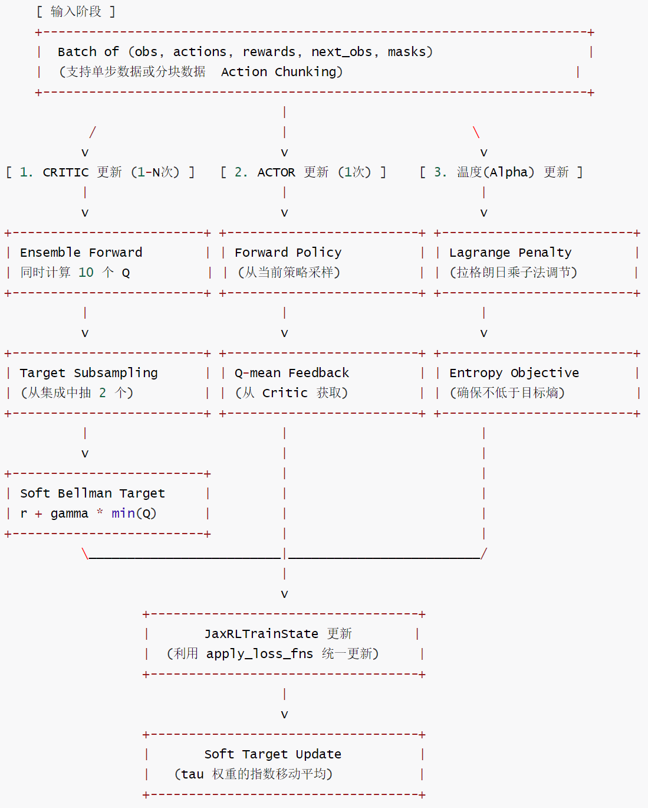
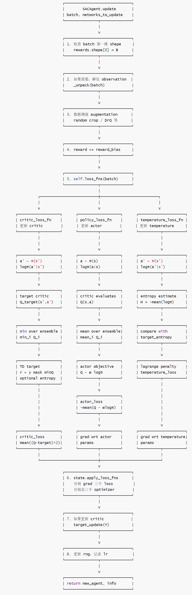

# 【机器人 / 强化学习】SERL：让真机强化学习从“难用”走向“可复现”的强化学习框架 ---- 算法篇（SAC）

目录

* [【机器人 / 强化学习】SERL：让真机强化学习从“难用”走向“可复现”的强化学习框架 ---- 算法篇（SAC）](#机器人--强化学习serl让真机强化学习从难用走向可复现的强化学习框架------算法篇sac)
  + [0x00 概要](#0x00-概要)
  + [0x01 基础 & 背景](#0x01-基础--背景)
    - [1.1 核心思想](#11-核心思想)
    - [1.2 熵解决的问题](#12-熵解决的问题)
  + [0x02 演化脉络](#0x02-演化脉络)
    - [2.1 Q-Learning：价值的推演](#21-q-learning价值的推演)
      * [2.1.1 核心思想](#211-核心思想)
      * [2.1.2 Q-Learning 的问题](#212-q-learning-的问题)
    - [2.2 Actor-Critic（AC）：分工协作](#22-actor-criticac分工协作)
      * [2.2.1 核心思路](#221-核心思路)
      * [2.2.2 输出分布](#222-输出分布)
      * [2.2.3 Actor-Critic 如何解决？](#223-actor-critic-如何解决)
      * [2.2.4 形象的类比](#224-形象的类比)
      * [2.2.5 结论](#225-结论)
    - [2.3 SAC](#23-sac)
      * [2.3.1 核心思想：做一个"爱探索的聪明人"](#231-核心思想做一个爱探索的聪明人)
      * [2.3.2 SAC 的"三驾马车"架构](#232-sac-的三驾马车架构)
        + [Actor 网络](#actor-网络)
        + [Critic 网络](#critic-网络)
        + [Temperature（α）网络](#temperatureα网络)
      * [2.3.3 SAC vs. 普通 Actor-Critic（AC）](#233-sac-vs-普通-actor-criticac)
        + [公式对比](#公式对比)
        + [通俗对比](#通俗对比)
    - [2.4. 三者的联系与进化](#24-三者的联系与进化)
  + [0x03 网络结构](#0x03-网络结构)
    - [3.1 SAC 到底有几个网络？](#31-sac-到底有几个网络)
    - [3.2 目标函数 \(J(\pi)\) 与损失函数](#32-目标函数--与损失函数)
      * [3.2.1 普通 AC 的损失函数：](#321-普通-ac-的损失函数)
      * [3.2.2 SAC 的损失函数](#322-sac-的损失函数)
    - [3.3 Critic（评论家）](#33-critic评论家)
      * [3.3.1 Critic 公式里的「Soft Value（软价值）」](#331-critic-公式里的soft-value软价值)
      * [3.3.2 Critic 到底该不该考虑熵？](#332-critic-到底该不该考虑熵)
      * [3.3.3 训练 Critic 时要不要更新 Actor？](#333-训练-critic-时要不要更新-actor)
    - [3.4 Actor（演员）](#34-actor演员)
      * [3.4.1 Actor Loss 的直观平衡](#341-actor-loss-的直观平衡)
      * [3.4.2 特色](#342-特色)
    - [3.5 小结](#35-小结)
  + [0x04 实现](#0x04-实现)
    - [4.1 异同](#41-异同)
    - [4.2 网络定义](#42-网络定义)
    - [4.3 SAC 网络架构](#43-sac-网络架构)
      * [4.3.1 核心组件](#431-核心组件)
      * [4.3.2 编码器架构](#432-编码器架构)
      * [4.3.3 损失函数](#433-损失函数)
  + [0x05 特色功能](#0x05-特色功能)
    - [5.1 重参数化](#51-重参数化)
      * [5.1.1 问题](#511-问题)
      * [5.1.2 方案](#512-方案)
    - [5.2 输出控制](#52-输出控制)
      * [5.2.1 Tanh 挤压: 气球与盒子的数学](#521-tanh-挤压-气球与盒子的数学)
      * [5.2.2 Clip 的灾难：梯度"消失"](#522-clip-的灾难梯度消失)
  + [0x06 SAC 的工作流程](#0x06-sac-的工作流程)
    - [6.1 工作流程](#61-工作流程)
    - [6.2 sac.py @ SERL](#62-sacpy--serl)
      * [6.2.1 RLPD 预适配](#621-rlpd-预适配)
      * [6.2.2 逻辑流程图](#622-逻辑流程图)
      * [6.2.3 四大特色深度解释](#623-四大特色深度解释)
      * [6.2.4 损失函数](#624-损失函数)
      * [6.2.5 训练调度器](#625-训练调度器)
      * [6.2.6 三个 loss 与 update 的总流程图](#626-三个-loss-与-update-的总流程图)
  + [0xFF 参考](#0xff-参考)

## 0x00 概要

SAC 是SERL 算法底座，是整个系统的"引擎"。SAC（Soft Actor-Critic）之所以在机器人领域（如 SERL 论文中）如此强大，是因为它解决了强化学习中最头疼的问题之一：如何在探索（寻找新方案）和利用（优化已知方案）之间取得完美平衡。

注：

* **本系列的最终目标是“通过一系列相关项目/算法的解读，来深入学习/分析/反推 LWD（Learning while Deploying）这篇论文的机理和可能实现”**。之所以从SERL入手，是因为 SERL，HIL-SERL，SOP（没有开源）都是罗剑岚博士的一系列论文，可以从中管窥作者的思路脉络。
* 本文依然是从工程/论文进行反推，还请读者不吝指出问题，多谢。

## 0x01 基础 & 背景

SAC 的"Soft"之源：传统强化学习目标是最大化累积奖励 \(\sum \gamma^\wedge t r\_t\)，SAC 在这个目标函数中额外增加了一项。SAC 解决了连续空间下的动作控制问题，它的"灵魂" 就是在于熵（Entropy）的引入。

SAC 的论文如下：[Soft Actor-Critic: Off-Policy Maximum Entropy Deep Reinforcement Learning with a Stochastic Actor](https://arxiv.org/pdf/1801.01290)

### 1.1 核心思想

SAC 的核心思想：奖励与"快乐"并存。

传统的 RL 让智能体像个"做题家"，只盯着分数（奖励 R）看。SAC 则引入了熵（Entropy）的概念。简单来说，熵代表了智能体动作的随机性或多样性。SAC 的目标不只是最大化奖励，而是：Maximize E [ 奖励 + α × 熵 ]

* 奖励：告诉智能体"什么是对的"。
* 熵：告诉智能体"不要死脑筋，多试试不同的动作"。
* α（Temperature）：决定了智能体有多"爱折腾"。

### 1.2 熵解决的问题

SAC 引入熵（Entropy）解决的是强化学习里最核心的矛盾：**探索（Exploration）与利用（Exploitation）的矛盾**。

* 传统算法的困境：智能体一旦发现"往左走拿高分"，就会迅速收缩策略，只往左走（过度利用），这会导致环境稍微改变就彻底抓瞎。
* SAC 的方案：通过增加熵项，它告诉智能体："在保证能拿到高分的同时，你的动作要尽可能随机。"
* 核心矛盾的解决：SAC 让智能体不仅学习"最优动作"，还学习了所有可能成功的动作。这带来了两个好处：
  1. 极强的抗干扰能力（即便路被堵了一半，它也知道其他走法）。
  2. 极快的训练速度（因为它在探索时更广，不容易掉进死胡同）。

直观理解：如果智能体发现有两条路都能到达终点，传统 RL 可能会死磕其中一条；而 SAC 尽量保持一种"两条路都能走"的状态，这让它在环境发生变化时更具鲁棒性。

## 0x02 演化脉络

我们可以把强化学习看作是"教一个小孩（智能体）在不同的房间（状态）里做不同的动作，最终为了拿到最多的糖果（奖励）"。接下来我们看看算法如何演进。

1. Q-Learning: 查表求最大, 适合离散动作。
2. Actor-Critic: 向导 + 地图, 适合连续动作。
3. SAC: 带灵魂的向导, 追求奖励与随机性的平衡。

### 2.1 Q-Learning：价值的推演

#### 2.1.1 核心思想

核心思想：我不教小孩怎么走，我只告诉他每个房间里每个动作值多少分。

* Q 值 \(Q(s,a)\)：在状态 \(s\) 采取动作 \(a\) 后，直到游戏结束，你预期能拿到的总分。
* 怎么学？
  + 小孩在房间里试。他看到：我在房间 A 往右拿走了 1 分，到了房间 B。
  + 他想："房间 A 往右的价值 = 现在的 1 分 + 房间 B 里最值钱的那个动作的分。"
  + 公式（贝尔曼方程）：\(Q(s,a) = R + \gamma \max\_{a'} Q(s', a')\)。我现在的身价 = 我现在挣的钱 + 我到了新环境后最值钱的那个可能性的折现值。
* 特点：
  + 它是 Value-based（基于价值）。
  + 小孩做决策很简单：看到哪个动作 Q 值大，就选哪个。

Q 值不是"当前"的分数，也不是"结束"时的总分，而是从现在开始到未来的累积预期。

* 当前分数（Reward）：你这一步踩下去拿到的即时反馈 \(R\)。
* Q 值 \(Q(s,a)\)：现在的奖励 + 未来的奖励（打个折 \(\gamma\)）。
* 类比：你现在决定去大厂加班（动作 \(a\)），当前奖励 \(R\) 是高工资，但 Q 值还要考虑这之后带给你的职业晋升空间和未来的总收入。

#### 2.1.2 Q-Learning 的问题

在 Q-Learning 中，我们需要找到让 Q 最大的动作 。

* Q-learning 的困难：如果动作是一个连续的数字（比如 0.1234… 到 1.0 之间的任何数），这代表这机器人下一步可能有无数个动作。你没办法一个一个带入 Q 网络去算一遍谁的分最高。这叫**搜索难题**。

具体而言，使用 Q 网络：当你真的要决定"该做什么动作"时，问题来了。Q 网络就像一个黑盒函数 。

* 在离散空间（比如：左、右、上、下）：你把 4 个动作分别塞进去，看谁高分。这很简单。
* 在连续空间（比如：转向 15.342 度）：你需要找到一个动作，使得分数最大。
* 难点：虽然你可以求导，但函数图像可能像崇山峻岭一样复杂（有很多局部最大值）。如果你只靠梯度微调去在大海捞针一样寻找那个 ，每一轮预测都要做一次耗时的优化过程，这在实时控制里太慢了！

### 2.2 Actor-Critic（AC）：分工协作

#### 2.2.1 核心思路

核心思想：与其让小孩自己记 Q 值，不如给小孩配一个教练。

* Actor（演员/小孩）：负责做动作。它不看分数，它只学一套"秘籍"（策略 \(\pi\)）：在房间 A 往左走的概率是 80%，往右是 20%。
* Critic（评论家/教练）：负责打分。它不亲自下场，它只学 Q 值，评价小孩做得好不好。
* 怎么学？
  1. Actor 做个动作。
  2. Critic 看一眼结果，说："这个动作比我预期的好（或者差）"。
  3. Actor 根据教练的反馈，调整自己的"秘籍"：好的动作以后多做，差的少做。
* 特点：
  + 结合了 Policy-based（基于策略）和 Value-based 的优点。
  + 它能处理连续动作（比如角度控制），这是纯 Q-Learning 很难做到的。

#### 2.2.2 输出分布

在机器人控制中，动作通常是连续的（比如电机的电压、关节的角度）。Actor 输出一个概率分布（如正态分布）而不是单一数值。输出分布对机器人的意义很大，想象你要控制机械臂抓一个杯子，左边抓可以，右边抓也可以。

* 如果输出一个确定数值，机械臂必须在左右之间死选一个。如果传感器有一点噪声，它可能就在左右之间疯狂抖动（这就是不稳定的来源！）。
* 如果输出一个分布，机械臂就知道："这两个动作都不错"。在实际操作中，这种"模糊性"反而能让动作更平滑，因为它允许系统在遇到微小阻力时有自然的调节空间。

#### 2.2.3 Actor-Critic 如何解决？

Actor 为什么可以解决 Q-Learning 的问题？

Actor 的思路是："我不用临时去找最佳动作，我直接养一个专门输出'最佳动作'的函数。"

* Actor 的参数 \(\theta\) 决定了：在状态 \(s\) 下，我倾向于输出哪个动作 \(a\)。
* 链式法则（核心秘籍）如下，我们要最大化 \(Q(s, \text{Actor}(s))\)，更新 Actor 的参数。

  \[\frac{\partial Q}{\partial(\text{Actor参数})} = \underbrace{(\frac{\partial Q}{\partial(\text{动作 }a)})}\_{\text{Critic告诉Actor动作往哪改}} \times \underbrace{(\frac{\partial \text{Actor}}{\partial(\text{Actor参数})})}\_{\text{Actor自己调整内部参数}}
  \]
* Actor 的巧妙之处：
  + Actor 也是一个神经网络。我们不搜索动作，我们直接优化参数。
  + 我们问 Critic：按照 Actor 现在输出的动作，分高吗？
  + Critic 说：不高，往左偏一点更高。
  + Actor 就通过梯度下降（计算导数），把自己的参数往左边挪一点。
* 结论：Actor 不需要遍历动作空间。它直接通过 Critic 给出的梯度信号，把自己的整个输出"拉"向高分区域。

#### 2.2.4 形象的类比

想象你在漆黑的深夜，要在山上找最高点：

* Q-Learning：你买了一份地图（Q网络）。你要在地图上找最高点。如果地图很大很细（连续空间），你得拿着放大镜一点点找，半天才能找到坐标。
* Actor-Critic：你不仅有地图（Critic），你还训练了一个向导（Actor）。
  + 每当你站在一个地方，地图告诉你：往北走海拔升高最快。
  + 向导立刻记住了："下次遇到这种情况，直接往北走"。
  + 下次你再来，你不需要看地图，直接问向导，他一秒钟就能指出方向。

#### 2.2.5 结论

* Q-Learning：目标是练出一本完美的地图。
* Actor-Critic：目标是练出一个完美的向导。而为了练好向导，我们不得不先画一份还凑合的地图来指导他。
* Q-learning 的 Q 网络：它像一张"估值表"。它不直接告诉你怎么走，你要自己查表找最高的。
* Actor：它相当于直觉/本能。它不是表，它是一个函数。输入状态 \(s\)，它直接喷出动作 \(a\)。在 Actor-Critic 中，Actor 取代了 Q-learning 中"查表求最大值"的那个过程。

### 2.3 SAC

SERL 框架的底层动力引擎是 SAC。之所以选择 SAC，是因为它是处理连续动作空间（机器人关节或末端位移）最稳定、性能最强的算法之一。

#### 2.3.1 核心思想：做一个"爱探索的聪明人"

传统的强化学习算法只追求"分数最高"。但 SAC 多了一个追求：**最大化熵（Entropy Maximization）**。它的公式可以表示为：目标 = 奖励 (Reward) + α × 熵 (Entropy)。

直白地说，SAC 不仅想拿高分，它还希望自己的动作尽可能地多样化、不呆板。这对于真实机器人非常重要：如果策略过早变得确定，一旦陷入错误的动作模式，就很难恢复；而熵正则让机器人保留了探索能力。

**好处有两点**：

* **强力探索**：它能尝试出各种不同的方法来完成任务；
* **极强鲁棒性**：如果环境发生微小变化，因为它学过很多种"姿势"，能快速适应，不容易在死胡同里卡死。

具体算法如下：



#### 2.3.2 SAC 的"三驾马车"架构

SERL 里的 SAC 实际上训练了三种网络：

**Actor（策略网络 π）**：负责出动作。它输出的是一个概率分布（比如：均值和方差），这意味着机器人每次做动作都会带有一点点随机性。

**Critic（两个 Q 网络 Q₁、Q₂）**：负责打分。为了解决"过估计"问题，SAC 永远训练两个 Q 函数，并取其中的最小值。

##### Actor 网络

* 任务：根据当前状态 s，决定该做什么动作 a。
* 实现：它输出的不是一个固定动作，而是一个分布（比如高斯分布的均值 μ 和标准差 σ）。

SAC 要求 Actor 的动作既要让 Q 值大，又要保持随机（熵大），这就像是要求一个短跑运动员："你要跑得尽量快（Q值），但跑姿还要尽量花哨多变（熵）。"

##### Critic 网络

Critic就是在做一个带熵修正的Q-learning。

* 任务：估算"在状态 s 采取动作 a 之后，未来能拿多少分（奖励+熵）"。
* 实现：通常用神经网络 \(Q(s, a)\) 表示。为了稳健，SAC 通常用两个 Q 网络，每次取最小值（防止高估）。

SAC 的 Critic 在算未来的价值时，不只看 \(\max Q\)，还要加上一句："而且我希望未来的动作选择越丰富越好"。

* 普通 Q-learning：\(Q = R + \gamma \max Q'\)
* SAC 的 Critic：\(Q = R + \gamma \mathbb{E}[\text{未来能拿的分} + \text{未来动作的熵}]\)

##### Temperature（α）网络

* 这是一个自动调节的参数，控制熵的权重。如果探索得不够，α 会变大，逼着智能体去随机尝试。
* 或者说，Temperature用来控制机器人什么时候该"浪一点"（多探索），什么时候该"稳一点"（多拿分）。

#### 2.3.3 SAC vs. 普通 Actor-Critic（AC）

##### 公式对比

* 普通 AC 的目标函数：\(J(\pi) = \sum\_t \mathbb{E}[r\_t]\) （只看奖励）
* SAC 的目标函数：\(J(\pi) = \sum\_t \mathbb{E}[ r\_t + \alpha \mathbb{H}(\pi(\cdot|s\_t)) ]\) （奖励 + α × 熵）。  
  其中 H 就是熵。如果 α=0，SAC 就变成了普通的连续空间 AC 算法。

##### 通俗对比

* 普通 AC：智能体像个死记硬背的学生。如果它发现往左能拿 10 分，往右拿 9 分，它会永远、固执地只往左走。即便左边的路偶尔塌陷，它也不管。
* SAC：智能体像个富有探索精神的探险家。它发现往左拿 10 分，往右拿 9 分，它会想："虽然左边高分，但右边也挺有意思的，我也得经常去转转。"它追求的是"条条大路通罗马"，而不是死磕一条路。

### 2.4. 三者的联系与进化

我们可以把这三者的演进看作是：

1. Q-Learning：只有大脑（记录分数的表），没有身体。在连续空间（动作有无穷多种可能）里，它没法找最大值 \(\max Q\)。
2. Actor-Critic：给大脑配了身体。大脑（Critic）评估价值，身体（Actor）直接输出动作。不用再费劲去求 \(\max\) 了，Actor 直接告诉你该做什么。
3. SAC（Soft Actor-Critic）：给这个组合加了"灵魂（熵）"。不仅要拿分，还要动作多样化，不要死板。

---

用一个类比总结：

* Q-Learning：就像你在玩扫雷。你学习每一格如果点开，大概率有多少分数。你最后选分数最高的那格点。
* Actor-Critic：就像导演和演员。演员（Actor）练习表演，导演（Critic）在旁边说："这一段演得好，多保持；那一段太浮夸，少来"。演员不看剧本的分数，只听导演的。
* SAC：导演（Critic）跟演员（Actor）说："你不仅要演得好，还得有自己的风格（熵），别老是演得跟模板一模一样，多尝试点即兴发挥"。

## 0x03 网络结构

本节，我们来看看SAC 的特色细节。

### 3.1 SAC 到底有几个网络？

在一个标准的 SAC 实现中，通常有以下几个神经网络：

1. Actor 网络（1 个）：输出动作的分布（\(\mu, \sigma\)）。
2. Critic 网络（2 个）：即 Q1 和 Q2。为什么要两个？为了解决**过度估计**问题。如果只有一个 Q，它会像个爱吹牛的人，把得分估得太高。两个 Q 取最小值，就能压住这种吹牛。
3. Target Critic 网络（2 个）：即 \(Q\_{\text{target1}}\) 和 \(Q\_{\text{target2}}\)。它们是 Q1，Q2 的影子，更新得非常慢（平滑更新）。这是为了让训练目标更稳定。
4. Temperature (自动熵调节) 网络（1个）：自动调节策略熵的目标值，确保温度参数 ≥ 目标熵。

### 3.2 目标函数 \(J(\pi)\) 与损失函数

在 RL 中，我们确实希望最大化 \(J(\pi)\)（即累积奖励）。但神经网络优化工具（如 PyTorch/TensorFlow）通常只能最小化一个损失函数（Loss）。因此，会设置 Loss \(= -J(\pi)\)。

#### 3.2.1 普通 AC 的损失函数：

* Critic：最小化均方误差 MSE(Q(s,a), Target)。
* Actor：通常使用策略梯度（Policy Gradient），让能够获得高 Q 值的动作出现的概率变大。

#### 3.2.2 SAC 的损失函数

* Critic Loss：\(MSE( Q(s,a), r+γ(minQ\_{target}(s′,a′)−αlogπ(a′∣s′)) )\)
* Actor Loss：\(\mathbb{E}\_{a\sim\pi} [αlogπ(a∣s)−minQ(s,a)]\)
* Alpha Loss：\(−α⋅E[logπ(a∣s)+H\_{target}]\)

### 3.3 Critic（评论家）

Critic 的目标是预测未来的总收益。在 SAC 的实现中，通常会维护两个 Q 网络（Clipped Double-Q）。

SAC 的 Critic：

\(Q = R + \gamma \mathbb{E}[\text{未来能拿的分} + \text{未来动作的熵}]， Q(s,a) \leftarrow r + \gamma \mathbb{E}\_{a'\sim\pi(\cdot|s')} [ Q(s',a') - \alpha \log \pi(a'|s') ]\)

#### 3.3.1 Critic 公式里的「Soft Value（软价值）」

\([ Q(s', a') - \alpha \log \pi(a'|s') ]\) 这个括号里的东西，我们称之为 Soft Value（软价值）。

* \(Q(s', a')\)：下一步能拿到的奖励预期。
* \(-\alpha \log \pi(a'|s')\)：下一步动作的随机性（熵）奖励。\(-\log P\) 在信息论里就是「惊奇度」，期望的惊奇度就是熵。
* 含义：Critic 现在不只是在预测钱（奖励），它还在预测 钱 + **自由度（熵）**。它告诉智能体：「去那个奖励又高、选择又丰富的地方」。

#### 3.3.2 Critic 到底该不该考虑熵？

既然提到了熵，我们就看看，Critic 为何要考虑熵。

如果 Critic 只预测奖励，而 Actor 却在追求"奖励+熵"。这会导致什么结果？

* Critic 会对 Actor 说："你刚才那个动作太随机了，虽然奖励高，但我不看好你。"
* Actor 会说："可我的目标就是要随机啊！"

这会导致"驴唇不对马嘴"，两者无法协作。所以，SAC 的 Critic 更新公式是 \(Q(s,a) \leftarrow r + \gamma \mathbb{E}\_{a'\sim\pi(\cdot|s')} [ Q(s',a') - \alpha \log \pi(a'|s') ]\)。这里的 \(-\alpha \log \pi(a'|s')\) 其实就是熵的体现。如果智能体在下一步动作 \(a'\) 的概率非常高（非常确定），\(-\log \pi\) 会变得很小；如果动作很随机，\(-\log \pi\) 会变大。

这意味着，SAC 的 Critic 实际上是在评估："这步动作不仅现在好，而且能保证以后有更多的选择余地"。

#### 3.3.3 训练 Critic 时要不要更新 Actor？

实际上在代码实现中：训练 Critic 时，Actor 是**禁止动弹**的。

* 原因：Critic 的目标是「预测准确」。它要预测的是当前 Actor 表现如何。如果 Critic 一边在学预测，Actor 一边在变，Critic 就会像在追一个移动的靶子，永远练不准。
* 做法：我们计算 Target 时，会用到 Actor 输出的概率 \(\pi\)，但我们只传导梯度给 Critic 的参数。这叫**解耦**。

在每一轮训练中，我们其实是分两步走的：

* 第一步：练 Critic（Actor 站着不动）
  + 我们要让 Critic 学会评价当前这个 Actor 的水平。
  + 计算 Loss 时，我们会用到 Actor 的输出 \(\pi\)，但我们设置 `actor.requires_grad = False` 或者只是不把 Actor 的参数放进优化器。
  + 结果：只有 Critic 的权重变了，Actor 没变。
* 第二步：练 Actor（Critic 坐着当评委）
  + 现在 Critic 已经练好了，它能准确判断动作的好坏了。
  + 我们让 Actor 跑一遍，计算 \(\text{Loss} = \alpha \log \pi - Q\)。
  + 此时计算梯度并且只更新 Actor 的参数。
  + 结果：Actor 变聪明了，它学会了如何让评委（Critic）给自己打高分。
* 总结：在整个大循环里，Actor 当然要更新；但在"训练 Critic"那个具体的子步骤里，Actor 是不动的。

### 3.4 Actor（演员）

Actor Loss 如下：$$\text{Loss}*{{\text{Actor}}} = \mathbb{E}* \left[ \alpha \log \pi(a|s) - Q(s, a) \right]$$

这个 Loss 的两部分为：

* \(-Q(s, a)\)：最小化这个，就是在最大化 Q（优化奖励）。
* \(\alpha \log \pi(a|s)\)：最小化这个，就是在让 \(\pi(a|s)\) 变小（因为 log 是增函数）。\(\pi\) 越小，分布就越平、越随机（即最大化熵）。

这就好比：一个教练（Loss）同时盯着运动员的「速度」和「花哨程度」。如果速度慢了，教练扣分；如果动作单一了，教练也扣分。

* 当调用 `loss.backward()` 时，梯度会穿过 Q 网络（但 Q 的参数被冻结，不更新），一直回传到 Actor 网络输出 \(\mu\) 和 \(\sigma\) 的那一层。
* 在这个 Loss 里，\(Q(s,a)\) 的值决定了梯度的大小和方向，但我们只用它来告诉 Actor："往这边调整你的 \(\mu\) 和 \(\sigma\)，能让 Q 变得更大"。

#### 3.4.1 Actor Loss 的直观平衡

\(Loss\_{a} = E [ \underbrace{-a}\_{变量} · (\underbrace{log π(a|s) + \bar{H}}\_{误差}) ]\)

这是一个标量损失函数（Scalar Loss）。\(\bar{H}\) 是你的目标。比如你希望动作保持一定的随机性。

* 当 Loss 减小时：\(\alpha \log \pi(a|s)\) 减小 → \(\log \pi\) 趋向更负的值 → \(\pi\) 变小 → 分布变宽、越随机（熵优化）。
* 博弈平衡：如果 \(\pi\) 缩得太小（太随机），Q 值可能会下降；如果 \(\pi\) 太集中，熵损失会变大。\(\alpha\) 这个权重决定了最终平衡点在哪里。
  + 场景 A: 太确定了。log π 很大 (接近 0), 导致 (log π + \bar{H}) 变成正数。为了让 Loss 减小, a 必须增大。后果: a 变大后, 在 Actor 的 Loss 中, 熵的权重增加了。Actor 会被教导: "别管奖励了, 先给我变随机点! "
  + 场景 B: 太乱了。a 会减小, 让 Actor 专心去拿奖励。

#### 3.4.2 特色

目标函数：Maximize E [ 奖励 + α × 熵 ]。如果 α=0，智能体会陷入"死磕一条路"的死胡同。熵确保了智能体在追求高分的同时，保持"条条大路通罗马"的鲁棒性。

为什么 \(\sigma \to 0\)，熵就没了？

* 直观理解：\(\sigma\) 代表不确定性。如果 \(\sigma\)=0，意味着智能体 100% 确定只做一个动作。既然完全确定，就没有随机性（不确定性），熵自然就是 0（甚至在连续空间定义下趋向负无穷）。
* 数学公式：高斯分布的微分熵公式是 \((1/2)\ln(2\pi e \sigma^2)\)。当 \(\sigma \to 0\) 时，这个值趋向 \(-\infty\)。

为什么 log π 越大, 熵就越小? 我们要先搞清楚概率 π 的范围: 它在 [0, 1] 之间。

* 动作非常确定：比如智能体 99% 的概率选动作 A。此时 π(A|s) ≈ 1, 那么 log π ≈ log 1 = 0。
* 动作非常随机：比如有 100 个动作, 智能体每个都选, 概率 π ≈ 0.01。此时 log π ≈ log 0.01 = -4.6。

结论: 在负数世界里, 0 是最大的。所以 log π 越接近 0 (越大), 说明概率越集中, 熵 (即 -log π 的平均值) 就越小。

### 3.5 小结

Actor和Critic使用**高度相似但不完全相同**的网络架构。主要区别在于Critic需要额外输入动作信息，这符合Actor-Critic算法的理论设计。

**相似点**：

1. 都使用 **相同的编码器**（视觉编码器可共享）
2. 都使用 **MLP主干网络**（hidden\_dims配置相同，默认[256, 256]）
3. 都支持 **多设备并行**（通过ensemble机制）

**关键差异**：

| 特性 | Actor | Critic |
| --- | --- | --- |
| **输入** | 仅观测 `observations` | 观测 + 动作 `[obs_enc, actions]` |
| **输出** | 动作分布参数 `mean, std` | 标量Q值 |
| **网络结构** | 独立输出均值和标准差 | 单一输出层 |
| **激活函数** | 最后一层通常激活 | 通常线性输出 |

## 0x04 实现

SERL 的网络设计选择如下：



### 4.1 异同

Actor和Critic使用**高度相似但不完全相同**的网络架构。主要区别在于Critic需要额外输入动作信息，这符合Actor-Critic算法的理论设计。

**相似点**：

1. 都使用 **相同的编码器**（视觉编码器可共享）
2. 都使用 **MLP主干网络**（hidden\_dims配置相同，默认[256, 256]）
3. 都支持 **多设备并行**（通过ensemble机制）

**关键差异**：

| 特性 | Actor | Critic |
| --- | --- | --- |
| **输入** | 仅观测 `observations` | 观测 + 动作 `[obs_enc, actions]` |
| **输出** | 动作分布参数 `mean, std` | 标量Q值 |
| **网络结构** | 独立输出均值和标准差 | 单一输出层 |
| **激活函数** | 最后一层通常激活 | 通常线性输出 |

### 4.2 网络定义

Actor 网络如下：

```
class Policy(nn.Module):
    encoder: Optional[nn.Module]  # 视觉编码器
    network: nn.Module            # MLP主干网络
    action_dim: int
    
    def __call__(self, observations, temperature=1.0):
        if self.encoder is None:
            obs_enc = observations
        else:
            obs_enc = self.encoder(observations, train=train, stop_gradient=True)
        
        outputs = self.network(obs_enc, train=train)
        means = nn.Dense(self.action_dim)(outputs)
        stds = nn.Dense(self.action_dim)(outputs)  # 标准差参数
        
        return TanhMultivariateNormalDiag(loc=means, scale_diag=stds)
```

Critic 网络定义如下：

```
class Critic(nn.Module):
    encoder: Optional[nn.Module]  # 视觉编码器
    network: nn.Module            # MLP主干网络
    
    def __call__(self, observations, actions, train=False):
        if self.encoder is None:
            obs_enc = observations
        else:
            obs_enc = self.encoder(observations)
        
        inputs = jnp.concatenate([obs_enc, actions], -1)  # 关键差异
        outputs = self.network(inputs, train=train)
        value = nn.Dense(1)(outputs)  # 输出Q值
        
        return jnp.squeeze(value, -1)
```

### 4.3 SAC 网络架构

SACAgent 算是 SERL Agent 系统的基础，所以我们从它看起。

```
class SACAgent(flax.struct.PyTreeNode):
```

其总体信息如下：

| 组件 | 输入 | 网络结构 | 输出 | 参数共享 |
| --- | --- | --- | --- | --- |
| **Actor** | 图像观测 | 编码器+MLP[256,256] | 动作分布(μ,σ) | 编码器可共享 |
| **Critic** | 图像+动作 | 编码器+Ensemble MLP[256,256]×2 | Q值 | 编码器可共享 |
| **Temperature** | 无 | Lagrange乘数 | 标量温度 | 独立参数 |

#### 4.3.1 核心组件

**Actor (Policy) 网络内部结构**：

* **编码器**：将图像编码为特征向量
* **MLP主干**：[256, 256]全连接层
* **输出层**：均值和标准差各一个全连接层
* **分布**：TanhMultivariateNormalDiag

```
policy_def = Policy(
    encoder=encoders["actor"],              # 视觉编码器
    network=MLP(**policy_network_kwargs),   # 默认 [256, 256]
    action_dim=actions.shape[-1],
    tanh_squash_distribution=True,
    std_parameterization="uniform",
)
```

**Critic内部结构**：

* **编码器**：与Actor相同或独立
* **Ensemble MLP**：默认2个独立的Critic网络
* **输入**：拼接编码特征和动作 `[obs_enc, actions]`
* **输出**：标量Q值

```
critic_backbone = partial(MLP, **critic_network_kwargs)  # [256, 256]
critic_backbone = ensemblize(critic_backbone, critic_ensemble_size)(
    name="critic_ensemble"
)
critic_def = partial(
    Critic, 
    encoder=encoders["critic"],  # 可与Actor共享编码器
    network=critic_backbone
)
```

**Temperature (自动熵调节) 网络**：

* **作用**：自动调节策略熵的目标值
* **约束**：确保温度参数 ≥ 目标熵
* **更新**：通过拉格朗日乘数法优化

```
temperature_def = GeqLagrangeMultiplier(
    init_value=temperature_init,  # 默认1.0
    constraint_shape=(),
    constraint_type="geq",
)
```

#### 4.3.2 编码器架构

**"small" 编码器**：

```
encoders = {
    image_key: SmallEncoder(
        features=(32, 64, 128, 256),
        kernel_sizes=(3, 3, 3, 3),
        strides=(2, 2, 2, 2),
        padding="VALID",
        pool_method="avg",
        bottleneck_dim=256,
        spatial_block_size=8,
    )
}
```

**"resnet" 编码器**：

```
encoders = {
    image_key: resnetv1_configs["resnetv1-10"](
        pooling_method="spatial_learned_embeddings",
        num_spatial_blocks=8,
        bottleneck_dim=256,
    )
}
```

**"resnet-pretrained" 编码器**：

```
pretrained_encoder = resnetv1_configs["resnetv1-10-frozen"](
    pre_pooling=True,
)
encoders = {
    image_key: PreTrainedResNetEncoder(
        pooling_method="spatial_learned_embeddings",
        num_spatial_blocks=8,
        bottleneck_dim=256,
        pretrained_encoder=pretrained_encoder,  # 冻结的预训练权重
    )
}
```

#### 4.3.3 损失函数

SAC 的熵正则化保证了探索性，双Critic的ensemble提供了稳定的价值估计，自动温度调节实现了探索-利用的平衡。

**Critic损失**：

```
def critic_loss_fn(self, batch, params, rng):
    # 计算目标Q值
    target_next_qs = self.forward_target_critic(batch["next_observations"], next_actions, rng)
    target_next_min_q = target_next_qs.min(axis=0)  # 最小Q值（保守估计）
    
    # TD误差
    predicted_qs = self.forward_critic(batch["observations"], batch["actions"], rng, grad_params=params)
    critic_loss = jnp.mean((predicted_qs - target_qs) ** 2)
```

**Actor损失**：

```
def policy_loss_fn(self, batch, params, rng):
    # 最大化Q值-熵
    predicted_q = predicted_qs.mean(axis=0)
    actor_objective = predicted_q - temperature * log_probs
    actor_loss = -jnp.mean(actor_objective)
```

## 0x05 特色功能

### 5.1 重参数化

重参数化（Reparameterization Trick）：直接从分布采样是不可导的。通过 a = μ + σ · ε（ε 是固定噪声），我们把随机性剥离出来，让梯度能顺着"加法和乘法"回传。

#### 5.1.1 问题

在 SAC 中，Actor 输出的是一个概率分布（通常是高斯分布）。

由于我们需要对这个分布进行采样才能得到动作 a，但"采样"这个动作是不可导的，这就导致梯度无法直接回传给生成分布的神经网络。

为什么采样不能传导梯度？这是深度学习中最经典的问题之一。

* 场景：神经网络输出 \(\mu\)=10，\(\sigma\)=2。
* 采样：你从这个分布里「随机」抽了一个数 \(a\)=11。
* 断裂点：当你计算 Loss 后，你想问：「如果我把 \(\mu\) 从 10 改成 10.1，对 a 有什么影响？」
* 结论：无法回传。因为「采样」这个动作在计算机里是调用了 `random()`。随机数发生器就像一个黑盒，梯度传到这里就断了。

#### 5.1.2 方案

那么在复现 Actor 的更新过程时，我们该如何让梯度通过这个"采样"步骤传回神经网络的参数中？重参数化（Reparameterization Trick）其实就是为了解决 Actor 怎么根据这个带熵的 Q 值更新梯度的问题。

目前问题就是：我们该怎么把"抽样"这个动作变成一个"加减乘除"的公式？

SERL 不直接采样 \(a \sim \mathcal{N}(\mu, \sigma)\)，而是写成：$$a = \mu + \sigma \cdot \varepsilon, \quad \varepsilon \sim \mathcal{N}(0, 1)$$

* 这里 \(\varepsilon\) 是一个固定的随机噪声。
* 现在，\(a\) 就变成了一个关于 \(\mu\) 和 \(\sigma\) 的确定性函数（加法和乘法）！
* 梯度就可以顺着 \(a \to \mu\) 和 \(a \to \sigma\) 传回神经网络了。

### 5.2 输出控制

重参数化使用了 \(a = \mu + \sigma \varepsilon\)。但在机器人控制中，动作通常是有范围的（比如 -1 到 1）。直接加减可能会超出范围。SAC 论文里用了Tanh 激活函数来把这个 a 限制在 \((-1,1)\)。

* 做法：Actor 输出一个原始值 \(u \sim \mathcal{N}(\mu, \sigma)\)，然后计算 \(a = \tanh(u)\)。
* 用了 Tanh 之后，动作就不再是纯粹的高斯分布了。为了计算准确的熵，我们需要用到雅可比行列式（Jacobian）来对概率密度进行修正。在代码里，这通常表现为一个修正项：\(\text{loss} = -\log p(u) - \log(1 - \tanh(u)^2)\)。

#### 5.2.1 Tanh 挤压: 气球与盒子的数学

当你把一个高斯分布的 u 通过 a = tanh(u) 映射到 (-1, 1) 时, 概率密度会发生变化。

* 为什么不能直接用高斯公式? 因为 tanh 在靠近 1$ 和 $-1 的时候非常"平"。很多个不同的 u 可能会被挤压到极其接近的 a。
* 代码怎么写? 我们需要用到雅可比修正 (Jacobian Correction)。
  + 公式如下：\(log π(a|s) = log μ(u|s) - Σ\_{i=1}^D log(1 - tanh²(u\_i))\)，注: μ(u|s) 是原始高斯分布的概率。
  + 在代码中, 这通常写成: log\_prob = dist.log\_prob(u) - torch.log(1 - a.pow(2) + 1e-6).sum(dim=-1)。1e-6 是为了防止数值溢出。

#### 5.2.2 Clip 的灾难：梯度"消失"

如果我们不使用 Tanh 修正，直接强制把超出范围的动作 clip 掉，这会给"梯度回传"带来什么灾难？

如果用 `clip(a, -1, 1)`：

* Actor 输出 \(a\)=1.5$，被 clip 成了 $1.0。
* 在反向传播时，clip 函数在 \(1.5\) 这里的导数是 0。
* 后果：梯度传到这里就断了！神经网络接收不到任何信号告诉它"其实你应该减小输出"。
* Tanh 的好处：它是平滑的，即便输出很大，梯度依然存在（虽然很小），能指引网络回来。

## 0x06 SAC 的工作流程

### 6.1 工作流程

极简版工作流程如下：

1. 收集数据：在环境里跑趟，把 \((s, a, r, s', done)\) 存进"经验回放池"（Replay Buffer）。
2. 训练 Critic：从池子里抓一批数据，告诉 Q 网络："根据你看到的奖励和下一步的预测，修正你对当前状态动作价值的评估"。
3. 训练 Actor：告诉 Actor："调整你的参数，使得你输出的动作能让 Q 值最大，同时熵也要足够大"。

下面是 SAC 算法的高层结构伪代码。它清晰地展示了 数据流 是如何在 Actor (演员)、Critic (评论家) 和 Buffer (经验池) 之间流动的。

```
class SACAgent:
     def __init__(self):
        # 1. 初始化 5 个核心网络
        self.actor = ActorNetwork()        # 策略函数: s -> (mu, sigma)
        self.critic1 = CriticNetwork()     # Q1函数: (s, a) -> q1
        self.critic2 = CriticNetwork()     # Q2函数: (s, a) -> q2
        self.target_critic1 = Target()     # Q1的稳定副本
        self.target_critic2 = Target()     # Q2的稳定副本
        
        # 2. 熵自动调节参数 (Temperature)
        self.log_alpha = log(initial_alpha)

        # 3. 经验回放池
        self.replay_buffer = ReplayBuffer(capacity=1000000)

    def step(self, state):
        """与环境交互: 根据当前状态, 喷出一个动作"""
        action = self.actor.sample(state)
        return action

    def train_step(self):
        """核心训练逻辑: SAC 的三步走"""
        # 从池子里抓一把数据
        batch = self.replay_buffer.sample(batch_size=256)

        # --- 第一步: 更新 Critic (练地图) ---
        self.update_critic(batch)

        # --- 第二步: 更新 Actor (练向导) ---
        # 顺着 Critic 指出的梯度方向, 让 Actor 变得更好
        self.update_actor(batch)

        # --- 第三步: 自动调节 Alpha (练灵魂) ---
        # 如果熵太小, 调大 Alpha 增加探索; 反之调小
        self.update_alpha(batch)

        # --- 最后: 平滑更新 Target 网络 ---
        self.soft_update_targets()

    def update_critic(self, batch):
        """计算带熵的 Bellman 目标"""
        # 核心公式: Target = R + gamma * (min(Q1_target, Q2_target) - alpha * log_prob)
        target_q = self.calculate_target_q(batch)

        # 最小化 MSE 误差
        loss1 = MeanSquaredError(self.critic1(s, a), target_q)
        loss2 = MeanSquaredError(self.critic2(s, a), target_q)
        # 执行梯度下降...
```

### 6.2 sac.py @ SERL

我们接下来看看 SERL 开源代码的实现，看看其对 SAC 做了什么改变。

#### 6.2.1 RLPD 预适配

在 SERL 的代码库中，sac.py 扮演的是"通用底座"的角色。原生 SAC 在真机上其实很慢。为了让它起飞，SERL 做了若干增强，sac.py 其实是一个"全能型 SAC"。虽然这个文件叫 sac.py，但它已经为 RLPD 做好了全部基础准备：

* High UTD 支持：update\_high\_utd 函数把一个大的 Batch 拆成 20 份，连续更新 20 次 Critic，这是 RLPD 能跑通的前提。
* LayerNorm 的隐形支持：它调用了 MLP 网络。只要在创建时传入 value\_layer\_norm=True，它就会自动在内部插入归一化层。
* Ensemble Q：它支持 critic\_ensemble\_size=10，这是 RLPD 抑制 Q 值发散的手段。即，在计算 Target 时, 它不是取最小值, 而是计算这 10 个 Q 的均值减去标准差：\(Target Q = mean(Q\_{1...10}) - std(Q\_{1...10}) × ρ\)

  这叫"悲观备份"。在不确定的地方, Q 值会因为标准差大而被拉低。这强迫智能体只信任那些所有 Q 网络都达成共识的高分区域。
* 自动调节 Alpha（Lagrange）：它使用了拉格朗日乘子法（GeqLagrangeMultiplier）来自动调节熵，比我们手写的手动更新公式更数学化、更稳定。
* JAX 异步更新：利用 JAX，SAC 的 10 个 Critic 可以在不同显卡上并行更新，极大地提升了训练吞吐量。

缺少的内容如下：

1. 缺少 50/50 采样逻辑：在 sac.py 的 update 函数中，它只接收一个 batch。真正的 RLPD 逻辑（从两个池子各抽 128 个数据）通常是在外部的训练循环中完成的，或者是通过更高层的封装实现的。
2. 缺少 BC Loss：sac.py 的 policy\_loss\_fn中，只有 predicted\_q - temperature \* log\_probs。它没有我们之前在 rlpd.py 里看到的那个关键的 bc\_alpha \* log\_prob(batch\_actions)。这意味着这个 sac.py 并不具备"模仿演示数据"的能力。

#### 6.2.2 逻辑流程图

特色功能 (Special Features)如下：

1. Ensemble Support: 通过 jax.vmap 实现的 Q 集成，训练速度极快，天生支持 REDQ 算法。
2. High UTD Dispatch: 专门的 update\_high\_utd 逻辑，大幅提升采样效率。
3. Modular Encoders: 支持 Shared Encoder (ResNet)，节省显存并加速表征学习。
4. Action Chunking: 支持一次输出一串动作，适合高频机器人控制场景。



#### 6.2.3 四大特色深度解释

* 极致的集成（Ensemble）与向量化。sac.py 使用了 ensemblize 技巧。

  + 黑科技：它利用 JAX 的 vmap 将 Q 网络变成了一个并行张量。
  + 优势：无论你是想要 2 个 Q 还是 10 个 Q，在底层计算上几乎一样快。这让算法在保持"悲观评估"（防止高估）的同时，不会拖累机器人的实时响应。
* "重 Critic、轻 Actor" 的高 UTD 架构。SERL 中有一个非常显著的策略：在 update\_high\_utd 里，Critic 更新 20 次，Actor 才更新 1 次。

  + 解释：Critic 是 Actor 的"导师"。如果导师自己都还没把图画清楚（Q 值没收敛），让 Actor 拼命改参数只会让它学废了。先刷 20 次，再更新一次，是 SERL 实现 20 分钟学会抓取的硬件级优化。
* 灵活的视觉编码器架构（create\_pixels）。源码中通过 shared\_encoder 参数决定了 Actor 和 Critic 是否共用一个视觉大脑。

  + 解释：在机器人任务中，处理像素是最累的活。共用 ResNet 不仅显存省，更重要的是能强迫网络去学习那些任务通用的物理特征（比如：杯子的边缘在哪里、桌子的高度是多少），而不是只学习针对自己有用的特征。
* 拉格朗日温度控制（GeqLagrangeMultiplier）。源码中引入了拉格朗日约束（并非简单的梯度下降来更新 α）。

  + 解释：这是一种更稳健的数学方法，它能确保熵被强制约束在一个区间内。当熵太低时，α 会像踩刹车一样迅速反弹，防止智能体陷入"死胡同"。

#### 6.2.4 损失函数

在 SAC 中，训练目标通常拆成三个部分：

| 损失函数 | 更新对象 | 核心目标 |
| --- | --- | --- |
| `critic_loss_fn` | critic / Q 网络 | 学习 Bellman backup，让 Q 逼近 TD target |
| `policy_loss_fn` | actor / policy 网络 | 最大化 Q，同时最大化熵 |
| `temperature_loss_fn` | temperature / α | 自动调节熵权重，使策略熵接近目标熵 |

在这份代码里，这三个 loss 会被包装成一个字典：

```
def loss_fns(self, batch):
    return {
        "critic": partial(self.critic_loss_fn, batch),
        "actor": partial(self.policy_loss_fn, batch),
        "temperature": partial(self.temperature_loss_fn, batch),
    }
```

这意味着：

```
critic_loss_fn       → 更新 params["critic"]
policy_loss_fn       → 更新 params["actor"]
temperature_loss_fn  → 更新 params["temperature"]
```

不过从实现上看，`apply_loss_fns` 会对 **全量 `self.params`** 求梯度，然后通过不同 optimizer 分支把对应梯度应用到参数树上。

#### 6.2.5 训练调度器

`update` 则是训练调度器：它先整理 batch，再构造三个 loss，按 `networks_to_update` 决定本轮更新哪些网络，最后统一调用 `apply_loss_fns` 计算梯度并应用 optimizer。

可以把整个 update 理解成一个三方协作系统：

```
critic_loss_fn:
    学会评价 replay buffer 中的动作。
    目标来自 r + γ * target_Q(s', π(s'))。

policy_loss_fn:
    利用 critic 的评价来改进 actor。
    让 actor 选择 Q 更高且保持一定熵的动作。

temperature_loss_fn:
    自动调节 α。
    如果策略太确定，就提高熵权重；
    如果策略太随机，就降低熵权重。
```

对应到真实机器人训练场景中，我们可以这样理解：

* **critic** 像评分器：判断某个状态下某个动作未来是否有价值，让打分更准；
* **actor** 像执行策略：根据评分器的反馈学习更好的动作，让动作更像高分动作且多样化；
* **temperature** 像探索旋钮：控制机器人是更大胆探索，还是更稳定执行。

#### 6.2.6 三个 loss 与 update 的总流程图



## 0xFF 参考

[SERL——针对真机高效采样的RL系统：基于图像观测和RLPD算法等，开启少量演示下的RL精密插拔之路(含插入基准FMB的详解)](https://blog.csdn.net/v_JULY_v/article/details/151065525)
