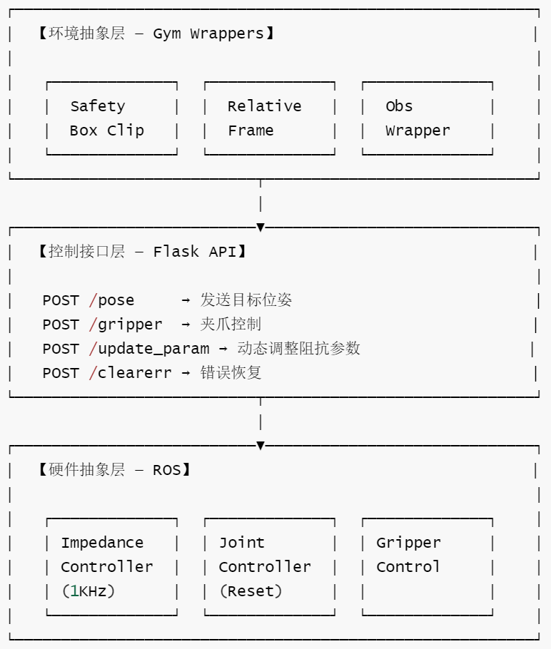
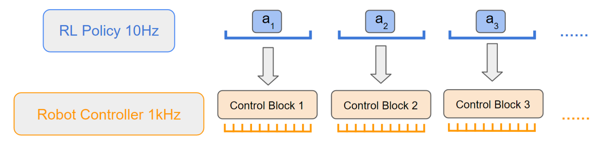
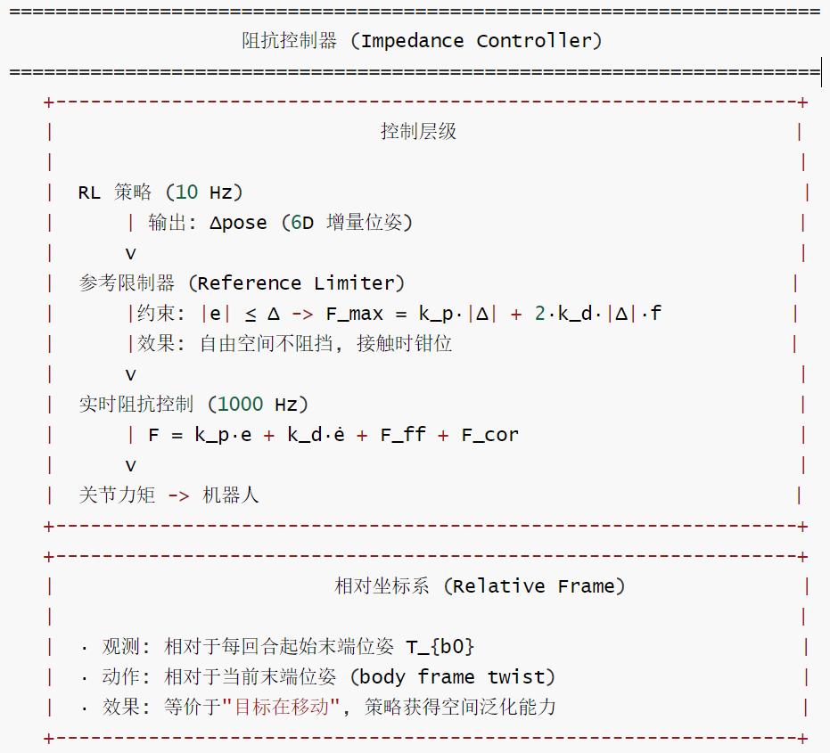
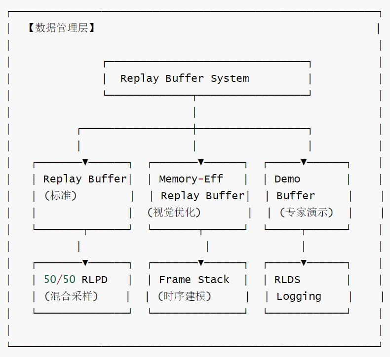
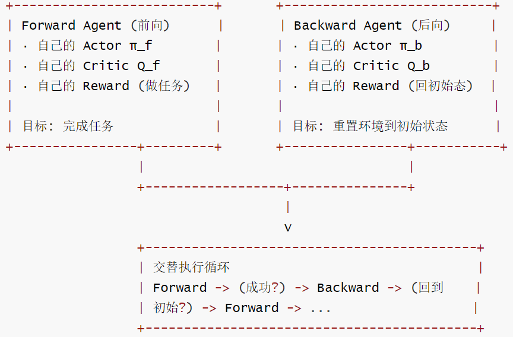

# 【机器人 / 强化学习】SERL：让真机强化学习从“难用”走向“可复现”的强化学习框架 ----（5）工程篇

目录

* [【机器人 / 强化学习】SERL：让真机强化学习从“难用”走向“可复现”的强化学习框架 ----（5）工程篇](#机器人--强化学习serl让真机强化学习从难用走向可复现的强化学习框架-----5工程篇)
  + [0x00 概要](#0x00-概要)
  + [0x01 SERL 要解决什么核心问题？](#0x01-serl-要解决什么核心问题)
  + [0x02 系统架构：三层解耦的通用适配器](#0x02-系统架构三层解耦的通用适配器)
    - [2.1 整体架构](#21-整体架构)
    - [2.2 协议标准化与参数配置化](#22-协议标准化与参数配置化)
  + [0x03 控制层：阻抗控制是 SERL 的物理底座](#0x03-控制层阻抗控制是-serl-的物理底座)
    - [3.1 为什么需要阻抗控制？](#31-为什么需要阻抗控制)
    - [3.2 两层控制结构](#32-两层控制结构)
    - [3.3 阻抗控制器的实现](#33-阻抗控制器的实现)
      * [3.3.1 启动过程](#331-启动过程)
      * [3.3.2 参数配置](#332-参数配置)
      * [3.3.3 运行时参数调整](#333-运行时参数调整)
      * [3.3.4 力觉融合](#334-力觉融合)
    - [3.4 多重安全熔断机制](#34-多重安全熔断机制)
  + [0x04 数据层：视觉记忆与采样优化](#0x04-数据层视觉记忆与采样优化)
    - [4.1 Frame Stacking：赋予机器人感知速度的能力](#41-frame-stacking赋予机器人感知速度的能力)
    - [4.2 Memory-Efficient Replay Buffer：80% 内存节省的工程方案](#42-memory-efficient-replay-buffer80-内存节省的工程方案)
      * [核心设计：存单帧、采样时重建](#核心设计存单帧采样时重建)
    - [4.3 Frame Stacking vs Reconstruction Sampling](#43-frame-stacking-vs-reconstruction-sampling)
  + [0x05 相对坐标系：让策略不再"路痴"](#0x05-相对坐标系让策略不再路痴)
    - [5.1 为什么需要相对坐标系？](#51-为什么需要相对坐标系)
    - [5.2 解决方案：RelativeFrame Wrapper](#52-解决方案relativeframe-wrapper)
    - [5.3 三条坐标转换主线](#53-三条坐标转换主线)
    - [5.4 整体执行时序](#54-整体执行时序)
      * [5.4.1 reset 阶段](#541-reset-阶段)
      * [5.4.2 step 阶段](#542-step-阶段)
    - [5.5 一个直观例子](#55-一个直观例子)
    - [5.6 action 如何从末端坐标系转换到 base 坐标系？](#56-action-如何从末端坐标系转换到-base-坐标系)
    - [5.7 人工干预时的坐标一致性](#57-人工干预时的坐标一致性)
    - [5.8 Quat2EulerWrapper：相对 pose 如何给策略使用](#58-quat2eulerwrapper相对-pose-如何给策略使用)
  + [0x06 Reset-Free Training：让机器人自己"重置考场"](#0x06-reset-free-training让机器人自己重置考场)
    - [6.1 核心思路：前向-后向策略](#61-核心思路前向-后向策略)
    - [6.2 双策略并行训练架构](#62-双策略并行训练架构)
    - [6.3 训练流程与切换逻辑](#63-训练流程与切换逻辑)
    - [6.4 重置逻辑的完整设计](#64-重置逻辑的完整设计)
    - [6.5 关键设计细节](#65-关键设计细节)
  + [0x07 总结：SERL 的工程遗产](#0x07-总结serl-的工程遗产)
  + [0xFF 参考](#0xff-参考)

## 0x00 概要

以下是 SERL 的总体架构图。


当我们谈论具身智能时，最容易忽略的是：**在真实机器人上跑 RL 本身就是一道工程难题**。策略网络可以在仿真中一日千里地进化，但一旦部署到物理世界，采样效率低、硬件易损、重置成本高、奖励设计难——每一个问题都可能让训练无法持续。SERL 正是为了解决这些问题而生的工程框架。

## 0x01 SERL 要解决什么核心问题？

我们先思考一下：为什么在 MuJoCo 仿真中表现得再好的 RL 算法，搬到真实机器人上往往会"见光死"？

原因不只是 Sim-to-Real Gap，更在于**真实环境下 RL 训练的工程条件极其苛刻**：

* **采样代价极高**：仿真中每秒可以采集上千帧，真实机器人每秒钟只能执行 10 步，且每一步都伴随着硬件磨损和碰撞风险
* **奖励函数难设计**：手工设计的稀疏奖励让学习效率极低，而密集奖励又需要针对每个任务手调，不具备可扩展性
* **重置成本被严重低估**：一个 10 秒的 episode 可能需要 30 秒的人工重置时间，实际训练效率大打折扣
* **硬件脆弱性让人不敢探索**：RL 天然需要试错，但每一次"错"在真实机器人上都可能意味着损坏

SERL 的工程贡献可以概括为以下几个核心设计：

1. **奖励自动化**：通过 Success Classifier 和 VICE，降低 reward engineering 的成本
2. **Reset-Free Training**：通过 forward-backward policy，让机器人自己给自己"重置考场"
3. **阻抗控制**：提供物理柔顺性，让机器人能够安全地进行接触交互
4. **力觉融合**：视觉 + 力觉的多模态输入，让精细操作成为可能
5. **多重安全机制**：虚拟围栏、力矩监控、自愈逻辑，给硬件穿上"防弹衣"
6. **数据管理层**：实现全方位的数据压榨，这是后续系统能够在大规模部署中实现"知识快速迭代"的底层工程基石

这些设计不是孤立的技术选型，而是一套完整的工程哲学——**用工程的确定性来弥补算法的随机性中不可控的部分**。理解了这一层，我们就能理解为什么 HIL-SERL 和 LWD 都建立在 SERL 的工程基础之上。

## 0x02 系统架构：三层解耦的通用适配器

我们从架构层面先看清 SERL 的整体轮廓，再逐层深入。

### 2.1 整体架构

SERL 通过 **ROS + Flask + Gym** 三层混合架构，实现了跨平台的机器人控制适配：



每层的设计意图都很明确：

* **底层控制层（ROS）**：负责与真实机器人交互，以 1KHz 运行阻抗控制器，确保控制的实时性和安全性

  ```
  def start_impedance(self):
      self.imp = subprocess.Popen([
          "roslaunch", self.ros_pkg_name, "impedance.launch",
          "robot_ip:=" + self.robot_ip,
          f"load_gripper:={'true' if self.gripper_type == 'Franka' else 'false'}",
      ], stdout=subprocess.PIPE)
  ```
* **中间通信层（Flask API）**：将 ROS 的实时控制接口封装为 HTTP 端点，让上层算法无需关注底层 ROS 通信细节

  ```
  @webapp.route("/pose", methods=["POST"])
  def pose():
      pos = np.array(request.json["arr"])
      robot_server.move(pos)  # 转发到ROS控制器
      return "Moved"
  ```
* **上层抽象层（Gym Wrappers）**：提供标准化的 Gymnasium 接口，策略只需调用 `step(action)` 和 `reset()`，所有安全约束、坐标转换、观测处理都由 wrapper 链自动完成

  ```
  def step(self, action: np.ndarray) -> tuple:
      # ... 处理动作
      self._send_pos_command(self.clip_safety_box(self.nextpos))
      # ... 等待步长完成
      return ob, reward, done, False, {}
  ```

### 2.2 协议标准化与参数配置化

**协议标准化**：所有机器人控制命令通过 HTTP 统一封装。无论是 Franka、模拟器还是自定义机器人，对上层策略暴露的接口完全一致：

```
def _send_pos_command(self, pos: np.ndarray):
    arr = np.array(pos).astype(np.float32)
    data = {"arr": arr.tolist()}
    requests.post(self.url + "pose", json=data)
```

**参数配置化**：通过 `config.py` 的配置类实现不同任务的差异化适配：

```
class BinEnvConfig(DefaultEnvConfig):
    SERVER_URL: str = "http://127.0.0.1:5000/"
    REALSENSE_CAMERAS = {...}     # 相机配置
    COMPLIANCE_PARAM = {...}      # 柔顺模式参数
    PRECISION_PARAM = {...}       # 精度模式参数
```

**这种设计的核心优势**：上层 RL 算法完全不需要关心底层控制器的具体实现。算法工程师只需要配置参数，不需要理解 ROS 通信、阻抗控制原理或关节空间动力学。

## 0x03 控制层：阻抗控制是 SERL 的物理底座



具身智能的"智能"不仅存在于神经网络中，更存在于机器人与物理世界接触的那一瞬间。真正让 SERL 的 RL 训练安全可控的，是底层控制逻辑从死板的"位置控制"转向了灵动的"力反馈控制"。



### 3.1 为什么需要阻抗控制？

在真实机器人中，底层控制方式直接决定 RL 是否安全、是否可学。

如果使用刚性位置控制，机器人就像一台推土机——策略输出目标位置，控制器就死死地跟踪过去。哪怕目标位置被障碍物阻挡，机器人也会强行推进，压坏工件、撞弯插针，或者触发急停让训练中断。

**阻抗控制的哲学**：放弃"你必须到达位置 X"的刚性指令，采用"我在位置 X 处连了一个虚拟弹簧，你偏离了就会有拉力把你拉回来"的柔顺控制。

SERL 将机器人末端（手爪）想象成连接在几个"虚拟弹簧"上的点。策略输出的 action 不再是"刚性移动到 (x, y, z)"，而是"将弹簧的平衡点移到 (x, y, z)"。

* 如果路径顺畅，机器人会快速跟进
* 如果碰到障碍物（比如插槽的边缘），由于"弹簧"的存在，机器人会产生物理上的柔顺偏移（Compliance），而不是暴力碰撞

这对 PCB 插入、电缆卡入、物体接触等任务非常关键。论文也明确指出，在 PCB insertion 中，过硬的控制器可能弯折 fragile pins，而过软的控制器又无法快速到位。

### 3.2 两层控制结构

SERL 实现了经典的 **高频低层控制器 + 低频高层 RL 策略** 的分层架构：

```
高层 RL policy (10Hz)：
   输出：Δpose（6D 增量位姿）
         ↓
参考限制器 (Reference Limiter)：
   约束：|e| ≤ Δ，F_max = k_p·|Δ| + 2·k_d·|Δ|·f
   效果：自由空间不阻挡，接触时钳位
         ↓
实时阻抗控制 (1KHz)：
   F = k_p·e + k_d·ė + F_ff + F_cor
         ↓
关节力矩 → 机器人
```

**高层 RL policy**（10Hz）：

* 以相对低的频率输出控制指令
* 输出的是目标位姿或 delta pose，而非直接控制量
* 专注于策略层面的决策

**底层 impedance controller**（1KHz）：

* 以高频追踪高层输出的目标
* 在追踪过程中提供物理柔顺性
* 确保控制实时性和安全性

代码中可以看到这种分层在频率控制上的具体实现：

```
# franka_env.py：step 函数确保 10Hz 策略频率
def step(self, action: np.ndarray) -> tuple:
    start_time = time.time()
    self._send_pos_command(self.clip_safety_box(self.nextpos))
    dt = time.time() - start_time
    time.sleep(max(0, (1.0 / self.hz) - dt))
```

而底层 ROS 阻抗控制器则运行在 1KHz，通过发布目标位姿到 ROS topic 实现高频跟踪：

```
# franka_server.py：move 函数
def move(self, pose: list):
    msg = geom_msg.PoseStamped()
    msg.pose.position = geom_msg.Point(pose[0], pose[1], pose[2])
    msg.pose.orientation = geom_msg.Quaternion(pose[3], pose[4], pose[5], pose[6])
    self.eepub.publish(msg)
```

**非阻塞设计**：高层通过 Flask API 发送位姿命令后立即返回，底层异步执行。每个高层步长期间（约 100ms），底层会持续执行约 100 个控制周期（1KHz / 10Hz = 100）。这种分层结构让高层的策略决策与底层的精确控制解耦。

### 3.3 阻抗控制器的实现

#### 3.3.1 启动过程

```
def start_impedance(self):
    self.imp = subprocess.Popen([
        "roslaunch", self.ros_pkg_name, "impedance.launch",
        "robot_ip:=" + self.robot_ip,
        f"load_gripper:={'true' if self.gripper_type == 'Franka' else 'false'}",
    ])
```

#### 3.3.2 参数配置

阻抗控制的核心参数在 `config.py` 中定义：

```
COMPLIANCE_PARAM = {
    "translational_stiffness": 2000,    # 平移刚度
    "translational_damping": 89,        # 平移阻尼
    "rotational_stiffness": 150,        # 旋转刚度
    "rotational_damping": 7,            # 旋转阻尼
    "translational_Ki": 0,              # 平移积分增益（柔顺时关闭）
    "translational_clip_x": 0.006,      # 力/位置偏差限幅
    # ...
}
```

#### 3.3.3 运行时参数调整

通过 ROS `dynamic_reconfigure` 实现运行时动态调整：

```
reconf_client = ReconfClient(
    "cartesian_impedance_controller/..."
)

@webapp.route("/update_param", methods=["POST"])
def update_param():
    reconf_client.update_configuration(request.json)
    return "Updated compliance parameters"
```

#### 3.3.4 力觉融合

如何将力/力矩（F/T）传感器数据融入状态向量？

Franka 等先进机器人内置了灵敏的 6 轴力/力矩传感器。SERL 的处理方式是：实时采集 \((F\_x, F\_y, F\_z, τ\_x, τ\_y, τ\_z)\)，经过一个轻量级 MLP 预处理后，与视觉特征进行拼接。

**这种多模态融合的意义**：视觉能看清"远景"，但力觉才能感知"细节"。在物体被遮挡、视线受阻时，力觉反馈提供了关键的交互信息，让机器人能"触觉"地完成操作。

### 3.4 多重安全熔断机制

安全是 SERL 设计中优先级最高的考量。它建立了一套从软件到硬件的多层熔断保护：

| 保护层次 | 频率 | 实现位置 | 保护类型 | 检测机制 |
| --- | --- | --- | --- | --- |
| **底层伺服** | 1KHz | ROS 阻抗控制器 | 力矩限幅 | 位置偏差监控 |
| **中层安全** | 10Hz | Gym 环境层 | 空间约束 | 边界框检测 |
| **上层碰撞** | 10Hz | 任务层 | 碰撞避免 | 线段相交计算 |
| **力反馈** | 1KHz | ROS 状态层 | 力矩监控 | 外部力估计 |

我们在代码中看一下完整的保护链是如何激活的：

```
def step(self, action: np.ndarray):
    # 1. 动作限幅（基础保护）
    action = np.clip(action, self.action_space.low, self.action_space.high)

    # 2. 计算目标位置
    self.nextpos = self.currpos.copy()
    self.nextpos[:3] = self.nextpos[:3] + xyz_delta * self.action_scale[0]

    # 3. 多重安全约束
    safe_pose = self.clip_safety_box(self.nextpos)

    # 4. 发送到底层控制器（底层保护）
    self._send_pos_command(safe_pose)

    # 5. 监控实际力和力矩
    self._update_currpos()
```

具体的安全机制包括：

**直接实时裁剪**：通过阻抗控制器的位置偏差限制，间接约束交互力。在 `config.py` 中定义的 `translational_clip_x/y/z` 参数，通过 ROS `dynamic_reconfigure` 直接传递给底层控制器，在 1KHz 控制循环中实时应用。

**参考约束执行**：`clip_safety_box` 函数在笛卡尔空间对位姿进行边界约束：

```
def clip_safety_box(self, pose: np.ndarray) -> np.ndarray:
    # 位置约束
    pose[:3] = np.clip(pose[:3], self.xyz_bounding_box.low, self.xyz_bounding_box.high)
    # 姿态角约束（处理角度不连续性）
    euler = Rotation.from_quat(pose[3:]).as_euler("xyz")
    sign = np.sign(euler[0])
    euler[0] = sign * np.clip(np.abs(euler[0]), ...)
    # ...
    return pose
```

**内部安全箱约束**：在更精细的任务场景中，还实现了内部安全边界检测，防止穿越不可达区域：

```
def clip_safety_box(self, pose):
    pose = super().clip_safety_box(pose)
    if self.inner_safety_box.contains(pose[:3]):
        pose[:3] = self.intersect_line_bbox(
            self.currpos[:3], pose[:3],
            self.inner_safety_box.low, self.inner_safety_box.high,
        )
    return pose
```

**力反馈监控（关节力矩熔断）**：从 ROS 状态信息中实时提取外部力和力矩：

```
def _set_currpos(self, msg):
    self.force = np.array(list(msg.K_F_ext_hat_K)[:3])   # 外部交互力
    self.torque = np.array(list(msg.K_F_ext_hat_K)[3:])  # 外部交互力矩
```

这类细节看似琐碎，但真机 RL 能否长时间稳定训练，往往取决于这些工程边界条件有没有处理到位。

## 0x04 数据层：视觉记忆与采样优化

在了解了物理控制层之后，我们来看 SERL 如何处理海量的视觉数据。真机 RL 的数据管理与仿真 RL 有本质的不同——每一步 transition 都包含高分辨率图像，而内存是有限的。



### 4.1 Frame Stacking：赋予机器人感知速度的能力

为什么不能只给机器人看一张照片？因为单张照片是"静止的瞬间"，缺乏 MDP 所需的物理量。机器人需要知道物体的运动趋势——这封信是在"靠近"槽位，还是在"偏离"目标？

通过堆叠多帧，CNN 可以通过跨通道的卷积操作提取出物体的运动矢量。**Frame Stacking 提供了两个关键能力**：

**感知运动矢量**：堆叠 k 帧图像后，CNN 能够从相邻帧的像素变化中推断出物体的运动方向与速度。这对抓取、插入等操作至关重要——运动趋势往往比单纯的位姿信息更有价值。

**补偿控制延迟**：真机控制存在感知延迟——相机采集、图像传输、网络处理都需要时间。Frame Stacking 提供了一个微小的时间窗口，让模型具备"前瞻性"，能够补偿掉几毫秒的系统延迟。对于 10-20Hz 的控制频率来说，帧栈带来的时间上下文可以让模型"预测"当前时刻的真实状态。

### 4.2 Memory-Efficient Replay Buffer：80% 内存节省的工程方案

Frame Stacking 带来了一个严重的内存问题：如果每个 transition 都存最近 N 帧图像，100 万步数据在 N=15 时将占用超过 2TB 的内存——这在普通工作站上不可接受。

SERL 的解法是：**Buffer 中仅以线性队列形式存储原始的单帧图像，采样时实时重建 frame stack**。

#### 核心设计：存单帧、采样时重建

```
存储时：只存当前新图像帧
采样时：根据索引回溯，重建 frame stack
```

具体实现包含三个关键设计：

**1. 存储时优化**：只存最新 1 帧，用 `sliding_window_view` 在采样时重建堆叠。`next_observations` 不存图像，通过 observations 的滑动窗口推导。

```
传统方式：200000 × 4 帧 × 2 相机 × 128 × 128 × 3 ≈ 75 GB
SERL 方式：200000 × 1 帧 × 2 相机 × 128 × 128 × 3 ≈ 18.7 GB
```

**2. Episode 边界处理**：`_is_correct_index` 布尔数组标记合法采样位置，避免跨 episode 边界采样造成的错误时间上下文：

```
while not self._is_correct_index[indx[i]]:
    indx[i] = self.np_random.randint(len(self))
```

**3. 环形缓冲区帧栈修复**：当 buffer 满了开始循环覆盖时，把最后 N 个有效帧重新插入到 buffer 开头，保证帧栈的前后顺序不会被覆盖。

```
# 当 buffer 已满 _insert_index 回绕到 0 时
# 把最后 n_stack 个有效帧重新插入到 buffer 开头
# 这样它们的帧栈前后顺序不会被覆盖
```

### 4.3 Frame Stacking vs Reconstruction Sampling

这里需要澄清一个容易混淆的概念。Frame Stacking 和 Reconstruction Sampling 虽然都涉及多帧，但本质完全不同：

| 维度 | Frame Stacking | Reconstruction Sampling |
| --- | --- | --- |
| 本质 | 数据预处理，拼接多帧 | 模型生成，从部分信息中重建完整观测 |
| 目的 | 让网络感知时序信息 | 恢复丢失的观测信息 |
| 有模型参与吗 | 否，纯拼接 | 是，需要 decoder/VAE/diffusion 等 |
| 一句话 | "我把过去几帧拼一起给你看" | "我只给你一部分信息，你帮我补全" |

一个是**给更多信息**，一个是**补缺信息**，方向完全相反。SERL 使用的是 Frame Stacking，而非 Reconstruction Sampling。

## 0x05 相对坐标系：让策略不再"路痴"

如果机器人每次 reset 的位置不一样，或者夹爪朝向不同，策略看到的绝对位姿数值就会发生剧烈变化，给它一种"环境变了"的错觉。这是真机 RL 中一个常见的陷阱。

### 5.1 为什么需要相对坐标系？

真实 Franka 环境底层返回的是 base 坐标系下的 TCP pose：

```
state_observation = {
    "tcp_pose": self.currpos,          # [x, y, z, qx, qy, qz, qw]
    "tcp_vel": self.currvel,
    "gripper_pose": self.curr_gripper_pos,
    "tcp_force": self.currforce,
    "tcp_torque": self.currtorque,
}
```

但对于很多操作任务（插孔、走线、搬运、对齐），我们真正关心的是：

```
当前位置相对于 episode 起始位置偏移了多少？
动作应该沿着当前夹爪自己的前后/左右/上下移动多少？
```

如果直接让策略学习 base 坐标系下的绝对 xyz，三个问题会同时出现：

* **状态分布变化大**：reset pose 略有随机化时，策略看到的是完全不同的一组绝对坐标
* **动作不符合直觉**：人遥操作时的直觉是"往前推夹爪前方"，而非"沿 base 坐标系 +X 方向"
* **Demo 与 RL 数据不一致**：人工干预动作和策略动作的坐标系一旦混入 replay buffer，行为克隆会学到混乱的控制规律

### 5.2 解决方案：RelativeFrame Wrapper

SERL 并不是在底层 FrankaEnv 中直接使用相对坐标系，而是通过 `RelativeFrame` wrapper 在环境外层完成坐标适配：对策略暴露 reset-relative / end-effector-frame 的 observation 和 action，对机器人底层仍然发送 base-frame pose delta command。

具体而言，**SERL 的相对坐标系主要由 RelativeFrame 这个 Gym wrapper 实现**，它同时处理三件事：

* **动作 action**：策略输出的末端局部坐标系动作，转换到机器人 base / world 坐标系后再发给底层 Franka 环境。
* **速度 observation**：底层环境返回的 base / world 坐标系 TCP 速度，转换到 end-effector / body 坐标系。
* **位姿 observation**：可选地把 TCP pose 从绝对 base 坐标系，转换成“以 reset pose 为原点”的相对位姿。

其中 RelativeFrame 的 docstring 已经说明了设计目标：transforms the observation and action to be expressed in the end-effector frame. Optionally, it can transform the tcp\_pose into a relative frame defined as the reset pose.

我们可以把它理解成 SERL 在真实机器人环境外面套的一层“坐标系适配器”：

```
策略 / replay buffer
    |
    | 看到的是 end-effector 坐标系 + reset-relative 的 observation
    | 输出的是 end-effector 坐标系 action
    v
RelativeFrame wrapper
    |
    | 转换为 base 坐标系 action
    v
FrankaEnv / Robot Server / 真实机器人
```

典型的 wrapper 链如下：

```
env = SpacemouseIntervention(env)
env = RelativeFrame(env)
env = Quat2EulerWrapper(env)
env = SERLObsWrapper(env)
```

也就是说，SERL 训练或评估时通常会先用 RelativeFrame 做坐标转换，再用 Quat2EulerWrapper 把 quaternion 转成 euler，最后用 SERL observation wrapper 展平状态。

### 5.3 三条坐标转换主线

SERL 的相对坐标系实现可以概括为三条转换主线：

**1. 相对 pose**：将 TCP pose 从绝对 base 坐标系转换为以 reset pose 为原点的相对位姿

\[T\_{\text{relative}} = T\_{\text{reset}}^{-1} \cdot T\_{\text{current}}
\]

**2. Action 坐标转换**：将策略输出的 end-effector frame action 转换为 base frame action

\[\text{action}\_{\text{base}} = \text{Ad}\_T \cdot \text{action}\_{\text{ee}}
\]

其中 \(\text{Ad}\_T\) 是伴随矩阵（Adjoint Matrix），来自当前 TCP pose：

```
def transform_action(self, action):
    action[:6] = self.adjoint_matrix @ action[:6]
    return action
```

**3. Velocity 坐标转换**：将底层返回的 base-frame TCP 速度转换为 end-effector 坐标系

\[\text{tcp\\_{vel}}\_{\text{ee}} = \text{Ad}\_T^{-1} \cdot \text{tcp\\_vel}\_{\text{base}}
\]

### 5.4 整体执行时序

我们按一次 episode 的生命周期串起来看。

#### 5.4.1 reset 阶段

```
env.reset()
```

执行：

1. [FrankaEnv.reset] 让机器人回到 reset pose；
2. `_update_currpos()` 从 robot server 读取当前绝对 pose；
3. `_get_obs()` 返回 base-frame observation；
4. [RelativeFrame.reset] 保存 reset pose 的逆矩阵；
5. [RelativeFrame.transform\_observation] 把 observation 转成相对 / 局部表示。

#### 5.4.2 step 阶段

```
env.step(action_ee)
```

执行：

1. 策略输出 end-effector frame action；
2. [RelativeFrame.transform\_action] 转成 base-frame action；
3. [FrankaEnv.step] 根据 base-frame delta 更新 target pose；
4. robot server 执行 pose command；
5. FrankaEnv 返回新的 base-frame observation；
6. RelativeFrame 更新 adjoint matrix；
7. RelativeFrame 再把 observation 转成 end-effector / reset-relative 表示。

伪代码可以概括为：

```
# reset
obs_base = franka_env.reset()
T_reset_inv = inv(pose_to_T(obs_base["tcp_pose"]))
Ad_T = pose_to_adjoint(obs_base["tcp_pose"])
obs_rel = transform_observation(obs_base)

# step
action_base = Ad_T @ action_ee
obs_base, reward, done, truncated, info = franka_env.step(action_base)

Ad_T = pose_to_adjoint(obs_base["tcp_pose"])
obs_rel = transform_observation(obs_base)
```

### 5.5 一个直观例子

假设 reset 时夹爪朝向世界坐标系的 y 方向：

* 策略输出：`action_ee = [0.01, 0, 0, 0, 0, 0, 0]`
* 语义：沿夹爪自己的局部 x 轴前进 1cm
* 因为夹爪局部 x 轴此时对应 base 坐标系的 y 方向，`RelativeFrame` 会把它转换成 `action_base ≈ [0, 0.01, 0, 0, 0, 0, 0]`
* 然后 FrankaEnv 才能在 base 坐标系 y 方向移动 1cm
* 对策略来说，它无需关心机器人当前在世界坐标系里朝哪边，只需要学：沿自己的局部前方/侧方/上方移动

这就是相对坐标系对策略学习的意义。

### 5.6 action 如何从末端坐标系转换到 base 坐标系？

策略输出的 action 被假设是局部坐标系下的动作：

```
action = [dx, dy, dz, d_rx, d_ry, d_rz, gripper]
```

真正转换在 transform\_action：

```
def transform_action(self, action: np.ndarray):
    """
    Transform action from body(end-effector) frame into into spatial(base) frame
    using the adjoint matrix
    """
    action = np.array(action)  # in case action is a jax read-only array
    action[:6] = self.adjoint_matrix @ action[:6]
    return action
```

也就是说：

```
action_base = Ad_T @ action_ee
```

其中 `Ad_T` 来自当前 TCP pose。

然后这个转换后的 action 会传给底层 FrankaEnv.step。底层 FrankaEnv 认为 action 已经是 base 坐标系下的 delta：

```
action = np.clip(action, self.action_space.low, self.action_space.high)
xyz_delta = action[:3]

self.nextpos = self.currpos.copy()
self.nextpos[:3] = self.nextpos[:3] + xyz_delta * self.action_scale[0]
```

姿态增量则通过 Euler delta 左乘当前姿态实现：

```
self.nextpos[3:] = (
    Rotation.from_euler("xyz", action[3:6] * self.action_scale[1])
    * Rotation.from_quat(self.currpos[3:])
).as_quat()
```

所以完整动作链路是：

```
策略输出 action_ee
        |
        | RelativeFrame.transform_action()
        v
转换为 action_base
        |
        | FrankaEnv.step()
        v
nextpos = currpos + scaled_delta
        |
        | _send_pos_command()
        v
发送到 robot server / 真实 Franka
```

### 5.7 人工干预时的坐标一致性

SERL 真实机器人训练中常用 SpaceMouse 做人工干预。wrapper 顺序通常是：

```
env = SpacemouseIntervention(env)    # 内层
env = RelativeFrame(env)             # 外层
```

`RelativeFrame.step()` 传给内层 `SpacemouseIntervention` 的 action 已经是转换后的 base-frame action。为了让 replay buffer 里记录的人工动作和策略动作保持同一坐标约定，`RelativeFrame` 会把干预动作转回 end-effector frame：

```
if "intervene_action" in info:
    info["intervene_action"] = self.transform_action_inv(
        info["intervene_action"]
    )
```

这一点非常关键。否则 replay buffer 里策略 action 是 end-effector frame，人工 action 却是 base frame——这种数据会导致行为克隆或离线 RL 学到混乱的控制规律。

### 5.8 Quat2EulerWrapper：相对 pose 如何给策略使用

`RelativeFrame` 输出的相对 pose 仍然是 `[x, y, z, qx, qy, qz, qw]`，之后通常会套 `Quat2EulerWrapper` 将四元数转为欧拉角：

```
class Quat2EulerWrapper(gym.ObservationWrapper):
    def observation(self, observation):
        tcp_pose = observation["state"]["tcp_pose"]
        observation["state"]["tcp_pose"] = np.concatenate(
            (tcp_pose[:3], quat_2_euler(tcp_pose[3:]))
        )
        return observation
```

最终策略看到的是六维向量：`[relative_x, relative_y, relative_z, relative_roll, relative_pitch, relative_yaw]`。

这里有一个需要注意的问题：欧拉角存在"万向锁"和"跳变"（如从 179° 跳到 -179°）。明明是极其微小的转动，数值却发生剧变，导致 Loss 飙升。一个替代方案是使用 `Quat2R2Wrapper`，它使用 6D 旋转矩阵（取旋转矩阵的前两列），数学上被证明是神经网络学习 3D 旋转最稳定、最连续的方式。

完整 wrapper 链路通常是：

```
FrankaEnv
  -> SpacemouseIntervention
  -> RelativeFrame
  -> Quat2EulerWrapper
  -> SERLObsWrapper
  -> SERLObsWrapper 再把 dict observation flatten 成策略网络输入。
```

## 0x06 Reset-Free Training：让机器人自己"重置考场"

很多真实机器人任务需要重置环境。以 object relocation 为例：机器人把物体从 A 放到 B 后，下一轮训练前又要把物体放回 A。如果每次都让人手动重置，训练效率会大幅下降——在某些复杂任务中，人工重置的时间甚至比一次 episode 本身还长。

### 6.1 核心思路：前向-后向策略

SERL 支持 reset-free training，通过 **forward-backward architecture** 同时训练两个独立的策略：

* **Forward policy（前向策略）**：完成任务（如把物体从初始位置移动到目标位置）
* **Backward policy（后向策略）**：把环境恢复到初始状态（如把物体从目标位置移回去）

这样，机器人可以在两个方向之间交替训练，一个成功后自动切换到另一个，消除人工重置。



### 6.2 双策略并行训练架构

SERL 通过以下机制实现双策略的并行训练：

**task\_id 决定谁控制机器人**：环境层定义 `task_id`（0=fw, 1=bw），actor 循环据此选择对应 agent：

```
id_to_task = {0: "fw", 1: "bw"}
task_name = id_to_task[env.task_id]
actions = agents[task_name].sample_actions(obs)
```

**两个独立 Learner**：fw 和 bw 各自有独立端口、独立 buffer、独立参数：

```
TrainerPortMapping = {
    "fw": {"port_number": 6678, "broadcast_port": 6679},
    "bw": {"port_number": 6690, "broadcast_port": 6691},
}
```

* 1 个 Actor 进程持有两个 agent，通过各自的 TrainerClient 发送数据
* 2 个 Learner 进程各自独立训练
* Demo 数据分离：`fw_demo.pkl` 和 `bw_demo.pkl` 分别加载

**奖励计算**：通过 `FWBWFrontCameraBinaryRewardClassifierWrapper` 使用独立的分类器判断每个任务的成功条件：

```
self.reward_classifier_funcs = [
    fw_reward_classifier_func,     # index 0 → fw
    bw_reward_classifier_func,     # index 1 → bw
]
```

### 6.3 训练流程与切换逻辑

完整的生命周期如下：

```
初始化: env.set_task_id(0) → fw 任务开始
  │
  ▼ agents["fw"].sample_actions(obs) → fw agent 控制
  │  fw_classifier(前摄像头) 判断成功 → done=True, reward=1
  │
  ▼ next_task_id = (0+1)%2 = 1
  │  env.set_task_id(1) → env.reset() → 机器人移到 bw 起始位姿
  │
  ▼ agents["bw"].sample_actions(obs) → bw agent 控制
  │  bw_classifier(前摄像头) 判断成功 → done=True, reward=1
  │
  ▼ next_task_id = (1+1)%2 = 0 → 回到 fw 起始位姿
  └── 循环...
```

失败时（reward=0）不切换，reset 后继续同一任务。核心逻辑在 Actor 循环的切换判断中：

```
if done or truncated:
    next_task_id = env.task_id
    if reward:                               # 成功
        next_task_id = (env.task_id + 1) % 2  # 0→1, 1→0
        env.set_task_id(next_task_id)
        obs, _ = env.reset()
```

同时，在 `step()` 中通过 reward classifier 实时判断：

```
def step(self, action):
    obs, rew, done, truncated, info = self.env.step(action)
    success = self.compute_reward(self.env.get_front_cam_obs())
    rew += success
    done = done or success   # 成功即结束
    return obs, rew, done, truncated, info
```

### 6.4 重置逻辑的完整设计

当 `env.reset()` 被调用时，SERL 执行一套精心设计的重置流程：

```
reset() 被调用
    ├─1. 切换到 COMPLIANCE_PARAM (柔顺模式)    ← 安全兜底
    ├─2. cycle_count++ → 判断是否需要 joint_reset (每200个episode)
    ├─3. go_to_rest(joint_reset)
    │    ├─切换到 PRECISION_PARAM (精度模式)    ← 重置需要精确
    │    ├─[可选] joint_reset: 停阻抗→关节控制→到位→重启阻抗
    │    ├─[可选] 随机化重置位姿 (xy偏移 + rz旋转)
    │    ├─interpolate_move(reset_pose, timeout=1.5)
    │    └─切换回 COMPLIANCE_PARAM (柔顺模式)
    ├─4. _recover() → POST /clearerr
    ├─5. _update_curipos() → 获取最新状态
    └─6. _get_obs() → 返回初始观测
```

**为什么需要 joint\_reset？** 阻抗控制器长时间在笛卡尔空间运行 → 关节空间存在冗余 → 关节角度逐渐漂移到奇异构型附近 → 运动性能下降。每 200 个 episode 执行一次关节级重置可以防止这一问题的累积。

**精度模式 vs 柔顺模式**：

| 阶段 | 旋转刚度 | 位置裁剪 | 积分增益 | 效果 |
| --- | --- | --- | --- | --- |
| 策略执行（COMPLIANCE） | 低（150） | 小（0.002-0.003） | 无（Ki=0） | 碰撞时机器人会"让" |
| 重置阶段（PRECISION） | 高（300） | 大（0.01） | 有（Ki=0.1） | 精确跟踪轨迹 |

### 6.5 关键设计细节

几个值得关注的工程细节：

* **前摄像头图像的双重用途**：不参与策略输入（策略只用 wrist 相机 + state），但用于奖励分类器判断成功/失败
* **Wrapper 代理机制**：`FWBWFrontCameraBinaryRewardClassifierWrapper` 通过 `gym.Wrapper.__getattr__` 访问底层 `FrankaBinRelocation.task_id`，无需显式传递
* **完全异步**：3 个进程独立运行，通过 `agentlace` 的 `TrainerServer/TrainerClient` 通信
* **复用编码器**：Forward 和 Backward 共用 ResNet 编码器。两个 agent 都在同样的环境下（同样的摄像头数据），共用一个编码器只需运行一次前向传播。这种共享能让编码器更快地理解视觉特征，提高数据利用率。

## 0x07 总结：SERL 的工程遗产

回到开头的问题：SERL 的工程贡献到底是什么？拆解开来看，它的每层设计都在解决一个特定的真机 RL 痛点：

| 痛点 | SERL 的解法 | 核心工程思想 |
| --- | --- | --- |
| 采样效率低 | 阻抗控制保护硬件，允许 RL 安全试错 | 用硬件柔顺性弥补策略不确定 |
| 奖励设计难 | 自动 success classifier + VICE | 用分类器替代手工 reward shaping |
| 重置成本高 | Forward-Backward 双策略 | 让机器人学会自我重置 |
| 硬件脆弱 | 4 层熔断机制 + 坐标对齐 | 多层次容错，防止单一故障点损坏硬件 |
| 内存爆炸 | Memory-Efficient Replay Buffer | 存一帧采样时重建，节省 80% 内存 |

SERL 的意义不仅在于这些技术本身，更在于它展示了一条路径：**如何用工程上的严谨设计，让 RL 算法在真实物理世界中安全、高效地运行**。当后续的 HIL-SERL 引入人类干预、LWD 扩展到舰队级部署时，它们都建立在 SERL 的基本工程底座之上——没有这个底座，再好的算法也只是空中楼阁。

## 0xFF 参考
