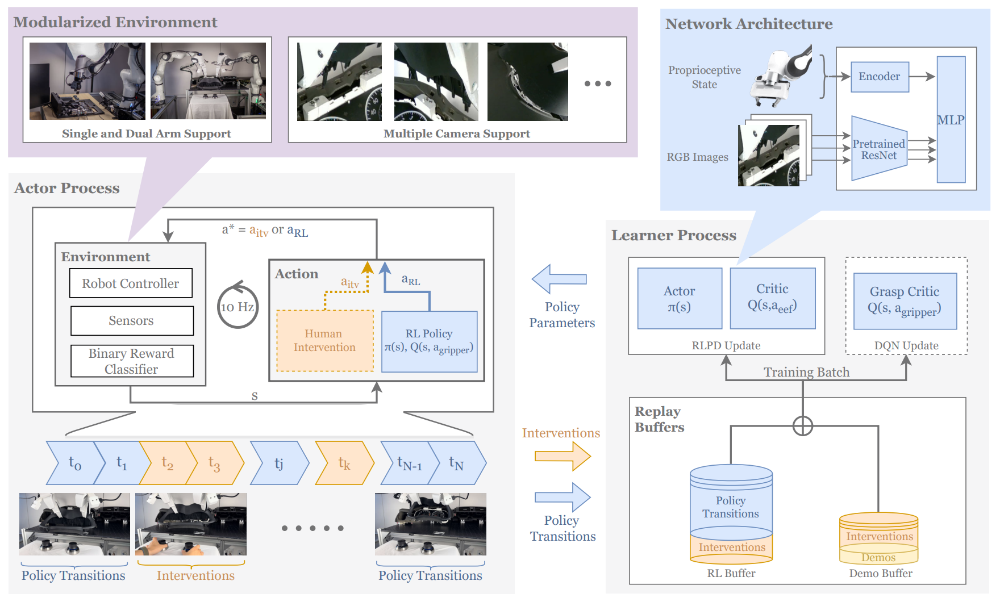
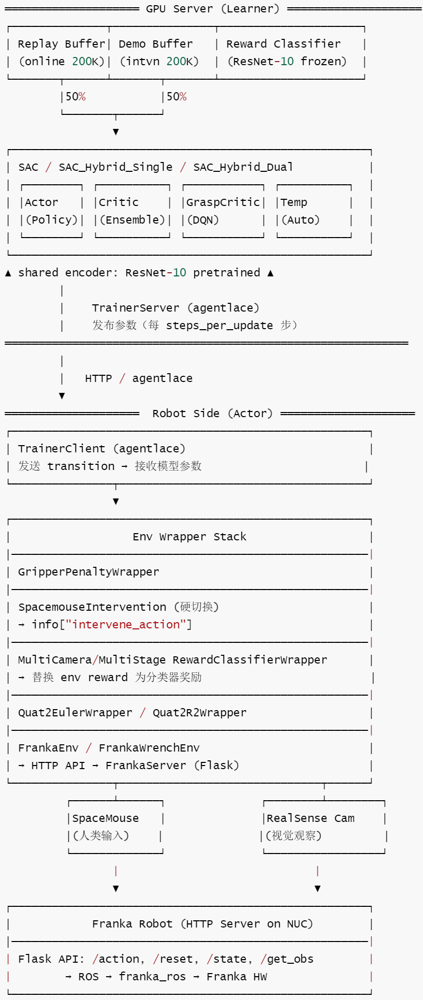
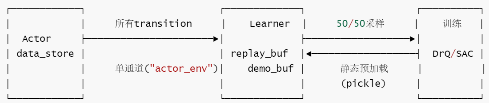
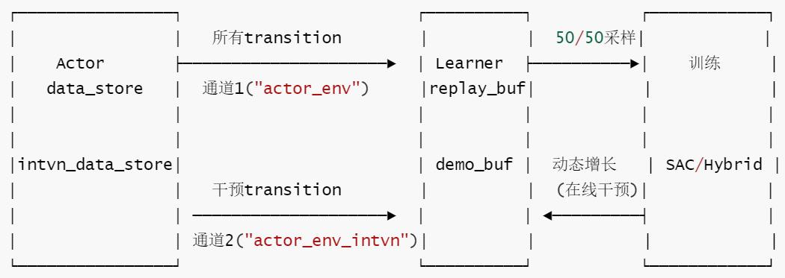
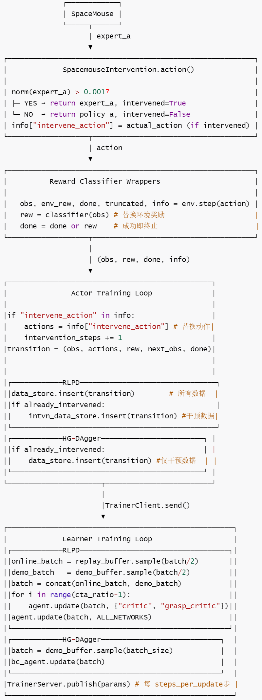
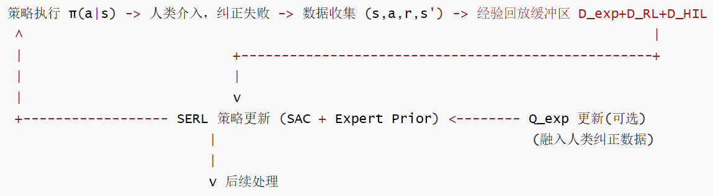
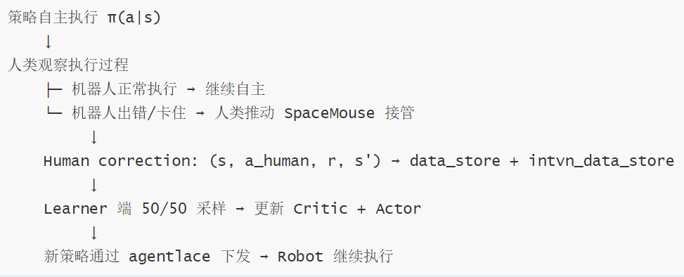

# 【机器人 / 强化学习】HIL-SERL：人类在环驱动的具身智能进化框架

目录

* [【机器人 / 强化学习】HIL-SERL：人类在环驱动的具身智能进化框架](#机器人--强化学习hil-serl人类在环驱动的具身智能进化框架)
  + [0x00 概要](#0x00-概要)
  + [0x01 真机 RL 的"最后一公里"](#0x01-真机-rl-的最后一公里)
    - [1.1 为什么需要人类在环？](#11-为什么需要人类在环)
    - [1.2 HIL-SERL 的解决方案：四条腿的凳子](#12-hil-serl-的解决方案四条腿的凳子)
    - [1.3 论文的核心成果](#13-论文的核心成果)
  + [0x02 设计哲学：三句话讲清 HIL-SERL 怎么想](#0x02-设计哲学三句话讲清-hil-serl-怎么想)
    - [2.1 真实世界优先](#21-真实世界优先)
    - [2.2 人类干预是数据，不是异常](#22-人类干预是数据不是异常)
    - [2.3 工程实用主义](#23-工程实用主义)
    - [2.4 为什么这套哲学能落地？](#24-为什么这套哲学能落地)
  + [0x03 SERL vs HIL-SERL：演进了什么](#0x03-serl-vs-hil-serl演进了什么)
    - [3.1 设计差异](#31-设计差异)
    - [3.2 演化关系](#32-演化关系)
    - [3.3 核心差异：一条数据通道到两条](#33-核心差异一条数据通道到两条)
    - [3.4 系统维度对比](#34--系统维度对比)
    - [3.5 设计取舍](#35-设计取舍)
      * [支持的功能](#支持的功能)
      * [不支持的功能](#不支持的功能)
  + [0x04 系统架构：两个进程 + 三层 Wrapper](#0x04-系统架构两个进程--三层-wrapper)
    - [4.1 HIL-SERL 总体支柱](#41-hil-serl-总体支柱)
    - [4.2 Actor-Learner 架构](#42-actor-learner-架构)
    - [4.3 多层 Wrapper 链](#43-多层-wrapper-链)
    - [4.4 双通道数据流](#44-双通道数据流)
    - [4.5 训练范式数据流](#45-训练范式数据流)
  + [0x05 核心机制：每个组件解决什么问题](#0x05-核心机制每个组件解决什么问题)
    - [5.1 SAC 算法引擎](#51-sac-算法引擎)
    - [5.2 人类干预（SpaceMouse + 硬切换）](#52-人类干预spacemouse--硬切换)
    - [5.3 RLPD 混合采样（样本效率的发动机）](#53-rlpd-混合采样样本效率的发动机)
    - [5.4 奖励分类器（为什么用视觉分类器而非手工奖励？）](#54-奖励分类器为什么用视觉分类器而非手工奖励)
    - [5.6 专家 Q 函数（Q\_exp：冷启动引导）](#56-专家-q-函数q_exp冷启动引导)
    - [5.7 混合动作空间（SAC + DQN）](#57-混合动作空间sac--dqn)
    - [5.8 各组件"解决什么 / 遗留什么"总览表](#58-各组件解决什么--遗留什么总览表)
  + [0x06 训练生命周期](#0x06-训练生命周期)
    - [阶段一：离线准备](#阶段一离线准备)
    - [阶段二：在线训练启动](#阶段二在线训练启动)
    - [阶段三：干预与自主交替](#阶段三干预与自主交替)
    - [阶段四：切换逻辑](#阶段四切换逻辑)
  + [0x07 SERL vs HIL-SERL 系统级对比](#0x07-serl-vs-hil-serl-系统级对比)
    - [7.1 系统角度对比](#71-系统角度对比)
    - [7.2 业务角度对比](#72-业务角度对比)
    - [7.3 核心设计取舍总结](#73-核心设计取舍总结)
  + [0x08 从 HIL-SERL 到 LWD：范式如何继续演进](#0x08-从-hil-serl-到-lwd范式如何继续演进)
    - [8.1 HIL-SERL 的本质贡献](#81-hil-serl-的本质贡献)
    - [8.2 HIL-SERL 的五个局限性](#82-hil-serl-的五个局限性)
    - [8.3 如何升级到 LWD](#83-如何升级到-lwd)
  + [0xFF 参考](#0xff-参考)

## 0x00 概要

真实世界中的机器人学习，不应该让机器人孤军奋战。人类纠偏不是训练之外的异常——它是高价值训练数据的关键来源。HIL-SERL（Human-in-the-loop SERL）的核心主张是：**让机器人自己试，人类只在关键时刻扶一把；而这一下"扶正"，会被系统转化为策略改进信号。**

论文如下：[Precise and Dexterous Robotic Manipulation via Human-in-the-Loop Reinforcement Learning](http://arxiv.org/pdf/2410.21845v3.pdf)

## 0x01 真机 RL 的"最后一公里"

### 1.1 为什么需要人类在环？

强化学习的理想非常诱人：机器人在环境中试错、得到奖励、再更新策略，逐渐变强。但真实机器人不是仿真器。每一次碰撞都可能损伤硬件，每一次失败都可能需要人工重置，而任务本身的难度又层层叠加：

* **动态操作**：在锅里翻转物体
* **精密装配**：RAM、SSD、USB、汽车仪表盘、IKEA 板件装配
* **双臂协作**：物体交接、双臂装配
* **高速接触任务**：Jenga whipping
* **长程多阶段任务**：IKEA shelf 组合装配

这些任务覆盖了动态、精密、柔性物体、多阶段、双臂协调等不同难点。其问题不只是"动作要准"，而是同时要求视觉、力觉、时序、接触、恢复能力都在线工作。纯模仿学习（BC）容易在分布偏移时崩溃，纯自主 RL 又很难在稀疏奖励下探索到成功。

具体来说，HIL-SERL 要面对的是三座大山：

**1. 探索瓶颈**：精密任务中，成功区域非常窄。RAM 插入、USB 装配这类任务，机械臂的 6D 位姿、夹爪状态、接触力稍微偏一点就失败。如果让机器人靠随机探索寻找成功路径，就像在撒哈拉沙漠里找一枚特定的回形针。更麻烦的是，真机探索不是免费的——每一次错误接触都可能弯折插针、损坏部件。

**2. 信用分配**：长程任务中，失败往往不是最后一步突然发生的。IKEA shelf assembly 中，前面侧板装得略微歪一点，后面顶板就很难对齐。问题是：最终失败时，算法要判断到底哪一步该负责。稀疏奖励只在最后告诉你"成功/失败"，但真正需要修正的动作可能发生在几十秒甚至几分钟前。

**3. 分布偏移**：行为克隆假设机器人执行时仍然处在专家演示覆盖的状态分布里。现实中，机器人第一步偏 1mm，第二步偏 3mm，几步之后就进入了专家从未演示过的状态。模型不知道怎么恢复，只能继续沿着错误方向输出动作。这就是 compounding errors。

### 1.2 HIL-SERL 的解决方案：四条腿的凳子

HIL-SERL 的解决方案，是让人类在这些 OOD 错误状态中介入，直接提供"从错误状态恢复"的动作数据，将人类在线纠正融入 off-policy RL。这套方案由四个核心模块共同支撑：

1. **Pretrained visual backbone**：降低视觉学习难度，提高真实图像的泛化能力
2. **RLPD-based off-policy RL**：利用 prior data（演示+纠偏）和 online replay（自主探索）的 50/50 混合采样，提高样本效率
3. **Human corrections**：在策略出错时提供高价值纠偏轨迹
4. **Binary reward classifier + low-level controller**：用视觉分类器提供稀疏奖励，用阻抗控制器保证物理安全

这四个模块缺一不可。没有 pretrained backbone，模型要在真实图像上从零学起，数据效率太低；没有 RLPD，离线演示数据和在线干预数据无法被高效吸收；没有 human corrections，探索瓶颈和分布偏移问题无法突破；没有 reward classifier 和底层控制器的配合，奖励设计无法自动化、硬件安全无法保证。

### 1.3 论文的核心成果

HIL-SERL 在实验上给出了非常强的结果：在动态操作、精密装配、双臂协调等多类 dexterous manipulation 任务上取得 near-perfect success rates，训练时间通常在 **1 到 2.5 小时**，相比 imitation learning baseline 平均成功率约 **2x improvement**，执行速度约 **1.8x faster**。

其中多个任务是**首次**在真实机器人上实现的：双臂协调 + 图像输入 + 真实世界 RL，以及 Jenga whipping、正时皮带装配等高速接触任务。

## 0x02 设计哲学：三句话讲清 HIL-SERL 怎么想

在进入架构和代码之前，我们先讲清楚 HIL-SERL 的设计者是怎么思考问题的。

### 2.1 真实世界优先

HIL-SERL 砍掉了 SERL 中的仿真环境（franka\_sim）、SmallEncoder、MobileNet 等面向快速迭代的组件。默认编码器改为 `resnet-pretrained`（冻结 ResNet-10 + SpatialLearnedEmbeddings），牺牲计算效率换取真实场景的视觉泛化能力。所有设计决策围绕"在真实 Franka 机器人上跑通"这一目标。

### 2.2 人类干预是数据，不是异常

人类干预不是"策略失败的补救"，而是"高质量训练信号的来源"。干预数据被独立存储（`intvn_data_store`），与在线数据享有同等训练地位。HG-DAgger 范式下，干预数据甚至是唯一的训练信号。在这种视角下，每一次人类接手都是在给 RL 算法注入最稀缺的信息——在策略最薄弱的状态下，什么动作是有效的。

### 2.3 工程实用主义

统一配置系统替代 SERL 的 per-task 脚本硬编码；混合动作空间（SAC + DQN）解决夹爪离散控制的实际问题；纯稀疏奖励 + 分类器替代手工奖励工程；不做置信度预测、不做平滑控制权切换——够用就好。这种"够用就好"的态度贯穿了整个实现，避免了研究性组件对工程稳定性的干扰。

### 2.4 为什么这套哲学能落地？

这三个设计哲学能行得通，依赖于三个工程前提：

* **增量控制 + 低频策略（10Hz）**：硬切换人类干预不会导致控制信号的跳变或震荡
* **人类干预提供正例**：纠偏数据直接弥补了稀疏奖励的信息不足
* **50/50 采样 + 大容量 buffer**：冗余的自主探索数据被自然稀释，不会淹没高价值的干预信号

## 0x03 SERL vs HIL-SERL：演进了什么

HIL-SERL 建立在 SERL 的工程和算法基础之上，但两者有明确的差异。

### 3.1 设计差异

HIL-SERL 的关键增强是：在 SERL 的 RLPD / Actor-Learner / 视觉奖励 / 控制系统之上，引入 **human corrections**。论文中也明确区分了二者：SERL 主要使用 human demonstrations，而 HIL-SERL 同时使用 human demonstrations 和 corrections。这个差异看似很小，但对于困难任务非常关键，因为 correction 数据恰好出现在策略最薄弱的位置。

我们可以这样理解：

```
SERL：先给机器人一批示范，然后让它强化学习微调。
HIL-SERL：机器人一边学，一边允许人类在错误状态中把它拉回来。
```

这使得 HIL-SERL 不只是“更会模仿”，而是更会从错误中恢复。

### 3.2 演化关系

两者的演化关系如下：

```
SERL (ICRA 2024, Luo et al.)
    · 仅离线 Demo (20条) + 在线自主探索
    · 简单短 horizon 任务 (PCB，线缆，搬运)
    · 单臂，25~50 min 训练
    · 100% 成功率 (简单任务)
            |
            | 问题：复杂任务(双臂/动态/长horizon)学不动
            | 原因：纯探索在高维空间样本复杂度爆炸，策略陷入局部最优无法脱困
            |            
            v
HIL-SERL (arXiv 2024, Luo et al.)
    核心改进：
       + 人类在线纠正 (最关键)
         · 策略卡住时人类接管 -> 注入高质量 off-policy 数据
         · 纠正数据同时进 Demo Buffer + RL Buffer
         · 干预频率随策略提升逐渐降为零
       + DQN 夹爪 Critic
         · 分离连续/离散动作空间 -> 简化多阶段任务学习
       + 双臂支持 (12D twist)
         · 统一框架处理单臂/双臂协调
       + 动态任务支持 (前馈力矩控制)
         · 不仅是精密操作，也能学 open-loop 动态行为
       = 同样保留：RLPD + 预训练视觉 + 阻抗控制 + 相对坐标
```

### 3.3 核心差异：一条数据通道到两条

SERL 把所有数据（包括干预数据）通过同一个 `data_store` 传输，Learner 端无法区分数据来源。干预数据混入 replay buffer，与在线自主数据同等对待。

而 HIL-SERL 使用两个独立通道——`data_store` 传输在线数据，`intvn_data_store` 单独传输干预数据——使 Learner 能将干预数据作为高质量的 demo 独立管理，实现 50/50 的混合采样。

| 维度 | SERL | HIL-SERL |
| --- | --- | --- |
| 数据通道 | 1 个（actor\_env） | 2 个（actor\_env + actor\_env\_intvn） |
| 干预数据 | 混入同一 buffer，无区分 | 独立存储，独立管理 |
| Demo 来源 | 仅离线 pickle 预加载 | 离线 pickle + 在线干预动态注入 |
| 干预统计 | 无 | intervention\_count/steps |
| Buffer 持久化 | 无 | 定期 dump pickle |

### 3.4 系统维度对比

SERL 和 HIL-SERL 的系统维度对比如下：

| 维度 | SERL | HIL-SERL |
| --- | --- | --- |
| 定位 | 研究框架（多算法、多编码器、仿真支持） | 工程系统（专注真实机器人部署） |
| Agent 类型 | 4 种（SAC/DrQ/VICE/BC） | 3 种（SAC/SAC\_Hybrid/BC） |
| 编码器 | 3 种（Small/ResNet/MobileNet） | 1 种（ResNet-pretrained only） |
| 动作空间 | 纯连续 | 连续 + 离散混合 |
| 配置系统 | per-task 脚本 + FLAGS 硬编码 | 统一 DefaultTrainingConfig |
| 奖励学习 | VICE Agent（内嵌分类器） | Wrapper 外挂分类器 |
| 双臂支持 | 不支持 | 支持（SAC\_Hybrid\_Dual） |
| 仿真支持 | 支持（franka\_sim） | 不支持 |

### 3.5 设计取舍

SERL 和 HIL-SERL 的设计取舍如下：

```
SERL 的取舍：灵活性 > 易用性
    └ 保留：多算法、多种编码器、仿真、分布式 Critic
    └ 代价：用户需要自己组装，per-task 脚本维护高

HIL-SERL 的取舍：实用性 > 灵活性
    └ 保留：人类干预闭环、混合动作空间、统一配置、多阶段奖励
    └ 代价：砍掉了研究性组件，编码器选择受限，无仿真
    └ 核心增强：
      - 干预双通道：独立管理干预数据和在线探索数据
      - 统一配置系统：通过配置类管理多种训练模式
      - 混合动作空间：SAC + DQN 分离连续/离散控制
      - 更强的实时性：SpaceMouse 改用子进程避免 GIL 阻塞
```

#### 支持的功能

| 功能 | 背后思路 |
| --- | --- |
| SpaceMouse 人类干预 | 真实部署中策略必然犯错，人类纠正是最直接的高质量信号 |
| 独立干预 Buffer | 干预数据与在线数据分离，RLPD 中 50/50 采样保证干预信号不被稀释 |
| HG-DAgger 训练 | 有些任务 RL 探索代价太高，纯模仿学习更高效 |
| RLPD 混合训练 | 结合 RL 自探索和人类演示的优势 |
| 双臂操作 | 物体交接等任务需要双臂协调 |
| 混合动作空间（SAC+DQN） | 夹爪是离散的（开 / 关 / 保持），用 DQN 比 SAC 的连续输出更合理 |
| 夹爪惩罚 | 避免策略频繁切换夹爪，减少机械磨损和无效动作 |
| 多阶段奖励分类器 | 复杂任务（如先抓取再插入）需要分阶段判定成功 |
| 多相机奖励分类器 | 单相机视角有限，多相机融合提高判定准确性 |
| 奖励偏置（reward\_bias） | 稀疏奖励下适当偏置帮助早期学习 |
| 预训练 ResNet 编码器 | 真实图像复杂度高，从头训练编码器数据效率太低 |
| Buffer 持久化 | 训练中断可恢复，长期积累演示数据 |
| 干预统计追踪 | 监控人类工作量，评估策略改进效果 |

#### 不支持的功能

| 不支持 | 背后思路 |
| --- | --- |
| 仿真环境 | 真实世界部署不需要 sim2real，砍掉减少维护负担 |
| DrQ Agent | 数据增强功能已内化到 SAC 的 augmentation\_function 回调，无需独立 Agent |
| VICE Agent | 奖励分类器已通过 Wrapper 实现，不需要在 Agent 内部耦合 |
| SmallEncoder / MobileNet | 真实场景视觉复杂度高，轻量编码器不够用 |
| DistributionalCritic / ContrastiveCritic | 研究性组件，工程系统不需要 |
| 平滑控制权切换 | 硬切换实现简单，实际效果足够，避免引入额外超参 |
| 置信度预测 / 转折点识别 | 工程复杂度高，收益不确定，当前阈值方案够用 |
| RLDS 数据集支持 | 面向研究的数据格式，工程系统用 pickle 足够 |
| 状态输入（create\_states） | 真实部署依赖视觉，纯状态输入无实际用途 |

## 0x04 系统架构：两个进程 + 三层 Wrapper



### 4.1 HIL-SERL 总体支柱

采样效率的"核动力"：UTD

* 观点："高 UTD（Update-to-Data）的暴力计算"是采样效率的第一功臣。
* 实现：通过 cta\_ratio（如 20:1），每一步物理交互对应 20 次 Critic 更新。这让网络在极短的时间内"吃透"少量物理数据。
* 稳定性：引入 LayerNorm 防止高频更新导致的 Q 值爆炸。

机器人的"手感"：SAC vs DQN

* SAC（连续控制）：负责机械臂的 6D 空间平滑移动。由于输出是正态分布，它具备极细微的调优能力。
* DQN（离散控制）：负责夹爪的开关。"非黑即白"的离散 Q 值比连续分布更适合处理二进制动作，避免了夹爪在开关之间的犹豫。

人在回路（HIL）：指路与纠错

* 解决"怎么去"，把机器人从迷茫中拉回正轨。

HG-DAgger 的"门控"逻辑

* 事先预防：不同于原版 DAgger 的事后补救，HG-DAgger 通过 Human Gating 在错误发生前瞬间拦截。
* 代码证据：info.pop("intervene\_action")。系统只在人类干预时记录数据，实现了"只学错题"的高效策略。

### 4.2 Actor-Learner 架构

HIL-SERL 由两个主要组件组成：Robot Side（Actor Process）和 GPU Server（Learner Process），中间通过 agentlace 通信。

Actor Process 的主要功能是：

* 在机器人上执行当前策略与环境进行交互，并将数据发送回重放缓冲区replay buffer。
* 人类通过使用 “遥操作工具 SpaceMouse” 干预操作机器人，从而将从RL策略中接管对机器人的控制。

Learner Process 的功能是：

* 从demo buffer 和replay buffer中等量采样数据，使用RLPD优化策略进行训练，并定期将更新的策略发送给Actor Process。



**交互关系**：Actor 向 Learner 发送 transition 数据，Learner 向 Actor 发布更新后的策略参数。各组件间的通信有三条路径：

* **Actor → Learner**：通过 ZMQ 上传 transition 数据（data\_store 和 intvn\_data\_store 两个通道）
* **Learner → Actor**：通过 ZMQ 下发策略参数（BroadcastServer → BCClient）
* **Actor → Robot Server**：通过 HTTP POST 发送动作指令、获取观测状态

### 4.3 多层 Wrapper 链

我们来看 Actor 端的环境层是如何组织的。每个 wrapper 都有其不可替代的职责，从内到外依次是：

**底层 — FrankaEnv**：通过 Flask HTTP API 与真实机器人通信，发送动作指令、获取观测和状态信息。这是对机器人硬件的直接封装。

**第二层 — 坐标转换（Quat2EulerWrapper / RelativeFrame）**：将四元数姿态表达转换为欧拉角或 6D 旋转矩阵，将绝对坐标系转换为 end-effector 相对坐标系。这部分继承自 SERL，但 HIL-SERL 做了简化——只保留 ResNet 编码器和相对坐标的固定组合。

**第三层 — 奖励分类器（RewardClassifierWrapper）**：将环境的原始奖励替换为分类器给出的二元奖励（成功=1，失败=0）。这种替换使得奖励设计完全自动化——不需要手工设计密集奖励函数，只需采集成功/失败图像训练一个 ResNet-10 分类器。

**第四层 — 人类干预（SpacemouseIntervention）**：利用 SpaceMouse 6DoF 输入设备实现人类随时接管。当人类推动 SpaceMouse 的力超过阈值时，策略动作被替换为人类动作。切换是硬切换（没有平滑过渡），但实际效果足够。

**最外层 — GripperPenaltyWrapper**：对频繁切换夹爪的行为施加罚分，减少机械磨损和无效动作。

### 4.4 双通道数据流

这是 HIL-SERL 与 SERL 最根本的设计差异。

SERL 干预数据流：在 SERL 中，所有数据（包括干预数据）都通过同一个 `data_store` 传输，Learner 端无法区分数据来源。干预数据被当作高质量的 transition 混入 replay buffer。



HIL-SERL 使用两个独立的数据通道：

* 普通的 `data_store` 传输在线探索数据
* 独立的 `intvn_data_store` 传输人类干预数据

这种双通道设计让 Learner 能够区分数据来源，将干预数据作为高质量的 demo 独立管理。



**为什么需要双通道？** 如果干预数据混入在线数据的单一通道，Learner 无法区分数据来源。SERL 的做法是把所有数据混在一起，用静态 pickle 预加载 demo。而 HIL-SERL 需要动态管理干预数据——干预数据不仅需要优先训练，还需要随训练进程持续注入和更新。

SERL 和 HIL-SERL两者对比如下：

| 维度 | SERL | HIL-SERL |
| --- | --- | --- |
| 数据通道 | 1 个（actor\_env） | 2 个（actor\_env + actor\_env\_intvn） |
| 干预数据 | 混入同一 buffer，无区分 | 独立 intvn\_data\_store，Learner 端独立 demo\_buffer |
| Demo 来源 | 仅离线 pickle 预加载 | 离线 pickle + 在线干预数据动态注入 |
| 干预统计 | ❌无 | ✅ intervention\_count/steps |
| Buffer 持久化 | ❌无 | ✅ 定期 dump pickle |
| QueuedDataStore 容量 | 2000 | 50000 |

### 4.5 训练范式数据流

**两种训练范式的数据流差异如下**：

* **RLPD**（默认）：`data_store` 插入所有数据（包括自主交互和干预），`intvn_data_store` 额外插入干预数据。Learner 端从 `replay_buf`（在线 50%）和 `demo_buf`（干预数据 50%）混合采样。
* **HG-DAgger**：`intvn_data_store` 是**唯一**的数据来源，`data_store` 完全不使用。Learner 只在 `demo_buf` 中采样，做纯行为克隆。

综合两个范式之后，数据流图如下：



## 0x05 核心机制：每个组件解决什么问题

### 5.1 SAC 算法引擎

SAC 是SERL 算法底座，是整个系统的"引擎"。SAC（Soft Actor-Critic）之所以在机器人领域（如 SERL 论文中）如此强大，是因为它解决了强化学习中最头疼的问题之一：如何在探索（寻找新方案）和利用（优化已知方案）之间取得完美平衡。

```
——————————————————————————————————————————————————————————
基础来源：Soft Actor-Critic (SAC)
SAC 目标函数：J(π) = E[ Σ ( r(s_t,a_t) + α·H(π(·|s_t)) ) ]
其中 H(π) = -log π(a|s) 为策略熵，鼓励探索
   | 
   | SERL 在此基础增加
   |    
   v
SERL 改进目标函数：J_SERL(π) = J_SAC(π) + λ · E[ Q_exp(s, a) ]
即在 SAC 基础上，增加专家Q函数 Q_exp 作为额外奖励/正则项
——————————————————————————————————————————————————————————
```

### 5.2 人类干预（SpaceMouse + 硬切换）

人类干预相关的工作流程如下：

* 机器人执行当前策略 π(a|s)
* 人类观察执行过程，判断是否需要介入
* 若需要 -> 人类通过遥操作接管，提供纠正动作 a\_human
* 纠正数据 (s, a\_human, r, s') 存入回放缓冲区 D\_HIL
* 人类可随时退出，机器人继续自主执行

人类干预的执行逻辑出奇简单：

```
# SpacemouseIntervention.action()
norm(expert_a) > 0.001?
  ├─ YES → return expert_a, intervened=True
  └─ NO  → return policy_a, intervened=False
info["intervene_action"] = actual_action (if intervened)
```

当人类推动 SpaceMouse 超过阈值（0.001），策略动作被直接替换为人类动作。干预后的 transition 通过 `intvn_data_store` 独立传输到 Learner 端。

关键细节：`RelativeFrame` 会将被干预的动作从 base-frame 转换回 end-effector frame，确保 replay buffer 中的所有动作（无论是策略产出还是人工产出）都在同一坐标系下。

另外，SERL 和 HIL-SERL 两个系统在 SpaceMouse 的实现方式上有所不同：

| 维度 | SERL | HIL-SERL |
| --- | --- | --- |
| 实现方式 | threading.Thread (daemon) | multiprocessing.Process (daemon) |
| 共享状态 | self.latest\_data（实例属性） | Manager ().dict ()（跨进程共享内存） |
| 读取方式 | self.latest\_data 直接读 | self.latest\_data ["action"] 读共享字典 |

HIL-SERL 改用子进程是因为 SpaceMouse 驱动的 pyspacemouse.read\_all() 是阻塞调用，放在线程中可能因 GIL影响主循环的步进节奏。子进程完全独立，不受 GIL 约束。

### 5.3 RLPD 混合采样（样本效率的发动机）

RLPD（Replay-Lagging Policy Distribution）是样本效率的核心。它有两个关键设计：

**50/50 混合采样**：每步训练从 `replay_buf`（在线数据）和 `demo_buf`（干预数据 + 离线演示）各取一半。这种混合保证了：

* 在线数据提供最新的状态覆盖，让 Critic 学习到当前策略分布下的价值
* 干预数据提供高价值 recovery 轨迹，防止 Critic 忘记专家先验

**High UTD（Update-To-Data ratio）**：每采集一步数据，Learner 执行多次策略更新（典型 UTD=2）。这种异步更新倍数放大了样本效率，使得 1–2.5 小时的训练就能收敛。

混合经验回放缓冲区如下：

```
——————————————————————————————————————————————————————————————
基础来源：Experience Replay (DQN) + Offline-Online RL 混合训练
缓冲区组成：
D = D_exp ∪ D_RL ∪ D_HIL
    ├─ D_exp : 离线专家演示数据
    ├─ D_RL  : 在线RL自主探索收集的数据
    └─ D_HIL : 人类纠正数据
——————————————————————————————————————————————————————————————
```

### 5.4 奖励分类器（为什么用视觉分类器而非手工奖励？）

手工设计稠密奖励函数需要针对每个任务精细调整——对于 USB 插入和 RAM 装配，奖励函数的物理含义完全不同。

HIL-SERL 的做法是：

1. 采集 **200 张成功** + **1000 张失败** 的前摄像头图像（约 5 分钟）
2. 训练一个 ResNet-10 二分类器（冻结 backbone，只训练分类头）
3. 在 `step()` 中用分类器输出替换环境奖励：`reward = classifier(obs)`

**为什么只靠二元成功信号也能学？** 因为 RLPD 的高 UTD 和 50/50 采样让模型可以从稀疏信号中高效学习——Critic 借助 Bellman 方程将端点的成功信号"倒流"回历史动作。

**多阶段任务怎么办？** 对于先抓取再插入这类多阶段任务，HIL-SERL 支持多个分类器串联，每个阶段有自己的成功判定条件。

### 5.6 专家 Q 函数（Q\_exp：冷启动引导）

在训练启动阶段，Critic 是随机初始化的，没有任何价值判断能力。

HIL-SERL 的解法是：在 20-30 条离线演示数据上预训练一个专家 Q 函数 Q\_exp(s, a)，作为策略探索的初始化引导。

Q\_exp 通过在离线演示数据上执行标准 Bellman Backup 训练：

\[Q\_{\text{exp}}(s, a) \leftarrow r + \gamma \cdot \mathbb{E}\_{a' \sim \pi\_{\text{exp}}}[Q\_{\text{exp}}(s', a')]
\]

训练好的 Q\_exp 被用来初始化 Critic，让在线训练不是从零开始，而是从一个"已经知道动作好坏"的起点出发。这解决了稀疏奖励下冷启动探索的盲目性。

### 5.7 混合动作空间（SAC + DQN）

这是一个不动声色的工程改进，但影响很大。夹爪控制本质上是离散的——开、关、保持三种状态。如果用 SAC 的连续输出去拟合这个离散空间，不仅容易产生中间态（夹爪半开半合浪费动作），还增加了策略网络的学习负担。

HIL-SERL 的做法是：连续动作空间（6D 位姿控制）用 SAC，离散动作空间（夹爪）用 DQN（GraspCritic）。两者共享同一个视觉编码器，但输出层分离。

夹爪的 DQN 还带有一个 **grasp\_penalty**（默认 -0.1），对频繁切换夹爪的动作施加惩罚，减少机械磨损。

### 5.8 各组件"解决什么 / 遗留什么"总览表

| 组件/算法 | 解决的核心问题 | 基础/来源 | 未解决 & 改进方向 |
| --- | --- | --- | --- |
| SAC | 探索效率低、训练不稳定 | 最大熵 RL + Off-policy | 高精度任务仍需大量样本 → 引入更好的先验(即Q\_exp) |
| Q\_exp (专家Q函数) | 稀疏奖励冷启动、探索方向盲目 纯模仿学习无法自我改进 | Offline RL (BCQ/BEAR/CQL) + Bellman Backup | 泛化性差、OOD动作评估不准 → Ensemble不确定性估计 → 结合模型预测补充 |
| HIL (人类介入纠正) | 分布偏移后无法自行恢复 离线数据无法覆盖失败状态 完整专家演示成本太高 | DAgger + 遥操作 + Interactive Learning | 介入频率高、纠正质量不一致 → 主动请求介入(Active Learning) → 纠正数据质量过滤/加权 → 渐进式减少介入(Fade-out) |
| 混合回放缓冲区 | 纯在线样本效率低 纯离线无法超越专家 离线-在线切换时分布偏移 | Experience Replay (DQN) + Offline-Online混合训练 | 数据比例平衡问题 → 优先级采样 + 数据衰减机制 → 统一价值度量不同数据源 |
| 奖励函数 | RL缺乏学习信号 | 手工Reward Shaping | 每任务需重新设计、难以泛化 → 视觉语言奖励/偏好学习 → 与DPO/RLHF思路结合 |

## 0x06 训练生命周期

训练流程大体如下：

1. 选择任务相关相机，并裁剪/缩放图像到模型输入尺寸
2. 采集成功/失败图像，训练 binary reward classifier
3. 采集 20–30 条 human demonstrations，初始化 demo buffer
4. 启动在线 RL 训练
5. 策略自主执行，人类在必要时用 SpaceMouse 纠偏
6. 干预数据进入 buffer，与自主数据一起用于 off-policy RL 更新
7. 随着策略成功率提升、cycle time 下降，人类干预频率逐步减少

我们可以把整个训练过程划分为四个阶段：

### 阶段一：离线准备

```
人类遥操作 → 收集 200 正/1000 负图像 → 训练 Reward Classifier（~5分钟）
人类遥操作 → 收集 20~30 条成功演示 → 初始化 Demo Buffer
                                    ↓
在离线演示数据上预训练 Q_exp → 用于初始化 Critic
```

这个阶段的核心是让系统在开始在线 RL 之前，就已经有了两个先验知识：什么算"成功"（分类器），以及"成功"的动作大致长什么样（Q\_exp）。

### 阶段二：在线训练启动

Learner 进程启动后，初始化 Replay Buffer（在线 200K）和 Demo Buffer（干预 200K）。Actor 进程启动后，加载初始策略开始自主交互。



### 阶段三：干预与自主交替

这是 HIL-SERL 的核心循环：



关键设计：**干预频率随策略提升自然下降**。初始阶段策略经常犯错，人类需要频繁干预；随着策略在干预数据上不断学习，自主成功率上升，干预频率逐步趋近于零。

### 阶段四：切换逻辑

```
if done or truncated:
    if reward:   # 任务成功
        成功 → reset → 继续当前任务
    else:        # 任务失败
        失败 → reset → 重试同一任务
```

失败时不切换任务，reset 后重试。成功的 episode 结束后 reset 进入下一轮。这种简单逻辑避免了复杂的任务调度。

## 0x07 SERL vs HIL-SERL 系统级对比

HIL-SERL与SERL不同之处：HIL-SERL在训练 RL 策略时融合了人类演示与修正，而SERL仅依赖于人类演示。

SERL 和 HIL-SERL 在系统编排层面几乎一样 — 都是手工启动、无中控、无容错的研究原型。差异不在 "系统管理"，而在数据流设计：

* SERL 把干预数据当普通经验混入单通道；HIL-SERL 把干预数据当高质量 demo 独立传输双通道。
* SERL 的特色是仿真支持 + tmux 一键启动 + FWBW 双策略；HIL-SERL 的特色是干预双通道 + 统一配置 + 混合动作空间。

这种设计差异反映了两个系统不同的定位：SERL 更偏向学术研究，验证样本高效 RL 的可行性；HIL-SERL 更偏向工程实践，强调人类干预的效率和数据质量的管理。而 LWD 则在这两者基础上，进一步向通用化、规模化方向发展，将真机 RL 的思想扩展到 VLA 架构和车队级部署场景。这个演进路线清晰地展示了从研究原型到工业级应用的技术路径。

### 7.1 系统角度对比

| 维度 | SERL | HIL-SERL |
| --- | --- | --- |
| 定位 | 研究框架（多算法、多编码器、仿真支持） | 工程系统（专注真实机器人部署） |
| Agent 类型 | 4 种（SAC/DrQ/VICE/BC） | 3 种（SAC/SAC\_Hybrid/BC） |
| 编码器 | 3 种（Small/ResNet/MobileNet） | 1 种（ResNet-pretrained only） |
| 动作空间 | 纯连续 | 连续 + 离散混合 |
| 数据增强 | DrQ Agent 独立实现 | SAC 内置 augmentation\_function 回调 |
| 奖励学习 | VICE Agent（内嵌分类器） | Wrapper 外挂分类器 |
| Critic 类型 | 标准 + Distributional + Contrastive | 标准 Ensemble（2 个） |

### 7.2 业务角度对比

| 维度 | SERL | HIL-SERL |
| --- | --- | --- |
| 人类干预 | 基础支持（单 buffer） | 深度支持（双 buffer + 统计 + HG-DAgger） |
| 干预数据地位 | 与在线数据混合 | 独立 demo buffer，50/50 采样权重 |
| 训练范式 | 仅 RLPD | RLPD + HG-DAgger 双范式 |
| 双臂任务 | 不支持 | 支持（SAC\_Hybrid\_Dual） |
| 夹爪控制 | 连续输出 | 离散 DQN（开 / 关 / 保持） |
| 奖励设计 | 环境奖励 / VICE | 分类器 Wrapper + 多阶段 + reward\_bias |
| 任务类型 | 单臂 + 拾取 | 单臂 + 双臂 + 交接 + 翻转 |
| 部署就绪度 | 需要组装 | 开箱即用（统一配置） |
| 迭代效率 | 高（仿真 + SmallEncoder 快速验证） | 低（必须真实机器人） |
| 数据效率 | 中 | 高（预训练编码器 + 50/50 采样 + 干预数据） |

### 7.3 核心设计取舍总结

```
SERL 的取舍：灵活性 > 易用性
    └ 保留：多算法、多种编码器、仿真、分布式 Critic
    └ 代价：用户需要自己组装，per-task 脚本维护成本高

HIL-SERL 的取舍：实用性 > 灵活性
    └ 保留：人类干预闭环、混合动作空间、统一配置、多阶段奖励
    └ 代价：砍掉了研究性组件，编码器选择受限，无仿真支持
    └ HIL-SERL 在 SERL 基础上增强的特色包括：
      └ 干预双通道：独立管理干预数据和在线探索数据
      └ 统一配置系统：通过配置类管理多种训练模式
      └ 混合动作空间：支持更复杂的动作组合
      └ 更强的实时性能：通过子进程实现 SpaceMouse 输入
```

一句话总结：SERL 是一个强化学习研究工具箱，HIL-SERL是一个人类干预机器人学习工程系统。前者追求算法广度，后者追求部署深度。

## 0x08 从 HIL-SERL 到 LWD：范式如何继续演进

### 8.1 HIL-SERL 的本质贡献

HIL-SERL 的核心贡献不只是"用 SpaceMouse 控制机器人"，而是**把人类纠偏变成了一个可以被 off-policy RL 消化的高质量数据源**。它解决了三个关键问题：

* 纯 RL 探索不到成功 → 人类纠偏提供高价值恢复轨迹
* 纯 BC 遇到错误状态不会自救 → 干预数据正好覆盖这些 OOD 状态
* 真机训练不稳定 → 预训练视觉 backbone + RLPD + 低层控制器 + 稀疏视觉奖励共同提高稳定性

如果说 SERL 证明了"真机 RL 可以在工程上跑起来"，那么 HIL-SERL 进一步证明了：当人类纠偏被系统性纳入训练数据流后，真实机器人可以在 1–2.5 小时内学会一系列过去难以直接用 RL 训练的精密、动态和双臂操作任务。

### 8.2 HIL-SERL 的五个局限性

HIL-SERL 很强，但它仍然不是最终的通用机器人学习系统：

**1. 人类导师仍然是规模化瓶颈。** 一个实验室内一台机器人配一个专家可行，但成千上万台机器人在工厂、家庭和商店部署时，不可能为每台配一个高水平导师。HIL-SERL 更像是"师徒制"的高效学习，而不是"车队级自动进化"。

**2. 任务孤岛效应。** HIL-SERL 本质上仍是单任务优化器。引入新任务通常需要重新采集演示、重新训练分类器、重新干预学习。它无法像 VLA 模型那样通过 language conditioning 直接实现技能迁移。

**3. 干预数据质量依赖人类。** 机器人策略动作与人类纠偏动作之间存在跳变，会导致 Q 函数在学习中出现数值震荡。人类导师水平不稳定时，系统在计算 Advantage 时会产生混乱。

**4. 数据分布的不连续性。** 当人类接手再放开时，控制信号从人类动作跳变回策略动作，这种不连续性对时序建模不利。

**5. 系统仍是研究原型。** HIL-SERL 对软硬件环境要求苛刻——FCI 高频接口、Real-time Linux 内核、SpaceMouse 驱动等多组件依赖使得部署维护成本高昂。

### 8.3 如何升级到 LWD

从 HIL-SERL 走向 LWD（Learning while Deploying）需要五个关键升级：

1. **从单任务到多任务**：引入 VLA 和 language conditioning，让一个模型处理多种任务
2. **从人工纠偏到规模化数据飞轮**：把干预、失败、恢复、自主成功统一纳入大规模 replay
3. **从高斯 SAC 到生成式动作模型**：用 Flow Matching / Diffusion 表达多峰、长程动作分布
4. **从普通策略更新到 QAM**：用 critic gradient + adjoint matching 稳定优化生成式动作头
5. **从单机实验到分布式底座**：让多机器人部署数据持续回流云端 learner

```
SERL (ICRA 2024)：证明真机 RL 可以高效可复现
    ↓ 纯探索在高维空间样本复杂度爆炸，复杂任务学不动
HIL-SERL (arXiv 2024)：证明人类纠偏能攻克精密/动态/双臂任务
    ↓ 人类导师成为规模化瓶颈，需要更通用的学习范式
LWD (arXiv 2025)：把部署经验扩展为车队级、通用 VLA 的持续后训练闭环
```

这个演进路线清晰地展示了从研究原型到工业级应用的技术路径。

注：我们没有SOP代码，因此略过。

## 0xFF 参考

[HIL-SERL——结合“人类离线演示、在线策略数据、人工在线干预”的RL方法：直接真实环境中RL开训，可组装电脑主板和插拔USB](https://blog.csdn.net/v_july_v/article/details/143388286)
