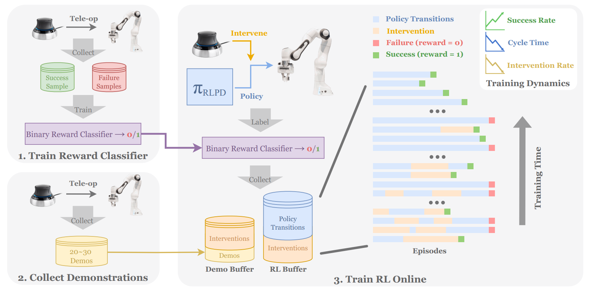
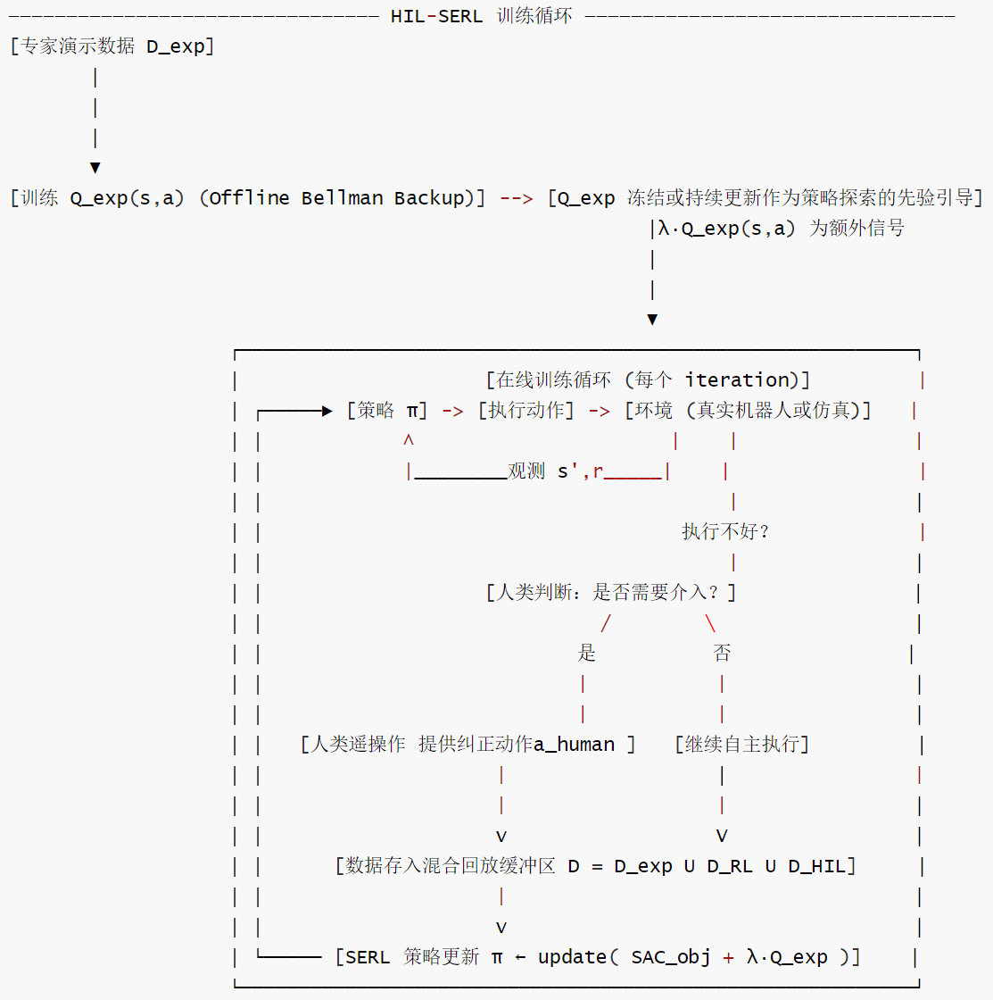
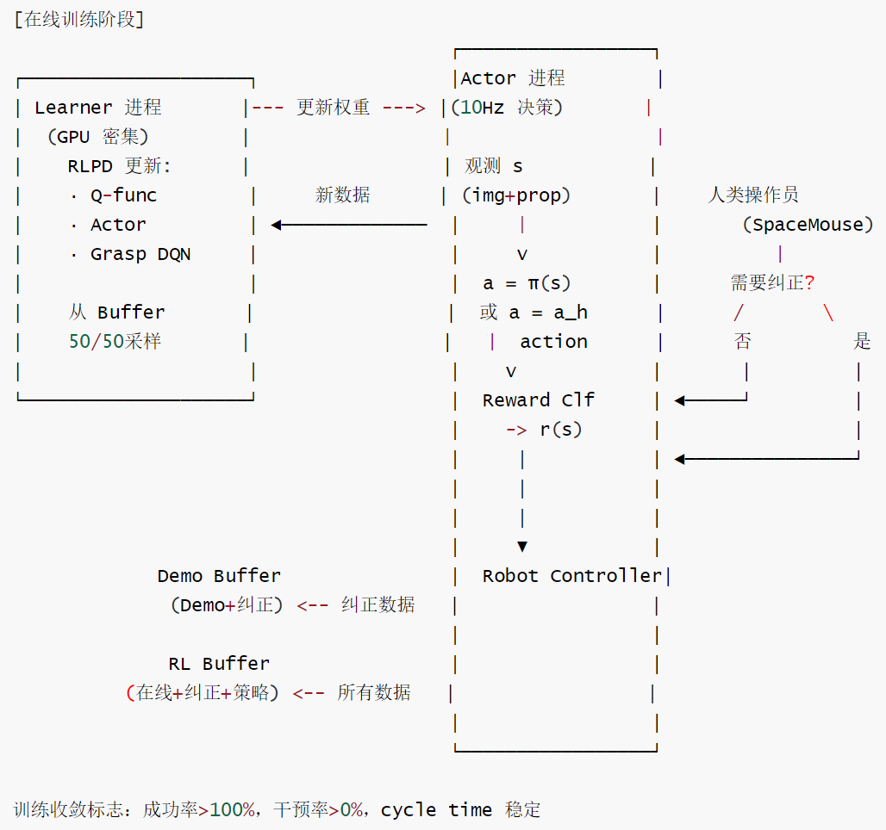
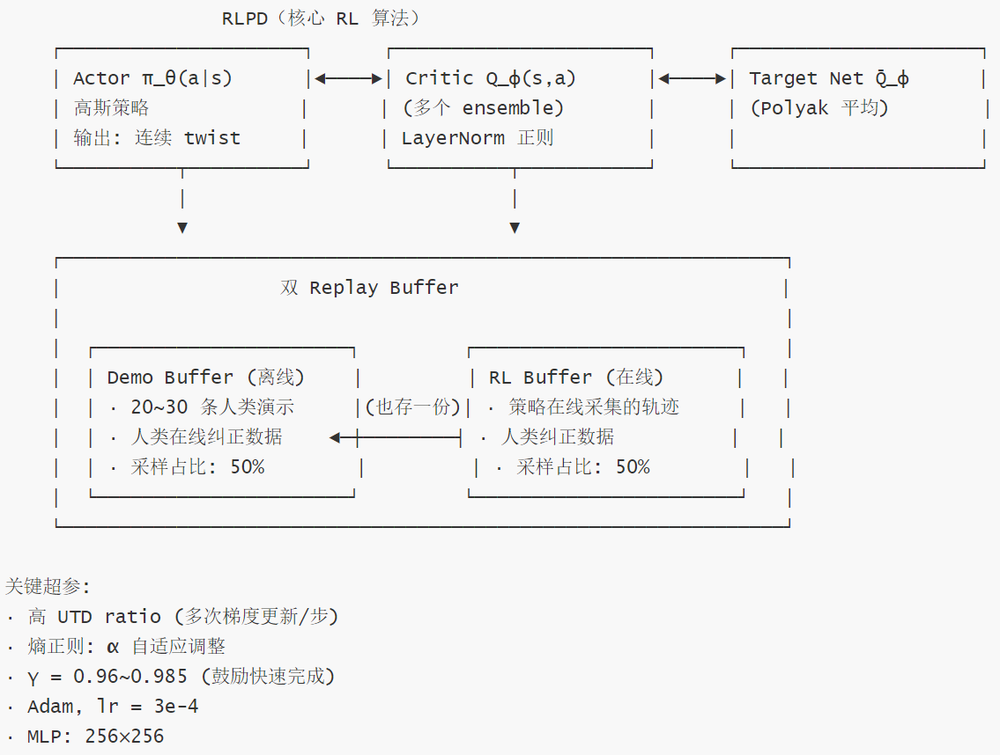
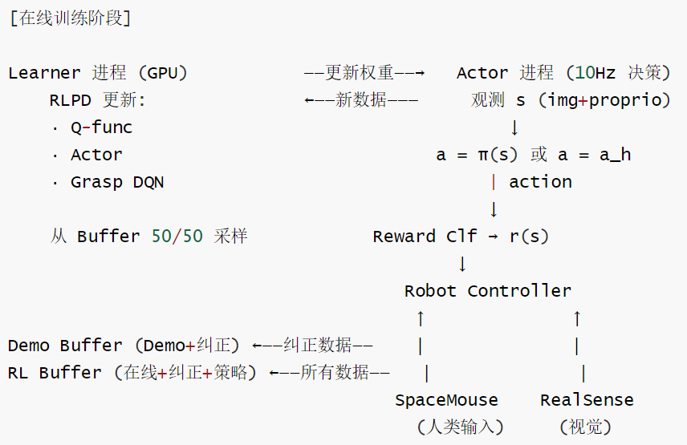
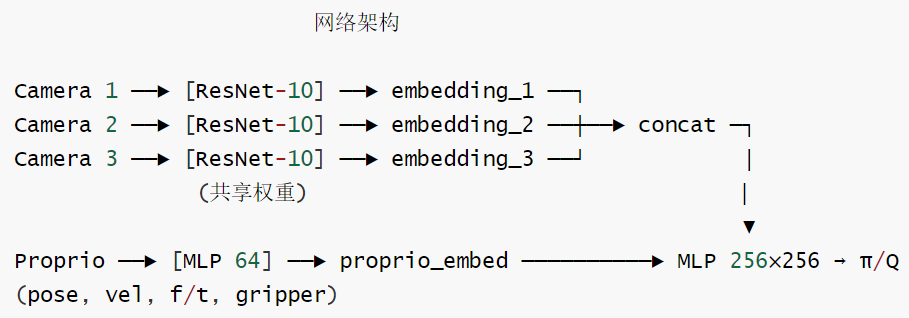
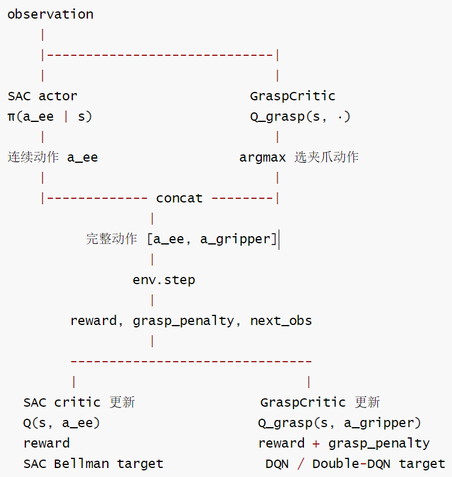
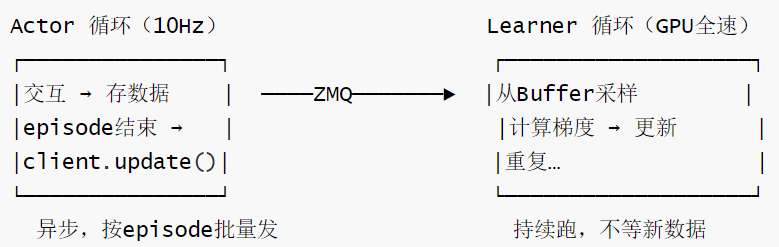

# 【机器人 / 强化学习】HIL-SERL 算法篇：DQN + SAC 混合架构的实现哲学

# 【机器人 / 强化学习】HIL-SERL 算法篇：DQN + SAC 混合架构的实现哲学

目录

* [【机器人 / 强化学习】HIL-SERL 算法篇：DQN + SAC 混合架构的实现哲学](#机器人--强化学习hil-serl-算法篇dqn--sac-混合架构的实现哲学)
  + [0x00 概要](#0x00-概要)
  + [0x01 HIL-SERL 的总体算法思路](#0x01-hil-serl-的总体算法思路)
    - [1.1 HIL-SERL 的算法基因图谱](#11-hil-serl-的算法基因图谱)
    - [1.2 三类预训练/先验机制](#12-三类预训练先验机制)
    - [1.3 HIL-SERL 的训练流程](#13-hil-serl-的训练流程)
    - [1.4 为什么 HIL-SERL 能超越模仿学习](#14-为什么-hil-serl-能超越模仿学习)
  + [0x02 核心算法：RLPD + 人类干预](#0x02-核心算法rlpd--人类干预)
    - [2.1 RLPD 的"干预版"](#21-rlpd-的干预版)
    - [2.2 BC Loss 的作用](#22-bc-loss-的作用)
    - [2.3 训练数据流的双通道设计](#23-训练数据流的双通道设计)
  + [0x03 混合动作空间：SAC + DQN](#0x03-混合动作空间sac--dqn)
    - [3.1 为什么要"分而治之"？](#31-为什么要分而治之)
    - [3.2 SAC + DQN 如何协同工作](#32-sac--dqn-如何协同工作)
    - [3.3 Rollout 时的配合](#33-rollout-时的配合)
    - [3.4 训练时的配合](#34-训练时的配合)
    - [3.5 输出维度对比](#35-输出维度对比)
    - [3.6 SAC vs DQN：靶向设计](#36-sac-vs-dqn靶向设计)
  + [0x04 GraspCritic：夹爪离散决策网络](#0x04-graspcritic夹爪离散决策网络)
    - [4.1 定位与架构](#41-定位与架构)
    - [4.2 为什么需要单独的 GraspCritic？](#42-为什么需要单独的-graspcritic)
    - [4.3 学习原理：Double DQN 风格的离散动作价值学习](#43-学习原理double-dqn-风格的离散动作价值学习)
    - [4.4 GraspPenalty 的工程意义](#44-grasppenalty-的工程意义)
    - [4.5 SACAgentHybridSingleArm 的完整组件架构](#45-sacagenthybridsinglearm-的完整组件架构)
  + [0x05 奖励系统：二值分类器](#0x05-奖励系统二值分类器)
    - [5.1 为什么是稀疏二值奖励？](#51-为什么是稀疏二值奖励)
    - [5.2 为什么稀疏奖励也能工作？](#52-为什么稀疏奖励也能工作)
    - [5.3 奖励分类器架构](#53-奖励分类器架构)
    - [5.4 如何处理置信度](#54-如何处理置信度)
    - [5.5 两个关键设计点](#55-两个关键设计点)
    - [5.6 为什么不用 DrQ / VICE？](#56-为什么不用-drq--vice)
    - [5.7 train\_reward\_classifier.py](#57-train_reward_classifierpy)
      * [任务级成功判别器](#任务级成功判别器)
      * [模型架构](#模型架构)
      * [训练流程](#训练流程)
      * [使用范式：任务级 reward classifier + 在线 RL critic](#使用范式任务级-reward-classifier--在线-rl-critic)
      * [优劣](#优劣)
  + [0x06 SACAgentHybridSingleArm：单臂混合动作 SAC Agent](#0x06-sacagenthybridsinglearm单臂混合动作-sac-agent)
    - [6.1 组件架构](#61-组件架构)
    - [6.2 相比普通 SACAgent 的关键差异](#62-相比普通-sacagent-的关键差异)
    - [6.3 动作执行流程（Rollout）](#63-动作执行流程rollout)
    - [6.4 训练流程](#64-训练流程)
      * [Critic Loss（连续动作 SAC）](#critic-loss连续动作-sac)
      * [GraspCritic Loss（DQN 风格）](#graspcritic-lossdqn-风格)
      * [Actor Loss（标准 SAC）](#actor-loss标准-sac)
      * [Temperature Loss（自动调温）](#temperature-loss自动调温)
    - [6.5 Reward 的分工设计](#65-reward-的分工设计)
    - [6.7 配合全景图](#67-配合全景图)
    - [6.8 使用场景](#68-使用场景)
  + [0x07 训练稳定性机制](#0x07-训练稳定性机制)
    - [7.1 熵正则防止动作单一化](#71-熵正则防止动作单一化)
    - [7.2 动作平滑性：靠硬件不靠 Loss](#72-动作平滑性靠硬件不靠-loss)
    - [7.3 持续训练，不等待干预](#73-持续训练不等待干预)
  + [0x08 总结：算法的基因与局限](#0x08-总结算法的基因与局限)
  + [0xFF 参考](#0xff-参考)

## 0x00 概要

HIL-SERL 不是单一算法，而是一套高度集成的混合 RL 系统。它用 SAC 给机器人灵动的手臂、用 DQN 给机器人果断的夹爪、用二值分类器替代手工奖励设计、用人类干预数据弥合 RL 探索与 BC 模仿之间的鸿沟。这篇我们从算法角度逐层拆解它的设计逻辑。



## 0x01 HIL-SERL 的总体算法思路

### 1.1 HIL-SERL 的算法基因图谱

HIL-SERL 的核心算法血统是：

```
[MDP 框架]
      │
      ↓
[SAC (Off-policy, 双Q网络)] → [最大熵RL: 探索 + 鲁棒性]
      │
      │ + 离线专家数据
      ↓
[Offline RL (BCQ/BEAR/CQL 思想)] → [Q_exp 作为先验: 解决稀疏奖励 + 冷启动]
      │
      │ SAC + Q_exp 先验
      │ + offline demonstration replay = RLPD
      ↓
[SERL] → [带专家先验的在线RL: 解决离线RL无法超越专家]
      │
      │ + 人类实时纠正
      ↓
[DAgger / Interactive Learning] → [在策略分布下收集纠正数据: 解决分布偏移]
      │
      │ SERL + HIL
      ↓
[HIL-SERL] → [高精度灵巧操作的完整解决方案]
```

这不是一条"算法演进"的树形图谱，而是一条明确的**工程叠加链**——HIL-SERL 的每一个组件都在解决真实世界 RL 的一个具体痛点：

* **SAC** 提供样本高效的连续控制基类，通过熵正则化保证探索稳定性。
* **RLPD** 通过 50/50 混合采样（online + demo）和高 UTD 比率，让 SAC 能同时利用离线专家数据和在线交互数据训练，解决从零开始 RL 样本效率不足的问题。
* **HIL-SERL** 在 RLPD 之上叠加三层工程创新：人类实时纠正（解决 RL 在真实环境中探索成本过高的问题）、混合动作空间（解决夹爪连续输出犹豫不决的问题）、二值分类器奖励（解决复杂视觉任务中奖励工程困难的问题）。

### 1.2 三类预训练/先验机制

HIL-SERL 包含三类"预训练/先验"机制，每一类解决不同层面的冷启动问题：

1. **视觉 encoder 使用 ImageNet-1K 预训练 ResNet-10**：解决真实图像复杂度高、从头训练数据效率太低的问题
2. **每个任务单独训练 reward classifier**：解决奖励函数难以手工设计的问题
3. **少量人类 demonstrations 做 BC 预训练 / RLPD 加速**：解决 RL 冷启动探索盲目性的问题

但这些都不是"跨机器人形态、跨任务的通用价值函数"。它们是任务特定的、工程导向的先验。

### 1.3 HIL-SERL 的训练流程

整个训练过程可以分为四个阶段：

**阶段一：离线准备**

人类通过遥操作收集两类数据：

* 200 张成功 + 1000 张失败图像 → 训练 Reward Classifier（约 5 分钟）
* 20-30 条成功演示轨迹 → 初始化 Demo Buffer

**阶段二：专家 Q 函数预训练（Offline）**

在离线演示数据上执行标准 Bellman Backup 训练 Q\_exp(s, a)，用于初始化在线 Critic。这防止了在线训练启动时 Critic 从零开始的盲目性。

**阶段三：在线 HIL-SERL 训练**

```
策略执行 π(a|s) → 人类观察
  ├─ 机器人正常执行 → 继续自主
  └─ 机器人出错/卡住 → 人类通过 SpaceMouse 接管
       ↓
  干预数据存入 D = D_exp ∪ D_RL ∪ D_HIL（双通道）
       ↓
  SAC 策略更新（含 RLPD 50/50 采样 + Q_exp 先验引导）
       ↓
  干预频率随策略提升逐步下降，直至策略自主完成任务
```

**阶段四：部署**

训练好的策略部署到真实机器人。由于策略是通过 RL 而非纯 BC 训练的，它学会了比人类操作更快的动作模式（论文报告约 1.8x faster）。

**训练循环**

具体训练循环如下：



**训练数据流**

训练数据流如下：



### 1.4 为什么 HIL-SERL 能超越模仿学习

论文报告 HIL-SERL 相比 imitation learning baseline 有显著提升。我们从机制上拆解原因：

**模仿学习的根本局限**：BC 训练的是"在专家状态下输出专家动作"。一旦机器人偏离专家状态，BC 没见过这些 OOD 状态，无法恢复。

**HIL-SERL 的打破方式**：人类纠偏正好发生在策略出错时。这些数据不是普通演示，而是"从错误状态恢复"的演示。这类数据对解决 compounding errors 非常有效。

**RL 还能优化速度和路径**：论文还强调 HIL-SERL 不只是提高成功率，也能降低 cycle time。RL 不只是模仿人类路径，它可以在任务 reward 驱动下探索更快、更适合机器人的动作模式。人在操作时会有冗余动作（手抖、犹豫、绕路），SAC 的目标是最大化 Q 值，在训练中会发现"更短、更直"的路径。

## 0x02 核心算法：RLPD + 人类干预

### 2.1 RLPD 的"干预版"

HIL-SERL 依然以 RLPD 为核心，但数据来源变了。传统的 RLPD 只用开始采集好的 Demo，而 HIL-SERL 在训练过程中通过人类干预不断注入新的高质量数据。人在训练过程中如果发现机器人要搞砸了，可以用 SpaceMouse 实时接管。这些接管的数据会被存入 Buffer。

算法本质依然是带有高 UTD 和 LayerNorm 的 SAC，但它通过人类干预解决了 RL 在复杂任务（如插拔正时皮带、组装仪表）中"探索不到成功状态"的难题。



**为什么 50/50 采样有效？** 在线数据提供最新的状态覆盖，让 Critic 学习到当前策略分布下的价值；Demo 数据（含干预）提供高价值 recovery 轨迹，防止 Critic 忘记专家先验。两者缺一不可。

### 2.2 BC Loss 的作用

在 `rlpd.py` 中有一行 `bc_loss`（Behavioral Cloning Loss）。在升级 Actor 时，如果不仅让它最大化 Q 值，还强制让它模仿演示数据里的动作，这对训练初期的稳定性有很大帮助。

为什么 BC Loss 能稳定初期训练？因为模仿学习的"真理信号"来自人类演示，而不是来自不一定靠谱的自奖励网络。

* **BC 的 Loss**：\(\text{Loss} = (a - a\_{\text{demo}})^2\)——目标很明确，动作要离人类近
* **SAC 的 Loss**：\(\text{Loss} = \alpha \log \pi(a|s) - Q(s, a)\)——目标是熵要大且 Q 值要大

当 Q 值萎缩到 0 时：SAC 的 Loss 变成了 \(\alpha \log \pi(a|s) - 0\)。为了最小化这个 Loss，智能体必须最大化熵（随机性）。后果是智能体开始胡乱甩动，彻底忘记人类教过什么。BC Loss 的引入正是为了防止这种退化。

### 2.3 训练数据流的双通道设计



## 0x03 混合动作空间：SAC + DQN

HIL-SERL 作者发现用 SAC 去夹爪的"开关"这种二进制动作动作效率很低，所以单独拆了一个 DQN 出来专门练"抓取评价"。

* SAC：负责控制机械臂的 6D 末端位姿（连续动作）。通过正则化，SAC 的探索是"平滑"的。它在动作周围进行微小的、有目的的试探。这也是为什么 SAC 更适合精细动作。
* DQN（Deep Q-Network）：专门负责控制夹爪的开/关（离散动作）。DQN 的探索是"抽风式"。大部分时间选最好的，小部分时间随机乱选一个动作。这比较生硬。

这解决了机器人操作中一个非常现实的矛盾：手臂需要丝滑的连续移动，而手指（夹爪）通常只需要果断的开关动作。

### 3.1 为什么要"分而治之"？

机器人操作的动作由两个截然不同的部分组成：

**机械臂运动（连续空间）**：手臂需要在三维空间中精确移动，位置坐标 \((x,y,z)\) 是连续的实数。SAC 的 Gaussian policy 通过输出均值 \(\mu\) 和方差 \(\sigma\)，天然适合这类"具有无限可能性的平滑运动"。

**夹爪动作（离散空间）**：夹爪通常只有两到三个离散状态——张开、保持、闭合。如果用 SAC 的连续输出去拟合，会产生类似 `0.13`、`-0.27` 的中间值，夹爪执行时被阈值化，学习信号不稳定。更重要的是，"何时闭合夹爪"是一个非常关键的离散决策——闭早了抓空，闭晚了错过物体。

这就引出了一个自然的设计：**用 SAC 给机器人灵动的手臂，用 DQN 给机器人果断的夹爪。**

### 3.2 SAC + DQN 如何协同工作

在 HIL-SERL 的网络中，SAC 和 DQN 不是两个独立的进程，而是**同一个主干下的两个分支**：



**共享主干**：所有相机图像经过 ResNet-10（共享权重）编码后，与 proprioception 的 MLP 编码拼接，输入共享的 MLP Head。

**SAC 分支**：输入特征 → 输出均值 μ 和方差 σ → 采样得到连续的 Delta 位移向量（单臂 6 维，双臂 12 维）。

**DQN 分支（GraspCritic）**：输入特征 → 输出 3 个 Q 值（关/保持/开）→ argmax 选出最大 Q 的动作。

**统一更新**：虽然算法不同，但它们在同一个训练循环中被同步优化。

具体来说，HIL-SERL 在这些任务中分别求解两个马尔可夫决策过程MDP  
\(\mathcal{M}\_{1}=\left\{\mathcal{S}, \mathcal{A}\_{1}, \rho\_{1}, \mathcal{P}\_{1}, r, \gamma\right\}\)

\(\mathcal{M}\_{2}=\left\{\mathcal{S}, \mathcal{A}\_{2}, \rho\_{2}, \mathcal{P}\_{2}, r, \gamma\right\}\)

其中\(\mathcal{A}\_{1}\)和\(\mathcal{A}\_{2}\)分别是连续和离散动作空间。它们都接收来自环境的相同状态观测，如图像、本体感受、夹爪状态等。对于\(\mathcal{M}\_{2}\)的critic更新，遵循标准的DQN方法，并引入额外的目标网络以稳定训练。

在训练或推理时，HIL-SERL 首先从策略\(\mathcal{M}\_{1}\)中查询连续动作，然后在\(\mathcal{M}\_{2}\)中通过对评论家critic的输出取argmax来获得离散动作，最后作者将连接的动作应用于机器人。

### 3.3 Rollout 时的配合

在 `sample_actions` 方法中，两个分支的协作流程非常清晰：

```
def sample_actions(self, observations, *, seed, argmax=False, **kwargs):
    # SAC 部分：生成连续动作（位置+方向）
    dist = self.forward_policy(observations, rng=seed, train=False)
    if argmax:
        ee_actions = dist.mode()
    else:
        ee_actions = dist.sample(seed=seed)

    # DQN 部分：选择离散抓取动作
    grasp_q_values = self.forward_grasp_critic(observations, rng=grasp_key, train=False)
    grasp_action = grasp_q_values.argmax(axis=-1)  # 贪心选择

    # 组合动作
    return jnp.concatenate([ee_actions, grasp_action[..., None]], axis=-1)
```

**连续控制分支**的 Rollout 符合经典 SAC 范式——只依赖 Actor 网络，Critic 不参与推理。

**离散控制分支**则不同——由于没有独立的 Actor 网络，GraspCritic（DQN）在推理时直接充当"决策者"，通过 argmax 选出最优离散动作。

### 3.4 训练时的配合

训练时，SAC 和 DQN 使用不同的损失函数和不同的回传目标，但共享同一套观测编码：

```
Critic 训练：只使用连续动作部分
  actions = batch["actions"][..., :-1]  # 去掉最后一维夹爪
  target_q = rewards + γ · min_i Q_target_i(s', a')
  critic_loss = MSE(predicted_q, target_q)

GraspCritic 训练：只使用离散夹爪部分 + grasp_penalty
  grasp_rewards = batch["rewards"] + batch["grasp_penalty"]
  target_grasp_q = grasp_rewards + γ · max Q_target(s', a'_grasp)
  grasp_critic_loss = MSE(predicted_q, target_grasp_q)

Actor 训练：采样连续动作，最大化 Q(s,a) - α·log π(a|s)
  actor_loss = -mean(predicted_q - temperature * log_probs)
```

**这种设计确保了 reward 的分工**：SAC Critic 只关心末端执行器的连续动作价值，GraspCritic 则额外学习"不要做无意义夹爪动作"的惩罚信号。

### 3.5 输出维度对比

设计者把动作空间拆成了两部分：

```
前 6 维连续动作：由 SAC actor 输出
最后 1 维夹爪动作：由 GraspCritic（DQN 风格）选择
```

在 `update` 中，agent 明确要求单臂动作维度为 7：

```
chex.assert_shape(batch["actions"], (batch_size, 7))
```

具体对比如下：

| Agent 类型 | SAC 输出 | DQN 输出 | 最终动作维度 |
| --- | --- | --- | --- |
| SingleArm | 6 维 (3位置+3方向) | 3 维 (关/保持/开) | 7 维 |
| DualArm | 12 维 (双臂各6维) | 9 维 (3×3双臂组合) | 14 维 |

### 3.6 SAC vs DQN：靶向设计

两者在 Target 计算上的差异反映了各自面对的问题域完全不同：

**DQN 的 Target（硬最大）**：

\[\text{Target} = r + \gamma \max\_{a'} Q\_{\text{target}}(s', a')
\]

它假设下一时刻一定选分数最高的动作。因为动作空间是离散且极小的（2-3 个），通过 target\_net 的缓慢更新已经能抵消大部分高估问题。

**SAC 的 Target（软预期）**：

\[\text{Target} = r + \gamma \mathbb{E}\_{a' \sim \pi(\cdot|s')} \left[ Q\_{\text{target}}(s', a') - \alpha \log \pi(a'|s') \right]
\]

它不选最高的，而是对当前策略输出的所有可能动作求期望，并加上熵奖励。面对无穷多个连续动作，SAC 必须用"双网络取最小值（Clipped Double-Q）"来暴力压制高估。

把这两个差异总结成一句话：**DQN 是"轻量级防守"（离散空间够小，target\_net 足矣），SAC 是"重量级防守"（连续空间高估无限放大，必须双 Q + min）。**这个区别反映在代码上就是：DQN 找最大值，SAC 则需要从 Actor 里采样一个动作 \(a'\) 出来算 Q 值。

## 0x04 GraspCritic：夹爪离散决策网络

GraspCritic 是 HIL-SERL 中一个关键但容易被忽视的设计。它不是普通 SAC 里的 Critic(s, a)，而是一个**只输入 observation、不显式输入 action 的离散动作 Q 网络**。

### 4.1 定位与架构

`GraspCritic` 不是普通 SAC 里的 `Critic(s, a)`，而是一个**只输入 observation、不显式输入 action**的离散动作 Q 网络。

```
GraspCritic 的输入输出：
  输入: observation (无 action)
  输出: 3 个 Q 值 → 夹爪开(0) / 保持(1) / 关(2)
  训练: DQN 式目标（在线网络选动作 + 目标网络评估）
  奖励: grasp_rewards = batch["rewards"] + batch["grasp_penalty"]
```

网络结构同样采用 ResNet-10 + MLP，但 MLP 维度比 Critic 小（单臂为 [128, 128]），因为它只需要学习夹爪的离散决策，不需要建模连续动作的精细价值。

```
class GraspCritic(nn.Module):
    encoder: Optional[nn.Module]
    network: nn.Module
    output_dim: Optional[int] = 3  # 默认3个离散动作

    def __call__(self, observations, train=False):
        obs_enc = self.encoder(observations)  # ResNet编码
        outputs = self.network(obs_enc, train)  # MLP
        value = nn.Dense(self.output_dim)(outputs)
        return value  # (batch_size, 3)
```

核心前向逻辑是：

1. 输入 observation；
2. 经过视觉 / proprioception encoder；
3. 经过 MLP；
4. 输出 `output_dim` 个 Q 值。

默认 `output_dim=3`，对应单臂夹爪的 3 个离散动作：

```
0 -> 环境动作 -1
1 -> 环境动作  0
2 -> 环境动作 +1
```

代码里训练时把环境动作最后一维从 `{-1, 0, 1}` 映射到 `{0, 1, 2}`：

```
grasp_action = jnp.round(batch["actions"][..., -1]).astype(jnp.int16) + 1
```

因此，`GraspCritic(obs)` 的输出可以理解为：

```
[
  Q_grasp(obs, close_or_negative),
  Q_grasp(obs, keep),
  Q_grasp(obs, open_or_positive)
]
```

也就是说，它在回答一个很具体的问题：在当前图像和机器人状态下，夹爪应该关、保持，还是开？每个选择未来能带来多大价值？

### 4.2 为什么需要单独的 GraspCritic？

考虑一个完整的动作向量：`[x, y, z, roll, pitch, yaw, gripper]`

前 6 维是连续控制，SAC 的 Gaussian policy 天然适合。但最后一维 `gripper` 本质上不是平滑连续信号。如果把夹爪也塞进连续的 SAC actor 里：

1. **动作语义离散但 policy 输出连续**：SAC 会输出类似 `0.13`、`-0.27` 这种值，夹爪真实执行时被阈值化，导致学习信号不稳定
2. **夹爪动作稀疏且关键**：抓取任务里，"什么时候闭合夹爪"是一个关键离散决策。闭早了抓空，闭晚了错过物体
3. **夹爪误操作需要额外惩罚**：代码里有 `grasp_penalty`，惩罚不必要的开合动作。例如 USB 插入任务中，夹爪已经接近闭合还继续执行关闭动作，会产生惩罚

所以这份实现把动作空间拆开：

```
连续末端执行器动作：SAC actor + SAC critic 学
离散夹爪动作：GraspCritic 用 DQN 风格学
```

### 4.3 学习原理：Double DQN 风格的离散动作价值学习

GraspCritic 的训练采用的是 DQN 式 Bellman 回归$ Q\_{\theta}(s\_t, a^g\_t) \leftarrow r^g\_t + \gamma \cdot \max\_{a^g\_{t+1}} Q\_{\bar{\theta}}(s\_{t+1}, a^g\_{t+1}) $，但代码里更接近 Double DQN：

**Step 1**：用 online grasp critic 选择下一步最优夹爪动作

```
next_grasp_qs = self.forward_grasp_critic(batch["next_observations"], rng=rng)
best_next_grasp_action = next_grasp_qs.argmax(axis=-1)
```

**Step 2**：用 target grasp critic 评估这个动作的 Q 值

```
target_next_grasp_qs = self.forward_target_grasp_critic(...)
target_next_grasp_q = target_next_grasp_qs[jnp.arange(batch_size), best_next_grasp_action]
```

**Step 3**：构造目标值（含 grasp\_penalty）

```
grasp_rewards = batch["rewards"] + batch["grasp_penalty"]
target_grasp_q = grasp_rewards + discount * masks * target_next_grasp_q
```

**Step 4**：当前网络只取实际执行的夹爪动作对应的 Q

```
predicted_grasp_q = predicted_grasp_qs[jnp.arange(batch_size), grasp_action]
```

**Step 5**：用 MSE 做 TD 回归

```
grasp_critic_loss = jnp.mean((predicted_grasp_q - target_grasp_q) ** 2)
```

### 4.4 GraspPenalty 的工程意义

```
if (action[-1] < -0.5 and self.last_gripper_pos > 0.9) or (
    action[-1] > 0.5 and self.last_gripper_pos < 0.9
):
    info["grasp_penalty"] = self.penalty
else:
    info["grasp_penalty"] = 0.0
```

通俗理解：夹爪已经开得很大还继续开，或者已经关得很紧还继续关——这种动作没有实际意义，甚至可能损坏硬件。GraspPenalty 就是专门给这类无意义夹爪动作施加的额外惩罚。

这类惩罚不适合直接影响 SAC Critic（因为它专注于连续动作的价值），但非常适合训练 GraspCritic 的离散决策。

### 4.5 SACAgentHybridSingleArm 的完整组件架构

SAC 和 GraspCritic 在同一个 Agent 中统一管理：

```
SACAgentHybridSingleArm 组件架构:
1. Actor网络（连续动作，SAC）:
   ├── Encoder: ResNet-10 (共享)
   ├── MLP: [256, 256]
   └── Output: action_dim=6 (单臂关节+方向)

2. Critic网络（连续动作，SAC）:
   ├── Encoder: ResNet-10 (共享)
   ├── MLP Ensemble: [256, 256] × 2个网络
   └── Output: Q值

3. GraspCritic网络（离散动作，DQN）:
   ├── Encoder: ResNet-10 (共享)
   ├── MLP: [128, 128]
   └── Output: 3个Q值 (关/保持/开)

4. Temperature网络（自动调温）:
   └── 输出: 标量温度参数 α
```

在 `create_pixels` 中，agent 会在网络集合里额外注册 `"grasp_critic"`，并给它单独配置 optimizer。训练脚本中，hybrid agent 的 `train_critic_networks_to_update` 同时包含 `critic` 和 `grasp_critic`，完整训练阶段则更新四个网络。

## 0x05 奖励系统：二值分类器

HIL-SERL 的 reward 设计非常务实。对于所有的任务，他们采用稀疏奖励函数，该函数使用训练过的分类器对任务是否成功进行二元判定。奖励函数会引导学习过程并评估策略的优劣，HIL-SERL 用离线数据，并为每个任务训练一个二元分类器(binary classifier)，该分类器只有在任务完成时给予正奖励，否则奖励为零。

具体而言，为了让机器人能无人值守地进化，Hi-SERL 引入了基于视觉的自动裁判。

* 对比学习架构： 预先拍摄少量（20–50 张）任务成功的照片和失败的照片，训练一个轻量级的卷积神经网络（如 ResNet）。
* 双重反馈机制：

  + Binary Reward： 分类器实时给出 0（未完成）或 1（成功）的信号。
  + Intervention Penalty： 当人类接管时，系统自动插入一个负奖励（如 -1.0）。
* 结果： 这一组合拳让机器人具备了 "自知之明"，即使没有复杂的传感器，也能通过摄像头知道自己刚才这一下到底干得怎么样。

### 5.1 为什么是稀疏二值奖励？

除非特别说明，HIL-SERL 对所有任务都采用稀疏二元奖励：成功 = 1，未完成 = 0。没有连续的中间进度信号，没有复杂的 reward shaping。

| 任务 | 奖励条件 | 中间进度 |
| --- | --- | --- |
| Peg Insert | 位姿 delta 低于阈值 → 1 | 无 |
| PCB Insert | 位姿 delta 低于阈值 → 1 | 无 |
| Bin Relocation | 图像分类器 sigmoid ≥ 0.5 → 1 | 无 |
| USB 插入 | 分类器 sigmoid ≥ 0.7 + 夹爪开度 → 1 | 无 |
| RAM 插入 | 分类器 sigmoid ≥ 0.85 + z 位置 → 1 | 无 |
| Egg Flip | 3-way 分类器 ≥ 0.9 → 1 | 无 |

代码中的明确声明：

```
def compute_reward(self, obs, gripper_action_effective) -> bool:
    """we are using a sparse reward function."""  # ← 明确声明
    delta = np.abs(current_pose - self._TARGET_POSE)
    if np.all(delta < self._REWARD_THRESHOLD):
        reward = 1
    else:
        reward = 0  # ← 不在阈值内就是0，没有中间值
```

### 5.2 为什么稀疏奖励也能工作？

按常识看，稀疏奖励非常难学——机器人如果很久得不到 1，就不知道怎么改。HIL-SERL 能让稀疏奖励工作，关键不在 reward 本身变密集，而在于人类干预提供了正确动作轨迹：

```
稀疏 reward 告诉系统"最终有没有成功"；
人类 correction 告诉系统"在错误状态下应该怎么做"。
```

两者结合，弥补了纯稀疏 RL 的探索困难。纯 RL + 稀疏奖励：策略随机探索 → 几乎不可能碰到成功 → 永远学不到。SERL 的方案：人类干预 → 提供成功轨迹 → Demo Buffer 50/50 采样 → 策略快速学会。

### 5.3 奖励分类器架构

```
输入图像 (H×W×C, 可带4帧堆叠)
    ↓
ResNet-10 (ImageNet预训练，冻结权重)
    ↓
SpatialLearnedEmbeddings (8个可学习空间块池化)
    ↓
Dense(256) → LayerNorm → tanh ← 唯一可训练的视觉部分
[多摄像头时各编码器输出 concat]
    ↓
Dense(256) → Dropout(0.1) → LayerNorm → ReLU
    ↓
Dense(1) → logit → sigmoid → 概率
```

**关键设计：ResNet-10 冻结，只训练池化层 + MLP head，参数量极小（约 50K），训练极快。**

### 5.4 如何处理置信度

硬阈值，无降级：

```
reward = (sigmoid(logit) >= threshold) * 1.0  # 0 或 1, 没有中间值
```

**硬阈值够用的原因**：分类器训练数据充足 + ResNet-10 预训练特征强，实际部署中置信度分布高度双峰——要么接近 0，要么接近 1，很少落在模糊区间。

### 5.5 两个关键设计点

**正负样本强制 1:1 采样**：如果按真实比例，failure 远多于 success，直接训练容易得到一个"永远预测失败"的假高准确率分类器。强制平衡采样让模型真正学习成功状态和失败状态的视觉差异。

**图像随机裁剪增强**：不要让模型只记住"物体刚好在图像第 123 个像素位置就是成功"，而要让它学会"物体插入后的视觉结构长什么样"。

```
for pixel_key in config.classifier_keys:
    observations = observations.copy(add_or_replace={
        pixel_key: batched_random_crop(
            observations[pixel_key], rng, padding=4, num_batch_dims=2
        )
    })
```

### 5.6 为什么不用 DrQ / VICE？

HIL-SERL 的选择不是技术上的不能，而是工程上的权衡。

**DrQ 被预训练 + JAX 编译取代**。DrQ 的核心是靠"小动作（裁剪、平移）"来增强小模型的视觉能力。HIL-SERL 采用的是更强的 ResNet-10 预训练权重，并在数据进入 Buffer 前做简单的 Random Crop，而不是在 Loss 层进行复杂的一致性约束。对于真机任务，"轻量级增强配合 High UTD"已经足够。

**VICE 被 HIL 人类干预降维打击**。VICE 是为了解决"没人给分怎么办"发明的——它需要你提前拍几百张照片训练裁判，且裁判容易误判。HIL-SERL 认为人类的干预信号是比 VICE 判别器高得多质量的信号。

```
VICE: 让 AI 去猜"这像不像成功"
HIL-SERL: 让人类告诉 AI"这绝对是错的"或"这绝对是对的"
```

### 5.7 train\_reward\_classifier.py

`train_reward_classifier.py` 脚本是 HIL-SERL 里非常关键的一环，因为真实机器人任务往往没有天然 dense reward。例如 RAM 是否插到底、USB 是否插入端口，这些事情靠传统状态量很难稳定判断，所以项目用视觉分类器来学习一个任务成功判别器。

#### 任务级成功判别器

`train_reward_classifier.py` 不是在训练通用价值函数，而是在为某个具体机器人任务训练一个视觉成功判别器（binary classifier），它输入 observation 图像，输出任务成功概率 logit，把真实机器人的稀疏任务成功条件转化为 RL 可用的 reward。

`train_reward_classifier.py` 的训练目标是二分类 BCE：

```
return optax.sigmoid_binary_cross_entropy(logits, batch["labels"]).mean()
```

它没有输入 action，也没有做 Bellman backup，更没有估计 [ Q(s, a) ] 或 [ V(s) ]

所以它不是 RL 里的 critic / value function，而是：

```
视觉成功检测器：observation -> success probability
```

它的作用更接近“自动奖励标注器”。

`train_reward_classifier.py` 使用的是：

```
ImageNet 预训练视觉 encoder
+
任务级 reward classifier
+
任务级在线 SAC / RLPD critic 训练
+
可选 BC 预训练
```

其中 ImageNet ResNet 是视觉特征预训练，不是操作价值函数预训练；reward classifier 是任务成功检测器，也不是 Bellman 意义上的价值函数。

#### 模型架构

* **网络结构**：简单的BinaryClassifier或NWayClassifier

```
class BinaryClassifier(nn.Module):
    encoder_def: nn.Module
    hidden_dim: int = 256
    @nn.compact
    def __call__(self, x, train=False):
        x = self.encoder_def(x, train=train)  # ResNet编码
        x = nn.Dense(self.hidden_dim)(x)
        x = nn.Dropout(0.1)(x, deterministic=not train)
        x = nn.LayerNorm()(x)
        x = nn.relu(x)  
        x = nn.Dense(1)(x)  # 二分类输出
```

最后输出是一个 logit，不直接输出 sigmoid 后的概率。

```
observation images
    -> EncodingWrapper
    -> PreTrainedResNetEncoder
    -> Dense(hidden_dim)
    -> Dropout
    -> LayerNorm
    -> ReLU
    -> Dense(1)
    -> logit
```

* **架构选择**：使用的是ResNet-10预训练编码器 + MLP分类头

```
pretrained_encoder = resnetv1_configs["resnetv1-10-frozen"](
    pre_pooling=True,
    name="pretrained_encoder",
)
```

* **权重加载**：直接加载ImageNet-1K预训练的ResNet-10参数

```
url = f"https://github.com/rail-berkeley/serl/releases/download/resnet10/{file_name}"
# 下载并加载预训练权重
```

#### 训练流程

```
读取 exp_name 对应任务配置
  → 创建 fake env，获取 observation/action space
  → 读取 success*.pkl（标 label=1）和 failure*.pkl（标 label=0）
  → 正负样本各采一半，构造平衡 batch
  → 创建基于 ResNet-10 ImageNet 预训练 encoder 的 BinaryClassifier
  → 对指定图像做 random crop 增强
  → 用 sigmoid binary cross entropy 训练（默认 150 epoch）
  → 打印 loss / accuracy
  → 保存到 classifier_ckpt/
  → 后续 RL 环境加载该 classifier，将阈值化后的结果转成 reward
```

#### 使用范式：任务级 reward classifier + 在线 RL critic

HIL-SERL 实现采用的是：

```
任务级 reward classifier
+
人类 demonstrations / interventions
+
在线 SAC / RLPD 训练 critic 和 actor
```

在训练 RL 时，环境会加载对应任务目录下的 reward classifier checkpoint，然后把 classifier 输出转成 reward。

例如 RAM insertion 配置中：

```
classifier = load_classifier_func(
    key=jax.random.PRNGKey(0),
    sample=env.observation_space.sample(),
    image_keys=self.classifier_keys,
    checkpoint_path=os.path.abspath("classifier_ckpt/"),
)
```

然后定义 reward：

```
return int(sigmoid(classifier(obs)) > 0.85 and obs['state'][0, 6] > 0.04)
```

最后用 wrapper 替换环境 reward：

```
env = MultiCameraBinaryRewardClassifierWrapper(env, reward_func)
```

wrapper 里面会在每一步调用 classifier reward，并用它覆盖环境原始 reward：

```
rew = self.compute_reward(obs)
done = done or rew
info['succeed'] = bool(rew)
```

所以项目里的 reward classifier 是为了回答：当前图像是否已经达到任务成功状态？而不是回答：当前状态-动作对对未来多任务成功的长期价值是多少？

#### 优劣

**优势**：任务 reward 定义简单：机器人真实任务的 reward 很难手写，例如“USB 是否完全插入”。用视觉二分类器替代人工规则，可以快速适配新任务；和 HIL 流程契合：人类只需要采集 success / failure 样本，不需要设计复杂 reward shaping；正负样本平衡采样：每个 batch 正负样本各一半，避免分类器被类别不平衡带偏；使用预训练视觉 encoder，ResNet-10 虽然不是机器人操作预训练，但可以减少视觉训练难度，尤其在 classifier data 不多时很有帮助。

**局限**：它是任务特定的。每个任务有自己的 `classifier_data/` 和 `classifier_ckpt/`，不能天然迁移到另一个任务。它只判断当前状态，不建模未来——它不知道动作，也不知道未来回报，因此不能替代 SAC critic。如果分类器出现 false positive/false negative，会直接污染 RL reward，需要补采针对性数据。

## 0x06 SACAgentHybridSingleArm：单臂混合动作 SAC Agent

`SACAgentHybridSingleArm` 不是纯粹的 SAC，而是 SAC + DQN 混合体——用 SAC 输出连续末端执行器动作，用 GraspCritic（DQN 风格）输出离散夹爪动作。它解决了机器人操作中一个非常现实的矛盾：**手臂需要丝滑的连续移动，而手指（夹爪）通常只需要果断的开关动作。**

### 6.1 组件架构

`SACAgentHybridSingleArm` 是一个**单臂混合动作强化学习 agent**。代码注释说得很直接：Compared to SACAgent, this agent has a hybrid policy, with the gripper actions learned using DQN. Use this agent for single arm setups.

它的内部由四个网络组件构成，共享同一个视觉编码器：

```
1. Actor网络（连续动作，SAC）:
   ├── Encoder: ResNet-10 (共享)
   ├── MLP: [256, 256]
   └── Output: action_dim=6 (单臂位置+方向)

2. Critic网络（连续动作，SAC）:
   ├── Encoder: ResNet-10 (共享)
   ├── MLP Ensemble: [256, 256] × 2个网络
   └── Output: Q值

3. GraspCritic网络（离散动作，DQN）:
   ├── Encoder: ResNet-10 (共享)
   ├── MLP: [128, 128] (注意这里是 128，比 critic 小)
   └── Output: 3个Q值 (单臂抓取：{-1,0,1})

4. Temperature网络（自动调温）:
   └── 输出: 标量温度参数 α
```

**与 DuckArm 的主要区别**：

* Actor 输出 6 维（vs DualArm 的 12 维）
* GraspCritic 输出 3 维（vs DualArm 的 9 维——3×3 双臂夹爪组合）
* GraspCritic 的 MLP 维度更小：`[128,128]` vs `[256,256]`

**Actor特征**：

```
═══════════════════════════════ Actor输入结构 ════════════════════════
observations (字典格式):
├── "wrist_1": (batch_size, height, width, channels)  # 手腕摄像头图像
├── "side": (batch_size, height, width, channels)       # 侧面摄像头图像  
└── "state": (batch_size, proprio_dim)                  # 本体感知信息
    ├── tcp_pose: (7,)    # 末端执行器位姿 (位置+四元数)
    ├── tcp_vel: (6,)     # 末端执行器速度
    ├── q: (7,)          # 关节位置
    └── dq: (7,)         # 关节速度
    
═══════════════════════════════ Actor前向传播 ════════════════════════
observations → EncodingWrapper → ResNet images + MLP state
            → MLP Head → action_means, action_stds
            → Gaussian/TanhNormal distribution
```

**Critic特征**：

```
═══════════════════════════════ Critic输入结构 ════════════════════════
inputs (经过编码后):
├── obs_enc (与Actor相同的观测编码):
│   ├── ResNet编码图像特征
│   └── MLP编码状态特征
└── actions (动作向量):
    ├── 对于SingleArm: (batch_size, 6)    # 位置+方向
    └── 对于DualArm: (batch_size, 12)    # 双臂位置+方向
═══════════════════════════════ Critic前向传播 ════════════════════════
observations → EncodingWrapper → ResNet images + MLP state
            → concat(observations_encoding, actions)  # 关键差异
            → MLP Ensemble Head → Q_values
```

这种设计使得：

* Actor：学习"给定观测，应该采取什么动作"的策略函数
* Critic：学习"给定观测和动作，这个决策的价值如何"的价值函数
* Actor只需要观测，而Critic需要观测和动作的组合，这是Actor-Critic架构的经典设计模式。

### 6.2 相比普通 SACAgent 的关键差异

普通 `SACAgent` 的 actor 输出完整动作，critic 接收完整动作。但 `SACAgentHybridSingleArm` 做了三层动作拆分：

**第一层：连续动作由 SAC actor 输出**

初始化 policy 时，`action_dim` 被设为环境动作维度减 1：

```
policy_def = Policy(
    ...
    action_dim=actions.shape[-1]-1,  # 7 - 1 = 6
)
```

如果环境 action 是 7 维，actor 只输出前 6 维——末端执行器的连续控制量。

**第二层：普通 critic 也只评估连续动作**

Critic 初始化时只用去掉夹爪的动作：

```
critic = [observations, actions[..., :-1]]
```

训练 critic 时也只取前 6 维：

```
actions = batch["actions"][..., :-1]
```

这意味着普通 SAC critic 学习的是 \(Q\_{\text{ee}}(s, a^{\text{ee}})\)，而不是 \(Q(s, a^{\text{ee}}, a^{\text{gripper}})\)。它专注于连续末端执行器动作的价值估计。

**第三层：夹爪动作由 GraspCritic 单独学习**

`SACAgentHybridSingleArm` 在网络集合里额外注册了 `"grasp_critic"`，并给它单独配置 optimizer：

```
networks = {
    "actor": actor_def,
    "critic": critic_def,
    "grasp_critic": grasp_critic_def,
    "temperature": temperature_def,
}
"grasp_critic": make_optimizer(**grasp_critic_optimizer_kwargs)
```

在 `create_pixels` 中，GraspCritic 的构造方式如下：

```
grasp_critic_def = partial(
    GraspCritic, encoder=encoders["grasp_critic"], network=grasp_critic_backbone
)(name="grasp_critic")
```

### 6.3 动作执行流程（Rollout）

`sample_actions` 是 SAC actor 和 GraspCritic 配合最直观的接口。执行流程分为四步：

**第一步：actor 采样连续末端执行器动作**

```
dist = self.forward_policy(observations, rng=seed, train=False)
ee_actions = dist.sample(seed=seed)
```

这里得到前 6 维动作：`[x, y, z, roll, pitch, yaw]`。

**第二步：GraspCritic 输出 3 个夹爪 Q 值**

```
grasp_q_values = self.forward_grasp_critic(observations, rng=grasp_key, train=False)
```

输出类似：

```
Q(close) = 1.2
Q(keep)  = 0.7
Q(open)  = 0.1
```

**第三步：argmax 选择夹爪动作**

```
grasp_action = grasp_q_values.argmax(axis=-1)
grasp_action = grasp_action - 1  # {0,1,2} → {-1,0,1}
```

映射关系：argmax=0 → 环境动作 -1（关），argmax=1 → 环境动作 0（保持），argmax=2 → 环境动作 +1（开）。

**第四步：拼接成完整动作**

```
return jnp.concatenate([ee_actions, grasp_action[..., None]], axis=-1)
```

最终输出：

```
[continuous_0, continuous_1, continuous_2,
 continuous_3, continuous_4, continuous_5,
 discrete_gripper_action]  ← 环境真正需要的完整 7 维动作
```

**连续控制分支的 Rollout 符合经典 SAC 范式**——只依赖 Actor 网络，Critic 不参与推理。

**离散控制分支则不同**——由于没有独立的 Actor 网络，GraspCritic 在推理时直接充当"决策者"，通过 argmax 选出最优离散动作。

### 6.4 训练流程

`SACAgentHybridSingleArm.loss_fns` 返回四个独立的 loss：

```
return {
    "critic": self.critic_loss_fn,
    "grasp_critic": self.grasp_critic_loss_fn,
    "actor": self.policy_loss_fn,
    "temperature": self.temperature_loss_fn,
}
```

训练脚本中，hybrid agent 的更新分为两个阶段：

**Critic 训练阶段**同时更新 critic 和 grasp\_critic：

```
train_critic_networks_to_update = frozenset({"critic", "grasp_critic"})
```

**完整训练阶段**更新全部四个网络：

```
train_networks_to_update = frozenset({"critic", "grasp_critic", "actor", "temperature"})
```

#### Critic Loss（连续动作 SAC）

目标 Q 采用 Clipped Double-Q：

\[y = r + \gamma \cdot \min\_i Q\_{\bar{\theta}\_i}(s', a')
\]

代码实现：

```
target_next_qs = self.forward_target_critic(...)
target_next_min_q = target_next_qs.min(axis=0)
target_q = rewards + discount * masks * target_next_min_q

predicted_qs = self.forward_critic(batch["observations"], actions, ...)
critic_loss = jnp.mean((predicted_qs - target_qs) ** 2)
```

#### GraspCritic Loss（DQN 风格）

GraspCritic 采用 Double DQN 风格——用 online 网络选动作，用 target 网络评估：

```
next_grasp_qs = self.forward_grasp_critic(batch["next_observations"], rng=rng)
best_next_grasp_action = next_grasp_qs.argmax(axis=-1)

target_next_grasp_qs = self.forward_target_grasp_critic(...)
target_next_grasp_q = target_next_grasp_qs[jnp.arange(batch_size), best_next_grasp_action]

grasp_rewards = batch["rewards"] + batch["grasp_penalty"]
target_grasp_q = grasp_rewards + discount * masks * target_next_grasp_q

predicted_grasp_q = predicted_grasp_qs[jnp.arange(batch_size), grasp_action]
grasp_critic_loss = jnp.mean((predicted_grasp_q - target_grasp_q) ** 2)
```

#### Actor Loss（标准 SAC）

Actor 采样连续动作，最大化：

\[\text{objective} = Q(s, a) - \alpha \log \pi(a|s)
\]

```
actor_objective = predicted_q - temperature * log_probs
actor_loss = -jnp.mean(actor_objective)
```

#### Temperature Loss（自动调温）

温度参数 \(\alpha\) 自动调节，保证策略熵不低于目标值——策略熵低于 target 则 \(\alpha\) 增大并增加探索，高于 target 则 \(\alpha\) 减小并减少探索。

### 6.5 Reward 的分工设计

这是混合 agent 中最精妙的工程细节之一。

**普通 SAC critic 的目标使用**：

```
batch["rewards"]
```

**GraspCritic 的目标使用**：

```
grasp_rewards = batch["rewards"] + batch["grasp_penalty"]
```

设计者的意图很明确：夹爪网络不仅要学习任务成功奖励，还要特别学习"不要做无意义夹爪动作"。

例如 USB pickup insertion 任务中，grasp\_penalty 的计算逻辑是：

```
if (action[-1] < -0.5 and self.last_gripper_pos > 0.9) or (
    action[-1] > 0.5 and self.last_gripper_pos < 0.9
):
    info["grasp_penalty"] = self.penalty
else:
    info["grasp_penalty"] = 0.0
```

通俗理解：夹爪已经开得很大还继续开，或者已经关得很紧还继续关——这种动作没有实际意义，甚至可能损坏硬件或扰乱任务。

**这类惩罚不适合影响机械臂连续运动的 SAC critic**——因为 SAC critic 评估的是 6 维连续动作的价值，加上夹爪惩罚会混淆它对末端执行器动作质量的判断。但 GraspCritic 专门学习夹爪的离散决策，加上 grasp\_penalty 可以更精准地训练"什么时候该夹、什么时候该放"的策略。

### 6.7 配合全景图

将整个执行与训练流程汇总在一起：



### 6.8 使用场景

训练脚本中，当配置为 `'single-arm-learned-gripper'` 时创建 `SACAgentHybridSingleArm`：

```
config.setup_mode == 'single-arm-learned-gripper'

agent = make_sac_pixel_agent_hybrid_single_arm(...)
include_grasp_penalty = True
```

对应的 replay buffer 也会额外存储 `grasp_penalty` 字段。这意味着整个数据链路——从环境采集、buffer 存储、到 loss 计算——都为这个混合设计做了适配。

## 0x07 训练稳定性机制

人类干预会导致 Q 值跳变——干预瞬间，策略动作被替换为人类动作，但 Q 网络对人类动作的估值可能极不准确。HIL-SERL 没有针对干预做特殊的稳定处理，而是依靠 SAC 自身的通用机制：

| 机制 | 作用 | 是否针对干预 |
| --- | --- | --- |
| Soft target update (τ=0.005) | 目标网络缓慢更新，防止 Q 值突变 | 通用 |
| REDQ min-Q (10 网络取 min) | 防止 Q 值过估计 | 通用 |
| Clipped double Q | 两个 Q 网络取最小 | 通用 |

这些机制足够稳定训练的原因是：soft update 极慢更新目标网络使 Q 值不会突变，min-Q ensemble 抑制过估计，50/50 采样中干预数据只占一半被在线数据稀释。

### 7.1 熵正则防止动作单一化

SAC 的温度参数 α 自动调节，保证策略不退化：

```
def temperature_lagrange_penalty(self, entropy, grad_params=None):
    # 策略熵 < target → α 增大 → 增加探索
    # 策略熵 > target → α 减小 → 减少探索
```

三层保护防止动作单一化：SAC 熵正则自动调节 α、高斯策略输出自带随机性、DrQ 数据增强通过 Random Crop 扰动观测间接增加策略多样性。

**注意**：HG-Dagger 中没有熵正则。纯 BC 训练的策略是确定性模仿，训练越久越像人类示范，没有机制防止动作单一化。

### 7.2 动作平滑性：靠硬件不靠 Loss

Loss 中不包含任何动作平滑性约束。平滑性保护完全由环境层和硬件实现：

| 保护层 | 实现位置 |
| --- | --- |
| 动作裁剪 `np.clip(action, -1, 1)` | franka\_env.py |
| 安全盒 `clip_safety_box(nextpos)` | franka\_env.py |
| ROS 阻抗控制器 1kHz 内环平滑滤波 | franka\_server.py |
| 增量控制（动作是 delta pose 非绝对位姿） | franka\_env.py |
| 10Hz Python 外环 + 1kHz ROS 内环 | franka\_env.py |

### 7.3 持续训练，不等待干预



Buffer 达到阈值后，Learner 进入固定步数的 for 循环，每步都从已有 buffer 中随机采样训练，不等待新数据到达。干预数据只是填入 demo\_buffer，训练循环完全无感知。

## 0x08 总结：算法的基因与局限

HIL-SERL 的算法设计可以拆解为三层基因：

```
层一: 基础 RL 框架
  SAC + RLPD → 样本效率 + off-policy 稳定性

层二: 混合动作空间
  SAC(连续) + DQN(离散) → 各自处理不同语义的动作维度

层三: 人类在环增强
  干预数据双通道 + Reward Classifier → 补足稀疏奖励 + 解决探索瓶颈
```

HIL-SERL 实现了"超人"的表现（比人操作快 1.8 倍），原因在于：SAC 的路径优化发现比人类更短更直的轨迹；10Hz 高频控制没有人的神经反射延迟限制；一旦学会，机器人能以电机速度精准复现。

但作为算法体系，HIL-SERL 仍然有几个明确局限：它是任务特定的（每个任务需要新分类器和新演示），动作表示仍然是高斯 SAC（非生成式），缺乏多任务泛化能力（没有 language conditioning）。这些局限正是 LWD 用 VLA + Flow Matching + DIVL + QAM 试图解决的。

## 0xFF 参考

[HIL-SERL——结合“人类离线演示、在线策略数据、人工在线干预”的RL方法：直接真实环境中RL开训，可组装电脑主板和插拔USB](https://blog.csdn.net/v_july_v/article/details/143388286)
