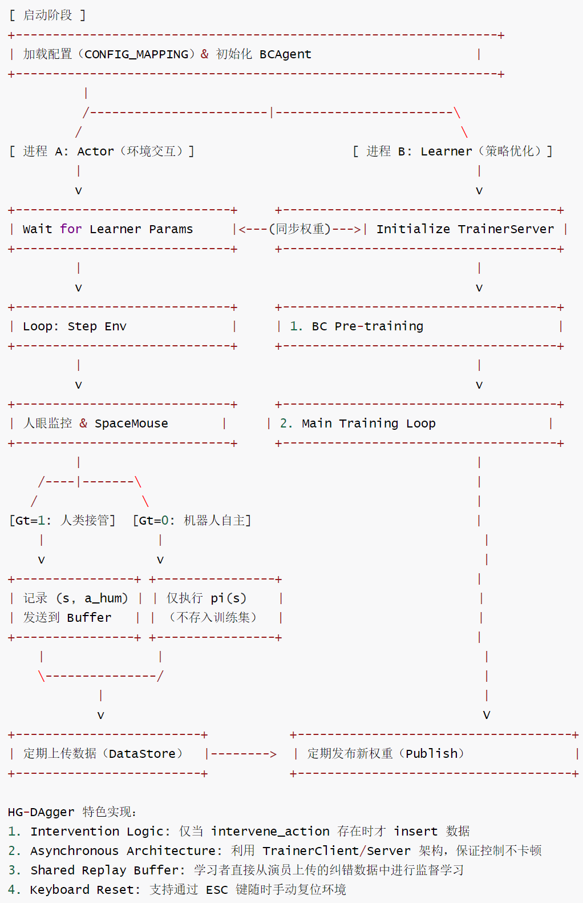
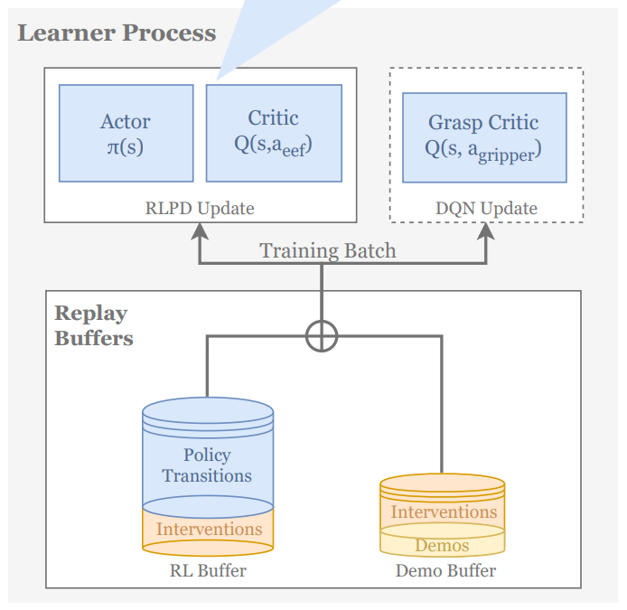
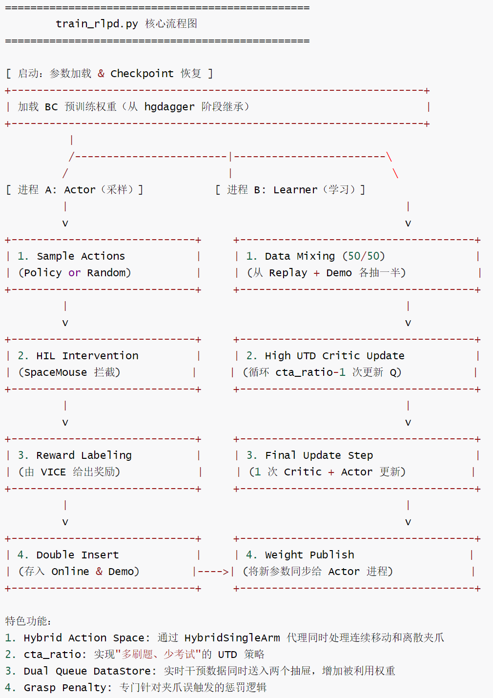
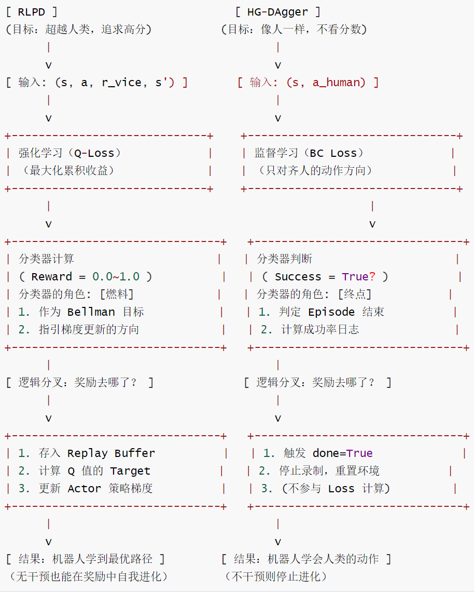

# 【机器人 / 强化学习】HIL-SERL 算法篇：HG-DAgger 与 RLPD —— 从模仿到超越的训练双阶段

# 【机器人 / 强化学习】HIL-SERL 算法篇：HG-DAgger 与 RLPD —— 从模仿到超越的训练双阶段

目录

* [【机器人 / 强化学习】HIL-SERL 算法篇：HG-DAgger 与 RLPD —— 从模仿到超越的训练双阶段](#机器人--强化学习hil-serl-算法篇hg-dagger-与-rlpd--从模仿到超越的训练双阶段)
  + [0x00 概要](#0x00-概要)
  + [0x01 HG-DAgger 的核心思想：人类门控的数据聚合](#0x01-hg-dagger-的核心思想人类门控的数据聚合)
    - [1.1 问题的起点：BC 的误差累积](#11-问题的起点bc-的误差累积)
    - [1.2 DAgger 的解法：让专家在你犯错的地方教你](#12-dagger-的解法让专家在你犯错的地方教你)
    - [1.3 HG-DAgger 的进化：从"事后纠正"到"事前拦截"](#13-hg-dagger-的进化从事后纠正到事前拦截)
    - [1.4 HG-DAgger 的三大优势](#14-hg-dagger-的三大优势)
  + [0x02 HG-DAgger 训练范式全解析](#0x02-hg-dagger-训练范式全解析)
    - [2.1 HG-Dagger的算法伪代码](#21-hg-dagger的算法伪代码)
    - [2.2 异步双进程架构](#22-异步双进程架构)
    - [2.3 干预检测机制](#23-干预检测机制)
    - [2.4 BCAgent 组件架构与 BC 预训练](#24-bcagent-组件架构与-bc-预训练)
    - [3.4 数据存储策略](#34-数据存储策略)
    - [2.6 干预频率监控](#26-干预频率监控)
    - [2.7 HG-DAgger 完整训练流程图·](#27-hg-dagger-完整训练流程图)
  + [0x03 RLPD 训练范式全解析](#0x03-rlpd-训练范式全解析)
    - [3.1 三合一 Buffer 设计](#31-三合一-buffer-设计)
    - [3.2 双缓冲区数据管理](#32-双缓冲区数据管理)
    - [3.3 CTA Ratio：用计算换效率](#33-cta-ratio用计算换效率)
    - [3.4 SAC 与 DQN 的混合训练](#34-sac-与-dqn-的混合训练)
    - [3.5 RLPD 完整训练流程图](#35-rlpd-完整训练流程图)
  + [0x04 对比](#0x04-对比)
    - [4.1 Dagger vs HG-Dagger](#41-dagger-vs-hg-dagger)
    - [4.2 RLPD vs HG-DAgger：奖励的两种角色](#42-rlpd-vs-hg-dagger奖励的两种角色)
      * [核心差异](#核心差异)
      * [流程对比](#流程对比)
      * [HG-DAgger：奖励作为"终点"](#hg-dagger奖励作为终点)
      * [RLPD：奖励作为"燃料"](#rlpd奖励作为燃料)
      * [深度对比表](#深度对比表)
      * [两个脚本的衔接关系](#两个脚本的衔接关系)
  + [0x05 HIL-SERL 的总体支柱](#0x05-hil-serl-的总体支柱)
  + [0x06 总结](#0x06-总结)
  + [0xFF 参考](#0xff-参考)

## 0x00 概要

HIL-SERL 的训练流程不是一个算法一跑到底，而是精心设计的两阶段接力：先用 HG-DAgger 做冷启动，让机器人快速学会基础操作；再用 RLPD 做持续优化，让机器人超越人类表现。这两个阶段共享相同的干预机制，但学习目标和数据处理方式截然不同。

## 0x01 HG-DAgger 的核心思想：人类门控的数据聚合

### 1.1 问题的起点：BC 的误差累积

模仿学习的起点是行为克隆（BC）——拿人类示教数据训练一个策略 \(\pi(a|s)\)。BC 有一个致命缺陷叫 **协变量偏移（covariate shift）**：训练数据覆盖的是"完美状态"，部署时机器人自己执行，微小误差把它带入训练集没覆盖的状态，策略随即失效，误差进一步放大。

我们想想教机器人开车的例子：你演示了完美的居中驾驶，机器人学会了 99%。实操时车轮偏了 1 厘米——训练集全是"完美居中"的状态，机器人从未见过"偏左 1 厘米"。它慌了，随机打方向盘，车子越来越偏，最终完全失控。

这个问题的本质是 **训练分布 ≠ 部署分布**。BC 只学过"在正确状态下做正确动作"，没学过"在错误状态下如何恢复"。

### 1.2 DAgger 的解法：让专家在你犯错的地方教你

DAgger（Dataset Aggregation）是模仿学习的经典算法，要解决的正是 behavior cloning 的 covariate shift 问题：learner 在 expert 数据上训练，部署时自己执行，小错误把它带进 expert 数据没覆盖的状态，策略随即失效。

DAgger的思路是反过来：不再只让人演示"正确答案"，而是让机器人自己跑，人在机器人实际访问到的状态上给出标注。

* 第一步：机器人按当前策略去执行。
* 第二步：当机器人跑到它不熟悉的状态时，人类专家针对这个状态给出纠正动作。
* 第三步：把"状态-纠正动作"对加入数据集。
* 第四步：用扩展后的数据集重新训练。

这个循环的关键词是 **"在哪跌倒，在哪补课"**。传统 BC 像是给学生一整套满分卷子让学生背；DAgger 像是让学生去考试，做错一题老师当场纠正，把错题加入错题集。

DAgger 有一个参数 \(\beta\) 控制人类参与度：\(\beta=1\) 时完全听人的，\(\beta\) 逐渐衰减到 0 时完全听机器人的。如果 \(\beta\) 衰减太快，机器人还没建立起对状态空间的正确理解就被迫全权负责，会迅速滑向未知区域。

### 1.3 HG-DAgger 的进化：从"事后纠正"到"事前拦截"

原始的 DAgger 是"先跑、再标"——机器人先犯错（哪怕是虚拟的），人再对着回放标注。这对于真实物理机器人来说成本太高：一个错误动作可能已经损坏了硬件。

HG-DAgger（Human-Gated DAgger）引入了 **人类门控（Human Gating）** 机制，把干预时机从"事后"提前到"事中"乃至"事前"：

* **Human-Gated（人类门禁）**：代码中没有自动触发接管的逻辑，完全依赖于外部 env.step 返回的 info。这意味着"接管闸门"掌握在拿着 SpaceMouse 的人类手中。

* **硬件触发**：操作者手持 SpaceMouse（3D 鼠标），当检测到手对摇杆的推力超过阈值（L2 范数 > 0.001），系统立即执行门控开启。
* **零延迟控制权转移**：在毫秒级时间内屏蔽策略输出，将控制权 100% 交给人类。
* **干预即标注**：接管动作被系统自动识别为高价值纠正数据——接管前的状态标记为"潜在失败"，接管后的动作为"正确示范"。

这套机制的精髓在于 **"只学错题"**——机器人做得对时人类不动摇杆，系统不产生数据；只有当机器人跑偏了，人类才介入，产生的每一条数据都精准落在策略最薄弱的边界场景上，每一条数据都是针对机器人当前弱点的"特效药"。

### 1.4 HG-DAgger 的三大优势

1. **极度安全**：人在实时监控，一旦有危险立刻接管，对昂贵的真实机械臂非常友好。
2. **数据极简**：只收集机器人"不会做"的那部分数据，避免海量重复数据的干扰。
3. **学习风险意识**：通过人类干预的时机，可以间接学习"哪些状态是危险的"。

## 0x02 HG-DAgger 训练范式全解析

HIL-SERL 把训练拆成两个阶段，每个阶段使用不同的算法范式：

| 范式 | 算法 | 数据策略 | 适用场景 |
| --- | --- | --- | --- |
| HG-DAgger | 纯 BC（行为克隆） | 只存干预数据 | 快速纠偏，冷启动 |
| RLPD | SAC + BC | 在线数据 + 干预数据 50/50 采样 | 持续优化，高精度 |

**第一阶段**：跑 `train_hgdagger.py` 或 `train_bc.py`。机器人学习基本的"视觉-动作"映射，保存为 Checkpoint。这相当于让机器人"小学毕业"——能走通任务，但还很笨拙。

**第二阶段**：启动 `train_rlpd.py`。脚本会加载第一阶段的 Checkpoint，开始强化学习优化。这相当于让机器人"上大学"——在已有基础上去探索更优的策略，最终超越人类。

### 2.1 HG-Dagger的算法伪代码

这是 HG-Dagger 的算法伪代码。它的核心在于引入了一个由人类控制的"门禁开关"（G）。在实际代码实现中，\(G\_t\) 通常不是一个生硬的 if/else，而是一个平滑插值：\(a\_{\text{final}} = \beta \cdot a\_{\text{expert}} + (1-\beta) \cdot \pi(s)\)。当人类按下摇杆时，\(\beta\) 迅速从 0 升到 1。由于数据集 D 里存的全是"人类纠错"的数据，训练出来的模型会天然地在这些危险区域拥有更强的回归能力。

```
输入：初始策略 π₋₁，空数据集 D = ∅，训练轮数 N，每轮步数 T。

1. 初始化：通过行为克隆（BC）训练初始策略 π₋₁（可选）。
2. 循环 对于每一轮 i = 1$ 到 N：
   * 交互采样：对于每一步 $t = 1$ 到 T：
     1. 观察当前状态 $s_t$。
     2. 人类评估：人类专家实时观察 $s_t$ 并决定门控信号 $G_t$：
        * 如果人类觉得危险或需要纠正：$G_t = 1$（人类接管）
        * 否则：$G_t = 0$（机器人自主）
     3. 动作执行：# 数据只在人类接管时被记录。
        * 如果 $G_t = 1$：执行人类动作 $a_{expert}$，并记录数据 $\{(s_t, a_{expert})\}$ 到 D。
        * 如果 $G_t = 0$：执行机器人动作 $a_t = \pi_{i-1}(s_t)$。
	 4. 环境更新：$s_{t+1} \gets \text{Step}(s_t, \text{Executed Action})$。
   * 策略更新：
	 1. 将本轮新收集的数据并入总数据集 $D \gets D \cup D_{\text{new}}$。
	 2. 在 D 上使用监督学习（Supervised Learning）训练新策略 $\pi_{i+1}$。

输出：最终训练好的策略 $\pi_{<N+1>}$。
```

### 2.2 异步双进程架构

HG-DAgger 的 `train_hgdagger.py` 采用 Actor-Learner 异步架构：

* **Actor 进程**：负责与环境/硬件交互。从 Learner 接收最新模型参数，执行策略并采样动作。当人类通过 SpaceMouse 介入时，覆盖策略动作并记录纠错对。
* **Learner 进程**：负责训练。从 Replay Buffer 中抓取干预数据进行 BC 训练，并将新参数发布给 Actor。

### 2.3 干预检测机制

HG-DAgger 的核心逻辑是一个"拦截协议"：

```
# 1. 机器人先算出一个它想做的动作
actions = agent.sample_actions(...)

# 2. 执行环境步进，注意返回的 info
next_obs, reward, done, truncated, info = env.step(actions)

# 3. 拦截逻辑（核心！）
if "intervene_action" in info:
    actions = info.pop("intervene_action")     # 人类覆盖动作
    already_intervened = True

if already_intervened:
    data_store.insert(transition)              # 只存被干预的 transition！
```

这里有两个关键设计：

**为什么用 `pop` 而不是 `get`？** `pop` 取走并删除了 `intervene_action` 键，防止它残留在 info 字典中被后续的日志记录或 buffer 存储误读。每次干预在当前帧被"消费"后，下一帧必须由环境重新判定是否存在新的干预。

**如何过滤误触？** 底层的环境包装器通常有两种过滤方案：一是设置"死区"阈值（如 5%），SpaceMouse 推力小于阈值则忽略；二是幅度判定，只有当人类指令强度明显超过机器人当前指令时才判定为有效干预。

### 2.4 BCAgent 组件架构与 BC 预训练

`BCAgent` 是 HG-DAgger 使用的核心 Agent，结构极为精简——只有单一 Actor 网络：

```
BCAgent 只有单一 Actor 网络：
├── Encoder: ResNet-10（预训练，参数冻结）
│   ├── pooling_method: "spatial_learned_embeddings"
│   ├── num_spatial_blocks: 8
│   └── bottleneck_dim: 256
├── MLP Head（可训练）:
│   ├── activations: tanh
│   ├── use_layer_norm: True
│   ├── hidden_dims: [512, 512, 512]
│   └── dropout_rate: 0.25
└── Policy Layer:
    ├── action_dim: 根据任务确定
    └── tanh_squash_distribution: False
```

**参数统计**：ResNet-10 编码器约 10M 参数（预训练且冻结），MLP Head 约 0.8M 可训练参数。

BC 预训练是 HG-DAgger 的冷启动步骤。先用离线演示数据训练 `pretrain_steps=20000` 步，让机器人一出门就不是"瞎子"：

```
def learner(rng, agent: BCAgent, demo_buffer, wandb_logger=None):
    update_step = 0
    if FLAGS.pretrain_steps:
        if os.path.isdir(os.path.join(FLAGS.checkpoint_path, f"checkpoint_{FLAGS.pretrain_steps}")):
            # 从 checkpoint 恢复
            ckpt = checkpoints.restore_checkpoint(...)
            agent = agent.replace(state=ckpt)
            update_step = FLAGS.pretrain_steps
        else:
            # 从头做 BC 预训练
            for step in tqdm.tqdm(range(FLAGS.pretrain_steps), ...):
                update_step += 1
                batch = next(demo_iterator)
                agent, bc_update_info = agent.update(batch)
            checkpoints.save_checkpoint(...)
```

### 3.4 数据存储策略

干预数据以原始步长逐条存入 buffer，不做任何分段或截断：

```
if already_intervened:
    data_store.insert(transition)                # 一步一个 transition
    demo_transitions.append(copy.deepcopy(transition))
```

**只存人类动作，策略动作完全丢弃**：

```
actions = agent.sample_actions(obs)
next_obs, reward, done, truncated, info = env.step(actions)
if "intervene_action" in info:
    actions = info.pop("intervene_action")       # ← 策略动作被覆盖，未保存
```

这意味着无法做 Q-filter、Value-Intended 或策略偏差分析——HG-DAgger 完全是监督学习范式，不关心 Q 值。

**为什么不需要切分片段？** SERL 使用 TD(0) 单步学习，每步 transition 独立。Episode 边界由 `masks` 字段保护：`done=True → mask=0`，防止跨 episode 的 Q 值 bootstrap。

### 2.6 干预频率监控

每个 episode 结束时只记录两个原始数字：

```
info["episode"]["intervention_count"] = intervention_count     # 干预段数
info["episode"]["intervention_steps"] = intervention_steps     # 干预步数
```

| 指标 | 含义 | 示例 |
| --- | --- | --- |
| intervention\_count | 干预段数（连续干预算 1 段） | 3 段 |
| intervention\_steps | 干预步数（每步 + 1） | 15 步 |

没有计算 `intervention_rate`，也没有基于干预率的自动调整。如需干预率，在 WandB 上手动计算：`intervention_steps / episode_length`。

### 2.7 HG-DAgger 完整训练流程图·



硬件交互被完全封装在 `config.get_environment()` 中——所有的机械臂驱动、摄像头读取、SpaceMouse 信号处理都对外透明，从脚本层面看不到具体硬件型号。

* 所有的硬件逻辑（如何读取摄像头、如何给机械臂发指令、如何读取 SpaceMouse 信号）都被封装在了 config.get\_environment 返回的那个 env 对象里。
* 配置映射：运行脚本时输入的 --exp\_name（如 panda\_pcb\_insert）决定了系统加载哪个硬件配置。
* 轮询频率：系统在运行 env.step 时，环境包装器（Environment Wrapper）会以极快的频率（如 100Hz）轮询 SpaceMouse。
* 触发阈值：一旦人类推动了 SpaceMouse（即便只是推了一点点），包装器就会判定："人类要接管了！"。
* 动作覆盖：包装器会立即弃掉机器人刚才发出的 actions，改用人类的指令发给电机。同时，它会在 info 字典里塞入一个 intervene\_action 键。
* 无感切换：因为这一切发生在毫秒级，机器人在还没来得及执行那个错误的动作前，就已经被人类的正确动作"校正"了。

## 0x03 RLPD 训练范式全解析



### 3.1 三合一 Buffer 设计

RLPD（RL with Prior Data）是 HIL-SERL 真正的算法内核。它维护一个包含三类经验的混合池：

1. **Offline Demo**：初期录制的高质量专家演示（pkl 文件）。
2. **Autonomous Rollouts**：机器人自己尝试的数据（有好有坏）。
3. **Human Interventions**：训练过程中人类实时纠错产生的数据。

系统在训练时以 50/50 方式采样：

```
50% online replay batch + 50% demo/intervention batch
```

| 数据来源 | Buffer | 采样比例 |
| --- | --- | --- |
| 在线交互（策略 + 人类） | replay\_buffer | 50% |
| 离线 Demo（pkl 文件） | demo\_buffer | 50% |
| 在线干预（SpaceMouse） | 汇入 demo\_buffer | 50% |

干预数据没有独立的 Buffer——它通过 `actor_env_intvn` 通道汇入 `demo_buffer`，与离线演示数据混在一起，享受同样的 50% 采样比例。这意味着在整个训练周期内，人类干预数据始终保持 50% 的曝光率，不会被海量自主试错数据淹没。

### 3.2 双缓冲区数据管理

**Actor 端**处理干预和双流插入：

机器人的 "自主试错" 被当作普通经验，而人类的 "拨乱反正" 被当作专家演示。这种做法实现了 RL（自我进化）与 IL（向人学习）的完美融合。

```
if "intervene_action" in info:
    actions = info.pop("intervene_action")     # 用干预动作替换
    intervention_steps += 1

# 所有 transition → data_store（在线 buffer）
data_store.insert(transition)
# 干预 transition → intvn_data_store（demo buffer）
if already_intervened:
    demo_transitions.append(copy.deepcopy(transition))
```

**Learner 端**做 50/50 采样。

这正是 RLPD（Reinforcement Learning from Prior Data）的核心逻辑。无论在线数据变得多么庞大，系统始终给 "人类老师的教导" 留出一半的席位，确保它不会学废。

```
# 一半从 RL Buffer 采样，一半从 Demo Buffer 采样
batch = replay_buffer.sample(batch_size // 2)
demo_batch = demo_buffer.sample(batch_size // 2)
batch = concat_batches(batch, demo_batch)      # 拼接为完整 batch
```

关键设计：**Agent 完全无感知数据来源**。在 `sac.py` 的 `update()` 中，没有任何标记区分 demo vs online vs intervention：

```
def update(self, batch, *, networks_to_update):
    # 两部分数据在 loss 计算中被完全同等对待
    loss_fns = self.loss_fns(batch)            # 统一计算 loss
```

### 3.3 CTA Ratio：用计算换效率

cta\_ratio（Critic-to-Actor Ratio）是 RLPD 采样效率的核心引擎。它代表每次 Actor 更新前 Critic 更新的次数：

```
# cta_ratio=2（HIL-SERL 默认）
# 先做 n-1 次纯 critic 更新，最后 1 次做 critic + actor 全更新
for critic_step in range(cta_ratio - 1):
    batch = concat_batches(online, demo)
    agent.update(batch, networks_to_update={"critic"})
# 第 cta_ratio 次：全网络更新
batch = concat_batches(online, demo)
agent.update(batch, networks_to_update={"critic", "actor", "temperature"})
```

| cta\_ratio | critic 更新次数 | actor 更新次数 | 每次都用 50/50 batch |
| --- | --- | --- | --- |
| 2（HIL-SERL 默认） | 2 | 1 | 是 |
| 4（serl-main 默认） | 4 | 1 | 是 |

为什么先更新 critic 而不是一起更新？因为 actor 依赖 critic 提供的 Q 值来更新策略。如果 critic 还没通过多次拟合看清 Q 值的分布，让 actor 对着"半吊子 Q"去更新就是瞎改。每次 critic 更新都用 50/50 混合 batch，保证两类数据对 Q 值估计的影响力始终保持均衡。

### 3.4 SAC 与 DQN 的混合训练

RLPD 训练脚本能同时处理纯 SAC（连续动作）和混合 SAC+DQN（连续+离散动作）：

```
if isinstance(agent, SACAgent):
    train_networks_to_update = frozenset({"critic", "actor", "temperature"})
else:
    train_networks_to_update = frozenset({"critic", "grasp_critic", "actor", "temperature"})
```

通过 `config.setup_mode` 自动决定更新哪些网络——`'single-arm-learned-gripper'` 时启用 GraspCritic，更新 4 个网络；纯 SAC 时只更新 3 个网络。

### 3.5 RLPD 完整训练流程图

这是 HIL-SERL 的 "完全体" 脚本。它通过异步架构将极致的计算压力（UTD）和实时的人类干预缝合在一起。



## 0x04 对比

### 4.1 Dagger vs HG-Dagger

* Dagger 的解法（事后补救）：
  + Dagger 的原始逻辑是"先跑、再标"。
  + 机器人跑，人坐在旁边等它跑完，然后人对着回放录像说："这里你该往左，那里你该往右"。即，让人去给这个"慌乱状态"打标签。
  + 这意味着机器人必须先犯错（哪怕是虚拟的或者受控的），你才能去纠正。
* HG-Dagger 的解法（事先预防）：
  + HG-Dagger 让人在机器人"开始慌"的一瞬间就把它拉回来。即人类门禁（Human Gating），强调在发生偏差之前或者发生瞬间接管，它是为真实世界里"经不起摔"的机器人量身定制的。
  + 机器人跑，人手握控制柄（比如 SpaceMouse）。人一旦觉得"哎呀，要撞墙了"或者"走错了"，就直接上手接管。
  + "Gated（门禁控制）"的开关（门）掌握在人手里。人决定什么时候救，教什么。

DAgger缺乏提升性能的机制。相比之下，HG-DAgger 在相同任务下分布更加稀疏。各状态的访问更加均匀。为了达到类似的性能，DAgger 可能需要显著更多的演示和纠正，并且需要人类操作员更加细致地关注数据质量。

### 4.2 RLPD vs HG-DAgger：奖励的两种角色

RLPD 和 HG-DAgger 最本质的区别在于对**奖励**的使用方式。我们可以把这种区别理解为"奖励作为燃料" vs "奖励作为终点"。

| 范式 | 使用数据 | 主要学习方式 | 适用理解 |
| --- | --- | --- | --- |
| HG-DAgger | 主要使用干预数据 | 行为克隆 / supervised-style | 快速纠偏、冷启动、学习恢复动作 |
| RLPD / HIL-SERL 主线 | 在线数据 + demo + intervention | off-policy RL | 持续优化策略性能 |

以学习过程中的阶段为例：

* BC：背诵课本（死记硬背）。
* HG-DAgger：老师在旁边盯着，写错一个字就被打手心（实时纠错）。
* RLPD：刷历年真题，并尝试寻找比标准答案更简便的解法（自我进化）。

#### 核心差异

train\_hgdagger.py 和 train\_rlpd.py这两个训练脚本的核心差异主要体现在以下几个方面：

* **算法类型不同**：train\_hgdagger.py使用 **BCAgent**（行为克隆），而 train\_rlpd.py 使用 **SACAgent**（强化学习）
* **训练数据源不同**：
  + HG-Dagger：仅使用演示数据（demo\_buffer），在train\_hgdagger.py:中只从 `demo_iterator` 采样
  + RLPD：同时使用演示数据和在线经验，在train\_rlpd.py 中混合 `replay_iterator` 和 `demo_iterator`，采用50/50采样
* **人机干预处理方式不同**：
  + HG-Dagger：干预数据直接进入演示数据集，用于监督学习
  + RLPD：干预数据同时进入在线buffer和演示buffer，用于强化学习

#### 流程对比

RLPD（强化学习）vs HG-DAgger（模仿学习）流程对比如下：



#### HG-DAgger：奖励作为"终点"

HG-DAgger —— 纯粹的"模仿者"：当你运行 train\_hgdagger.py 时，你就是在用这种手段跑 HG-DAgger 算法。

* 逻辑：机器人只学一件事—"像人一样思考"。
* 目标：模仿人类。机器人不看奖励，它只学一件事："在这一刻，如果是那个人，他会怎么推杆？"。
* 局限：它不看奖励（Reward）。如果人教错了，它就学错。它很难超越人类。

在 `train_hgdagger.py` 中，BCAgent 的 loss 完全不看奖励：

```
def loss_fn(params, rng):
    pi_actions = dist.mode()
    log_probs = dist.log_prob(batch_actions)
    actor_loss = -(log_probs).mean()  # 监督学习，只看动作对齐
```

这里的 VICE 奖励只扮演一个角色：当画面显示任务成功时，通过 `MultiCameraBinaryRewardClassifierWrapper` 将 reward 转化为 `done=True` 信号，触发环境重置。人在不需要腾出手去按键盘，实现"全自动示教周期"。

**奖励是红绿灯**——告诉系统"任务结束了，别录了"，但不参与梯度计算。

#### RLPD：奖励作为"燃料"

HIL-SERL / RLPD —— 进化的"学习者"：当你运行 train\_rlpd.py 时，你依然在使用"实时干预"这个手段，但你的算法变成了 RLPD。

* 逻辑：干预产生的数据被塞进了 demo\_buffer。机器人不仅学人的动作，它还盯着 VICE 的奖励分数看。
* 进化：如果人教的动作能拿到 0.8 分，而机器人自己试出了一个动作能拿 1.0 分（比如更快的路径），它会通过 RL 的 Q 值优化，抛弃人的动作，选择更强的动作。

在 `train_rlpd.py` 中，分类器输出的 \([0, 1]\) 奖励信号被用作 Bellman 目标的核心输入：

```
target_next_min_q = target_next_qs.min(axis=0)
target_q = batch["rewards"] + discount * batch["masks"] * target_next_min_q
critic_loss = jnp.mean((predicted_qs - target_qs) ** 2)
```

这是一个时序差分目标——奖励直接决定了 Q 值的更新方向。如果一个动作导致 VICE 分数变高，Q 值升高，Actor 倾向于再次尝试类似动作。即使机器人还没完全成功，奖励信号也能通过画面的微妙变化（如接近目标）提供微弱的正反馈。

**奖励是引擎**，驱动策略持续优化，探索比人类更好的路径。

#### 深度对比表

| 维度 | RLPD | HG-DAgger |
| --- | --- | --- |
| 算法类型 | SAC + BC（强化学习） | 纯 BC（行为克隆） |
| 非干预数据 | 存入 online buffer | 丢弃 |
| 干预数据 | 存入 online + demo buffer | 存入唯一 buffer |
| 采样比例 | 50% online + 50% demo | 100% 干预数据 |
| 分类器功能 | 生成奖励信号（Reward Generation） | 判定任务完成（Termination Detection） |
| 对 Reward 的依赖 | 极高：无奖励则 Q 网络无法更新 | 极低：训练只看"人怎么做" |
| 干预的作用 | 辅助探索（Exploration Help） | 唯一数据源（Data Source） |
| 最终目的 | 在奖励信号下寻找最优解 | 在人类指导下寻找人类解 |
| 奖励的本质 | 梯度信号（0 到 1 的概率流） | 二值判定（0 或 1） |
| 失败后果 | 收到 0 分，Critic 降低该动作的身价 | 任务重置，重新开始一次演示 |
| 学习阶段理解 | 刷历年真题，寻找比标准答案更简便的解法 | 老师在旁盯着，写错字就被打手心 |

#### 两个脚本的衔接关系

HG-Dagger 和 RPLD 有一个完美的衔接点：

* HG-Dagger 告诉你什么时候该切换控制权。
* RPLD 告诉你拿到了人的数据后，如何用 RL 进一步超越人。

| 维度 | train\_hgdagger.py | train\_rlpd.py |
| --- | --- | --- |
| Agent | BCAgent | SACAgent / SACAgentHybridSingleArm |
| 预训练 | 内置 BC 预训练（从零或从 demo） | 无 BC 预训练，加载前阶段权重 |
| 数据源 | 仅 demo\_buffer | replay\_buffer + demo\_buffer 50/50 |
| 干预目标 | 产生监督学习数据 | 产生强化学习数据 |

`train_rlpd.py` 不内置 BC 预训练，因为它假设你已经完成了第一阶段。代码中会尝试加载 Checkpoint：

```
if FLAGS.checkpoint_path is not None and os.path.exists(FLAGS.checkpoint_path):
    # 从 hgdagger 的 checkpoint 恢复
```

RLPD 是一种高效的**微调**手段。从零开始跑 RL，即使有高 UTD，在复杂的机器人任务中依然会因为"大海捞针"浪费大量时间。先模仿（BC），再超越（RLPD），是 HIL-SERL 的标准流程。

## 0x05 HIL-SERL 的总体支柱

收回来看，HIL-SERL 整个系统的动力来自三个支柱：

**采样效率的核动力：UTD**。通过 cta\_ratio（如 20:1），每一步物理交互对应 20 次 Critic 更新，让网络在极短时间内"吃透"少量物理数据。引入 LayerNorm 防止高频更新导致的 Q 值爆炸。

**机器人的手感：SAC vs DQN**。SAC（连续控制）负责机械臂的 6D 空间平滑移动，输出正态分布具备极细微的调优能力。DQN（离散控制）负责夹爪的开关，离散 Q 值比连续分布更适合处理二值动作，避免夹爪在开关之间的犹豫。

**人在回路：指路与纠错**。解决"怎么去"的问题，把机器人从迷茫中拉回正轨。HG-DAgger 的事先预防不同于原版 DAgger 的事后补救——通过 Human Gating 在错误发生前瞬间拦截，实现"只学错题"的高效策略。

## 0x06 总结

HIL-SERL 的算法设计体现了清晰的"递进式"思路：

* **BC → HG-DAgger → RLPD** 是一条完整的能力进化链。HG-DAgger 解决的是"如何安全、高效地获取高质量纠正数据"，RLPD 解决的是"如何利用这些数据超越人类表现"。
* **HG-DAgger 和 RLPD 共享相同的干预接口**（SpaceMouse 拦截、env.step 的 intervene\_action 通道），但处理数据的策略截然不同——一个用监督学习模仿人类，一个用强化学习优化回报。
* **奖励信号的两种角色**是理解两个范式差异的关键：在 HG-DAgger 中奖励是"终点"（触发 reset），在 RLPD 中奖励是"燃料"（驱动 Q 值更新）。

## 0xFF 参考

[🤔什么？SFT、DAgger、离线 RL 和 OPD，竟然是同一张 2×2 表格上的四个格子！](https://zhuanlan.zhihu.com/p/2049601453162080058)
