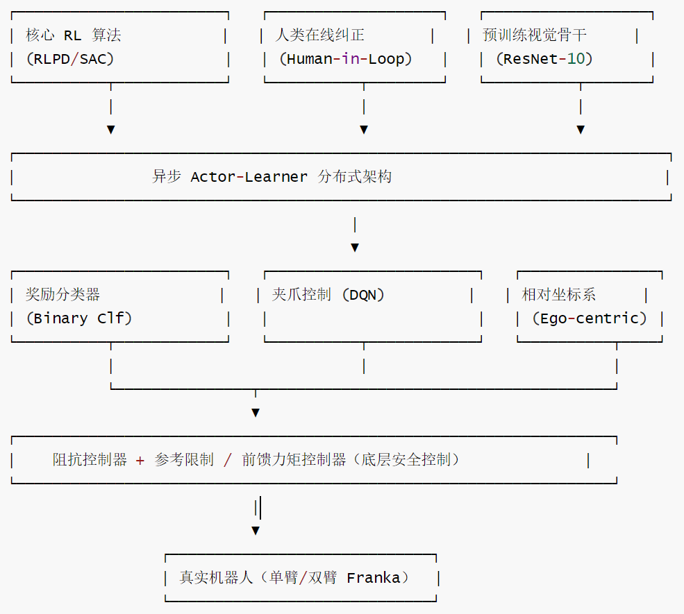
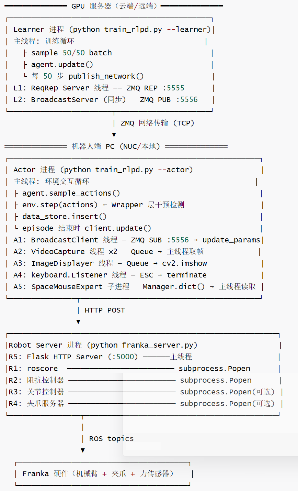
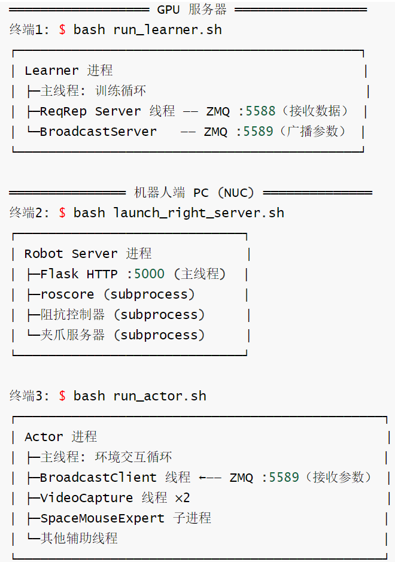
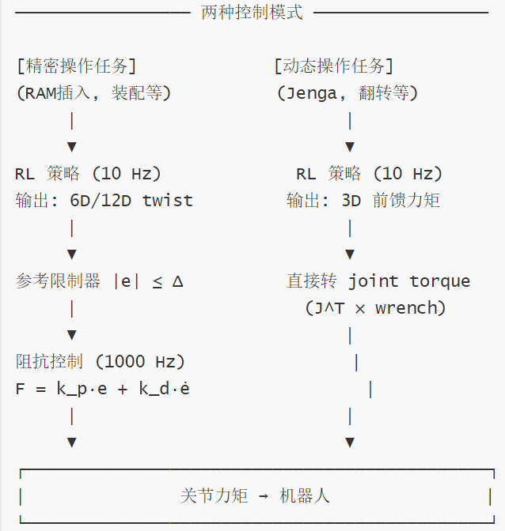
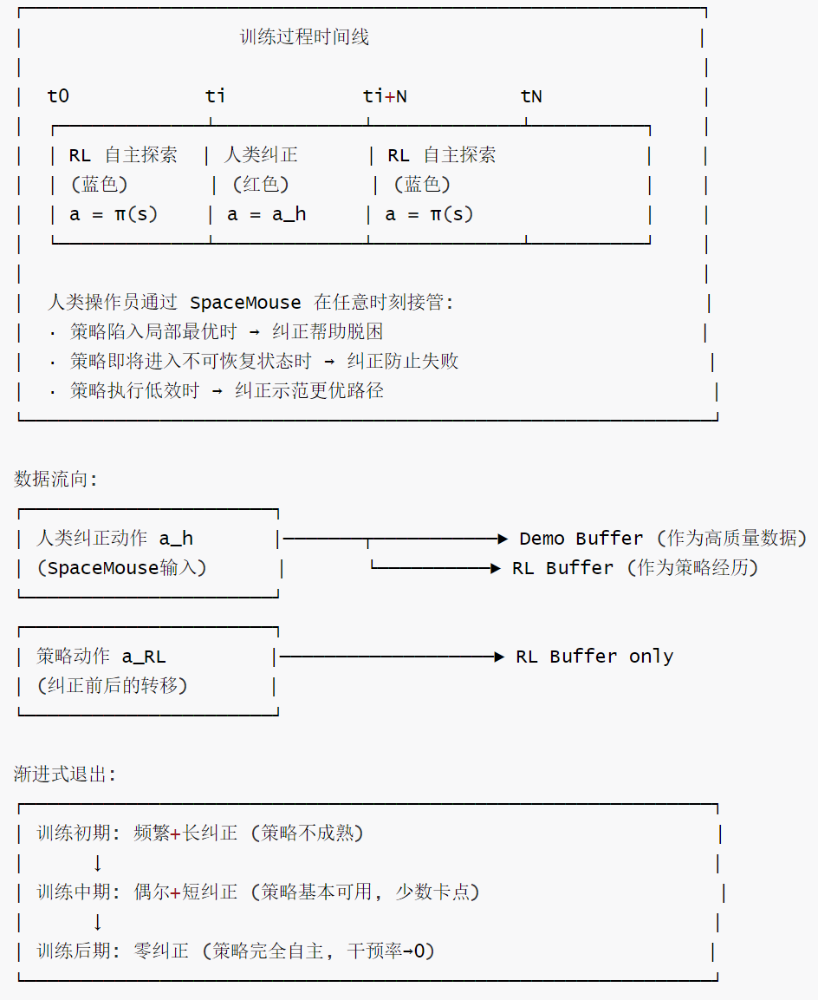
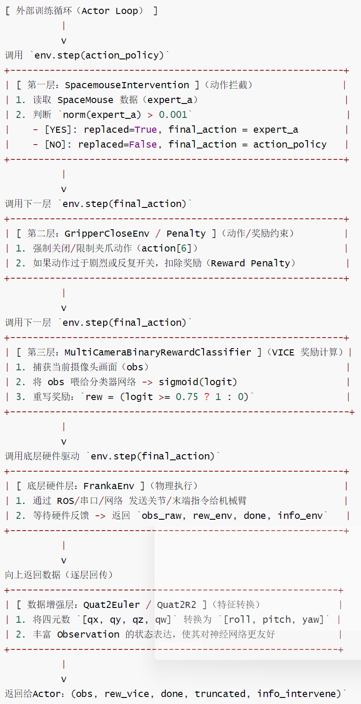
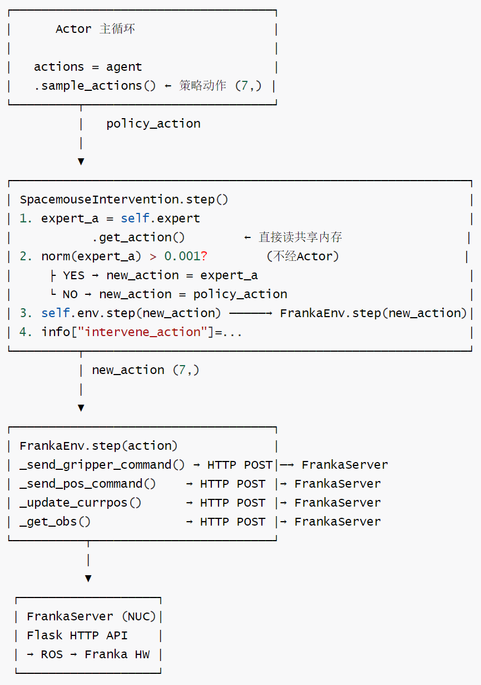
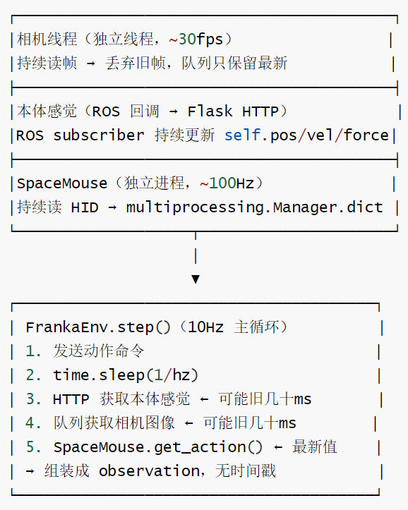

# 【机器人 / 强化学习】HIL-SERL 工程篇：人类在环的工程架构与物理设计

# 【机器人 / 强化学习】HIL-SERL 工程篇：人类在环的工程架构与物理设计

目录

* [【机器人 / 强化学习】HIL-SERL 工程篇：人类在环的工程架构与物理设计](#机器人--强化学习hil-serl-工程篇人类在环的工程架构与物理设计)
  + [0x00 概要](#0x00-概要)
  + [0x01 系统架构总览](#0x01-系统架构总览)
    - [1.1 逻辑架构](#11-逻辑架构)
    - [1.2 物理拓扑](#12-物理拓扑)
    - [1.3 部署拓扑与启动顺序](#13-部署拓扑与启动顺序)
    - [1.4 独立运行的组件清单](#14-独立运行的组件清单)
    - [1.5 单步交互时序](#15-单步交互时序)
  + [0x02 物理硬件设计](#0x02-物理硬件设计)
    - [2.1 混合动作空间：连续手臂 + 离散夹爪](#21-混合动作空间连续手臂--离散夹爪)
    - [2.2 阻抗控制与精细力觉](#22-阻抗控制与精细力觉)
    - [2.3 预训练视觉骨干](#23-预训练视觉骨干)
  + [0x03 Human-in-the-Loop 机制](#0x03-human-in-the-loop-机制)
    - [3.1 人类何时介入](#31-人类何时介入)
      * [环境恢复：盲目恢复 + 任务特定人工提示](#环境恢复盲目恢复--任务特定人工提示)
      * [人工介入提示点](#人工介入提示点)
    - [3.2 干预数据如何进入训练](#32-干预数据如何进入训练)
    - [3.3 十阶段干预完整流程](#33-十阶段干预完整流程)
      * [阶段 1：SpaceMouse 硬件读取（后台进程持续运行）](#阶段-1spacemouse-硬件读取后台进程持续运行)
      * [阶段 2：干预检测与动作替换](#阶段-2干预检测与动作替换)
      * [阶段 3：动作发送到机器人](#阶段-3动作发送到机器人)
      * [阶段 4：Actor 循环——干预标识与 transition 构建](#阶段-4actor-循环干预标识与-transition-构建)
      * [阶段 5：Actor 端数据暂存](#阶段-5actor-端数据暂存)
      * [阶段 6：网络传输（Actor → Learner）](#阶段-6网络传输actor--learner)
      * [阶段 7：Learner 端接收与 Buffer 写入](#阶段-7learner-端接收与-buffer-写入)
      * [阶段 8：Learner 采样与模型更新](#阶段-8learner-采样与模型更新)
      * [阶段 9：参数发布与 Actor 更新](#阶段-9参数发布与-actor-更新)
      * [阶段 10：Policy 接管](#阶段-10policy-接管)
    - [3.4 关键数据字段流转](#34-关键数据字段流转)
    - [3.5 核心设计要点](#35-核心设计要点)
  + [0x04 SpaceMouse 干预工程细节](#0x04-spacemouse-干预工程细节)
    - [4.1 Wrapper 设计与分层](#41-wrapper-设计与分层)
    - [4.2 干预检测逻辑](#42-干预检测逻辑)
    - [4.3 控制权切换：硬替换](#43-控制权切换硬替换)
    - [4.4 硬件数据流的真实路径](#44-硬件数据流的真实路径)
    - [4.5 多模态对齐：无时间戳对齐](#45-多模态对齐无时间戳对齐)
    - [4.5 结合源码的深度解读](#45-结合源码的深度解读)
  + [0x05 数据处理策略](#0x05-数据处理策略)
    - [5.1 无效动作：不删除不过滤](#51-无效动作不删除不过滤)
    - [5.2 关键帧识别：全量存储，无筛选](#52-关键帧识别全量存储无筛选)
    - [5.3 失败案例：无"错题本"](#53-失败案例无错题本)
    - [5.4 力反馈：采集了但没有专门处理](#54-力反馈采集了但没有专门处理)
  + [0x06 环境恢复与安全机制](#0x06-环境恢复与安全机制)
    - [6.1 盲目恢复](#61-盲目恢复)
    - [6.2 人工介入提示点](#62-人工介入提示点)
  + [0xFF 参考](#0xff-参考)

## 0x00 概要

HIL-SERL 能在真实机械臂上跑通 RL，靠的不是某个算法突破，而是整套工程系统设计：异步 Actor-Learner 解耦、SpaceMouse 实时干预、混合动作空间、阻抗控制底层安全——每一层都是纸上算法到真实机器人之间的必要桥梁。

## 0x01 系统架构总览

HIL-SERL 是一个**无中心编排的系统**——没有 master、没有 supervisor、没有 orchestrator。所有组件都是手动启动的独立进程，通过硬编码端口互连。

### 1.1 逻辑架构



HIL-SERL 最核心的机制是人类纠偏，"干预即负反馈"——将"挨骂"转化为进化的动力。在传统 RL 中失败的惩罚往往是滞后的（直到任务结束才判定失败），而 HIL-SERL 实现了瞬时负反馈：当人类通过 SpaceMouse 介入的一瞬间，系统不仅拿走控制权，还会给被接管前的动作打上负分，相当于在 Q 函数曲面上直接"挖坑"——机器人产生避险本能，不需要等到任务彻底失败就能提前规避错误。

### 1.2 物理拓扑



### 1.3 部署拓扑与启动顺序

HIL-SERL 是一个手工编排的系统：人类操作者就是"中控"，负责在 3 个终端里分别启动 Robot Server、Learner、Actor，通过 `--ip` 参数和硬编码端口让它们互连。

**启动顺序**：必须先启动机器人服务器 → 再启动 Learner → 最后启动 Actor（Actor 有 `wait_for_server=True`，会等待 Learner 就绪）。



Actor 是手动启动的独立进程，结束即结束，不会自动重启。任何组件挂掉都需要人工重启，不支持多 Actor，没有故障恢复——这是典型的研究原型设计，够用就好，不做生产级运维。

### 1.4 独立运行的组件清单

共 3 大进程，内部 13+ 个独立执行单元。所有"持续运行"的组件都是生产者，它们预取或缓存数据；Actor 主线程是消费者，按需读取最新值。这种解耦保证了主循环的步进节奏不受硬件 I/O 延迟影响。

| # | 组件 | 进程 | 类型 | 循环方式 | 通信方式 |
| --- | --- | --- | --- | --- | --- |
| L1 | Learner 主线程 | Learner | 主线程 | for step in range(max\_steps) | 直接调用 |
| L2 | ReqRep Server 线程 | Learner | daemon 线程 | while not is\_kill 无限循环 | ZMQ REP :5555 |
| L3 | BroadcastServer | Learner | 同步调用 | 无循环，被动触发 | ZMQ PUB :5556 |
| A1 | Actor 主线程 | Actor | 主线程 | for step in range(max\_steps) | 直接调用 |
| A2 | BroadcastClient 线程 | Actor | 线程 | while not is\_kill 无限循环 | ZMQ SUB :5556 |
| A3 | VideoCapture 线程 ×2 | Actor | 线程 | while enable 无限循环 | Queue → 主线程 |
| A4 | ImageDisplayer 线程 | Actor | daemon 线程 | while True 无限循环 | Queue → cv2.imshow |
| A5 | keyboard.Listener 线程 | Actor | pynput 线程 | 无限循环（事件驱动） | — |
| A6 | SpaceMouseExpert 子进程 | Actor | 子进程 | while True 无限循环 | Manager.dict() 共享内存 |
| R1 | roscore | Robot Server | subprocess | 无限循环（ROS master） | ROS |
| R2 | 阻抗控制器 | Robot Server | subprocess | 无限循环（ROS node） | ROS topic |
| R3 | 关节控制器 | Robot Server | subprocess | 无限循环（ROS node） | ROS topic |
| R4 | 夹爪服务器 | Robot Server | subprocess | 无限循环（ROS node） | ROS topic |
| R5 | Flask HTTP Server | Robot Server | 主线程 | 无限循环（WSGI） | HTTP :5000 |

**自主运行组件**（无限循环，不受主线程控制）：SpaceMouseExpert（硬件驱动必须持续轮询，否则丢失输入事件）、VideoCapture（相机帧率 30fps，必须持续读取避免帧堆积）、BroadcastClient（随时可能收到 Learner 参数，必须持续监听）、ReqRep Server（随时可能收到 Actor 数据，必须持续监听）、Robot Server 各进程（机器人控制器必须持续运行，保证安全）。

**按需运行组件**（由主线程驱动）：Actor 主循环、Learner 主循环（均逐步同步执行）、BroadcastServer（仅在 publish\_network 被调用时发送）、client.update（仅在 episode 结束时触发数据传输）。

### 1.5 单步交互时序

Actor 主循环是系统的执行核心。每一步的序列如下：

```
for step in pbar:  # 默认 1,000,000 步，实际上等同于持续运行直到人为终止
    ① agent.sample_actions(obs)
          │     ← BroadcastClient 可能在任意时刻异步更新 agent 参数
          │     ← VideoCapture 已在后台持续写入最新帧到 Queue
          ▼     ← SpaceMouseExpert 已在后台持续写入最新状态到共享内存
    ② env.step(actions)
          │ SpacemouseIntervention.step():
          │     ├ expert.get_action() ← 读 A6 的共享内存（非阻塞，取最新值）
          │     ├ 干预判定 → 决定 new_action
          │     └ self.env.step(new_action)
          │             │
          │         FrankaEnv.step():
          │             ├ _get_obs()
          │             │   └ 相机: 从 Queue 取最新帧（A3 早已预取好）
          │             │   状态: HTTP POST /getstate → R5 Flask → ROS → 硬件
          │             ├ _send_gripper_command() → HTTP POST → R5 → R4 → 硬件
          │             ├ _send_pos_command()    → HTTP POST → R5 → R2 → 硬件
          │             └ _update_currpos()      → HTTP POST → R5 → ROS → 硬件
          │        返回 (obs, rew, done, info)
          ▼         info["intervene_action"] = ...（如有干预）
    ③ 干预处理: actions = info.pop("intervene_action")（如有）
    ④ transition 构建 + data_store.insert()
    ⑤ if done: client.update() → ZMQ REQ-REP → Learner ReqRep Server → replay_buffer
    ⑥ obs = next_obs, 回到 ①
```

每一步内部是同步阻塞的：`sample_actions()` → `env.step()` → `insert()` → 下一步。异步体现在线程层级——网络参数接收、视频采集、SpaceMouse 读取都在独立线程/进程中持续运行，主线程只管取最新值。

## 0x02 物理硬件设计

### 2.1 混合动作空间：连续手臂 + 离散夹爪

机器人动作包含两类性质完全不同的部分。**机械臂运动**是连续 6D 末端位姿或 twist，需要平滑控制；**夹爪动作**是开/关/保持，天然是离散决策。

如果用一个连续 SAC policy 同时输出两者，夹爪可能输出类似"闭合 0.537"的中间值，导致犹豫、抖动或无效机械动作。因此 HIL-SERL 做了分治：

* 连续手臂动作由 SAC policy 输出；
* 离散夹爪动作由 GraspCritic（DQN 风格）选择；
* 最后拼接成完整动作。

通俗说：用 SAC 给机器人一条柔顺的手臂，用 DQN 给机器人一只果断的手。

这种设计也更贴近人类遥操作习惯：SpaceMouse 控制连续运动，按钮控制夹爪开关。

```
双 MDP 并行求解:

MDP₁ (连续): S → A₁ (6D/12D twist)   ←  SAC Actor-Critic (RLPD)
MDP₂ (离散): S → A₂ (open/close/stay) ←  DQN Critic (argmax)

单臂: |A₂| = 3 (open, close, stay)
双臂: |A₂| = 3² = 9 (每臂独立动作组合)

推理: a = [π_θ(s), argmax_a' Q_grasp(s, a')]
```

### 2.2 阻抗控制与精细力觉

HIL-SERL 不再使用僵硬的位置控制，而是采用**笛卡尔阻抗控制（Cartesian Impedance Control）**。

虚拟弹簧模型：机器人表现得像一个柔顺的弹簧，而不是冰冷的铁块。这使得机器人在探索时能够感知到物理约束（如孔位的边缘）。在开阔地带它能快速移动；在精密接触时，它能顺着物理约束滑动。

这种力觉层面的鲁棒性，让 HIL-SERL 能够完成诸如插内存条、翻煎蛋等对力度极其敏感的任务。它不是在"撞击"世界，而是在"抚摸"世界。

两种控制模式按任务类型切换：



我们可以这样理解：RL policy 负责高层策略，低层控制器负责把不完美动作变成可承受的物理交互。如果低层控制器过硬，探索阶段会损坏硬件；如果过软，机器人又无法完成精密装配。控制器不是附属细节，而是 HIL-SERL 成功的物理前提。

### 2.3 预训练视觉骨干

真实图像复杂、数据量有限，从零训练视觉编码器很容易过拟合或不稳定。HIL-SERL 使用预训练的 ResNet-10，在工程实现中冻结 ResNet-10 权重，只训练空间池化层和 MLP head——用预训练视觉特征降低真机数据需求。

多相机配置上，先选择任务最合适的相机：腕部相机有利于空间泛化，因为它提供 ego-centric view；如果腕部相机视野不够，就增加侧面相机。所有相机图像会裁剪到关注区域并 resize 到 128×128。

## 0x03 Human-in-the-Loop 机制

HIL-SERL 之所以能在众多真机 RL 方案中脱颖而出，不仅是因为效率，更因为它深刻理解了物理世界的交互本质——"人"作为最高级传感器的核心价值。

Human-in-the-Loop 在线纠正机制如下图所示。



### 3.1 人类何时介入

当策略把机器人带入 unrecoverable 或 undesirable state，或者卡在 local optimum 中——如果没有人类帮助需要很久才能走出来，此时人类会介入。这和 HG-DAgger 类似：人类不是全程控制，而是在策略表现不好时接管。

但 HIL-SERL 与纯 HG-DAgger 的关键区别是：HIL-SERL 使用这些纠正数据进行 reinforcement learning，而不是只做 supervised learning。不是简单地把人类动作当成 BC 标签，而是把人类纠偏纳入 off-policy RL 数据流，让策略从任务 reward 和纠正数据中共同学习。

#### 环境恢复：盲目恢复 + 任务特定人工提示

系统不检查错误状态，而是预防性地每次发命令前都尝试恢复：

```
# franka_env.py:417-422 - "盲目恢复"
def _send_pos_command(self, pos):
    self._recover()        # ← 每次发命令前都清除错误，不管有没有错
    requests.post(self.url + "pose", json=data)

def _recover(self):
    requests.post(self.url + "clearerr")  # → ROS ErrorRecoveryActionGoal
```

#### 人工介入提示点

**人工介入提示点举例如下：**

| 场景 | 提示内容 |
| --- | --- |
| 鸡蛋丢失 | `"We lost the egg!!! Put egg back and press Enter..."` |
| 双臂交接重置 | `"Press Enter to continue..."` |
| RAM 重新抓取 | `"Place RAM in holder and press enter to grasp..."` |
| 相机冻结 | `"camera frozen. Check connect, then press enter..."` |
| 人工判断成功 | `"Success? (1/0)"` |

**关键结论：** 碰撞 / 错误不终止 episode。\*\*done 只由超时、成功或 ESC 触发。碰撞后如果 `_recover()` 成功，机器人继续运行，中间的 “致死数据” 照常存入 Buffer，不会被标记或过滤。

### 3.2 干预数据如何进入训练

HIL-SERL 是异步 Actor-Learner 架构，数据是一个异步闭环。Actor 端持续执行环境交互，Learner 端持续从 buffer 中采样训练。人类干预发生后，数据会被写入本地 data store，并在一定时机上传到 Learner。Learner 训练和参数发布也有自己的节奏。

可以用时间线理解：

```
Actor端: ─[干预]─[干预]─[放手]─[policy]─[policy]─...─[episode结束]─client.update()→ 发送数据
                                                                    ↑
Learner端: ─────────────────────────────────────────────────────[持续训练循环]────────────
           ←────────────── 每 steps_per_update 步发布一次参数 ───────────────────────────→
```

因此，从干预发生到新参数生效，中间存在如下步骤或者环节：

* 当前 episode 剩余步骤；
* 数据传输：client.update() 在 episode 结束时才触发，不是干预后立刻上传
* Learner 采样到该数据：Learner 有自己独立的训练循环，持续从 buffer 采样训练，不关心数据来源是干预还是策略
* 完成若干训练更新；
* 下一次参数发布：每 steps\_per\_update=50 步发布一次，与干预事件无关
* Actor 接收并替换参数。

这不是“干预后即时改模型”，而是一个低耦合、异步的在线训练闭环。

### 3.3 十阶段干预完整流程

从 SpaceMouse 硬件读取到 Policy 接管，全链路如下：

```
SpaceMouse 硬件 → 干预检测 → 动作替换 → 机器人执行
→ transition 构建 → 双 buffer 插入 → ZMQ 传输
→ Learner 50/50 采样 → 模型更新 → ZMQ 广播参数
→ Actor 参数替换 → Policy 接管
```

#### 阶段 1：SpaceMouse 硬件读取（后台进程持续运行）

| 步骤 | 类.方法 | 输入→输出 |
| --- | --- | --- |
| 1.1 | `SpaceMouseExpert.__init__()` | 调用 `pyspacemouse.open()` 打开设备，启动 `_read_spacemouse` 守护进程 |
| 1.2 | `_read_spacemouse()` | 循环调用 `read_all()` → 写入共享字典 `latest_data["action"](6,)` 和 `latest_data["buttons"]` |
| 1.3 | `get_action()` | 从共享内存读取 → 返回 `(expert_a(6,), buttons[2])` |

#### 阶段 2：干预检测与动作替换

| 步骤 | 类.方法 | 输入→输出 |
| --- | --- | --- |
| 2.1 | `SpacemouseIntervention.__init__()` | 创建 SpaceMouseExpert，初始化按钮状态 |
| 2.2 | `SpacemouseIntervention.step(action)` | 入口：调用 `self.action(action)` → 调用 `self.env.step(new_action)`；如果被替换则 `info["intervene_action"] = new_action` |
| 2.3 | `SpacemouseIntervention.action(action)` | 干预判定核心: ① 调用 `expert.get_action()` ② `norm(expert_a) > 0.001` → 位移/旋转干预 ③ 左键 → gripper\_action=U(-1,-0.9) 关夹爪 ④ 右键 → gripper\_action=U(0.9,1) 开夹爪 ⑤ 拼接为 (7,) ⑥ 返回 `(expert_a, True)` 或 `(action, False)` |

#### 阶段 3：动作发送到机器人

| 步骤 | 类.方法 | 输入→输出 |
| --- | --- | --- |
| 3.1 | `FrankaEnv.step(action)` | 输入已是干预替换后的 (7,) 动作 → clip → 解析 xyz/rotation/gripper |
| 3.2 | `_send_gripper_command(pos)` | 二值模式: `pos < -0.5` → POST `/close_gripper`, `pos ≥ 0.5` → POST `/open_gripper`，带冷却时间 |
| 3.3 | `_send_pos_command(pos)` | POST `/pose` 发送目标位姿（含安全盒裁剪 clip\_safety\_box） |
| 3.4 | `_update_currpos()` | POST `/getstate` 获取最新状态 |
| 3.5 | `_get_obs()` | 获取图像 + 状态观测 → 返回 `(ob, reward, done, False, {"succeed": reward})` |

#### 阶段 4：Actor 循环——干预标识与 transition 构建

| 步骤 | 函数/方法 | 关键逻辑 |
| --- | --- | --- |
| 4.1 | 策略采样 | `agent.sample_actions(obs, seed=key, argmax=False)` → `actions(7,)` |
| 4.2 | 环境交互 | `env.step(actions)` → 经过阶段 2–3 → 返回 `(next_obs, reward, done, truncated, info)` |
| 4.3 | 提取干预动作 | `if "intervene_action" in info: actions = info.pop("intervene_action")` |
| 4.4 | 干预统计 | `intervention_steps += 1`；若非连续干预则 `intervention_count += 1` |
| 4.5 | 构建 transition | `transition = {observations, actions, next_observations, rewards, masks, dones}` + 可选 `grasp_penalty` |
| 4.6 | 双 buffer 插入 | `data_store.insert(transition)`（所有） + `intvn_data_store.insert(transition)`（仅干预） |

#### 阶段 5：Actor 端数据暂存

| 步骤 | 类.方法 | 关键逻辑 |
| --- | --- | --- |
| 5.1 | `QueuedDataStore.__init__(capacity=50000)` | Actor 端创建两个实例：`data_store` 和 `intvn_data_store` |
| 5.2 | `insert(data)` | 线程安全（Lock），`seq_id++`，追加到 `_data_queue` |
| 5.3 | `get_latest_data(from_id)` | 返回 `from_id` 之后的所有增量数据 `List[dict]` |

#### 阶段 6：网络传输（Actor → Learner）

| 步骤 | 类.方法 | 关键逻辑 |
| --- | --- | --- |
| 6.1 | `TrainerClient.__init__` | 注册 `{"actor_env": data_store, "actor_env_intvn": intvn_data_store}` |
| 6.2 | `TrainerClient.update()` | Episode 结束触发：遍历每个 store |
| 6.3 | `get_server_last_update_id(name)` | ZMQ REQ-REP 获取 Learner 端最后收到的 ID |
| 6.4 | `update_datastore(name, from_id)` | `get_latest_data(from_id)` 获取增量 → 调用 `_update_ds()` |
| 6.5 | — | 构造 ZMQ 消息 `{type: "datastore", store_name, payload: {data, last_id}}` → REQ-REP 发送 |

#### 阶段 7：Learner 端接收与 Buffer 写入

| 步骤 | 类.方法 | 关键逻辑 |
| --- | --- | --- |
| 7.1 | TrainerServer 收到消息 | 解析 `store_name`（"actor\_env" 或 "actor\_env\_intvn"）和 `batch_data` |
| 7.2–7.5 | `batch_insert(batch_data)` | 加锁 → 遍历 → `MemoryEfficientReplayBuffer.insert(data_dict)` → 处理帧堆叠：分离 pixel keys/非 pixel keys，首帧复制 num\_stack 次 → 递归写入预分配 numpy 数组 |

Learner 端两个 Buffer：`replay_buffer`（容量 200K，对应 "actor\_env"，存所有在线经验）和 `demo_buffer`（容量 200K，对应 "actor\_env\_intvn"，存仅干预经验）。

#### 阶段 8：Learner 采样与模型更新

| 步骤 | 函数/方法 | 关键逻辑 |
| --- | --- | --- |
| 8.1–8.4 | 创建采样迭代器 | `replay_iterator(batch_size//2)` + `demo_iterator(batch_size//2)` → `concat_batches(batch, demo_batch, axis=0)` |
| 8.5 | CTA 比率训练 | `cta_ratio - 1` 次仅 critic 更新 + 1 次全网络更新 |
| 8.6–8.9 | `agent.update(batch, networks_to_update)` | `loss_fns()` → `apply_loss_fns()` → 梯度更新 → `target_update()`：`actions[..., :-1]` 标准 SAC critic loss，夹爪动作映射 `{0,1,2}`，`grasp_rewards = rewards + grasp_penalty` DQN 式目标 |

#### 阶段 9：参数发布与 Actor 更新

| 步骤 | 类.方法 | 关键逻辑 |
| --- | --- | --- |
| 9.1–9.2 | 发布触发：`server.publish_network(agent.state.params)` | 每 `steps_per_update` 步 → BroadcastServer.broadcast(payload) → ZMQ 广播 |
| 9.3–9.4 | `TrainerClient.recv_network_callback(update_params)` | BroadcastClient 监听 → `update_params(params)` → `agent.replace(state=agent.state.replace(params=params))` |

#### 阶段 10：Policy 接管

| 步骤 | 类.方法 | 关键逻辑 |
| --- | --- | --- |
| 10.1 | `sample_actions(obs, seed, argmax)` | `forward_policy(obs)` → 6D 连续动作 + `forward_grasp_critic(obs)` → 3 Q 值 → argmax → 映射 → `concat([ee_actions, grasp_action])` → (7,) |
| 10.2 | — | 下一步循环使用更新后的参数采样，若人类不干预则 Policy 完全接管 |

### 3.4 关键数据字段流转

```
SpaceMouse 读取 → expert_a (6,) + buttons [2]
    │
    ▼
干预检测拼接 → expert_a (7,) = concat(expert_a(6,), gripper_action(1,))
    │
    ▼
action() 返回 → new_action (7,) + replaced: bool
    │
    ▼
info 字典标记 → info["intervene_action"] = new_action (7,)（仅干预时存在）
    │
    ▼
Actor 替换   actions = info.pop("intervene_action") → actions(7,) 始终=实际执行动作
    │
    ▼
transition   {obs, actions(7,), next_obs, reward, mask, done, grasp_penalty?}
    │
    ▼
双 buffer   data_store ← 所有 transition
            intvn_data_store ← 仅干预 transition
    │
    ▼
ZMQ 传输    List[dict] → TrainerServer
    │
    ▼
Learner buffer   replay_buffer(200K) ← 所有经验
                 demo_buffer(200K) ← 干预经验
    │
    ▼
50/50 采样   batch(128 online + 128 demo) → concat → (256, ...)
    │
    ▼
模型更新     critic_loss(actions[..., :-1]) + grasp_critic_loss(actions[..., -1])
    │
    ▼
参数广播     agent.state.params → ZMQ Broadcast → Actor
    │
    ▼
参数替换     agent.replace(state=agent.state.replace(params=params))
    │
    ▼
Policy 接管  sample_actions(obs) → (7,) → 若无人干预则直接发送到机器人
```

### 3.5 核心设计要点

1. **干预动作直接替换**：`actions = info.pop("intervene_action")` 使 transition 中的 `actions` 字段始终是实际执行的动作，learner 直接学习人类动作，无需额外标签。
2. **双通道数据**：干预 transition 同时写入两个 buffer，RLPD 采样时干预数据权重保持 50%，不会被在线数据稀释。
3. **异步解耦**：Actor 通过 agentlace 的 ZMQ REQ-REP（数据） + ZMQ Broadcast（参数）与 Learner 完全异步通信。
4. **参数更新闭环**：从人类干预 → 数据上传 → 模型训练 → 参数下发 → Policy 接管，整个闭环延迟取决于 `steps_per_update` 和网络延迟。
5. **不存在意图检测**：HIL-SERL 中没有任何基于模型置信度来预测何时需要人类救场的模块。干预完全依赖人类肉眼观察 + 主动操作 SpaceMouse。

## 0x04 SpaceMouse 干预工程细节

我们通过 SpaceMouse 来具体看看人类干预机制。

### 4.1 Wrapper 设计与分层

SpacemouseIntervention 是 `gym.ActionWrapper` 的派生类，它完美体现了 Wrapper 模式在机器人系统中的核心价值：

* **硬件隔离**：FrankaEnv 不需要知道 SpaceMouse 的存在，通过增删包装器即可切换算法模式。
* **透明层**：训练脚本感知不到 SpaceMouse——它只负责拿 obs 并返回动作。
* **容错**：如果没有视觉分类器，就用 `HumanClassifierWrapper` 让人在控制台输入成功与否。

具体分层：

* 底层环境（BaseEnv）：只负责发指令给机械臂。
* 第一层（SpaceMouseIntervention）：监听 SpaceMouse，有信号就往 info 塞 `intervene_action`。
* 第二层（ImageStacking）：把摄像头连拍的 3 张图叠在一起。
* 最终形态：`env = ImageStacking(SpaceMouseIntervention(BaseEnv()))`

好处：如果想把机器人从 Panda 换成 UR5，只需换掉最底层的 BaseEnv，上面的干预逻辑和图像处理逻辑直接套上去就能复用。

SERL Wrappers（环境装饰器层）逻辑流程图如下：



### 4.2 干预检测逻辑

检测逻辑极其简洁——SpaceMouse 输出向量的 L2 范数超过 0.001 即判定为人类干预。每一步都是独立决策。关键在 SpacemouseIntervention.action() 的逻辑：

```
策略输出 action（末端坐标系）
     ↓
RelativeFrame.transform_action() → 转到基坐标系
     ↓
SpacemouseIntervention.action(policy_action) ← 切换点
    ↓
每一步 env.step(policy_action) 被调用时:
    ① 读取 SpaceMouse 当前状态
    ② norm(expert_a) > 0.001 或有按键?
        ├─ YES → 返回 expert_a,     标记 intervened=True   (丢弃策略动作，返回人类动作)
        └─ NO → 返回 policy_action, 标记 intervened=False  (丢弃SpaceMouse，返回策略动作)  
    ↓
FrankaEnv.step(action) → HTTP POST 发给机器人
```

具体 SpacemouseIntervention 代码如下：

```
class SpacemouseIntervention(gym.ActionWrapper):

    def action(self, action: np.ndarray) -> np.ndarray:
        # 1. 实时读取 SpaceMouse 状态
        expert_a, buttons = self.expert.get_action()

        # 2. 判断是否干预（死区逻辑）
        intervened = False
        if np.linalg.norm(expert_a) > 0.001:
            intervened = True

        # 3. 处理夹爪（左右按键）
        if self.left:                        # 左键关
            gripper_action = np.random.uniform(-1, -0.9, size=(1,))
            intervened = True
        elif self.right:                     # 右键开
            gripper_action = np.random.uniform(0.9, 1, size=(1,))
            intervened = True

        # 4. 如果是干预，返回专家动作；否则返回机器人动作
        if intervened:
            return expert_a, True   # 人类动作，策略动作直接丢弃
        return action, False        # 策略动作
```

**检测流程**：

```
HID 硬件（16位有符号整数，范围 [-350, 350]）
    │
    ▼ pyspacemouse.py: to_int16(data) / 350.0 → 归一化到 [-1.0, 1.0]
    │
    ▼ spacemouse_expert.py: 后台进程持续读取
    │     输出 6DoF: [-y, x, z, -roll, -pitch, -yaw]
    │     存入 multiprocessing.Manager.dict（共享内存）
    │
    ▼ SpacemouseIntervention.action():
    ├─── np.linalg.norm(expert_a) > 0.001 → 干预！返回专家动作
    └─── 按钮按下(左键夹爪/右键夹爪) → 干预！
         否则 → 返回策略动作
```

**三个层次的阈值**：

| 阈值 | 值 | 位置 | 用途 |
| --- | --- | --- | --- |
| 干预检测 | 0.001 | wrappers.py | L2 范数超过此值 = 人类在操作 |
| HID 缩放 | 350.0 | pyspacemouse.py | 原始整数 / 350 → 浮点归一化 |
| EggFlip 冷却期 | 0.5 秒 | egg\_flip/wrapper.py | 输入停止后 0.5 秒内仍视为干预 |

0.001 看起来极低，但实际合理：SpaceMouse 静止时输出接近 0，任何实际操作的 L2 范数通常在 0.01~1.0 量级，远超 0.001。这个阈值本质上只是过滤 HID 噪声，而非区分"轻微触碰"和"有意操作"。

### 4.3 控制权切换：硬替换

控制权切换发生在每个控制步的 wrapper 层，是**硬替换**而非平滑混合：

```
如果检测到干预：执行 SpaceMouse 动作
如果没有检测到干预：执行 policy 动作
```

每一步都是独立决策。没有"交接动作"——人类松开 SpaceMouse 的那一刻，下一步 `norm(expert_a)` 自然 ≤ 0.001，wrapper 就直接返回 policy 的动作：

```
Step 1: 人类移动 SpaceMouse → expert_a, intervened=True
Step 2: 人类移动 SpaceMouse → expert_a, intervened=True
Step 3: 人类松手 → norm=0 → policy_action, intervened=False ← 自动切回
Step 4: policy_action, intervened=False                    ← Policy 完全接管
```

这就是硬切换——没有过渡期、没有混合、没有信号通知。每一步独立判断。

EggFlip 的 0.5 秒冷却期是唯一的"软化"——不是 fade-in，而是延迟切回。0.5 秒内 SpaceMouse 输出已接近 0，机器人基本静止，等于给策略一个准备时间：

```
if np.linalg.norm(expert_a) > 0.001:
    self.last_intervene = time.time()
if time.time() - self.last_intervene < 0.5:
    return expert_a, True
```

硬切换能成立有五个前提：

1. **策略动作与 SpaceMouse 动作处在同一动作空间**——策略输出 7D [-1,1] 基坐标系，SpaceMouse 6D+1D [-1,1] 基坐标系，维度和范围对齐。
2. **动作是 delta pose 而非绝对位姿跳变**——`new_pose = current_pose + delta * ACTION_SCALE`，切换只改变移动方向，不会跳到绝对位置。
3. **动作会被 clip 到安全范围**——即使切换瞬间动作差异大，物理执行也被安全裁剪。
4. **低层阻抗控制器会进一步平滑物理执行**。
5. **坐标系一致性保证**——RelativeFrame wrapper 确保存入训练 buffer 的干预动作与策略动作在同一坐标系:

```
策略动作: 末端坐标系 → transform_action() → 基坐标系 → 执行
人类动作: SpaceMouse 直接输出基坐标系       → 执行
存入 buffer: 基坐标系干预动作 → transform_action_inv() → 末端坐标系
```

硬切换不出问题的核心原因：增量控制 + 低频率（10Hz）。策略在人干预期间持续运行，切回时输出已经是基于最新观测的合理动作。

### 4.4 硬件数据流的真实路径

SpaceMouse 数据不经过 Actor, 也不经过 FrankaEnv。它在 Wrapper 层被消费。

实际数据流（每一步）如下：



数据交互逻辑如下：

| 数据 | 路径 | 说明 |
| --- | --- | --- |
| SpaceMouse → 机器人 | SpaceMouse → 共享内存 → Wrapper → FrankaEnv → HTTP → 机器人 | 不经过 Actor 逻辑 |
| Policy → 机器人 | Actor.sample\_actions() → Wrapper → FrankaEnv → HTTP → 机器人 | 正常路径 |
| SpaceMouse → Actor | Wrapper 通过 info["intervene\_action"] 间接传递 | 事后通知，不是事前传递 |

所以准确地说：

* SpaceMouse 数据流：硬件 → 驱动 → 共享内存 → Wrapper 消费 → 决定发给机器人的动作
* Actor 的角色: Actor 只负责生成 policy\_action, 它不知道 SpaceMouse 的存在。SpaceMouse 的干预在 Wrapper 层透明完成
* Actor 事后得知: 通过 info["intervene\_action"] 知道"刚才那步是不是人类干预的", 用于决定 transition 中存什么动作

### 4.5 多模态对齐：无时间戳对齐

三个模态各自异步运行，`step()` 时取最新值，不做任何同步：



| 模态对 | 可能延迟 | 原因 |
| --- | --- | --- |
| 视觉 vs 本体感觉 | 10~100ms | 相机帧率和 HTTP 请求不同步 |
| 多相机之间 | 几 ms~几十 ms | MultiVideoCapture 顺序读取 |
| SpaceMouse vs 控制循环 | 几 ms | 独立进程，取最新值 |

为什么没做对齐？10Hz 控制频率 = 100ms 周期，各模态的延迟（几十 ms）远小于一个控制周期。在 100ms 的粒度下，"最新值"和"精确对齐"的差异可以忽略。

### 4.5 结合源码的深度解读

代码中的一些细节如下：

* **动作拦截优先级**：代码中有明确的层级——人类指令 > 机器人指令。一旦 SpaceMouse 信号超过死区阈值，机器人的动作被完全抛弃，保证人类绝对的控制权。
* **奖励的劫持**：`rew = self.compute_reward(obs)` 直接无视底层环境返回的物理奖励，完全信任 VICE 分类器的判断——这正是实现"视觉闭环"的关键。
* **多阶段任务支持**：`MultiStageBinaryRewardClassifierWrapper` 支持"第一步做完、第二步开始"的逻辑，比如先抓起杯子（Reward 1）再倒水（Reward 2），只有当所有分类器通过后 done 才会变为 True。
* **夹爪动作随机性**：`np.random.uniform(-1, -0.9, size=(1,))` 会给夹爪加上随机噪声。好处有三：一是力度的多样性，模拟人类操作时有时抓得紧、有时松一点；二是抗噪能力，网络见过范围内的数值就不会产生"没见过这个数"的恐慌；三是梯度平滑，让动作从数学上的"点"变成"小区域"，有助于优化器找到更稳健的极值点。
* **info 字典的耦合解耦**：`env.step` 的标准返回格式是固定的 5 个返回值。如果为了传回人类动作而改变返回值个数，所有训练脚本都要重写。通过 `info["intervene_action"]` 可以带回任何数据而不破坏原有算法代码——这是典型的低耦合设计。

## 0x05 数据处理策略

### 5.1 无效动作：不删除不过滤

代码中不存在任何过滤人类无效操作或误操作的逻辑。所有干预数据无条件存入：

```
if already_intervened:
    intvn_data_store.insert(transition)    # 直接存入，不检查质量
    demo_transitions.append(copy.deepcopy(transition))
```

| 可能的过滤设计 | 是否存在 |
| --- | --- |
| 动作幅度过滤（太小 = 抖动） | 无 |
| 动作方差过滤（不稳定 = 误操作） | 无 |
| 干预时长过滤（太短 = 误触） | 无 |
| 任务结果过滤（干预后仍失败则丢弃） | 无 |
| 操作者置信/意图检测 | 无 |
| 事后回放审核 | 无 |
| 基于奖励的数据加权 | 无 |

为什么不做？操作者通常只有一个人且是熟练研究者，误操作低；数据量本身不大，过滤会进一步减少训练数据；抖动动作的 L2 范数小，对 loss 贡献也小，自然被"稀释"。

### 5.2 关键帧识别：全量存储，无筛选

代码中不存在任何自动识别转折点或关键帧的机制。所有干预步被同等对待，Buffer 采样是均匀随机的。

ReplayBuffer 是环形队列，满了按时间顺序覆盖最旧的（FIFO），没有基于"分值波动"的选择性存储。

唯一的存储优化是帧压缩而非帧筛选：`MemoryEfficientReplayBuffer` 只存最新 1 帧，采样时滑动窗口重建 4 帧堆叠。这是无损压缩——所有帧都存了，只是去掉了帧堆叠的冗余拷贝。

### 5.3 失败案例：无"错题本"

失败 transition（reward=0）在 RLPD 中进入 `replay_buffer` 均匀随机采样，在 HG-DAgger 中直接丢弃。没有失败样本单独 Buffer、没有 PER、没有加权采样、没有困难样本挖掘。

分类器输出的 `sigmoid(logit)` 值直接被二值化丢弃，不作为连续信号存入 transition，也不用于数据加权。

### 5.4 力反馈：采集了但没有专门处理

力数据经历了三重"未使用"：

```
Franka 硬件力矩传感器
    K_F_ext_hat_K (6D)
    ↓ franka_server.py: ROS 回调
    self.force = [:3], self.torque = [:3]
    ↓ franka_env.py: _get_obs()
    "tcp_force": (3,), "tcp_torque": (3,)
    ↓ SERLObsWrapper: 展平 state → 一维向量
    [tcp_pose(7) + tcp_vel(6) + gripper(1) + force(3) + torque(3)] = 20D
    ↓ EncodingWrapper: Dense(64) → LayerNorm → tanh
    与视觉特征 concat → 策略输入
```

力数据：奖励计算不用、安全检测不用、无独立编码。只是与其他本体感受混在一起进入同一个 MLP，没有专门的力编码器或力-视觉交叉注意力。

| 任务 | 含力/扭矩？ |
| --- | --- |
| serl-main 所有任务 | 是 |
| RAM 插入 | 是 |
| USB 插入 | 是 |
| Egg Flip | 否 |
| Object Handover | 否 |

## 0x06 环境恢复与安全机制

### 6.1 盲目恢复

系统不检查错误状态，而是预防性地每次发命令前都尝试恢复：

```
def _send_pos_command(self, pos):
    self._recover()        # 每次发命令前都清除错误，不管有没有错
    requests.post(self.url + "pose", json=data)

def _recover(self):
    requests.post(self.url + "clearerr")  # → ROS ErrorRecoveryActionGoal
```

**关键结论**：碰撞/错误不终止 episode。`done` 只由超时、成功或 ESC 触发。碰撞后如果 `_recover()` 成功，机器人继续运行，中间的"致死数据"照常存入 Buffer，不会被标记或过滤。

### 6.2 人工介入提示点

| 场景 | 提示内容 |
| --- | --- |
| 鸡蛋丢失 | `"We lost the egg!!! Put egg back and press Enter..."` |
| 双臂交接重置 | `"Press Enter to continue..."` |
| RAM 重新抓取 | `"Place RAM in holder and press enter to grasp..."` |
| 相机冻结 | `"camera frozen. Check connect, then press enter..."` |
| 人工判断成功 | `"Success? (1/0)"` |

其中 `HumanClassifierWrapper` 有一个非常有趣的"半自动"模式——当机器人跑完一次后，程序停下等人在控制台敲 1 或 0。这是 HIL 最原始、最直接的"裁判"方式——人肉眼判定成功率：

```
while True:
    try:
        rew = int(input("Success? (1/0)"))
    except:
        continue
```

## 0xFF 参考

[HIL-SERL——结合“人类离线演示、在线策略数据、人工在线干预”的RL方法：直接真实环境中RL开训，可组装电脑主板和插拔USB](https://blog.csdn.net/v_july_v/article/details/143388286)
