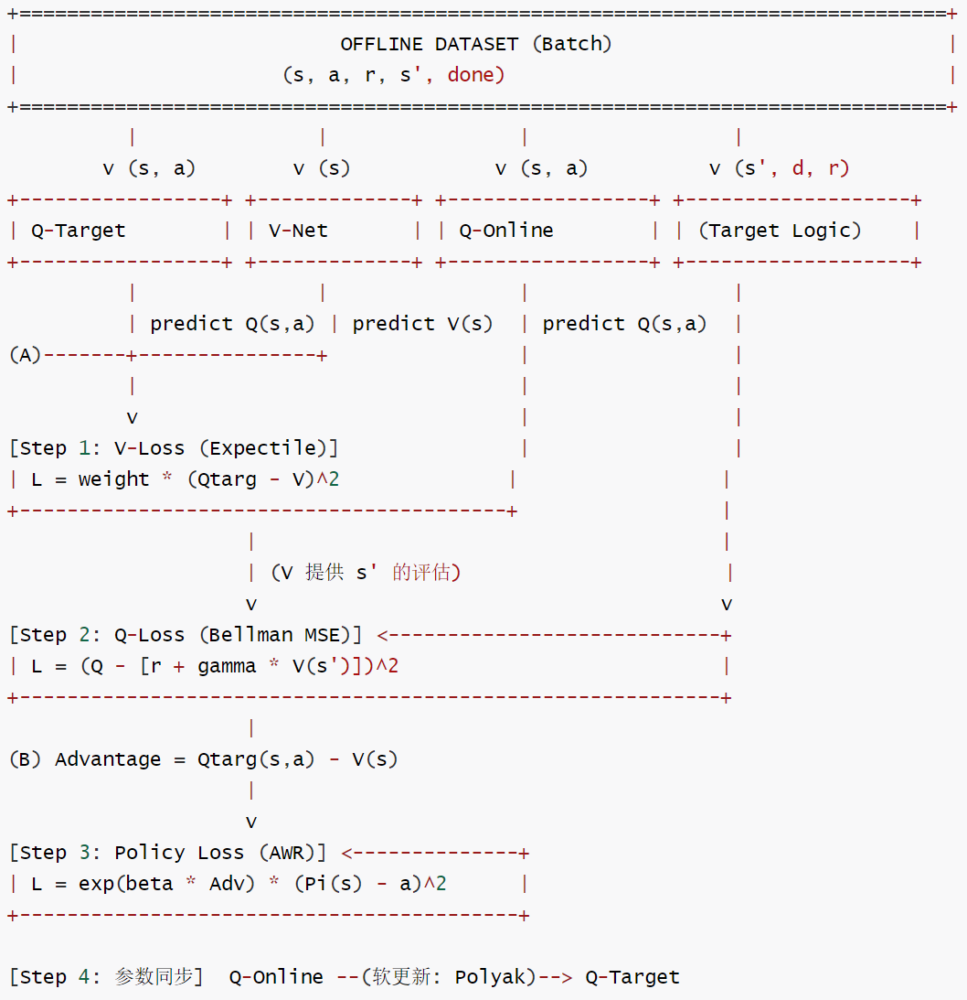

# 【机器人 / 强化学习】IQL（Implicit Q-Learning）：离线强化学习的隐式价值提取

# 【机器人 / 强化学习】IQL（Implicit Q-Learning）：离线强化学习的隐式价值提取

目录

* [【机器人 / 强化学习】IQL（Implicit Q-Learning）：离线强化学习的隐式价值提取](#机器人--强化学习iqlimplicit-q-learning离线强化学习的隐式价值提取)
  + [0x00 概要](#0x00-概要)
  + [1.1 核心哲学：在已知数据中"沙里淘金"](#11-核心哲学在已知数据中沙里淘金)
    - [1.1 离线学习的"贪婪陷阱"](#11-离线学习的贪婪陷阱)
    - [1.2 IQL 的思路：不猜、不看、只提取](#12-iql-的思路不猜不看只提取)
    - [1.3 优势加权行为克隆](#13-优势加权行为克隆)
    - [1.4 非对称损失：Expectile 回归](#14-非对称损失expectile-回归)
    - [1.5 离线→在线微调流程](#15-离线在线微调流程)
  + [0x02 网络架构](#0x02-网络架构)
    - [2.1 功能角色：选秀节目的评审团](#21-功能角色选秀节目的评审团)
    - [2.2 工程实现：四网络闭环](#22-工程实现四网络闭环)
    - [2.3 V 网络：梦想上限评估师](#23-v-网络梦想上限评估师)
    - [2.4 Q 网络：现实打分员](#24-q-网络现实打分员)
      * [双 Q 网络：对抗过估计](#双-q-网络对抗过估计)
      * [保守 vs 乐观：两种力量的平衡](#保守-vs-乐观两种力量的平衡)
    - [2.5 Actor 网络：优等生模仿者](#25-actor-网络优等生模仿者)
  + [0x03 核心参数解析](#0x03-核心参数解析)
    - [3.1 \(\tau\)（非对称系数）：野心与稳健的权衡](#31-非对称系数野心与稳健的权衡)
    - [3.2 \(\gamma\)（折扣因子）：耐心的度量](#32-折扣因子耐心的度量)
    - [3.3 \(\beta\)（逆温度）：敏感度的调节](#33-逆温度敏感度的调节)
  + [0x04 核心训练循环](#0x04-核心训练循环)
    - [4.1 单步迭代概览](#41-单步迭代概览)
    - [4.2 Step 1：更新 V 网络——设定"优秀"的标准](#42-step-1更新-v-网络设定优秀的标准)
    - [4.3 Step 2：更新 Q 网络——跨越时空的价值传递](#43-step-2更新-q-网络跨越时空的价值传递)
    - [4.4 Step 3：更新 Policy 网络——向优等生看齐](#44-step-3更新-policy-网络向优等生看齐)
    - [4.5 组件交互全景](#45-组件交互全景)
    - [4.6 核心代码](#46-核心代码)
  + [0x05 IQL 价值流动的双向性](#0x05-iql-价值流动的双向性)
    - [5.1 循环分工](#51-循环分工)
    - [5.2 为什么不让 Q 直接追赶 Q？](#52-为什么不让-q-直接追赶-q)
    - [5.3 依赖闭环：四网络的信息流](#53-依赖闭环四网络的信息流)
  + [0x06 策略网络的两种实现](#0x06-策略网络的两种实现)
    - [6.1 DeterministicPolicy（确定性策略）](#61-deterministicpolicy确定性策略)
    - [6.2 GaussianPolicy（高斯策略）](#62-gaussianpolicy高斯策略)
  + [0x07 核心优势总结](#0x07-核心优势总结)
    - [通俗总结：迷宫游戏](#通俗总结迷宫游戏)
  + [0xFF 参考](#0xff-参考)

## 0x00 概要

要理解 DIVL，必须先理解 IQL。IQL 是离线强化学习中的里程碑式工作，其精妙之处在于"只用数据集里已有的数据，却能推断出比数据集更好的策略"，全程不需要对未见过的动作进行采样。SERL/LWD 的训练通常从加载人类演示数据开始——如何从离线数据平滑地切换到在线实时学习，正是 IQL 解决的问题。

## 1.1 核心哲学：在已知数据中"沙里淘金"

### 1.1 离线学习的"贪婪陷阱"

我们先来思考一下离线 RL 面临的根本困境。

假设我们有一堆别人开车的录像（数据集 D），目标是学出一个最强车神。如果使用传统 Q-Learning，核心公式是：

\[Q(s,a) \leftarrow r + \gamma \max\_{a'} Q(s', a')
\]

Q-Learning 的本质是"跨越时空的价值传递"：每个状态-动作对的 Q 值记录了这个位置往这个方向走未来总共能赚多少钱；终点的高额奖金会像水流一样，沿着路径倒灌回起点，最终让机器人学会"抄近道"。

但问题在于 \(\max\_{a'} Q(s', a')\) 这个操作。在离线数据集中，如果网络误给一个没见过的动作（OOD）打了高分，这个"谎言"会通过 Bellman 方程不断自举（Bootstrapping），导致价值崩盘。对于仿真环境，这也许只是训练不稳定；对于真机机器人，这可能导致机械臂撞到桌子、夹爪打坏物体，甚至损坏硬件。

### 1.2 IQL 的思路：不猜、不看、只提取

IQL 的解决思路非常克制：**不去猜没见过的动作，只在 Replay Buffer 已经发生过的动作里寻找高价值信号，绝不往外看一眼。**

这就是"Implicit"（隐式）的核心含义：它不显式执行 \(\max\_a Q(s,a)\)，而是通过一个状态价值函数 \(V(s)\) 来隐式表达"在这个状态下，数据集中较好动作能达到什么水平"。

在同一个状态 \(s\) 下，数据集中可能有多个不同的动作尝试——好的（50 分），烂的（10 分）。模仿学习（BC）会学习它们的平均行为（30 分）；而 IQL 的目标是：**即使不亲自去尝试，也要通过观察发现"原来在这个位置，最高能拿到 50 分"，从而把策略固定在那个 50 分的行为上。**

### 1.3 优势加权行为克隆

IQL 训练策略网络 \(\pi(a \mid s)\) 的方式是给模仿损失加一个"权重"：

* 普通 BC：\(\text{Loss} = (\pi(s) - a\_{\text{dataset}})^2\)，不管好坏，通通都学
* IQL：\(\text{Loss} = w \cdot (\pi(s) - a\_{\text{dataset}})^2\)，只学好的

这就是**优势加权行为克隆**（Advantage-Weighted Regression, AWR）。但仅仅加权还不够——IQL 引入了一个更精巧的数学工具来定义"什么是好的标准"。

### 1.4 非对称损失：Expectile 回归

IQL 最精华的数学技巧在于 V 函数的训练方式。假设我们要估算一个状态的价值 \(V(s)\)，数据集中有人拿了 10 分，有人拿了 50 分。定义误差 \(\text{error} = Q(s,a) - V(s)\)：

* **当 error < 0（数据比我猜的低）**：我认为这是"失误"或"平庸的表现"，不怎么在乎它，给很小的权重
* **当 error > 0（数据比我猜的高）**：我认为这才是"财富"和"潜力"，给巨大的权重

这引出一个反直觉的问题：**如果你想追逐上限，对负误差应该重罚还是轻罚？**

我们来推演一下。你的目标是成为全校第一名，估值代表你对"第一名"水平的认知（95 分）。现在看到一张考了 10 分的卷子（低分数据），误差 = 10 - 95 = -85。如果重罚这个负误差，优化器会感到巨大压力，唯一办法就是让估值降到 30 分——这恰恰违背了"追逐上限"的目标。

所以正确的做法是：**轻罚负误差（差生只是意外），重罚正误差（好苗子必须追上）。**

数学实现如下，其中 \(\tau\)（Tau）是关键参数，通常设为 0.7~0.9：

```
L_V = 
    if Q - V < 0: (1-τ) |Q - V|²    # 轻罚
    if Q - V > 0:  τ   |Q - V|²    # 重罚
```

设 \(\tau = 0.9\)：

* 当 \(Q > V\) 时（好数据），误差乘以 0.9——严厉的教练看到好苗子："你怎么离冠军还差这么一点？重罚！"V 必须大幅往上提
* 当 \(Q < V\) 时（坏数据），误差乘以 0.1——教练看到差生，摆摆手："这只是个意外，我不在乎。"V 只会稍微往下掉

### 1.5 离线→在线微调流程

IQL 天然支持从离线训练平滑过渡到在线微调：

```
Phase 1: Offline Pretraining
    Replay Buffer → sample batch → trainer.train (仅使用离线数据)
    
    ↓ 检查点继承

Phase 2: Online Fine-tuning
    Actor π → env.step(a) → (s', r, done)
        ↑                      ↓
    sample + trainer.train    add_transition (新经验入 buffer)
```

关键点：**离线阶段和在线阶段使用完全相同的训练逻辑**。在线阶段只需将新采样经验加入 Replay Buffer，继续执行同样的 V→Q→Policy 三步训练。不需要切换损失函数，不需要预热，体现了 IQL 设计的统一性。

## 0x02 网络架构

IQL 的核心由多个神经网络构成。从功能角色的角度看，可以归纳为三个网络；从工程实现的角度看，实际存在四个网络。

### 2.1 功能角色：选秀节目的评审团

| 网络 | 角色 | 问题 | 方法 |
| --- | --- | --- | --- |
| V 函数 | 梦想上限评估师 | 在当前状态下，表现最好的那批选手能达到什么水平？ | Expectile 回归挑高分 |
| Q 函数 | 现实打分员 | 对这个具体的选手，他的真实实力是多少？ | Bellman 方程传递未来信息 |
| Actor 策略 | 优等生模仿者 | 我该怎么做，才能成为最像高分的那个？ | Advantage 加权克隆 |

### 2.2 工程实现：四网络闭环

在代码层面，IQL 实际上是**四个网络**——Q 有一个"影子分身" Target Q：

1. **Target Q** 定义了"好"的稳定标准
2. **V** 把这个标准平滑化并传递给 Q
3. **Online Q** 根据奖励进行实时更新
4. **Policy** 在 Online Q 和 V 的指导下提取最终的动作

| 网络名称 | 缩写 | 输入 | 输出 | 核心任务 | 更新频率 |
| --- | --- | --- | --- | --- | --- |
| Online Q | Q | \((s, a)\) | \(Q(s, a)\) | 评估具体 (状态, 动作) 的好坏 | 每个 Batch 实时更新 |
| Target Q | \(Q\_{\text{targ}}\) | \((s, a)\) | \(Q(s, a)\) | 提供稳定的训练目标，计算 V 时使用 | 随 Online Q 软更新 |
| Value | V | \(s\) | \(V(s)\) | 评估状态的整体水平，估计数据集支持集中的高价值基准 | 每个 Batch 实时更新 |
| Policy | \(\pi\) | \(s\) | \(\pi(a \mid s)\) | 给出具体动作指令（最终部署用） | 每个 Batch 实时更新 |

这种"四重奏"的结构，让 IQL 既能像监督学习一样稳定地在离线数据上训练，又能像强化学习一样通过价值评估来提取最优策略。

### 2.3 V 网络：梦想上限评估师

V 函数的职责用一个词概括：**向上看**。给定一个状态 \(s\)，V 回答"在这个处境下，数据集中表现最好的那批动作大概能拿到什么水平的分？"

在 IQL 中，\(V(s)\) 充当了**基准线**。通过比较 \(Q(s, a)\) 和 \(V(s)\)，我们可以知道某个动作 \(a\) 是否比平均水平更好。同时，在更新 Q 网络时直接用 \(V(s')\) 代表下一个状态的期望回报——这彻底避免了对 Actor 网络的采样查询，是离线 RL 防 OOD 动作的关键。

V 的损失函数是非对称 L2 损失（Expectile 回归）：

\[\mathcal{L}\_V = \begin{cases} \tau (Q - V)^2, & \text{if } Q > V \\ (1 - \tau) (Q - V)^2, & \text{if } Q \leq V \end{cases}
\]

直观上讲，V 是一个**乐观的提取员**：它不看平均水平，只盯着上限看。

需要指出的是，V 网络是**针对具体任务的"专家网络"**，不是通用的普世网络。\(V(s)\) 的输出是一个标量——在自动驾驶中代表安全行驶公里数，在下棋中代表获胜概率，在交易中代表预期收益。因为状态 \(s\) 不同、奖励 \(r\) 定义不同，V 的内容无法通用，但训练 V 的"偏心公式"（IQL 算法）是普世的。

### 2.4 Q 网络：现实打分员

Q 函数的职责用一个词概括：**向后传**。与 V 只看 \(s\) 不同，Q 评价具体的 \((s, a)\) 对——"在当前状态下执行这个具体动作后，未来能拿到多少回报"。

Q 的更新遵循 Bellman 方程：

\[Q(s, a) \leftarrow r + \gamma V(s')
\]

这里的关键在于：Q 的更新**不使用 \(\max\_a Q(s', a)\)**（避免 OOD 动作），而是使用 V 网络的输出作为未来价值估计。因为 V 是从数据集中挑出的高分基准，这个目标天然在数据分布之内。

#### 双 Q 网络：对抗过估计

实际实现中，IQL 使用两个 Q 网络（\(q\_1\) 和 \(q\_2\)）以及各自的 Target 版本。原因是经典 Q-learning 中的 \(\max\) 操作存在数学上的风险：

\[E[\max(X\_1, X\_2, \dots)] \geq \max(E[X\_1], E[X\_2], \dots)
\]

即使噪声是均值为 0 的随机波动，取最大值也会自动把期望往上拉，导致 Q 值越跑越高。双 Q 网络的解决思路很直观：

**场景 A：只有一个评估师。** 如果他今天心情好，把一辆破车高估了 1 万块，你花冤枉钱买了一堆垃圾。

**场景 B：有两个评估师，取最小值。** 评估师 A 说值 10 万，B 说值 8 万。你保守主义，只信 8 万的。只有当两个评估师**同时**高估时，你才会被骗。

```
# 更新 V 网络时，我们取两个 Q 的最小值
with torch.no_grad():
    q1_val = self.q1_target(torch.cat([s, a], dim=-1))
    q2_val = self.q2_target(torch.cat([s, a], dim=-1))
    # 精华在这里：取最小值，消除过估计
    q_val = torch.min(q1_val, q2_val)

# 计算 V 的 Loss
v_val = self.v(s)
v_loss = expectile_loss(q_val - v_val, tau)
```

#### 保守 vs 乐观：两种力量的平衡

这里有一个微妙的问题：之前说 IQL 的核心是乐观（\(\tau=0.9\)，提取上限），现在又引入双 Q 网络的保守（取 min）——矛盾吗？

如果只有"乐观"，模型会发疯（过估计崩溃）；如果只有"保守"，模型会变怂（学不到最优解）。IQL 的精妙之处在于**在保守的评估中寻找乐观的上限**——既看最坏的可能（取 min），又在现有的机会里挑最好的（Expectile 回归）。

### 2.5 Actor 网络：优等生模仿者

V 和 Q 是"裁判"：\(V(s)\) 告诉你"这个地方不错"，\(Q(s,a)\) 告诉你"这个动作挺好"。但它们只是数字，不能告诉你"具体该怎么动"。

在连续动作空间中，即便完全知道 Q 网络的值，要找出使 Q 最大的动作 \(a = \arg\max\_a Q(s,a)\)，每一步都需要运行复杂的优化算法（如梯度上升）——这对实时控制不可接受。

Actor 的角色是充当**缓存器**：它将 Q 和 V 的"评估智慧"提前吸收，固化成一个从状态到动作的直接映射 \(s \rightarrow a\)。机器人运行时，点一下火就能出动作。

Actor 的更新策略是优势加权行为克隆：

1. 计算 Advantage：\(A(s,a) = Q(s,a) - V(s)\)
2. Advantage 为正 → 重点模仿；为负 → 降低权重
3. 加权系数 \(e^{A/\beta}\)，\(Q \approx V\) 的优等生权重极大，\(Q < V\) 的差生权重趋向于 0

| 网络 | 角色 | 视角 | 输出 | 哲学 |
| --- | --- | --- | --- | --- |
| Q | 客观记录 | 微观（每个动作） | \(Q(s,a)\) | 诚实记录每一份成绩单 |
| V | 主观提取 | 宏观（每个状态） | \(V(s)\) | 只盯上限，不看平均 |
| \(\pi\) | 最终模仿 | 动作（具体操作） | \(\pi(a \mid s)\) | 谁分高我模仿谁 |

## 0x03 核心参数解析

IQL 的三个核心参数定义了机器人的"性格"：

| 参数 | 名称 | 作用 | 调大 | 调小 |
| --- | --- | --- | --- | --- |
| \(\tau\) | Expectile | 定义"什么是优秀"的标准 | 激进追高 | 稳健保守 |
| \(\gamma\) | 折扣因子 | 对未来的耐心程度 | 高瞻远瞩 | 短视务实 |
| \(\beta\) | 逆温度 | 对 Advantage 的敏感度 | 偏激执着 | 平庸平均 |

### 3.1 \(\tau\)（非对称系数）：野心与稳健的权衡

* **\(\tau = 0.5\)**：Loss 退化为 MSE，\(V(s)\) 收敛到所有 \(Q(s,a)\) 的算术平均值。机器人变成"平庸之辈"。
* **\(\tau \in (0.7, 0.9)\)**（推荐）：迫使 V 向上拟合"潜力上限"。既能提取"优等生"，又能容忍噪声。
* **\(\tau \to 1.0\)**：\(V(s)\) 拼命追赶数据集最高分，但对噪声敏感。

调参哲学：数据质量决定 \(\tau\)。规整的数据集（如 halfcheetah-medium）中 \(\tau=0.7\) 就够用；极其困难的任务可能需要 \(\tau=0.9\) 甚至 0.95 来挖掘罕见成功信号；安全第一的应用（自动驾驶、手术机器人）应调小 \(\tau\)。

高阶思路——**动态 \(\tau\)**：基于不确定性自适应。在熟悉场景失败时增大惩罚（环境可能变了），在陌生场景失败时轻罚（正常试错成本）。

### 3.2 \(\gamma\)（折扣因子）：耐心的度量

\(\gamma\) 的本质是"对未来的耐心"。在 RL 中，\(r + \gamma V\_{\text{next}}\) 意味着当前步的奖励是"真钱"，下一步要打个折。

如果 \(\gamma = 1\) 且任务没有明确终点，\(V\) 会趋于无穷大，导致两个致命问题：分不清快慢（绕地球一圈和现在拿到金币价值一样），以及梯度爆炸。

需要注意的是，\(\gamma < 1\) 只是目标值有界的必要条件，但不是充分条件——即便 \(\gamma = 0.99\)，训练仍可能因学习率过大、\(\tau\) 设得太激进而崩溃。

### 3.3 \(\beta\)（逆温度）：敏感度的调节

\(\beta\) 是 IQL 中最敏感的参数，控制着 Policy 对 Advantage 的反应程度：

* **\(\beta\) 太大**：权重趋近 1，退化成普通 BC（好坏通吃）
* **\(\beta\) 太小**：权重极度极端，只盯最高分，过拟合

微调方向：动作杂乱无章时调低 \(\beta\)；半天不动弹或动作软绵绵时调高 \(\beta\)。

## 0x04 核心训练循环

### 4.1 单步迭代概览

在每一个训练迭代中，我们从数据集随机抽出一批样本，严格按顺序执行三个更新步骤。理解这三步的顺序和依赖关系，是理解 IQL 如何从离线数据中"隐式"提取最优策略的关键。

```
def train(self, batch: TensorBatch) -> Dict[str, float]:
    self.total_it += 1
    observations, actions, rewards, next_observations, dones = batch

    with torch.no_grad():
        next_v = self.vf(next_observations)  # Step 0: 计算 next_v

    adv = self._update_v(observations, actions)                    # Step 1: 更新 V
    self._update_q(next_v, observations, actions, rewards, dones)  # Step 2: 更新 Q
    self._update_policy(adv, observations, actions)                # Step 3: 更新 Policy
```

### 4.2 Step 1：更新 V 网络——设定"优秀"的标准

V 网络的训练是 IQL 的灵魂。它的核心损失函数：

\[V\text{-Loss} = \mathbb{E}\_{(s,a) \sim \mathcal{D}} \left[ L^\tau\_2(Q(s,a) - V(s)) \right], \quad L^\tau\_2(u) = |\tau - \mathbb{1}(u < 0)| \cdot u^2
\]

```
v_error = q_val - v_val
v_weight = torch.where(v_error > 0, self.tau, 1 - self.tau)
v_loss = (v_weight * (v_error**2)).mean()
```

**Expectile 回归的直觉**：在标准 MSE 下，\(V(s)\) 收敛到 \(Q(s,a)\) 的均值。但 IQL 通过偏心设计，让 \(V(s)\) 自动浮到 Q 值分布的高分区：

* 如果 \(Q > V\)（实际比预测高）：乘以 \(\tau\)，重罚逼迫 V 向上追赶
* 如果 \(Q \leq V\)（实际比预测低）：乘以 \(1-\tau\)，轻罚不被低分拉低

如果 V-Loss 很大，通常意味着 V 网络正在痛苦地从一堆垃圾数据中寻找那一点点闪光点——数据质量越低，\(\tau\) 需设得越保守。

### 4.3 Step 2：更新 Q 网络——跨越时空的价值传递

传统 Q-learning 的更新公式存在致命问题：

\[Q(s,a) \leftarrow r + \gamma \max\_{a'} Q(s', a')
\]

\(\max\_{a'}\) 很可能选出一个数据集没见过但 Q 函数误以为很高的动作——OOD 过度估计。

IQL 的改进极为巧妙：**用 \(V(s')\) 替代 \(\max\_{a'} Q(s', a')\)**。

\[Q(s,a) \leftarrow r + \gamma V(s')
\]

\(V(s')\) 通过 Expectile 回归从数据集统计出来，天然在数据分布之内。更新 Q 时不需要查询 \(s'\) 处的任何具体动作——这就是"Implicit"的核心含义：**不需要在 \(s'\) 上显式搜索动作，也能完成价值传递**。

IQL 使用 Clipped Double Q 技术进一步抑制乐观偏见：

```
q_target = r + self.gamma * (1 - d) * next_v
q1_pred, q2_pred = self.qf(torch.cat([s, a], dim=-1))
q_loss = F.mse_loss(q1_pred, q_target) + F.mse_loss(q2_pred, q_target)
soft_update(self.q_target, self.qf, self.tau)
```

Q 网络更新的意义可以分解为三层：

1. **Q 是 V 的数据源**——V 从 Q 的价值分布中提取"优秀"的标准
2. **Q 是跨越时间的信使**——通过 Bellman 方程把未来的 \(V(s')\) 传回现在的 \(Q(s,a)\)
3. **Q 是 Advantage 的原料**——Policy 的加权权重源于 \(Q - V\)

### 4.4 Step 3：更新 Policy 网络——向优等生看齐

在离线 RL 中，我们绝不敢让策略去"探索"没见过的动作——一旦超出数据集分布，Q 网络会乱猜，给出虚假高分。IQL 的做法是：**只准模仿数据集里已有的动作**。

但盲目模仿所有动作也不行——数据集中有大量平庸甚至失败的动作。所以引入优势加权行为克隆：

```
# 1. 计算优势
adv = q_val - v_val
# 2. 计算权重
weights = torch.exp(adv / beta).clamp(max=100)
# 3. 加权行为克隆
loss_pi = (weights * (policy_network(s) - a)**2).mean()
```

Advantage \(A(s,a) = Q(s,a) - V(s)\) 是筛选的标尺——\(A > 0\) 重点模仿，\(A < 0\) 降低权重。权重 \(w = e^{A/\beta}\) 就像一个"精华过滤器"。

IQL 的 Actor 更新**不直接对 Q 求导**，只是一个纯粹的加权监督学习——这使它极其稳定。

### 4.5 组件交互全景



四种损失函数的分工：

| 损失 | 输入 | 逻辑 | 角色 |
| --- | --- | --- | --- |
| V-Loss | Target Q 评估值 + V 预测值 | 非对称回归学习高性能水平 | 定义"优秀"的标准 |
| Q-Loss | \(r + \gamma V(s')\) + Q 预测 | Bellman MSE，不依赖 Policy | 跨越时空的价值传递 |
| Policy-Loss | Advantage \(Q - V\) | 加权行为克隆 | 从数据中提纯精华 |
| 软更新 | Online Q → Target Q | Polyak 平均 | 提供稳定参考值 |

### 4.6 核心代码

伪代码实现如下：

```
# 1. 更新 V 网络（提取上限）
# 目标: 让 V 靠近 Q，但当 Q > V 时惩罚更重
# 从数据集采样 (s, a, r, s')
v_error = q_target - v_pred # 使用 Target_Q 计算当前动作的评级 q = Target_Q(s, a)
# loss_v = expectile_loss(q - V(s), tau)
v_loss = torch.where(v_error > 0, tau * v_error**2, (1 - tau) * v_error**2).mean()

# 2. 更新 Q 网络（价值传递）
# 目标: Q 要等于 这里的奖励 + 下一步的 V（而不是下个动作的 Q!）
q_target = reward + gamma * v_next_target
q_loss = ((q_pred - q_target)**2).mean()

# 3. 更新 Policy 网络（优势加权模仿）
# 目标: 只学那些 Q > V 的动作
advantage = q_pred - v_pred # adv = q - V(s)
weights = torch.exp(advantage / beta).clamp(max=100)  # beta 是温度参数
policy_loss = (weights * (policy_pred - actions_dataset)**2).mean()
```

具体流程图如下：

```
离线数据集 D4RL {(s,a,r,s',done)}
    ↓ load_d4rl_dataset
Replay Buffer
    ↓ sample batch
单次训练迭代 train()
    ├ Step 0: 计算 next_v (无梯度)
    │          next_v = V(s')
    │
    ├ Step 1: 更新 V 函数（IQL核心创新）------> self._update_v
    │          target_Q = Q_target(s, a_data)  ← 仅用数据集中的动作！
    │          v = V(s)
    │          adv = target_Q - v
    │          v_loss = asymmetric_l2_loss(adv, τ)
    │             非对称L2损失:
    │               L(u) = |τ − 1(u<0)| · u²
    │               τ=0.7 → V(s) 跟踪 Q 的高分位数
    │             效果: V(s) ≈ Q(s, π*(s))
    │
    ├          adv = Q(s,a) − V(s)
    │
    ├ Step 2: 更新 Q 函数 -----------------> self._update_q
    │          target = r + γ(1-done) · V(s')  ← 用V(s')而非Q(s',a')!
    │          q1, q2 = Q(s, a_data)
    │          q_loss = MSE(q1, target) + MSE(q2, target)
    │          关键: Bellman更新用V(s')代替max Q
    │               → 避免在s'上评估OOD动作
    │               → 这就是 "Implicit" 的含义
    │          soft_update(Q_target, Q, τ_soft)
    │
    └ Step 3: 更新 Actor 策略 -------> self._update_policy
              exp_adv = exp(β · adv).clamp(max=100)
              bc_loss = -log π(a_data|s)    (高斯策略)
              policy_loss = mean(exp_adv · bc_loss)
              加权行为克隆:
                  β大 → 侧重高优势动作（更激进）
                  β小 → 趋近纯BC（更保守）
                  β→0: 纯行为克隆
                  β→∞: 最大化Q值
```

## 0x05 IQL 价值流动的双向性

### 5.1 循环分工

IQL 中 V 和 Q 相互追赶，但分工完全不同——这是一个"记录与提炼"的循环：

```
V 向上压榨 Q:  V 从当前的 Q 分布里压榨出"最高分期望"
      ↑                    │
      │                    ↓
Q 把未来的 V 搬回现在:  Q(s,a) ≈ r + γ V(s')
```

**V 追赶 Q（当前状态的"提炼"）：** 在第一步更新 V 时，Q 是"数据源"。V 看着数据集里已有的 \(Q(s,a)\)，通过非对称 Loss 只追赶高分部分。就像一个教练（V）观察选手的表现（Q），只记录最好的瞬间作为"优秀标准"。

**Q 追赶 V（跨越时空的"传递"）：** 在第二步更新 Q 时，V 是"目标源"。Q 参考下一个状态的 \(V(s')\) 来更新当前动作的价值。就像修路工（Q）在看前面的路标（未来的 V）告诉他前面最高能赚多少钱，然后把这个价值传回现在。

### 5.2 为什么不让 Q 直接追赶 Q？

如果 Q 追赶 \(Q\_{\text{next}}\)，必须决定 \(Q\_{\text{next}}\) 对应哪个动作——通常用 \(\max\)。一旦选了一个数据集里没有的动作，谎言就产生了。

IQL 的天才之处：**它让 Q 去追赶 \(V\_{\text{next}}\)**。\(V\_{\text{next}}\) 通过 Expectile 回归从数据集统计"压榨"出来，不依赖于任何具体 \(a\_{\text{next}}\)，从而隐式避开一切没见过的动作。

### 5.3 依赖闭环：四网络的信息流

```
Target Q ──→ V ──→ Q ──→ Q - V ──→ Actor
   ↑                                  │
   └───────── 软更新 (EMA) ────────────┘
```

1. **Target Q 定义"好"的标准**：从数据中给定的 \((s,a)\) 对，Target Q 输出稳定的价值评估。因为使用 Target 网络，这个标准不会因主 Q 震荡而剧烈变化。
2. **V 提取上限**：V 从 Target Q 的输出中通过 Expectile 回归提取高分基准。V 的更新只是**局部回归**——只看当前状态的 Q 值分布。
3. **Q 传递未来**：Online Q 通过 \(y = r + \gamma V(s')\) 将未来潜力值传回现在。Q 的更新涉及**时间上的递归**——当前的 Q 追逐未来的 V。如果拿掉 Q 的更新，评价变得短视。
4. **Actor 提取策略**：通过 \(Q - V\) 筛选出数据集中的"惊艳瞬间"，Actor 通过加权克隆固化为行为策略。

## 0x06 策略网络的两种实现

IQL 在最终策略提取阶段可以选择不同的数学表达形式。

### 6.1 DeterministicPolicy（确定性策略）

直接输出具体数值 \(a = \pi(s)\)：

\[L = \mathbb{E}\_{(s,a) \sim \mathcal{D}} \left[ e^{\beta \cdot \text{adv}} \cdot \|\pi(s) - a\|^2 \right]
\]

简单直接、计算量小，但只做点估计。如果数据集在某个状态下有多个同样好的动作（多模态分布），可能输出"四不像"的平均值。

### 6.2 GaussianPolicy（高斯策略）

输出均值和标准差 \(\pi(a \mid s) = \mathcal{N}(\mu(s), \sigma(s))\)：

\[L = \mathbb{E}\_{(s,a) \sim \mathcal{D}} \left[ e^{\beta \cdot \text{adv}} \cdot (-\log \pi(a \mid s)) \right]
\]

不仅学"该做什么动作"，还学动作的"不确定性"。通过最大化对数似然，更好地拟合数据集中动作的统计分布，在 D4RL 等标准评测中通常更稳健。

| 特性 | DeterministicPolicy | GaussianPolicy |
| --- | --- | --- |
| 输出内容 | 动作值 \(a\) | 均值 \(\mu\) 和标准差 \(\sigma\) |
| 数学本质 | 优势加权 MSE（L2 回归） | 优势加权最大似然估计（MLE） |
| 代码表现 | `(pi_a - a)**2` | `dist.log_prob(a)` |
| 适用场景 | 简单控制、计算资源有限 | 复杂连续控制、噪声数据 |
| 推荐程度 | 特定任务使用 | 主流通用做法 |

## 0x07 核心优势总结

回顾 IQL 的完整机制，用对照表概括：

| 设计 | 传统方法 | IQL 方法 | 好处 |
| --- | --- | --- | --- |
| Q 函数更新 | \(r + \gamma \max\_a Q(s', a)\) | \(r + \gamma V(s')\) | 避免 OOD 动作的 Q 过估计 |
| V 函数训练 | 无独立 V 函数 | 非对称 L2 损失回归 \(Q(s,a)\) | 隐式提取最优策略的价值 |
| 策略提取 | \(\arg\max\_a Q(s,a)\) | 加权 BC：\(\exp(\beta \cdot \text{adv}) \cdot (-\log \pi)\) | 避免在连续空间做 \(\arg\max\) |

三大核心优势：

1. **数值稳定**：不显式查询 OOD 动作，从根本上减少 Q 过估计风险
2. **处理混合数据**：只要数据中有少量高质量轨迹，就能通过高 Expectile 提取出来——不挑食
3. **离在线统一**：在线阶段只需将新经验加入 Buffer，继续同样的训练逻辑，无需切换算法

### 通俗总结：迷宫游戏

想象一个特别难的走迷宫游戏。你手里有一堆别人玩这个游戏的录像，玩家水平参差不齐——有的在撞墙，有的偶尔能捡到金币。

IQL 是这样帮你成为高手的：

**第一步：当"超级侦探"（寻找潜力）。** 普通方法把所有录像看一遍，学个平均分。IQL 看着每个路口（状态），想："最厉害的那个玩家在这里能拿 100 分，那这个路口的潜力就是 100 分！"不理会撞墙的录像，只盯着最好的瞬间——**寻找潜力上限**。

**第二步：绝不"瞎尝试"（安全第一）。** 其他方法喜欢乱猜："翻个跟头会不会加分？"结果往往猜错。IQL 规定：**绝不去猜录像里没出现过的动作**，只看实际发生过的动作——**稳扎稳打**。

**第三步：挑好动作模仿（取精华，去糟粕）。** 一个玩家向左走拿到高分，记下来："这是绝招！"一个玩家向右走掉坑里，画大叉："不学。"——**优势模仿**。

IQL 的强大之处在于：**不挑食**（90% 录像都是笨蛋，也能找出剩下 10% 的聪明时刻）；**不冒险**（不会弄坏真实机器人）；**学得快**（直接看最好的一面，不需要自己摔跟头）。

---

> **一句话总结**：IQL 是在别人的"错题本"和"烂作业"里，靠着敏锐的眼光，硬生生地拼凑出了一套"满分答案"。它证明了即使不进行在线探索，也可以通过巧妙的统计方法和网络设计，从静态数据集中提取出超越任何单个数据贡献者的"上帝视角"。

## 0xFF 参考

[刚刚，罗剑岚世界模型发布，惊喜的发现方向真香又不卷](https://mp.weixin.qq.com/s/cOGxPbURZv21eKaOSwQEGg)
