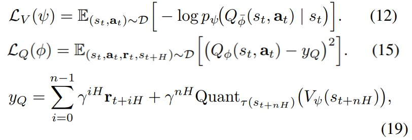
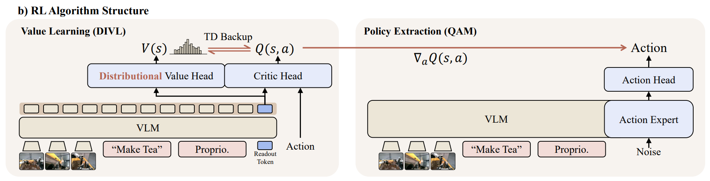
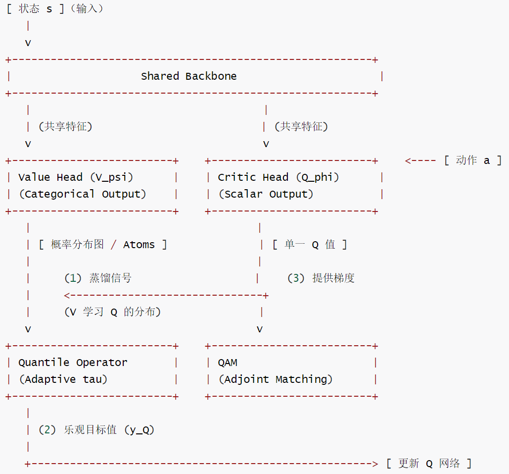

# 【机器人 / 强化学习】DIVL：分布隐式价值学习

# 【机器人 / 强化学习】DIVL：分布隐式价值学习

目录

* [【机器人 / 强化学习】DIVL：分布隐式价值学习](#机器人--强化学习divl分布隐式价值学习)
  + [0x00 概要](#0x00-概要)
  + [0x01 从 IQL 到 DIVL：为什么标量不够用？](#0x01-从-iql-到-divl为什么标量不够用)
    - [1.1 IQL 的遗产：在已知数据中"沙里淘金"](#11-iql-的遗产在已知数据中沙里淘金)
    - [1.2 为什么平均数会骗人？](#12-为什么平均数会骗人)
    - [1.3 从"给平均分"到"看清各种可能性"](#13-从给平均分到看清各种可能性)
  + [0x02 DIVL 的核心设计：两种数学手段的融合](#0x02-divl-的核心设计两种数学手段的融合)
    - [2.1 "Implicit"：仍然不瞎猜 OOD 动作](#21-implicit仍然不瞎猜-ood-动作)
    - [2.2 "Distributional"：从单一数值到概率分布](#22-distributional从单一数值到概率分布)
    - [2.3 两者结合的效果](#23-两者结合的效果)
  + [0x03 网络架构](#0x03-网络架构)
    - [3.1 双头结构](#31-双头结构)
      * [Value Head（\(V\_\psi\)）：分布蒸馏器](#value-head分布蒸馏器)
      * [Critic Head（\(Q\_\phi\)）：动作评估员](#critic-head动作评估员)
    - [3.2 双头协作：评价闭环](#32-双头协作评价闭环)
    - [3.3 输入体系](#33-输入体系)
    - [3.4 组件关系图](#34-组件关系图)
  + [0x04 Adaptive \(\tau\)：根据不确定性调节乐观程度](#0x04-adaptive-根据不确定性调节乐观程度)
  + [0x05 Reward 信号：DIVL 如何识别"正确"](#0x05-reward-信号divl-如何识别正确)
    - [5.1 明确的最终奖励（Sparse Reward）](#51-明确的最终奖励sparse-reward)
    - [5.2 人类的干预信号（Intervention）](#52-人类的干预信号intervention)
    - [5.3 隐式学习中的"胜率提纯"（Expectile Regression）](#53-隐式学习中的胜率提纯expectile-regression)
  + [0x06 DIVL 与 IQL 的对比](#0x06-divl-与-iql-的对比)
    - [6.1 定位差异](#61-定位差异)
    - [6.2 技术差异](#62-技术差异)
    - [6.3 逻辑链条对比](#63-逻辑链条对比)
    - [6.4 内部信号对比](#64-内部信号对比)
    - [6.5 局限性与前沿](#65-局限性与前沿)
  + [0x07 总结](#0x07-总结)

## 0x00 概要

DIVL（Distributional Implicit Value Learning）是 LWD 框架中承担核心价值评估使命的引擎。如果说 IQL 解决了"如何在已知动作中提取价值上限"的问题，那么 DIVL 则在此基础上迈出了关键一步——它不再输出单一的标量分数，而是输出一个完整的概率分布。这看似简单的变化，在真机部署场景中意味着从"盲人摸象"到"全息透视"的跨越。

## 0x01 从 IQL 到 DIVL：为什么标量不够用？

### 1.1 IQL 的遗产：在已知数据中"沙里淘金"

在深入 DIVL 之前，我们先快速回顾 IQL 的核心思路，因为 DIVL 正是建立在 IQL 的思想基础之上。

IQL 解决了一个根本问题：传统 Q-learning 的 \(\max\_a Q(s', a')\) 在离线设定下会查询未见过的动作（OOD），导致价值崩盘。IQL 的解决方案是引入一个 V 网络，用 \(r + \gamma V(s')\) 替代 \(r + \gamma \max\_a Q(s', a')\)，而 V 通过 Expectile 回归从数据集中提取高价值基准——只盯上限，不看平均。

但 IQL 的 V 输出的是一个标量。这个标量代表"当前状态下表现较好的动作所能达到的价值水平"。它的问题是：**当数据本身存在多峰分布时，一个数字无法描述全貌。**

### 1.2 为什么平均数会骗人？

我们来思考一个具体的场景。传统强化学习的目标是学习一个期望值——裁判看一眼动作，给个平均分：50 分。这个数字代表某种期望回报。但在真实机器人场景中，平均数经常掩盖关键信息。

**信息丢失**：50 分可能代表"稳拿 50 分"，也可能代表"一半几率拿 100 分（大获全胜），一半几率拿 0 分（电机烧毁）"。对机器人而言，这两种情况的风险天差地别。

**多峰分布的本性**：在机器人抓取中，结果只有"成功"或"失败"。期望值给出的"中间分"在物理世界中根本不存在——物体不可能处于"半抓起"状态。平均值把两种截然不同的物理结果压成了一团模糊的中间态。

**风险视而不见**：传统 RL 是"风险中性"的。一个动作如果平均分很高但存在 1% 的概率导致设备报废，这个动作就是毁灭性的。标量价值无法表达这种风险——它只告诉你"还行"，但说不出那 1% 的灾难在哪。

### 1.3 从"给平均分"到"看清各种可能性"

普通 RL 的做法：裁判看一眼机器人的动作，给出一个分数：80 分（这是平均分）。

DIVL 的做法：裁判会说："这个动作，有 80% 的概率得 100 分（成功），但有 20% 的概率得 0 分（摔倒或撞机）。"

为什么要这么做？因为在真机环境里，**风险比平均分更重要**。分布式价值学习让机器人有了"物理常识"——它能避开那些高回报但极度不稳定的"赌博式"动作，同时保留了那些罕见但可复现的高回报模式不被平均掉。

## 0x02 DIVL 的核心设计：两种数学手段的融合

DIVL 将两种高级的数学手段结合在一起：

| 手段 | 来源 | 作用 | 类比 |
| --- | --- | --- | --- |
| **Implicit（隐式）** | IQL | 不采样 OOD 动作，只在已有数据中提取上限 | 只看录像，不瞎猜 |
| **Distributional（分布式）** | C51 / QR-DQN | 捕捉回报分布、感知风险 | 看透风险，不冒险 |

### 2.1 "Implicit"：仍然不瞎猜 OOD 动作

DIVL 名字里有"Implicit"，这和 IQL 一脉相承。它意味着在更新 V 时，不通过显式动作最大化去查询数据集外动作，而是直接从数据集中的动作 \((s,a)\) 出发，利用现成的 \(Q(s,a)\)。

在 LWD 的部署数据中，机器人已经收集了大量真实轨迹，包括成功、失败、恢复和人类干预。DIVL 的做法不是在动作空间里凭空搜索，而是从 Replay Buffer 中已有动作学习价值结构。

这对真机安全非常关键。真实机器人不允许算法为了探索一个可能高分但从未验证过的动作，就直接让机械臂去尝试。**DIVL 坚持 IQL 的底线：只看真实发生过的物理经验，不在没见过的动作上做危险幻想。**

### 2.2 "Distributional"：从单一数值到概率分布

这是 DIVL 最核心的突破——它不再输出一个确切的数字，而是输出一个完整的概率分布。

在给定状态 \(s\) 下，DIVL 的 Value 网络 \(V\_\psi(s)\) 输出的是一个概率向量。假设我们将价值范围 \([-10, 100]\) 分成 101 个格子（Atoms），输出就是 \([p\_0, p\_1, \dots, p\_{100}]\)。经过 softmax 归一化后，它告诉你：在这个状态下，动作价值有 5% 概率是 10 分，有 20% 概率是 50 分，以此类推。

这个分布的深刻意义体现在四个方面：

* **捕获了统计信息**：模型记住的是"在当前状态下，数据里的动作价值如何分布"，而非"在当前状态下，动作价值平均是多少"。它保留的是数据集中关于这个状态的全部模式信息。
* **提供了不确定性度量**：当面对未知状态时，分布会变得平坦（高熵）。这说明模型"不知道自己不知道"——这正是标量价值无法做到的事情。一个自信的状态分布尖锐，一个不确定的状态分布弥散。
* **支持风险调节**：可以根据分布的不确定性选择更保守或更乐观的目标。分布尖锐时放心追高，分布发散时谨慎保守。
* **保留多峰结构**：不会把"偶发的超高回报"和"常见的低回报"压成平均值，而是保留这两种模式各自的形态。

### 2.3 两者结合的效果

隐式学习保证了在杂乱数据面前不学歪（只看录像，不瞎猜）；分布学习保证了在物理世界面前不冒险（看透风险）。这就是 DIVL 名字的由来——**D**istributional **I**mplicit **V**alue **L**earning。

## 0x03 网络架构

### 3.1 双头结构

在 LWD 的架构中，DIVL 对应两个价值头（Head），它们共享同一个骨干网络（Backbone），但承担不同的角色。

#### Value Head（\(V\_\psi\)）：分布蒸馏器

Value Head 是 DIVL 的本体——它不再输出一个数字，而是输出一个分类概率分布。

**核心功能**：提取"高光"基准。V 头使用分位数回归，不学平均分。它的任务是回答："在当前状态下，数据集中的动作通常能拿多少分？"但它给出的不是一个数字，而是一个分布——告诉你在不同得分上的概率。

**训练机制**：V 的 Loss 是 Categorical Cross-Entropy。具体逻辑是：把当前 Q 网络输出的值作为一个"标签"，看这个标签落在了哪个格子（Atom）上，然后让 V 在这个格子上的概率变大。

**输入输出结构**：

```
输入：状态 s（视觉特征 z_s + 语言嵌入 e_l）
注：V 头不看动作，它只评估"处境"的潜力

输出：概率向量 p ∈ R^{|A|}（例如 101 个格子的概率分布）
```

**直觉理解**：V 在"背书"。它背下了这个状态下已知的动作好坏分布。当 Q 网络给出某个 Q 值时，V 会对这个 Q 值的"合理性"进行判断——如果这个 Q 值在数据集中经常出现，V 就会给它高概率；如果是 OOD 的离谱值，V 就会给它低概率。

#### Critic Head（\(Q\_\phi\)）：动作评估员

**核心功能**：评价具体某个动作的好坏，并提供改进方向的梯度。

Critic Head 输入的是"状态 + 具体的动作 a"。它不仅给这个动作打分，更重要的是——它要被拿来求导。QAM（Adjoint Matching）算法会向 Q 头询问："如果我把目前的动作 a 稍微往左挪一点，Q 值会涨吗？"Q 头提供的这个分值梯度就像一股引力，直接拉着 Action Head 里的向量往高分方向走。

**训练机制**：Q 的 Loss 是 Mean Squared Error，但真正的关键在于目标值的构造。Q 的目标值 \(y\_Q\) 是通过从 \(V\_\psi(s')\) 分布中提取一个分位数（Quantile）得到的。这里 \(\tau\) 就是"乐观滤镜"强度的调节旋钮——\(\tau\) 接近 1 时取高分位数（乐观），\(\tau\) 较低时取中低分位数（保守）。

**与传统 Q-learning 的区别**：

| 维度 | 传统 Q-learning | DIVL 的 Q-learning |
| --- | --- | --- |
| 学习目标 | 平均期望回报 | 潜在最高回报（受 \(\tau\) 调节） |
| 对低质量数据的敏感性 | 容易被低分拉低 | 通过分位数过滤，保持对好动作的敏感性 |
| 风险感知 | 无 | 通过 V 分布的熵感知不确定性 |

具体对应公式如下：



### 3.2 双头协作：评价闭环



在架构图中，这两个 Head 配合完成了一个完整的闭环：

1. **蒸馏（Distillation）**：V 网络观察 \(Q(s,a)\) 输出的每一个值，并把它们"存"进自己的概率格子（Atoms）里。这是 Implicit 的体现——V 不需要尝试新动作，只需要看已有动作的 Q 值。
2. **乐观引导（Bootstrap）**：当需要更新 Q 的未来期望时，不再用 \(\max Q\)，而是从 V 的分布中通过 \(\tau\) 挖出一个高分位置。如果分布发散（熵大），\(\tau\) 自动变小，取值变保守；如果分布集中，\(\tau\) 变大，取值变激进。
3. **梯度产出（Gradient）**：QAM 拿走 Q\_phi 在当前动作点产生的梯度，以此作为导航指令来优化动作生成。

通俗比喻：

* **Value Head (V)** 像是一个睿智的观众，它不干活，但它看透了全局，知道在某个时刻能拿到的最好结果是多少，为训练提供了一个稳健的参照系。
* **Critic Head (Q)** 像是一个严厉的教练——它紧盯着机器人每一步的动作 a，并不断通过梯度推一把机器人的手，强迫动作向更高价值的方向演进。

### 3.3 输入体系

DIVL 的输入可以分为两个层面。

**推理层面的输入**：

```
                    [ 编码特征 ]         [ DIVL 输出 ]
图像（RGB）    ──→ [ ViT ] ──┐
本体感受       ──→ [ MLP ] ──┼──────→ [ z_s, e_l ] ──→ Value Head (V) ─→ 状态价值分布
语言指令       ──→ [ LLM ] ──┘
动作（a）      ──────────────────────────────────────→ Critic Head (Q) ─→ 动作价值
```

Value Head 输入视觉特征和语言嵌入，不看动作，只评估"处境"的潜力。Critic Head 除了视觉和语言特征外，还输入具体的动作矢量。

**训练层面的输入**：当 DIVL 在后台 Learner 进行训练更新时，它从 Replay Buffer 中抽取完整的五元组：当前状态 s、执行动作 a、即时奖励 r、下一时刻状态 s'、终止标志 done。

**特殊的隐藏输入：分位数采样 \(\tau\)**。由于 DIVL 是分布式的，它还有一个数学层面的输入——分位数采样点。为了描绘概率分布，模型会输入不同的分位点（比如从 0 到 1 之间的多个采样点），让模型预测在不同风险概率下的回报。

**特殊的隐性输入：Intervention 信号**。在 LWD 这种真机部署框架中，有一个非常特殊的信号——人类接管标志位。当检测到人类接管时，系统会强制给出一个负的 Reward。这个信号让 DIVL 意识到："虽然最后任务成功了（人替我干完了），但刚才那一刻我的价值是暴跌的。"这解决了机器人由于人类补救而产生的"自我感觉良好"的错觉。

### 3.4 组件关系图



三个核心信号流：

1. **蒸馏**（信号 1）：V 观察 Q 的输出并存入概率格子，Loss 为交叉熵
2. **乐观引导**（信号 2）：从 V 分布中根据 \(\tau\) 提取分位数作为 Q 的 bootstrap target
3. **梯度产出**（信号 3）：QAM 获取 \(Q\_\phi\) 在动作点的导数作为导航指令

## 0x04 Adaptive \(\tau\)：根据不确定性调节乐观程度

IQL 中的 \(\tau\) 是一个固定的保守性旋钮——\(\tau\) 越高，V 越乐观，越偏向数据中的高价值动作。

但在真实部署中，不同状态的不确定性并不一样。有些状态非常熟悉，数据充足，价值分布集中；有些状态很陌生，数据稀少，价值分布分散。如果对所有状态都使用同一个乐观程度，就容易出问题：对于熟悉状态，我们可以更激进；对于不确定状态，应该更保守。

DIVL 的解决思路是：**利用价值分布的归一化熵 \(H(s)\) 来动态调整 \(\tau\)**。

\[\tau(s\_{t+H}) = \text{clip}(\tau\_{\text{base}} - \alpha H(s\_{t+H}), \tau\_{\min}, \tau\_{\max})
\]

* **分布弥散（高熵）**：当前状态不确定，\(\tau\) 自动降低 → 保守估计，避免被噪声误导
* **分布集中（低熵）**：价值分布逐渐收敛，\(\tau\) 自动升高 → 更乐观地追求高回报轨迹

这种自适应机制在在线阶段表现出明确的退火行为：初期在线数据分布混乱，自动降低 \(\tau\)；后期随着策略改善和数据积累，自动升高 \(\tau\)。

通俗说：**当裁判很有把握时，可以相信高分；当裁判自己都不确定时，就别太乐观。** 这就是 DIVL 比普通 IQL 更适合车队级部署数据的原因——它能根据现场情况实时调整自己的"自信程度"。

## 0x05 Reward 信号：DIVL 如何识别"正确"

DIVL 本身并不具备判断是非的能力——它像是一个"极其聪明的会计"，通过处理三种不同的外部信号来"悟出"什么是正确的。

### 5.1 明确的最终奖励（Sparse Reward）

这是最直接的判定。在任务的最后一帧，环境或判定器给出一个信号：成功 1.0，失败 0。

虽然这只有一瞬间，但 DIVL 通过 Bellman 倒推，把这个 1.0 的信号像墨水滴进水里一样，沿着时间轴往回扩散。它会意识到："只要我能走到离终点很近的这步，我的价值就非常接近 1.0。"

### 5.2 人类的干预信号（Intervention）

在 LWD 框架中，"被骂"就是最大的"正确"指引。

* **干预瞬间**：被接管的那一刻，系统自动标记负奖励（如 -1.0）。告诉 DIVL："刚才那段自主策略是死路一条。"
* **接管过程**：人带走的那一段数据，被标记为正样本（因为那是专家的补救）。
* **正确观的建立**：通过对比"被骂前的动作"和"人带我走的动作"，DIVL 迅速学到："避开人的拉拽、顺着人的引导才是高价值的。"

### 5.3 隐式学习中的"胜率提纯"（Expectile Regression）

如果数据集里全是杂乱的录像（有的好有的坏），DIVL 怎么知道谁是对的？

假设机器人在同一个位置尝试了 10 次抓杯子：8 次没抓到（价值低），2 次偶然抓到了（价值高）。DIVL 不是取平均分（0.2 分），而是通过设置高分位参数 \(\tau\)（比如 0.9），只盯住表现最好的那 2 次。

潜台词是：DIVL 假设"既然在这种处境下，曾经有人做到过这么好，那么这个最高分才代表了这个状态真正的潜力。"它通过寻找数据中的**统计上限**来定义"正确"。

**总结**：DIVL 并不产生真理，它只是真理的"搬运工"和"提纯器"。它通过数学手段（Expectile + Bellman），把"最后那一秒的成功"和"人类干预的痛苦"，转化成了机器人每一秒都能感受到的、通往正确的引力。

## 0x06 DIVL 与 IQL 的对比

### 6.1 定位差异

IQL 是一个"一站式商店"——一个完整且紧密耦合的强化学习算法，用于单任务、点估计的价值学习。它的角色是"筛选者"：在一堆老照片里挑出拍得好的，然后让学生照着画。

DIVL 是一个"专业底座"——一个专门的高性能评价系统（Critic System），用于多任务、分布式的价值学习，并增加了语言调节和干预信号处理。它的角色是"雕塑家"：DIVL 负责画出一张精确的、带不确定性的三维地图（分布），QAM 利用这个地图的梯度，把一块粗糙的石头雕刻成完美的动作。

### 6.2 技术差异

| 维度 | IQL | DIVL |
| --- | --- | --- |
| **核心思想** | 用非对称回归把 \(V(s)\) 往 \(Q(s,a)\) 的高分处推 | 用分类预测描述 \(Q(s,a)\) 所有可能取值及其概率 |
| **V 输出** | 标量 | 概率分布（如 101 个格子的概率向量） |
| **学习目标** | 算一个偏乐观的标量 | 学到数据的概率密度 |
| **策略提取** | 加权行为克隆（AWR），标量权重 | 伴随匹配（QAM），矢量梯度 |
| **组件** | Q + V + Actor 三件套 | Q\_phi + V\_psi 双头（Actor 是 QAM 的事） |
| **不确定性表达** | 无——无论环境多复杂，只给一个数 | 有——状态陌生时输出平坦分布（高熵） |

### 6.3 逻辑链条对比

```
IQL 链条：数据 → V(标量) → Q(标量) → Actor(均值+方差) → 执行
LWD 链条：数据 → DIVL(V分布 → Q标量) → QAM(Q梯度 → ODE提取) → Actor(Flow轨迹) → 执行
```

### 6.4 内部信号对比

| 算法 | 内部评价信号 | 策略提取方式 | 最终输出 |
| --- | --- | --- | --- |
| IQL | Advantage（标量权重） | 加权行为克隆（Weighted BC） | Action |
| LWD (DIVL+QAM) | Q 梯度（矢量方向） | 伴随匹配（Adjoint Matching） | Action |

IQL 的策略提取不直接使用 Q 的梯度，而是计算一个标量权重 \(w = \exp(\beta \cdot (Q(s,a) - V(s)))\)，告诉策略网络"这个动作的得分比平均分高，模仿时的权重设大一点"。而 LWD 需要更精确的指引——"动作应该往哪个方向微调会更好？"——这需要梯度 \(\nabla\_a Q\)。正是这个区别，让 DIVL 中的 Critic Head 不仅要打分准，还要梯度稳。

### 6.5 局限性与前沿

1. **计算开销**：原本只要预测一个数，现在要预测一个分布（如 51 个点或一系列分位数）。对于基于 Transformer 的巨量 VLA 模型，这会显著增加显存消耗和推理延迟。
2. **风险偏好的自动调节**：虽然有了分布，但机器人什么时候该"稳健"、什么时候该"冒险"，目前大多是人工设定的。
3. **与大模型的深度融合**：现有分布式 RL 多用于离散动作空间或简单连续空间。像 LWD 这样处理 50Hz 高频、长程的复杂动作流，如何精准刻画"时空连续的分布"仍有很大探索空间。

## 0x07 总结

回顾 DIVL 的完整设计，它的核心贡献可以概括为：**在 IQL 的"隐式学习"基础上，引入分布式价值建模和自适应乐观，实现了从标量价值到概率分布的范式转换。**

这套机制让机器人能够在未知状态下保持合理的探索行为：分布集中时敢于乐观，分布弥散时自动保守。与 QAM 结合后，形成了完整的"价值评估（DIVL）→ 动作优化（QAM）"闭环——DIVL 负责画出一张带不确定性地形的价值地图，QAM 则利用这张地图的梯度指引，持续优化机器人的动作生成过程。

对 LWD 而言，DIVL 之所以关键，是因为车队部署数据天然异质、稀疏、off-policy，并且包含多个策略版本和人类干预。如果价值只用单一标量表达，很容易把失败、恢复、罕见成功全部压扁。DIVL 通过保留价值分布的结构，使模型能更稳健地利用罕见但可复现的高回报模式，同时降低不确定场景下的过估计风险。
