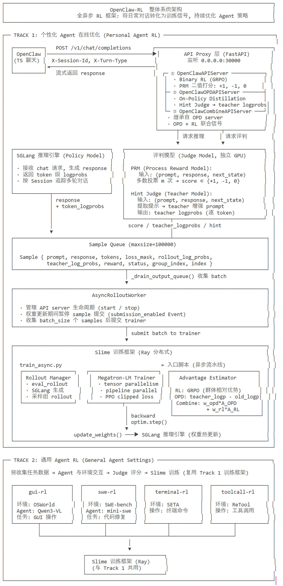
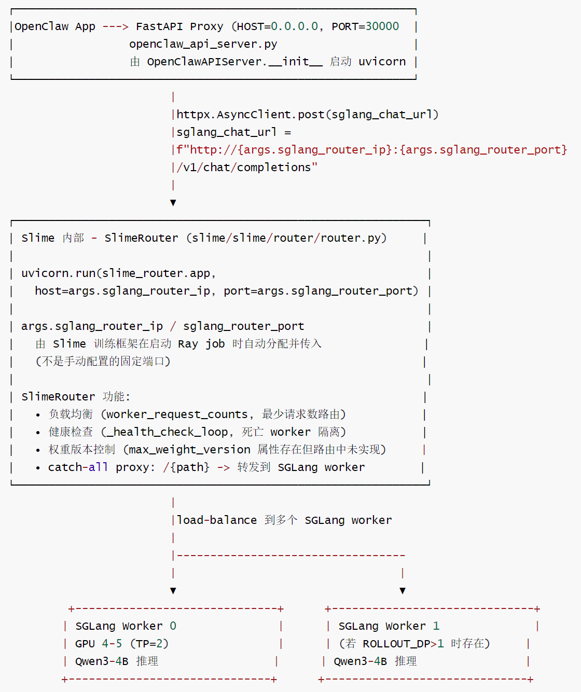
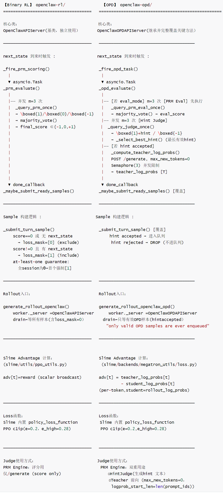
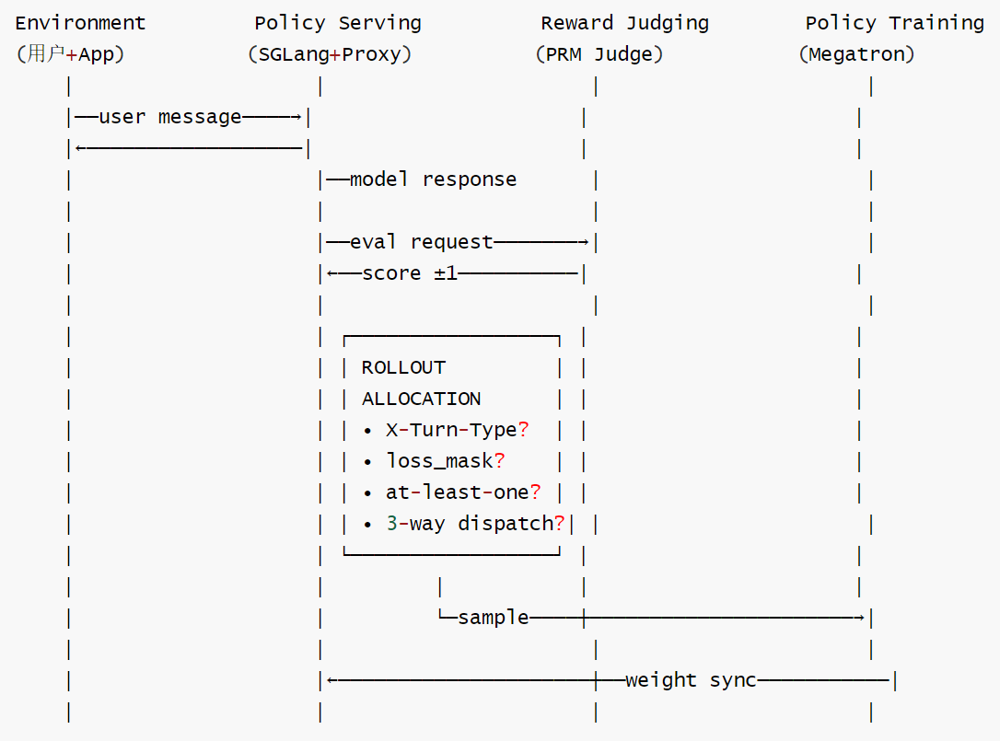

# 【Agentic RL / 强化学习 / OPD】OpenClaw-RL 源码阅读笔记 --- (7)--- Policy Serving

# 【Agentic RL / 强化学习 / OPD】OpenClaw-RL 源码阅读笔记 --- (7)--- Policy Serving

目录

* [【Agentic RL / 强化学习 / OPD】OpenClaw-RL 源码阅读笔记 --- (7)--- Policy Serving](#agentic-rl--强化学习--opdopenclaw-rl-源码阅读笔记-----7----policy-serving)
  + [0x00 概要](#0x00-概要)
  + [0x01 基础](#0x01-基础)
    - [1.1 架构](#11-架构)
    - [1.2 OpenClawAPIServer 的定位](#12-openclawapiserver-的定位)
      * [职责](#职责)
      * [类比](#类比)
    - [1.3 继承关系 & 方法覆盖](#13-继承关系--方法覆盖)
    - [1.4 真实策略服务器](#14-真实策略服务器)
      * [请求处理调用链](#请求处理调用链)
      * [样本构建调用](#样本构建调用)
      * [FastAPI Proxy 如何转发到 SGLang](#fastapi-proxy-如何转发到-sglang)
    - [1.5 对比](#15-对比)
      * [标准 RL Policy Serving:](#标准-rl-policy-serving)
      * [OpenClaw Policy Serving:](#openclaw-policy-serving)
      * [工程挑战](#工程挑战)
      * [总结：OpenClaw 的根本范式转变](#总结openclaw-的根本范式转变)
  + [0x02 详细功能梳理](#0x02-详细功能梳理)
    - [2.1 OpenClawAPIServer](#21-openclawapiserver)
      * [OpenClaw-RL功能](#openclaw-rl功能)
      * [OpenClawAPIServer功能](#openclawapiserver功能)
      * [OpenClaw-RL业务流程](#openclaw-rl业务流程)
    - [2.2 OpenClawOPDAPIServer](#22-openclawopdapiserver)
      * [OpenClaw-OPD 功能](#openclaw-opd-功能)
      * [OpenClawOPDAPIServer功能](#openclawopdapiserver功能)
      * [OpenClaw-OPD业务流程](#openclaw-opd业务流程)
  + [0x03 实现对比](#0x03-实现对比)
    - [3.1 差异①](#31-差异)
    - [3.2 差异②](#32-差异)
    - [3.3 差异③](#33-差异)
    - [3.4 差异④](#34-差异)
    - [3.5 差异⑤](#35-差异)
    - [3.6 差异⑥](#36-差异)
    - [3.7 模块交互对比](#37-模块交互对比)
      * [完全相同的部分(两种方法共享）](#完全相同的部分两种方法共享)
      * [差异阶段](#差异阶段)
  + [0x05 Rollout Allocation](#0x05-rollout-allocation)
    - [5.1 定义](#51-定义)
      * [功能](#功能)
      * [意义](#意义)
    - [5.2 位置](#52-位置)
      * [分类](#分类)
      * [OpenClaw](#openclaw)
    - [5.3 难点](#53-难点)
      * [难点1：分配时的信息不对称](#难点1分配时的信息不对称)
      * [难点2：非均匀轨迹成本(Agentic场景特有)](#难点2非均匀轨迹成本agentic场景特有)
      * [难点3：分配粒度的错位](#难点3分配粒度的错位)
      * [难点4：即期信号VS长期训练价值的错位](#难点4即期信号vs长期训练价值的错位)
      * [梯度可达性问题](#梯度可达性问题)
        + [场景一：所有rollout分给简单任务](#场景一所有rollout分给简单任务)
        + [场景二：所有rollout分给超难任务](#场景二所有rollout分给超难任务)
        + [场景三(最隐蔽)：模型学会了"score=0安全区间"](#场景三最隐蔽模型学会了score0安全区间)
    - [5.4 标准RL中的 Rollout Allocation 方法](#54-标准rl中的-rollout-allocation-方法)
    - [5.5 OpenClaw-RL](#55-openclaw-rl)
      * [架构](#架构)
      * [分布](#分布)
      * [可行性](#可行性)
      * [小结](#小结)
  + [0xFF 参考](#0xff-参考)

## 0x00 概要

本系列的目的是：借着对 OpenClaw-RL 源码的学习，来梳理强化学习的一些相关概念和思想。所以，会有一些基础知识、扩展和发散，OpenClaw-RL 只是一个切入点。而且，因为整篇系列是一个整体，所以有些概念的解读/学习会在不同的文章中出现，还请大家谅解。

OpenClaw-RL 是一个用于在线强化学习（Online RL）的框架，专门针对智能体工具使用场景。它通过从环境反馈中提取过程奖励信号来训练语言模型，支持三种主要模式：

* **openclaw-rl**：基于二元奖励的强化学习（Binary RL / GRPO）
* **openclaw-opd**：基于后见之明提示的在线策略蒸馏（On-Policy Distillation, OPD）
* **openclaw-combine**：联合方法，在同一 PPO 更新中同时利用 RL reward 和 OPD teacher signal


OpenClawAPIServer是OpenClaw-RL系统中的核心组件，它充当OpenClaw环境与 SGLang推理服务之间的代理服务器，负责收集训练数据、计算奖励并提交样本给强化学习训练流程。当然，也可以认为OpenClawAPIServer即是 Proxy Server，也是 Policy Serving。

## 0x01 基础

### 1.1 架构

我们回顾 OpenClaw-RL 的系统架构图如下：



### 1.2 OpenClawAPIServer 的定位

OpenClawAPIServer 这个名字其实不准确，更准确的命名应该是：OpenClawProxyServer 或OpenClawTrainingPipeline—它是连接Policy Serving、Reward Judging 和Policy Training 三个功能层的协调器（Orchestrator），而非其中任何一层的实现体。

#### 职责

以 OpenClawAPIServer 为例，它独自承担了几个职责：

| 职责 | 属于哪个组件 | 具体代码 |
| --- | --- | --- |
| HTTP 代理（转发用户请求） | Policy Serving（接口层） | httpx.post(sglang\_chat\_url) |
| 拦截 response + logprobs | Policy Serving（数据采集） | \_extract\_logprobs\_from\_chat\_response() |
| PRM 评分 | Reward Judging | \_fire\_prm\_scoring() / \_opd\_evaluate() |
| 构造训练 Sample | 训练数据管道 | \_submit\_turn\_sample() |
| 开关控制（503） | 训练-服务调度 | submission\_enabled.is\_set() |

#### 类比

OpenClawAPIServer = “前台+服务员+数据记录员"，不是“厨房"（Policy）本身。

| 类比 | 对应组件 |
| --- | --- |
| 餐厅服务员（接单、传菜） | OpenClawAPIServer |
| 厨房（真正做菜） | SGLang GPU 4-5（Policy 推理） |
| 食品检验员（给菜打分） | SGLang GPU 6-7（PRM/Judge） |
| 餐厅管理系统（记录点单数据） | output\_queue → Slime |

### 1.3 继承关系 & 方法覆盖

OpenClawAPIServer、OpenClawOPDAPIServer 和 OpenClawCombineAPIServer 的关系如下：

```
OpenClawAPIServer                  (Binary RL 基类, 独立)
    ├─ _submit_turn_sample()           score->loss_mask, at-least-one
    ├─ _maybe_submit_ready_samples()    检查 PRM task done
    └─ _fire_prm_scoring()              触发 PRM 异步

OpenClawOPDAPIServer (独立类, 不继承 OpenClawAPIServer)
    ├─ _submit_turn_sample()           独立实现
    ├─ _maybe_submit_ready_samples()   改用 opd_evaluate task
    ├─ _opd_evaluate()                 hint judge + teacher lp 计算
    ├─ _fire_opd_task()                触发 OPD 异步评估
    └─ _compute_teacher_log_probs() / _compute_teacher_topk_logprobs()

OpenClawCombineAPIServer extends OpenClawOPDAPIServer
    ├─ _submit_turn_sample()           ← 覆盖: OPD/OPD+RL 路径
    ├─ _submit_rl_turn_sample()        ← 新增: RL-only 路径 (teacher=rollout)
    └─ _maybe_submit_ready_samples()   ← 覆盖: 3路分发逻辑
```

### 1.4 真实策略服务器

OpenClawAPIServer 的技术栈：

* FastAPI：Web框架（异步）
* Uvicorn：ASGI 服务器（基于uvloop，高并发）
* httpx/aiohttp：异步 HTTP 客户端（调用 SGLang和PRM）

真正的Policy Server是SGLang（GPU4-5）

* Policy=Qwen3-4B模型权重 (注: RL server 默认 SERVED\_MODEL\_NAME="qwen3-8b", OPD server 默认="qwen3-4b", 实际部署可通过环境变量覆盖)
* Policy Server=SGLang推理引擎（监听sglang\_router\_ip:sglang\_router\_port）

OpenClawAPIServer不运行模型推理，它只是SGLang前面的一层拦截代理。

```
用户 → OpenClawAPIServer（FastAPI, Proxy） → SGLang（GPU4-5）← 真正的Policy Server
         ↓ 拦截
    SGLang PRM (GPU 6-7) ← Reward Judge（评分）
         ↓
    output_queue
         ↓
       Slime    ← Policy Training的数据入口
```

#### 请求处理调用链

* HTTP 入口：chat\_completions()
* 回合判断：`_handle_main_turn()/_handle_side_turn()`
* SGLang 转发：*forward\_to\_sglang()*
* PRM 触发：\_fire\_prm\_scoring() →\_prm\_evaluate()
* 样本提交：maybe\_submit\_ready\_samples()→output\_queue.put()

#### 样本构建调用

* 数据缓冲：`_buffer_record()`→存入\_pending\_records
* 状态刷新：`_flush_pending_record()`→添加下一状态\_
* 样本构建：\_submit\_turn\_sample()→创建Sample 对象

#### FastAPI Proxy 如何转发到 SGLang

OpenClawAPIServer 通过 FastAPI Proxy 实现了对外的入口，内部通过 SlimeRouter 路由到实际的 SGLang 推理引擎, 实现了接入层与推理层的解耦。完整端口与中间层架构如下图所示。



端口关系总结 (run\_qwen3\_4b\_openclaw\_rl.sh 配置):

```
PORT=30000
  -> FastAPI Proxy 监听端口 (外部可见, OpenClaw App 连接此处)

args.sglang_router_ip/port
  -> Slime 自动分配, 传给 API Server 作为 sglang_chat_url 的目标
  -> 指向 SlimeRouter (内部负载均衡层)

args.prm_router_ip/port
  -> PRM Engine 的 /generate 地址 (GPU 6-7)
  -> API Server 用于发送评分请求
```

### 1.5 对比

#### 标准 RL Policy Serving:

rollout时：

* SGLang只服务训练系统内部
* 批量生成→批量打分→批量训练
* 无外部访问

架构：

* [训练系统］ ⇆ [SGLang] 内部通信

#### OpenClaw Policy Serving:

rollout 时，SGLang同时服务：

* 实用户（通过OpenClawApp）
* PRM评分（内部调用）
* Teacher forward pass（OPD 时）

架构：

* [用户手机] → [FastAPI Proxy] → [SGLang] 外部流量
* [PRM judge] → [SGLang] 内部调用
* [训练系统] ← [Proxy] 数据管道

#### 工程挑战

这导致了独特的工程挑战：

```
标准 RL 不需要处理的问题：       OpenClaw 需要处理：
─────────────────────       ────────────────────────
❌ API 认证                  ✅ SGLANG_API_KEY
❌ 并发控制                   ✅ semaphore
❌ 503 暂停                  ✅ submission_enabled
❌ session 管理              ✅ X-Session-Id
❌ 流式传输                   ✅ SSE streaming
❌ 用户体验                   ✅ 低延迟响应
❌ 数据筛选                   ✅ main vs side turn
❌ 超时处理                   ✅ session timeout
```

#### 总结：OpenClaw 的根本范式转变

标准 RL： 训练系统是 "主人" → 它决定问什么、答几次、怎么评分

OpenClaw： 训练系统是 "寄生者" → 它寄生在真实对话上，被动收集数据

这导致OpenClaw-RL Serving 如下特点：

1. Rollout = 被动等待（不是主动生成）
2. Environment = 真实用户（不是模拟器）
3. PRM = 即用即评（不是预训练 RM）
4. Policy = 对外服务（不是内部推理）

一切设计选择都源于这个范式转变。

## 0x02 详细功能梳理

OpenClawAPIServer 本质上是一个智能代理，它不仅转发请求，还负责收集强化学习所需的训练数据，通过PRM评估助手响应质量，并将高质量的数据提交给训练流程。

OpenClawOPDAPIServer 则是OPD模式的专用API服务器。

### 2.1 OpenClawAPIServer

角色：OpenClaw与SGLang之间的代理服务器

#### OpenClaw-RL功能

* 二元奖励机制：使用过程奖励模型(PRM)对助手响应进行+1/-1/0评分
* 环境反馈利用：将用户回复或工具返回值作为"下一个状态"来评估前一回合质量
* 多轮对话支持：维护会话状态，支持复杂的多轮交互场景
* GRPO 优势估计：使用GRPO进行策略优化

#### OpenClawAPIServer功能

* 请求转发和响应处理
* 会话状态管理
* PRM评估触发
* 训练样本生成和提交

关键特性：

* 支持流式和非流式响应
* 认证和授权验证
* 记录文件管理

#### OpenClaw-RL业务流程

请求处理流程

* 接收请求：外部环境发送带有X-Session-Id和x-Turn-Type的请求
* 认证验证：验证Bearer Token(如果配置)
* 请求转发：转发到SGLang服务获取助手响应
* 响应处理：解析助手响应和日志概率
* 回合分类：区分主回合(main)和侧任务回合(side)

PRM评估流程

* 状态检测：当收到同一会话的新回合时，将新回合作为前一回合的"下一状态"
* 提示构建：使用\_build\_prm\_judge\_prompt构建评估提示
* 异步评估：启动PRM评估任务，进行多次独立评估
* 多数投票：汇总评估结果，确定最终评分
* 记录保存：保存评估结果到PRM记录文件

样本提交流程

* 条件检查：确保PRM评估完成且样本有效
* 损失掩码设置：
  + 有下一状态且评分≠0：loss\_mask=[1]
  + 无下一状态(会话结束)：loss\_mask=[0](%E9%99%A4%E9%9D%9E%E6%98%AF%E5%94%AF%E4%B8%80%E5%9B%9E%E5%90%88)
* 样本创建：构建包含所有必要信息的Sample对象
* 队列提交：将样本放入输出队列供训练器消费

### 2.2 OpenClawOPDAPIServer

角色：OPD模式的专用API服务器

#### OpenClaw-OPD 功能

* 后见之明提示提取：从下一状态中提取有用的提示信息
* 教师信号生成：基于增强后的提示查询教师模型的对数概率
* Top-K蒸馏：支持Top-K logits蒸馏，实现更精细的知识迁移
* 在线策略训练：直接在当前策略上进行蒸馏，避免离线数据偏差

#### OpenClawOPDAPIServer功能

* 用后见之明提示来提取教师模型查询
* Top-K对数概率计算
* 双重评估模式(OPD+PRM评估)
* \_fire\_opd\_task(): 触发 OPD 异步评估 (hint judge + teacher 前向)

关键特性：

* 提示增强机制
* 并发教师查询限制
* 评估模式切换

#### OpenClaw-OPD业务流程

提示提取流程

* 下一状态分析：分析用户回复或工具返回值
* 提示生成：使用提示模型生成可能的改进提示
* 提示选择：选择最长的有效正面提示
* 提示应用：将提示附加到原始对话历史

教师信号生成流程

* 增强提示构建：将提取的提示附加到原始提示
* 教师查询：向教师模型查询增强提示下原始响应的对数概率
* Top-K查询：(可选)查询Top-K分布信息
* 信号整合：将教师信号整合到训练样本中

样本提交流程

* 有效性检查：确保提示有效且教师查询成功
* 样本构建：创建包含教师对数概率的Sample对象
* 队列提交：提交到训练队列

## 0x03 实现对比

我们接下来看看 OpenClawAPIServer vs OpenClawOPDAPIServer 的对比。

核心设计哲学差异:

* RL 尽可能保留数据 (包括 loss\_mask=0 的样本)
* OPD 则是宁缺毋滥 (只有 hint accepted 的样本才有价值，其余直接 DROP)。

实现差异精确对比如下。

### 3.1 差异①

差异①：turn\_data 中保存的字段

```
OpenClawAPIServer (RL)                 OpenClawOPDAPIServer (OPD)
=========================              ===========================
{                                      {   
	prompt_ids,                            prompt_ids,   
	response_ids,                          response_ids, 
	response_logprobs,                     response_logprobs,   
	prompt_text,                           prompt_text,   
	response_text                          response_text,
} 
                                           messages,      ← 新增：完整消息历史 
                                           tools,         ← 新增：工具定义
                                           has_next_state ← 新增：跟踪状态
```

### 3.2 差异②

差异②：\_handle\_request 中触发评估的时机和方式。

关键差异：RL的PRM触发与JSONL记录耦合；OPD的teacher触发与记录解耦，更健壮。

```
OpenClawAPIServer (RL)                   OpenClawOPDAPIServer (OPD)
=========================                ===========================

if session_id in _pending_records:       prev_turn_num = _turn_counts[~]  
	_flush_pending_record(next_state)    if prev_turn_num > 0:  
    _fire_prm_scoring()                     _flush_pending_record(next_state) 
                                            prev_turn_data = pending[prev_turn] 
← 依赖 _pending_records 是否存在              _fire_opd_task(prev_turn_data, ...)  
	(写入 JSONL 文件时才有 record) 
                                         ← 依赖 turn_counts 追踪是否有上一轮 
                                           (不依赖 record 是否开启)
```

### 3.3 差异③

差异③：异步评估函数

```
OpenClawAPIServer (RL)                   OpenClawOPDAPIServer (OPD)
=========================                ===========================

_fire_prm_scoring()                      _fire_opd_task()
	→ _prm_evaluate()                      → _opd_evaluate()

_prm_evaluate():                         _opd_evaluate(): 
  ① 并发 m=3 次评分请求                       ① [若 eval_mode] PRM Eval 先执行
    _query_prm_once()                         _query_prm_eval_once() × m
  ② `majority_vote()                        ② 并发 m=3 次 Hint Judge 请求
  ③ return `{score, votes, repr}              _query_judge_once()
  ← 只做评分，返回 scalar                     ③ _select_best_hint() (最长有效)
                                            ④ 若 accepted: 计算 teacher_lp
                                              _compute_teacher_log_probs() 
                                            ⑤ return {accepted, teacher_lp,
                                                     hint, eval_score, ...}
```

### 3.4 差异④

差异④：\_maybe\_submit\_ready\_samples 的分发逻辑

```
OpenClawAPIServer (RL)                  OpenClawOPDAPIServer (OPD)
=========================               ===========================

无 next_state → force_no_prm=True       无 next_state → force_drop_without_next_state=True 时提交 (score=0, exclude=True)           时 DROP (直接 pending.pop, 不提交)  

有 PRM result → 提交所有样本              有 OPD result:  
(含 loss_mask=0 的)                          accepted=True → 提交 
                                            accepted=False → 直接 continue 
at-least-one guarantee: 全0时                (不提交, 不进队列) 
首个 turn 强制 loss_mask=[1]             无 at-least-one 机制
```

### 3.5 差异⑤

差异⑤: \_submit\_turn\_sample 构建的 Sample

```
OpenClawAPIServer (RL)                      OpenClawOPDAPIServer (OPD)
=========================                   ===========================

.loss_mask = [0]*L or [1]*L                 .loss_mask = [1]*L (均为1)
.reward = {"score": ±1.0 or 0.0}            .reward = {"score": 1.0} ← 固定1.0
.rollout_logprobs                           .rollout_logprobs
(无 teacher_logprobs)                       .teacher_log_probs [T] ← 新增
                                            .teacher_topk_log_probs [T,K] ← 可选
                                            .teacher_topk_indices [T,K] ← 可选
```

OPD 的 reward 固定为 1.0 是因为:

* → OPD 的训练信号来自 teacher\_log\_probs, 不依赖标量 reward
* → reward=1.0 让 GRPO advantage = 1.0 (若后续有 RL 叠加)
* → 纯 OPD 模式下 reward 不参与 advantage 计算 (on\_policy\_distillation 不用 reward)

### 3.6 差异⑥

差异⑥: session\_done 处理

```
OpenClawAPIServer (RL)                   OpenClawOPDAPIServer (OPD)
=========================                ===========================

force_no_prm=True → 提交最后一个turn          force_drop_without_next_state=True
(score=0, loss_mask=[0])                    → DROP 最后一个turn (无 hint 可得)
(或at-least-one升格)
清理: _session_effective, _turn_counts      清理: 只清理 _turn_counts
```

### 3.7 模块交互对比

#### 完全相同的部分(两种方法共享）

```
┌────────────────────────────────────────────────────────────────────┐
│ OpenClaw App — HTTP → FastAPI Proxy(port=30000)                    │
│                         X-Session-Id / x-Turn-Type/X-Session-Done  │
│                         submission_enabled:threading.Event         │
│                         output_queue: queue.Queue                  │
│                         SlimeRouter → SGLang Engine (GPU 4-5,TP=2) │
│                         AsyncRolloutWorker(结构完全相同）            │
│                         Megatron Actor (GPU 0-3,TP=4)              │
│                         权重同步：pause→sync→resume机制              │
└────────────────────────────────────────────────────────────────────┘
```

#### 差异阶段

核心差异总结

| 维度 | Binary RL | OPD |
| --- | --- | --- |
| reward 信号类型 | scalar ±1/0 | per-token teacher-student差值 |
| PRM Engine 用途 | 单一：评分 | 双重：hint生成 + teacher前向 |
| 样本过滤 | loss\_mask=0(保留但不训练） | 直接DROP(不入队列） |
| at-least-one保证 | ✓ 防止session全0 | × 只要有hint就入队 |
| 队列等待行为 | 等所有样本(含mask=0） | 只等有效OPD样本 |
| 额外Sample字段 | 无 | teacher\_log\_probs [T] (+ topk 变体) |

具体如下：



## 0x05 Rollout Allocation

因为篇幅所限，我们借此，再来看看Rollout Allocation问题（本来应该在rollout篇）。

### 5.1 定义

Rollout Allocation = 决定"给哪些 prompt/任务 分配多少计算资源来做 rollout"的策略。即，Rollout Allocation=选题 +分配 rollout 次数+生成参数。它决定训练数据的质量。

形式化：

```
给定一个 prompt pool P = {p1, p2, ..., p_N} 和总计算预算 C (GPU 时间)

Rollout Allocation 策略 A: P -> N 
A(pi) = 给 prompt pi 分配多少次 rollout (生成多少个 response) 
约束：Σ A(pi) ≤ C
```

#### 功能

功能：3 个层次的决策

层次 1: 选哪些 prompt? (What to practice)

* 从 dataset 中选哪些题？
* 简单题多练还是难题多练？
* 模型弱点在哪里，重点补强？

层次 2: 每个 prompt 生成几个？ (How many attempts)

* N=1? N=4? N=16?
* 所有 prompt 一样多？还是 adaptive?
* 难题多生成几个（增加找到好回答的概率）？

层次 3: 生成时用什么参数？ (How to generate)

* Temperature 高低？
* Top-p 设多少？
* Max tokens 限制？

#### 意义

意义：为什么 Rollout Allocation 重要？

RL 训练的核心循环：rollout → reward → > advantage → gradient → update

Rollout allocation决定了：

* 训练数据的质量（好prompt→有效梯度信号）
* 训练数据的多样性（覆盖不同prompt→减少过拟合）
* 计算效率（不浪费GPU在无效prompt上）
* GRPO的效果（N越大→advantage估计越准）

类比：

Rollout allocation=学生的"刷题策略"

* 差策略：每天做100道加法题→加法很强但不会乘法
* 好策略：分析弱点→弱项多练、强项少练→均衡提升
* 最优策略：做难度刚好在能力边缘的题（zone of proximal development）

### 5.2 位置

RL 训练管道的 5 个阶段。

```
Stage 1          Stage 2           Stage 3           Stage 4           Stage 5
─────────        ─────────         ─────────         ─────────         ─────────
Prompt           Rollout           Reward            Advantage         Gradient
Selection        Generation        Scoring           Computation       Update

"问什么"         "怎么答"            "打几分"           "好了多少"         "往哪走"
```

Rollout Allocation 横跨 Stage 1 + Stage 2, 具体包含:

```
┌──────────────────┬──────────────────┬─────────────────────────────────────────┐
│ 子问题            │ 属于哪个 Stage   │ 含义                                      │
├──────────────────┼──────────────────┼─────────────────────────────────────────┤
│ 选什么 prompt     │ Stage 1          │ 从 pool 中选哪些问题来训练                 │
├──────────────────┼──────────────────┼─────────────────────────────────────────┤
│ 每个 prompt      │ Stage 1→2        │ group size G (GRPO 的核心参数)            │
│ 生成几条          │                  │                                         │
├──────────────────┼──────────────────┼─────────────────────────────────────────┤
│ 用哪个模型生成     │ Stage 2          │ π_old vs π_sampler (TIS 问题出在这)       │
├──────────────────┼──────────────────┼─────────────────────────────────────────┤
│ GPU 怎么分配      │ Stage 2 (infra)  │ rollout TP/DP vs training TP            │
├──────────────────┼──────────────────┼─────────────────────────────────────────┤
│ 生成后过滤         │ Stage 2→3        │ dynamic sampling (DAPO: 丢弃全对/全错组)  │
└──────────────────┴──────────────────┴─────────────────────────────────────────┘
```

#### 分类

Rollout allocation 不干净地属于任何一个组件—它是 4 组件之间的编排层。

如果要严格归类，有两种合理的处理方式:

方案 A: 归入 Policy Serving (当前 OpenClaw 的做法)

* 理由: 所有决策代码都在 openclaw\_api\_server.py 里
* 优点: 少一个组件, 架构简单
* 缺点: Policy Serving 承担了过多职责 (既服务用户、又做数据过滤、又做训练样本组装)

方案B：独立为第5组件“Data Orchestrator"

* 理由：rollout allocation 的决策逻辑（at-least-one、3-way dispatch、loss\_mask）和“服务用户请求"是正交关注点
* 优点：单一职责，测试更清晰一
* 缺点：多一个进程/多一跳延迟

#### OpenClaw

OpenClaw 选了方案A一把 orchestration 逻辑塞在 proxy 里，即Rollout allocation 物理上嵌在 Policy Serving 里, 逻辑上是独立的编排层。这在"36个交互就能改善模型“的小规模场景下完全合理。如果将来swe-rl/ 引入多步 episode+主动 prompt 选择，方案 B可能更适合。

### 5.3 难点

#### 难点1：分配时的信息不对称

分配rollout预算的时候，你不知道：

* 这个prompt在当前模型能力下通过率是多少
* 这一组rollout会不会退化(全成功/全失败)
* 这个prompt在10k步后还值不值得再采样

需要指标(历史pass rate/model confidence) 才能估计 → 但是，这些指标都有噪声且会过时(模型能力在持续变化)

#### 难点2：非均匀轨迹成本(Agentic场景特有)

假设有两个任务

* TaskA(写一行代码)：2秒/rollout
* TaskB(完整SWE任务)：20分钟/rollout

固定时间预算 =1小时，应该如何分配？两个选择如下：

* Option 1：1800 x Task A rollouts
* Option 2：3 x Task B rollouts

哪个产生更多有效梯度？取决于每类任务的学习价值，这是时间效率问题，是"单位计算时间的梯度信息量"问题

#### 难点3：分配粒度的错位

现有方法的分配粒度：per-prompt(以prompt为单位分配) ，然而Per-prompt 分配忽略了 execution context 的影响 → 同一prompt在不同 context 下应该得到不同的 rollout预算。

Agentic RL的难度决定因素：

* 相同prompt+不同scaffold→难度完全不同
* 相同prompt+不同工具链→难度完全不同
* 相同prompt+不同历史上下文→难度完全不同

#### 难点4：即期信号VS长期训练价值的错位

"有学习价值"的度量应该是：这个prompt/经验，能否让模型在下一个 capability boundary 上进步？

但现有方法用的是局部思路：

* 近期 pass rate(=当前时刻的难度估计，不等于未来价值)
* reward spread(=组内差异，不等于长期泛化价值)
* gradient variance(=当前参数空间的敏感度，不等于下游任务的价值)

→ 局部最优分配 ≠ 全局训练价值最大化

#### 梯度可达性问题

然而，更关键的是是"梯度可达性"问题而非"效率"问题。

关键反直觉：不是"少跑几个rollout省钱"，而是"错误的rollout分配让优化器在错误的方向上消耗预算"：

##### 场景一：所有rollout分给简单任务

* 组内结果：全成功(reward=+1，+1，+1，+1)
* GRPO advantage：全为0(组内差异为零)
* 梯度：0
* 结果：消耗了N个 GPU·hour，参数没有更新

##### 场景二：所有rollout分给超难任务

* 组内结果：全失败(reward=-1，-1，-1，-1)
* GRPO advantage:全为0
* 梯度：0
* 结果：同上一消耗了算力，什么都没学到

##### 场景三(最隐蔽)：模型学会了"score=0安全区间"

* 组内结果：全为0
* 梯度：0
* 结果：安全区间的策略因为永远不被惩罚，概率持续上升

因此Non-zero gradient ratio(非零梯度的batch占比)才是最该优化的目标，而不是平均reward。

### 5.4 标准RL中的 Rollout Allocation 方法

| 方法 | 策略 | 效果 |
| --- | --- | --- |
| 均匀采样 | 随机从dataset选 | 简单但浪费 |
| Curriculum | 先易后难 | 稳定但需预定义 |
| Prioritized | 按reward 方差/loss排序 | 高效但可能偏移 |
| Adaptive N | 难题N↑，易题N↓ | 最优但复杂 |
| Rejection Sampling | 生成N个，选最好/最差 | best-of-N |

针对梯度可达性问题，可以采取的方法如下：

**方案A：VIP(最系统，用GP预测梯度方差)**

核心思路：用轻量高斯过程预测每个prompt的成功概率p\_i → 把p\_i转化成"这一组rollout的梯度方差估计" →在固定预算约束下，解优化问题。目标不是最大化pass rate，而是最小化梯度估计方差

为什么梯度方差重要：

* 方差高→ 更新方向不稳定→ 需要更多rollout才能确定方向
* 方差低→少量rollout就能给出确定性更新

**方案B：KnapsackRL(价值/成本建模)**

把每个任务的探索看成背包问题中的物品：

* value=期望从这个任务获得的学习信号(rewardspread)
* cost=执行这个rollout的计算/时间成本
* Knapsack优化：最大化总value，满足总cost≤Budget
* 本质：把"值不值得探索这个任务"变成可优化的组合问题 → 预算从饱和任务转移到接近能力边界的任务

**方案C：Reinforce-Ada(主动恢复信号)**

核心洞察：很多"难prompt"全失败，是因为under sampling的统计假象，如果你只采4次，而真实通过率是10%，很可能全失败

Reinforce-Ada 的做法：

* 检测到"全失败组"时，动态增加推理预算(更多rollout)，主动去找出那些概率低但非零的成功轨迹
* 效果：恢复了uniformGRPO会系统性漏掉的学习信号 → 不是被动重分配，而是主动信号挖掘

**方案D：GVM-RAFT/RL-ADA**

GVM-RAFT：综合考虑

* acceptance rate(rollout被奖励函数接受的概率)
* gradient noise(该prompt的历史梯度噪声水平)

→ 动态调整采样权重

RL-ADA：识别"接近能力边界"的prompt(passrate0.3-0.7)

→ 优先分配更多rollout给这类prompt → 让模型在当前能力的"边缘地带"集中训练

### 5.5 OpenClaw-RL

OpenClaw的 Rollout Allocation：**几乎为零**。

#### 架构

**传统系统**

传统系统：Prompt Sampler → Rollout Workers → Environment

**OpenClaw**

OpenClaw 的架构如下：

```
环境(用户)→ Rollout Workers(SGLang)→ Sample Filter(score机制)
                                            ↓
                                       Training Queue
```

细节如下：



**本质差异**

OpenClaw把"主动allocation"变成了"被动reception"。代价是失去对rollout 质量的主动控制；收益是消除了 train-deploy distribution mismatch(因为rollout workers 直接就是deployment serving)

#### 分布

如果看 OpenClaw-RL 的代码，和 rollout allocation 有所相关的决策全部嵌在 openclaw\_api\_server.py (Policy Serving) 里：

| Rollout Allocation 决策 | 在哪做的 | 属于哪个组件的代码 |
| --- | --- | --- |
| 哪些 turn 成为训练数据？ | X-Turn-Type: main/side header 判断 | Policy Serving (proxy) |
| 哪些样本进入训练队列？ | loss\_mask 赋值 / at-least-one | Policy Serving (proxy) |
| 何时暂停采集？ | submission\_enabled Event | Policy Serving ↔ Training |
| OPD hint 是否采纳？ | \_select\_best\_hint() | Policy Serving (proxy) |
| Combine 3-way dispatch | \_maybe\_submit\_ready\_samples() | Policy Serving (proxy) |
| 什么 prompt 被用？ | 用户决定，不可控 × | Environment (不受控) |
| 生成几个？ | 永远N=1× |  |
| 怎么生成？ | 统一参数（temp=0.6）！ |  |

#### 可行性

OpenClaw对rollout allocation几乎没有控制权，是“寄生式训练“的根本代价。如果有控制权能做什么？  
假设能控制prompt（实际不行），则可以做到：

* 检测模型弱点→让用户问更多弱点领域
* 检测reward variance→跳过全 0 reward的prompt类型
* 检测advantage 方差→优先选"有学习信号"的prompt 这些在OpenClaw中不可能，但在 Slime标准 GRPO 中可以通过 dataset采样策略实现

#### 小结

OpenClaw的rollout分配是"被动的"—完全由用户行为决定，靠真实用户的需求分布做天然curriculum  
filtering。业界方案(VIP/Knapsack/Reinforce-Ada)是"主动的"—显式优化分配策略以最大化梯度信息量。两者路线不同，OpenClaw的被动方式在在线对话场景有其独特合理性，但对梯度质量缺乏主动控制。

## 0xFF 参考
