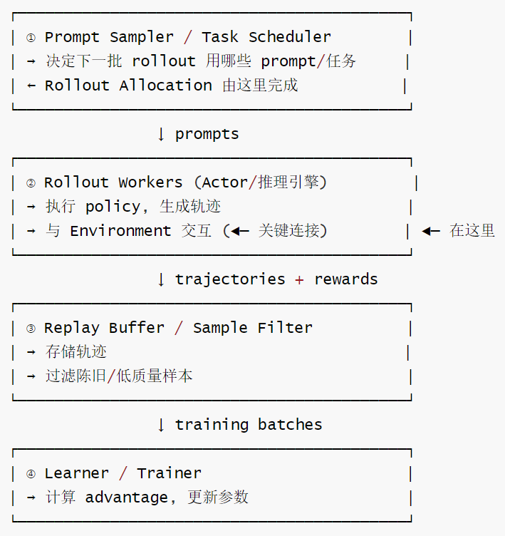
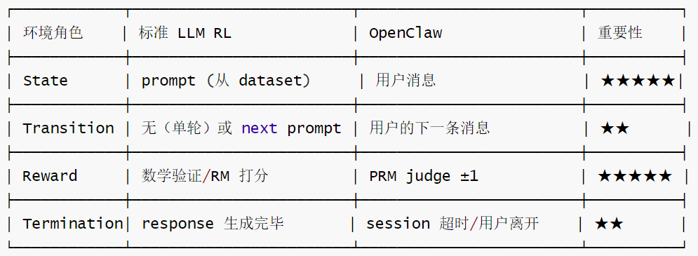
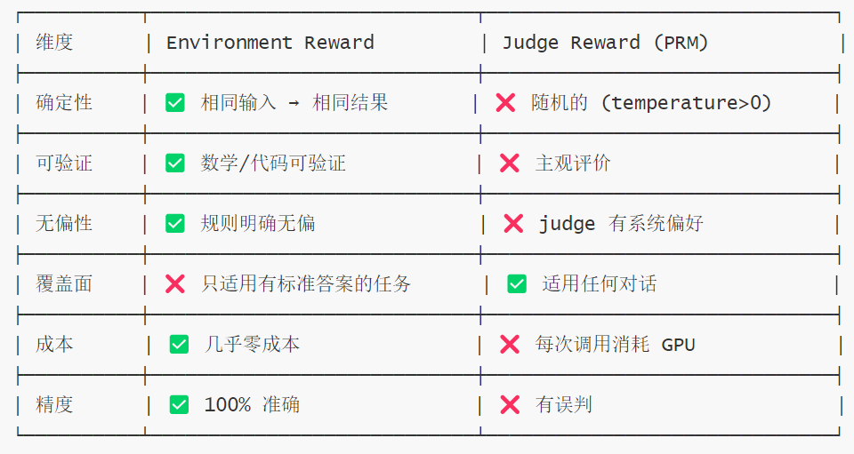
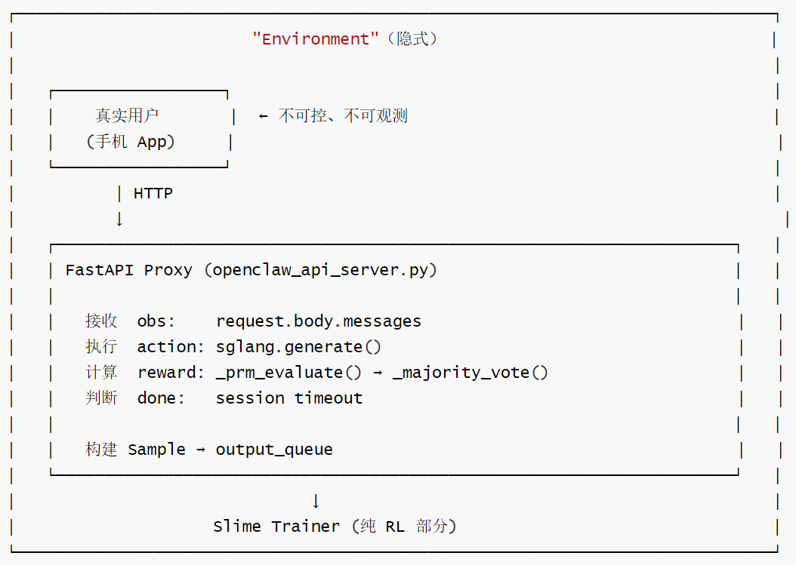
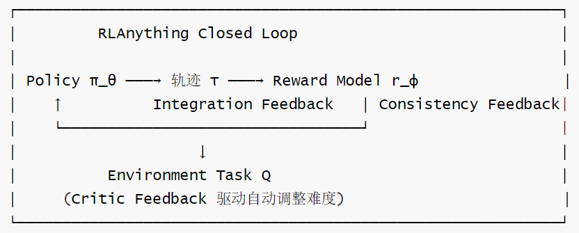

# 【Agentic RL / 强化学习 / OPD】OpenClaw-RL 源码阅读笔记 --- (8)--- Environment

# 【Agentic RL / 强化学习 / OPD】OpenClaw-RL 源码阅读笔记 --- (8)--- Environment

目录

* [【Agentic RL / 强化学习 / OPD】OpenClaw-RL 源码阅读笔记 --- (8)--- Environment](#agentic-rl--强化学习--opdopenclaw-rl-源码阅读笔记-----8----environment)
  + [0x00 概要](#0x00-概要)
  + [0x01 环境建模基础](#0x01-环境建模基础)
    - [1.1 标准 RL 系统的 4 模块架构](#11-标准-rl-系统的-4-模块架构)
    - [1.2 单轮 RL 下环境的退化](#12-单轮-rl-下环境的退化)
    - [1.3 环境建模的特点](#13-环境建模的特点)
      * [完整模拟的代价与陷阱](#完整模拟的代价与陷阱)
      * [什么是"结构上不失真”](#什么是结构上不失真)
      * [结构失真 vs 细节失真](#结构失真-vs-细节失真)
      * ["转写"的含义](#转写的含义)
      * [OpenClaw 的转写方式](#openclaw-的转写方式)
  + [0x02 真实用户 Environment](#0x02-真实用户-environment)
    - [2.1 标准 env](#21-标准-env)
    - [2.2 真实用户](#22-真实用户)
    - [2.3 特殊挑战](#23-特殊挑战)
      * [不可控的数据到达速率](#不可控的数据到达速率)
      * [不可控的Prompt分布](#不可控的prompt分布)
      * [不可重复（Non-replayable）](#不可重复non-replayable)
      * [非平稳（Non-stationary）](#非平稳non-stationary)
      * [延迟反馈（Delayed &Partial Reward）](#延迟反馈delayed-partial-reward)
      * [部分可观测（Partial Observability）](#部分可观测partial-observability)
      * [训练影响环境（Training Affects Environment）](#训练影响环境training-affects-environment)
    - [2.4 OpenClaw 的应对策略](#24-openclaw-的应对策略)
  + [0x03 OpenClaw 环境的作用](#0x03-openclaw-环境的作用)
    - [3.1 作用 1：提供 Prompt（State）](#31-作用-1提供-promptstate)
    - [3.2 作用 2：给出 Reward](#32-作用-2给出-reward)
    - [3.3 作用 3：提供 Transition（多轮场景）](#33-作用-3提供-transition多轮场景)
    - [3.4 作用 4：判断 Termination](#34-作用-4判断-termination)
    - [3.5 OpenClaw 环境的独特之处](#35-openclaw-环境的独特之处)
    - [3.6 小结](#36-小结)
  + [0x04 Reward](#0x04-reward)
    - [4.1 视角差异](#41-视角差异)
    - [4.2 OpenClaw 中 Reward 的位置](#42-openclaw-中-reward-的位置)
    - [4.3 Reward Judging 独立出来的好处](#43-reward-judging-独立出来的好处)
      * [传统 RL (reward 嵌入 env)](#传统-rl-reward-嵌入-env)
      * [LLM RL（reward独立）](#llm-rlreward独立)
    - [4.4 可信度差异](#44-可信度差异)
    - [4.5 Judge Reward 的三种噪声来源](#45-judge-reward-的三种噪声来源)
    - [4.6 对训练的影响](#46-对训练的影响)
    - [4.7 小结](#47-小结)
  + [0x05 Rollout Allocation在RL系统中的位置与职责](#0x05-rollout-allocation在rl系统中的位置与职责)
    - [5.1 情形A：静态环境(数学／代码题)](#51-情形a静态环境数学代码题)
    - [5.2 情形B：有状态的动态环境(Web/ComputerUse/SWE)](#52-情形b有状态的动态环境webcomputeruseswe)
    - [5.3 情形C：真实用户环境(OpenClaw-RL)](#53-情形c真实用户环境openclaw-rl)
    - [5.4 OpenClaw中的实际模块对应](#54-openclaw中的实际模块对应)
  + [0x06 实现](#0x06-实现)
    - [6.1 标准 RL 的 Environment 接口](#61-标准-rl-的-environment-接口)
    - [6.2 OpenClaw 的 Environment：无法封装的原因](#62-openclaw-的-environment无法封装的原因)
    - [6.3 Environment 的隐式边界](#63-environment-的隐式边界)
    - [6.4 对训练的影响](#64-对训练的影响)
  + [0x07 Environment Scaling：业界进展与下一代方向](#0x07-environment-scaling业界进展与下一代方向)
    - [7.1 三类 Env Scaling](#71-三类-env-scaling)
      * [类型A：水平扩展(并发数量)](#类型a水平扩展并发数量)
      * [类型B：垂直扩展(难度Curriculum)](#类型b垂直扩展难度curriculum)
      * [类型C：多样性扩展(任务空间)](#类型c多样性扩展任务空间)
      * [代表工作](#代表工作)
    - [7.2 RLAnything 技术详解](#72-rlanything-技术详解)
      * [整体架构：三组件闭环](#整体架构三组件闭环)
      * [Policy 训练：Integration Feedback](#policy-训练integration-feedback)
      * [Reward Model 训练：Consistency Feedback](#reward-model-训练consistency-feedback)
      * [Environment 自适应：Critic Feedback](#environment-自适应critic-feedback)
      * [实际例子(论文 Figure 3)：](#实际例子论文-figure-3)
      * [与OpenClaw-RL的对比](#与openclaw-rl的对比)
    - [7.3 SWE-Universe：水平扩展的代表](#73-swe-universe水平扩展的代表)
    - [7.4 两个代表的对比与编译器类比](#74-两个代表的对比与编译器类比)
    - [7.5 下一代 Env Scaling 方向](#75-下一代-env-scaling-方向)
      * [方向一：LLM生成环境(无限任务自动合成)](#方向一llm生成环境无限任务自动合成)
      * [方向二：对抗性环境(动态对抗Agent弱点)](#方向二对抗性环境动态对抗agent弱点)
      * [方向三：WorldModels作为内部环境(梦境训练)](#方向三worldmodels作为内部环境梦境训练)
      * [一句话总结](#一句话总结)
  + [0xFF 参考](#0xff-参考)

## 0x00 概要

本系列的目的是：借着对 OpenClaw-RL 源码的学习，来梳理强化学习的一些相关概念和思想。所以，会有一些扩展和发散，OpenClaw-RL 只是一个切入点。而且，因为整篇系列是一个整体，所以有些概念的解读/学习会在不同的文章中出现，还请大家谅解。

OpenClaw-RL 是一个用于在线强化学习（Online RL）的框架，专门针对智能体工具使用场景。它通过从环境反馈中提取过程奖励信号来训练语言模型，支持三种主要模式：

* **openclaw-rl**：基于二元奖励的强化学习（Binary RL / GRPO）
* **openclaw-opd**：基于后见之明提示的在线策略蒸馏（On-Policy Distillation, OPD）
* **openclaw-combine**：联合方法，在同一 PPO 更新中同时利用 RL reward 和 OPD teacher signal


我们先给全篇定个基调：在 OpenClaw-RL 中，"环境（Environment）"并不是一个独立封装的模块，而是由 **真实用户 + OpenClaw App + FastAPI Proxy** 三者共同构成的隐式实体。OpenClaw-RL 的设计哲学是：环境的其他部分（状态、动作、转移）都可以用事实性描述来定义，比如 "代码执行后输出 X"、"用户回复了 Y"，这些都是可被客观验证的。

因此，本篇我们就来看看 OpenClaw-RL 的环境到底是如何设计的，以及一些与环境相关的功能。

## 0x01 环境建模基础

环境建模的核心，不是把现实世界完整模拟出来，而是把真实工作 "**转写**" 成一个结构上不失真的可训练决策过程。

### 1.1 标准 RL 系统的 4 模块架构

下图是标准 RL 系统的 4 模块架构，可以清楚地看到 "环境（Environment）" 所处的位置。



### 1.2 单轮 RL 下环境的退化

在深入讨论环境建模之前，我们先看一个关键背景：LLM 单轮 RL 中，环境被极度简化。

完整 RL loop 中环境承担四类职责：

```
s0 → a0 → r0 → s1 → a1 → r1 → ... → st → done

环境负责: s0（初始状态）、s1→st 的转移、r0→rt（奖励）、done（终止）
```

但 LLM 单轮 RL 把多步交互压扁成了"一次性输出"：

```
s0 → [a0, a1, ..., at] → r

环境只负责: s0 (prompt) 和 r (terminal reward)
中间步骤（token 生成）全在 model 内部完成
环境不参与 token-level 交互 → 环境退化为 "prompt 提供器 + reward 打分器"
```

因此，在单轮场景下，环境的四类职责（State / Transition / Reward / Termination）中，Transition 和 Termination 几乎退化为零，真正起作用的只剩 **State（提供 prompt）** 和 **Reward（打分）** 两项。我们后面在 0x03 会看到，OpenClaw 的多轮对话场景会把这四项重新拉满，但理解单轮的退化形态，有助于看清 OpenClaw 设计的特殊性。

> 这里点出一个容易被忽视的点：State 虽然看起来"只是提供 prompt"，但它决定了 prompt 分布，而 prompt 分布直接决定训练效率。想象两个环境：Env A 只提供数学题，Env B 提供数学+代码+写作，即使两者用完全相同的 reward function，训练出的模型也完全不同。State 的质量本质上就是 Rollout Allocation 的一部分。

### 1.3 环境建模的特点

环境建模的核心是结构性不失真，即因果结构的等价性，而非现象层面的相似性。一个看起来很"简单"但保留了"哪些决策影响哪些结果"的环，比一个看起来很"真实"但扭曲了这条因果链的环境更有价值。

#### 完整模拟的代价与陷阱

我们来看看Web Agent的"完整模拟"尝试，其模拟如下：

* 真实浏览器 + 完整渲染 + JavaScript执行
* 真实网站(可能需要登录、CAPTCHA)
* 真实网络延迟

其问题如下：

* 单次rollout耗时数分钟(无法并发训练)
* 网站随时变化(训练数据不可复现)
* 大量细节与"做决策"无关(像素精度对决策无意义)
* 无法reset到相同初始状态(非Markov化)

完整模拟不仅不必要，而且可能损害训练一它把大量计算浪费在与决策无关的细节上。

#### 什么是"结构上不失真”

核心：保留决策的因果结构，而非感官的真实性。

结构 = 以下四者的组合。结构上不失真，就说明其保留了这四者的组合。

* 动作空间(可以做什么)
* 状态---动作因果关系(做什么会导致什么)
* 奖励信号的归因结构(哪些决策真正重要)
* 难度分布(任务有没有代表性)

一个反例(结构失真)是：假设为了简化，把Web任务的"搜索"操作改为："输入关键词，系统直接返回最相关的5个结果"。此时问题如下：

* 真实Web：关键词选择影响后续哪些信息可见
* 简化版：关键词选择对结果几乎无影响(系统帮你做了retrieval) → 模型永远学不到"如何构造有效搜索词"这个技能 → 结构被破坏，即使视觉上看起来"像网页"

#### 结构失真 vs 细节失真

细节失真(可接受)：

* WebShop没有真实的UI渲染
* ALFWorld的物理引擎不是完全准确的 → 对学习"如何导航到物品"的技能无影响

结构失真(不可接受)：

* "奖励函数惩罚所有超过10步的轨迹”(即使10步可以完成任务) → 模型学到的是"如何在10步内完成任务”，而非"如何完成任务” → 泛化到真实任务时：任务需要15步→模型表现差
* "所有agent action必须从预定义列表中选择”(离散化action空间) → 模型无法学习构造复杂的文字指令  
  → 迁移到真实任务(自由文本输入)时完全失效

#### "转写"的含义

转写 = 找到一个 MDP，使其与真实工作在决策层面等价：

```
真实工作           →             MDP 转写
─────────────────────────────────────────────────────────
程序员修复 bug           State: 代码 + issue 描述
                        Action: 生成 diff / 调用命令
                        Transition: 执行命令后的输出
                        Reward: 测试通过/失败

用户与 AI 对话           State: 对话历史
                        Action: 生成回复文本
                        Transition: 用户的下一句话(真实行为)
                        Reward: next_state 是否表明帮到了用户

家庭机器人导航           State: 房间图 + 物体位置
                        Action: 移动/拾取/放置
                        Transition: 物理模拟结果
                        Reward: 任务是否完成
```

#### OpenClaw 的转写方式

OpenClaw 是这个原则的极致实践—它几乎不转写，直接使用真实工作：

真实对话 = 直接的 MDP

* State = messages array(原始对话历史，无抽象)
* Action = 完整自然语言回复(无离散化)
* Transition = 用户的下一条真实消息(非模拟)
* Reward = judge(response, next\_state)(唯一的人工成分)

转写的最小化带来的优势：

* 无模拟Gap(真实环境即训练环境)
* 动作空间与真实部署完全一致
* 状态转移由真实用户驱动(最真实的外部反馈)

唯一的结构风险是：Reward函数设计不当 → 即使其他一切真实，MDP结构仍然失真 → 这就是PRM judge 设计的核心挑战。

## 0x02 真实用户 Environment

### 2.1 标准 env

标准 env（如 Atari/MuJoCo/数学验证）的优点如下：

* ☑ 确定性：相同 action → 相同 next state
* ☑ 可重复：env.reset() 随时重来
* ☑ 可控速：想跑多快跑多快
* ☑ 可并行：开 1000 个 env 实例
* ☑ 可观测：完整状态可见
* ☑ 均匀分布：可以控制 prompt 分布

### 2.2 真实用户

真实用户创造了自然的"能力边界课程"

* 用户不发送不可能完成的任务(会换平台)
* 用户不发送完全无需AI的任务(会自己做)

  → 用户群体的需求分布天然集中在"AI需要思考但可以成功"的区间 → 这是一种"有机的curriculum"，无需显式的难度控制

对比：离线RL必须从固定数据集采样，可能大量遇到模型太强/太弱的任务(饱和/无法完成)，产生大量零梯度组

### 2.3 特殊挑战

真实用户作为 Environment 的特殊挑战如下。

#### 不可控的数据到达速率

* 凌晨3点：0个用户 → 训练饿死 → rollout\_batch\_size=16，可能等 30 分钟
* 晚上8点：50个用户同时聊 → 数据洪水 → queue 堆积→数据变stale（off-policy 程度加剧）

代码应对：

```
_drain_output_queue 的while 循环 + timeout 日志
"waiting for API-produced samples: 3/16, queue=0" ← 在等用户
```

#### 不可控的Prompt分布

标准RL：从curated dataset采样 → 数学题/代码题/写作题均匀分布

OpenClaw：用户想问啥问啥

```
可能的情况：
- 连续50个人问“帮我写情书”→模型在情书上过拟合
- 没人问数学→数学能力退化
- 大量hello/你好→无效训练数据
```

→ 无法做curriculum learning （课程学习） → 无法控制 difficulty distribution

#### 不可重复（Non-replayable）

标准RL：同一个prompt可以生成N=16个回答 → GRPO组内比较

OpenClaw:

```
用户说“帮我分析这个bug”
你不能让用户“再说一遍“，然后给4个不同回答
```

→ N=1，GRPO退化 → 无法做rejection sampling（挑最好的回答） → 无法做best-of-N

#### 非平稳（Non-stationary）

标准RL：env 规则不变（CartPole的物理规则固定）

OpenClaw:

```
- 周一用户主要问工作问题
- 周末用户主要闲聊
- 新功能上线后用户行为突变
- 某个话题在社交媒体爆火→ 突然大量相关问题
```

→ “环境“本身在变化 → 之前学到的策略可能不再适用 → 需要持续适应

#### 延迟反馈（Delayed &Partial Reward）

标准RL：action→立即得到reward（毫秒级）

OpenClaw:

```
模型回复 → 用户看了... → 可能5分钟后才回复下一条 → 这5分钟内不知道用户满不满意  → PRM评分是替代品，不是真实用户反馈  → 用户可能直接退出（无反馈）
```

→ 真实的reward signal其实从未获得 → PRM是noisy proxy

#### 部分可观测（Partial Observability）

标准RL：env.state完全可见

OpenClaw:

```
- 用户的真实意图不可见（“帮我写代码“→是作业？工作？学习？）
- 用户的满意度不可见（沉默满意）
- 用户的上下文不可见（他之前用别的 AI 聊过什么？）
- 多轮对话中的隐式状态不可见
```

→ 模型只能通过messages推断意图 → PRM也只能基于文本评分，无法知道用户真实感受

#### 训练影响环境（Training Affects Environment）

标准RL:

* env 不受agent训练影响
* CartPole不会因为agent变强而改变物理规则

OpenClaw:

```
模型变好  →  用户满意度上升  →  用户更活跃  →  更多数据  →  训练更快
模型变差  →  用户流失  →  数据减少  →  训练变慢/停滞
模型学会某种风格  →  吸引特定用户群  →  prompt 分布偏移
```

→ 正反馈/负反馈循环 → 非平稳加剧 → 可能陷入 "filter bubble" (信息茧房)

### 2.4 OpenClaw 的应对策略

| 挑战 | OpenClaw 的应对 | 效果 |
| --- | --- | --- |
| ①数据断流 | \_drain\_output\_queue 阻塞等待 | ⭐⭐ 基本够用 |
| ②分布不可控 | 无 (完全被动) | ❌ 未解决 |
| ③不可重复 | N=1 + OPD 补偿 | ⭐⭐⭐ 部分补偿 |
| ④非平稳 | 无显式处理 | ❌ 未解决 |
| ⑤延迟反馈 | PRM 即时代理评分 | ⭐⭐⭐ 可用但有噪声 |
| ⑥部分可观测 | 多轮 session 维护 | ⭐⭐ 基本够用 |
| ⑦训练影响环境 | 无显式处理 | ❌ 未解决 |

真实用户作为 environment 有 7 大挑战。

OpenClaw 解决了"能跑起来"的工程层面的 3 个 (①③⑤ / 数据断流、不可重复、延迟反馈)，但"跑得好"的理论层面的 4 个 (②④⑥⑦ / 分布不可控、非平稳、部分可观测、训练影响环境) 还未解决，还有很大空间。

## 0x03 OpenClaw 环境的作用

前面 1.2 节我们看到，单轮 LLM RL 中环境会退化为"prompt 提供器 + reward 打分器"。但 OpenClaw 是多轮对话场景，四类职责会被重新拉满。我们结合代码逐一拆解。先回顾环境在 OpenClaw 中的四类职责对应关系：



### 3.1 作用 1：提供 Prompt（State）

* **谁提供**：真实用户（通过手机 App）
* **怎么提供**：HTTP POST → `/v1/chat/completions` → `body.messages`
* **特点**：完全不可控，分布随用户群体变化

```
# openclaw_api_server.py
@app.post("/v1/chat/completions")
async def chat_completions(request):
    body = await request.json()
    messages = body["messages"]   # → 这就是 environment 提供的 state
```

### 3.2 作用 2：给出 Reward

* **谁打分**：PRM（LLM Judge，GPU 6-7）
* **怎么打分**：构建评分 prompt → SGLang 生成 → 解析 `\boxed{±1}`
* **特点**：有噪声（majority vote m=3 缓解）

```
score = await self._prm_evaluate(session_id, turn_num, response_text, next_state)
# → 内部调用 _majority_vote() 聚合，返回 {-1, 0, +1}
```

### 3.3 作用 3：提供 Transition（多轮场景）

* **谁驱动**：用户决定是否继续对话
* **怎么转移**：用户发下一条消息 → 新的 state
* **特点**：按单轮处理，每个 turn 独立评分和训练

```
# 实际使用 _pending_turn_data 字典存储待评分 turn 数据，
# 而非 sessions 容器。turn 在收到 next_state 后完成评分，
# 才提交为 training sample。
self._pending_turn_data.setdefault(session_id, {})[turn_num] = turn_data
```

### 3.4 作用 4：判断 Termination

* **什么时候结束**：用户主动结束会话（`session_done` 请求头为 true）；或 Session 超时（由客户端/App 端决定，非服务端主动判定）

```
if session_done:
    self._flush_pending_record(session_id, None)
    self._maybe_submit_ready_samples(session_id, force_no_prm=True)
    # 随后清理 _session_effective 和 _turn_counts
```

### 3.5 OpenClaw 环境的独特之处

理解了四类作用后，我们把 OpenClaw 的"环境"和标准 RL 做一个整体对比，会发现几个关键差异：

```
标准 RL 环境:        OpenClaw "环境":
----------------    ----------------
env = Gym(...)      env = 真实用户 × N
env.reset()         不可重置
env.step(action)    用户决定何时回复
env.reward          PRM 代理评分
```

关键差异：

* **State 提供者 ≠ Reward 提供者**：State 由用户提供，Reward 由 PRM 提供（不是用户满意度）。这一点是 OpenClaw 与传统 RL 最大的架构差异——传统 RL 中 reward 嵌在 env 规则里，OpenClaw 把它解耦了。
* **"环境"是分布式的**：每个用户 = 一个独立环境实例，环境总数 = 同时在线用户数（动态变化）。
* **环境没有显式 API**：不是 `env.step()` → `(obs, reward, done)`，而是 event-driven——HTTP 请求到来时才有数据。

### 3.6 小结

OpenClaw 的"环境"= 真实用户群体。用户提供 prompt（state），PRM 代替用户给出 reward。环境不可控、不可重置、不可预测——这是 OpenClaw 所有设计取舍的根源。也正因如此，OpenClaw 无法用标准 `env.step()` 接口封装，而必须采用 event-driven 的 FastAPI 处理——这就是下一章 0x04 要讨论的"环境没有显式 API"的根因。

## 0x04 Reward

Reward到底属于 Environment还是Reward Judging？

答案: 两者都对, 取决于视角。

### 4.1 视角差异

这是一个 RL 理论和工程实践的视角差异:

```
RL 理论视角:                     工程实践视角:
-----------------                --------------------
reward 是 environment 的输出      reward 是一个独立的评分模块
env.step(a) → (s', r, done)      reward = judge(prompt, response)
r 是 env 的一部分                 judge 是独立部署的服务
```

为什么会有这个混淆?

在传统 RL 中, reward 和 environment 绑定在一起:

```
CartPole:   env.step(push_left) → (new_angle, +1, False)
                                      ↑
                                reward 是 env 的一部分
                                (杆没倒 → +1, 倒了 → 0)

数学题:     env = 答案验证器
            reward = (model_answer == correct_answer) ? +1 : -1
            reward 内嵌在 environment 规则中
```

但在 LLM RLHF/RL 中, environment 和 reward 被解耦了:

```
LLM RL:
    environment (提供 prompt):    用户/dataset → prompt
    reward judging (评分):        RM / LLM judge / 人类标注

    两者独立部署、独立运行
    → 形成了独立的 "reward judging" 阶段
```

### 4.2 OpenClaw 中 Reward 的位置

传统 RL 视角:

* Environment = 用户(提供prompt) + PRM(给reward) + App(提供transition) → reward 属于 environment

OpenClaw 工程视角:

* 用户提供 prompt ← 物理上在手机端
* PRM 评分 ← 物理上在 GPU 6-7

两者毫无关系！← 只是被 Proxy 串联在一起 → reward 属于独立的 "Reward Judging" 阶段

OpenClaw 代码视角:

* prompt 来源: request.body.messages (HTTP 请求)
* reward 来源: \_prm\_evaluate() → \_majority\_vote() (异步评分)

两者在同一个 API Server 中, 但执行时机完全不同:

* 先收到用户消息 → 转发给 SGLang 生成回复 → 返回给用户
* 之后异步调 PRM 评分 → 构建 Sample → 放入 queue

正确的理解方式为：Reward 理论上属于 environment 的一部分, 实践中是独立的 Reward Judging 阶段。两种说法都没错, 只是视角不同。在 OpenClaw 这种工程系统中, 把它看作独立阶段更有助于理解架构。

```
          "Environment" (广义)
  ┌──────────────────┐      ┌─────────────────────────┐
  │ State 提供       │      │ Reward Judging          │
  │ (用户+App)       │      │ (PRM, GPU 6-7)          │
  │                  │      │                         │
  │ 功能:            │      │ 功能:                   │
  │ 提供 prompt      │      │ 评分 response           │
  │ 提供 context     │      │ majority vote           │
  └──────────────────┘      └─────────────────────────┘

  理论上都属于 "environment"
  实践中 Reward Judging 是独立阶段
```

### 4.3 Reward Judging 独立出来的好处

#### 传统 RL (reward 嵌入 env)

```
  ┌─────────────────────────────────────────────────┐
  │ CartPole: reward = 杆没倒                        │
  │ → reward 规则写死在 env 代码里                     │
  │ → 想改评分标准? 改 env 代码 → 重新编译 → 重新部署     │
  │ → reward 和 state transition 耦合                │
  └─────────────────────────────────────────────────┘
```

#### LLM RL（reward独立）

好处1：可替换性

* 今天用PRM（LLMjudge）→明天换trainedRM→后天用人类标注。
* 只需换Stage 3，其他阶段不动

好处2：可扩展性

* PRM独立部署在GPU6-7→可以独立扩容
* env（用户）和reward（PRM）独立扩缩

好处3：异步解耦

* 用户立即收到回复（不等评分）
* 评分异步进行→不影响用户体验

好处4：多信号融合

* 同时用PRM评分+teacher log-probs（OPD）
* 不同reward信号可以并行计算、按需组合

好处5：评分标准灵活

* 修改评分prompt→改变评分行为
* 不需要重新训练RM，零成本调整

### 4.4 可信度差异

Environment Reward vs Judge Reward 的可信度差异



可信度光谱如下：

```
最可信 ←────────────────────────────────────────────────→ 最不可信

数学验证      代码测试      Trained RM      LLM Judge      用户点赞
(√2证明)    (单元测试)    (偏好学习)      (PRM)          (拇指向上)

确定性        确定性        高一致性        有噪声         极稀疏
可验证        可验证        有偏可能        随机性         主观偏好
窄领域        窄领域        中领域          广领域         广领域

← OpenClaw 在这里: LLM Judge (PRM) →
```

### 4.5 Judge Reward 的三种噪声来源

噪声 1: 内在随机性 (temperature > 0)

* 同一个 (prompt, response) 调 3 次 → 可能得到 [+1, 0, -1]
* 缓解: majority vote (m=3)
* 残留风险: 2:1 的投票结果仍可能是错

噪声 2: 系统偏好 (Systematic Bias)

* LLM judge 可能系统性偏好:
  + 更长的回答 (长度偏好)
  + 更自信的语气 (确定性偏好)
  + 特定格式 (列表偏好)
* 缓解: 评分 prompt 工程
* 残留风险: 很难完全消除

噪声 3: 能力边界 (Capability Limitation)

* judge model 和 student model 同族 (都是 Qwen3)
* → judge 可能在 student 擅长的领域给错分 → "以其昏昏使人昭昭"
* 缓解: 用更大的 judge model
* OpenClaw: judge 和 student 同大小 → 这个问题严重

### 4.6 对训练的影响

```
                            Environment Reward        Judge Reward
                            (如数学验证)                 (如 PRM)
训练方向:                    ✅ 确定正确                 ⚠️ 可能偏移
收敛速度:                    ✅ 信号干净→快              ⚠️ 噪声→慢
Reward hacking 风险:         低 (规则明确)               高 (judge 可被利用)
适用范围:                    窄 (需标准答案)              广 (任何对话)
```

### 4.7 小结

OpenClaw 选择了 Judge Reward (PRM) ，Reward Judging 独立的好处是可替换、可扩展、异步解耦。这换来了广适用性。

代价是信号质量 → majority vote + OPD dense signal 部分补偿质量损失，即， Judge Reward 有三种噪声 (随机性、系统偏好、能力限制), 可信度远低于 Environment Reward (数学验证等)。

## 0x05 Rollout Allocation在RL系统中的位置与职责

Rollout Allocation 与 Environment 的三种关系如下

### 5.1 情形A：静态环境(数学／代码题)

Environment=Verifier(答案是否正确)→ 成本低(验证一次~0.1秒)→ 不保留状态(每次验证独立)

Rollout Allocation 与 Environment 关系：

* 弱耦合—allocation只需要考虑"哪些prompt有学习价值"
* 不用考虑environment状态，因为environment每次都是空白的

典型做法：

1. 按历史pass rate过滤prompt(如GRPO的基础设置)
2. VIP/Knapsack等根据学习价值动态分配rollout次数

### 5.2 情形B：有状态的动态环境(Web/ComputerUse/SWE)

Environment = 有状态的执行环境(浏览器/文件系统/代码沙箱)→ 成本高(重置环境可能需要几分钟)→ 保留状态(上一步的操作影响下一步的可选动作)

Rollout Allocation 与Environment 强耦合：

耦合 1 重置成本影响分配

* 环境A重置需要30秒→同样预算能跑更少rollout
* 环境B重置需要5秒→同样预算能跑更多rollout
* 分配必须考虑environment的cost差异

耦合 2 环境反馈可以指导Early Termination

* Agent在前5步完全没有进展→这条轨迹大概率全失败 → 提前终止这条rollout，把预算给其他prompt  
  → RLAnything 的acc(a)<a\_low 判断就是这个逻辑

耦合3 环境难度是动态的

* 相同prompt+不同初始环境状态→ 完全不同的难度
* 同一个"添加单元测试"任务，在干净仓库Vs复杂仓库里完全不一样

因此→ Per-prompt allocation 不够，需要 per-(prompt，env\_state) allocation

### 5.3 情形C：真实用户环境(OpenClaw-RL)

Environment=用户本人(外部不可控)

* → 成本：零(用户主动发消息，无需主动触发)
* → 状态：用户的意图和上下文(完全外部决定)

Rollout Allocation 与 Environment:

* 完全被动一allocation不是系统做的，是用户行为决定的
* 用户发消息=触发一个 rollout
* 用户不发消息=没有rollout

"分配"发生在更下游：哪些 turn 的 score ≠ 0 → 决定哪些 rollout 真正进入梯度 → 这是 Post-hoc filtering，而非 Pre-allocation

### 5.4 OpenClaw中的实际模块对应

三个连接点：

① --disable-rollout-global-dataset

= 告诉Slime：我不用你的PromptSampler(模块①)

= OpenClaw用真实用户替代了PromptSampler

② openclaw\_api\_server.py 的/v1/chat/completions

= 模块② RolloutWorkers 的接口

= 但方向反了：不是Workers 主动调 Environment，而是Environment(用户)主动调Workers

③\_submit\_pending\_record() / \_flush\_pending\_record()

= 模块③ Sample Filter 的逻辑

= score=0 的 turn → loss\_mask=0（软过滤）

= at-least-one guarantee → 防止整个 session 被软过滤掉

## 0x06 实现

0x03 我们已经看了四类作用的代码位置。这一章我们回答一个更根本的问题：为什么 OpenClaw 没有一个 `environment.py` 或 `env.py` 文件？为什么没有把环境封装成一个 `Environment` 类？

### 6.1 标准 RL 的 Environment 接口

在传统 RL 中，环境是一个同步、可控、可重置的对象，核心接口是 `step(action) → (observation, reward, done)`：

```
# 标准 RL（如 Gymnasium）：
env = gym.make("CartPole-v1")
obs = env.reset()
while not done:
    action = policy(obs)
    obs, reward, done, info = env.step(action)  # ← 环境的核心接口
```

标准 LLM RL 中"环境"通常不存在或非常简单：数学题用答案验证器，代码题用单元测试，对话用下一个 prompt（从 dataset 来）。它们都满足"可重复、可控制、无延迟"的假设。

### 6.2 OpenClaw 的 Environment：无法封装的原因

OpenClaw 的 environment = 真实用户 + OpenClaw App + FastAPI Proxy 的组合，它是异步、不可控、不可重置的：

```
"env" 是异步的、不可控的、不可重置的
用户什么时候回复？不知道
用户回复什么？不知道
让用户"重来"？不可能
```

传统的 `env.step()` 接口根本不适用——因为调用方无法主动"驱动"环境，只能被动等待用户发消息。所以 OpenClaw 没有封装成 `Environment` 类，而是用 event-driven 的 FastAPI 处理：HTTP 请求到来时才有数据，每个请求触发一次完整的"接收 obs → 执行 action → 计算 reward → 判断 done"流程。

### 6.3 Environment 的隐式边界

如果强行画出 Environment 的边界，则如下图。FastAPI Proxy 同时扮演了 environment 的接口层 + rollout 的数据管道——这两个角色在标准 RL 中是分开的，在 OpenClaw 中被合并了。



### 6.4 对训练的影响

环境无法封装带来一个直接后果：每轮 rollout 的时间不可预测。

* 标准 RL：每轮 rollout 时间可预测 → 训练节奏稳定
* OpenClaw：rollout 时间取决于用户活跃度 → 训练节奏不稳定 → 需要 `submission_enabled` + pause/resume 机制 → 需要 timeout 和 at-least-one 保障

## 0x07 Environment Scaling：业界进展与下一代方向

Environment Scaling = 扩展RL 训练环境的：

* 多样性(任务种类、场景分布)
* 难度(自动适应模型能力)
* 规模(并发环境数量)
* 无限性(是否能持续产生新任务)

```
模型能力=f(算法，模型规模，数据规模，环境规模)
                                   ↑
                                Env Scaling 关注这个维度
```

### 7.1 三类 Env Scaling

#### 类型A：水平扩展(并发数量)

* DeepMind AlphaGo → AlphaGo Zero: 从数千个并发棋局→数万个并发棋局；训练速度 ∝ 并发环境数
* OpenAI Dota 2: 128,000+ 场/秒 (等于人类打 45,000 年)；完全依赖并发环境的超大规模运行

#### 类型B：垂直扩展(难度Curriculum)

手动设计：

* 简单 → 中等→困难(固定课程)

自动课程：

* Absolute/Relative progress signal (ALP-GMM)
* 自动检测"模型刚好能学但还有进步空间的难度区间" → 始终在模型能力边界处训练 → 信号不退化(既非太简单也非太难)

#### 类型C：多样性扩展(任务空间)

* SWEBench → OpenHands: 500 ↑ GitHub issue → thousands of real-world tasks
* WebArena→VisualWebArena→WebArena-Lite: 单一网站→多种Web环境→视觉理解加入
* OSWorld: GUI操作环境(桌面应用、Web、移动端)

#### 代表工作

| 领域 | 代表性 Env Scaling 工作 |
| --- | --- |
| 数学/代码 | DeepSeek-Prover（无限定理生成） SWEBench + 代码执行验证器 |
| Web Agent | WebArena → WebArena-Infinity （用 LLM 自动生成新任务） |
| 具身 Agent | Habitat 3.0（社交具身） Genesis（新型物理仿真引擎） |
| 通用 Agent | OpenClaw（真实用户 = 无限多样化环境） RLHF from production（无需专门 env） |

### 7.2 RLAnything 技术详解

在强化学习领域，我们长期面临两个核心挑战：稀疏奖励信号的有效传递，以及静态环境与动态策略之间的不匹配。RLAnything框架通过构建环境、策略和奖励模型的闭环优化系统，为这些难题提供了创新解决方案。

#### 整体架构：三组件闭环



三个组件分别用对方的输出作为自己的训练信号：

* Policy用RM的步骤评分 + 结果奖励联合训练
* RM用Policy的轨迹 + 自洽性反馈联合训练
* Environment用RM的失败分析自动调整任务难度

#### Policy 训练：Integration Feedback

步骤奖励公式：

```
R_τi = O_τ + (λ/m) * Σ_j S_{T_{i,j}}      (λ=1 默认)

其中:
  O_τ ∈ {-1, +1}: 轨迹的最终结果奖励 (二元成功/失败)
  S_{T_{i,j}} ∈ {-1, +1}: RM 对第 i 步的第 j 次评分 (共 m 次)
  R_{T_i} ∈ [-2, +2]: 步骤 i 的综合质量
```

Advantage计算：

```
优势 = 对同一 step index i 的所有轨迹, 标准化 R_τi
(GRPO 风格, 但 baseline 是“同步骤其他轨迹的平均质量“)
```

和标准GRPO的区别：

|  | 标准GRPO | RLAnything |
| --- | --- | --- |
| Reward | 序列级标量 | 步骤级(RM评分+结果) |
| Baseline | 同组轨迹均值 | 同步骤的轨迹均值 |
| RM | 无(或外部固定) | 联合训练，动态更新 |

#### Reward Model 训练：Consistency Feedback

RM的训练信号：

```
R_S_τi,j = R_τi · S_τi,j

直觉理解:
  R_τi > 0 (步骤质量好) 且 S_τi,j = +1 (RM说好) → +1 (正确, 奖励)
  R_τi > 0 (步骤质量好) 且 S_τi,j = -1 (RM说坏) → -1 (错误, 惩罚)
  R_τi < 0 (步骤质量坏) 且 S_τi,j = -1 (RM说坏) → +1 (正确, 奖励)
  R_τi < 0 (步骤质量坏) 且 S_τi,j = +1 (RM说好) → -1 (错误, 惩罚)
```

RM 的 Advantage 计算: 标准化 R\_Sτi,j 跨越同一步骤的 m 次评分

关键设计：RM的"训练数据"就是Policy 当前跑出来的轨迹。即：

* Policy每次更新→生成新轨迹→RM在这些新轨迹上更新
* RM每次更新→给Policy更好的步骤信号→Policy在更准确的信号上更新

这是真正意义上的联合训练，不是两个独立模型的交替训练。

数学保证(Theorem1)：

```
RM精度 A=P(RM对好步骤评分>对坏步骤评分)
A → 1 当且仅当 μ = p+ + p- > 1
(p+= P(RM正确识别好步骤), p-= P(RM正确识别坏步骤))
```

#### Environment 自适应：Critic Feedback

理论动机(Theorem2)：任务过难或过易时，RM训练退化：

```
任务太难(Policy 总失败)：RM 只见负例 → p− 饱和 → 无法区分步骤好坏
任务太易(Policy 总成功)：RM 只见正例 → p+ 饱和 → 无法区分步骤好坏
重要性权重 ||f+||/||f−|| → 0(太难)或 → ∞(太易)→ RM 训练 bias
```

所以：保持合适难度不仅对 Policy 有益，对 RM 训练也是数学必要的。

Algorithm 1 的 Environment Adaptation 步骤：

```
acc(q) = 当前任务 q 上 Policy 的成功率

if acc(q) > a_high (0.8): # 任务太简单了
    s = summarize_errors(RM的推理过程) # 提取 RM 识别出的错误模式
    q′ = LLM.harder(q, error_summary=s) # 基于失败模式生成更难版本
    if a_low < acc(q′) < acc(q): # 验证：确实变难但还可学
    	Q.replace(q, q′) # 替换任务集中的 q
elif acc(q) < a_low (0.2): # 任务太难了
    s = summarize_errors(RM的推理过程)
    q′ = LLM.easier(q, error_summary=s) # 基于错误模式生成更易版本
    if acc(q) < acc(q′) < a_high: # 验证：确实变易但还有挑战
   		Q.replace(q, q′)
```

任务生成的核心机制：不是随机扰动，而是语义引导的有针对性修改：

```
RM 的推理输出(自然语言)
→ 总结出 "Policy 在这类步骤上总是出错” 的模式
→ LLM 基于这个错误摘要 + 原任务 q → 生成新任务 q′
→ 新任务在 Policy 的弱点处更具针对性
```

#### 实际例子(论文 Figure 3)：

Computer Use (OSWorld)：

```
原任务："在Chrome里搜索X" 
Policy总在多标签页管理上失败
→ RM推理：反复犯同一种多标签错误
→ harder(q)："在已有3个标签页的情况下，在特定标签页搜索x"
```

Text Game (ALFWorld)：

```
原任务："拿起水壶”
Policy导航正常但物体识别失败
→ harder(q)："在杂乱房间中找到遮挡的水壶"
```

#### 与OpenClaw-RL的对比

| 设计维度 | RLAnything | OpenClaw-RL |
| --- | --- | --- |
| RM是否联合训练 | 是(Consistency Feedback) | X否(固定LLM Judge) |
| 步骤信号来源 | RM(联合优化) | LLM Judge(零样本) |
| Environment 来源 | 动态生成(难度自适应) | 真实用户对话(无法控制) |
| 任务难度控制 | a\_low=0.2，a\_high=0.8 | 无控制(用户行为随机) |
| Off-policy处理 | PPO clip(隐式) | PPO clip + 503 pause |

关键差异：OpenClaw-RL 用的 LLM Judge 是冻结模型，判断标准不随 Policy 变化。RLAnything 的 RM 是动态学习的，会随Policy能力提升而变得更精准。这是"真正的联合优化”vs 单方向打分"的本质区别。

OpenClaw-RL 能引入 RLAnything 思路的改进方向：

* 给LLM Judge 加入 Consistency Feedback(让 Judge 也接受轨迹结果的监督)
* 根据用户流失率/留存率动态调整"评分标准”(Environment难度类比)

### 7.3 SWE-Universe：水平扩展的代表

上面 7.2 详解了 RLAnything（垂直扩展/难度自适应的代表），这里我们看另一个方向的代表——SWE-Universe（水平扩展/数量扩展的代表）。

核心问题：如何把 GitHub 上千万 PR 自动转化为可验证的训练环境？

```
PR(issue + patch + tests)
  ↓
  ↓ Building Agent（迭代自验证）
  ↓ in-loop Hacking Detector（防止 grep / 浅匹配的假验证）
  ↓
可执行的 verifier (evaluation.sh) = "结构上不失真的可训练决策过程"
```

三大挑战与解决方案：

| 挑战 | 解决方案 | 效果 |
| --- | --- | --- |
| 低构建成功率 | 迭代自验证循环（buggy → fix 双向测试） | 82.6% → 94% |
| Verifier 质量差 | In-loop Hacking Detector | 拒绝 grep 式捷径 |
| 成本过高 | 训练专用轻量 MoE 模型（Qwen-Next-80B-A3B） | 超过 Claude-Opus-4.5，成本大幅降低 |

规模：807,693 条多语言实例，来自 52,000+ 个 GitHub 仓库。应用结果：Qwen3-Max-Thinking RL 训练后 SWE-Bench Verified = 75.3%。

### 7.4 两个代表的对比与编译器类比

把 SWE-Universe（水平扩展）与 RLAnything（垂直扩展）放在一起对比，能看清两种 Env Scaling 路线的差异：

```
                    SWE-Universe               RLAnything (Forge)
                   ──────────────────────────────────────────────────────
Env Scaling        水平扩展（数量：807K 实例）   垂直扩展（难度：自适应）
策略                从存量 GitHub PR 中提取       从 policy 失败中生成新任务
                   （"挖矿"式扩展）             （"自进化"式扩展）
Verifier           从 PR 的 test suite 中构建    从 RM 的一致性信号中学习
关键创新            Hacking Detector             Policy + RM + Env 联合优化
```

这两个工作都可以用编译器问题做类比，帮助理解 Env Scaling 的本质。

**编译器优化问题**：输入是 source code（人类写的程序），目标是 machine code（最优执行效率），搜索空间是所有可能的 transformation 序列（指数级），难点在于局部最优 ≠ 全局最优，验证方式是运行代码测量执行时间。

**Env Scaling 问题**：输入是 task specification（人类定义的任务），目标是 training tasks（最优的学习材料），搜索空间是所有可能的 task 变体（指数级），难点在于好的训练任务难觅、局部有用 ≠ 整体有用，验证方式是训练 agent 测量能力提升。

更深的结构对应：

```
编译器                                  Env Scaling
──────────────────────────────────────────────────────────────────────
Optimization passes      ⇆    Curriculum stages（训练阶段）
Type system              ⇆    Task grammar（任务结构约束）
Dead code elimination    ⇆    Filter useless tasks（过滤无信号任务）
Loop unrolling           ⇆    Subtask decomposition（任务分解）
Register allocation      ⇆    Compute budget allocation（计算资源分配）
JIT compilation          ⇆    Adaptive curriculum（运行时适应难度）
Superoptimization        ⇆    Automated curriculum search（搜索最优 env）
```

具体到两个工作：

* **SWE-Universe ≈ 编译器工具链自动化**：PR（source code）→ [Building Agent 编译] → 可执行的 verifier（machine code）。问题是如何可靠地"编译"出正确的 Verifier，Hacking Detector 的作用就是消除 dead code（防止捷径让验证"假通过"）。
* **RLAnything ≈ 自适应 JIT 编译器 + Profile-Guided Optimization**：传统 JIT 用固定优化规则、根据运行时 profile 选择优化；RLAnything 把 RM 的失败报告当作 runtime profile，根据 profile 调整 task（相当于 JIT 根据 profile 调整优化策略）。

最深的类比：RLAnything 的 Environment Adaptation 就是"把编译目标设为移动靶"——不是在固定任务上优化 policy，而是让任务本身追着 policy 的弱点跑，这正是 "Superoptimization + JIT" 的结合。

两者面临的核心难题相同：

* 搜索空间指数级爆炸
* 局部评估（单个 pass 或单个 task 的收益）无法预测全局效果
* 需要学习一个"搜索策略"而非枚举

> 补充：RLAnything 和 OpenClaw-RL 是同一团队（Yinjie Wang, Mengdi Wang, Ling Yang）。OpenClaw-RL 的"环境真实用户"是 RLAnything 框架在对话场景的具体实例化。  
> policy，而是让任务本身追着policy的弱点跑，这正是"Super optimization + JIT"的结合。

> 补充：注意 RLAnything 和 OpenClaw-RL 是同一团队 (Yinjie Wang，Mengdi Wang，Ling Yang)。OpenClaw-RL 的"环境真实用户"是 RLAnything 框架在对话场景的具体实例化。

### 7.5 下一代 Env Scaling 方向

#### 方向一：LLM生成环境(无限任务自动合成)

当前：人工设计任务→有限、难以扩展

下一代：LLM作为 Environment Generator，LLM 生成 task specification

```
↓ agent执行
↓ verifier验证(代码执行/mathchecker/规则检查) 
↓ 根据agent失败的任务生成更多类似任务
↓ 无限扩展，自动关注agent的弱点
```

代表：

* AlphaCode的合成竞赛题
* STaR/ RLVR(RL from verifiable rewards)
* Self-Play Fine-Tuning (SPIN)

#### 方向二：对抗性环境(动态对抗Agent弱点)

当前：环境固定，agent逐渐适应

下一代：环境adversarially追着agent的弱点跑，比如Environment Generator学习："agent在哪类任务上失败？"

→ 生成更多那类任务 agent改进  
→ Generator再找新的弱点  
→ GAN式的env-agent对抗训练

#### 方向三：WorldModels作为内部环境(梦境训练)

Dreamer / DreamerV3:

* 学习一个WorldModel(状态转移模型)
* 在World Model内部做RL(imagined rollout)
* 不需要运行真实环境

速度提升：real env 100 步/秒 → world model 内部 1,000,000 步/秒

挑战：world model的错误+agent过拟合world model的错误 →组合放大(两种错误相互增强)

#### 一句话总结

Env Scaling 的下一代是 "自生成、自适应、对抗性的环境" —— 不再是人工设计固定任务，而是让 LLM + 验证器动态产生无穷多样的新任务，持续追着 Agent 的能力边界施压。它和编译器问题的深层类比是：两者都在指数级的 "转换序列空间" 里搜索最优路径 —— 只是编译器搜索的是最优代码变换，而 Env Scaling 搜索的是最优学习课程。搜索本身是可以被机器学习的，这是下一代方向的核心赌注。

## 0xFF 参考
