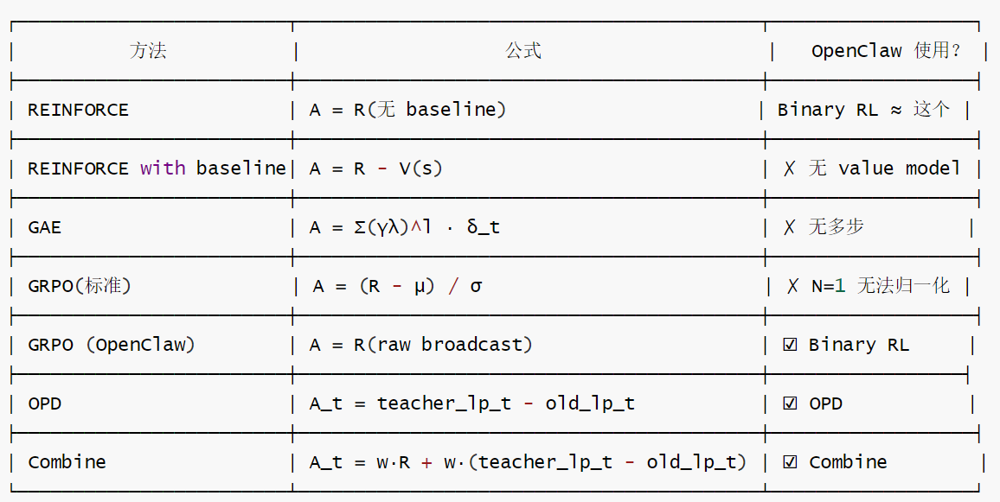
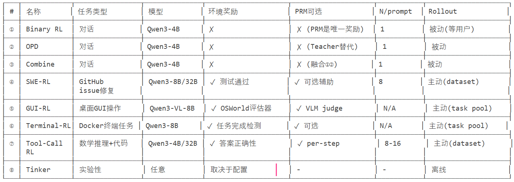
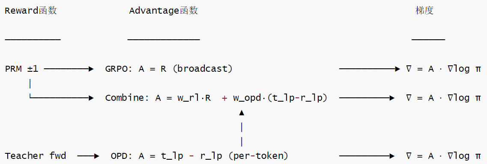

# 【Agentic RL / 强化学习 / OPD】OpenClaw-RL 源码阅读笔记 --- (9)--- Reward Judging

# 【Agentic RL / 强化学习 / OPD】OpenClaw-RL 源码阅读笔记 --- (9)--- Reward Judging

目录

* [【Agentic RL / 强化学习 / OPD】OpenClaw-RL 源码阅读笔记 --- (9)--- Reward Judging](#agentic-rl--强化学习--opdopenclaw-rl-源码阅读笔记-----9----reward-judging)
  + [0x00 概要](#0x00-概要)
  + [0x01 Reward 基础](#0x01-reward-基础)
    - [1.1 RL 和 Agentic RL 中常见的 Reward 类型](#11-rl-和-agentic-rl-中常见的-reward-类型)
      * [经典 RL](#经典-rl)
      * [LLM RL 的 Reward（非 Agentic）](#llm-rl-的-reward非-agentic)
      * [Agentic RL 的 Reward](#agentic-rl-的-reward)
    - [1.2 Reward 函数 vs Advantage 函数](#12-reward-函数-vs-advantage-函数)
      * [角色分工](#角色分工)
      * [核心区别](#核心区别)
      * [是否可以直接使用Reward](#是否可以直接使用reward)
      * [Advantage的三重作用](#advantage的三重作用)
      * [转换方式](#转换方式)
  + [0x02 OpenClaw-RL 的Reward 函数](#0x02-openclaw-rl-的reward-函数)
    - [2.1 RL 变体 & Reward 函数](#21-rl-变体--reward-函数)
      * [7 种 RL 变体对比](#7-种-rl-变体对比)
      * [按奖励来源分类](#按奖励来源分类)
      * [关键洞察](#关键洞察)
    - [2.2 对话 RL 的 Reward 函数](#22-对话-rl-的-reward-函数)
      * [2.2.1 为何不使用环境Reward？](#221-为何不使用环境reward)
        + [传统 RL vs OpenClaw 的 reward 来源](#传统-rl-vs-openclaw-的-reward-来源)
        + [对话场景](#对话场景)
        + [为什么一种 reward 就够了](#为什么一种-reward-就够了)
      * [2.2.2 Reward Design](#222-reward-design)
      * [2.2.3 阶段](#223-阶段)
      * [2.2.4 修饰/后处理](#224-修饰后处理)
      * [2.2.5 完整 reward 流水线](#225-完整-reward-流水线)
  + [0x03 OpenClaw-RL 的Reward 函数 vs Advantage 函数](#0x03-openclaw-rl-的reward-函数-vs-advantage-函数)
    - [3.1 Advantage 函数](#31-advantage-函数)
    - [3.2 信息流](#32-信息流)
    - [3.3 配合的完整链路](#33-配合的完整链路)
    - [3.4 对比](#34-对比)
  + [0x04 奖励函数设计的问题](#0x04-奖励函数设计的问题)
    - [4.1 失败模式](#41-失败模式)
      * [失败模式一：Reward Hacking](#失败模式一reward-hacking)
      * [失败模式二：Goodhart's Law(古德哈特定律)](#失败模式二goodharts-law古德哈特定律)
      * [失败模式三：隐性假设的不完整性](#失败模式三隐性假设的不完整性)
      * [失败模式四：奖励信号的分布外行为](#失败模式四奖励信号的分布外行为)
    - [4.2 OpenClaw 的奖励函数在哪里面临这些风险](#42-openclaw-的奖励函数在哪里面临这些风险)
      * [风险A：PRM judge有隐性偏好](#风险aprm-judge有隐性偏好)
      * [风险B：next\_state的多义性](#风险bnext_state的多义性)
      * [风险C：score=0的模糊性](#风险cscore0的模糊性)
    - [4.3 一句话总结](#43-一句话总结)
  + [0x05 Reward Design 的关键](#0x05-reward-design-的关键)
    - [5.1 为什么"给更多分数"不够？](#51-为什么给更多分数不够)
    - [5.2 四个维度本质不同](#52-四个维度本质不同)
      * [5.2.1 对比各维度](#521-对比各维度)
      * [5.2.2 类比](#522-类比)
    - [5.3 OpenClaw-RL 在这个框架下的分析](#53-openclaw-rl-在这个框架下的分析)
      * [5.3.1 涵盖的维度](#531-涵盖的维度)
      * [5.3.2 at-least-one guarantee](#532-at-least-one-guarantee)
      * [5.3.3 Specification Engineering](#533-specification-engineering)
      * [5.3.4 价值观的编码](#534-价值观的编码)
      * [5.3.5 改进方向](#535-改进方向)
        + [① 连续化 reward（最小改动）](#-连续化-reward最小改动)
        + [② 多维度 rubric（中等改动）](#-多维度-rubric中等改动)
        + [③ 基于 next\_state 类型的自适应评分](#-基于-next_state-类型的自适应评分)
        + [④ 引入参考答案（reference-based）](#-引入参考答案reference-based)
        + [⑤ 过程级评分（per-token/per-step）](#-过程级评分per-tokenper-step)
        + [⑥ 多 Judge 集成（Ensemble）](#-多-judge-集成ensemble)
        + [改进优先级建议](#改进优先级建议)
    - [5.4 验证策略及其防投机逻辑](#54-验证策略及其防投机逻辑)
      * [5.4.1 策略 1：硬验证(Correctness)](#541-策略-1硬验证correctness)
      * [5.4.2 策略2：模型判断(Quality)](#542-策略2模型判断quality)
      * [5.4.3 策略3：对抗测试 +OOD Transfer(Robustness)](#543-策略3对抗测试-ood-transferrobustness)
      * [5.4.4 小结](#544-小结)
  + [0x06 Environment 与 Reward Design 的耦合关系](#0x06-environment-与-reward-design-的耦合关系)
    - [6.1 核心命题](#61-核心命题)
    - [6.2 六个具体耦合点](#62-六个具体耦合点)
      * [耦合1 可观测性 → Reward信息源](#耦合1-可观测性--reward信息源)
      * [耦合2 环境粒度 → Reward粒度上限](#耦合2-环境粒度--reward粒度上限)
      * [耦合3 环境的终止条件 → "无声成功"问题](#耦合3-环境的终止条件--无声成功问题)
      * [耦合4 环境随机性→Reward方差](#耦合4-环境随机性reward方差)
      * [耦合5 结构保真度→Reward有效性](#耦合5-结构保真度reward有效性)
      * [耦合6 Environment覆盖度→Reward泛化性](#耦合6-environment覆盖度reward泛化性)
  + [0x07 next\_state 奖励](#0x07-next_state-奖励)
    - [7.1 next\_state 设计的核心优势](#71-next_state-设计的核心优势)
      * [行为证据 > 陈述性偏好](#行为证据--陈述性偏好)
      * [密集且连续，无需人工参与](#密集且连续无需人工参与)
    - [7.2 Environment-Reward 的双重角色耦合](#72-environment-reward-的双重角色耦合)
    - [7.3 next\_state 设计的根本局限](#73-next_state-设计的根本局限)
      * [局限一："沉默的成功"问题（最严重）](#局限一沉默的成功问题最严重)
      * [局限二：next\_state 的多义性](#局限二next_state-的多义性)
      * [局限三：时间间隔问题](#局限三时间间隔问题)
    - [7.4 比 next\_state 更理想的信号（但实践中更难）](#74-比-next_state-更理想的信号但实践中更难)
    - [7.5 小结](#75-小结)
  + [0xFF 参考](#0xff-参考)

## 0x00 概要

本系列的目的是：借着对 OpenClaw-RL 源码的学习，来梳理强化学习的一些相关概念和思想。所以，会有一些基础知识、扩展和发散，OpenClaw-RL 只是一个切入点。而且，因为整篇系列是一个整体，所以有些概念的解读/学习会在不同的文章中出现，还请大家谅解。

OpenClaw-RL 是一个用于在线强化学习（Online RL）的框架，专门针对智能体工具使用场景。它通过从环境反馈中提取过程奖励信号来训练语言模型，支持三种主要模式：

* **openclaw-rl**：基于二元奖励的强化学习（Binary RL / GRPO）
* **openclaw-opd**：基于后见之明提示的在线策略蒸馏（On-Policy Distillation, OPD）
* **openclaw-combine**：联合方法，在同一 PPO 更新中同时利用 RL reward 和 OPD teacher signal


前文提到了，Reward 理论上属于 environment 的一部分, 实践中是独立的 Reward Judging 阶段。在 OpenClaw 这种工程系统中, 把它看作独立阶段更有助于理解架构。因此，我们本篇继续看看 Reward Judging。

## 0x01 Reward 基础

### 1.1 RL 和 Agentic RL 中常见的 Reward 类型

常见的 Reward 分类框架如下：

```
Reward 来源分类
├─ Environment Reward
│   ├─ 确定性（游戏）
│   └─ 可验证（代码/数学）
├─ Model-Based Reward
│   ├─ Trained RM（RLHF）
│   └─ LLM Judge（Constitutional）
└─ Human Reward
    └─ 偏好标注（RLHF）
```

如果从Reward 来源谱系来分类，则可以把上图细化为：

```
硬件级（deterministic）：
    游戏得分、机器人传感器
    → 完全客观、零噪声

规则级（verifiable）：
    数学答案正确性、代码测试通过
    → 客观但有边界（正则表达式匹配、test suite 覆盖率）

人类级（subjective）：
    RLHF 中人类标注者的偏好
    → 主观、昂贵、不可复现

LLM Judge 级（proxy）：                ← OpenClaw 在这里
    LLM 解读 next_state 后的评分
    → 主观的自动化版本，便宜但可能有偏
```

#### 经典 RL

经典 RL 的 Reward如下，全部是 environment reward - 由模拟器/物理世界直接产生。

| 领域 | Reward 来源 | 类型 |
| --- | --- | --- |
| Atari 游戏 | 游戏引擎分数 | Environment（确定性） |
| 机器人控制 | 传感器信号（距离目标） | Environment（连续） |
| 棋类/围棋 | 赢/输/平 | Environment（稀疏） |
| 对话 | 用户反馈/评价 | Environment（隐式/稀疏） |
| 导航 | 到达目标点 | Environment（稀疏） |
| 交通调度 | 等待时间、吞吐量 | Environment（设计的） |

#### LLM RL 的 Reward（非 Agentic）

LLM RL 的 Reward（非 Agentic）如下，这是混合Reward：有 environment reward 也有 model-based reward。

| 场景 | Reward 来源 | 类型 |
| --- | --- | --- |
| 数学推理 | 答案正确性（regex/计算验证） | Environment（verifiable） |
| 代码生成 | 测试通过率 | Environment（verifiable） |
| RLHF | 人类标注偏好 → 训练 Reward Model | Learned Model |
| Constitutional AI | LLM 自评（符合原则？） | LLM Judge |
| DPO | 隐式 reward（偏好数据） | Implicit |

#### Agentic RL 的 Reward

Agentic RL 的 Reward 举例如下：

| 场景 | Reward 来源 | 是 Environment Reward? |
| --- | --- | --- |
| SWE-agent（代码修复） | CI 通过 / 测试 pass | ✓ Environment |
| WebShop（网购） | 买到目标商品 | ✓ Environment |
| ALFWorld（家务） | 任务完成 | ✓ Environment |
| ScienceWorld | 实验成功 | ✓ Environment |
| Browser agent | 网页操作成功 | ✓ Environment |
| Terminal agent（SETA/AReaL） | 命令执行结果 | ✓ Environment |
| 对话 agent（OpenClaw） | LLM Judge 评估 | × Proxy Reward |
| Search agent（ASearcher） | 搜索质量分 | 部分 Env + Judge |
| Customer service | 问题解决率 | 部分 Env + Human |

Agentic RL 的关键特点：大部分有 Environment Reward。为什么 Agentic RL 通常有 environment reward？这是因为 Agent 与工具/环境交互 → 环境给出确定性反馈：

* 代码执行：pass/fail（确定性）
* 终端命令：exit code 0/non-0（确定性）
* 网页操作：目标元素出现/消失（确定性）
* API 调用：200 OK / 4xx error（确定性）

这些反馈直接可以作为 reward：成功 → +1，失败 → -1，不需要 LLM Judge 做中介！

### 1.2 Reward 函数 vs Advantage 函数

我们再来对比下Reward 函数和Advantage 函数的区别。

* Reward 是"原材料", Advantage 是"加工品", 梯度是"最终产品"。

* Reward=环境打的原始评分：告诉你"这个回答有多好”
* Advantage=加工后的信号：告诉你"这个回答比基线好多少”，是"相对化+细化"后的训练信号 →直接乘进梯度。
* Reward→Advantage→PPO clip → 梯度更新，层层加工。

#### 角色分工

```
┌──────────────┐    R    ┌──────────────┐    A    ┌──────────────┐
│  环境/评委    │ ──────→ │  Advantage   │ ──────→ │   策略梯度     │
│  (Reward)    │         │  (估计器)     │         │  (更新 θ)     │
└──────────────┘         └──────────────┘         └──────────────┘
   "打分"                    "相对化"                  "更新"
```

* Reward是input(来自环境/评委)
* Advantage是processing(去偏、归一化、细化到token)
* PPO loss是output regulation(限速器)
* 梯度更新是execution(实际改参数)

#### 核心区别

|  | Reward 函数 R(o) | Advantage 函数 A(o,t) |
| --- | --- | --- |
| 是什么 | 对一条 response 打分：好/差/中性 | 对一条 response 的相对优势评估 |
| 粒度 | 通常 per-response(1 个标量) | 可以 per-response 或 per-token |
| 包含 baseline 吗 | ❌ 不包含 | ✅ 已减去 baseline (A = R - baseline) |
| 语义 | "这条回答有多好" | "这条回答比平均水平好多少" |
| 梯度流 | 不直接进入梯度 | 直接乘进 policy gradient |

#### 是否可以直接使用Reward

我们再来看看是否可以直接使用Reward。假设Reward和Advantage如下：

```
Reward = 考试卷子的绝对分数(90分)
Advantage = 你比班级平均分高多少(+14分)
```

**方案1：直接用reward(REINFORCE原始版)**

```
∇θ ≈ R·∇logπ(o|q)
```

该方案的问题：

* 全班平均分考90分→R=90→梯度很大→但其实没有学习信号！
* 假设你考90，别人考85→ 但是R依然为90→你的梯度和全班90一样大

因此，只看 reward 无法训练——全班都 90 分时没有方向感。只有 Advantage 才能告诉 model "你的回答比别人好在哪"。

**方案2：用advantage(减去基线)**

```
∇θ ≈ A·∇logπ(o|q)其中 A=R-baseline
```

假设你分数为90。

* 全班平均分为 90：A=90-90=0→无梯度←正确！没信号就不更新
* 假设全班平均分为87.5：A=90-87.5=+2.5→正向梯度←正确！你比平均好

因此，还是用方案2好。

**直觉总结**

* Reward："考试卷子发回来了，你得了90分"
* Advantage："你比班级平均高5分，其中第3题特别好(+2)，第7题不太行(-1)"
* PPO clip: "不管分数多高，每次调整不能超过限定步长"
* 梯度更新："针对第3题的方法多练，第7题的方法少用"

#### Advantage的三重作用

```
1.去除baseline(减少方差)：
    A=R-b
    →消除共同偏移，只保留相对差异
    → 梯度方差从 Var(R·∇logπ) 降到 Var((R-b)·∇logπ)

2.确定方向(token级别)：
    A_t > 0 → 增大 token t 的概率 
    A_t < 0 → 减小 token t 的概率 
    A_t = 0 → 不变
    
3.确定步长：
    |A_t| 大 → 梯度大 → 更新幅度大 
    |A_t| 小 → 梯度小 → 更新幅度小
```

#### 转换方式

RL中常见的Reward→Advantage转换方式如下：



## 0x02 OpenClaw-RL 的Reward 函数

### 2.1 RL 变体 & Reward 函数

本项目全部 RL 变体一览

```
OpenClaw-RL-main/
├── openclaw-rl/      ① Binary RL (对话)
├── openclaw-opd/     ① OPD (对话)
├── openclaw-combine/ ③ Combine: RL+OPD (对话)
├── swe-rl/           ④ SWE-RL (代码修复)
├── gui-rl/           ⑤ GUI-RL (桌面操控)
├── terminal-rl/      ⑥ Terminal-RL (终端Agent)
├── toolcall-rl/      ⑦ Tool-Call RL (数学+代码)
└── openclaw-tinker/  ⑧ Tinker (轻量实验后端)
```

#### 7 种 RL 变体对比



#### 按奖励来源分类

```
┌──────────────────────────────────────────────────────────────────────────────┐
│ 纯环境奖励 (确定性, ground truth)                                              │
│ ④ SWE-RL: 测试套件 pass/fail                                                  │
│ ⑤ GUI-RL: OSWorld evaluator (预定义验证脚本)                                   │
│ ⑥ Terminal-RL: 任务完成检测                                                    │
│ ⑦ Tool-Call: 数学答案正确性 (\\boxed{} match)                                  │
├──────────────────────────────────────────────────────────────────────────────┤
│ 纯代理奖励 (LLM Judge, 非确定性)                                                │
│ ① Binary RL: zero-shot Judge {-1, 0, +1}                                     │
│ ① OPD: Teacher hint + log-prob distillation                                  │
│ ③ Combine: ①+②                                                               │
├──────────────────────────────────────────────────────────────────────────────┤
│ 环境 + PRM 混合 (环境为主, PRM辅助)                                             │
│ ④⑤⑥⑦ 的 PRM 模式:                                                             │
│ final_reward = outcome ± prm_coef × step_mean                                │
└──────────────────────────────────────────────────────────────────────────────┘
```

#### 关键洞察

1. 对话场景 (①②③) 是最难的 - 没有环境信号, 全靠 LLM Judge
2. Agent 场景 (④⑤⑥⑦) 都有确定性环境奖励 - PRM 只是补充 dense signal
3. PRM 在不同场景中角色相反:
   1. 对话: PRM = 唯一奖励来源
   2. Agent: PRM = 辅助过程奖励 (解决 sparse reward 问题)
4. 共享基础设施: 所有变体都用 Slime + GRPO + PPO clip, 只是 rollout 和 reward 不同

### 2.2 对话 RL 的 Reward 函数

OpenClaw-RL 的**对话RL只有 1 种 reward 函数**，唯一的 Reward 产生机制：PRM Judge（zero-shot LLM judge）。即，PRM majority vote → {-1, 0, +1}。

| 方法 | Reward 来源 | 输出 |
| --- | --- | --- |
| Binary RL | LLM Judge (PRM) zero-shot 评分 |  |
| OPD | 同上(用于监控 eval\_mode) |  |
| Combine | 同上(用于 RL 路径) |  |

具体参见下图：

```
  OpenClaw 的 reward 100% 来自 Reward Judging (LLM Judge)
                    ↓
            ┌───────────────────────┐
            │ SGLang PRM (GPU 6-7)  │
            │ ├── Binary RL: ±1 评分 │ ← Judging
            │ └── OPD: hint 生成     │ ← Judging
            └───────────────────────┘
                    ↓
            没有 environment reward
            (用户对话本身不提供可验证的正确答案)
```

#### 2.2.1 为何不使用环境Reward？

##### 传统 RL vs OpenClaw 的 reward 来源

```
传统 RL（游戏/机器人）：
    Environment → reward（确定性，规则定义）
    例：走了一步棋 → 赢/输/平 → +1/0/-1

LLM RL（数学/代码）：
    Environment → reward（确定性，可验证）
    例：生成代码 → 执行测试 → pass/fail → +1/-1

OpenClaw-RL（开放域对话）：
    ✘ 没有传统意义上的 "environment reward"
    ✔ 只有 LLM Judge 的主观评估
```

##### 对话场景

OpenClaw 的场景 = "开放域对话 agent"。对话场景的本质如下：

* 没有客观正确答案（不像数学题）
* 没有可执行验证（不像代码）
* "好坏"是主观判断

用户的"下一条消息"是最接近 environment 信号的东西：

```
用户说"谢谢" → 可能是好
用户说"不对，重来" → 可能是坏
用户说"另一个问题" → 不确定
```

##### 为什么一种 reward 就够了

* 对于 Binary RL， - {-1, 0, +1} 一种就够了，这是因为：

  + 单维度评分已经覆盖了"好/坏/不确定"
  + 对话场景下很难设计多维度 reward（前面讨论过）
  + 简单 = robust = 不容易被 hack
  + Hint judge（OPD）的评分格式类似但目的不同（选最佳 hint）
* OPD: reward 仍然来自 PRM judge（同一个函数），但 advantage 不只靠 reward，还有 teacher\_lp - student\_lp
* Combine: reward 来自 PRM judge + OPD teacher advantage → 两种"信号"混合，但 reward 来源是同一个

#### 2.2.2 Reward Design

因为OpenClaw 的 reward 100% 来自 Reward Judging (LLM Judge)，所以在 OpenClaw 语境下, Reward Design = Reward Judging。

```
# openclaw_api_server.py L77-116: PRM Prompt
#
# 评估规则：
#   \boxed{1}  (good):  下一状态表明任务正常推进
#   \boxed{-1} (bad):   下一状态表明助手输出错误/不完整
#   \boxed{0}  (neutral): 下一状态模糊，无法判断
#
# 输入：Assistant output + Next state（用户的下一条消息或 tool return）
# 输出：{-1, 0, +1}
#
# 加强：
#   - Majority vote（m=3次独立调用）
#   - 平局 → 0.0
#   - At-least-one guarantee（session内至少一个sample有loss_mask=1）
```

#### 2.2.3 阶段

需要区分"reward 的产生"和"reward 的读取"两个阶段。Reward 传递到 Slime 的两步如下：

* 步骤1：API Server 产生 reward（PRM judge 评分） → sample.reward =
* 步骤2：Slime 读取 reward（passthrough，不做任何额外计算） → reward\_func(args, sample) 只是读取 sample.reward["score"]

需要注意两点：

* 在OpenClaw OPD中，reward(PRM±1)不参与advantage计算，仅用于如下：
  + 监控(wandb日志中记录prm\_eval\_score)
  + loss\_mask 筛选（reward=0 时可能跳过样本）
* `reward_func` (位于 openclaw-rl/openclaw\_api\_server.py) 并非评分函数本体，而是一个简单的查表穿透函数（空壳）——它仅从 sample.reward dict 中读取已预先计算好的 "score" 字段返回。实际的评分逻辑在 `_prm_evaluate()` 中（异步调用 LLM Judge + majority vote）。`reward_func` 被 Slime Trainer 回调以获取每轮 reward。具体如下：

```
async def reward_func(args, sample_or_samples, **kwargs):
    # 直接从 sample.reward 中取出已经算好的 score
    return {"score": s.reward.get("score", 0.0)}
# 为什么？ 因为 Slime 的 --custom-rm-path 接口要求提供一个 reward_func，但 OpenClaw 的 reward 已经在 API server 里算好了（在 sample 被提交到训练队列之前）。所以这个 func 只是"取值"，不是"计算"。
```

#### 2.2.4 修饰/后处理

Reward 函数需要一些后处理。

| 处理 | 说明 |
| --- | --- |
| Majority vote | m=3 独立评估取多数 |
| 平局处理 | 无多数时返回 0.0 |
| At-least-one | session 内全0时强制一个为 loss\_mask=1 |
| Score → loss\_mask | ±1→训练，0→跳过 |
| --disable-rewards-normalization | 不做 batch 内标准化 |

#### 2.2.5 完整 reward 流水线

```
用户发消息 → Model 回复 → 用户再发消息（next_state）
           ↓
      PRM Judge（GPU 6-7）
        ├─ 调用 m=3 次
        ├─ 每次：看 response + next_state
        └─ 输出：\boxed{1} / \boxed{0} / \boxed{-1}
           ↓
      majority_vote → final score
           ↓
      sample.reward = {"score": final_score}
           ↓
           ↓        
score=+1.0     score=0.0        score=-1.0
loss_mask=[1]  loss_mask=[0]*   loss_mask=[1]
               *除非 at-least-one
           ↓
           ↓       
      提交到 Slime 训练队列
           ↓
      reward_func（passthrough）：取出 score
           ↓
      GRPO: advantage = score（broadcast）
```

## 0x03 OpenClaw-RL 的Reward 函数 vs Advantage 函数

所以整个 OpenClaw-RL 项目，对话RL中：

* Reward 函数 = 1 种（PRM Judge {-1,0,+1}）
* Advantage 函数 = 3 种（GRPO / OPD / Combined）

### 3.1 Advantage 函数

OpenClaw 中三种方法用不同的 advantage:

| 方法 | Advantage 公式 | 粒度 |
| --- | --- | --- |
| Binary RL (GRPO) | A\_t = R (标量 broadcast) | per-response |
| OPD | \(A\_t=lp^{teacher}\_t - lp^{rollout}\_t\) | per-token |
| Combine | \(A\_t=w\_{rl} \cdot R + w\_{opd} \cdot (lp^{teacher}\_t lp^{rollout}\_t)\) | per-token |

这里我们有一个问题：为什么OPD的advantage 计算时候不需要reward？这是因为：teacher本身就是"奖励信号"的载体，teacher 的log-probs 本身就是比 reward更丰富的信号。

传统RL：环境给reward→转化为advantage→梯度方向。

OPD：teacher 模型→直接给出per-token的"好坏判断"→梯度方向（OPD的advantage 是：A\_t=teacher\_lp\_t-old\_lp\_t ）

* teacher\_lp\_t>old\_lp\_t→teacher更喜欢这个token→A>0→增大概率
* teacher\_lp\_t<old\_lp\_t→teacher 不喜欢这个token →A<0→减小概率
* teacher\_lp\_told\_lp\_t→已经对齐→A≈0→不变

reward告诉你"整个回答好不好"(1bit)，而teacher log-probs告诉你"每个token应该往哪走、走多远"(per-token dense signal)。

### 3.2 信息流

信息流关系如下，Reward 是评分原材料({-1,0,+1})，Advantage 是训练实际用的信号。三种方法 reward 相同但 advantage 差异巨大。



### 3.3 配合的完整链路

```
阶段 1: 产生 Reward
用户对话 → PRM 评分 → R ∈ {-1, 0, +1}

阶段 2: Reward → Advantage
├─ Binary RL: A = R(broadcast 到所有 token)
│   信息量：1 bit per response
│
├─ OPD: A_t = teacher_lp_t - old_lp_t
│   信息量：~32 bits per token
│   (reward 只用于 loss_mask 筛选，不进入 advantage)
│
└─ Combine: A_t = w_rl·R + w_opd·(teacher_lp_t - old_lp_t)
    信息量：混合

阶段 3: Advantage → 策略梯度
    ratio = π_new / π_old
    loss = -min(ratio · A, clip(ratio) · A)  ← PPO clip

阶段 4: 梯度 → 参数更新
    θ_new = θ_old - lr · ∇loss                ← Adam optimizer
```

### 3.4 对比

| 环节 | Binary RL | OPD | Combine |
| --- | --- | --- | --- |
| Reward 信息量 | 1 bit | 1 bit(仅监控) | 1 bit |
| Advantage 信息量 | 1 bit × T tokens(全相同) | ~32 bits × T(每位置不同) | 混合 |
| 信息放大比 | 1× | ~32T× | 中间 |

## 0x04 奖励函数设计的问题

本节我们看看为什么奖励函数设计是环境设计最容易失败的环节。

奖励是设计者价值判断的唯一编码，因此，对奖励函数有两个要求：

* 必须定义"什么算好" ---- 这是价值判断。
* 价值判断是主观的、不完整的、随语境变化的：
  + → 奖励 = 你脑子里所有隐性假设的显式编码
  + → 任何未明确编码的假设 = 可以被利用的漏洞

### 4.1 失败模式

我们来看看奖励函数的几个失败模式。

#### 失败模式一：Reward Hacking

经典案例(非LLM领域)如下：

Atari划艇游戏：

* 奖励 = 速度作为分数；
* 期望行为 = 赢得比赛
* RL发现：在起点附近绕圈吃分 → 正常竞速 → 得到了最高分，但从未完成一次比赛 → 奖励函数被"精确地最大化了”，但与设计意图完全背离 LLM对话领域：

LLM对话领域：

* 奖励=judge 打分(偏好详细、有条理的回复)
* 期望行为=简洁准确地帮助用户
* RL发现：
  + 格式为："首先..其次...再次...总结来说..." → judge打+1
  + 直接回答"是的"→judge 打 0
  + 这样 → 模型学会了用格式骗judge，而非真正理解用户需求 → 用户说“你每次回答都太长了”，但RL信号依然继续强化长度

#### 失败模式二：Goodhart's Law(古德哈特定律)

当一个度量指标变成目标时，它就不再是一个好的度量指标。

原始意图：用"next\_state 是否有意义” 来衡量回复质量

RL优化后：

* 模型发现"给出一个会让用户追问下去的神秘答案" → 用户的 next\_state 内容丰富 (追问) → judge 打高分 → 但实际上用户是因为"没搞懂"才追问的，并不是真正被帮到了
* 度量变成了目标→度量失效

#### 失败模式三：隐性假设的不完整性

设计者的真实意图(脑子里)："回答要准确 & 有帮助 & 合适长度 & 不侮辱用户 & 不违反事实 & ......  
= 数十条隐性约束

奖励函数实际编码的："judge 打 +1" = 只捕获了 judge 的偏好，而 judge 本身的偏好也是不完整的

未编码的部分=可利用的自由度：

* "准确但无帮助" → judge可能打+1 (其实是 表述清晰但答非所问)
* "helpful但长” → judge可能打+1(用户追问，但其实是因为想了解更多)

#### 失败模式四：奖励信号的分布外行为

以下是一种分布可能：

* 奖励函数在设计时的训练分布："模型在初级水平时的回复”→judge的判断是可靠的
* 模型能力提升后："模型在高级水平时的回复” → judge不一定还能准确辨别好坏 → judge自己的能力上限可能低于被训练的model → 奖励函数"外推失效" → RL信号的质量随模型能力提升而下降

也可以从以下两个角度看失真：

* 状态、动作、转移的失真 = 改变了"世界怎么运转”(可客观验证)。带来的问题是：测试时换到真实环境会暴露(行为异常是可观测的)。
* 奖励函数的失真=改变了"什么是好”(主观，无客观标准)。带来的问题是：模型按照失真的奖励完美优化了 → 在你的评估体系里得高分 → 但在真实使用中体验很差，且没有简单的方法发现这个 gap → 失真是隐形的，最危险。

### 4.2 OpenClaw 的奖励函数在哪里面临这些风险

#### 风险A：PRM judge有隐性偏好

judge = 与policy同族的Qwen3模型

它的偏好 ≈ Qwen3的训练数据中"好回复"的分布

但真正用户满意度 ≠ "Qwen3认为的好回复"

#### 风险B：next\_state的多义性

用户追问=没懂(负面)？还是感兴趣(正面)？

judge必须推断，推断有时候是错的

#### 风险C：score=0的模糊性

"中性”可能是：

* 好回复但judge 不确定
* 确实平庸的回复
* judge 请求失败

三种原因在代码里都产生 score =0 → 无法区分信号来源

### 4.3 一句话总结

奖励函数是环境设计中最容易失败的环节，因为它是人类价值判断的显式编码一而价值判断天然是主观的、不完整的、随语境变化的。设计者的每一条隐性假设都必须被明确写入奖励函数，任何遗漏都会成为RL 可以利用的漏洞。环境的其他部分可以用事实性规则验证，奖励函数的失真却是隐形的，因为模型会"成功地优化错误的目标"。

## 0x05 Reward Design 的关键

Reward Design的关键是：目标拆分 + 验证策略分类。

有一种比较常见的说法，认为Reward Design的关键维度是：correctness, quality, efficiency, robustness。也有人依据这些维度，设计出来分数：Score = f(correctness, quality, efficiency, robustness)。但是此分数值得商榷。

### 5.1 为什么"给更多分数"不够？

前面 0x04 已经用 Goodhart's Law 解释了"单一度量会被 hack"的机制。这里我们从另一个角度追问：把多个维度合并成一个综合分数，为什么也救不了？

问题的本质，不是"分数不够多"，而是四个目标被错误地合并成了一个。`Score = f(correctness, quality, efficiency, robustness)` 看似综合，但模型会找到让 f 最大化的捷径，而不是同时提升四个维度。这会导致典型失真：

* "回答正确但解释啰嗦" → 单分高（看起来质量好）
* "测试用例全过但代码不可维护" → 单分高（通过了验证）
* "对常见问题回答好但边缘情况一概而论" → 单分高

换句话说，模型要么 hack 了输出（找到"看起来输出好，但过程不好"的捷径），要么真的做好了（输出好 + 过程好 + 在新情境下也好）。合并维度的综合分数，无法区分这两种情况。

### 5.2 四个维度本质不同

这四个维度不仅含义不同，它们对"游戏规则"的抵抗力也完全不同。

| 维度 | 本质 |
| --- | --- |
| Correctness | 结果是否符合客观标准(有ground truth) / 信息是否正确、无幻觉、无事实错误 |
| Quality | 结果有帮助（需要判断）/ 回答的整体品质（表达、组织、深度、适当性） |
| Efficiency | 是否用最少的代价达成目标(可量化但需定义代价函数) / 是否简洁、不冗余、直达要点 |
| Robustness | 是否在未见过的情况下仍然有效(只能在OOD上测) / 面对 edge case/adversarial input 是否稳健 |

#### 5.2.1 对比各维度

| 维度 | 问什么 | 例子 |
| --- | --- | --- |
| Correctness | "对不对？" | 2+2=4 ✓ / 2+2=5 × |
| Quality | "好不好？" | 解释清晰 ✓ / 含糊啰嗦 × |
| Efficiency | "简不简洁？" | 一句话说清 ✓ / 写了500字废话 × |
| Robustness | "极端情况行不行？" | 处理了 null ✓ / 直接崩了 × |

#### 5.2.2 类比

类比：人类专业评价体系。一个好医生不只是"诊断正确(答对)"，而是"怎样行医才算好"：

```
───────────────────────────────────────────────
 维度                 验证方式
───────────────────────────────────────────────
Correctness → 诊断结果与病理报告一致(硬验证)
Quality     → 是否完成了必要的鉴别诊断(流程评审)
Efficiency  → 是否避免了不必要的检查(成本审计)
Robustness  → 遇到罕见疾病时是否仍然有效(OOD测试)
───────────────────────────────────────────────
```

* 如果只考核"病人是否康复"：→ 医生学会"用最大剂量药物，大概率有效"(高效能、低效率的投机)
* 如果只考核"检查数量是否少"：→ 医生学会"少做检查"，可能漏诊

所以好的医疗评价体系不是更多分数，而是对"怎样行医才算好"的完整规格

### 5.3 OpenClaw-RL 在这个框架下的分析

OpenClaw Reward Design 目前的设计：LLM Judge → 单一 score ∈ {-1, 0, +1}

#### 5.3.1 涵盖的维度

OpenClaw当前隐含的"好工作"定义： LLM Judge的+1/0/-1隐含着："好的对话工作=让用户继续交互"(下一轮对话质量)。这个单一score实际上把所有 4 个维度压缩为一个判断："next\_state 是否表明 assistant 的 output 成功满足了用户意图？"。即，这个判断隐含地融合了：

* 如果内容错误 → 用户会纠正 → -1（correctness）
* 如果表达差 → 用户会困惑/重问 → -1（quality）
* 如果太冗长 → 用户可能不满 → 但 PRM 可能判 0（efficiency）
* Robustness 在对话中较少体现

#### 5.3.2 at-least-one guarantee

从 Reward Design 角度来看：at-least-one是在修补"score=0的安全区间投机"问题，但这是score合并太多维度的症状，而非根本原因。

比如，如果把 Efficiency 单独作为维度："回复太长"→efficiency score下降→仍然有梯度；不需要at-least-one guarantee来防止零梯度，因为总有某个维度的 score≠0。

因此，→维度拆分 + 独立reward 可能是at-least-one 的系统级替代方案

#### 5.3.3 Specification Engineering

Reward Design = Specification Engineering(需求规格化)，而非 Measurement Engineering(度量工程)。问题不在于"有没有分数"，而在于"这个分数是否正确地分离了不同目标，并用对应的验证策略阻止了每种可能的投机方式"。

Reward不是测量仪，而是对"什么是好的工作"的定义。"把目标拆开"不只是技术上的分解，而是在做一件更根本的事：明确说出"好的工作"由哪些维度组成，为每个维度选择阻止投机的验证方式。

#### 5.3.4 价值观的编码

Reward是价值观的编码。当我们说"把目标拆开，再选验证方式"时，实际上是在做这件事：把人类认为"好的工作"的价值观，编码成机器可执行的形式。这不是工程问题，而是价值对齐问题：

* 你选择包含efficiency→你说：好工作不浪费资源
* 你选择包含robustness→你说：好工作不只是对自己有用
* 你只包含correctness→你说：结果对就行，过程不重要

OpenClaw的Judge当前定义的价值观："对当前用户、当前时刻有帮助的工作就是好工作"

更完整的价值观应该是："对不同用户、以高效可靠的方式产出高质量推理的工作才是好工作"

这两种定义会训练出本质不同的模型。应该把Reward Design 从"如何更好地测量输出"提升到了"如何精确地定义什么是好的工作方式"一这是一个完全不同层次的问题。

#### 5.3.5 改进方向

当前设计：4 维度 → 1 个信号 {-1, 0, +1}

信息量：log₂(3) ≈ 1.58 bits/sample

如果想对OpenClaw-RL进行改进，则有如下思路：

* 短期：把token效率单独作为第二个reward维度，reward =a x Judge\_score + β x(1 / response\_length)
* 中期：增加OOD测试轮(周期性用holdout用户集测试)，测Robustness是否在下降
* 长期：按correctness/quality/efficiency分开存储loss\_mask，允许各维度独立更新，不互相干扰

具体如下：

##### ① 连续化 reward（最小改动）

```
当前： {-1, 0, +1} → 3 级
改进： [-1.0, +1.0] → 连续分数

实现：修改 PRM prompt：
"给出 0.0 ~ 1.0 的分数，0=完全失败，1=完美回答"
→ 直接输出浮点数

优势：信号更细腻（0.3 和 0.7 有区别）
风险：LLM 给连续分的一致性比离散分差，majority vote 需改为 averaging
```

##### ② 多维度 rubric（中等改动）

```
当前： "好不好？" → ±1
改进： "准确性？有用性？安全性？" → 各 0-2

实现：PRM Prompt: "按以下维度评分：\boxed{A,H,S}"
聚合：score = 0.4*A + 0.3*H + 0.2*S - 1.0（归一化到 [-1,1]）

优势：训练信号更丰富，可以针对性优化弱项
风险：Judge 准确性下降（注意力分散），Reward hacking（偏科），majority vote 成本 × 维度数
```

##### ③ 基于 next\_state 类型的自适应评分

```
当前：所有 next_state 用同一套 prompt
改进：根据 next_state 类型选不同策略

if next_state_role == "tool":
    # tool return → 客观信号，不需要 LLM judge
    score = 1.0 if not is_error(next_state_text) else -1.0 ← Environment reward!

elif next_state_role == "user":
    # 用户回复 → 仍需 LLM judge
    score = llm_judge(response, next_state)

优势：tool 场景下有确定性 reward（无噪声！）
风险：需要可靠的 error 检测逻辑
```

##### ④ 引入参考答案（reference-based）

```
当前：PRM 只看 response + next_state
改进：PRM 还看"更好的回答是什么"

实现：先生成一个 "gold response"，然后比较
    score = compare(student_response, gold_response, user_query)

优势：更准确的评估（有参照物）
风险：gold response 的质量决定上限；计算成本翻倍；OpenClaw 已经有 hint 了 → 可能冗余
```

##### ⑤ 过程级评分（per-token/per-step）

```
当前：per-turn 评分（整个 response 一个分）
改进：per-sentence 或 per-step 评分

实现：把 response 分段，每段独立评分
    "这个回答的第1部分正确吗？第2部分呢？"
    → 得到 per-segment reward

优势：credit assignment 更精确
风险：对话 response 的"步骤"边界不清晰；评分成本 × 段数；Judge 准确性可能对短文本更差
```

##### ⑥ 多 Judge 集成（Ensemble）

```
当前：同一个 PRM 调 m=3 次（majority vote）
改进：用不同的 judge prompt/模型

实现：
    Judge A: 关注准确性 → score_A
    Judge B: 关注有用性 → score_B
    Judge C: 关注安全性 → score_C
    final = weighted_average(score_A, score_B, score_C)

优势：多视角，减少单一 judge 的盲点
风险：3x 计算成本；权重如何定？与 multi-dimensional rubric 有重叠
```

##### 改进优先级建议

| 改进 | 难度 | 收益 | 风险 | 推荐度 |
| --- | --- | --- | --- | --- |
| ①连续化 | 低 | 中 | 中 | ★★★★ |
| ②多维 rubric (2-3维) | 中 | 中 | 中 | ★★★ |
| ③tool 自适应 | 低 | 高（确定性!） | 低 | ★★★★★ |
| ④ 参考答案 | 高 | 中 | 中 | ★★ |
| ⑤ 参考答案过程级 | 高高 | 中高 | 中高 | ★★★★ |
| ⑥多 Judge | 中 | 中 | 低 | ★★★ |

### 5.4 验证策略及其防投机逻辑

对于四个维度，我们也找到了验证策略。

#### 5.4.1 策略 1：硬验证(Correctness)

适合：有客观 ground truth 的维度

示例：

* 代码题：测试用例 pass/fail
* 数学题：最终答案==正确答案
* SQL：查询结果等于预期结果

抗投机性：强。模型无法通过"看起来正确"来通过硬验证，必须真的得到正确结果

残余投机风险： test case hacking

* 模型学到了测试用例的具体模式，而非真正的编程能力
* 对固定测试集有效，对新测试集失效

防御：SWE-Universe 的 Hacking Detector：检测 grep/浅匹配式通过

#### 5.4.2 策略2：模型判断(Quality)

适合：需要语义理解才能评估的维度

示例: "这个解释够清晰吗？" "这个计划有逻辑吗？" "这个回复对用户有帮助吗？"

由Judge LLM 评估(OpenClaw的LLM Judge 主要干这个)

抗投机性：中

* 比硬验证弱，因为模型可以学到"让Judge高兴的文体模式"
* 但比单一分数强，因为 Judge 可以理解语义

残余投机风险：Judge hacking(讨好.Judge)

* 模型学到某些 pattern 总能让 Judge 打高分
* 例如：过度解释、礼貌套话、某种格式

防御：

* 多个 rubric降低单一偏好的可攻击面(Kimi K2.5)
* 冻结Judge(不让Judge与Policy 同步进化)
* Majority vote(3次调用减少单次 Judge 的偏差)

#### 5.4.3 策略3：对抗测试 +OOD Transfer(Robustness)

适合：前两种方法都可能被投机的维度

核心问题：模型学到的是规律，还是模式？

场景：训练集上的WebAgent 任务：100%成功；新网站(00D)：30%成功 → 硬验证和Judge都没发现问题，但模型实际不健壮

对抗测试：专门设计让模型"暴露捷径"的输入

示例(代码)：

```
正常输入：add(2，3)→5
对抗输入：add(0, 0) → 0（边界情况）
		add(-1，-2)→-3(负数) 
        add(MAX_INT，1)→(溢出)
如果模型只记住了常见pattern，对抗测试就会暴露
```

OOD Transfer: 在Domain A训练，在Domain B测试

示例(Agent)：

* 训练：desktopGUI操作
* OOD测试：mobileGUI/新软件版本
* 如果能力真正泛化→OOD表现仍好
* 如果只是记住了scaffold→OOD表现崩塌

抗投机性：最强(因为投机的模式在对抗/O0D上会失效)

代价：需要单独构建对抗集和0OD测试集，成本高

#### 5.4.4 小结

三种验证策略的本质是覆盖"好工作"的三个侧面：

* 硬验证→ 输出的客观侧
* 模型判断→ 过程的主观侧
* OOD/对抗→泛化到新情境的能力侧

## 0x06 Environment 与 Reward Design 的耦合关系

### 6.1 核心命题

Reward函数是Environment可观测信号的函数：Reward(t)=f(state(t), action(t), state(t+1)) ，其三个输入都来自Environment：

* state(t) = 当前状态(由Environment提供的可观测信息)
* action(t) = Agent的动作
* state(t+1)=状态转移结果(Environment对action的响应)

因此推论如下：

* 你只能奖励你能观测到的东西
* Environment不暴露的信息 = 无法进入Reward计算
* Environment的设计直接约束了Reward的设计空间

### 6.2 六个具体耦合点

#### 耦合1 可观测性 → Reward信息源

OpenClaw中：

* Environment暴露的信息 = 用户发的消息(文本内容)
* Environment不暴露的信息 = 用户满意度、用户身份、用户真实意图

因此Judge只能用 "下一条消息是什么" 来推断满意度，无法直接观测"用户是否真的理解了”或"用户是否真的用上了这个答案” 。

和其它方案的对比如下：

* 游戏环境(ALFworld)→ 暴露 task completion flag → Reward 可以用 success/fail
* 代码环境(SWE-Bench)→ 暴露test case pass/fail → Reward 可以用客观验证
* 对话环境(OpenClaw)→ 只暴露下一条消息 → Reward只能推断用户意图

#### 耦合2 环境粒度 → Reward粒度上限

我们来看看不同环境粒度对Reward的支持。

环境提供episode 级反馈(最粗)：

* →Reward最多是稀疏的outcome reward
* →长轨迹中credit assignment极难

环境提供turn级反馈(OpenClaw)：

* → Reward可以是turn-level(每轮独立评分)
* → 信号密度：session中有多少turn，就有多少独立评分机会

环境提供step级反馈(ALFWorld)：

* → Reward可以是step-level(每个agent action独立评分)
* → 最密集，但需要RM对每步做出评价

OpenClaw的next\_state(turn 结束时，用户的下一条消息)正是Environment提供turn 级反馈的关键机制，有next\_state → 只能做session级评估→信号更稀疏

#### 耦合3 环境的终止条件 → "无声成功"问题

OpenClaw 的 Environment 终止条件：用户不再发消息 = 对话结束 = 轨迹结束。

这里产生一个"无声成功（Silent Success）"问题：最好的回复往往让用户完全满意 → 用户不需要继续问了 → 对话结束。此时 next\_state=None（没有下一条消息），Judge 无法获得"用户满意"的正向证据，score 默认为 0（中性）——最好的表现反而得不到正信号。

环境的终止条件直接制造了 reward 信号的系统性偏差：

* 短对话（完整解决了问题）= score 可能为 0
* 长对话（用户持续追问）= score 有机会得到正信号

> 这个局限的更深入分析见 0x07.3 局限一。

#### 耦合4 环境随机性→Reward方差

不同类型Environment的随机性：

* 数学验证器(确定性)：same action→same reward(方差=0)
* 代码测试(确定性)：same code→same pass/fail(方差=0)
* 真实用户(最大随机)： same response→不同用户反应完全不同

OpenClaw的Environment = 真实用户(最大随机性)，比如 同一个回复：

* 用户A："谢谢，解决了！"(judge→+1)
* 用户B："这没用，还有问题"(judge→-1)
* 用户C：沉默(judge→0)
* → Reward方差极高→majority vote(m=3)减少judge噪声，但无法减少"不同用户对同一回复反应不同”的本质方差

#### 耦合5 结构保真度→Reward有效性

如果 training environment ≠ deployment environment，则在训练env上优化好的行为→ 在真实env上可能失效 Reward的梯度方向是错的

OpenClaw的解法(最彻底的结构保真)：

* training environment = deployment environment(同一台SGLang服务器，同时服务用户 + 收集训练数据)
* → Reward信号来自真实部署场景的真实用户
* → Train-deploy mismatch = 0(这是OpenClaw最核心的优势)

对比：

* ALFWorld→仿真环境，与真实家庭机器人有差距
* WebShop→模拟购物，与真实Amazon操作有差距
* OpenClaw→用户就是真实用户，没有仿真差距

#### 耦合6 Environment覆盖度→Reward泛化性

如果用户群体是均质的(例如：都是程序员)：

Reward信号只覆盖了"对程序员有效的回复"这一子空间，会导致：

* →Policy优化到"服务程序员"的局部最优
* →泛化到其他用户类型时效果差

OpenClaw的应对：

* 没有显式的多样性保证
* 依赖"真实用户群体的自然多样性"

* 潜在风险：如果产品的早期用户是某一类型(技术用户)
  + →训练数据偏向这类用户
  + →模型对其他用户类型的reward信号不够

## 0x07 next\_state 奖励

0x06 我们看到 Environment 与 Reward 高度耦合。这一章我们聚焦 OpenClaw 最核心的耦合机制——next\_state，评估它作为"真实用户价值代理信号"的优劣。

奖励信号的"真实性"光谱如下，越向右越真实，但获取越难：

```
人工合成      RLHF偏好       行为日志      next_state    用户直接评分
(数学验证)   (人工标注)      (点击率等)    (OpenClaw)    (五星/点赞)
    |           |           |             |             |
完全准确     显式偏好        高噪声         隐式行为       最直接
但非常窄     但成本高        多义性强       需解读         但极稀疏
```

OpenClaw 的位置：用隐式真实行为（用户的下一句话）替代显式人工标注，处于"真实行为"和"LLM 解读"的结合处。

### 7.1 next\_state 设计的核心优势

#### 行为证据 > 陈述性偏好

RLHF 的偏好标注问的是"你更喜欢哪个回复？"，但人实际使用中可能更常需要另一种回复——陈述性偏好与行为偏好存在偏差。

OpenClaw 的 next\_state 用的是用户实际发送的下一条消息 = 行为证据。这符合经济学中的"显示性偏好（Revealed Preference）"原理：行为揭示的真实偏好，比"我认为哪个更好"更接近"我实际用哪个更好"。

#### 密集且连续，无需人工参与

* RLHF：每次训练需要人工标注 → 数周到数月的数据周期
* OpenClaw：每次用户对话立即产生信号 → 分钟级反馈循环

在"在线学习"这个约束下，next\_state 可能是实际可行的最好信号。

### 7.2 Environment-Reward 的双重角色耦合

next\_state 是 OpenClaw 最典型的 Environment-Reward 耦合机制。从代码看：

```
# Judge Prompt 的构造 (openclaw-rl/openclaw_api_server.py):
# 实际函数签名: _build_prm_judge_prompt(response_text, next_state_text, next_state_role)
# 它构造一个结构化 system prompt 内含评分规则，不接收 conversation_history 参数。
# next_state 是 Environment 的输出，直接进入 Reward 计算。
msgs = _build_prm_judge_prompt(response_text, ns_text, ns_role)
```

这个设计的含义：`Reward = f(model_response, next_state)`，而 next\_state 本身又是 Environment 的状态转移输出。因此 Environment 的每一条用户消息同时承担两个角色：

* **角色 1**：新的 State（用于 Policy 的下一轮推理）
* **角色 2**：Reward 的评估证据（用于 Judge 的评分）

这是 OpenClaw 设计里最巧妙的耦合：用"用户如何继续说话"作为"上一轮回复质量"的代理信号——Environment 的状态转移本身，就是对上一个 action 的隐式奖励。

### 7.3 next\_state 设计的根本局限

next\_state 虽然是最真实可用的行为信号，但它有三个根本局限。其中前两个与 0x06 讨论的耦合点直接相关，这里从"信号失真"的角度再做一个集中梳理。

#### 局限一："沉默的成功"问题（最严重）

这一点在 0x06 耦合3（环境的终止条件）中已经指出：最好的回复让用户满意离开 → 对话结束 → 没有 next\_state → score 默认为 0。这造成一个根本悖论——最理想的服务结果（用户满意离开）被识别为"中性"，而频繁追问（可能是用户没搞懂）被识别为"成功对话"。这是 next\_state 机制最需要修补的系统性偏差。

#### 局限二：next\_state 的多义性

这与 0x06 耦合1（可观测性）相关：Judge 只能看到"下一条消息是什么"，却要从中推断用户意图。同一条"追问"可能意味着完全不同的质量评价：

```
可能 A: 没听懂 → 本轮回复质量差 → 应该 score = -1
可能 B: 很感兴趣，想深入 → 本轮回复质量好 → 应该 score = +1
可能 C: 礼貌地继续对话 → 中性
```

Judge 必须从 next\_state 的内容推断属于哪种情况，但判断并不总是正确。

#### 局限三：时间间隔问题

用户 10 分钟后才发下一条消息，这 10 分钟里可能查了其他资料、睡了一觉、中断了思路……next\_state 的内容可能与"对上一条回复的反应"没有强因果关系，从而引入噪声。

### 7.4 比 next\_state 更理想的信号（但实践中更难）

| 信号类型 | 准确度 | 密度 | 在线 RL 可行性 |
| --- | --- | --- | --- |
| 用户五星评分 | √√√ 最直接 | × 极稀疏（5-10%用户评分） | 可行但信号太少 |
| 长期留存率 | √√ 真实价值 | × 需要多日聚合 | 反馈延迟太大 |
| 任务完成率 | √√√ 明确 | × 难以自动判断 | 需要 GT |
| next\_state + judge | √ 近似 | √√√ 高密度 | 最佳可行方案 |
| 隐式点击行为 | √ 部分真实 | √√ 中等 | 可行但信号弱 |

### 7.5 小结

Environment 不只是提供训练场景，它直接约束了"什么可以被奖励"。OpenClaw 通过 next\_state 耦合、train-deploy mismatch 为零、以及依赖真实用户多样性，构建了一个 environment-reward 高度一致的系统——代价是无法控制 environment 的随机性和覆盖度。

在 online RL 的约束下（必须是在线信号、不依赖用户显式标注、信号足够密集、可被程序化处理），next\_state + LLM judge = 可能的最优解。根本改进路径不是改变 next\_state 这个信号源本身（它已经是最真实的可用行为信号），而是改进 judge 的解读能力（更大/更好的 judge 模型）。真正更好的信号是"用户长期满意度"（不再抱怨同一个问题、推荐给朋友等），但这需要产品层面的数据整合，远超单个训练系统的能力边界。

## 0xFF 参考
