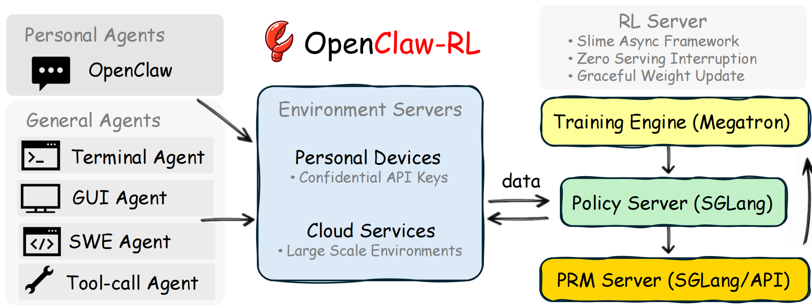
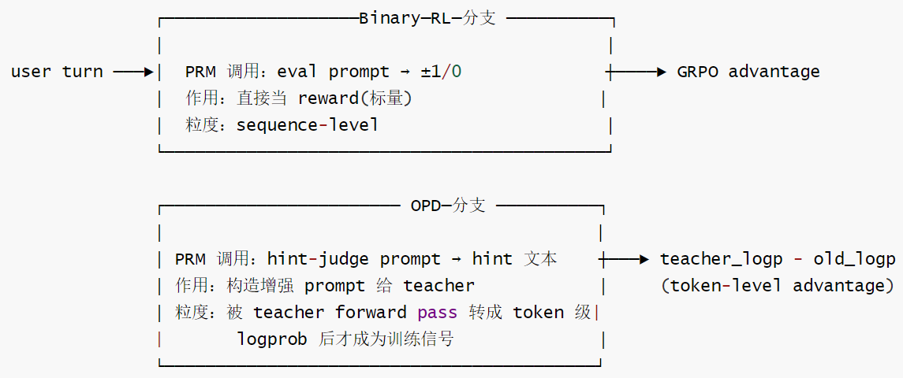
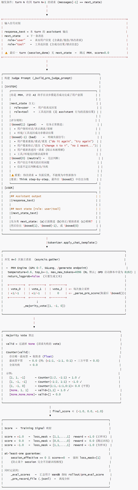
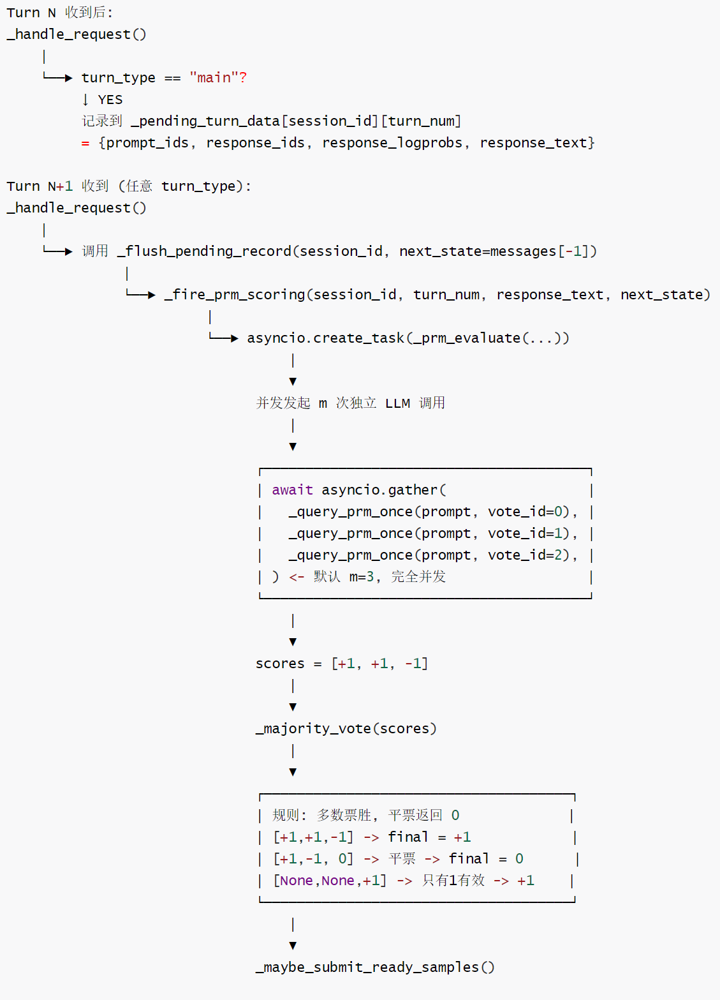
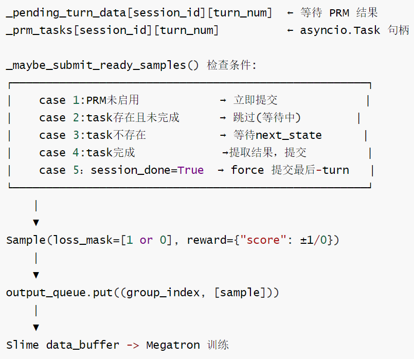
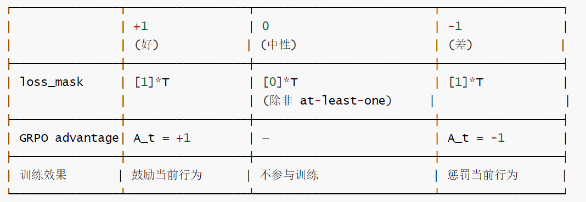

# 【Agentic RL / 强化学习 / OPD】OpenClaw-RL 源码阅读笔记 --- (10)--- PRM

# 【Agentic RL / 强化学习 / OPD】OpenClaw-RL 源码阅读笔记 --- (10)--- PRM

目录

* [【Agentic RL / 强化学习 / OPD】OpenClaw-RL 源码阅读笔记 --- (10)--- PRM](#agentic-rl--强化学习--opdopenclaw-rl-源码阅读笔记-----10----prm)
  + [0x00 概要](#0x00-概要)
  + [0x01 基础知识](#0x01-基础知识)
    - [1.1 PRM如何解决Agentic RL的稀疏梯度问题](#11-prm如何解决agentic-rl的稀疏梯度问题)
      * [1.1.1 稀疏梯度的根本原因](#111-稀疏梯度的根本原因)
      * [1.1.2 PRM的解决思路](#112-prm的解决思路)
      * [1.1.3 真正的 PRM 长什么样（数学题/Agent 任务）](#113-真正的-prm-长什么样数学题agent-任务)
      * [1.1.4 PRM 如何实现密集监督（具体机制）](#114-prm-如何实现密集监督具体机制)
      * [1.1.5 PRM 不能完全解决的问题](#115-prm-不能完全解决的问题)
      * [1.1.6 PRM 和 ORM 的数学关系](#116-prm-和-orm-的数学关系)
    - [1.2 PRM与环境奖励的区别](#12-prm与环境奖励的区别)
    - [1.3 小结](#13-小结)
  + [0x02 OpenClaw-RL 的PRM](#0x02-openclaw-rl-的prm)
    - [2.1 命名 vs 实际](#21-命名-vs-实际)
      * [2.1.1 位置](#211-位置)
      * [2.1.2 vs 传统 PRM](#212-vs-传统-prm)
    - [2.2 设计思路](#22-设计思路)
    - [2.3 环境反馈](#23-环境反馈)
      * [2.3.1 统一的环境概念](#231-统一的环境概念)
        + [用户(User)作为环境](#用户user作为环境)
        + [工具(Tool)作为环境](#工具tool作为环境)
      * [2.3.2 关键区分](#232-关键区分)
    - [2.4 为什么选择PRM而非直接环境奖励？](#24-为什么选择prm而非直接环境奖励)
    - [2.5 PRM 的使用](#25-prm-的使用)
      * [2.5.1 下一个状态 next\_state](#251-下一个状态-next_state)
      * [2.5.2 分支说明](#252-分支说明)
    - [2.6 OpenClaw-RL 的 PRM 本质](#26-openclaw-rl-的-prm-本质)
      * [ORM：名义 PRM，实为 ORM](#orm名义-prm实为-orm)
      * [OPD：teacher log-prob 是隐式 PRM](#opdteacher-log-prob-是隐式-prm)
      * [关键差异本质](#关键差异本质)
      * [为什么Combine会有效](#为什么combine会有效)
    - [2.7 PRM 模型](#27-prm-模型)
    - [2.8 Policy Server vs PRM Server](#28-policy-server-vs-prm-server)
      * [Policy Server(策略服务器)](#policy-server策略服务器)
      * [PRM Server(Process Reward Model Server，过程奖励模型服务器)](#prm-serverprocess-reward-model-server过程奖励模型服务器)
      * [两者的关系数据流：](#两者的关系数据流)
  + [0x03 PRM 流程](#0x03-prm-流程)
    - [3.1 总体流程](#31-总体流程)
    - [3.2 BinaryRL分支中的PRM](#32-binaryrl分支中的prm)
    - [3.3 OPD分支中的PRM](#33-opd分支中的prm)
    - [3.4 评分流程](#34-评分流程)
      * [Majority Vote](#majority-vote)
      * [At-Least-One Guarantee](#at-least-one-guarantee)
      * [异步提交](#异步提交)
      * [整体评分行为总结](#整体评分行为总结)
  + [0x04 显式PRM vs OPD teacher log-prob](#0x04-显式prm-vs-opd-teacher-log-prob)
    - [4.1 两者的核心问题](#41-两者的核心问题)
    - [4.2 差异一：评估的对象](#42-差异一评估的对象)
    - [4.3 差异二：反事实能力](#43-差异二反事实能力)
    - [4.4 差异三：信号的绝对性 VS 相对性](#44-差异三信号的绝对性-vs-相对性)
    - [4.5 差异四：hint 带来的"上帝视角"](#45-差异四hint-带来的上帝视角)
  + [0x05 显式PRM+OPD的理论结合方案](#0x05-显式prmopd的理论结合方案)
    - [5.1 两者的互补性分析](#51-两者的互补性分析)
      * [优劣分析](#优劣分析)
      * [优势互补](#优势互补)
    - [5.2 方案一：PRM 作为 OPD 的有效域门控](#52-方案一prm-作为-opd-的有效域门控)
    - [5.3 方案二：层级式 Advantage(乘法结合)](#53-方案二层级式-advantage乘法结合)
    - [5.4 方案三：和 Combine 的统一视角](#54-方案三和-combine-的统一视角)
    - [5.5 理论最优组合](#55-理论最优组合)
    - [5.6 实践挑战(为什么还没人做)](#56-实践挑战为什么还没人做)
    - [5.7 一句话总结](#57-一句话总结)
  + [0xFF 参考](#0xff-参考)

## 0x00 概要

本系列的目的是：借着对 OpenClaw-RL 源码的学习，来梳理强化学习的一些相关概念和思想。所以，会有一些基础知识、扩展和发散，OpenClaw-RL 只是一个切入点。而且，**因为整篇系列是一个整体，所以有些概念的解读/学习会在不同的文章中出现，还请大家谅解**。

OpenClaw-RL 是一个用于在线强化学习（Online RL）的框架，专门针对智能体工具使用场景。它通过从环境反馈中提取过程奖励信号来训练语言模型，支持三种主要模式：

* **openclaw-rl**：基于二元奖励的强化学习（Binary RL / GRPO）
* **openclaw-opd**：基于后见之明提示的在线策略蒸馏（On-Policy Distillation, OPD）
* **openclaw-combine**：联合方法，在同一 PPO 更新中同时利用 RL reward 和 OPD teacher signal



OpenClaw-RL使用了 PRM，但它不是传统意义上的 "Process Reward Model"。OpenClaw 的代码中叫 "PRM"，但实际是 "LLM Judge" 或更像是 "Outcome Reward Model (ORM)"。

```
外部环境 → Agent Serving → SGLang → 用户响应
    ↓
Rollout Collection → 样本构建 
	↓
PRM/Judge Evaluation → 奖励生成 
	↓
Policy Training ← 训练样本 + 奖励
	↓
新策略模型 → Agent Serving(更新)
```

本篇我们来仔细解读下。

## 0x01 基础知识

### 1.1 PRM如何解决Agentic RL的稀疏梯度问题

#### 1.1.1 稀疏梯度的根本原因

不用PRM时，我们来看看ORM(Outcome Reward Model)的效果，具体如下：

```
step1    step2   step3   step4   step5(终止)
  0        0       0       0      r=+1
```

当反向传播时：

* 只有step 5收到梯度信号
* step1-4：r = 0 → advantage ~ 0 → 梯度 ~ 0

模型完全不知道step1-4 做得好不好

#### 1.1.2 PRM的解决思路

PRM本质：一个函数r(s\_t，a\_t) → 当前步骤的即时质量分数。PRM的解决思路是：把稀疏信号变成密集信号引入PRM

```
step1    step2   step3   step4   step5(终止)
r1        r2       r3      r4      r5
```

PRM在每一步评估："这一步做得对不对？"，于是 → episode内每步都有梯度信号 → dense reward

#### 1.1.3 真正的 PRM 长什么样（数学题/Agent 任务）

数学PRM(如Math-Shepherd)，对推导过程每一步打分：

* "Step 3的推导方向是对的“ → r3=+0.8
* "Step 5引入了错误假设“ → r5=-0.6
* "Step 7的计算是正确的“ → r7=+0.9

Web Agent PRM:

* “点击搜索按钮是正确的操作” → r2=+0.7
* “点击了错误的商品类别“ → r4=-0.3

#### 1.1.4 PRM 如何实现密集监督（具体机制）

训练数据构建方式(以数学题为例)：

方式1：Human Annotation

* 人工标注每步是否正确→有监督训练PRM

方式2：Monte Carlo采样(无监督):

* 在step t之后，采样 K条续写
* K条中有m条最终答对
* P\_correct(step\_t)=m/K → 这就是stept的"过程奖励“

理论依据：P\_correct(step\_t)= V\*(s\_t)=E[最终成功 I 到达s\_t]

#### 1.1.5 PRM 不能完全解决的问题

问题1：PRM本身需要训练数据

* 需要收集过程级别的标注(比ORM成本高得多)

问题2：PRM的分布偏移

* PRM在某个policy的数据上训练
* 当policy 更新后，distribution 变化
* PRM打的分可能不再准确→需要定期更新PRM

问题3：PRM可能被“黑"(Reward Hacking2.0)

* 模型学会在每个步骤都“表现得符合PRM的评判标准”，而不是真正在解决问题

#### 1.1.6 PRM 和 ORM 的数学关系

ORM(稀疏)：

```
R_episode = r_terminal(仅episode 末端)
advantage_t = E[R_episode| s_t,a_t] - V(s_t)
            = 很难估计(需要大量rollout才能统计期望)
```

PRM(密集)：

```
R_step=r_PRM(s_t，a_t)(每步即时分)
```

可以选择：

* 仅用即时分：advantage\_t = r\_PRM\_t
* 折扣累积：advantage\_t = ∑vkr\_PRM\_{t+k}(GAE/TD)
* 过程 + 结果混合：advantage\_t = r\_PRM\_t+y\*r\_terminal(仅最后)

### 1.2 PRM与环境奖励的区别

PRM VS 环境奖励：PRM是人工构造的评估机制，环境奖励是自然产生的反馈信号。

PRM(过程奖励模型)定义

* PRM是Process Reward Model的缩写，是一种人工设计的评估机制：
* 评估方式：基于助手响应和下一状态进行质量判断
* 信号来源：由专门的LLM模型(通常是同一基础模型)执行评估
* 评分标准：预定义的规则(+1/-1/0)判断任务是否成功完成
* 实现机制：通过构建特定提示模板，让LLM扮演评估者角色

环境奖励定义

* 环境奖励是真实环境中自然产生的反馈信号：
* 评估方式：直接来自环境的状态变化或用户行为
* 信号来源：真实的系统响应、用户后续行为、任务完成状态
* 评分标准：环境本身的成功/失败指标(如工具返回码、任务完成度)
* 实现机制：直接观察环境状态变化，无需额外的评估模型

在MDP 形式化中：Environment=(S，A，T，R，γ)，其中 R 是 reward function，通常被视为 environment  
的一部分。所以从纯理论角度，Reward Model也可以算 environment的组成部分。

但在现代LLM RL的工程实践中：Environment(信息来自外部)和Reward Model(独立计算的评估)在系统架构上被明确分离原因如下：

* 真实reward(用户满意度)无法直接观测，Reward Model是对真实reward的近似(代理)
* Environment是不可控的(真实用户)，Reward Model是可设计的
* 两者的计算位置不同(GPU 4-5 VS GPU 6-7)
* 两者的作用时机不同(state transition时vs回复完成后异步)

结论：在OpenClaw-RL 的架构中，PRM/Judge 明确属于Reward.Judging。它使用了Environment(用户)产生的 next\_state 作为评估依据，但评分计算本身是一个独立的Reward Judging 过程。

### 1.3 小结

OpenClaw 的代码中叫 "PRM"，但实际是 "LLM Judge" 或 "Outcome Reward Model (ORM)"。

| 属性 | 传统PRM | OpenClaw "PRM" |
| --- | --- | --- |
| 类型 | 训练好的 reward model | Zero-shot LLM judge |
| 粒度 | Step-level (每步) | Response-level(整体) |
| 输出 | 连续分数 [0,1] | 离散 |
| 训练 | 需要标注+训练 | 不需要训练 |
| 评分依据 | 学到的特征 | Prompt 指导 |

## 0x02 OpenClaw-RL 的PRM

OpenClawRL不直接使用传统意义上的环境奖励，而是主要使用PRM，将环境反馈作为 PRM评估的输入。PRM/Judge 属于 Reward Judging， 不是 Environment。

这种设计体现了OpenClaw-RL的解耦思想：

* 环境无关性：训练算法不直接依赖特定环境的奖励机制
* 评估标准化：所有场景都通过统一的PRM接口生成奖励
* 灵活性：可以轻松调整评估标准而不影响核心训练逻辑

通过PRM机制，OpenClaw-RL能够：

* 有效利用环境反馈：将真实的用户交互转化为高质量训练信号
* 保持训练稳定性：避免稀疏或噪声环境奖励导致的训练不稳定
* 支持复杂任务：处理需要语义理解的复杂交互场景

### 2.1 命名 vs 实际

#### 2.1.1 位置

在 OpenClaw-RL 的四个阶段中，PRM/Judge 属于 Reward Judging， 不是 Environment

```
=========================================================================
GPU 4-5: Policy Serving (SGLang)          ← Environment
→ 为真实用户提供对话服务                        Environment = 用户提供的 状态转移
→ 接收用户消息，生成模型回复
→ 捕获 next_state(下一条用户消息)

=========================================================================
GPU 6-7: Reward Judging (SGLang PRM)      ← Reward Judging
→ 接收完成的对话 turn                         独立计算 reward，不参与状态转移
→ 调用 LLM Judge 评分 ×3(多数投票)
→ 输出 +1/0/-1，设置 loss_mask

=========================================================================
GPU 0-3: Policy Training (Megatron Actor)
→ 接收带 reward 的 sample，更新权重
```

#### 2.1.2 vs 传统 PRM

传统 PRM (Process Reward Model):

* 收集人类偏好数据 (chosen/rejected pairs)
* 训练一个 reward model:R = f\_Φ(prompt, response)
* 对推理过程的每一步打分 (step-level reward)
* 需要标注数据训练
* 固定Φ，用 R 指导 policy 训练
* 特点：
  + 确定性：相同输入 → 相同分数
  + 训练成本高(需要人类标注)
  + 可能有 reward hacking

OpenClaw 的 "PRM":

* 本质是 LLM Judge，用同族模型 (Qwen3) 做 zero-shot 评分
* 不需要训练，用自然语言 prompt 描述评分标准，用 prompt 指导评分，对整个回答打分 (response-level reward)
* 输出boxed{1}/\boxed{0}/\boxed
* majority vote (m=3)降噪
* 特点：
  + 随机性：相同输入→可能不同分数(temperature>0)
  + 零训练成本(不需要标注数据)
  + 通过 prompt 灵活调整评分标准
  + majority vote 部分缓解随机性

### 2.2 设计思路

OpenClaw-RL采用“环境反馈 → PRM评估 → 奖励信号"的间接模式，虽然不直接使用环境奖励，但项目巧妙地利用环境反馈作为PRM评估的依据：

* 环境反馈作为输入：下一状态(user/tool响应)作为PRM评估的输入
* PRM作为中介：将环境反馈转化为标准化的奖励信号
* 统一奖励接口：所有场景都通过相同的PRM机制生成奖励

```
response = sglang_inference(prompt) # 主策略推理
next_state = get_next_user_input() # 获取环境反馈
prm_score = prm_evaluate(response， next_state) # PRM 评估
reward=prm_score #间接环境奖励
```

我们接下来一一分析。先来看看为何不用环境反馈。

### 2.3 环境反馈

#### 2.3.1 统一的环境概念

这两种情况都被视为助手所处环境的反馈：

* 用户(User)：提供语义层面的反馈(同意、否定、纠正等)
* 工具(Tool)：提供执行层面的反馈(成功、失败、错误等)

##### 用户(User)作为环境

* 用户反馈：用户对助手响应的直接回应，如“谢谢”、“不对，我要的是.“、“再试一次“等
* 环境信号：用户的反应直接反映了助手行为的好坏，是评估助手表现的重要指标
  + 正面信号：用户继续对话、表示感谢、任务完成确认，或工具成功返回
  + 负面信号：用户要求重做、修改、纠正前一响应，或工具返回错误
  + 中性信号：无关的后续问题或模糊反馈

##### 工具(Tool)作为环境

* 工具返回值：当助手调用工具时，工具的执行结果成为“下一个状态”
* 关键说明："This content was NOT available before the assistant's action -it exists BECA USE the assistant called the tool"
* 成功判断："A successful，non-error tool output means the assistant's action worked correctly and should be scored positively"
* 环境信号：
  + 正面信号：工具成功执行，返回预期结果
  + 负面信号：工具执行失败，返回错误信息
  + 中性信号：工具执行成功但结果不明确

#### 2.3.2 关键区分

关键区分： Environment 提供状态， Reward Judging 提供评分

OpenClaw 的 Environment(真实用户)：

* State(t) = 对话历史(到第 t 轮为止的消息)
* Action(t) = 模型的回复(Policy 的输出)
* State(t+1) = 用户的下一条消息(next\_state)

* 状态转移 T(s, a) = s': 模型发出回复 → 用户决定是否继续 → 用户消息 = 新状态
* 这是真正的 Environment：外部世界(用户)对 action的反应，PRM/Judge完全不参与这个状态转移

OpenClaw 的 Reward Judging (LLM Judge):

* 接收：conversation\_history+model\_response(已发送给用户)
* 输出：scoreE{+1,0,-1}(异步评估，不阻塞用户)

* 评估的是：“这个回复质量如何？“
* 不参与state transition，不影响用户看到什么，是对已发生事件的独立评分，而非环境反馈

### 2.4 为什么选择PRM而非直接环境奖励？

通用性优势

* 跨环境适用：同一套PRM机制适用于不同类型的交互场景
* 标准化接口：无论环境如何变化，奖励信号格式保持一致
* 灵活调整：可以通过修改PRM提示模板调整评估标准

语义理解能力

* 上下文感知：PRM能够理解复杂的语义关系
* 意图判断：能够判断用户的真实意图是否被满足
* 模糊处理：能够处理不明确的环境反馈

实现复杂度平衡

* 避免环境耦合：不需要为每个环境定制奖励函数
* 简化架构：统一的评估机制降低系统复杂度
* 易于调试：PRM评估过程可观察、可解释

这种“环境反馈→PRM评估→奖励信号“的间接模式，是OpenClaw-RL在通用性和实用性之间找到的最佳平衡点。

### 2.5 PRM 的使用

过程奖励模型(PRM)会根据这些“下一个状态“来判断助手的响应是否成功实现了用户意图。

#### 2.5.1 下一个状态 next\_state

在OpenClaw-RL框架中，“下一个状态“是指来自用户(user)或工具(tool)的反馈，它们共同构成了助手所处的“环境”。在\_build\_prm\_judge\_prompt()函数中，明确区分了两种类型的"下一个状态"：

* "- role='user': A reply from the user.\n"
* "- role='tool': The return value of a tool the assistant invoked."

过程奖励模型(PRM)会根据这些“下一个状态“来判断助手的响应是否成功实现了用户意图：

* 积极信号(评分+1)：用户继续前进、表达感谢，任务按预期完成，或工具成功返回
* 消极信号(评分-1)：用户要求重做、修改，用户重新表述相同请求，或工具返回错误
* 中性信号(评分0)：状态模糊或信息不足判断成功与否，用户给出不相关的后续

```
# openclaw-rl/openclaw_api_server.py:_build_prm_judge_prompt
# Judge 的评分依据包含了next_state(下一条用户消息)
# 实际函数签名: _build_prm_judge_prompt(response_text, next_state_text, next_state_role)
# 它构造结构化 system prompt 内含评分规则，不接收 conversation_history 参数。
msgs = _build_prm_judge_prompt(response_text, ns_text, ns_role)
# next_state 是来自 Environment 的真实信号
```

但是，此处有一个容易混淆的地方：人们会误认为next\_state 用作 reward 的来源

OpenClaw的PRM评分中，next\_state起了关键作用：这造成了一定的混淆，但本质上：

* next\_state是Environment产生的(用户发送的真实下一条消息)
* Judge使用它作为证据来判断这个回复是否导致了良好的后续对话
* 但评分计算本身是Reward Judging(由GPU6-7的Judge LLM完成)

类比：法庭判决用了犯罪现场的证据(来自“现实世界")，但做出判决的是法官(reward judging)，而不是现实世界本身。

#### 2.5.2 分支说明

分支说明(PRM扮演的角色不同)

* Binary RL 分支
  + PRM 调用：eval prompt → ±1/0
  + 作用：直接当 reward(标量)
  + 粒度：sequence-level
* OPD 分支
  + PRM 调用：hint-judge prompt → hint 文本
  + 作用：构造增强 prompt 给 teacher
  + 粒度：被 teacher forward pass 转成 token 级 logprob 后才成为训练信号

两条分支都通过 self.\_prm\_url(同一个 SGLang Judge 服务；部署在GPU6-7，与actor/rollout解耦)调用PRM 模型。该模型本质是与策略同源的零样本LLM judge，不是单独训练的reward model。区别仅在调用方式。

具体参见如下：



同一个 SGLang 服务（GPU 6-7），不同 prompt，不同信号路径。

### 2.6 OpenClaw-RL 的 PRM 本质

#### ORM：名义 PRM，实为 ORM

如 1.4 小结所述，OpenClaw 的"PRM"名义上叫 Process Reward Model，实际语义是"Outcome Reward Model for each turn"——它对整条 response 的整体质量打分（+1/0/-1），并不对 response 内部哪个句子/词有贡献给分。

#### OPD：teacher log-prob 是隐式 PRM

OPD 的 teacher log-prob 实际上是一种"隐式 PRM"：OPD 的 per-token advantage = `teacher_lp[t] - rollout_lp[t]`，相当于"在 hint 的指导下，teacher 对第 t 个 token 的评分"。这在 token 粒度上实现了——正确推导方向的 token → teacher 高概率 → advantage 大；错误 token → teacher 低概率 → advantage 小/负。

换句话说，teacher log-prob 是一种软版的 Process Reward，在 token 级别而非 step 级别。因此 OPD 绕过了"如何训练 PRM"的难题——teacher 的 log-prob 本身就是一个随时可用的过程级信号。

#### 关键差异本质

| 对比项 | Binary RL 用 PRM | OPD 用 PRM |
| --- | --- | --- |
| Prompt | \_build\_prm\_judge\_prompt | \_build\_hint\_judge\_messages(hint 生成 prompt) |
| PRM 输出直接是训练信号？ | ✅ 是(±1 即 reward) | ❌ 否(hint 是中间产物，要再过 teacher forward pass) |
| 输出格式 | \boxed | \boxed{1} + [HINT\_START]...[HINT\_END] |
| 信号进入训练的方式 | ±1 score → reward→ GRPO advantage | hint text → 注入 user message → teacher forward pass → log-probs差异 |
| 信号的信息量 | 1 bit (±1) per response | K bits per token (teacher 分布) |
| PRM 失效会怎样？ | reward 全 0 → 没梯度 | hint 全废 → 没 OPD 样本，但 teacher 仍可工作(如果 hint 有效率太低则退化) |
| 同一句话能否同时被两路用？ | ✅ 在 Combine 里 — 一次轮次并发跑两种 prompt，分别决定是否发 RL 样本 / OPD 样本 | 同左 |
| 对 PRM 能力要求 | 判别能力(好坏二分类) | 生成能力(要写出更好的回答) |
| 失败模式 | 误判 → 错误 reward 方向 | hint 偏离策略 → teacher-student gap 噪声大 |

#### 为什么Combine会有效

PRM在两个分支扮演互补角色：

* 作为评分员时(RL)：覆盖广，但只能告诉模型“这次答得对不对“
* 作为教练时(OPD)：覆盖窄(要求PRM能生成可用hint)，但能告诉模型“这个token 应该怎么改“

Combine把同一PRM的“判别力“和“生成力“同时榨干：用判别得到密集的 scalar 监督，用生成得到稀疏的token级方向监督。两条路径用到的 PRM 服务实例相同，但prompt、解析、聚合、入loss的方式完全不同。

### 2.7 PRM 模型

项目中的 PRM 不是传统训练好的 reward 模型，而是用 LLM（同款 Qwen3）做 zero-shot 评判，通过 prompt 指导它输出 `\boxed{1}` / `\boxed{0}` / `\boxed{-1}` 来评分。没有单独训练过 reward model。

代码里self.\_prm\_url 是同一个 SGLang Judge 服务(GPU 6-7)。它同时承担两类调用：

| 调用类型 | 目的 | 服务于哪条路径 |
| --- | --- | --- |
| Hint-judge (\_query\_judge\_once,line) | 解析\boxed{1}+[HINT\_START]...[HINT\_END] 提取更优回答提示 | OPD路径(决定是否发OPD样本+注入 hint) |
| PRM eval (\_prm\_evaluate → \_majority\_vote) | 给当前回答打分+1/0/-1 | RL路径(生成reward) |

两者共享同一个模型权重、同一个 router 端口，只是 prompt 模板不同(\_build\_hint\_judge\_messages vs \_build\_prm\_judge\_prompt)，并发执行 m次投票。

### 2.8 Policy Server vs PRM Server

在OpenClaw-RL中，OPD(On-Policy Distillation)使用了两个关键的服务器组件：

#### Policy Server(策略服务器)

实现文件：openclaw-opd/openclaw\_opd\_api\_server.py

功能：

* 代理服务器：作为FastAPI应用运行，监听端口30000(默认)
* 请求转发：接收来自训练系统的聊天请求，转发给底层的SGLang推理引擎
* 数据收集：在main turn类型时，收集模型的输出、log probabilities等信息用于后续训练
* 会话管理：跟踪每个会话的状态和turn数量，为OPD提供上下文信息

启动方式：

* 通过环境变量配置：HOST="0.0.0.0"，PORT="30000"
* 在训练脚本中作为custom generate function被调用
* 实际的推理由SGLang引擎处理，PolicyServer主要负责数据记录和OPD逻辑

#### PRM Server(Process Reward Model Server，过程奖励模型服务器)

实现方式：基于SGLangRouter的独立服务

功能：

* Hint提取：使用PRM模型分析(response，next\_state)对，判断是否包含有用的hindsight信息
* 奖励评分：对智能体的响应进行过程奖励评估（评分：+1, -1, 0）
* 教师信号生成：当启用Top-K蒸馏时，PRM Server还负责查询教师模型的top-K logits
* 多投票机制：默认进行3次(PRM\_M=3)独立评估，取多数投票结果

技术架构：

* 独立进程：通过\_start\_router函数启动独立的SGLangRouter进程
* 资源配置：在运行脚本中分配专门的GPU资源(PRM\_GPUS=2)
* 模型路径：可以使用与主模型相同的模型(PRM\_MODEL\_PATH)，也可以指定不同的PRM专用模型
* 通信接口：通过HTTP POST请求到/generate端点进行交互

#### 两者的关系数据流：

* PolicyServer收集主模型的输出和用户反馈，将(response，next\_state)对发送给PRM Server进行评估
* PRMServer返回hint和奖励分数，Policy Server将这些信息打包成训练样本提交给SLIME训练系统

协同工作：

* Policy Server负责在线数据收集和会话管理
* PRM Server负责离线评估和教师信号生成
* 两者通过HTTP API进行通信，实现了松耦合的架构设计

扩展性：

* PRMServer可以部署多个实例进行并行评估
* PolicyServer可以处理多个并发会话
* 支持Top-K蒸馏时，PRM Server还需要提供完整的概率分布信息

这种架构设计使得OPD能够有效地利用延迟反馈(hindsight hints)来改进在线策略学习，同时保持系统的可扩展性和模块化。

## 0x03 PRM 流程

### 3.1 总体流程



### 3.2 BinaryRL分支中的PRM

* 角色：评分员(Evaluator/Critic)
* 文件位置：openclaw-rl/openclaw\_api\_server.py
* 特点：
  + 评分范围：+1(成功)，-1(失败)，0(中性)
  + 评估逻辑：基于下一状态判断助手响应是否成功满足用户意图
  + 触发时机：用户提供下一状态(反馈)时自动触发
  + 使用场景：通用对话场景的 BinaryRL训练
* 核心提示词：

```
You are a process reward model (PRM) evaluating an AI assistant.
Your task: decide whether the assistant's output successfully fulfilled the user's intent
at that step, using the next state as evidence. 
## Scoring rules:
-\boxed{1}(good)：## nextstate 显示任务按预期推进
-\boxed{-1}(bad)：## nextstate 显示助手输出有误/不完整
-\boxed{0}(neutral)： ## 信息不足，无法判断
Think step-by-step,then give your final score inside \boxed{}.
```

具体参见下表。

| 维度 | 内容 |
| --- | --- |
| 调用入口 | \_build\_prm\_eval\_prompt → \_prm\_eval\_majority\_vote |
| 输入 | (response, next\_state) |
| Prompt 类型 | "你是 PRM，请评估 AI 回答的好坏" |
| 输出格式 | \boxed{1} / \boxed{0} / \boxed |
| 聚合 | m 次独立投票多数决；平票 → 0 |
| 用途 | 直接进入训练损失 — 作为 GRPO 的 scalar reward |
| 信号粒度 | 序列级标量（整条 response 一个分数） |
| 信号性质 | 评估性（evaluative）："好/坏" |
| 数据密度 | 所有 ±1 分样本都进训练；0 分丢弃（除 "at-least-one" 保底） |

### 3.3 OPD分支中的PRM

角色：教练/提示提取器(Hint Extractor)

文件位置：openclaw-opd/openclaw\_opd\_api\_server.py

特点：双重功能，同时实现hint 提取(+1/-1Something wrong happened，please give me more information or retry)

PRM使用精心设计的提示模板确保评估一致性：

* 系统消息：明确评估规则和评分标准
* 用户消息：包含具体的助手响应和下一状态
* 输出格式：强制使用\boxed{}包裹最终分数
* 角色区分：明确区分user和tool类型的下一状态

```
def _build_hint_judge_messages(response_text: str, next_state_text: str, next_state_role: str = "user") -> list[dict]:
    system = (
        "You are a process reward model used for hindsight hint extraction.\n"
        "You are given:\n"
        "1) The assistant response at turn t.\n"
        "2) The next state at turn t+1, along with its **role**.\n\n"
        "## Understanding the next state's role\n"
        "- role='user': A reply from the user (follow-up, correction, new request, etc.).\n"
        "- role='tool': The return value of a tool the assistant invoked. "
        "This content was NOT available before the assistant's action — "
        "it exists BECAUSE the assistant called the tool. "
        "A successful, non-error tool output generally means the assistant's "
        "action was appropriate; do NOT treat it as information the assistant "
        "should have already known.\n\n"
        "Your goal is to decide whether the next state reveals useful hindsight information\n"
        "that could have helped improve the assistant response at turn t.\n\n"
        "Output format rules (strict):\n"
        "- You MUST include exactly one final decision token: \\boxed{1} or \\boxed{-1}.\n"
        "- If and only if decision is \\boxed{1}, provide a concise, information-dense hint in 1-3 sentences,\n"
        "  wrapped between [HINT_START] and [HINT_END].\n"
        "- If decision is \\boxed{-1}, do not provide a hint block.\n"
        "- Hint must be concrete and actionable for improving the previous response."
    )
    user = (
        f"## Assistant response (turn t)\n{response_text}\n\n"
        f"## Next state (turn t+1) [role: {next_state_role}]\n{next_state_text}\n\n"
        "Now output your decision and (if positive) the hint in the required format."
    )
    return [{"role": "system", "content": system}, {"role": "user", "content": user}]
```

具体参见下表。

| 维度 | 内容 |
| --- | --- |
| 调用入口 | \_build\_hint\_judge\_messages → \_query\_judge\_once |
| 输入 | (response, next\_state) |
| Prompt类型 | "若回答有问题，请给出更好的版本 [HINT\_START]...[HINT\_END]" |
| 输出格式 | \boxed{1} + 文本 hint |
| 聚合 | m次投票，选出最长的有效正样本 hint(>10字符) |
| 用途 | 不直接进入损失；hint文本被注入到 user message，再喂给 teacher 做 forward pass，真正的训练信号是 teacher\_log\_probs - rollout\_log\_probs |
| 信号粒度 | token级向量(response中每个 token 一个 advantage 值) |
| 信号性质 | 方向性(directional)："应该这样回答" |
| 数据密度 | 只有 hint 通过的轮次才进训练(更稀疏，但更精细) |

**关键点：OPD路径本身的“老师信号“不来自PRM±1分**

OPD真正用于训练的方向性信号是teacher 模型对 hint-增强后，prompt 的 token级log-prob，再减去student(rollout\_log\_probs)。PRM评分只起两个作用：

* 在OPD 中：决定是否提取hint(hint-judge 角色)
* 在Combine中：额外提供RL标量奖励与OPD的token级方向梯度互补

所以：PRM·模型权重在OPD 路径里被调用(做hint 抽取)，但PRM的±1分数本身不进入 OPD的损失函数一除非你跑的是Combine。

### 3.4 评分流程

我们接下来看看评分流程，和其中一些技术细节。

PRM完整评分流程如下。



#### Majority Vote

Majority Vote =3 等于对同一条response独立发起m=3次异步judge调用，取众数(most common score)。如果三票各不同(平局)，返回0.0(中性/跳过)。

这3次Judge调用的特点为：

* → 不是自适应分配，但是在单个turn内做了"多次采样"
* → 减少Judge噪声，相当于对奖励信号做了低方差估计

不足之处为：

* 不管 turn的学习价值高低，都用相同的 Judge 预算
* 如果2/3 Judge意见一致，第3次调用是浪费
* 如果3/3完全不一致(高不确定性)，应该增加m

Majority Vote 算法细节：

```
def _majority_vote(scores: list[int | None]) -> float:
    valid = [s for s in scores if s is not None]  # 过滤失败的查询
    if not valid:
        return 0.0  # 全部失败 → 中性
    counter = Counter(valid)
    top = counter.most_common(1)[0]
    # 关键：若有多个选项并列第一，返回 0(保守策略)
    if list(counter.values()).count(top[1]) > 1:
        return 0.0
    return float(top[0])
```

**示例表格**

| votes | 结果 | 原因 |
| --- | --- | --- |
| [1, 1, 1] | +1 | 完全一致 |
| [1, 1, -1] | +1 | 多数票 |
| [1, -1, 0] | 0 | 三方平票 |
| [1, -1, None] | 0 | 2 有效，平票 |
| [None, None, 1] | +1 | 唯一有效票 |

#### At-Least-One Guarantee

* at-least-one是指 当一个session的所有turn评分都是（中性）时，强制将第一条被评估的turn的loss\_mask设为[1]。
* at-least-one 解决的问题：防止reward全零导致的训练信号完全消失（信号缺失/奖励真空问题）。具体代码如下：

```
# _submit_turn_sample() 中的核心逻辑:
exclude = not has_next_state or score == 0.0
# 正常情况：score=0 → exclude=True → loss_mask=[0,0,...,0]

# 但是！特殊保障：
if exclude and has_next_state and self._session_effective.get(session_id, 0) == 0:
    exclude = False  # ← 强制参与训练！
    # "at-least-one guarantee"
```

**解决的问题场景**如下：

用户发了 5 条消息，但每次都是中性反馈(score=0)，导致：

* → 所有 turn loss\_mask=[0] → 这个 session 对训练没有任何贡献
* → 分母增大但分子不变 → rollout\_batch\_size 难以填满 → 训练停滞

**保障机制**如下：

第一个被 PRM 评过(has\_next\_state=True)，但 score=0 的 turn

* → 强制 loss\_mask=[1]，参与训练
* → 至少每个 session 贡献一个样本

#### 异步提交

样本提交的异步状态机如下：



#### 整体评分行为总结



## 0x04 显式PRM vs OPD teacher log-prob

我们接下来看看显式PRM和 OPD teacher log-prob 之间的比较。

### 4.1 两者的核心问题

显式PRM：“这一步(动作)对最终目标有多大贡献？

```
r(s_t, a_t) = P(最终成功 | 经过了这一步)
```

OPD teacher log-prob: “在看过hint后，teacher对这个token的认可程度？

```
adv(t)=logπ_T(a_t|a_1...a_{t-1},hint) - logπ_old(a_t|...)
```

这是两个不同的问题，只是恰好都能产生密集梯度信号。

### 4.2 差异一：评估的对象

显式PRM(理想情况)：

* 输入：当前步骤的动作a\_t和状态s\_t
* 输出：这一步是否正确(与goal 的对齐)
* 独立于：后续步骤是什么(step-wise Markov property)

OPD teacher log-prob:

* 输入：a1... a\_{t-1}(所有之前token)+ hint
* 输出：teacher认为第t个token是a\_t的概率
* 依赖于：所有之前的token(自回归，非Markov)

因此：

* → PRM评估的是"步骤“的价值
* → OPD评估的是“在已有语境下，这个token和teacher的偏好差异“

### 4.3 差异二：反事实能力

场景：response在step5犯了错误，即 "the square root of 1764 is 43" ← 错误

显式PRM：

* step 5：r=-0.9(这一步是错的，后续几乎无法成功)
* step 6:"because..." →r ≈ 0 (step 5错了，step6无论对错都不重要了)
* → PRM能识别出"错误发生在step 5"

OPD teacher log-prob:

* teacher看到了hint，知道应该是42，但teacher\_lp[step6]是P\_teacher("because"|"...is 43"，hint)
* = "给定学生说了‘43'，teacher认为下一个词是'because'的概率"
* = 级联污染！teacher在step 6的评分是条件于错误的step5的

因此：

* OPD无法做反事实推理
* PRM(理论上)可以在错误发生的那一步精确定位

### 4.4 差异三：信号的绝对性 VS 相对性

显式PRM:

* r(step\_t)=0.8→"这一步有80%的可能性是在正确轨道上“ =绝对质量分数，可以跨样本比较

OPD advantage:

```
adv(t) = teacher_lp - rollout_lp 
       = "相对于当前policy，teacher的偏好差"
       = 若teacher和student在此token上意见一致 → adv ≈ 0
       = 即使这个token"很重要"，只要两者一致，梯度就是0
```

因此：

* PRM测量的是“当前步骤有多正确”
* OPD测量的是“需要改变多少“

### 4.5 差异四：hint 带来的"上帝视角"

显式PRM(标准设计)：

* 在stept只能看到s\_0...s\_t的信息
* 不知道“正确答案”是什么(否则就是cheating)
* 模拟真实agent的局部视角

OPD teacher(hindsight):

* teacher看过了hint(正确方向的提示)
* hint是对整条response评估后给出的 = 后见之明(hindsight)
* 优势：信号更精准(teacher知道哪里错了)
* 劣势：训练数据来自“知道答案“的teacher，推断时没有hint

## 0x05 显式PRM+OPD的理论结合方案

我们在从理论角度看看，显式PRM+OPD的结合使用是否合理。

### 5.1 两者的互补性分析

#### 优劣分析

优劣

* OPD 的强项 = 精确到 token 的改进方向
* OPD 的弱点 = 级联污染(错误步骤之后的 token 信号失真)
* PRM 的强项 = 识别错误发生的步骤(反事实定位)
* PRM 的弱点 = 步骤粒度粗，无法指导每个 token 如何改

| 维度 | 显式 PRM | OPD teacher log-prob |
| --- | --- | --- |
| 信号密度 | Dense (per step) | Dense (per token, 更细) |
| 反事实推理 | √ 可以定位错误步骤 | × 级联污染 |
| 绝对质量 | √ 绝对分数 | × 只有相对差 |
| 训练成本 | 高(需要标注数据) | 零(teacher 直接推理) |
| 分布偏移 | 有(PRM 本身需更新) | 无(每次实时计算) |
| 粒度 | Step 级(语义) | Token 级(sub-word) |
| Reward hacking 风险 | 中(model 游戏 PRM) | 低(teacher 足够大且变化慢) |

#### 优势互补

显式 PRM 回答“哪一步走错了”(诊断)，OPD teacher log-prob 回答“每个词要往哪里改”(处方)。前者具备反事实定位能力，后者具备零训练成本的优势。两者测量的是不同问题，只是都能产生密集梯度这一性质让它们看起来相似。

因此：

* PRM 可以告诉 OPD：“从这里开始的 token 信号是被污染的，应该忽略”
* 在 PRM 确认“正确步骤”范围内，OPD 提供精细梯度

### 5.2 方案一：PRM 作为 OPD 的有效域门控

```
# 概念性代码
def combined_advantage(response_tokens, step_boundaries, prm_scores, teacher_lp, rollout_lp):
    adv = torch.zeros(len(response_tokens))

    for step_idx, (start, end) in enumerate(step_boundaries):
        # PRM 评估这一步是否正确
        prm_score = prm_scores[step_idx]  # e.g., +1 / -1

        if prm_score > 0:
            # PRM: 这步是对的 → 用 OPD 精细化内部 token
            adv[start:end] = teacher_lp[start:end] - rollout_lp[start:end]
        else:
            # PRM: 这步是错的 → 均匀惩罚(不用被污染的 teacher LP)
            adv[start:end] = -1.0
            # ← 关键：从这步开始后面的 OPD 信号都丢弃(级联阻断)
            break  # 后续步骤 advantage = 0(不学习级联后的 token)

    return adv
```

这解决了 OPD 的核心问题：PRM 发现错误步骤后，后续步骤的 OPD 信号不再被计算，级联污染被切断。

### 5.3 方案二：层级式 Advantage(乘法结合)

```
advantage(t) = PRM_step(t) × (teacher_lp(t) - rollout_lp(t))
                 ↑                           ↑
        步骤级"值不值得学习"        Token 级"往哪个方向学"
```

语义：PRM 决定"这一步的梯度权重"，OPD 决定"梯度的方向"

```
正确步骤内的好 token:      PRM=+1 × OPD_adv=+0.5 = +0.5   ← 适度强化
正确步骤内的冗余 token:    PRM=+1 × OPD_adv≈0   ≈ 0       ← 不动
错误步骤内的 token:        PRM=-1 × OPD_adv=任意          ← 全部反转为负
```

---

### 5.4 方案三：和 Combine 的统一视角

当前 Combine 实际上已经是一种弱版本：

```
Combine:
  advantage = w_rl * GRPO_reward + w_opd * OPD
                          ↑
              整条 response 一个标量(相当于 sequence-level PRM=GRPO)

PRM+OPD:
  advantage = w_prm * PRM_step(t) + w_opd * OPD(t)
                         ↑
              每一步一个分数(更细粒度的 PRM)
```

PRM+OPD 是 Combine 的自然升级：把 sequence-level reward 换成 step-level reward。

### 5.5 理论最优组合

完整组合的advantage计算流程：

```
Response:[step_1][step_2][step_3]...[step_N]
                            ↓
                   PRM识别出step_3开始出错
```

Advantage 分配：

* step\_1 tokens:w\_prm \*(+1)× OPD\_1 → 精细OPD信号
* step\_2 tokens:w\_prm \*(+1)× OPD\_2 → 精细OPD信号
* step\_3 tokens:w\_prm \*(-1)× uniform → 均匀惩罚(oPD级联被阻断)
* step\_4+ tokens：0(完全忽略，避免级联学习错误)

### 5.6 实践挑战(为什么还没人做)

挑战1：PRM的训练数据

* 需要步骤级标注或Monte Carlo rollout，
* 对话领域没有现成的step-levelPRM数据

挑战2：步骤边界的定义

* 数学题：步骤边界清晰(换行/逻辑节点)
* 自由对话：边界模糊(哪里算“一步“？)

挑战3: PRM本身的分布偏移

* PRM在policy\_t的数据上训练
* policy更新后，PRM的评分可能不再准确
* 需要和policy同步更新(成本高)

挑战4：两个模型的推理成本。

* PRM(一次forward)+Teacher(一次forward) = 原本OPD成本的2倍

### 5.7 一句话总结

显式PRM+OPD的结合是理论上最优的密集信号方案：PRM负责步骤级诊断和级联阻断，OPD负责步骤内的token 级精细处方。这正是Combine方法的自然延伸方向，但工程成本和PRM训练数据是主要障碍。

## 0xFF 参考

[Your Efficient RL Framework Secretly Brings You Off-Policy RL Training](https://fengyao.notion.site/off-policy-rl)

<https://zhuanlan.zhihu.com/p/2000670226958804400>
