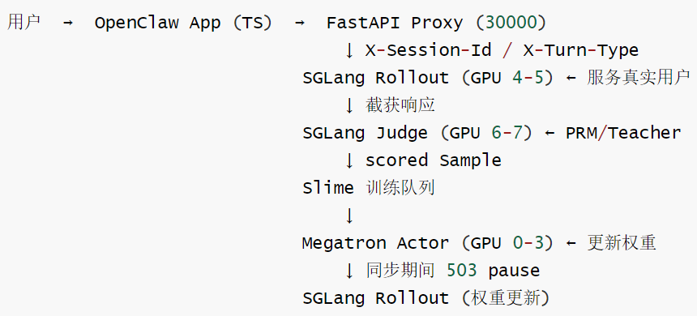

# 【Agentic RL / 强化学习 / OPD】OpenClaw-RL 源码阅读笔记 --- (11)--- 算法总体实现

# 【Agentic RL / 强化学习 / OPD】OpenClaw-RL 源码阅读笔记 --- (11)--- 算法总体实现

目录

* [【Agentic RL / 强化学习 / OPD】OpenClaw-RL 源码阅读笔记 --- (11)--- 算法总体实现](#agentic-rl--强化学习--opdopenclaw-rl-源码阅读笔记-----11----算法总体实现)
  + [0x00 概要](#0x00-概要)
  + [0x01 基础背景](#0x01-基础背景)
    - [1.1 架构](#11-架构)
    - [1.2 算法](#12-算法)
      * [三种训练方法核心设计](#三种训练方法核心设计)
      * [理论联系](#理论联系)
      * [Slime支持](#slime支持)
  + [0x02 Binary RL](#0x02-binary-rl)
    - [2.1 设计理念](#21-设计理念)
      * [对话任务的奖励结构](#对话任务的奖励结构)
      * [技术原因](#技术原因)
      * [工程上的现实因素](#工程上的现实因素)
        + [问题](#问题)
        + [广播机制](#广播机制)
    - [2.2 PPO](#22-ppo)
    - [2.3 GRPO](#23-grpo)
    - [2.4 具体配置](#24-具体配置)
  + [0x03 三种方法的损失函数](#0x03-三种方法的损失函数)
    - [3.1 公共原语](#31-公共原语)
    - [3.2 Binary RL的损失函数](#32-binary-rl的损失函数)
    - [3.3 OPD 的损失函数](#33-opd-的损失函数)
    - [3.4 Combine 的损失函数: combine\_loss\_function](#34-combine-的损失函数-combine_loss_function)
    - [3.5 advantage 和 loss 的关系](#35-advantage-和-loss-的关系)
      * [推导](#推导)
      * [实现](#实现)
      * [总结](#总结)
  + [0x04 优势的颗粒度](#0x04-优势的颗粒度)
    - [4.1 概念](#41-概念)
    - [4.2 方案](#42-方案)
      * [方案 A：Sequence 级(标准GRPO)](#方案-asequence-级标准grpo)
      * [方案 B：Turn 级(OpenClaw Binary RL)](#方案-bturn-级openclaw-binary-rl)
      * [方案 C：Step 级(RLAnything)](#方案-cstep-级rlanything)
      * [方案 D：Token 级(OpenClaw OPD)](#方案-dtoken-级openclaw-opd)
      * [四种粒度对比总结](#四种粒度对比总结)
  + [0x05 Token 级 vs 序列级：范式根因](#0x05-token-级-vs-序列级范式根因)
    - [5.1 奖励载体决定粒度](#51-奖励载体决定粒度)
    - [5.2 在线对话约束下的可行性](#52-在线对话约束下的可行性)
    - [5.3 Combine 为何能融合两者](#53-combine-为何能融合两者)
  + [0x06 Credit Assignment](#0x06-credit-assignment)
    - [6.1 什么是Credit Assignment(信用分配)](#61-什么是credit-assignment信用分配)
      * [问题](#问题-1)
      * [类比](#类比)
      * [解决方案](#解决方案)
      * [AI训练](#ai训练)
    - [6.2 Binary RL](#62-binary-rl)
    - [6.3 OPD 解决了什么](#63-opd-解决了什么)
      * [成绩](#成绩)
      * [问题](#问题-2)
      * [为何 OPD 在实践中仍然有效？](#为何-opd-在实践中仍然有效)
    - [6.4 Cascading Errors](#64-cascading-errors)
      * [定义](#定义)
      * [关键区别](#关键区别)
      * [一句话总结](#一句话总结)
    - [6.5 OpenClaw对两者的应对](#65-openclaw对两者的应对)
  + [0xFF 参考](#0xff-参考)

## 0x00 概要

本系列的目的是：借着对 OpenClaw-RL 源码的学习，来梳理强化学习的一些相关概念和思想。所以，会有一些基础知识、扩展和发散，OpenClaw-RL 只是一个切入点。而且，因为整篇系列是一个整体，所以有些概念的解读/学习会在不同的文章中出现，还请大家谅解。

OpenClaw-RL 是一个用于在线强化学习(Online RL)的框架，专门针对智能体工具使用场景。它通过从环境反馈中提取过程奖励信号来训练语言模型，支持三种主要模式：

* **openclaw-rl**：基于二元奖励的强化学习(Binary RL / GRPO)
* **openclaw-opd**：基于后见之明提示的在线策略蒸馏(On-Policy Distillation, OPD)
* **openclaw-combine**：联合方法，在同一 PPO 更新中同时利用 RL reward 和 OPD teacher signal


本篇主要介绍总体算法、Binary RL 的基础信息，和一些关键的技术细节思考。

注：本文算是笔记，所以会涉及很多基础知识，会冗长。

## 0x01 基础背景

我们首先回顾下基础背景。

### 1.1 架构

OpenClaw-RL 系统架构如下：



系统会从用户行为推断质量

```
User sends next message → Indicates previous response was understood/useful 
User repeats question → Indicates previous response was unhelpful
	↑
隐式信号，需要 LLM judge 解读 next_state 与 response 的关系
```

### 1.2 算法

Binary RL使用的是 GRPO + PPO clip trick, 不是完整 PPO (无 Critic)。"PPO"这个词在代码里指的是 clip 机制, 不是带 Critic 的完整算法。OPD 用的是 on-policy distillation advantage, Combine 是两者的加权融合。

README.md中如下：

```
**Binary RL (GRPO):** A Process Reward Model scores each turn based on next-state feedback. The scalar reward is then used with GRPO advantage estimation and a PPO-style clipped surrogate loss.

**On-Policy Distillation (OPD):** When the next state reveals useful hindsight, a judge model extracts a textual hint. This hint augments the original prompt to create an enhanced teacher, whose token-level log-probability gap with the student becomes a directional advantage signal richer than any scalar reward.

**Combination Method:** OpenClaw-RL further combines Binary RL and OPD in a unified training recipe, leveraging the dense scalar supervision of Binary RL together with the richer token-level directional signal from OPD. This combination achieves stronger and more robust optimization than either method
```

#### 三种训练方法核心设计

|  | Binary RL | OPD | Combine |
| --- | --- | --- | --- |
| 优势估计 | GRPO | on\_policy\_distillation | GRPO(预计算） |
| Advantage 粒度 | Sequence（将标量奖励广播到所有响应token） | Token（per-token差） | 两者线性叠加 |
| 奖励来源 | LLM Judge ±1/0，即PRM评分作为标量奖励(+1/-1/0) | Teacher log-prob | 两者结合 |
| KL 控制 | PPO clip only | 隐式（向teacher靠拢） | 两者叠加 |
| Credit Assignment | 严重 | 中等（级联问题） | Combine对冲部分缓解 |
| advantage 公式 | reward \* ones | teacher\_lp - rollout\_lp | `w_opd*(T-R) + w_rl*GRPO` |
| Loss 函数 | Slime 内置 policy\_loss\_function / L=L\_Pg+β\_KL\*L\_KL | Slime 内置 policy\_loss\_function | combine\_loss.py(自定义） |

#### 理论联系

* OPD
  + ≈ Adaptive SFT (per-token weight)
  + ≈ KD (Knowledge Distillation) with hindsight
  + ≈ 最小化 `KL(π_T(·|hint) || π_θ)`
* Binary RL
  + ≈ sequence-level REINFORCE (无 baseline)
* Combine
  + ≈ 全局信号(GRPO)为锚 + 局部信号(OPD)做细化
  + GRPO 的均匀惩罚隐式压制 OPD 的级联噪声

#### Slime支持

Slime支持的所有Advantage Estimator(OpenClaw-RL项目未全部使用)

| estimator | 公式 |
| --- | --- |
| grpo ✔(Binary RL, Combine） | adv[t] = reward (scalar broadcast) / GRPO 不normalize: --disable-rewards-norm |
| gspo | GRPO 变体，全序列级 KL clip |
| on\_policy\_distillation ✔(OPD) | adv[t] = teacher\_lp[t] - student\_lp[t] / per-token 蒸馏，student=rollout\_log\_probs |
| step\_wise | 多步骤 reward 按 token span 广播 |
| ppo(未使用） | 需要 Critic + GAE + Value Loss / adv = GAE(V, r, v, λ) |
| reinforce\_plus\_plus reinforce\_plus\_plus\_baseline | REINFORCE++ 带 KL penalty / REINFORCE++ 带 baseline 减方差 |

## 0x02 Binary RL

Binary RL = GRPO + PPO clip + DAPO clip-higher，无value model、无KL 惩罚、无entropy bonus。

Binary RL对每一轮(turn)独立打分，而非对整个多轮对话统一打分。

```
多轮对话(conversation)：
    Turn 1： reward₁ (独立打分)
    Turn 2： reward₂ (独立打分)
    Turn 3： reward₃ (独立打分)

单轮 Turn 1：
    token₁ token₂ token₃ ... tokenₙ
    [r₁] [r₁] [r₁] ... [r₁] ← GRPO 在一轮内广播 reward₁ 到所有 token
```

### 2.1 设计理念

为什么设计成 "逐轮打分"？

* 技术原因： 打分需要 next\_state(即用户下一句话)，这在当前轮结束时才能得到，天然是逐轮粒度。
* 语义原因： PRM Judge 的 prompt 是 "given this response, did the user continue"。
* 工程原因： 每轮独立成为一个 Sample 进入训练队列，Megatron 处理的 batch 可以来自不同 session 的不同 turn，互相不依赖。

#### 对话任务的奖励结构

| 场景 | 适合哪种打分 |
| --- | --- |
| 游戏（推箱子）/ 代码执行 | Episode-level（只有最终成功/失败） |
| 定理证明 | Episode-level（证明完整才有意义） |
| 开放式对话（OpenClaw） | Turn-level（每轮都有独立价值） |
| SWE bug 修复 | Episode-level（代码能运行才算） |

#### 技术原因

next\_state 本身就是对话级的隐式信号。用户聊天不是 "赢" 或 "输"，每一轮回复的质量都独立地影响用户体验。

```
Turn N response → [PRM judge] ← Turn N+1 (user's next message)
										↑
								next_state 就是用户对上一轮回复的真实反应
```

* 用户下一句话继续深入 → 模型回答有用 → score = +1
* 用户重复同样的问题 → 没听懂 → score = -1
* 用户沉默(session 结束)→ 无法判断 → score = 0

这比 episode-level binary signal 信息量更大：能在每轮感知用户体验，而非等整个对话结束。

#### 工程上的现实因素

##### 问题

在线学习的核心要求：尽快更新。而在工程上遇到了如下问题：

* 问题 1：对话长度未知，因此
  + → 不知道何时该收集整个 episode 进行打分
* 问题 2：对话可能被用户中途放弃，因此
  + → Episode 不完整，无法打 episode-level 分
* 问题 3：批次填充问题，因此：
  + → Episode-level 到达训练队列是脉冲式的(对话结束时才来)
  + → 逐轮样本持续到达，GPU 利用率更平稳

比如下图所示，延迟越长，更新时的权重越 off-policy，PPO clip 的约束越容易被违反。

```
逐轮打分： Turn 1 → scored → 进训练队列 → 模型更新
         Turn 2 → scored → 进训练队列 → 模型更新
         ...(持续在线)
         
Episode 打分：Turn 1 ___________________________|
			 Turn 2 ___________________________|
			 Turn N → 对话结束 → scored → 一批更新 ←┘
			 延迟 = 整个对话时长
```

##### 广播机制

因此，Binary RL使用了广播机制，将单个标量值复制到响应序列中的所有 token位置。

在强化学习中，优势值 SA\_t衡量的是在时间步 t 采取特定动作相对于平均策略的优劣程度。在 OpenClaw-RL的上下文中： SA\_t=rS：优势值直接等于标量奖励\(r\)，即标量奖励 rS：来自 PRM(过程奖励模型)的评分，通常为 +1、-1或0。

由于 PRM只能对整个助手响应进行整体评分，而训练需要在每个 token 级别计算梯度，因此必须将标量奖励广播到所有相关 toke n。

OpenClaw-RL的优势值广播机制是一种巧妙的设计，它将复杂的强化学习问题简化为可操作的训练流程。通过将标量PRM评分厂播到所有响应 token，系统能够在保持计算效率的同时，有效地利用自然用户交互作为训练信号。这种设计体现了 OpenClaw框架在实用性、效率性和可扩展性之间的平衡，使其能够适应真实世界的大规模部署需求

### 2.2 PPO

虽然代码里policy 更新用的是PPO-style clipped surrogate objective：

```
    ratio = exp(log T_new -log T_old)
    pg_loss = -min(ratio * adv, clip(ratio,1-e,1+e_high) * adv)
```

但这只是"PPO clip技巧"，不是完整PPO。

完整PPO需要：

* ①一个独立的Critic网络估计V(s)
* ②GAE (Generalized Advantage Estimation):A\_t=δ\_t+γλδ\_{t+1} + ...,
* ③Value Loss 训练 Critic

OpenClaw-RL 没有 Critic；reward直接广播到所有token → 这是GRPO/REINFORCE 风格

### 2.3 GRPO

因此，OpenClaw 的 Binary RL 使用的是 GRPO(不是 PPO)。

代码证据：

* 无 value model / critic—GRPO 的标志性特征：slime/slime/utils/ppo\_utils.py L207: returns.append(torch.ones\_like(kl[i])
* rewards[i]) – reward 标量直接广播为 advantage，没有 GAE / value baseline
* 运行脚本中未启用 critic：openclaw-rl/run\_qwen3\_4b\_openclaw\_rl.sh 使用 --disable-rewards-normalization, advantage = raw reward (±1 直接用)
* 但使用了 PPO 的 clip 机制：eps\_clip=0.2 / eps\_clip\_high=0.28 (DAPO 风格 clip-higher)

所以准确说是：GRPO advantage + PPO-style clip + DAPO clip-higher = "GRPO with DAPO tricks", 不是原版 PPO。

| 特征 | PPO | GRPO | OpenClaw Binary RL |
| --- | --- | --- | --- |
| Value model | ☑ | ☒ | ☒ |
| Advantage | GAE | (R-μ)/σ | raw R (±1 broadcast) |
| Surrogate clip | ☑ ε 对称 | ☑ ε 对称 | ☑ ε 非对称（DAPO） |
| KL penalty | ☑ β>0 | 通常 ☑ | ☒ coef=0 |

### 2.4 具体配置

Binary RL = GRPO(无 value model，组内相对比较) + PPO clip(信任域约束) + DAPO clip-higher(恢复低概率正样本梯度)。

不是标准 PPO(没有 value model)，不是纯 REINFORCE(有 clip 约束)，不是纯 GRPO(有 DAPO 的非对称 clip 改进) = GRPO with DAPO tricks

GRPO + DAPO clip-higher，具体配置：

| 组件 | 具体实现 | 代码位置 |
| --- | --- | --- |
| 算法框架 | GRPO (Group Relative Policy Optimization) | --advantage-estimator grpo |
| Advantage | A\_t = R (raw reward ±1 broadcast 到所有 token) | ppo\_utils.py |
| 梯度更新 | PPO-style clipped surrogate | ppo\_utils.py |
| Clip 范围 | 下界 ε=0.2, 上界 ε\_high=0.28 (DAPO 非对称 clip) | --eps-clip 0.2 --eps-clip-high 0.28 |
| KL 惩罚 | 计算但不参与梯度 (coef=0.0) | --kl-loss-coef 0.0 |
| Reward 标准化 | 关闭 (raw ±1 直接用) | --disable-rewards-normalization |
| Entropy bonus | 关闭 | --entropy-coef 0.0 |
| Value model | 无 | GRPO 特征 |

## 0x03 三种方法的损失函数

我们接下来看看三种方法的损失函数。

先看看源码中的注释：

```
"""Joint loss for mixed RL (GRPO) + OPD (distillation) batches.

Both branches use the same PPO-style clipped policy gradient objective,
matching SLIME's ``policy_loss_function``, but with different advantages:

- OPD samples: advantage = teacher_logp - old_logp  (token-level distillation)
- RL  samples: advantage = reward broadcast          (GRPO-style)

OPD samples carry reward=0 so GRPO advantage=0; RL samples carry
teacher_logp ≈ rollout_logp so teacher advantage ≈ 0.  The combined
advantage is simply their sum, and each branch naturally dominates for
its own sample type.
"""
```

三种方法的损失函数对比

|  | advantage 来源 | 信号粒度 |
| --- | --- | --- |
| Binary RL | reward scalar → 广播全 token | 序列级 (无 credit) |
|  | ∈ |  |
| OPD | teacher\_lp - rollout\_lp | Token 级 (per-token) |
|  | per-token 浮点差值 |  |
| Combine | w\_opd\*(teacher-old) | 两级信号叠加 |
|  | + w\_rl\*grpo\_adv |  |
| 共同的 loss 形式 | PPO clip + 熵正则 + (KL) | 完全相同 |

三种方法共用同一个 PPO clip 框架，区别仅在于 combined\_advantages 张量里装的内容不同。

### 3.1 公共原语

以下是公共部分。

```
@torch.compile(dynamic=True)
def compute_policy_loss(
    ppo_kl: torch.Tensor,
    advantages: torch.Tensor,
    eps_clip: float,
    eps_clip_high: float,
    eps_clip_c: float | None = None,
):
    # ppo_kl = old_log_probs - new_log_probs
	# ratio=π_θ(a|s)/ π_old(a|s)，即重要性采样比率
    ratio = (-ppo_kl).exp()
    # 无clip的 PGloss:-ratio * A
    pg_losses1 = -ratio * advantages
    # clip后的PGloss：ratio被截断到[1-e，1+e_high] 再乘A
    # e=0.2，e_high=0.28(asymmetric clip，允许轻微超过)
    pg_losses2 = -ratio.clamp(1 - eps_clip, 1 + eps_clip_high) * advantages
    # 取两者的逐元素最大值(即取悲观值)，这是PPOclip的核心
    # 当A>O：ratio太大时被截断，防止步子过大
	# 当A<O：ratio太小时被截断，防止对负样本惩罚过轻
    clip_pg_losses1 = torch.maximum(pg_losses1, pg_losses2
    # clipfrac：记录有多少token触发了clip(用于监控)
    clipfrac = torch.gt(pg_losses2, pg_losses1).float()

	# dual-clip(可选)：当A<0时进一步约束下界，避免负advantage样本
    # 驱使ratio无限增大；eps_clip_c>1.0
    if eps_clip_c is not None:
        assert (
            eps_clip_c > 1.0
        ), f"The lower bound of the clip_ratio_c for dual-clip PPO should be greater than 1.0, but get the value: {eps_clip_c}."
        pg_losses3 = -eps_clip_c * advantages
        clip_pg_losses2 = torch.min(pg_losses3, clip_pg_losses1)
        pg_losses = torch.where(advantages < 0, clip_pg_losses2, clip_pg_losses1)
    else:
        pg_losses = clip_pg_losses1

    return pg_losses, clipfrac #shape:[T_total]，每 token 一个值
```

### 3.2 Binary RL的损失函数

RL方法使用 Slime 内置的policy\_loss\_function，advantage 由 compute\_advantages\_and\_returns 中的 GRPO分支预先计算好。

```
# ==============================================
# Step0(前置)：GRPO advantage计算在rollout阶段完成
# ==============================================
def get_grpo_returns(
    rewards: torch.Tensor,
    kl: list[torch.Tensor],
):
    returns = []
    for i in range(len(rewards)):
        # rewards[i] 是标量（±1.0 或 0.0）
        #kl[i]是长度为T_i的per-tokenKL向量
        #torch.ones_like(kl[i])* rewards[i]:
        #	把标量reward广播为全token 都相同的advantage
        #	→序列级信号，无credit assignment
        returns.append(torch.ones_like(kl[i]) * rewards[i])
    return returns

# ==============================================
# Step1：前向传播，计算当前策略的log-probs
# ==============================================
# policy_loss_function -RL 路径
advantages = torch.cat(batch["advantages"], dim=0)
# advantages shape：[T_total]，每个token的值都等于其所在序列的reward
old_log_probs=batch["rollout_log_probs"] # rollout 时记录的旧策略log-probs
# 调用Megatron 的 fused cross entropy计算当前log-probs
_,log_probs_and_entropy = get_log_probs_and_entropy(
    logits,...
	# logits:[1，T，V],Megatron tensor-parallel 分片的 vocab logits
    # 内部调用 fused_vocab_parallel_cross_entropy
)                                                    

# ==============================================
# Step2：计算per-token KL(即IS ratio的log形式)
# ==============================================
old_log_probs = torch.cat(old_log_probs,dim=0)
log_probs = torch.cat(log_probs_and_entropy["log_probs"], dim=0)

# ppo_kl =logπ_old(a|s)-log π_θ(a|s)
#        =log(π_old / π_θ)=-log(π_θ/ π_old)=-log(ratio)
ppo_kl = old_log_probs - log_probs # shape:[T_total]

# ==============================================
# Step3:PPO clip→聚合→加熵正则
# ==============================================
pg_loss,pg_clipfrac = compute_policy_loss(ppo_kl,advantages,
											args.eps_clip,#0.2
											args.eps_clip_high) # 0.28
# sum_of_sample_mean：先对每个样本内的token求均值，再对样本求和
# 等价于对有效token(loss_mask=1)的加权平均 
pg_loss =sum_of_sample_mean(pg_loss)
# entropy_coef通常>0，鼓励探索
# 用-entropy_coef*H(π)作为正则项
entropy_loss =sum_of_sample_mean(entropy)
loss = pg_loss - args.entropy_coef * entropy_loss
# 可选：KL散度惩罚(本项目kl_coef=0，不启用)
# 可选：ref_modelKLloss(use_kl_loss=True时启用)
```

### 3.3 OPD 的损失函数

OPD的损失函数分两步：advantage 计算在compute\_advantages\_and\_returns的on\_policy\_distillation 分支，loss计算仍走 policy\_loss\_function(同一个函数)

```
# ======================================================
# Step 0(前置):OPD advantage = teacher_lp - student_1p
# ======================================================
#loss.py:433-on_policy_distillation 分支
elif args.advantage_estimator == "on_policy_distillation":
	student_log_probs=log_probs # rollout时SGLang返回的旧策略log-probs
	teacher_log_probs =rollout_data.get("teacher_log_probs")
    # 来自OpenClawOPDAPIServer._compute_teacher_log_probs():
	# 教师forwardpass(max_new_tokens=0)，返回response位置的per-tokenlog-probs 
    
    teacher_log_probs =[t.to(device) for t in teacher_log_probs]
	# teacher_log_probs 的原始长度=prompt+response(含promptlogprobs)
    # 这里截取最后response_length个token，对齐response位置 
    teacher_log_probs=[
        t_lp[-response_length:]
        for t_lp, response_length in zip(teacher_log_probs, response_lengths)
    ]
    # per-token advantage =log π_teacher(a_t|s,a_<t)-log π_old(a_t|s,a_<t)
    # 含义：教师比学生"更喜欢“这个token的程度
    # >0 → 教师倾向此token → 策略更新朝此方向
    # <0 → 教师不倾向此token → 策略更新远离此方向 
    advantages =[
        teacher_lp -student_lp
        for teacher_lp,student_lp in zip(teacher_log_probs,student_log_probs)
    ]
    returns = advantages

# ======================================================
# Step1-3:与RL完全相同的policy_loss_function
# ======================================================
# OPD 也走 policy_loss_function, 代码完全相同
# 区别仅在于 batch["advantages"] 里装的是 token-level teacher-student diff
# 不是 scalar broadcast 的 reward

# 效果等价于:
# ∇L_OPD ≈ E_t [ (π_teacher/π_old - clipped) * ∇log π_θ(a_t) ]
# 即用教师 log-prob 差值作为 per-token 的重要性权重
```

### 3.4 Combine 的损失函数: combine\_loss\_function

Combine 跳过 Slime 的 advantage 估算, 自己在 loss 函数内合并两路 advantage。

```
def combine_loss_function(args, batch, logits, sum_of_sample_mean):
    # —— 1. 读取 GRPO advantages (Slime 预计算, 序列级广播) ——————————————————
    grpo_advantages = torch.cat(batch["advantages"], dim=0)
    # shape: [T_total], 每 token = 该序列的 reward scalar

    # —— 2. 决定用哪组旧策略 log-probs ——————————————————
    old_log_probs_list = (
        batch["rollout_log_probs"]   # rollout 时 SGLang 实时记录的
        if args.use_rollout_logprobs
        else batch["log_probs"]      # Megatron 前一轮 forward 的 (更精确但开销大)
    )
    
    # —— 3. 当前策略 forward pass → new_log_probs ——————————————————
    _, log_probs_and_entropy = get_log_probs_and_entropy(logits, ...)
    # 调用 Megatron fused_vocab_parallel_cross_entropy, 支持 TP 分片
    new_log_probs = torch.cat(log_probs_and_entropy["log_probs"], dim=0)
    old_log_probs = torch.cat(old_log_probs_list, dim=0)

    # —— 4. 教师 advantage (OPD 分支) ——————————————————
    teacher_log_probs_list = batch.get("teacher_log_probs")
    if teacher_log_probs_list is not None:
        teacher_advantages = torch.cat(
            [
                t.to(device) - o.to(device)  # teacher_lp - rollout_lp (旧策略)
                for t, o in zip(teacher_log_probs_list, old_log_probs_list)
            ],
            dim=0,
        )
        # 注意: Combine 中 RL-only 样本 teacher_lp == rollout_lp
        # → teacher_advantages ≈ 0, 只有 GRPO 项有效
    else:
        teacher_advantages = torch.zeros_like(grpo_advantages)

    # —— 5. 核心公式: 线性加权合并两路 advantage ——————————————————
    w_opd = float(os.getenv("OPENCLAW_COMBINE_W_OPD", "1.0"))
    w_rl  = float(os.getenv("OPENCLAW_COMBINE_W_RL",  "1.0"))

    combined_advantages = (
        w_opd * teacher_advantages   # token-level: 教师对每个 token 的打分
        + w_rl  * grpo_advantages    # sequence-level: 人类对整条轨迹的打分
    )
    # 两路信号对齐后相加: OPD 提供密集 per-token 方向, RL 提供稀疏 trajectory 幅度
   
    # —— 6. PPO clip (与 RL/OPD 完全相同) ——————————————————
    ppo_kl = old_log_probs - new_log_probs  # = log(π_old/π_θ) = -log(ratio)
    pg_loss, pg_clipfrac = compute_policy_loss(
        ppo_kl, combined_advantages, args.eps_clip, args.eps_clip_high
    )
    pg_loss = sum_of_sample_mean(pg_loss)

    # —— 7. 熵正则 ——————————————————
    # 若 entropy_coef != 0: 用本次 forward 的 entropy (有梯度)
    # 若 entropy_coef == 0: 在 no_grad 下单独计算, 仅用于监控
    entropy_loss = ...
    loss = pg_loss - args.entropy_coef * entropy_loss

    # —— 8. KL 正则 (可选, kl_loss_coef 控制强度) ——————————————————
    if args.use_kl_loss:
        ref_log_probs = torch.cat(batch["ref_log_probs"], dim=0)
        kl = compute_approx_kl(new_log_probs, ref_log_probs, kl_loss_type=...)
        loss = loss + args.kl_loss_coef * sum_of_sample_mean(kl)

    # —— 9. 空序列保护 (梯度连通性) ——————————————————
    if new_log_probs.numel() == 0:
        loss = loss + 0 * logits.sum()
        # 0 梯度但保持计算图连通, 避免 DDP all-reduce 挂起

    return loss, reported_loss
```

### 3.5 advantage 和 loss 的关系

我们再看看advantage 和 loss 的关系。关系很简单:

* advantage 是"信号方向" (正=该增大)
* loss = -ratio × advantage 是"优化目标" (要最小化)。
* 符号相 反是 RL 标准做法: maximize reward ↔ minimize negative reward。

#### 推导

```
# PPO loss 公式:
loss = -ratio * advantage

# 其中:
advantage = teacher_lp - student_lp
ratio = exp(new_lp - old_lp)

# 第一次 forward pass 时 (还没更新权重):
# new_lp ≈ old_lp → ratio ≈ 1

# 所以: 
loss ≈ -1 * (teacher_lp - student_lp) # 
    = -(teacher_lp - student_lp)
    = student_lp - teacher_lp
# 符号反转是 RL 的标准约定
# advantage > 0 → 好动作 → 应该增大概率 → loss 应该负 → 梯度下降时增大概率
# advantage < 0 → 坏动作 → 应该减小概率 → loss 应该正 → 梯度下降时减小概率
# 所以:
# loss = -advantage (乘以 ratio 做稳定)
```

关系图如下

```
advantage = teacher_lp - student_lp  (信号: teacher 比 student 多喜欢多少)
    |
    | × (-ratio)
    ↓
loss = -ratio × advantage            (优化目标: 要最小化)
     ≈ -(teacher_lp - student_lp)    (当 ratio≈1)
     = student_lp - teacher_lp        (化简)
     ≈ D_KL(student || teacher) 的    (在采样 token 上的估计)
       per-token contribution
    |
    | ∇_θ (梯度下降)
    ↓
效果: 减小 student_lp - teacher_lp
    = 让 student_lp 接近 teacher_lp
    = 缩小 Reverse KL
```

#### 实现

```
# loss.py 中的 on_policy_distillation 分支:
elif args.advantage_estimator == "on_policy_distillation":
    student_log_probs = log_probs  # 当前 forward pass 的 log_probs   
    teacher_log_probs = rollout_data.get("teacher_log_probs")  # π_teacher logprobs [T]

    # 对齐到 response 长度(取最后 response_length 个 token)
    teacher_log_probs = [
        t_log_prob[-response_length:]
        for t_log_prob, response_length in zip(teacher_log_probs, response_lengths)
    ]

    # 核心计算：per-token 差值
    advantages = [
        teacher_log_prob - student_log_prob
        for teacher_log_prob, student_log_prob in zip(teacher_log_probs, student_log_probs)
    ]
    returns = advantages
```

#### 总结

一句话总结：advantage = "应该怎么调" (正=增大, 负=减小) ；loss = "优化器要最小化的目标" = -advantage。两者符号相反，是 RL 的标准做法: maximize(advantage) ↔ minimize(loss = -advantage)。

## 0x04 优势的颗粒度

我们从 OpenClaw-RL 展开，看看优势函数的颗粒度。

### 4.1 概念

* Sequence（完整时序序列，整段上下文） ：一条完整多轮对话、system 提示词 + 全部历史 turn + 当前待生成上下文，合起来叫一条 Sequence。一条 Sequence 包含 N 个 Turn、M 个 Step、海量 Token。
* Turn（一轮交互，用户↔模型单次往返）。大语言模型交互场景下，Turn特指用户与模型的一次完整往返交互，即「用户输入→模型输出」构成一个独立Turn，这一术语在对话系统、多轮对话微调任务中被普遍采用。
* Step（强化学习单步决策，时序动作单元）：从强化学习决策视角出发，模型单次生成一段Token序列的决策过程对应1个Step，是RL中智能体（即大模型）执行动作、接收反馈的最小时序单元，和PPO等强化学习算法中的"步"定义完全对应。

以一个ALFWorld任务为例：“把刀放进抽屉“，轨迹内容如下：

```
任务：Put the knife in the drawer

Step 1 (look):"I see a counter with:a fork, a knife,a cup"       →正确：找到了物体
Step 2 (take):"take fork from counter"                           →→→→→→→→→→错误：拿错了
Step 3 (put):"put fork in/on counter"                            →纠正：放回去
Step 4 (take):"take knife from counter"                          →正确：拿到刀
Step 5 (goto):"go to drawer 1"                                   →正确：走对了
Step 6 (put):"put knife in/on drawer 1"                          →正确：任务完成

最终结果：SUCCESS(O_T=+1)
```

对应的层级如下。

```
对话任务的层级:
  Session (多轮对话)
    ├── Turn 1 (第1轮, 含 user + model)
    ├── Turn 2 (第2轮)
    └── Turn n (第n轮)
        └── tokens (每个词)

Agentic 任务的层级:
  Trajectory (完整任务执行)
    ├── Step 1 (look)
    ├── Step 2 (take fork)
    ├── Step 3 (put fork)
    └── Step n (put knife → done)
        └── tokens (每个词)
```

所以，OpenClaw实际上是 Turn 级(非 Sequence 级)，每个对话轮次独立打分。RLAnything 是 Step 级(Agent action 步骤)：

* OpenClaw 的 "Turn 级" = 每轮对话的所有 token 共享一个 reward;
* RLAnything 的 "Step 级" = Agent 的每个动作步骤的所有 token 共享一个 RM 评分。

两者都是在其各自任务结构的 "自然切割粒度"上操作的。

### 4.2 方案

我们接下来对几种方案进行对比。

| 粒度 | 示例 | 信号来源 |
| --- | --- | --- |
| Sequence 级 | 标准 GRPO (单轮任务) | outcome\_reward |
| Turn 级 | OpenClaw Binary RL | Judge(turn) → +1/0/-1 |
| Step 级 | RLAnything | Ot+(mλ)⋅∑RM(step\_i) |
| Token 级 | OpenClaw OPD | Teacher log-prob - Student log-prob |

#### 方案 A：Sequence 级(标准GRPO)

GRPO的做法：所有token都用同一个advantage(+1or-1)不区分哪个token贡献了正确结果。

```
奖励信号：+1(任务成功)，所有 Token 共享同一个reward：

Step 1 tokens:    [+1，+1，+1, +1, +1, +1,+1，+1，+1，+1，...]  
Step 2 tokens:    [+1，+1，+1, +1, +1, +1,+1，+1，...]   ←   拿错了！但仍是+1
Step 3 tokens:    [+1，+1，+1, +1, +1, +1,+1，+1，...]
Step 4 tokens:    [+1，+1，+1, +1, +1, +1,+1，+1，...]
Step 5 tokens:    [+1，+1，+1, +1, +1，+1，...]
Step 6 tokens:    [+1，+1，+1, +1, +1, +1,+1，+1，+1，...]
                                ↑
所有token 都是+1，包括“take fork”这个错误步骤
```

问题：Policy学不到“step 2是错误的”。如果改变随机性，“拿fork”的概率反而可能升高。

#### 方案 B：Turn 级(OpenClaw Binary RL)

Binary RL：每个Turn内所有token共享同一个advantage，不同Turn之间有各自的advantage(这是“Turn级“比"Session级“好的地方)

单个对话轮次统一打分：(在对话系统中，整个agent响应是一个turn)，Judge评估整个turn的质量：→ 用户got their knife into drawer → score=+1

* 优于 Sequence 级：Turn 粒度可以区分不同对话轮次的好坏
* 劣于 Step 级：同一 Turn 内所有步骤仍共享相同loss\_mask

```
所有步骤对应的loss_mask=[1]： 

Step 1:loss_mask = 1
Step 2:loss_mask = 1    ←  拿错了，但turn最终成功，仍参与训练
Step 3:loss_mask = 1 
Step 4:loss_mask = 1 
Step 5: loss_mask = 1 
Step 6: loss_mask = 1
```

#### 方案 C：Step 级(RLAnything)

Step级(RLAnything 的做法)：

* 每个 Step 的所有 token 使用该 Step 的综合 advantage

```
Step 2 advantage = -1.2         "take fork"的所有token 都被惩罚
Step 4 advantage = +0.9         "take knife"的所有token都被奖励
```

* 每个Action Step独立打分(RM评分 × m次 + 结果奖励) ：O\_T=+1(任务最终成功)

因此：

* RM对每步的平均评分S\_mean：

```
Step 1 (look):        S_mean = +0.9  → R1=0_t+入·S_mean =1+0.9=+1.9
Step 2 (take fork):   S_mean = -0.7  → R2=1+(-0.7)=+0.3   ← 降低了！
Step 3 (put fork):    S_mean = +0.1  → R3=1+0.1=+1.1
Step 4 (take knife):  S_mean = +0.8  → R4=1+0.8=+1.8
Step 5 (goto):        S_mean = +0.6  → R5=1+0.6=+1.6
Step 6 (put knife):   S_mean = +1.0  → R6=1+1.0=+2.0
```

* 跨轨迹标准化 → 每个step的 advantage:

```
step 1: +0.6
step 2: -1.2         ← step 2获得负advantage！Policy 学到“拿fork是错的“
step 3: +0.2 
step 4: +0.9 
step 5: +0.4 
step 6: +1.1
```

效果：即使轨迹整体成功，错误步骤(step2)仍然被惩罚

#### 方案 D：Token 级(OpenClaw OPD)

OPD 使用 Teacher 模型对每个 token 的概率进行处理。

针对 Step 2 中 "take fork from counter"的每个 token:

Teacher(知道正确做法)的 token 概率分布：

```
P_teacher("take") =0.85          ←  拿东西是对的
P_teacher("fork") = 0.03         ←  Teacher 不会选fork
P_teacher("knife") =0.88         ←  Teacher 更偏向 knife
P_teacher("from") = 0.92
P_teacher("counter") = 0.89
```

Student 的 token 概率分布：

```
P_student("take")=0.80 
P_student("fork")=0.45          ←   Student更可能选fork！
P_student("knife")=0.35
```

Token 级 advantage = log(Teacher/Student):

```
"take":     log(0.85/0.80)= +0.06    ←  方向对
"fork":     log(0.03/0.45)= - 2.71   ←  极强负信号！"fork"是错误token
"knife":    log(0.88/0.35) = +0.92   ←  如果选这个会有强正信号
"from":     +0.05
"counter":  +0.02
```

效果：因为Policy对P("fork")的梯度方向是向下的，P("knife")向上，所以，不仅在step级别知道错了，而且精确到“fork”这个词的选择是问题所在。

#### 四种粒度对比总结

```
                    Step 2中错误"fork"的处理
──────────────────────────────────────────────────────────────────────
Sequence 级：       advantage=+1.0  Policy强化了这个错误
                   		↓ 学到的：take fork from counter 是好的 (错误！)
Turn 级：           loss_mask =1   参与训练，但无法区分 fork vs knife
                   		↓ 学到的：整个turn的模式是好的，包括 fork(隐式正强化)
Step级：            advantage =-1.2   整个 step 被惩罚
                       ↓ 学到的：在这个上下文里，"take fork from counter"是差的
                                但不知道具体是"fork"这个词还是"take"的方向错了
Token 级 (OPD):     "fork"token的advantage =-2.71
                       ↓ 学到的：精确是选择“fork”这个词是错的
                       P(fork)下降，P(knife)上升
```

## 0x05 Token 级 vs 序列级：范式根因

0x04 我们用 ALFWorld 例子对比了四种粒度的效果差异。这一章我们追问一个更根本的问题：为什么 Binary RL 只能是序列级、OPD 只能是 token 级？这种粒度差异是偶然选择，还是范式决定？

答案是：**粒度由奖励载体决定，而非主观选择**。

### 5.1 奖励载体决定粒度

| Binary RL | OPD |
| --- | --- |
| 奖励载体: 标量 ∈ | 奖励载体: 向量 ∈ R^T（每个 token 一个值） |
| 来源: 人类行为反馈（无结构） | 来源: 语言模型 log-prob（自带 token-level 结构） |
| 信息粒度: trajectory level | 信息粒度: token |
| 信用分配: 无法解决（平均分配是唯一选择） | 信用分配: 天然解决（teacher LP 在每个位置都有答案） |
| 类比: 电影评分（1-5）对整部电影 | 类比: 逐句校对批注，告诉你每个词该如何改 |

Binary RL 是强化学习范式——通过环境反馈学习，只能获得稀疏的标量奖励；OPD 是监督/蒸馏学习范式——通过教师模型指导学习，能够获得密集的 token 级监督信号。这是范式层面的根本差异，粒度只是其外在表现。

### 5.2 在线对话约束下的可行性

即便理论上 token 级更优，在线对话场景对它也有苛刻约束。Step 级需要"在模型生成每个 action 时立刻打分"，对对话 LLM 而言"step"=每个 token，相当于需要实时 token-by-token RM 评分，延迟不可接受。

OPD 的巧妙之处在于：用 Teacher 的 **一次 forward pass** 代替显式的逐 token RM 评分——Teacher 一次前向就给出所有 token 的 log\_prob，没有逐 token 评分的延迟。这就是 OPD 能用 token 级同时保持在线可行的原因。

### 5.3 Combine 为何能融合两者

```
combined_adv[t] = w_opd * (teacher_lp[t] - old_lp[t])   ← per-token 方向
                + w_rl  * reward                         ← sequence-level 强度
```

* OPD 告诉你"往哪个方向走"（per-token 方向性）
* RL 告诉你"走多远/走不走"（sequence-level 强度）
* 融合后：既有方向又有强度，信号最丰富

这正是 Combine 方法的核心价值——两种范式互补，而非简单叠加。

## 0x06 Credit Assignment

OPD是“部分解决“而非“完全解决“credit assignment，即，程度比Binary RL轻得多。

### 6.1 什么是Credit Assignment(信用分配)

#### 问题

我们最终最求的本质：给定最终奖励，哪个时刻的动作应该"得到信用"(被奖励/惩罚)？

```
轨迹：s₁ →a₁→ s₂ →a₂→ s₃ →a₃→ ... →aₙ→ 最终结果 R
```

而目前问题是，面对上面的序列，我们可以回答如下嘛？

```
R = +1(成功)→ a₁ 贡献了多少？a₂ 贡献了多少？... aₙ 贡献了多少？
```

我们不清楚，因为：

* a₃ 是关键动作 → 但 R 在 n 步后才出现
* a₁ 也影响了后续所有状态 → 间接贡献是多少？
* 中间有些动作是噪声 → 真正贡献是 0？

核心挑战：长轨迹 + 稀疏奖励 → 无法确定哪个动作应该被强化

#### 类比

想象你和三个朋友一起打篮球，你们队赢了。比赛结束后，教练说：“你们打得很好！“

但问题来了一到底是谁的功劳？

```
第一节：小明投进了一个三分球
第二节：小红传了一个漂亮的助攻
第三节：小刚把对方最厉害的球员挡住了
第四节：你投进了压哨一球最终结果：你们赢了
```

“赢了“这个奖励是在最后才出来的。但中间每个人都做了贡献一只是贡献的时间和大小都不一样。

#### 解决方案

Credit Assignment 就是在回答这个问题：

```
赢球这件好事，应该有多大比例算小明的？多大比例算小红的？多大比例算小刚的？多大比例算你的？
```

如果你奖励所有人一样多，小刚(只是在防守但没得分)可能会觉得不公平。

如果你只奖励最后投球的你，小明三分球的功劳就被忽视了。

#### AI训练

在AI训练中：AI做了50个动作，最后完成了任务，拿到了奖励+1。

```
动作1、2、3..是铺垫(早期重要决定)
动作48、49、50...是最后的执行
```

问题：

```
这个+1应该“分配“给哪些动作？那些早期的铺垫有没有功劳？

如果不管哪个动作都平等地拿到相同的奖励信号  → AI就不知道哪个动作真正重要  → 可能会保留了错误的习惯，丢掉了正确的习惯
```

Credit Assignment就是：“怎么公平地把功劳分给中间每一步"。

这个问题越到AI Agent(要做几十步才能完成任务)就越难 ---- 就像一场球赛越长，越难说清楚到底是哪个决定决定了胜负。

### 6.2 Binary RL

Binary RL 的 Credit Assignment 问题(对比基线)，其问题如下：前 7 个 token 无辜受罚，梯度信号嘈杂。

```
response: ["The", "answer", "is", "42", "because", "sqrt(1764)", "=", "43"]
                                                                       ↑ 错误！
reward = -1 (PRM 打了负分)

GRPO advantage: [-1, -1, -1, -1, -1, -1, -1, -1]
                所有 token 被同等惩罚，包括正确的前半段
```

### 6.3 OPD 解决了什么

#### 成绩

OPD 做到了：teacher 知道错误所在，应在关键 token 位置集中梯度。

```
# 有 hint: "注意 sqrt(1764) = 42, 不是 43"
teacher_lp: [..., -0.1, -0.2, -0.3, -5.8, -0.1, -0.1, -0.1, -0.05]
rollout_lp: [..., -0.1, -0.2, -0.3, -0.1, -0.1, -0.1, -0.1, -5.5]
                                      ↑                       ↑
advantage:  [...,  0.0,  0.0,  0.0, -5.7,  0.0,  0.0,  0.0, +5.45]
                        惩罚 "because"后的推导            奖励正确答案 "42"
```

#### 问题

OPD 仍未解决的 Credit Assignment 如下。

```
问题根源：auto-regressive 条件化

teacher_lp[t] = P_teacher(w_t | w_1...w_t-1, hint)
                                  ↑
                      条件化在学生之前已犯的错误上
```

具体场景：

```
response： ["Let", "me", "compute", "1764÷2=882", "then", "sqrt(882)≈29.7"]
                                        ↑ 错误推导路径！
                                        这步错了，后面全错
```

解析如下：

| Token | teacher 评分 | 问题 |
| --- | --- | --- |
| "1764÷2=882" | 低（路径不对） | 正确被惩罚 |
| "then" | 中（给定错误步骤后较合理） | 被"过度原谅" |
| "sqrt(882)≈29.7" | 高（给定 882，这步正确） | 错误 token 反而得到奖励 |

核心问题：teacher 无法做反事实推理 —— 它不知道"如果 token 4 不同，token 5-8 会更好"。

#### 为何 OPD 在实践中仍然有效？

尽管存在级联问题，OPD 仍然 work 的原因：

* Hint 注入改变了条件：teacher 见过 hint，对整段 response 的评分有了全局视角，能在关键位置集中低概率
* 长期统计上自纠正：级联误导在大量样本上随机，均值接近零；真正错误 token 的信号是系统性的
* 比 Binary RL 方差更低：即使有噪声，per-token 信号的方差明显小于 broadcast 标量

类比：OPD 相当于"带高亮的批改作业"(知道哪段错)，Binary RL 相当于"只给总分"。前者仍有局部歧义，但比后大得多。

### 6.4 Cascading Errors

#### 定义

级联错误(Cascading Errors)是 OpenClaw OPD 里一个更具体的问题，但发生机制不同：

OPD 的 teacher log-prob 计算：

* Student 生成了："用户想要 A，我先给 B，再..." ← step 1(有错误：应该直接给 A)
* Teacher 计算 step 2 的 log-probs 时：

  + 输入 = student 的 step 1 文本(带有错误的上下文)
  + Teacher 的 log-prob(step 2 | student 的错误 step 1)
  + → Teacher 被迫在"错误上下文"里给出评分
  + → 这个评分可能指向"在已经犯了错之后，接下来怎么做比较好"，而不是"正确策略下，step 2 应该是什么"

问题：OPD 梯度 = teacher\_lp - student\_lp，但 teacher\_lp 是在"错误上下文"下计算的，→ 梯度方向不是指向"正确策略"，而是"在已犯错的基础上最优补救"。

#### 关键区别

```
       信用分配问题                                  级联错误问题
───────────────────────────────────────────────────────────────────────────
信号是否存在？                                信号存在，但质量有问题
    → 奖励信号模糊/稀疏                           → Teacher log-probs 被污染

方向是否正确？                                方向可能错误
    → 方向正确，但不知道应该分配给哪个时刻          → 梯度方向本身可能是 biased 的

解决思路                                     解决思路
    → 使用 PRM/step-level reward                 → 让 teacher 从正确上下文重新计算
      让每步有独立信号                            但这需要 teacher 的"重生成"，很贵

    → 使用 GAE 做时序折扣                         → 或者：GRPO RL 路径来纠正
      (γλ)^t 折扣远期贡献                         (Combine 方法的设计目的之一)
```

两者关系图

```
Credit Assignment问题(一般问题)
    │
    ├───────── 时序信用分配(Temporal Credit Assignment)
    │             "哪一步应该得到奖励？"
    │             → OpenClaw的解法：Turn级评分(每轮独立打分)
    │               减少了需要分配的时序跨度
    │                                                     
    └───────── 反事实信用分配(Counterfactual Credit Assignment)
                  "如果step t做了不同选择，结果会怎样？"
                   → 级联错误是这里的一个子问题：
                     "teacher的评估是否真的告诉了我step t的最佳选择？"
                     "还是“只告诉了我在student已犯错的上下文下，下一步怎么补救？"
```

#### 一句话总结

级联错误可以被理解为信用分配问题的一个加重版本：不仅难以归因，连用来归因的参考信号本身都因为早期决策的影响而不可信了。

* Credit Assignment=“功劳/过失应该算谁头上？“(归因问题)
* 级联错误=“参考信号本身因早期错误而被污染了”(信号质量问题)

### 6.5 OpenClaw对两者的应对

对 Credit Assignment:

* Turn级评分(而非，Session级)：
  + 每个turn独立打分→时序信用分配范围缩短到turn内部
  + 不需要跨越多个turn分配信用
* 但Turn内部(token级)仍然是GRPO的序列级广播：
  + 这个turn里的200个token全部共享同一个advantage →Turn内部的token级信用分配 = 未解决

对级联错误：

* 在Combine方法中(部分缓解)：
  + GRPO路径(global)：sequence级reward给出“这整个turn质量如何“
  + OPD路径(local)：teacherlog-prob给出token级“这个词是否好“
* GRPO的全局惩罚可以纠正OPD的级联偏差：
  + OPD-only路径(eval=0)：没有GRPO纠正→级联错误完全保留
  + OPD+RL路径(eval=+1)：GRPO的全局信号与OPD的局部信号共同作用

* 但根本解决仍然缺失：没有让 teacher从正确上下文重新评估 student的错误 token

## 0xFF 参考
