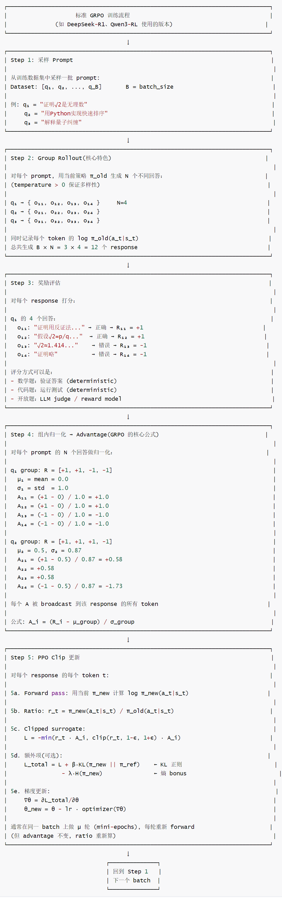
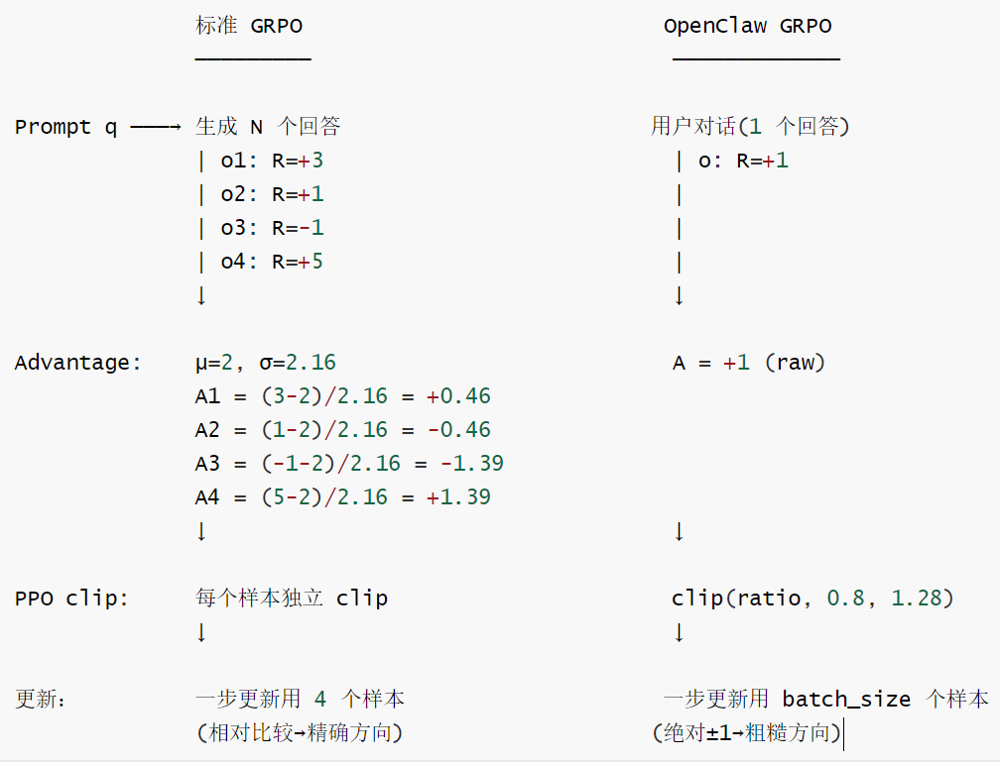
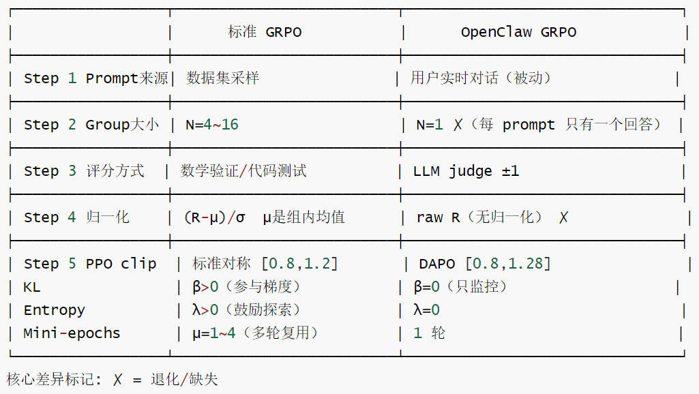

# 【Agentic RL / 强化学习 / OPD】OpenClaw-RL 源码阅读笔记 --- (12)--- GRPO

# 【Agentic RL / 强化学习 / OPD】OpenClaw-RL 源码阅读笔记 --- (12)--- GRPO

目录

* [【Agentic RL / 强化学习 / OPD】OpenClaw-RL 源码阅读笔记 --- (12)--- GRPO](#agentic-rl--强化学习--opdopenclaw-rl-源码阅读笔记-----12----grpo)
  + [0x00 概要](#0x00-概要)
  + [0x01 GRPO基础](#0x01-grpo基础)
    - [1.1 GRPO 解读](#11-grpo-解读)
      * [PPO](#ppo)
      * [GRPO](#grpo)
      * [Group Relative](#group-relative)
    - [1.2 DeepSeek R1的GRPO 设计](#12-deepseek-r1的grpo-设计)
      * [概要流程](#概要流程)
      * [详细流程](#详细流程)
    - [1.3 GRPO vs Baseline](#13-grpo-vs-baseline)
  + [0x02 OpenClaw-RL GRPO实现](#0x02-openclaw-rl-grpo实现)
    - [2.1 总体对比](#21-总体对比)
    - [2.2 为什么不是纯PPO](#22-为什么不是纯ppo)
      * [PPO 用到的部分](#ppo-用到的部分)
      * [PPO未用到的部分](#ppo未用到的部分)
      * [PPO模块调用链](#ppo模块调用链)
    - [2.3 为什么不是纯GRPO](#23-为什么不是纯grpo)
      * [纯GRPO](#纯grpo)
      * [本质冲突](#本质冲突)
      * [OpenClaw如何弥补这个gap？](#openclaw如何弥补这个gap)
    - [2.4 GRPO 优势的完整实现](#24-grpo-优势的完整实现)
      * [具体实现](#具体实现)
      * [N=1 退化](#n1-退化)
      * [与标准 GRPO 的步骤对比](#与标准-grpo-的步骤对比)
    - [2.5 loss\_mask与GRPO Advantage](#25-loss_mask与grpo-advantage)
      * [门控vs方向](#门控vs方向)
      * [OpenClaw中的具体映射](#openclaw中的具体映射)
    - [2.6 KL loss](#26-kl-loss)
      * [传统KL](#传统kl)
      * [OpenClaw-RL](#openclaw-rl)
    - [2.7 GRPO vs OPD](#27-grpo-vs-opd)
  + [0x03 对话场景与 GRPO](#0x03-对话场景与-grpo)
    - [3.1 核心矛盾回顾](#31-核心矛盾回顾)
    - [3.2 方案一](#32-方案一)
    - [3.3 方案二](#33-方案二)
    - [3.4 方案三](#34-方案三)
    - [3.5 方案四](#35-方案四)
    - [3.6 小结](#36-小结)
  + [0x04 再思考](#0x04-再思考)
    - [4.1 为什么说PPO/GRPO是表层选择？](#41-为什么说ppogrpo是表层选择)
      * [问题①深解：梯度方向由什么决定？](#问题深解梯度方向由什么决定)
      * [问题②深解：变化幅度由什么控制？](#问题深解变化幅度由什么控制)
    - [4.2 问题深解：稳定性来自哪里？](#42-问题深解稳定性来自哪里)
      * [条件A：Advantage方差控制](#条件aadvantage方差控制)
      * [条件 B: 步长约束是否匹配任务结构](#条件-b-步长约束是否匹配任务结构)
      * [条件 C: 分布偏移是否被监控](#条件-c-分布偏移是否被监控)
      * [小结](#小结)
    - [4.3 各技术路线的三问题映射](#43-各技术路线的三问题映射)
  + [0xFF 参考](#0xff-参考)

## 0x00 概要

本系列的目的是：借着对 OpenClaw-RL 源码的学习，来梳理强化学习的一些相关概念和思想。所以，会有一些基础知识、扩展和发散，OpenClaw-RL 只是一个切入点。而且，因为整篇系列是一个整体，所以有些概念的解读/学习会在不同的文章中出现，还请大家谅解。

OpenClaw-RL 是一个用于在线强化学习(Online RL)的框架，专门针对智能体工具使用场景。它通过从环境反馈中提取过程奖励信号来训练语言模型，支持三种主要模式：

* **openclaw-rl**：基于二元奖励的强化学习(Binary RL / GRPO)
* **openclaw-opd**：基于后见之明提示的在线策略蒸馏(On-Policy Distillation, OPD)
* **openclaw-combine**：联合方法，在同一 PPO 更新中同时利用 RL reward 和 OPD teacher signal


## 0x01 GRPO基础

GRPO (Group Relative Policy Optimization) 的核心思想: 不需要 value model, 用同一个 prompt 生成多个 response互相比较来估计 advantage。

```
 Standard PPO:   需要训练一个 V(s) → advantage = R - V(s)
 GRPO:           同题生成 N 个回答 → advantage = R_i - mean(R)
                                  (你的分数 - 班级平均分)
```

### 1.1 GRPO 解读

我们通俗解读下GRPO。

想象你在学校写作文。老师让你同一个题目写 8 篇，然后给每篇打分。

#### PPO

普通方法(PPO)：老师请了一个"评分专家"，这个专家会预测"这篇大概能得几分"。然后你只需要关注"比专家预测好多少"。但请专家很贵—你要养一个跟你一样大的"评分大脑"。

具体展开如下。

* 目标：让学生学会写出更好的作文，获得更高的分数(比如作文得高分、得到老师表扬)。先让他按自己的思路写几篇，发现哪个写作角度、哪种句式能得高分，就鼓励他多练习，但不是立刻让他彻底改变原有思路，而是慢慢让他多用更优的方法(避免一次性改变太多导致写得更差)。
* 策略定义：策略就是学生的写作“习惯”或方法，看到作文题目后按自己的思路选择写作角度、句式和素材。
* 收集数据：让学生按当前的写作习惯写几篇作文，记录每篇作文的写作思路、用到的素材以及最终的得分(奖励)。
* 估计好坏(优势)：计算每篇作文(或每个写作环节)比学生“平常写作表现”好多少(优势=实际得分－期望得分)。
* 更新策略的难点：一次把写作习惯改太多可能把原本不错的写作思路弄坏，所以需要限制修改幅度。

PPO的核心技巧：

* 计算比率 r = 新写作策略(新思路、新方法)= 写出该类型作文的效果概率/旧写作策略写出该类型作文的效果概率。
* 如果r偏离太多(写作方法改动太大)，就把目标函数里的贡献裁剪回安全区间(clip)，不让写作方法的更新过于激进。

简化流程步骤：

* 收集若干篇作文(按学生当前的写作策略完成)。
* 计算每篇作文(或每个写作环节)的优势(它到底比平时写得好多少)。
* 用带裁剪的目标函数更新写作策略：鼓励能带来高分的写作方法，但裁剪掉过于夸张的思路变化。
* 重复以上步骤，学生的写作策略逐步稳定变好，作文水平不断提升。

优点：

* 简单、稳定、不容易因为一次大幅修改写作方法而导致作文质量崩塌，适合很多和写作学习相关的强化学习场景。

#### GRPO

GRPO = “自己跟自己比，好的多学，差的少学”。

GRPO的方法：不请专家。而是直接比较你自己写的 8 篇：

```
题目："我最喜欢的动物"
作文1：得了 90 分
作文2：得了 60 分
作文3：得了 85 分
作文4：得了 70 分
...
平均分 = 76 分
```

然后 GRPO 说：

* 作文1(90分)：比平均高 14 分 → "这篇写得好，以后多像这样写" ☑
* 作文2(60分)：比平均低 16 分 → "这篇写得差，以后别这样写" ☒
* 作文3(85分)：比平均高 9 分 → "还不错，稍微多学学" ☑

核心思想：不需要"绝对标准"，只需要自己跟自己比。好的继续做，差的避免做。

#### Group Relative

为什么叫"Group Relative"?

* Group：一组 8 篇作文是一个"组"
* Relative：不看绝对分数，只看组内相对排名，即使 8 篇都写得很烂(全是 30-40 分)，GRPO 仍然能分辨"哪篇没那么烂"，然后朝那个方向改进。

### 1.2 DeepSeek R1的GRPO 设计

关键要素：

* Verifiable reward：答案对/错，数学不撒谎
* Group.normalization：同 prompt 的多条 response 互相比较，消除绝对分差
* 无Critic：用组内相对比较替代Value function

```
    #标准GRPO(DeepSeekMath /R1) 
    for prompt p:
        responses=sample_N(policy，p，N=8)#同一 prompt 采样 N 次 
        rewards=[verify(r)for r in responses] #验证器打分 (0/1)

        baseline= mean(rewards) #组内均值作为baseline
        advantages=(rewards-baseline)/ std(rewards) #归-化 
        PPO_clip_update(policy,advantages)
```

#### 概要流程

```
Step 1: 采样 prompt
  从 dataset 中取一个 prompt q

Step 2: Group rollout
  用当前策略 π_old 生成 N 个回答: {o_1, o_2, ..., o_N}

Step 3: 打分
  对每个回答算 reward: {R_1, R_2, ..., R_N}

Step 4: 组内归一化 → advantage
  μ = mean(R_1, ..., R_N)
  σ = std(R_1, ..., R_N)
  A_i = (R_i - μ) / σ      ← "你比平均好多少个标准差"

Step 5: PPO 更新
  对每个回答 o_i 的每个 token t:
    r_t = π_new(a_t|s_t) / π_old(a_t|s_t)
    L_t = -min(r_t · A_i, clip(r_t) · A_i)

  更新 θ_new = θ_old - lr · ∇L
```

#### 详细流程



### 1.3 GRPO vs Baseline

为什么 Group 比 Baseline 好？

传统方法(REINFORCE with baseline):

* 需要训练一个 V(s) 网络来估计 baseline
* V(s) 训练不稳定 → baseline 不准 → advantage 有偏

GRPO 的方法:

* 不需要 V(s)！
* 同一个 prompt 生成 N 个回答 → 组内均值 μ 就是 baseline
* 好处：

  + μ 是精确的组内均值，不是估计值 →无偏
  + 不需要额外训练value model →省GPU
  + δ归一化让不同难度的 prompt 梯度量级一致
* 代价：

  + 需要 N 次 rollout → 生成成本 ×N
  + N 太小 → μ，估计不准 → 方差大
  + N=1 时完全退化→ OpenClaw 的困境

## 0x02 OpenClaw-RL GRPO实现

OpenClaw Binary RL：名为 GRPO，实为 PPO-clip + REINFORCE式 Advantage。即，OpenClaw Binary RL既不是纯PPO，也不是纯GRPO 而是二者的杂交体。

### 2.1 总体对比

标准PPO vs 标准GRPO vs OpenClaw 的对比如下：

|  | 标准 PPO | 标准 GRPO | OpenClaw Binary RL |
| --- | --- | --- | --- |
| Advantage来源 | GAE(r,V) (需要 Critic) | 组相对归一化 (需要同prompt多条) | 直接用reward标量 (单条 turn, ±1/0) |
| Baseline | V(s) (Critic) | group mean/std | 无 baseline (或近似 batch mean) |
| Policy Loss | PPO clip ε=0.2 | PPO clip ε=0.2 | PPO clip ε=0.2, ε\_high=0.28 |
| KL 约束 | 有 (隐式 via clip) | 有 (隐式 via clip) | 无 (--kl-coef 0.0) |
| Critic 网络 | 需要 | 不需要 | 不需要 |

### 2.2 为什么不是纯PPO

OpenClaw Binary RL没有用到标准 PPO(带 Critic 的)。

完整PPO需要：

* ①一个独立的Critic网络估计V(s)
* ②GAE (Generalized Advantage Estimation):A\_t=δ\_t+γλδ\_{t+1} + ...,
* ③Value Loss 训练 Critic

#### PPO 用到的部分

PPO clip损失函数被所有三种方法使用，即PPO用到的模块：compute\_policy\_loss，三种方法最终都调用这个函数。代码里policy 更新用的是PPO-style clipped surrogate objective：

```
    ratio = exp(log T_new -log T_old)
    pg_loss = -min(ratio * adv, clip(ratio,1-e,1+e_high) * adv)
```

但这只是“PPO clip技巧"，即PPO clip loss(重要性权重比截断)，不是完整PPO。

即，OpenClaw 使用的 = REINFORCE-like advantage + PPO-style update：

* advantage=raw reward(±1)→broadcast 到所有token
* 更新规则=PPO clip(防止policy变化太大)

但PPO的其他部分“(Critic/Value Network、GAE advantage、TD returns)一概未用。

#### PPO未用到的部分

PPO未用到的部分具体如下：

| PPO 原始组件 | 状态 | 原因 |
| --- | --- | --- |
| Critic (Value Network) | 未使用 | advantage\_estimator != "ppo" / reward直接广播到所有token → 这是GRPO/REINFORCE 风格 |
| GAE (λ-return) | 未使用 | 没有 value function 就无法计算 GAE |
| TD-style returns | 未使用 | 同上 |
| KL penalty (对 ref model) | 未使用 | --kl-coef 0.0（代码 293-296 行：kl\_coef==0 → kl=[zeros]） |
| Reward normalization | 未使用 | --disable-rewards-normalization |

#### PPO模块调用链

三种方法的PPO模块调用链如下：

```
Binary RL:
  Slime主循环
    → compute_advantages_and_returns(advantage_estimator="grpo")
    	→ get_grpo_returns() [advantage =reward 标量广播] 
    → policy_loss_function()(Slime默认)
    	→ compute_policy_loss(ppo_kl,grpo_adv,e=0.2,e_high=0.28) ← PPO clip

OPD:
  Slime主循环
	→ compute_advantages_and_returns(advantage_estimator="on_policy_distillation")
		→ advantages =teacher_lp-student_lp [per-token] 
	→ policy_loss_function()(Slime默认)
		→ compute_policy_loss(ppo_kl,opd_adv,e=0.2,e_high=0.2) ← PPO clip (symmetric, OPD does not pass --eps-clip-high)

Combine:
  Slime主循环
   → compute_advantages_and_returns() ← 计算grpo_adv(存入batch["advantages"])
   → combine_loss_function()(自定义，绕过Slime默认loss)
        → teacher_adv=teacher_lp-rollout_lp
        → combined_adv=w_opd *teacher_adv+w_rl*grpo_adv
        → compute_policy_loss(ppo_kl,combined_adv,e=0.2,e_high=0.28) ← PPO clip
```

三种方法的advantage分支对照

```
# ::compute_advantages_and_returns()
if args.advantage_estimator in ["grpo"，"gspo"]: # BinaryRL使用
	returns = get_grpo_returns(rewards,kl) # 标量reward广播
elif args.advantage_estimator =="on_policy_distillation":# OPD 使用
	advantages =[teacher_lp -student_lp for...] #per-token教师差
# Combine：完全绕过上面所有分支
# → 使用combine_loss.py::combine_loss_function()直接计算combined_adv
# → 不进入compute_advantages_and_returns()
```

### 2.3 为什么不是纯GRPO

#### 纯GRPO

纯GRPO的条件：

* 需要：同一个prompt生成G条不同的completion，即GRPO 的前提：同一个 prompt 采样多次，做组内比较。
* 用：advantage=(reward\_i-mean(group))/std(group)

#### 本质冲突

而OpenClaw 场景的本质冲突：GRPO需要探索(多采样)，在线服务需要确定性(只有一条回复)。

DeepSeek R1：

```
	"What is 1764's square root?" × 8 → 比较哪些 response 正确
                                            ↑ 8条中有对有错，自然有对比
```

OpenClaw：

OpenClaw无法做到：用户发了一条消息→只有一个真实回复(不能“重新生成G条")，对话是实时的，无法批量采样.

```
    用户A："帮我写一封邮件" → 只有1条真实 response
    用户B："解释一下量子纠缠" → 只有1条真实 response
    不能为了做 GRPO 而生成8条 "fake responses" 给真实用户！
```

即：



#### OpenClaw如何弥补这个gap？

OpenClaw借用了 DeepSeek R1 的 GRPO 框架(PPO clip + 无 Critic)，但把"可验证数学奖励 + 组内比较"替换成了"LLM judge隐式信号 + majority vote 降噪"。这是把 GRPO 从"闭卷考试"(数学有标准答案)迁移到"开卷对话"(无标准答案)的工程适配。

```
    DeepSeek R1的 group normalization(组内对比)
    OpenClaw的 majority vote(跨时间对比)

    DeepSeek R1：8条同prompt response → 组内相对排名
    OpenClaw：3次独立judge评分 → 投票取多数

    DeepSeek R1：方差来源 = 生成随机性(可控)
    OpenClaw：方差来源 = judge的不确定性 + 用户行为的多样性(噪声更大)
```

### 2.4 GRPO 优势的完整实现

2.3 我们得出结论：OpenClaw 的 GRPO 因 N=1 退化为带 PPO clip 的 REINFORCE。这一节我们看具体代码实现。

#### 具体实现

OpenClaw 对标准 GRPO 做了大幅简化：GRPO 优势 = 标量 reward 均匀广播到整个 response。关键参数 `--disable-rewards-normalization` 关闭 batch 内归一化，rewards 保持原始的 ±1，不做 `(r - mean) / std` 处理。

```
# ppo_utils.py
# reward = +1.0
# response = [token_1, token_2, ..., token_T]
# grpo_advantages = [+1.0, +1.0, ..., +1.0]  # T 个值完全相同
# slime/slime/utils/ppo_utils.py 中的 get_grpo_returns():
def get_grpo_returns(rewards: torch.Tensor, kl: list[torch.Tensor]):
    returns = []
    for i in range(len(rewards)):
        returns.append(torch.ones_like(kl[i]) * rewards[i])  # 标量广播到所有 token，无 baseline
    return returns

# 2. PPO clip (ppo_utils.py L125-134)
def compute_policy_loss(kl, advantages, eps_clip, eps_clip_high):
    ratio = torch.exp(-kl)                              # π_new / π_old
    pg_loss1 = -advantages * ratio                      # 无 clip
    pg_loss2 = -advantages * torch.clamp(ratio,
                    1.0 - eps_clip,          # 0.8
                    1.0 + eps_clip_high)     # 1.28 (DAPO)
    pg_loss = torch.max(pg_loss1, pg_loss2)             # 取更保守的
```

#### N=1 退化

标准 GRPO：`A_i = (R_i - mean(R)) / std(R)`。当 N=1 时：`A = (R - R) / 0 = 0/0` → 未定义！所以 OpenClaw 关闭了 advantage 归一化，直接用 raw reward：

```
advantages[i] = torch.ones_like(kl[i]) * rewards[i]  # reward broadcast

# N=1 的 GRPO 本质上就是 REINFORCE + PPO clip:
#     ∇L ≈ R · ∇log π(o | q)   ← 纯 REINFORCE
#     + clip 约束              ← PPO 的信任域
```

#### 与标准 GRPO 的步骤对比



OpenClaw 的 GRPO 失去了"组内比较"这个核心优势，变成了带 PPO clip 的 REINFORCE。这也是为什么 OPD 的 per-token dense advantage 那么重要——它弥补了 GRPO 退化后丢失的信号精度。

### 2.5 loss\_mask与GRPO Advantage

我们再来看看 loss\_mask 的作用。

掩码设置逻辑如下：

* 有效样本：当 prm\_score != 0 时，设置 loss\_mask =True
* 无效样本：当 prm\_score ==0时，通常设置 loss\_mask=False
* 特殊机制：“至少一个保证“机制确保会话至少有一个有效样本

损失掩码应用于整个响应序列的所有token，确保只有有效的训练样本参与梯度计算。

#### 门控vs方向

loss\_mask 和 GRPO Advantage 这两者的本质区别如下：

* loss\_mask：二元门控

  + →决定这个token/turn是否进入梯度计算
  + `+1(好)→loss_mask=[1](参与训练)`
  + `0(中性)→loss_mask=[0](不参与训练，除非at-least-one触发)`
  + `-1(差)→loss_mask=[1](参与训练，作为负样本)`
* GRPO Advantage：方向信号

  + → 在纳入训练的token中，朝哪个方向更新
  + → 正值=增大这些token的生成概率
  + → 负值=减小这些token的生成概率

最终梯度贡献：gradient(token t) = loss\_mask(t) × policy\_gradient(advantage(t))

逻辑真值表：

* loss\_mask=0 → gradient = 0（无论 advantage 是什么，门关了）
* loss\_mask=1，advantage > 0 →正向梯度，P(token)上升
* loss\_mask=1，advantage < 0 →负向梯度，P(token)下降
* loss\_mask=1，advantage ≈ 0 →近零梯度，P(token)基本不变

#### OpenClaw中的具体映射

评分→ loss\_mask + reward的完整映射：

* Judge score = +1(好的回复)：
  + loss\_mask = [1] →纳入训练
  + reward = +1.0→GRPO计算出正advantage
  + 结果：这个turn的所有token 被推高概率(“继续这样做")

* Judge score=0(中性回复)：
  + loss\_mask =[0] →排除在外
  + reward =0.0 → 不影响advantage计算(因为已排除)
  + 结果：零梯度，Policy对这类回复没有任何更新

* Judge score =-1(差的回复)：
  + loss\_mask=[1]→纳入训练
  + reward =-1.0→GRPO计算出负advantage
  + 结果：这个turn的所有token被拉低概率(“别这样做")

GRPO Advantage 在 Slime 中的计算：

```
# advantages[i]=标量奖励广播到整个序列
advantages[i]= torch.ones_like(kl[i]) * rewards[i]

# rewards[i]=+1或-1(来自_sample.reward 字段)
# kl[i] 的形状 =(sequence_length，)
# torch.ones_like(kl[i])*rewards[i]=每个token都用同一个值
```

### 2.6 KL loss

我们再来看看，为什么OpenClaw当前的GRPO配置虽然kl\_loss\_coef=0(无KL)仍然稳定？

#### 传统KL

KL在传统RLHF中并非"通用安全带"，它具体防四件事：

| 防什么 | 是否被GRPO自动解决 |
| --- | --- |
| 防 reward model 被hack | 取决于reward是否可hack |
| 防策略远离自然语言流形 | GRPO 用 on-policy 采样 + group normalization 部分缓解 |
| 防训练数值不稳定(logratio爆炸) | PPO clip已经在做 |
| 防遗忘 ref 的能力 | 如果不需要保留 ref能力，则不需要 |

#### OpenClaw-RL

OpenClaw-RL 在kl\_loss\_coef=0(无KL)时，仍然稳定，是因为5个因素共同保障：

* PPO clip(0.2/0.28):提供 step-wise trustregion
* GRPO zero-sum：组内advantage之和=0，不会一边倒强化
* 用户多样性：外部prompt不重复，天然提供entropy
* 短训练：36/24次交互的量级，策略漂移有限
* Mode collapse自停：当组内reward 方差→0，advantage→0，梯度自然消失

### 2.7 GRPO vs OPD

最后再来看看GRPO vs OPD。

| 对比项 | GRPO(Binary RL) | OPD |
| --- | --- | --- |
| 输入来源 | sample.reward `["score"](标量)`e.g. +1.0 / -1.0 | sample.teacher\_log\_probs(向量)e.g. [-0.1, -0.3, -0.1, -0.2] |
| 优势形状 | [T] 全部相同值[+1, +1, +1, +1] | [T] per-token 不同值[+0.2, +0.9, 0.0, +0.6] |
| reward 归一化 | 可选(OpenClaw 禁用)`--disable-rewards-normalization` | 不涉及(差值直接用) |
| KL 的作用 | get\_grpo\_returns 用 kl [i]只是复制标量到对应维度，kl 本身的值不影响优势 | 完全不用 kl(仅用于形状对齐)`advantages = teacher - student` |
| 适用条件 | reward 不为 Noneloss\_mask=[1] | teacher\_log\_probs 不为 Noneloss\_mask=[1] |
| reward=0 时 | advantages = [0, 0, ..., 0]梯度为零，样本无效 | 不适用(OPD 丢弃 reward=0 样本) |

优势函数两者在 Slime 中的具体位置

```
slime/backends/megatron_utils/loss.py: compute_advantages_and_returns()
    ├── if advantage_estimator == "grpo":           <- Binary RL 使用
    │       advantages = get_grpo_returns(rewards, kl)
    │
    └── elif advantage_estimator == "on_policy_distillation": <- OPD 使用
            teacher_log_probs = [t_lp.to(device=device) for t_lp in teacher_log_probs]  # ← 移动到正确设备
            advantages = teacher_log_probs - student_log_probs
```

## 0x03 对话场景与 GRPO

虽然 OpenClaw-RL 没有用到纯 GRPO，我们依然要展开，讨论在对话场景实现 GRPO 组内对比的方案。

### 3.1 核心矛盾回顾

* GRPO 需要： 同一 prompt → N 条 responses → 组内比较
* 对话场景： 用户只能接收 1 条 response → 无法"重放"同一 prompt

### 3.2 方案一

方案一：Session 内历史作为"软组"

```
# 当前：每条 turn 的 advantage = reward(无 baseline)
advantages[i] = reward_i
# 改进：session 内历史均值作为 baseline
session_baseline = running_mean(session_rewards[session_id])
advantages[i] = reward_i - session_baseline
# 意义：
# 比本 session 历史平均好 → 正 advantage
# 比本 session 历史平均差 → 负 advantage
```

适用场景：同一个用户持续对话，session 内分布相对稳定

优点：在 OpenClaw 中，session 历史均值 baseline 是最低成本的改进

局限：session 内只有几轮 turn，样本量小，baseline 不稳定

### 3.3 方案二

方案二：Best-of-N + 选一条给用户(推理成本 × N)

```
用户发送 query
	↓
并行生成 N=4 条 candidate responses
    ↓
Judge 快速打分(轻量级，非 majority vote)
    ↓
选择得分最高的那条回复给用户
    ↓
用所有 N 条 + 对应 scores 做 GRPO group update
    R = [+1, -1, 0, +1]
    baseline = mean(R) = 0.25
    advantages = [+0.75, -1.25, -0.25, +0.75]
```

优点：完全还原 GRPO 语义；用户还能看到更好的回复(Best-of-N 服务质量提升)

代价：推理成本 × N

### 3.4 方案三

方案三：OPD 本质上已经是 N=2 的组内对比(已有！)

```
Response A：学生的原始回复(score = PRM eval)
Response B：Teacher hint 指出的"更好路径"

→ 两者比较 = teacher_lp - student_lp = OPD advantage

GRPO (N=8)：advantages = [r_i - mean(r)] for 8 candidates
OPD (N=2)：advantage[t] = log π_teacher(t) - log π_student(t)
                            ↑  					↑
                          "更好的回复" 	     "实际给用户的回复"
```

OPD 是一种隐式的 N=2 GRPO，只是"另一条 response"是 teacher 的 log-prob，而非实际生成的另一条文本。

### 3.5 方案四

方案四：Speculative Sampling + GRPO

```
生成 response 时，用 draft model 生成 N 条 token-level candidates

Policy model 对每条 score → 组内 GRPO，只把接受的 token 序列发给用户
```

类比：Speculative Decoding + RL

### 3.6 小结

```
实用程度         方案
-------------------------------------
最低改动          Session 历史均值作 baseline(加几行代码)
已经存在          OPD = 隐式 N=2 GRPO(无需改动)
最接近标准 GRPO   Best-of-N + 选最优(推理成本翻 N 倍)
前沿方向          Speculative + GRPO(尚未工程化)
```

## 0x04 再思考

我们由这句话来思考的------ “做RL优化时，重点不只是用了 PPO还是GRPO，而是有没有把模型生成行为的分布控制好，我们更关心的是策略应当朝什么方向变化、变化幅度多大，以及如何在提升能力的同时保持训练稳定。”

即：PPO VS GRPO 是表层，分布控制是本质

### 4.1 为什么说PPO/GRPO是表层选择？

PPO和GRPO都在解决同一个根本问题：“给定一批 rollout 和对应的 reward，如何更新 policy 权重？“

* PPO 的方案：有价值函数(critic)+clip+KL 惩罚
* GRPO 的方案：用组统计作为baseline+clip(无 critic)

但无论用哪个，真正决定训练好坏的是三个更深层的问题，这三个核心问题(远比算法选择重要)：

* ①策略应当朝什么方向变化？=Advantage估计问题(梯度方向)
* ②变化幅度多大？=步长控制问题(梯度尺度)
* ③ 如何在提升能力的同时保持稳定？ =稳定性一进步的权衡(约束设计)

#### 问题①深解：梯度方向由什么决定？

这个问题的本质：advantage是什么，就往哪个方向更新

#### 问题②深解：变化幅度由什么控制？

* PPO clip的本质：限制概率比，而非限制参数距离
* KL惩罚：`L_total =L_policy-β*KL(π_new l π_ref)` ，直接约束新 policy 与参考policy 的距离，比clip更“全局"，但需要调整β
* Entropy正则化：L\_total =L\_policy+a \*H(π\_new)，防止policy缩到确定性(探索空间保护)
* 学习率：最直接的步长控制，但粒度粗
* 更新步数perbatch：增加重复使用同一批数据的次数>放大有效步长
* OpenClaw的选择：

  + e=0.2，e\_high=0.28(c1ip，相对宽松)
  + --kl-coef0.0(无KL惩罚)
  + =只依赖clip控制步长，其他约束全部关闭
  + =相对激进的更新方式(在线实时数据做支撑)

### 4.2 问题深解：稳定性来自哪里？

稳定性不是“用哪个算法“决定的，而是三个条件的组合：

#### 条件A：Advantage方差控制

* 方差大的advantage→梯度方向不稳定→更新在正确方向震荡
* 方差来源：reward 噪声、baseline 质量、轨迹长度

#### 条件 B: 步长约束是否匹配任务结构

* 单轮任务 (数学题): clip ε=0.2 通常够
* 长轨迹 Agentic 任务: 前面的错误会在轨迹中级联放大 → 需要更保守的步长控制 → 这是为什么 K1.5 要用 mirror-descent 风格的相对熵正则化

#### 条件 C: 分布偏移是否被监控

off-policy 数据进入训练时, 梯度方向已经不准确 → 如果不做 IS 修正或 staleness filter → 更新方向可能完全错误

#### 小结

稳定性的真正来源：Advantage 方差小 + 步长约束合适 + 分布偏移可控。并非"用了 PPO 所以稳定"

### 4.3 各技术路线的三问题映射

```
                  ① 方向 (Advantage)     ② 幅度 (Step Control)       ③ 稳定性
─────────────────────────────────────────────────────────────────────────────────────
标准 PPO          GAE (低方差)            clip + KL 惩罚              critic 降噪
GRPO              组均值 (无 critic)      clip only                  简单但方差大
K1.5 LongRL       GRPO                   镜像梯度 + KL 正则          相对熵约束
K2.5              步骤级 GRPO            token-level clip           IS 修正
SAMPO             REINFORCE++            无 KL + entropy 监控        off-policy 修正
OpenClaw RL       Turn-level scalar      clip ε=0.2/0.28            只靠 clip
OpenClaw OPD      teacher-student        clip + distillation        teacher 锚定
Combine           GRPO + OPD 混合        clip + combined loss       两路互补
```

## 0xFF 参考

[【论文学习】Stabilizing Reinforcement Learning with LLMs: Formulation and Practices](https://zhuanlan.zhihu.com/p/2000670226958804400)
