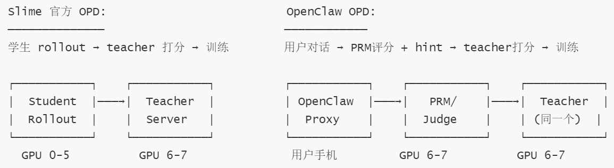
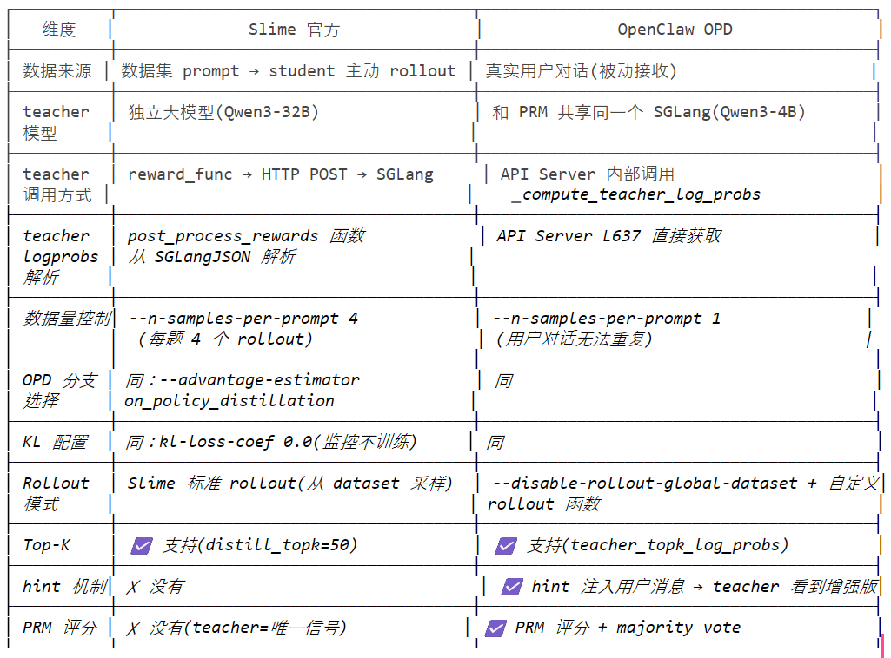
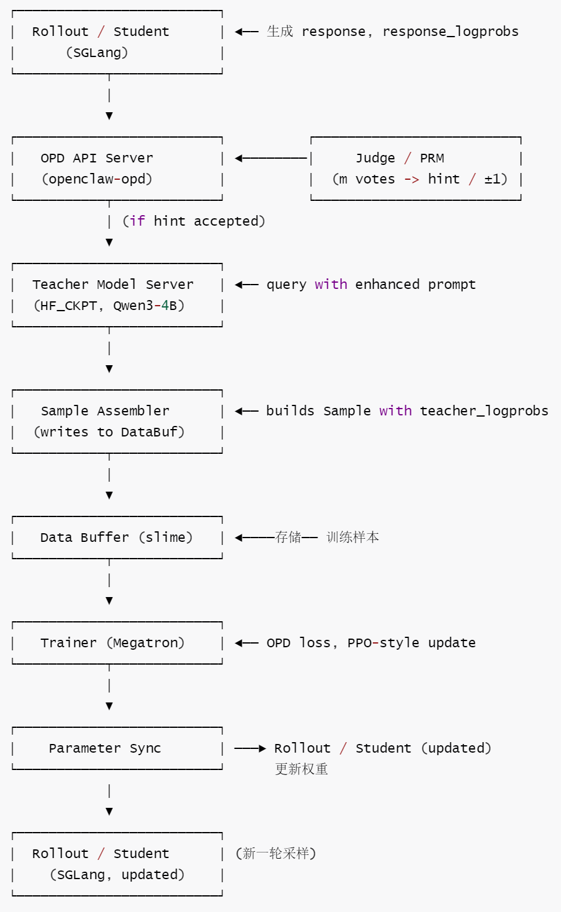
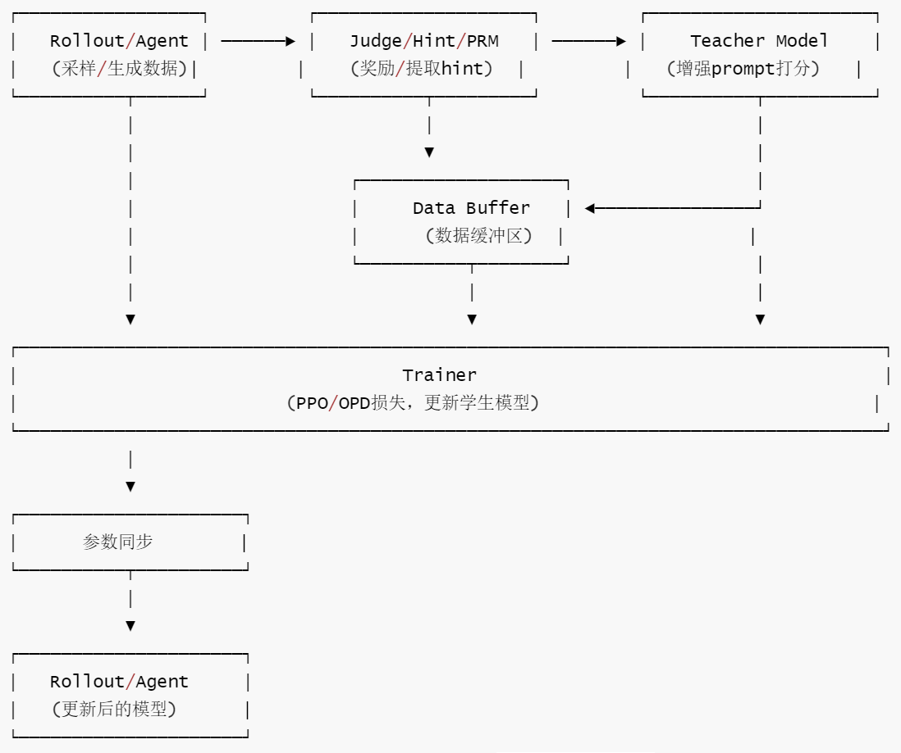
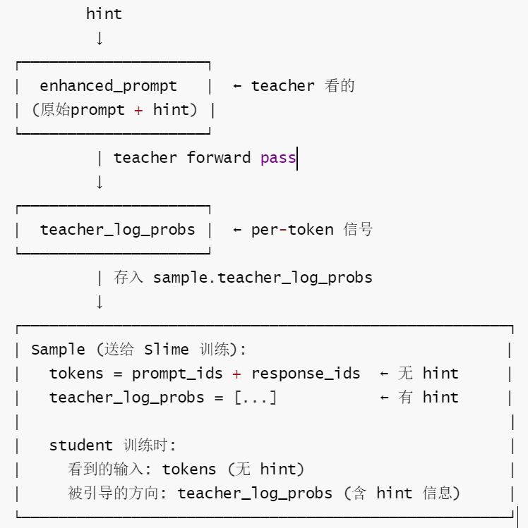
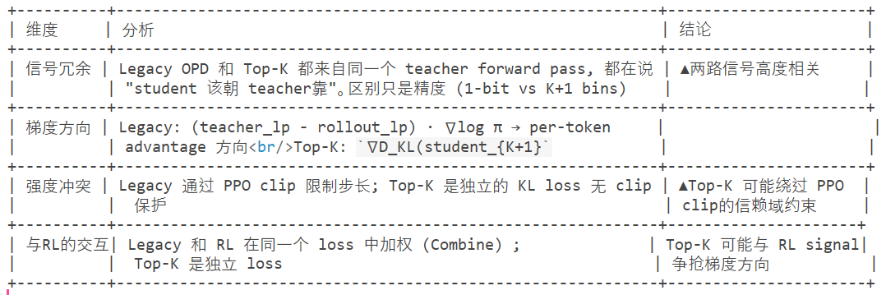

# 【Agentic RL / 强化学习 / OPD】OpenClaw-RL 源码阅读笔记 --- (13)--- OPD实现

# 【Agentic RL / 强化学习 / OPD】OpenClaw-RL 源码阅读笔记 --- (13)--- OPD实现

目录

* [【Agentic RL / 强化学习 / OPD】OpenClaw-RL 源码阅读笔记 --- (13)--- OPD实现](#agentic-rl--强化学习--opdopenclaw-rl-源码阅读笔记-----13----opd实现)
  + [0x00 概要](#0x00-概要)
  + [](#_)
  + [0x01 基础背景](#0x01-基础背景)
    - [1.1 通俗讲解](#11-通俗讲解)
    - [1.2 数学形式](#12-数学形式)
    - [1.3 OPD 优势的工程要点](#13-opd-优势的工程要点)
    - [1.4 统一监督来源](#14-统一监督来源)
    - [1.5 Slime 官方 OPD vs OpenClaw OPD 对比](#15-slime-官方-opd-vs-openclaw-opd-对比)
      * [架构差异](#架构差异)
      * [逐项对比](#逐项对比)
      * [三个核心区别](#三个核心区别)
        + [teacher = student (自蒸馏) vs teacher > student](#teacher--student-自蒸馏-vs-teacher--student)
        + [teacher logprobs 来源不同](#teacher-logprobs-来源不同)
        + [被动 rollout vs 主动 rollout](#被动-rollout-vs-主动-rollout)
  + [0x02 OPD 总体](#0x02-opd-总体)
    - [2.1 总体流程](#21-总体流程)
      * [关键概念](#关键概念)
    - [2.2 详细步骤](#22-详细步骤)
    - [2.3 训练](#23-训练)
      * [OpenClaw-OPD 完整训练架构](#openclaw-opd-完整训练架构)
      * [训练样本格式](#训练样本格式)
      * [依赖关系和数据流](#依赖关系和数据流)
    - [2.4 辅助组件](#24-辅助组件)
      * [后见之明提示提取器](#后见之明提示提取器)
      * [教师模型查询器](#教师模型查询器)
    - [2.5 数据结构](#25-数据结构)
    - [2.6 与 Slime 的交互](#26-与-slime-的交互)
      * [设计哲学](#设计哲学)
      * [Slime loss.py 里的 OPD 分支](#slime-losspy-里的-opd-分支)
      * [关键接口: Sample 对象的字段](#关键接口-sample-对象的字段)
      * [关键观察](#关键观察)
  + [0x03 Hint](#0x03-hint)
    - [3.1 Hint 提取](#31-hint-提取)
    - [3.2 Teacher 构建：Hint注入 Prompt](#32-teacher-构建hint注入-prompt)
    - [3.3 关键澄清](#33-关键澄清)
      * [具体流程](#具体流程)
      * [为什么这样设计？](#为什么这样设计)
      * [信息流图](#信息流图)
    - [3.4 Hindsight Advantage的理论依据](#34-hindsight-advantage的理论依据)
      * [问题根源：online RL中的信用分配困境](#问题根源online-rl中的信用分配困境)
      * [Hindsight Information Gain(信息论视角)](#hindsight-information-gain信息论视角)
      * [与Hindsight Experience Replay(HER)的联系](#与hindsight-experience-replayher的联系)
      * [与 Advantage 函数的关系](#与-advantage-函数的关系)
      * [Why Hindsight is "Safe"for Online RL](#why-hindsight-is-safefor-online-rl)
      * [Hindsight Advantage 的局限性](#hindsight-advantage-的局限性)
      * [与 KL-Regularized RL 的统一框架](#与-kl-regularized-rl-的统一框架)
  + [0x04 \_opd\_evaluate](#0x04-_opd_evaluate)
    - [4.1 核心设计](#41-核心设计)
    - [4.2 样本字段的关键差异](#42-样本字段的关键差异)
    - [4.3 流程图](#43-流程图)
    - [4.4 详细流程](#44-详细流程)
      * [Step 1-3：Hint 提取（详见 0x03）](#step-1-3hint-提取详见-0x03)
      * [Step 4: (可选) 独立 PRM 评分 (eval\_mode)](#step-4-可选-独立-prm-评分-eval_mode)
      * [Step 5: hint 注入 → 构建教师输入](#step-5-hint-注入--构建教师输入)
      * [step 6: 教师 Forward Pass (核心)](#step-6-教师-forward-pass-核心)
      * [Step 7: (可选)Top-K log-probs](#step-7-可选top-k-log-probs)
  + [0x05 Top-K](#0x05-top-k)
    - [5.1 KL 使用的精确总结](#51-kl-使用的精确总结)
    - [5.2 特色](#52-特色)
      * [参考论文](#参考论文)
      * [single-token VS top-K distribution](#single-token-vs-top-k-distribution)
      * [teacher top k VS student top k](#teacher-top-k-vs-student-top-k)
      * [OpenClaw teacher top k](#openclaw-teacher-top-k)
      * [为什么 OpenClaw 这样选?](#为什么-openclaw-这样选)
  + [0x06 讨论](#0x06-讨论)
    - [6.1 OPD 是否等价于一种特殊的 Knowledge Distillation?](#61-opd-是否等价于一种特殊的-knowledge-distillation)
      * [与标准 KD 的对比](#与标准-kd-的对比)
      * [OPD 的独特之处](#opd-的独特之处)
      * [与 SDFT/SDPO 的关系](#与-sdftsdpo-的关系)
    - [6.2 OPD per-token advantage vs GRPO broadcast](#62-opd-per-token-advantage-vs-grpo-broadcast)
      * [直观例子](#直观例子)
      * [数学上的差异](#数学上的差异)
      * [训练效率的影响](#训练效率的影响)
    - [6.3 Legacy OPD 和 Top-K 蒸馏能否同时使用](#63-legacy-opd-和-top-k-蒸馏能否同时使用)
      * [证据](#证据)
      * [问题分析](#问题分析)
      * [三种使用方案](#三种使用方案)
      * [潜在风险](#潜在风险)
      * [结论](#结论)
  + [0xFF 参考](#0xff-参考)

## 0x00 概要

本系列的目的是：借着对 OpenClaw-RL 源码的学习，来梳理强化学习的一些相关概念和思想。所以，会有一些基础知识、扩展和发散，OpenClaw-RL 只是一个切入点。而且，因为整篇系列是一个整体，所以有些概念的解读/学习会在不同的文章中出现，还请大家谅解。

OpenClaw-RL 是一个用于在线强化学习（Online RL）的框架，专门针对智能体工具使用场景。它通过从环境反馈中提取过程奖励信号来训练语言模型，支持三种主要模式：

* **openclaw-rl**：基于二元奖励的强化学习（Binary RL / GRPO）
* **openclaw-opd**：基于后见之明提示的在线策略蒸馏（On-Policy Distillation, OPD）
* **openclaw-combine**：联合方法，在同一 PPO 更新中同时利用 RL reward 和 OPD teacher signal

## framework

## 0x01 基础背景

OpenClaw-RL：把 OPD 变成一种在线的 next-state 学习机制。

训练目标：如何在学生自己访问到的状态上，用更强条件下的 teacher 分布提供逐 token 的密集监督

### 1.1 通俗讲解

举个生活中的例子这就像是：

* 你第一次包饺子，把馅儿放太多了，饺子破了
* 妈妈告诉你："下次少放点馅儿，皮要捏紧一点！
* 你看妈妈包一次：发现原来馅儿要适量，手法要轻柔
* 你再试一次：成功包出了漂亮的饺子！

为什么 OPD 有效？

* 不用骂AI：不给它打分说"好"或"坏"，而是给它有用的建议
* 学得更快：直接告诉它怎么改进，而不是让它自己瞎猜
* 越用越强：每帮你一次，它就变得更聪明一点

### 1.2 数学形式

在具体形式上，OpenClaw-RL 的 hindsight-guided OPD 仍然是逐 token 的 logprob 差。设增强后的 teacher context 为 \(s\_t^{\text{enhanced}}\)，则对原响应 a\_t 的第 k 个 token，可以写成：

\(A\_{t,k}=\log \pi\_{\text{teacher}}(a\_{t,k}\mid s\_t^{\text{enhanced}}, a\_{t,<k})-\log \pi\_{\theta}(a\_{t,k}\mid s\_t, a\_{t,<k})\)

这个式子本质上是：teacher 比 student 更认可这个 token 的程度。是在 student 自己生成的 token 序列上，蒸馏 teacher 对这些 token 的概率分布。

* \(A\_{t,k}>0\) 表示：
  + 在 hindsight hint 的帮助下，teacher 更认可这个 token，学生应该提高它的概率；
  + 如果某个 token 上 teacher 概率高、student 概率低 → advantage 为正 → 训练会推动 student 提高这个 token 的概率
* \(A\_{t,k}<0\) 表示
  + teacher 觉得这个 token 在 hindsight 下不合适，应该压低。
  + 如果 student 已经比 teacher 更高 → advantage 为负 → 训练会推动 student 降低这个 token 的概率

用代码实现如下：

```
student_log_probs[i] = [ log π_θ(a₁|s), log π_θ(a₂|s), … , log π_θ(a_t|s) ]
teacher_log_probs[i] = [ log π_T(a₁|s+hint), … , log π_T(a_t|s+hint) ]

advantages[i][t] = log π_T(a_t | s + hint) - log π_θ(a_t | s)
                 = teacher 在看到 hint 后对当前 token 的置信度
                   - student 生成该 token 时的原始置信度
```

和普通 sequence-level RL 最大的区别就在这里：RL 往往只能告诉模型"这整步大体是对还是错"，而 OPD 可以在同一条回复内部，对不同 token 给出不同方向的更新信号。有些 token 会被强化，有些 token 会被抑制，因此 credit assignment 会更局部，也更接近真正出错的位置。

所以，On-Policy Distillation之所以更能避免知识遗忘，核心原因在于它让模型在自己的轨迹上学习，并且由教师提供密集、逐步的纠错信号，来重新对齐之前的各教师模型。

在 README.md中也提到了

```
On-Policy Distillation using hindsight hints and teacher knowledge:

1. Policy model generates responses; environment provides next_state observations
2. Hint judge extracts key information from next_state into a concise hint
3. Teacher model scores the response (with hint context) to get token-level log-probs
4. Advantage = reverse KL from teacher: `-kl_coef * (student_lp - teacher_lp)`
5. All samples get reward = 1.0 (no explicit reward signal)
6. Optional `--eval-mode`: also compute PRM eval scores for monitoring
```

### 1.3 OPD 优势的工程要点

1.2 节给出了 OPD advantage 的数学形式，本节补充几个工程实现的关键要点。

**rollout log-prob 用旧策略**：OPD 使用 `rollout_log_probs`（旧策略），这与 PPO 的策略修正保持一致：

```
A_t^OPD = log π_T(a_t | s + hint) - log π_θ_old(a_t | s)
#                             ^^^^^^^^^^^^^^
#                             rollout 时的旧策略
# 然后通过 PPO clipping 的 importance ratio π_new / π_old 进行重要性采样校正。
```

**Teacher 和 Student 是同一个模型**：两者实际上是同一个模型，区别仅在于输入上下文不同。强迫老师模型在看到了提示 \(s\_{enhanced}\) 的情况下去生成和学生一模一样的回复轨迹 \(a\_t\)，从而观察老师对每一个词的概率认可度。

**Judge 精炼 next\_state**：使用 Judge 模型将原始下一状态信号精炼为简洁、可操作的提示（通常 1-3 句话），而非直接使用 \(s\_{t+1}\) 作为提示。这是因为原始信号往往包含噪声或无关信息。

**严格质量过滤**：OPD 采用严格的质量过滤——只有提示长度超过 10 字符且为正向评分（score = +1）的样本才进入训练，这体现了"用样本质量换取信号质量"的设计理念。

下面是 `sample_to_datum_combined` 中的核心实现（Combine 模式下 OPD 与 RL 的混合）：

```
def sample_to_datum_combined(
    sample: TrainingSample,
    w_opd: float = 1.0,
    w_rl: float = 1.0,
    kl_penalty_coef: float = 0.0,
):
    """Convert one sample into a Tinker Datum with combined OPD+RL advantages.

    combined_adv_i = w_opd * (-kl_coef * (student_lp_i - teacher_lp_i)) + w_rl * reward
    """
    prompt_len = len(sample.prompt_tokens)
    all_tokens = sample.prompt_tokens + sample.response_tokens

    logprobs = [0.0] * (prompt_len - 1) + list(sample.response_logprobs)

    resp_advantages = []
    for i in range(len(sample.response_tokens)):
        mask = float(sample.loss_mask[i]) if i < len(sample.loss_mask) else 0.0

        # RL component: broadcast scalar reward
        rl_adv = w_rl * sample.reward * mask

        # OPD component: reverse-KL from teacher
        opd_adv = 0.0
        if sample.teacher_logprobs is not None and kl_penalty_coef > 0 and i < len(sample.teacher_logprobs):
            student_lp = sample.response_logprobs[i] if i < len(sample.response_logprobs) else 0.0
            teacher_lp = sample.teacher_logprobs[i]
            opd_adv = w_opd * (-kl_penalty_coef * (student_lp - teacher_lp)) * mask

        resp_advantages.append(rl_adv + opd_adv)

    advantages = [0.0] * (prompt_len - 1) + resp_advantages
    return _build_datum(all_tokens, logprobs, advantages, sample.session_id, sample.turn_num)
```

### 1.4 统一监督来源

从自我蒸馏技术体系的宏观视角出发，OpenClaw-RL的核心定位可得到清晰界定。该方法与现有技术共享一致的底层逻辑框架：以模型自身生成的轨迹作为核心学习样本，同时依托信息维度更丰富的分布生成教师监督信号，通过词元级密集监督机制完成模型优化过程。

OpenClaw-RL的核心技术突破，在于对自我蒸馏框架中特权信息来源的创新性重构。不同于现有方法对任务特定性特权信息的依赖，该架构将交互过程中普遍存在的“下一状态”作为核心监督载体。各种异构成分，均可通过抽象建模转化为标准马尔可夫决策过程(MDP）的状态表征，为统一监督信号的生成提供了基础。

基于这一设计，OpenClaw-RL已超越单一任务场景下的自我蒸馏优化技巧，形成面向通用智能体训练的架构升级方案。其核心优势在于将“下一状态”转化为可复用、可统一的监督资源，有效打破了不同任务场景间的监督信号壁垒，实现了多源异质反馈向标准化学习信号的高效转化，为通用智能体的跨场景学习提供了可行路径。

### 1.5 Slime 官方 OPD vs OpenClaw OPD 对比

OpenClaw 保留了 Slime 的"下半身"(advantage→loss→gradient)，替换了"上半身"(数据来源→teacher 调用→reward 计算)。

#### 架构差异



#### 逐项对比



#### 三个核心区别

##### teacher = student (自蒸馏) vs teacher > student

OpenClaw 的 teacher 不是更大的模型，而是 同一个模型看了 hint 后的版本。这是一种 "条件蒸馏"—用信息差代替模型差。

```
teacher = student (自蒸馏) vs teacher > student

    Slime 官方: Qwen3-8B (student) <- Qwen3-32B (teacher) # 4倍大
    OpenClaw: Qwen3-4B (student) <- Qwen3-4B+hint (teacher) # 同一个模型！
```

##### teacher logprobs 来源不同

OpenClaw 把 Slime 的 reward\_func + post\_process\_rewards 两步合一，内化到 API Server 中。

```
    Slime 官方: reward_func 走 HTTP -> SGLang -> 返回 JSON -> post_process_rewards 解析
    async def reward_func(args, sample, **kwargs):
        payload = {"input_ids": sample.tokens, "max_new_tokens": 0, "return_logprob": True, ...}
        async with session.post(args.rm_url, json=payload) as resp: # HTTP 调用

    OpenClaw: API Server 内部直接调用
    teacher_log_probs = await self._compute_teacher_log_probs(enhanced_ids, response_len)

    enhanced_ids = 原始 prompt + hint 注入后的 input_ids
```

##### 被动 rollout vs 主动 rollout

```
Slime 官方数据流:
    dataset.jsonl -> 采样 prompt -> student 生成 -> teacher 打分 -> 训练
    (--prompt-data /data/dapo-math-17k.jsonl)
    (--n-samples-per-prompt 4)

OpenClaw 数据流:
    用户手机 -> 发消息 -> proxy 拦截 -> PRM 评分 + hint -> teacher 打分 -> 训练
    (--disable-rollout-global-dataset)
    (--rollout-function-path openclaw_opd_rollout.generate_rollout_openclaw_opd)
```

## 0x02 OPD 总体

### 2.1 总体流程

OPD (On-Policy Distillation） 流程如下：

* 代理(学生）生成回复，记录log-probs
* 等待下一状态(用户／环境反馈）
* judge 判断(回复，下一状态），投票并提取 hint
* 若为有效 hint，将 hint 拼接到 prompt，构造增强 prompt
* 用增强 prompt 让教师模型对原回复打分，获得 teacher log-probs ，这是教师模型评估增强后的提示
* 组装训练样本 (prompt, response, teacher log-probs)，送入训练

#### 关键概念

| 术语 | 说明 |
| --- | --- |
| log-probs | 对数概率，用于计算策略的置信度 |
| judge | 评判模型，用于评估学生回复质量 |
| hint | 提示/线索，用于增强下一轮 prompt |
| prompt 拼接 | 将 hint 融入上下文，形成增强提示 |

### 2.2 详细步骤

* 学生(policy/rollout）生成回复并记录学生侧的token log-probs

  + 关键实现：
    - \_handle\_request方法处理原始对话输入
    - 转发请求到SGLang服务获取学生响应
    - 记录rollout log probabilities用于后续训练
    - 存储对话历史和响应token IDs
  + 细节：rollout 实现由 slime 的 rollout 模块+OpenClaw接入，学生生成并保存 response\_logprobs(见 openclaw\_opd api\_server.py 中保存 response/logprob 的逻辑）。
* 等待下一状态(next-state）：用户回复或环境/工具反馈到达

  + 触发机制：当接收到下一个回合的消息时，视为用户反馈

    - 在`_handle_request`方法中检测到非首回合消息时触发
    - 调用\_fire\_opd\_task启动OPD评估流程

    数据结构：

    - turn\_data：包含原始对话、学生响应、logprobs等信息
    - next\_state：用户反馈内容(下一条消息)
  + 细节/触发点：OpenClaw 收到后续 turn，API server 接到带 session\_id 的回调。
* Judge/PRM并行投票(m次独立投票），每次vote 返回+1与可选hint(文本）

  + 细节：README.md 描述投票机制；openclaw-opd的 API server 负责调用 judge 服务并收集结果。
* 选择最长且非平凡的正向hint(如果存在），否则放弃OPD样本

  + 细节/逻辑：保留最长的 positive hint(文档与代码一致）。
* 将hint 拼接到原始prompt，构造增强prompt(enhanced prompt）

  + 细节：README.md与 openclaw\_opd\_api\_server.py 中拼接逻辑。
* 用增强prompt 对教师模型(teacher）进行一次静态前向，计算教师在“原始响应 tokens"上的 teacher\_log\_probs(或top-K info)

  + teacher 模型：项目默认配置为 Qwen3-4B(HF\_CKPT 在run\_qwen3\_4b\_openclaw\_opd.sh 中），可并发限制由 OPENCLAw\_OPD\_TEAC HER\_LP\_MAX\_CONCURRENCY 控制。
  + 输出字段：teacher\_log\_probs [T] 或 teacher\_topk\_log\_probs [T,K] + teacher\_topk\_indices [T,K] (见 README.md 的 Top-K 部分）。

* 将 sample 组装为 Sample 对象并填入数据缓冲 (Data Buffer）
  + 样本字段(最小集合）：
    - prompt(原prompt 文本）
    - response(学生生成的响应文本）
    - response\_logprobs(学生在生成时记录的每token logp）
    - teacher\_log\_probs 或 teacher\_topk\_\*
    - session\_id，turn\_meta 等元数据
  + 细节：openclaw\_combine\_api\_server.py 中将 teacher\_log\_probs 写入 Sample(裁剪或pad 到响应长度）。

* 提交样本到 slime 的 Data Buffer(异步队列），等待训练器批次触发
  + 细节：slime 框架负责 Data Buffer；API server 调用 SLIME 的提交接口。

* Trainer(Megatron +slime training loop）从 Data Buffer 拉取批次并计算OPD 损失
  + OPD token-level advantage:`A_t=log π_teacher(a_t| s+hint)-log π_theta(a_t| s)`
  + 损失为PPO风格的策略损失+KL正则(文档中有公式）。

* 参数/权重同步：训练器在若干步后将更新后的参数(或checkpoint）同步回rollout(SGLang）供下一轮采样使用。
  + 细节：README.md 中"training(Megatron）-> 同步到rollout"的叙述。

### 2.3 训练

#### OpenClaw-OPD 完整训练架构

逻辑关系图， 描述组件之间的职责与关系（控制/触发关系）



---

组件说明

| 组件 | 技术实现 | 功能 | 输出 | 流向 |
| --- | --- | --- | --- | --- |
| **Rollout/Agent/Student** | SGLang | 采样/生成数据，即生成 response, response\_logprobs | 生成样本 | → Data Buffer |
| **OPD API Server** | openclaw-opd | 中间代理，协调数据流 |  |  |
| **Judge/Hint/PRM** | 奖励模型 | 奖励计算/提取 hint（Process Reward Model），即m votes → hint / ±1 | 奖励/hint | → Data Buffer |
| **Teacher Model** | 教师模型 / Qwen3-4B | 对增强 prompt 打分 | log-probs | → Data Buffer |
| **Sample Assembler** |  | builds Sample with teacher\_logprobs |  |  |
| **Data Buffer** | slime (queue/bucketed storage) / 数据缓冲区实现 | 数据缓冲区，暂存训练数据 | 样本数据 | → Trainer |
| **Trainer** | Megatron 大规模训练框架 | PPO/OPD 损失计算（OPD loss/PPO-style update），更新学生模型 | 更新后的权重 | → 参数同步 |
| **参数同步** |  | 将训练后的参数同步回 Rollout/Agent | 更新权重 | → Rollout/Agent |

#### 训练样本格式

| 字段 | 来源 |
| --- | --- |
| **prompt** | 原始 prompt + 拼接的 hint |
| **response** | 学生生成的回复 |
| **teacher log-probs** | 教师模型对增强 prompt 的评估 |

#### 依赖关系和数据流

slime在本项目中是核心的RL后训练框架，负责高效地组织和调度"rollout（采样/数据生成）"、“trainer（训练）"、“da ta buffer（数据缓冲）“等模块，实现异步、解耦的RL训练流程。它连接了模型推理（如SGLang）、训练（如Megatron）和数据流转，支撑了OpenClaw-RL的所有RL训练范式（如OPD、Binary RL、Combine）。

根据openclaw-opd 的实现，OPD训练涉及rollout、judge、teacher、trainer 等组件。它们的依赖关系和数据流如下：

详细作用

* Rollout/采样：负责与环境交互，生成训练样本（如对话、代码、工具调用等，记录 log-probs），并将其存入数据缓冲区。
* Judge/Reward/Hint：对采样结果（回复，下一状态）进行评判、打分、提取hint等（可由外部服务或slime内置实现）。
* Teacher模型：用于oPD等范式，基于增强prompt对学生输出打分，生成teacher log-probs。
* Data Buffer：统一管理采样数据、奖励、hint、teacher信号等，供训练器读取。
* Trainer/训练器：从数据缓冲区读取样本，执行PPO/OPD等RL优化，更新学生模型参数。
* 参数同步：训练后将新参数同步给rollout模块，实现持续选代。

依赖关系



### 2.4 辅助组件

#### 后见之明提示提取器

* 提示格式：[HINT\_START]...[HINT\_END]
* 选择策略：选择最长的有效正面提示
* 提示应用：将提示附加到原始用户消息后

#### 教师模型查询器

* 日志概率查询：获取教师模型在增强提示下的对数概率
* Top-K查询：支持Top-K分布查询
* 并发控制：限制同时进行的教师查询数量

### 2.5 数据结构

1. Rollout / Student 产出

| 字段 | 说明 |
| --- | --- |
| `prompt_text` | 提示文本 |
| `prompt_ids` | 提示 token IDs |
| `response_text` | 回复文本 |
| `response_ids` | 回复 token IDs |
| `response_logprobs` | 回复的对数概率 |

2. Judge/PRM 返回

| 字段 | 说明 |
| --- | --- |
| `score` | 评分 |
| `hint` | 提示/线索 |

3. Teacher Model 输出

| 输出 | 说明 |
| --- | --- |
| `teacher_logprobs` | 教师模型对数概率（长度 = T） |
| `topk` | 可选的 top-K 输出 |

4. Sample Assembler 组装样本

| 字段 | 说明 |
| --- | --- |
| `prompt` | 原始提示文本 |
| `response` | 回复文本 |
| `prompt_ids` / `response_ids` | token IDs |
| `response_logprobs` | 学生模型 logprobs |
| `teacher_logprobs` | **关键 OPD 信号** |
| `teacher_topk_logprobs?` | 可选 top-K logprobs |
| `teacher_topk_indices?` | 可选 top-K 索引 |
| `metadata` | `{session_id, turn_ts, hint}` |

5. Trainer (Megatron) 训练步骤

| 步骤 | 操作 |
| --- | --- |
| 计算优势 | `A_t = teacher_logp - student_logp` |
| 计算损失 | PPO/clip loss + KL term |
| 优化更新 | optimizer step → update params |

### 2.6 与 Slime 的交互

Slime 原生支持 OPD，"约定优于配置"—只要OpenClaw往 Sample 上塞了 teacher\_log\_probs，Slime 就知道怎么用。不改 Slime 源码。

#### 设计哲学

```
OpenClaw 的职责：               Slime 的职责：                      
─────────────────────────     ─────────────────────────────────────                                                       
1. 接收用户对话                 1. 检测 Sample 上有哪些字段             
2. 调 PRM/teacher 模型         2. 自动传递到 loss 计算                
3. 算好 teacher_log_probs     3. 根据 --advantage-estimator 选分支 
4. 塞进 Sample 对象            4. 算 advantage → PPO clip → 更新梯度
```

两者分工如下：

| 层次 | 复用 Slime 的 | OpenClaw 自定义的 |
| --- | --- | --- |
| Loss 计算 | ✅ loss.py | — |
| Advantage 公式 | ✅ teacher\_lp - student\_lp | — |
| PPO clip | ✅ ppo\_utils.py 标准 clip | — |
| 数据传递 | ✅ Sample 字段约定 (teacher\_log\_probs) | — |
| Rollout | ❌ 不用 Slime dataset rollout | ✅ 被动 rollout(等用户对话) |
| Reward/RM | ❌ 不走 Slime 的 RM 管线 | ✅ API Server 内置 PRM + hint + teacher |
| Teacher 模型 | — | ✅ 同模型+hint(非独立大模型) |

#### Slime loss.py 里的 OPD 分支

```
elif args.advantage_estimator == "on_policy_distillation":
    student_log_probs = log_probs # <- 当前 forward pass 的 log probs
    teacher_log_probs = rollout_data.get("teacher_log_probs") # <- API Server 预存的
    response_lengths = rollout_data.get("response_lengths")

	# 截取最后 response_length 个 token(去掉 prompt 部分) 
    teacher_log_probs = [    
        t_log_prob[-response_length:]    
        for t_log_prob, response_length in zip(teacher_log_probs, response_lengths) 
    ] 
    # .to(device) 确保 teacher/student 在同一设备上
    teacher_log_probs = [t_lp.to(device=device) for t_lp in teacher_log_probs]
    
    # 核心公式：per-token advantage = teacher - student 
    advantages = [    
        teacher_log_prob - student_log_prob    
        for teacher_log_prob, student_log_prob in zip(teacher_log_probs, student_log_probs) 
    ]
```

on\_policy\_distillation 是 Slime 原生的，OpenClaw 通过 Sample 字段传数据。

#### 关键接口: Sample 对象的字段

OpenClaw 传给 Slime 什么数据？OpenClaw 只需要在 Sample 对象上设置属性, Slime 就会自动检测并传递:

| OpenClaw 设置的字段 | Slime 自动传递位置 | Slime 使用位置 |
| --- | --- | --- |
| sample.teacher\_log\_probs | ray/rollout.py L710 | loss.py L435 |
| sample.teacher\_topk\_log\_probs | ray/rollout.py L713 | Top-K distillation loss |
| sample.teacher\_topk\_indices | ray/rollout.py L716 | Top-K distillation loss |
| sample.reward | Slime 标准字段 | GRPO returns |

数据流 pipeline 如下：

```
① API Server (openclaw_opd_api_server.py)
    ↓ 用户真实对话 → 评分 + hint → teacher forward pass
    ↓ 计算出 teacher_log_probs: list[float] (每个 response token 一个)
    ↓
② sample.teacher_log_probs = torch.tensor(teacher_log_probs) ← L865
    sample 对象放入 output_queue
    ↓
③ Rollout 函数 (openclaw_opd_rollout.py) 从 queue 取出 samples
    ↓ 返回 RolloutFnTrainOutput(samples=completed_samples)
    ↓
④ Slime ray/rollout.py L710-711 自动检测:
    if "teacher_log_probs" in samples[0].**dict**:
    train_data["teacher_log_probs"] = [s.teacher_log_probs for s in samples]
    ↓
⑤ Slime loss.py L433-447 读取 rollout_data["teacher_log_probs"]
    → advantages = teacher_lp - student_lp
```

#### 关键观察

| 要素 | 具体值 |
| --- | --- |
| 配置入口 | --advantage-estimator on\_policy\_distillation (OPD shell 脚本) |
| student\_log\_probs | 当前 forward pass 的 log\_probs |
| teacher\_log\_probs | API Server 提前算好的，存在 rollout\_data 字典里 |
| Advantage 粒度 | per-token (每个位置一个标量) |
| Advantage 语义 | teacher\_lp - student\_lp > 0 -> teacher 更喜欢这个 token -> 增大该 token 概率 |

student\_log\_probs 是当前训练步的 forward pass 结果，不是 rollout 时的旧策略！

但—这段代码最终会被 PPO clip 包裹，而 PPO clip 里用的 ratio = exp(log\_probs - old\_log\_probs)，所以最终梯度仍然受到旧策略约束。OPD advantage 用当前 student 是有道理的—它是在计算"当前 student 距离 teacher 有多远"，给出实时的知识蒸馏方向。

三种方法的 advantage\_estimator 配置对比

| 方法 | Shell 参数 | Slime 分支 |
| --- | --- | --- |
| Binary RL | --advantage-estimator grpo | get\_grpo\_returns() → broadcast |
| OPD | --advantage-estimator on\_policy\_distillation | 上面这段代码 |
| Combine | --advantage-estimator grpo ← ❗ | GRPO 先算，再被 combine\_loss.py 覆盖 (详见 Combine 文档) |

## 0x03 Hint

Judge LLM 扮演"事后诸葛亮"。

### 3.1 Hint 提取

Hint选择策略(\_select\_best\_hint()) 如下：

* 从m次vote中，过滤所有score==1且len(hint)>10的有效vote

* 选最长hint(信息量最大原则)
* 全-1或无有效hint → 样本丢弃

```
def _select_best_hint(votes: list[dict[str, Any]]) -> dict[str, Any] | None:
    good = [
        v for v in votes
        if v.get("score") == 1 and isinstance(v.get("hint"), str) and len(v["hint"].strip()) > 10
    ]
    if not good:
        return None
    return max(good, key=lambda v: len(v["hint"].strip()))
```

其 Prompt 如下（以下为 paraphrased 摘要, 完整代码见 openclaw\_opd\_api\_server.py:71-99）:

```
# _build_hint_judge_messages() 的系统 prompt 要求:
# NOTE: paraphrased — see actual source at openclaw_opd_api_server.py:71-99

system = """
Your goal is to decide whether the next state reveals useful HINDSIGHT INFORMATION
that could have helped improve the assistant response at turn t. 

Output format rules (strict):
- MUST include exactly one:\boxed{1} or\boxed{-1}
-If\boxed{1}:provide a concise hint in 1-3 sentences,
	wrapped between [HINT_START]and [HINT_END] 
- If\boxed{-1}:do not provide a hint block.
- Hint must be CONCRETE and ACTIONABLE
"""
```

Judge LLM的输出要求：

```
    After careful analysis..
    \boxed{1}
    [HINT_START]The user wanted the function to handle None inputs gracefully.
    You should have added a None check at the beginning.[HINT_END]
```

### 3.2 Teacher 构建：Hint注入 Prompt

\_append\_hint\_to\_messages 完成了 teacher 看到的 prompt，即把hint加入到原有的prompt中，变成增强prompt。

```
def _append_hint_to_messages(messages,hint):
    #找到最后一条user消息
    #在其content末尾追加 \n\n 前缀和 hint.strip() 后的内容:
    suffix=f"\n\n[user's hint / instruction]\n{hint.strip()}" 
    cloned[target_idx]["content"]=(content + suffix).strip()

    return cloned

原始prompt(student看到的)：              增强prompt(teacher看到的)：
┌─────────────────────────────────┐  ┌─────────────────────────────────┐
│ [system] You are a helpful...   │  │ [system] You are a helpful...   │
│ [user] Implement a function     │  │ [user] Implement a function     │
│       that processes input...   │  │       that processes input...   │
│                                 │  │                                 │
│                                 │  │ [user's hint / instruction]     │
│                                 │  │ The user wanted None handling.  │
│                                 │  │ Add a None check at the start.  │
└─────────────────────────────────┘  └─────────────────────────────────┘
```

### 3.3 关键澄清

关键澄清：训练 prompt 中没有 hint，Teacher 看的 prompt 中有 hint，这是两个不同的 prompt

1. 训练用的 sample.tokens:

   ```
   sample.tokens = prompt_ids + response_ids
                     ↑ 原始 prompt，没有 hint!
   ```
2. Teacher forward pass 用的 enhanced\_ids (L635):

   ```
   enhanced_ids = tokenize(enhanced_prompt_text + response_text)
                            ↑ 注入了 hint 的 prompt!
   ```

#### 具体流程

```
用户消息："北京有什么好玩的？"
模型回复："北京有故宫、长城..."
Hint："可以加上交通建议"
```

Teacher 看到的（用于计算 teacher\_log\_probs）

```
enhanced_messages = [
{"role": "user", "content": "北京有什么好玩的？ \n[HINT: 可以加上交通建议]"}
]                                                ↑ hint 在这里!
                                
enhanced_full_text = enhanced_prompt + response
enhanced_ids = tokenize(enhanced_full_text)
teacher_log_probs = forward_pass(enhanced_ids) ← teacher 看到了 hint
```

训练用的（sample.tokens）

```
prompt_ids = turn_data["prompt_ids"]  ←  原始 prompt，不含 hint
response_ids = turn_data["response_ids"]
sample.tokens = prompt_ids + response_ids  ←  训练数据不含 hint!
```

#### 为什么这样设计？

训练目标：让 student 在【不看 hint】的情况下，生成像 teacher【看了 hint 后认为好的】那样的回答

```
如果 hint 放进 sample.tokens:
 →  student 训练时看到 hint  →  学会依赖 hint
 →  推理时没有 hint  →  表现退化
 →  这就是 data leakage!
```

正确做法 (OpenClaw 的做法):

```
teacher 看 hint → 知道"好回答长什么样" → 给出 teacher_log_probs
student 不看 hint → 被 teacher_log_probs 引导 → 学会"不看 hint 也能给好回答"
```

#### 信息流图

* "训练 prompt 中没有 hint" ← ☑ 正确 (sample.tokens = prompt\_ids + response\_ids)
* "teacher 的 prompt 中有 hint" ← ☑ 也正确 (enhanced\_ids 包含 hint)

这两个是不同的 prompt:

* sample.tokens → Megatron actor 训练用 → 无 hint
* enhanced\_ids → SGLang teacher forward pass 用 → 有 hint

hint 的信息通过 teacher\_log\_probs "蒸馏"进了 advantage，但不直接出现在训练输入中。 这是 OPD 的精妙之处。



### 3.4 Hindsight Advantage的理论依据

#### 问题根源：online RL中的信用分配困境

标准RLHF中，reward来自人类标注(offline)，可以精心设计prompt来评估每个具体能力。

但OpenClaw的设定是：

```
reward来自真实用户的下一步行为（next_state）
        ↓
无法控制评估的粒度，因为：
	→ reward只能是trajectory-level（整条对话好不好）
	→ 无法知道"第3句话写错了，第7句话写对了"
```

Hindsight Advantage是解决这个问题(评估的粒度)的一种思路。

#### Hindsight Information Gain(信息论视角)

定义两个策略的分布差：

```
A_t^{hint} = log π_T(a_t | s, hint) - log π_old(a_t | s)

其中：
    s = 当前对话状态（prompt）
    a_t = 第t个responsetoken
    hint = 来自next_state 的压缩信息
    π_T = 教师策略（知道hint后的条件分布）
    π_old = 当前学生策略（不知道hint）
```

解读：

* A\_t^{hint}>0：知道hint后，教师"更喜欢"这个token→这个token 是"与hint一致的"
* A\_t^{hint}<0：知道hint后，教师"不喜欢"这个token→这个token是"需要改进的"
* A\_t^{hint}=0：hint对这个token无影响→这个token是"无关的细节"

这是一个条件信息增益(Conditional Information Gain)的近似：hint让教师分布相对于旧策略"移动了多少"

#### 与Hindsight Experience Replay(HER)的联系

HER(Andrychowicz et al.，2017)是一种解决稀疏奖励的技术。

* HER的核心思想："如果我的目标是到达B，但我实际到达了C，那就假装我的目标是C，并从这次轨迹中学习"
* 结果：即使原始目标失败，也能从到达C这件事上提取学习信号

OpenClaw OPD的Hindsight Advantage有相同的精神：

* "我的回复a收到了next\_state(反馈)，假设我在写a的时候就已经知道会收到这个反馈(hint)，那么我应该写出什么样的回复？"
* 通过比较"知道hint后的教师"与"不知道hint的旧策略"，提取出"如果知道未来，当前决策应该如何不同"的信号

#### 与 Advantage 函数的关系

Hindsight Advantage 可以看作 Advantage 的一种反事实近似

传统 Advantage:

```
    	A(s, a) = E[r + γV(s')] - V(s) = "采取动作 a 比平均策略好多少"
   			 需要训练一个 Value 网络来估计 V(s)
```

Hindsight Advantage:

```
        A_t = log π_T(a_t | s, hint) - log π_old(a_t | s)
    		≈ "如果用 next_state 作为信息优势，第 t 步动作有多好"
```

关键推导：设 `π_T` 是知道 hint 后的最优策略，π\_old 是当前策略：

```
    log π_T(a_t|s,hint) - log π_old(a_t|s)
   		 = log [π_T(a_t|s,hint) / π_old(a_t|s)]
    
    当 π_T ≈ optimal_{with_hint}:
        高 ratio → a_t 在有 hint 的条件下是"好动作"
        低 ratio → a_t 即使知道 hint 也不是好选择
```

#### Why Hindsight is "Safe"for Online RL

一个潜在问题：用next\_state来评估turn t的回复，会不会引入未来信息污染(data leakage)？

不会，Hindsight 本质上是：用反事实知识来加速学习，不是用未来信息来欺骗评估，其原因在于训练时的信息流。

训练时：

* 输入：prompt(不含hint)
* 目标：π\_θ(a\_t.|s)不含hint的策略

Hint的作用仅限于：

* 识别哪些token在"有hint的世界里"是好的
* 作为梯度权重w\_t=teacher\_adv\_t

实际推理时(用户对话)，模型没有hint，只有历史对话

* → 训练的结果是让模型"内化"那些在有hint的条件下被认可的token
* → 类似于教学中老师提前看了答案来批改作业”

#### Hindsight Advantage 的局限性

限制1：教师质量瓶颈，即 A\_t=teacher\_lp-old\_lp

* 如果教师本身不比学生好，hint质量低，信号就是噪声
* → OpenClawRL选择用更强的Qwen3模型作教师(同族更强版本)

限制2：Hint提取的不确定性，即 next\_state→Hint Judge →hint文本→teacher\_lp

* 每一步都有信息损耗：next\_state的信息不能完全被hint捕获
* → 这是OPD信号天然的方差来源

限制3：因果性假设，即隐含假设：turn t的回复改进可以独立于turn t+k

* 实际上对话是序贯的，改变一个turn可能影响整个后续对话
* → OpenClaw-RL用per-turn采样来近似，接受这个假设

限制4：hint-conditional vs unconditional分布差距

* `π_T(a_t|s，hint)`与π\_T(a\_t|s)的差距取决于hint有多有用
* 如果hint是冗余的(教师不管有没有hint回复都一样)，则hindsight advantage ≈ 0，信号消失  
  → 这是期望行为(此turn无需改进)

#### 与 KL-Regularized RL 的统一框架

可以考虑把 Hindsight Advantage 嵌入更广义的目标：

```
标准 KL-reg RL 目标：max_π E [R (τ)] - β * KL (π || π_ref)

Combine 隐含的目标：
	max_π w_rl * E [R_human (τ)] ← RL: 人类满意度
	w_opd * E [log π_T (a|s,hint) - log π_old (a|s)] ← OPD: 教师引导
	- entropy_coef * H (π) ← 熵正则
```

其中 OPD 项可改写：`E [log π_T (a|s,hint)] - E [log π_old (a|s)] ≈ -KL (π_old || π_T^{hint})` (在某些近似下)。即 Combine 的 OPD 分量 ≈ 最小化学生与 "有 hint 的教师" 之间的 KL，这提供了理论上的合理性：OPD 是在做 knowledge distillation with hindsight conditioning, 是有明确信息论意义的操作，而不仅仅是一个启发式的工程技巧。

## 0x04 \_opd\_evaluate

\_opd\_evaluate 完成 hint 提取 + teacher log-probs。

* 输入：turn\_data(当前 turn 的对话数据) + next\_state(下一轮的消息)
* 输出：

### 4.1 核心设计

整个流程本质是 反事实优势 (hindsight advantage) :

* 已知 next\_state (未来), 提取"如果当时知道这个信息, 回复应该怎么改"
* hint = 压缩后的 hindsight 信息
* 教师在"知道 hint 的条件下"对原始回复打 log-prob
* 这个 log-prob 与学生 (不知道 hint) 的 log-prob 之差 = hindsight advantage

### 4.2 样本字段的关键差异

我们比较下 Binary RL 和 OPD 的差异。

```
# RL-only 样本的特殊处理(关键技巧！)
async def _submit_rl_turn_sample(self, turn_data, session_id, eval_score):
    sample.teacher_log_probs = torch.tensor(response_logprobs, dtype=torch.float32)
    # 故意设置 teacher_log_probs = rollout_log_probs(学生自己的 log-probs)
    # 这样 teacher_advantage = teacher - old ≈ 0
    # RL 分支只靠 GRPO reward 驱动，OPD 分支贡献为零
    sample.reward = {"score": float(eval_score)}  # ±1

# OPD-only 样本的特殊处理
# NOTE: 基类 OPD 的 _submit_turn_sample 始终硬编码 reward=1.0 (见 openclaw_opd_api_server.py:884)
# 此处 reward=0.0 是 Combine 子类 override 的行为, 非纯 OPD 的行为
async def _submit_turn_sample(self, ..., reward=1.0):  # OPD 基类硬编码 reward=1.0
    sample.teacher_log_probs = torch.tensor(teacher_log_probs, ...)  # 真实 teacher
    sample.reward = {"score": 1.0}  # OPD 基类始终 reward=1.0; Combine 子类 override 为 0.0
    # OPD 分支用真实 teacher 驱动
```

### 4.3 流程图

```
next_state 到达
	↓
① 构建 Hint Judge Prompt
[response_text + next_state_text + role 说明]
	↓
② 并发 m=3 次调用 PRM Engine (GPU 6-7)
temperature > 0 (多样性), max_new_tokens = 生成hint
	↓
③ 解析投票结果
_parse_judge_result: \boxed{N} + [HINT_START]...[HINT_END]
    |--- 全无 score=1 / hint太短 —→ DROP (return accepted=False)
    ↓
④ 选最长 hint (_select_best_hint)
    |--- [可选] eval_mode: 独立跑 PRM Eval 评分 (监控用)
    ↓
⑤ hint 注入最后一个 user 消息
	_append_hint_to_messages → enhanced_messages
	↓
⑥ 重新 apply_chat_template → enhanced_prompt_text
    拼接原始 response_text → enhanced_full_text
    tokenize → enhanced_ids
	↓
⑦ 教师 Forward Pass (max_new_tokens=0)
    通过 Semaphore 限制并发 (≤3)
    logprob_start_len = prompt_len → 只返回 response 位置
    +1 offset 修正 → teacher_log_probs [T]
    |--- [可选] Top-K variant → teacher_topk_log_probs [T, K]
    ↓
⑧ 返回 {accepted:True, teacher_log_probs, hint, votes, eval_score}
	↓
⑨ _submit_turn_sample: 写入 Sample.teacher_log_probs → 进 output_queue
```

### 4.4 详细流程

#### Step 1-3：Hint 提取（详见 0x03）

这三步的核心逻辑——构建 Hint Judge Prompt、并发 m 次调用、解析 votes 选最佳 hint——已在 0x03.1 详细分析，这里不再重复。`_opd_evaluate` 在拿到 selected hint 后，进入 Step 4。

Hint Judge 提示词的一个重要设计决策需要特别说明：`\boxed{1}` 表示"有 hint"（有改进空间），`\boxed{-1}` 表示"回复已经很好"（无改进空间）。这与 Binary RL 的 PRM（+1 = 正例）意思相反——Hint Judge 的 +1 = "这个 turn 有改进余地" = 需要 hint。

```
judge_msgs = _build_hint_judge_messages(
    turn_data["response_text"],    # 当前 turn 的 assistant 回复
    next_state_text,               # 下一轮的内容(用户反馈 or 工具返回)
    next_state_role                # role 决定 judge 如何解读 next_state
)

# _query_judge_once 的调用参数（注意: 用 SGLang /generate 接口，非 /v1/chat）:
payload = {
    "text": judge_prompt,
    "sampling_params": {
        "temperature": self._prm_temperature,  # 非零温度，引入多样性
        "max_new_tokens": self._prm_max_tokens,
        "skip_special_tokens": False,
        "no_stop_trim": True,
    },
    "return_logprob": False,   # 不需要 log-probs，只需要文本输出
}
```

解析 votes 时有一个与 Binary RL 的关键区别：多数投票**不用于** hint judge（与 Binary RL 的 PRM 不同）。这里是"有一个有效 hint 就够"，且优先选信息量最丰富（最长）的。

```
votes 示例 → selected:

[{score:1, hint:"X (15 chars)"},
 {score:1, hint:"Y very long hint (50 chars)"},  ← 被选中
 {score:-1, hint:""}]

[{score:-1}, {score:-1}, {score:None}] → None → DROP
```

#### Step 4: (可选) 独立 PRM 评分 (eval\_mode)

```
# ======================================================
# Step 4: (可选) 独立 PRM 评分 (eval_mode)
# ======================================================
# 仅在 eval_mode=True 时执行
if self._eval_mode:
    eval_msgs = _build_prm_eval_prompt(response_text, next_state_text, role)
    eval_prompt = tokenizer.apply_chat_template(eval_msgs, ...)
    # 复用 _teacher_lp_semaphore 控制并发 (与 teacher LP 共享限流)
    async with self._teacher_lp_semaphore:
        eval_raw = await asyncio.gather(*[_query_prm_eval_once(eval_prompt, i)
                                         for i in range(self._prm_m)])
    eval_score = _prm_eval_majority_vote(eval_raw) # 返回 {+1, 0, -1, 0.0}
```

关键区别:

|  | Hint Judge | PRM Eval |
| --- | --- | --- |
| 目的 | 提取 hint 内容 | 评估 turn 质量 |
| 输出 | \boxed{1/-1} + hint 文本 | \boxed |
| 影响训练 | 控制是否生成教师 LP | 仅记录/监控 (eval\_mode) |
| 在 Combine 中 | 用于 hint 是否 accepted | 用于 reward 信号 |

#### Step 5: hint 注入 → 构建教师输入

设计妙点: response\_text 用的是原始 rollout 的回复 (学生的回复), 不是教师重新生成的。这样:

* 教师的 log-prob 是"如果我知道这个 hint, 我对学生这个回复的打分"
* 不是重新生成, 节省 GPU, 且信号更稳定

```
# ======================================================
# Step 5: hint 注入 → 构建教师输入
# ======================================================

# 仅 selected != None 时执行
hint = selected["hint"].strip()
# _append_hint_to_messages: 把 hint 追加到最后一个 user 消息末尾
# 原: [..., {"role": "user", "content": "帮我写代码"}]
# 后: [..., {"role": "user", "content": "帮我写代码\n\n[user's hint / instruction]\n{hint}"}]
enhanced_messages = _append_hint_to_messages(turn_data["messages"], hint)
# 重新 apply_chat_template, 生成含 hint 的 prompt text
enhanced_prompt_text = tokenizer.apply_chat_template(enhanced_messages, ...)
# 把原始 response_text 拼接上, 形成完整的 [prompt + response] 序列
enhanced_full_text = enhanced_prompt_text + turn_data["response_text"]
enhanced_ids = tokenizer(enhanced_full_text)["input_ids"]
# shape: [prompt_with_hint_len + response_len]
```

#### step 6: 教师 Forward Pass (核心)

```
# step 6: 教师 Forward Pass (核心)

# _compute_teacher_log_probs
async def _compute_teacher_log_probs(input_ids, response_len):
    start_len = max(0, len(input_ids) - response_len)
    # start_len = prompt_with_hint_len, 只返回 response 位置的 log-probs
    payload = {
        "input_ids": input_ids,           # [prompt_hint + response] 的 token ids
        "sampling_params": {
            "temperature": 0.0,
            "max_new_tokens": 0,          # ← 关键: 不生成任何 token, 纯 forward
        },
        "return_logprob": True,
        "logprob_start_len": start_len, # ← 只返回从 start_len 开始的 log-probs
    }
    async with self._teacher_lp_semaphore: # 最多 3 个并发 (防 OOM)
        resp = await client.post(self._prm_url, json=payload)

    meta = resp.json()["meta_info"]
    all_lp = [item[0] for item in meta["input_token_logprobs"]]
    # SGLang 返回有 +1 偏移: position i 的 logprob 是 P(token_i | token_0..i-1)
    # 但 SGLang 把它存在 index i 的位置 (而不是 i-1)
    # 因此需要 [1:] 对齐
    all_lp = all_lp[1:]

    # 取最后 response_len 个, 对应 response token 位置
    return all_lp[-response_len:]
```

完整 token 对齐示意:

```
input_ids:   [p1 p2 p3 ... pN | r1 r2 r3 ... rT]
             <--- prompt --->  <--- response --->
             ↑ start_len = N

SGLang 返回:  [lp_p1, lp_p2, ..., lp_pN, lp_r1, lp_r2, ..., lp_rT]
                      ↑ +1 offset 修正后  ↑

all_lp[1:] → [lp_p2, ..., lp_pN, lp_r1, ..., lp_rT]
all_lp[-T:] → [lp_r1, lp_r2, ..., lp_rT]  ← 这就是 teacher_log_probs
```

#### Step 7: (可选)Top-K log-probs

```
# Step 7: (可选)Top-K log-probs

# _compute_teacher_topk_logprobs (line 497)
# 额外请求 "top_logprobs_num": K, SGLang 返回每个位置的前 K 个候选
# 结果: teacher_topk_log_probs [T, K] + teacher_topk_indices [T, K]
# 用于 SDFT/SDPO 等需要 full distribution 蒸馏的方法
```

## 0x05 Top-K

### 5.1 KL 使用的精确总结

三个OPD 都用 Reverse KL 做蒸馏, 但存在区别

```
                KL 方向     计算范围          选择基准      稳定机制
──────────────────────────────────────────────────────────────────────                
标准 OPD:       Reverse KL  单 token(采样)    N/A           PPO clip
OC 标准:        Reverse KL  单 token(采样)    N/A           PPO clip
OC TopK:       Reverse KL  K+1 类别(精确)   Teacher 选    无 clip(纯 KL)
```

OpenClaw Top-K 的 Teacher Top-K 选择 → 使得 reverse KL 带有 forward KL 色彩(在 teacher 偏好的 token 上优化 → "覆盖 teacher" 的倾向)。

### 5.2 特色

在README.md中提到：

```
## Option B: Top-K Logits Distillation (SDFT/SDPO-style)

Following [SDFT](https://arxiv.org/abs/2601.19897) and [SDPO](https://arxiv.org/abs/2601.20802), instead of single-token teacher targets, distill teacher top-K distribution per position. But note that we use teacher top k instead of student top k (setting in their original paper), see issue #7. we will compare teacher top-K and student top-K later.
```

这段注释的意思是: OpenClaw 借鉴了 SDFT/SDPO 的 Top-K 蒸馏, 但把选择基准从 student top-K 改为 teacher top-K。数学上仍是 reverse KL, 但"在哪些 token 上算"不同, 导致 teacher top-K 带有"教新东西"的 forward KL 色彩。

Student Top-K (原始) 和 Teacher Top-K (OpenClaw)的比对如下：

```
                     Student Top-K (原始)      Teacher Top-K (OpenClaw)
──────────────────────────────────────────────────────────────────────────────
选择视角:             Student 眼中的世界        Teacher 眼中的世界
优化聚焦:             Student 已有偏好的区域    Teacher 偏好的区域
KL 效果:             纯 mode-seeking           mode-seeking + 被 teacher 引导
行为倾向:             "别说 teacher 不认可的"   "学会 teacher 认可的"
对多样性:             收缩 (suppress bad)      扩展 (learn good)
                     可能降低多样性             可能增加多样性
                     (只纠正已有的)            (引入新的偏好)
```

我们具体分析如下：

#### 参考论文

OpenClaw 的 Top-K OPD 设计参考了两篇论文，这两篇提出了 "Top-K 蒸馏" 的方法论：

* SDFT (arXiv 2601.19897): Self-Directed Fine-Tuning
* SDPO (arXiv 2601.20802): Self-Directed Policy Optimization

原始 SDFT/SDPO 论文的做法 (Student Top-K)："取 student 分布中概率最高的 K 个 token，然后看 teacher 在这 K 个 token 上的分布"。即: Top-K 的选择依据是 student, 不是 teacher

```
student_top_k_indices = argtopk(student_logits, K)           # student 认为最可能的 K 个
student_top_k_probs = student_logits[student_top_k_indices]
teacher_top_k_probs = teacher_logits[student_top_k_indices]  # teacher 在同样位置的值
D_KL(student_K+1 || teacher_K+1)  # 在 student 选的 K 个 token 上算 reverse KL
```

#### single-token VS top-K distribution

从 “instead of single-token teacher targets, distill teacher top-K distribution per position.” 我们可以看到，OpenClaw 从"只传 1 个 token 信息"升级为"传 Top-K 个 token 的分布", 信息更丰富。

```
"single-token teacher targets" = 标准 OPD 的做法:
  每个 position, 只传 teacher 在「student 实际采样的那 1 个 token」上的 log-prob
  → 信息量: 1 个 float/position
  → 只知道 "teacher 觉得你说的这个词好不好"

"top-K distribution per position" = Top-K OPD 的做法:
  每个 position, 传 teacher 概率最高的 K 个 token 的 log-prob + 对应 token id
  → 信息量: 2K 个数值/position (K 个 log-prob + K 个 index)
  → 知道 "teacher 觉得哪些词好, 概率分别是多少"
```

#### teacher top k VS student top k

从“But note that we use teacher top k instead of student top k (setting in their original paper)” 我们可以看到。

```
SDFT/SDPO 原始论文:
  Top-K 选择标准 = student 的 top-K
  关注 "student 已经觉得可能的 token" → teacher 在这些上怎么看?
  → 选 student 认为概率最高的 K 个 token → 然后看 teacher 在这 K 个上的概率
  → 目的: 纠正 student 的过度自信 (student 高概率但 teacher 不认可)
  → 更像 Reverse KL 的 "不要瞎说" 精神    
 
OpenClaw 实际做法:
  Top-K 选择标准 = teacher 的 top-K ← 注意, 跟原始论文不同!
  关注 "teacher 认为重要的 token" → student 在这些上表现如何?
  → 选 teacher 认为概率最高的 K 个 token → 然后看 student 在这 K 个上的概率
  → 目的: 引导 student 学习 teacher 偏好的 token
  → 更像 Forward KL 的 "不要遗漏" 精神
```

#### OpenClaw teacher top k

OpenClaw 偏离了原始论文的设计, 用了不同的 Top-K 选择策略："取 teacher 分布中概率最高的 K 个 token，然后看 student 在这 K 个 token 上的分布"。即: Top-K 的选择依据是 teacher, 不是 student

```
teacher_top_k_indices = argtopk(teacher_logits, K)  # teacher 认为最可能的 K 个
teacher_top_k_probs = teacher_logits[teacher_top_k_indices]
student_top_k_probs = student_logits[teacher_top_k_indices]  # student 在同样位置的值

D_KL(student_K+1 || teacher_K+1)  # 在 teacher 选的 K 个 token 上算 reverse KL
```

形式上: 无影响。无论 teacher top-K 还是 student top-K, 最终 loss 公式都是:

```
D_KL(student_{K+1} || teacher_{K+1})  # Reverse KL
```

语义上: 有实质影响。Top-K 选择集的不同改变了"在哪个子空间优化"，"在哪些 token 上算 KL"不同 → 实际训练行为不同。

```
Student Top-K + Reverse KL (SDFT/SDPO 原始):
  "在 student 关注的区域内，惩罚 student 有概率但 teacher 没概率的 token"
  = 纯粹的 mode-seeking
  = "student 说的必须 teacher 也认可" → 更偏向"纠正 student 错误" (纯 reverse KL)
    
Teacher Top-K + Reverse KL (OpenClaw):
  "在 teacher 关注的区域内, 惩罚 student 没有跟上 teacher 的 token"
  = mode-seeking + 被 teacher 引导关注点
  = "teacher 说的, student 得跟上"  → 更偏向"教 student 新东西" (forward KL 色彩)
  → 行为上带有 Forward KL 的 "覆盖" 特征!
```

具体例子如下：

```
位置 t 的分布:
  Teacher top-5: ["好的", "没问题", "可以", "当然", "行"] (各 ~15%)
  Student top-5: ["好的", "嗯", "OK", "是的", "对"]   (各 ~15%)

Student Top-K (SDFT 原始):
  在 ["好的", "嗯", "OK", "是的", "对"] 上算 KL
  → "嗯", "OK" teacher 概率低 → student 减小这些的概率
  → student 收敛到和 teacher 重叠的 token ("好的")

Teacher Top-K (OpenClaw):
  在 ["好的", "没问题", "可以", "当然", "行"] 上算 KL
  → "没问题", "可以", "当然", "行" student 概率低 → student 增大这些
  → student 被拉向 teacher 的多样性
```

#### 为什么 OpenClaw 这样选?

可能的原因:

* 特色效果：
  + OpenClaw 的 teacher top-K 选择使得：虽然 loss 公式是 reverse KL，但因为 "在 teacher 选的 token 上优化"，效果上同时有 "覆盖 teacher 偏好" 的 forward KL 特征。
  + OpenClaw 的实际场景是 teacher 强于 student(teacher 有 hint 辅助)。Student 的 top-K 可能指向"垃圾模式"，teacher 在这些位置的分布不含有效信息。Teacher top-K 直接回答"应该学什么"，而非"我哪里和 teacher 不同"。
  + Tail Bin 更有区分度：student 在 teacher 重视的位置上概率可能很低； tail 很大，有信息量："student 的大部分概率不在 teacher 重视的地方"
* 工程简单: teacher\_topk 在 teacher forward pass 时直接拿到，student\_topk 需要额外的 student forward pass 来确定哪些 token
* 训练场景: OpenClaw 的 student = 同模型 + 无 hint。student 和 teacher 的 top-K 重叠度很高 (同架构、同权重)，差异主要来自 hint 带来的信息增益 → teacher top-K 和 student top-K 差别不大
* issue #7 说 "会后续对比" → 说明团队认为这是值得探索的设计选择

## 0x06 讨论

### 6.1 OPD 是否等价于一种特殊的 Knowledge Distillation?

有关键差异。

#### 与标准 KD 的对比

| 维度 | 标准 KD | OPD |
| --- | --- | --- |
| Teacher | 固定的大模型 | hint-conditioned 的模型(同一个 LLM + hint 上下文) |
| Student 的输出 | 由 student 自己生成 | 由 student 在真实用户对话中的原始回答(rollout) |
| 蒸馏目标 | 让 student 输出分布 match teacher | 让 student 朝 teacher 的方向调整(advantage = teacher\_lp - rollout\_lp) |
| 数据来源 | 通常 teacher 生成 / 或固定数据集 | 真实用户对话中 student 自己的 rollout |
| On-policy? | 通常 off-policy(数据预生成) | On-policy(rollout 就是当前 policy 的输出) |

另外，损失函数的对比如下：

* 标准 KD：\(D\_{KL}(teacher|student)\) 或 \(D\_{KL}(student |teacher)\)
* OPD：不直接算 KL，而是把 log-prob 差异作为 advantage 嵌入 RL loss

#### OPD 的独特之处

OPD 的独特之处：它是 "RL-embedded KD"

```
标准 KD:
    L = D_KL(P_teacher || P_student)               → 直接优化分布匹配

OPD (in Slime) :
    advantage_t = teacher_lp_t - rollout_lp_t      ← KD 信号
    L = -advantage_t · log π_θ(o_t | ...)          ← RL loss 形式
    → KD 信号通过 RL 的 policy gradient 框架传递
```

OPD 不是纯 KD—它把 teacher-student 的 log-prob 差异当作 per-token reward shaping，嵌入到 GRPO 的 policy gradient 中。好处：

1. 与 RL 信号可加：Combine 方法直接 w\_rl \* grpo\_adv + w\_opd \* (teacher\_lp - rollout\_lp)
2. 保留 RL 的 on-policy 性质：rollout 来自当前 policy，不是 teacher 生成的
3. 不需要 student 完全 match teacher：advantage 只指方向，PPO clip 限制步长

#### 与 SDFT/SDPO 的关系

|  | Legacy OPD | Top-K 蒸馏 (SDFT/SDPO 风格) |
| --- | --- | --- |
| 信号形式 | per-token advantage (嵌入 RL loss) | 独立 KL loss (`D_KL(student_{K+1}`) |
| 与 RL 的关系 | 融合在同一个 loss 中 | 分离为独立 custom loss |
| 更像 | RL + reward shaping from teacher | 纯 KD (碰巧和 RL 一起训练) |

所以 OpenClaw 实际上有两种 KD:

* Legacy OPD = "KD as advantage shaping" (KD 信号嵌入 RL)
* Top-K path = "KD as separate loss" (经典 KD，只是用 Top-K+Tail 近似)

一句话：OPD 是把 Knowledge Distillation 重新包装成 per-token reward signal 注入 RL 的 policy gradient 中—既不是纯 KD (因为走 RL loss)，不是纯 RL (因为 advantage 来自 teacher 而非 environment reward)。

### 6.2 OPD per-token advantage vs GRPO broadcast

"KD as advantage shaping", per-token 信号效率比 GRPO broadcast 高 1-2 个数量级。

#### 直观例子

```
假设 model 回答了一个编程问题，500 token 的 response 中：
- token 100-120: 写了一个 bug (用错了 API)
- token 300-320: 给了一段精彩的优化解释
- 其余 token: 普通的衔接文本

GRPO (reward = +1, broadcast):
    token:     1    ... 100-120  ...  300-320 ...   500
    advantage: +1   +1     +1    +1     +1     +1    +1 
                           ↑ bug 也被奖励了！

OPD (teacher_lp - rollout_lp):
    token:      1  ...   100-120  ...   300-320     ... 500
    advantage: ~0   ~0    -0.8     ~0     +0.3      ~0  ~0
                           ↑ 被惩罚         ↑ 被强化     其余不动
```

#### 数学上的差异

|  | GRPO | OPD |
| --- | --- | --- |
| 单 token gradient | \(\nabla\_t=R\cdot\nabla\log\pi\_\theta(o\_t/\cdot)\) | $\nabla\_t=(lp{teacher}\_t-lp\_t) \cdot \nabla\log\pi \theta(o\_t |
| advantage 来源 | 1 个标量 R 广播到 T 个位置 | T 个独立的标量(每位置不同) |
| 信息量 per response | 1 bit (±1) | T × 32 bits (每 token 一个 float) |
| credit assignment | ❌ 无(所有 token 同等对待) | ✅ 有(teacher 知道哪些 token 该改) |
| 噪声特征 | 一个错误的 reward 污染全部 500 个 token | 错误只影响该位置，不传播 |

#### 训练效率的影响

GRPO 需要多少 sample 才能学到 "token 110 的 API 调用是错的"?

```
→ 需要大量 sample 中恰好只有 token 不同、reward 不同 → 通过统计消除才能归因到具体 token
→ 在 OpenClaw，36-interaction 量级下几乎不可能
```

OPD 需要多少 sample?

```
→ 1 个。teacher 在 token 110 位置给出低 log-prob → 直接信号
```

这就是为什么 OPD README 说 "24 次 teacher 交互就能显著改善"— per-token 信号的数据效率远高于标量 broadcast。

### 6.3 Legacy OPD 和 Top-K 蒸馏能否同时使用

答案：可以，且代码已经为此做了部分准备。

#### 证据

字段级完全独立

|  | Legacy OPD | Top-K蒸馏 |
| --- | --- | --- |
| 数据字段 | teacher\_log\_probs [T] | teacher\_topk\_log\_probs [T,K] , teacher\_topk\_indices [T,K] |
| Loss路径 | Slime 内置 loss (loss.py) | 自定义 loss(topk\_distillation\_loss.py) |
| 触发条件 | 默认启用 | --distill-topk K > 0 |

README明确说："Top-K is implemented as an additive.extension...Legacy token-level OPD path is unchanged."。

理论依据：Legacy OPD 只传递 1 个 scalar per token(teacher 选的那个 token 的 log-prob 差异)，丢失了 teacher 对其他 candidate token 的偏好。Top-K 补充了"teacher 的第 2、3、...K 选择"的信息。

#### 问题分析

但"能用"和"该用"是两件事。

如果同时启用，total loss变成：

\[\mathcal{L}\_{total} = \underbrace{w\_{r1} \cdot \mathcal{L}\_{GRPO}}\_{\text{RL 路径}} + \underbrace{w\_{opd} \cdot \mathcal{L}\_{OPD}}\_{\text{Legacy: advantage shaping}} + \underbrace{w\_{topk} \cdot \mathcal{L}\_{Topk}}\_{\text{Top-K: KL 蒸馏}}
\]

具体参见下表：



#### 三种使用方案

方案 A: 互斥使用 (当前设计意图)

```
初期 (teacher >> student) : 用 Legacy OPD → 粗粒度快速对齐
后期 (teacher ≈ student) : 切换到 Top-K → 精细分布匹配
```

优点: 简单、无冲突。缺点: 需要手动切换。

方案 B: 同时使用, 分阶段调权

L = w\_rl \* L\_GRPO + w\_opd \* L\_OPD + w\_topk \* L\_TopK

```
训练初期: w_opd=1.0, w_topk=0.0   (Legacy 主导)
训练中期: w_opd=0.5, w_topk=0.5   (过渡)
训练后期: w_opd=0.0, w_topk=1.0   (Top-K 主导)
```

优点: 平滑过渡。缺点: 多一个超参数调度。

方案 C: 互补使用

```
Legacy OPD: 负责 response 中 "该说什么" (方向性指导)
Top-K:      负责 response 中 "该怎么说" (分布形状匹配)

L = w_rl * L_GRPO + w_opd * L_OPD + w_topk * L_TopK
所有权重固定
```

#### 潜在风险

最大风险：Top-K loss 绕过 PPO clip

* Legacy OPD 的梯度： 受 PPO clip 保护(嵌在 surrogate loss 内)
* Top-K 的梯度： 独立 KL loss → 无 clip → 无信赖域约束。如果 w\_topk 太大，Top-K 梯度可能主导更新方向，使 PPO clip 形同虚设 → 单步更新过大 → 训练不稳定。

修复：给 Top-K loss 也加一个 clip 或 gradient norm cap，比如：  
topk\_loss = torch.clamp(topk\_loss, max=max\_topk\_loss) 或 torch.nn.utils.clip\_grad\_norm\_(topk\_params, max\_norm=1.0)

#### 结论

| 问题 | 答案 |
| --- | --- |
| 能否同时用？ | ✅ 代码层面完全支持 |
| 该不该同时用？ | ⚠️需要解决 Top-K 绕过 PPO clip 的问题 |
| 最推荐的用法？ | 方案 A(互斥切换) 或 方案 B(分阶段调权) |
| 最有潜力的用法？ | 方案 C(互补)，但需要实验验证 Top-K 的额外信息是否真的有帮助 |

## 0xFF 参考
