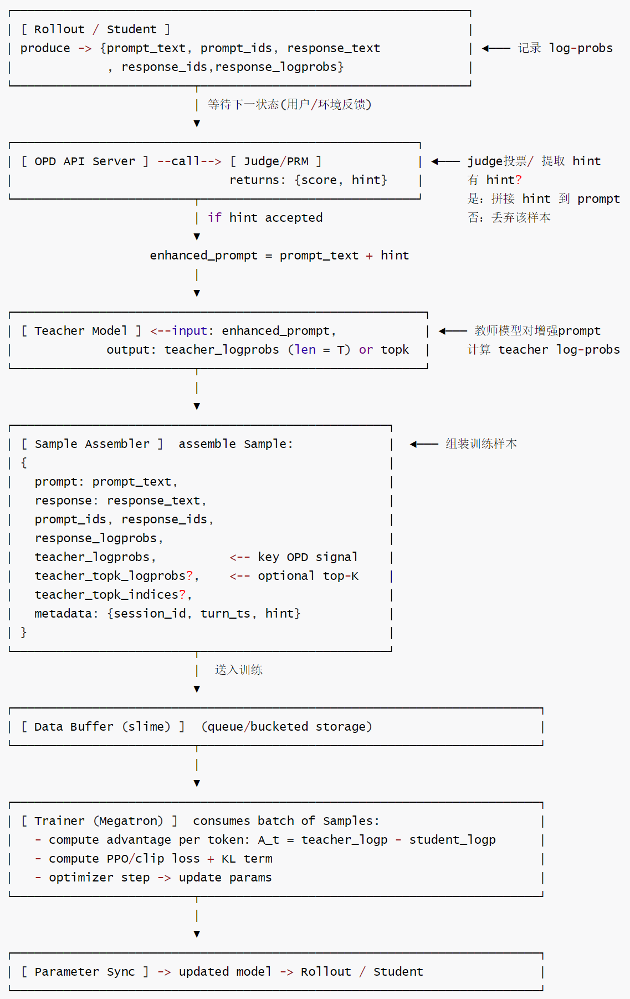
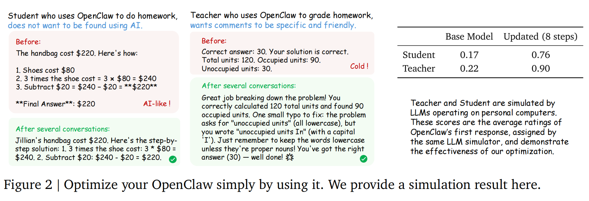

# 【Agentic RL / 强化学习 / OPD】OpenClaw-RL 源码阅读笔记 --- (14)--- Teacher

# 【Agentic RL / 强化学习 / OPD】OpenClaw-RL 源码阅读笔记 --- (14)--- Teacher

目录

* [【Agentic RL / 强化学习 / OPD】OpenClaw-RL 源码阅读笔记 --- (14)--- Teacher](#agentic-rl--强化学习--opdopenclaw-rl-源码阅读笔记-----14----teacher)
  + [0x00 概要](#0x00-概要)
  + [0x01 基础背景](#0x01-基础背景)
    - [1.1 完整数据流](#11-完整数据流)
    - [1.2 关键点](#12-关键点)
      * [公式](#公式)
      * [代码与文件](#代码与文件)
  + [0x02 教师模型](#0x02-教师模型)
    - [2.1 具体是什么模型？](#21-具体是什么模型)
    - [2.2 教师模型的架构特性](#22-教师模型的架构特性)
    - [2.3 教师模型的工作机制](#23-教师模型的工作机制)
    - [2.4 教师模型的具体应用场景](#24-教师模型的具体应用场景)
    - [2.5 教师模型API服务器](#25-教师模型api服务器)
      * [关键代码结构](#关键代码结构)
      * [核心实现](#核心实现)
      * [双重SGLang架构](#双重sglang架构)
    - [2.6 流程](#26-流程)
  + [0x03 Teacher log-probs 计算流程](#0x03-teacher-log-probs-计算流程)
    - [3.1 ① 构建带hint的输入序列](#31--构建带hint的输入序列)
    - [3.2 ② Teacher前向计算](#32--teacher前向计算)
      * [prompt](#prompt)
      * [如何让 Teacher 返回 log-probs(不生成新 token)](#如何让-teacher-返回-log-probs不生成新-token)
      * [SGLang 返回什么](#sglang-返回什么)
    - [3.3 ③ 解析 logprobs](#33--解析-logprobs)
    - [3.4 ④ Top-k 变体](#34--top-k-变体)
    - [3.5 ⑤ 存入Sample](#35--存入sample)
    - [3.6 ⑥ 汇总对比](#36--汇总对比)
    - [3.7 完整代码](#37-完整代码)
      * [\_compute\_teacher\_log\_probs()](#_compute_teacher_log_probs)
      * [\_compute\_teacher\_topk\_logprobs()](#_compute_teacher_topk_logprobs)
  + [0x04 logprobs分析](#0x04-logprobs分析)
    - [4.1 学生(rollout/response)token logprobs](#41-学生rolloutresponsetoken-logprobs)
      * [数学符号解释](#数学符号解释)
      * [关键信息](#关键信息)
        + [数据收集阶段](#数据收集阶段)
        + [训练使用阶段](#训练使用阶段)
      * [与其他logps的区别](#与其他logps的区别)
      * [结论](#结论)
    - [4.2 教师 token logprobs(单token 路径)](#42-教师-token-logprobs单token-路径)
    - [4.3 教师 top-k logprobs(Top-K分布路径)](#43-教师-top-k-logprobstop-k分布路径)
    - [4.4 Reference logprobs(ref\_log\_probs)](#44-reference-logprobsref_log_probs)
    - [4.5 训练/前向产生的log\_probs(trainer内部)](#45-训练前向产生的log_probstrainer内部)
    - [4.6 元数据/输入输出相关的 logprobs字段(辅助字段)](#46-元数据输入输出相关的-logprobs字段辅助字段)
    - [4.7 关键要点](#47-关键要点)
      * [存储字段&代码中的映射(谁写入、谁读出)](#存储字段代码中的映射谁写入谁读出)
      * [关键实现文件](#关键实现文件)
      * [实践注意事项(代码层)](#实践注意事项代码层)
  + [0x05 Top-K 解读](#0x05-top-k-解读)
    - [5.1 为什么需要 Top-K 蒸馏？](#51-为什么需要-top-k-蒸馏)
    - [5.2 Top-K 蒸馏在 OpenClaw 中的位置](#52-top-k-蒸馏在-openclaw-中的位置)
    - [5.3 核心机制：Tail Trick + Reverse KL](#53-核心机制tail-trick--reverse-kl)
      * [5.3.1 问题：15 万词表 vs 50 个 top-K](#531-问题15-万词表-vs-50-个-top-k)
      * [5.3.2 Tail 的数值计算](#532-tail-的数值计算)
      * [5.3.3 Reverse KL 散度](#533-reverse-kl-散度)
    - [5.4 完整数据流：从 API Server 到 Loss](#54-完整数据流从-api-server-到-loss)
    - [5.5 关键设计选择：Teacher Top-K vs Student Top-K](#55-关键设计选择teacher-top-k-vs-student-top-k)
      * [5.5.1 为什么选 Teacher Top-K？](#551-为什么选-teacher-top-k)
      * [5.5.2 Student Top-K 的优势(OpenClaw 放弃的)](#552-student-top-k-的优势openclaw-放弃的)
    - [5.6 数值风险](#56-数值风险)
    - [5.7 两种 OPD 路径对比总表](#57-两种-opd-路径对比总表)
    - [5.8 常见问题](#58-常见问题)
  + [0xFF 参考](#0xff-参考)

## 0x00 概要

本系列的目的是：借着对 OpenClaw-RL 源码的学习，来梳理强化学习的一些相关概念和思想。所以，会有一些基础知识、扩展和发散，OpenClaw-RL 只是一个切入点。而且，因为整篇系列是一个整体，所以有些概念的解读/学习会在不同的文章中出现，还请大家谅解。

OpenClaw-RL 是一个用于在线强化学习(Online RL)的框架，专门针对智能体工具使用场景。它通过从环境反馈中提取过程奖励信号来训练语言模型，支持三种主要模式：

* **openclaw-rl**：基于二元奖励的强化学习(Binary RL / GRPO)
* **openclaw-opd**：基于后见之明提示的在线策略蒸馏(On-Policy Distillation, OPD)
* **openclaw-combine**：联合方法，在同一 PPO 更新中同时利用 RL reward 和 OPD teacher signal

OPD的流程如下：

```
[Rollout/Agent] ──生成样本──► [Data Buffer]
       │                           ▲
       ▼                           │
[Judge/Hint/PRM] ──奖励/hint───────┤
       │                           │
       ▼                           │
[Teacher Model] ──log-probs────────┤
       │                           │
       ▼                           │
[Trainer] ◄───读取样本/训练──────────┘
       │
       ▼
[参数同步] ──更新权重──► [Rollout/Agent]
```

我们今天要看看其 Teacher 部分。教师模型是OpenClaw-RL项目中实现高效在线蒸馏学习的关键组件，它通过将延迟反馈转化为即时的token级别监督信号，显著提升了学习效率和模型性能。其设计充分考虑了实际部署的需求，在保证性能的同时兼顾了资源利用效率和系统稳定性。

## 0x01 基础背景

### 1.1 完整数据流

OpenClaw-OPD 完整数据流如下：



具体参见下表

| 流向 | 说明 |
| --- | --- |
| Rollout/Agent → Judge/Hint/PRM | 生成数据送评判 |
| Judge/Hint/PRM → Teacher Model | 提取 hint 后送教师模型 |
| Judge/Hint/PRM → Data Buffer | 奖励/hint 信息送入缓冲区 |
| Teacher Model → Data Buffer | teacher 信号送入缓冲区 |
| Rollout/Agent → Trainer | 学生模型参与训练 |
| Data Buffer → Trainer | 缓冲数据送入优化器 |
| Teacher Model → Trainer | 教师信号用于损失计算 |
| Trainer → 参数同步 | 训练完成，更新参数 |
| 参数同步 → Rollout/Agent | 同步后模型用于下一轮采样 |

### 1.2 关键点

#### 公式

```
优势计算:  A_t = teacher_logp - student_logp
          (即教师模型与学生模型的对数概率之差)
```

---

#### 代码与文件

* openclaw\_opd\_api\_server.py：消息规范、hint提取、Sample 组装的入口逻辑。
* README.md：OPD 的算法说明、Top-K选项与公式。
* run\_qwen3\_4b\_openclaw\_opd.sh：启动参数、HF\_CKPT、并发设置OPENCLAW\_OPD\_TEACHER\_LP\_MAX\_CONCURRENCY。
* openclaw\_combine\_api\_server.py：展示了如何把 teacher\_log\_probs 写到 Sample(padding/cropping)。
* README.md：Data Buffer、rollout 与 trainer 的模块级别职责说明。

* slime/utils/types.py(样本类型定义，可查看 Sample 字段结构)。

## 0x02 教师模型

教师模型的设计使得OPD能够获得比普通 RL更丰富、更细粒度的监督信号，从而实现更快的收敛速度和更好的最终性能。



### 2.1 具体是什么模型？

在OpenClaw-RL框架中，教师模型是一个具有双重角色的核心组件，主要用于On-Policy Distillation(OPD)训练方法。 教师模型本质上是一个高质量的参考模型，用于从延迟的用户反馈中提取密集的监督信号，从而指导学生策略模型的学习。

OpenClaw-RL 中的“教师模型"主要指在 On-Policy Distillation (OPD)阶段用于为学生模型提供 token-level 指导信号的模型。根据训练脚本和文档，教师模型默认是 Qwen3-4B(Qwen3-4B-Thinking-2507)，即通过 qwen3-4B.sh 配置和HF\_CKPT 路径指定的 HuggingFace Qwen3-4B 权重。

简要总结：

* 数师模型 = Qwen3-4B(Qwen3-4B-Thinking-2507)
* 用于 OPD 阶段，提供 token 级别的 log-prob指导信号

### 2.2 教师模型的架构特性

双重角色统一端点

* 使用同一个SGLang服务端点同时承担PRM评估(提示提取)和教师模型(对数概率计算)双重功能
* 通过不同的请求参数来区分具体功能，实现资源的有效复用

模型配置特点

* 默认情况下使用与学生策略相同的基座模型(如Qwen3-4B系列)
* 运行时不加载LoRA适配器，确保提供稳定、高质量的监督信号
* 支持通过环境变量或命令行参数单独指定不同的教师模型

### 2.3 教师模型的工作机制

确定性推理配置

* 使用temperature=0.0确保推理结果的一致性
* 设置max\_new\_tokens=0，只计算已有 token 的 logprobs，不生成新内容
* 这种配置保证了在相同输入下始终产生相同的输出分布

并发控制机制

* 通过\_teacher\_lp\_semaphore信号量限制最大并发查询数量
* 默认并发数由环境变量OPENCLAW\_OPD\_TEACHER\_LP\_MAX\_CONCURRENCY控制
* 防止教师模型服务过载，确保系统稳定性

增强Prompt构建流程

* 首先从用户反馈中提取有效的“hint”(提示)
* 将提取的提示注入到原始对话历史中，构建增强的prompt
* 基于这个增强prompt查询教师模型的对数概率分布

### 2.4 教师模型的具体应用场景

OPD训练流程中的作用

```
原始对话 → 学生响应 → 用户反馈 → 提示提取 → 增强prompt → 教师logprobs → 蒸馏训练
```

与传统RL的区别

* 传统RL：使用标量奖励(+1/-1/0)，提供稀疏的试错信号
* OPD教师模型：提供token级别的对数概率分布，提供密集的监督信号

资源分配

* 在多GPU部署中，教师模型通常分配专门的GPU资源(通过PRM\_GPUS参数配置)
* 与学生策略模型和rollout收集器并行运行，形成完整的异步训练流水线

### 2.5 教师模型API服务器

* openclaw-opd/openclaw\_opd\_api\_server.py：包含完整的教师模型查询逻辑
  + 教师模型端点配置(\_prm\_url变量)
  + 并发控制机制(\_teacher\_lp\_semaphore信号量)
  + 确定性推理参数设置
  + 增强prompt构建和logprobs计算

#### 关键代码结构

关键代码结构如下

```
OpenClaw-OPD API Server (根节点)
    ├─ 初始化阶段 (分支)
    │   ├─ PRM/教师模型URL配置 (叶子)
    │   ├─ 并发信号量初始化 (叶子)
    │   └─ Tokenizer加载 (叶子)
    │
    ├─ 评估阶段 (分支)
    │   ├─ 提示提取 (hint extraction) (叶子)
    │   ├─ 增强prompt构建 (叶子)
    │   └─ 教师logprobs查询 (叶子)
    │
    └─ 提交阶段 (分支)
        ├─ 样本格式化 (叶子)
        └─ 训练队列提交 (叶子)
```

#### 核心实现

OPD的核心实现在openclaw-opd/目录下，主要包含三个关键文件：

* openclaw\_opd\_api\_server.py：核心业务逻辑，包含提示提取、教师查询、双重评估
  + 提示提取评估 (\_build\_hint\_judge\_messages())
  + 教师模型查询(\_append\_hint\_to\_messages())
  + 双重评估机制(提示提取+PRM评估)样本构建和队列提交
* openclaw\_opd\_rollout.py：与Slime训练框架的集成接口
  + rollout 函数，
  + generate\_rollout\_openclaw\_opd() 函数
  + 与AsyncRolloutworker 的集成接口
* topk\_distillation\_loss.py：
  + Top-K蒸馏损失函数实现
  + 支持Top-K logits蒸馏的损失计算
  + 教师一学生对数概率差计算

#### 双重SGLang架构

OPD使用同一个PRM URL同时承担双重角色：

* 资源复用：同一个 SGLang 实例承担双重角色
* PRM评估角色：执行提示提取和PRM评分
* 教师模型角色：执行教师对数概率计算
* 不同payload：通过不同的请求参数区分用途

### 2.6 流程

OPD 实现中各阶段的函数调用链如下（2.4 节给出了概念流程，这里给出具体的代码调用链）：

```
用户请求 → OpenClawOPDAPIServer._handle_main_turn()
  ↓ (SGLang 推理)
  学生模型生成响应 + logprobs
  ↓ (状态缓冲)
  缓存当前回合数据
  ↓ (下一状态触发)
  新请求到达 → 触发 _fire_opd_task()
  ↓ (异步任务)
  _opd_evaluate() → 提示提取评估
  ↓ (成功提取提示)
  构建增强 prompt（注入提示）
  ↓ (教师查询)
  _compute_teacher_log_probs() → 调用 PRM/教师 SGLang
  ↓ (样本构建)
  构建包含 teacher_log_probs 的 Sample
  ↓ (队列提交)
  output_queue.put() → Slime 训练器
```

我们以 `_compute_teacher_log_probs` 为基础，来看看 Teacher log-probs 计算流程。为了完整叙事，此处也会把前面完整流程的某些其它部分带入。

## 0x03 Teacher log-probs 计算流程

Teacher forward pass 的关键：

* hint 注入最后一个 user 消息；
* max\_new\_tokens=0 不生成，只算log-probs;
* “logprob\_start\_len只取 response 部分。SGLang被当成"log-prob 计算器"。

触发条件：

* Hint Judge 接受了 hint(select\_best\_hint返回非None)。

实现细节：

* 构建完整文本：enhanced\_full\_text =enhanced\_prompt\_text+ turn\_data["response\_text"]
* Token化：enhanced\_ids = self.tokenizer(enhanced\_full\_text,add\_special\_tokens=False)["input\_ids"]
* 并发控制：async with self.\_teacher\_lp\_semaphore:
* \_查询教师模型：通过HTTP请求到PRM/教师端点获取log probabilities
* Top-K蒸馏扩展：

  + 条件判断：`if self._use_topk_distillation:`
  + 调用：topk\_lp，topk\_idx = await self.\_compute\_teacher\_topk\_logprobs(enhanced\_ids，response\_len)
  + 存储单独的top-k字段

我们接下来看看具体细节。

### 3.1 ① 构建带hint的输入序列

核心方法：\_opd\_evaluate

具体实现步骤：

* 构建评估消息：\_build\_hint\_judge\_messages(turn\_data["response\_text"]，next\_state\_text，next\_state\_role)
* 应用tokenizer模板：self.\_prm\_tokenizer.apply\_chat\_template()
* 并行执行M次投票：`asyncio.gather(*[self._query_judge_once(judge_prompt， i) for i in range(self._prm_m)])`
* PRM 评估提示构建：\_build\_prm\_eval\_prompt()
* PRM 多数投票：prm\_eval\_majority\_vote()
* PRM 评分解析：\_parse\_prm\_eval\_score()
* 解析提示提取结果：\_parse\_judge\_result()
* 选择最佳提示：selected =\_select\_best\_hint(votes)

投票逻辑：

* 每次投票返回评分(+1/-1)和可选的hint文本
* 选择最长的有效正面提示
* 如果没有有效提示，则丢弃该样本

关键函数：

* \_append\_hint\_to\_messages：将提取的hint添加到原始对话末尾
* normalize\_messages\_for\_template：标准化消息格式
* apply\_chat\_template：应用tokenizer的聊天模板

具体逻辑如下：

```
==========================================================================
【步骤一】构建带hint的输入序列
==========================================================================

代码实现：
        hint = selected["hint"].strip()
        enhanced_messages = _append_hint_to_messages(turn_data["messages"], hint)
        norm_enhanced = _normalize_messages_for_template(enhanced_messages)
        enhanced_prompt_text = self.tokenizer.apply_chat_template(
            norm_enhanced,
            tools=turn_data.get("tools"),
            tokenize=False,
            add_generation_prompt=True,
        )

原始messages (无hint)：
[system:,..., user："帮我写排序"，assistant："..."，user："能优化吗"]

hint 注入  (_append_hint_to_messages):
	找到messages中"最后一条user消息" (从后往前遍历)
	在其content末尾追加：
	"\n\n[user's hint/ instruction]\n{hint.strip()}" 
	↓
enhanced_messages:
[system:,..., user："帮我写排序\n\n[user'shint/instruction]\n使用快排,...,]

apply_chat_template(enhanced_messages)→ enhanced_prompt_text 
enhanced_full_text = enhanced_prompt_text + response_text (原始response)
enhanced_ids=tokenizer(enhanced_full_text)["input_ids"]
                            |
                            |[prompt_with_hint_tokens ... response_tokens]
                            | ←-----start_len-------→    ←-response_len--→ 
                            |(prompt部分，含hint)
                            ▼
```

### 3.2 ② Teacher前向计算

```
==========================================================================
【步骤二】Teacher前向计算 (max_new_tokens=0)
==========================================================================

并发控制:Semaphore (max_concurrency=3) (OPENCLAW_OPD_TEACHER_LP_MAX_CoNCURRENCY) 

POST→PRM Engine  (GPU 6-7)/generate
┌─────────────────────────────────────────────────────────┐ 
│ payload:                                                │ 
│     "input_ids":enhanced_ids (prompt_with_hint+ response│ 
│     "sampling_params":{"temperature":0.0,               │ 
│     "max_new_tokens":0  ←- 纯前向，不生成任何token         │ 
│     }                                                   │ 
│     "return_logprob":True                               │ 
│     "logprob_start_len":start_len                       │ 
│         = max(0,len(enhanced_ids) -response_len)        │ 
│         ←-只返回 response 位置的 logprobs，节省带宽         │ 
└─────────────────────────────────────────────────────────┘ 

返回：`
    meta_info["input_token_logprobs"]:
        [ (lp_0,tok_0), (1p_1,tok_1),..., (1p_T，tok_T)]
        (start_len之后的位置)
```

#### prompt

Teacher 用的是用户对话中原本就有的 system prompt(如果有的话)。即，Teacher 不添加任何额外 system prompt。它看到的完全是用户的原始对话+hint 注入到最后一个 user 消息。

对比如下：

| 对象 | System Prompt |
| --- | --- |
| 用户对话 | 用户自己设的（或App默认的） |
| Teacher forward pass | 和用户对话相同（原封不动保留） |
| PRM/Hint Judge | 独立的评分system prompt |
| 训练sample | 和用户对话相同（sample.tokens来自原始messages） |

#### 如何让 Teacher 返回 log-probs(不生成新 token)

关键参数：

```
payload = {
    "input_ids": enhanced_ids,            # ← 完整序列 (prompt + response)
    "sampling_params": {
        "temperature": 0.0,               # ← 不重要，因为不生成，不影响forward pass
        "max_new_tokens": 0,              # ← 🔑 关键！不生成任何新 token，只做forward pass
        "skip_special_tokens": False,
    },
    "return_logprob": True,               # ← 🔑 返回 log-probs
    "logprob_start_len": start_len,       # ← 🔑 只返回 response 部分的 log-probs
    "top_logprobs_num":K,                 # ← 🔑 返回每位置top-K个token的logprob
}
```

核心技巧：max\_new\_tokens=0把SGLang当成"log-prob计算器“而非"文本生成器"。max\_new\_tokens=0 的含义如下：

```
正常生成(max_new_tokens > 0)：
  输入 [prompt] → 模型生成 [token1, token2, ...] → 返回生成的 tokens

Teacher forward pass(max_new_tokens = 0)：
  输入 [prompt + response] → 模型只做 forward pass → 不生成任何 token
  但计算了每个位置的 log P(token_t | context_<t) → 返回这些 log-probs
```

logprob\_start\_len 的含义：

```
enhanced_ids = [p1, p2, ..., pN, r1, r2, ..., rT]
                └──── prompt ────┘ └─ response ─┘

start_len = len(enhanced_ids) - response_len = N

→ 只返回位置 N 之后的 log-probs(即 response 部分)
→ 省掉了 prompt 部分的 log-probs(我们不需要)
```

#### SGLang 返回什么

```
{
	"meta_info": {
        "input_token_logprobs": [
            null, // 位置 0 (第一个 token 无条件概率)
            [-2.3, 15234], // 位置 1: logprob=-2.3, token_id=15234
            [-1.5, 8901], // 位置 2: logprob=-1.5
            [-0.8, 3456], // ...
            ...
            ]
  }
}
```

### 3.3 ③ 解析 logprobs

```
==========================================================================
【步骤三】解析 logprobs - 对齐到response tokens
==========================================================================

 all_lp=[item[o] for item in input_token_logprobs] 
 
 注意：SGLang返回的input_token_logprobs 包含一个偏移： 
 	all_lp=all_lp[1:] ← 去掉第一个 (位置偏移修正)对齐到response_len：

对齐到response_len：
    len(all_lp) >= response_len:
        teacher_log_probs=all_lp[-response_len:] ← 取末尾T个 
    len(all_lp)<response_len:
        teacher_log_probs=[0.0]*(response_len-len(all_lp))+ all_lp ← 前补零

最终：teacher_log_probs shape=[T]
	log π_teacher(r_t| prompt_with_hint,r_1..r_{t-1}) for t in 1..T
```

解析 log-probs 的代码如下：

```
# 解析 SGLang 返回的 log-probs
all_lp = []
for item in inp:
    if isinstance (item, (list, tuple)) and len (item) >= 1:
        val = item [0] # 取第一个元素 = log-prob
        all_lp.append (float (val))
    elif isinstance (item, dict) and "logprob" in item:
        val = item ["logprob"] # 或 dict 格式
        all_lp.append (float (val))
        
all_lp = all_lp [1:] # 跳过位置 0 (BOS)
return all_lp [-response_len:] # 只取最后 response_len 个
```

### 3.4 ④ Top-k 变体

当distill\_topk>0时(如K=5)，会进行 top-k计算，不只记录teacher对当前token的log-prob，而是记录每个位置teacher最高K个token的分布。

```
==========================================================================	
【Top-k 变体】(_compute_teacher_topk_logprobs,--distill-topk K) 
==========================================================================
            
# teacher_topk_log_probs：[T，K]←.T个位置，每个位置top-K个log-prob
# teacher_topk_indices：[T，K]对应的 token ID
# Loss: reverse KL over K+1 bins(top-K+ tail mass)    
    
async def _compute_teacher_log_probs(self, input_ids, response_len):
    # 关键: max_new_tokens=0 -> 不生成, 只前向传播
    payload = {
        "input_ids": input_ids,    # 增强prompt + 原始response的token ids
        "sampling_params": {
            "temperature": 0.0,
            "max_new_tokens": 0,   # <- 只计算 log-probs, 不采样
        },
        "return_logprob": True,
        "logprob_start_len": start_len,  # 只返回 response 部分的 log-probs
    }
    # 返回: teacher 在看到 hint 后, 对原始 response 每个 token 的 log-prob

此函数表达的语义: 如果 teacher 在生成时拥有这个 hint (事后诸葛亮信息), 它对这段 response 的每个 token 的置信度是多少?                      

额外参数："top_logprobs_num"：K → SGLang 返回每个位置top-K候选

meta_info["input_top_logprobs"]:
[[(1p，tok_id)，(lp,tok_id),...xk]， ← position 0
[(lp，tok_id),...xk],                ← position 1
...                                   ← position T ]

同样[1：]偏移修正 + 对齐response_len： 
	teacher_topk_log_probs  shape=[T,K]
	teacher_topk_indices    shape=[T,K]

用途：SDFT/SDPO风格蒸馏
	student在每个位置学习对top-Kteacher候选的概率分布
	而非仅对 response 中实际 token 的单点 log-prob
```

### 3.5 ⑤ 存入Sample

此部分完成样本提交：\_submit\_turn\_sample方法

数据处理(解析返回)：

* 对齐teacher\_log\_probs和response\_ids长度
* 处理长度不匹配的情况(截断或填充)
* 构建完整的训练样本包含：

  + prompt\_ids
  + response\_ids
  + teacher\_log\_probs
  + rollout\_log\_probs

```
response.meta_info.input_token_logprobs → 解析 → teacher_log_probs
teacher_log_probs =[-0.9, -0.6,-1.8,-1.0,...]
                      ↑每个 response token 的log P(token |enhanced_prompt + 前文)
```

存入Sample / 队列提交：

* 通过self.output\_queue.put()将样本提交到训练队列
* 训练系统从队列中消费样本进行蒸馏训练

```
sample.teacher_log_probs = tensor(teacher_log_probs) 
→ 送给Slime计算OPD advantage
```

### 3.6 ⑥ 汇总对比

```
【汇总对比】三种 log-prob 的来源与用途
+------------------------+--------------------+-----------------------------------+
| log-prob 类型          | 计算时机            | 含义                               |
+------------------------+--------------------+-----------------------------------+
| rollout_log_probs      | SGLang 生成时       | log π_old(r|prompt)              |
| (old policy)           | 一次性获得          | 不含 hint, 原始对话上下文            |
+------------------------+--------------------+-----------------------------------+
| teacher_log_probs      | next_state 到来后   | log π_teacher(r|prompt+hint)     |
| (teacher forward pass) | 异步计算            | 含 hint, Teacher 怎么看该response  |
+------------------------+--------------------+-----------------------------------+
| new_log_probs          | Megatron 训练前向   | log π_new(r|prompt)               |
| (current policy)       | 每个 gradient step  | 训练中当前策略                      |
+------------------------+--------------------+-----------------------------------+

OPD advantage per token t:
    Δ_t = teacher_log_probs[t] - rollout_log_probs[t]
        = log π_teacher(r_t | prompt+hint) - log π_old(r_t | prompt)

直觉: hint 告诉 teacher "这里应该怎么做"
     teacher 给 response 中每个 token 打分越高 → 该 token 越值得被学习
     Δ_t > 0 → 强化该 token; Δ_t < 0 → 抑制该 token
```

### 3.7 完整代码

3.2-3.4 节给出了关键参数和解析逻辑的片段，这里给出两个核心函数的完整实现，便于对照。

#### \_compute\_teacher\_log\_probs()

```
async def _compute_teacher_log_probs(self, input_ids: list[int], response_len: int) -> list[float]:
    start_len = max(0, len(input_ids) - response_len)
    payload = {
        "input_ids": input_ids,
        "sampling_params": {
            "temperature": 0.0,           # 确定性推理
            "max_new_tokens": 0,          # 不生成新 token
            "skip_special_tokens": False,
        },
        "return_logprob": True,
        "logprob_start_len": start_len,   # 从响应开始位置计算
    }
    async with self._teacher_lp_semaphore:  # 并发控制（信号量）
        async with httpx.AsyncClient(timeout=None) as client:
            resp = await client.post(self._prm_url, json=payload)
            resp.raise_for_status()
            result = resp.json()

    meta = result.get("meta_info", {}) if isinstance(result, dict) else {}
    inp = meta.get("input_token_logprobs")
    if not isinstance(inp, list):
        return [0.0] * response_len

    all_lp = []
    for item in inp:
        if isinstance(item, (list, tuple)) and len(item) >= 1:
            val = item[0]
            all_lp.append(float(val) if val is not None else 0.0)
        elif isinstance(item, dict) and "logprob" in item:
            val = item["logprob"]
            all_lp.append(float(val) if val is not None else 0.0)
        else:
            all_lp.append(0.0)
    if len(all_lp) > 1:
        all_lp = all_lp[1:]  # 跳过位置 0 (BOS)
    if len(all_lp) >= response_len:
        return all_lp[-response_len:]
    return [0.0] * (response_len - len(all_lp)) + all_lp
```

#### \_compute\_teacher\_topk\_logprobs()

```
async def _compute_teacher_topk_logprobs(
    self, input_ids: list[int], response_len: int
) -> tuple[list[list[float]], list[list[int]]]:
    """Compute teacher's top-K log-probs and token indices for response tokens."""
    K = self.distill_topk
    start_len = max(0, len(input_ids) - response_len)
    payload = {
        "input_ids": input_ids,
        "sampling_params": {
            "temperature": 0.0,
            "max_new_tokens": 0,
            "skip_special_tokens": False,
        },
        "return_logprob": True,
        "logprob_start_len": start_len,
        "top_logprobs_num": K,
    }
    async with self._teacher_lp_semaphore:
        async with httpx.AsyncClient(timeout=None) as client:
            resp = await client.post(self._prm_url, json=payload)
            resp.raise_for_status()
            result = resp.json()

    meta = result.get("meta_info", {}) if isinstance(result, dict) else {}
    inp_top = meta.get("input_top_logprobs")

    if not isinstance(inp_top, list):
        return [[0.0] * K] * response_len, [list(range(K))] * response_len

    all_logprobs: list[list[float]] = []
    all_indices: list[list[int]] = []
    for pos_data in inp_top:
        if isinstance(pos_data, (list, tuple)):
            row_lp, row_idx = [], []
            for entry in pos_data:
                if isinstance(entry, (list, tuple)) and len(entry) >= 2:
                    row_lp.append(float(entry[0]) if entry[0] is not None else 0.0)
                    row_idx.append(int(entry[1]))
                elif isinstance(entry, dict):
                    row_lp.append(float(entry.get("logprob", 0.0)))
                    row_idx.append(int(entry.get("token_id", 0)))
                else:
                    row_lp.append(0.0)
                    row_idx.append(0)
            while len(row_lp) < K:
                row_lp.append(0.0)
                row_idx.append(0)
            all_logprobs.append(row_lp[:K])
            all_indices.append(row_idx[:K])
        else:
            all_logprobs.append([0.0] * K)
            all_indices.append(list(range(K)))

    if len(all_logprobs) > 1:
        all_logprobs = all_logprobs[1:]
        all_indices = all_indices[1:]

    if len(all_logprobs) >= response_len:
        return all_logprobs[-response_len:], all_indices[-response_len:]
    pad_len = response_len - len(all_logprobs)
    return (
        [[0.0] * K] * pad_len + all_logprobs,
        [list(range(K))] * pad_len + all_indices,
    )
```

## 0x04 logprobs分析

OpenClaw-RL 主要出现的 logprobs 类型有：学生侧(rollout)token logprobs、教师侧 token logprobs、教师侧top-k logprobs、训练/ 前向产生的model log\_probs，以及著干元数据字段(input/output/top logprobs)。

四种主要logps类型：

* Rollout Logps (学生当前策略)
* Teacher Logps (标准 token级别)
* Teacher Top-K Logps (分布级别)
* Reference Logps (KL正则化)

各类型的应用场景：

* Rollout Logps:所有RL和OPD方法都需要
* Teacher Logps：OPD标准模式专用
* Teacher Top-K Logps：OPD Top-K蒸馏模式专用
* Reference Logps：KL正则化需要(可选启用)

数据流向

```
Rollout阶段 → 获取Rollout Logps
  ↓ 
用户反馈 → 提示提取 → 增强Prompt
  ↓ 
教师壹询 → 获取Teacher Logps/Top-K Logps
  ↓ 
训练阶段 → 结合Reference Logps进行损失计算
```

### 4.1 学生(rollout/response)token logprobs

#### 数学符号解释

* log π\_student(a\_t|s)表示在状态s下，学生策略模型对动作a\_t的对数概率
* 这正是rollout阶段收集的学生模型log probabilities
* 用于计算蒸馏优势`：A_t=logπ_teacher(a_t|s+hint)-logπ_student(a_t|s)`

#### 关键信息

* 名称与字段：常见字段名为 response\_logprobs / rollout\_log\_probs(最终写入 Sample 为sample.rollout\_log\_probs)
* 产生位置(实现)：openclaw\_opd\_api\_server.py 中的 \_extract\_logprobs\_from\_chat response(从响应 meca 中抽取)及后续量值，另有生成端实现如 generate\_with\_retool.py 将output\_token\_logprobs 聚合到 sample.rollout\_log\_probs.
* 用途与消费方：

  + 在rollout阶段由学生策略模型生成的对数概率
  + 用于计算策略梯度和KL散度正则化项
  + ##### 数据收集阶段

    - 在openclaw-opd/openclaw\_opd\_api\_server.py的\_handle\_request方法中\_
    - 通过SGLang服务获取当前学生策略的logprobabilities
    - 存储为turn\_data["rollout\_log\_probs"]

    ##### 训练使用阶段

    - 在提交样本时，这些rolloutlogprobs作为logr\_student传递给训练系统
    - 在损失计算中直接用作学生策略的对数概率
  + 存储在turn\_data["rollout\_log\_probs"]字段中
  + 作为“old/rollout logprobs“，用于监控rollout vs training drift(见combine loss.py 中 rollout\_log\_probs 分支)，也会被写入 Data Buffer 供 Trainer 计算优势或监控。
* 数据形状：与 response\_ids对齐，按token顺序的浮点 log-prob列表(长度不足时代码会pad0.0，超长则裁剪)
* 获取方式

  + 通过SGLang服务调用时设置logprobs=True和top\_logprobs=1
  + 在\_handle\_request方法中获取
  + 从SGLang响应的logprobs字段中提取

#### 与其他logps的区别

log π\_student 与Reference Logps的区别

* Reference Logps来自参考模型(通常是初始策略)
* Rollout Logps来自当前训练中的学生策略
* 两者用途不同：前者用于KL正则化，后者用于策略梯度和蒸馏

动态更新特性

* logπ\_student随着训练进行而不断更新
* 每次rollout都反映当前学生策略的能力
* 这保证了蒸馏目标始终基于最新的学生表现

#### 结论

* log π\_student就是学生模型logps(Rollout Log Probabilities)
* 这是OPD方法中计算token级别蒸馏优势的关键组成部分，在整个训练流程中保持一致的语义和用途
* 这种设计使得OPD能够提供精确的改进方向，支持高效的在线蒸馏学习
* 相比传统RL的标量奖励，token级别的对比提供了更丰富的学习信号

### 4.2 教师 token logprobs(单token 路径)

teacher log-probs 只做forward pass(max\_new\_tokens=0)，不生成新 token。通过logprob\_start\_len参数只返回 response 部分的log-probs。这比生成+评估高效得多。

* 名称与字段：teacher\_log\_probs(写入 Sample为 sample.teacher\_log\_probs)。
* 标准token级别logps

  + 由教师模型在增强prompt基础上计算的对数概率
  + 存储在opd\_result["teacher\_log\_probs"]字段中
  + 用于计算token级别的蒸馏优势：`A_t=logπ_teacher-logπ_student`
  + logπ\_student 就是 学生模型logps(Rollout Log Probabilities)
* 产生位置(实现)：在openclaw\_opd\_api\_server.py，函数\_compute\_teacher\_log\_probs(以增强 prompt 调用教师模型并返回每) token log-prob)，以及 API server 将其放入返回结果/样本。openclaw\_combine\_api\_server.py也有相同取用/载剪逻辑。
* 用途与消费方：用于 OPD 的 token-level advantage 计算(`A_t=log π_teacher-log π_student`)，在 Trainer的OPD 损失路径中被消费(见README.md与训练损失实现处)
* 数据形状：长度与响应token数对齐(代码保证pad/trim)。
* 获取方式

  + 通过\_compute\_teacher\_log\_probs方法计算
  + 使用temperature = 0.0的确定性推理
  + 仅计算原始响应token的logprobabilities

### 4.3 教师 top-k logprobs(Top-K分布路径)

* 名称与字段：teacher\_topk\_log\_probs、teacher\_topk\_indices(写入 Sample为 sample.teacher\_topk\_log\_probs / sample.teacher\_topk\_indices)
* 产生位置(实现)：openclaw\_opd\_api\_server.py的 \_compute\_teacher\_topk\_logprobs，会读取 meta 字段(如 input\_top\_logpr obs)并返回 [T，K] 的 top-Klogprobs 和对应索引。
* 用途与消费方：供 Top-K蒸馏路径(SDFT/SDPo 风格)使用：损失实现见 topk\_distillation\_loss.py，该模块读取teacher\_topk\_log\_probs + teacher\_topk\_indices。
* 数据形状：二维数组，shape=[response\_len，K]，短缺时pad，长余时截断(代码有相应处理)。
* Top-K教师logps

  + 教师模型输出的top-Ktoken对数概率分布
  + 存储在opd\_result["teacher\_topk\_log\_probs"]字段中(形状[T，k])
  + 对应的token索引存储在teacher\_topk\_indices字段中
* 实现细节

  + 通过\_compute\_teacher\_topk\_logprobs方法获取
  + 使用SGLang的input\_top\_logprobs参数请求top-Klogprobs
  + 默认K=50(可通过--distill-topk参数配置)

### 4.4 Reference logprobs(ref\_log\_probs)

* 字段：ref\_log\_probs(可能存在于 batch/sample 中，trainer 可读取为 batch[“ref\_log\_probs"])
* 产出／生成位置(实现)：
  + 训练端按需在线计算：`rl_utils.py` 中有计算 ref logprobs 的逻辑，通过带 `torch.no_grad()` 的 ref 模型前向收集 `ref_logprobs` 并放入 packing context，再传入 trainer。
  + actor/rollout 端可创建 ref 模型：actor.py 中有 `_create_ref _model,actor` 进程可加载 args.ref \_load 指定的 reference checkpoint.
  + 运行脚本/环境变量：多个启动脚本(例如openclaw-opd/run\_*.sh、opericlaw-combine/run\_*.sh)接受REF\_LOAD/ref-load，默认常设为 HF\_CKPT 或显式路径；arguments.py 里会校验 args.ref\_load。
* 用途与消费方：
  + KL 正则：在 combine\_loss.py 中，如果 args.use\_kl\_loss 且 batch.get("ref\_log\_probs") 存在，则把 ref log\_probs 用作> 参考分布，调用 KLloss 函数(new\_log\_probs，ref\_log\_probs，kl\_loss\_type)。
    - 由参考模型(通常是初始策路或基座模型)计算的对数概率
    - 组于KL正则化，防止策略偏离太远
  + 监控/性能统计：train\_metric\_utils.py会以 perf/ref\_log\_probs\_time 等项记录与计算性能指标。
  + 对齐/包装：rl\_utils.py 提供.pack\_inference\_logprobs、align\_unpacked\_inference\_logprobs 等，处理 ref\_logprobs 在 pa cked/unpacked序列中的对齐。
* 数据形状与对齐：ref\_log\_probs 与new\_log\_probs/old\_log\_probs 需形状对齐(按序列/packed bin)，代码在packing阶段> 将 ref\_logprobs 拼接并放入 `packing_context['ref_logprobs'](见 rl_utils)`。当 batch 中存在 ref\_log\_probs 时，训练会 torch. cat(batch["ref\_log\_probs"],dim=0)。
* 何时由样本携带vs 在线计算：项目支持两种方式：样本层携带(若 Data Buffer 提前填入)或训练端在forward 时根据args.re f\_load 在线计算并注入 packing context；实际实现以训练配置为准(slime 会决定 actor/trainer 是否预先加载 ref 模型或在 trainer side 计算)。

### 4.5 训练/前向产生的log\_probs(trainer内部)

* 名称与字段：训练批次中有 `log_probs`（新 forward 计算得到）、`old_log_probs`/`rollout_log_probs`（来自样本）以及可选的 `ref_log_probs`（参考模型）。
* 产生位置(实现)：训练时通过get\_log\_probs\_and\_entropy(在slime/backends或Megatron 的工具里)得到new\_log\_probs; 打包/对齐逻辑在 rl\_utils.py的 pack\_inference\_logprobs/ align\_unpacked\_inference\_logprobs 中。combine\_loss.py 使用这些值计算PPO/kl/combined loss。
* 用途与消费方：用于计算PPO风格的策略损失(newvsold)，与OPD的teacher信号联合计算优势/KL项。
* 用于PPO/KL/combinedloss的主计算(见combine\_loss.py)

### 4.6 元数据/输入输出相关的 logprobs字段(辅助字段)

* 常见字段：input\_token\_logprobs、input\_top\_logprobs、output\_token\_logprobs 等，通常存在于模型返回的 meta 或推理请求体中
* 位置与用途：这些字段在openclaw\_opd\_api\_server.py 中被读取以加速/拼接teacher/topk计算；generate\_with\_retool.py产生 output\_token\_logprobs 用来汇总 rollout logprobs。

### 4.7 关键要点

#### 存储字段&代码中的映射(谁写入、谁读出)

* 写入 Sample(由 API server / rollout):sample.rollout\_log\_probs 由\_extract\_logprobs\_from\_chat\_response /生成端累> 积写入。sample.teacher\_log\_probs/ sample.teacher\_topk\_log\_probs ←由 \_compute\_teacher\_log\_probs / \_compute\_teacher\_topk\_l ogprobs 写入。
* Trainer 读取：训练批次(来自 slime Data Buffer)供 combine\_loss.py、topk\_distillation\_loss.py、Megatron 后端函数读取rollout\_log\_probs/ teacher\_log\_probs/ teacher\_topk\_log\_probs/ log\_probs 并计算损失。

#### 关键实现文件

* openclaw\_opd\_api\_server.py：抽取响应 logprobs、计算teacher logprobs/top-k、组装sample(主要实现点)。  
  openclaw\_combine\_api\_server.py：样本合并、teacher log\_probs 写入示例(裁剪/pad)。
* topk\_distillation\_loss.py：读取并消费 teacher\_topk\_log\_probs的损失实现。
* combine\_loss.py：训练端整合 rollout\_log\_probs、teacher\_log\_probs 与模型forward log\_probs 的计算与合成损失。
* generate\_with\_retool.py：生成端如何收集 output\_token\_logprobs 并累积到 sample.rollout\_log\_probs。
* rl\_utils.py：inference/pack/align logprobs的工具函数(trainer 内部对齐使用)。

#### 实践注意事项(代码层)

* 对齐与 tokenizer：教师与学生必须使用相同 tokenizer/ckpt，否则 response\_ids 与 teacher\_log\_probs 无法正确对齐。
* pad/trim策略：API server 中会对长度不一致做裁剪或pad(见openclaw-opd/openclaw-combine 的sample组装处)。
* 并发与性能：教师查询并发受OPENCLAW\_OPD\_TEACHER\_LP\_MAX\_CONCURRENCY 控制，Top-K会增加开销。
* 监控：可对比rollout\_log\_probs 与训练时new\_log\_probs 的差异(combine\_loss.py 中有监控代码段)。

## 0x05 Top-K 解读

### 5.1 为什么需要 Top-K 蒸馏？

为什么需要 Top-K 蒸馏？这是因为 单值 OPD 的局限。

标准 OPD(token-level)的工作方式是：对每个 token 位置，teacher 给一个 scalar logprob，trainer 计算 `A_t = teacher_lp - student_lp`，然后走 PPO。这个方案有一个根本的信息瓶颈：**teacher 对每个位置只传了一个数字**。teacher 知道"第 5 个 token 应该是 `print`"，但它也知道"如果不用 `print`，`write` 也比 `echo` 好得多"——这个排序信息在单值传输中完全丢失了。

| 问题 | 单 token OPD | Top-K OPD |
| --- | --- | --- |
| 信息量 | 每位置 1 个 scalar | 每位置 K+1 维分布 |
| teacher 的第 2,3...K 选择 | 丢失 | 保留偏好排序 |
| 尾部 token 的处理 | 完全不知道 | tail bin 保底 |
| 存储 | `[T]` | `[T, K]`（K=50 时 ×50） |
| 学生遗忘风险 | 只看 teacher 最强 token，可能过拟合 | K+1 维 KL 更温和 |

Top-K 蒸馏本质上是从"teacher 告诉你哪个 token 对"升级为"teacher 给你一份参考答案册"——不仅告诉你标准答案，还告诉你每个备选答案能得多少分。这个想法来自 SDFT (arXiv:2601.19897) 和 SDPO (arXiv:2601.20802) 两篇工作，它们的共同思路是：用 teacher 的 top-K logits + tail bin 做 KL 散度蒸馏，而不是传统的全词表 KL 或单 token CE。

---

### 5.2 Top-K 蒸馏在 OpenClaw 中的位置

Top-K 蒸馏不是替代标准 OPD，而是作为 OPD 的可选增强。两者的关系如下：

```
                         OPD
                          │
       ┌──────────────────┼──────────────────┐
       ▼                  ▼                  ▼
   标准 OPD            Top-K OPD           RL-only
   teacher_lp         teacher_topk_lp      无 teacher
                      teacher_topk_idx
                          │
                          ▼
               topk_distillation_loss.py
               (含 tail bin + reverse KL)

                         Combine
                          │
                       (继承 OPD)
                          │
                    可以用 Top-K 路径
```

两种模式通过 shell 脚本区分：

|  | 标准 OPD | Top-K OPD |
| --- | --- | --- |
| Shell 脚本 | `run_qwen3_4b_openclaw_opd.sh` | `run_qwen3_4b_openclaw_opd_topk.sh` |
| 传输字段 | `teacher_log_probs [T]` | `teacher_topk_log_probs [T,K]` + `teacher_topk_indices [T,K]` |
| Advantage / Loss | `--advantage-estimator on_policy_distillation` (Slime 内置 PPO) | `--custom-loss-function-path topk_distillation_loss` (自定义 reverse KL) |
| 数据量 | ~300MB/sample（全 vocab logprobs） | ~200KB/sample（K+1 维分布） |

Binary RL 完全不涉及 Top-K——它只有 reward ±1 + GRPO advantage，没有任何蒸馏。

---

### 5.3 核心机制：Tail Trick + Reverse KL

#### 5.3.1 问题：15 万词表 vs 50 个 top-K

teacher 只传了 Top-50 token 的 logprobs，但词表有 ~150K 个 token。剩下的 149,950 个 token 怎么办？

解法：**Tail Trick**。把词表从 150K 维压缩为 K+1 = 51 维——前 50 个 bin 各对应一个 teacher 选的 token，第 51 个 bin("tail")是所有剩余 token 的概率之和。

```
原始词表 (~150K tokens):
  token_1: P=0.35, token_2: P=0.25, ..., token_50: P=0.001
  token_51: P=0.0003, ..., token_150000: P=0.000001
       ↓ Tail Trick
压缩为 K+1 = 51 bins:
  bin_1: P=0.35, bin_2: P=0.25, ..., bin_50: P=0.001
  bin_51 (tail): P = 1 - Σ(top-50)  ← 所有剩余 token 的总概率
```

#### 5.3.2 Tail 的数值计算

实际计算在 log 空间进行，代码位于 `openclaw-opd/topk_distillation_loss.py:83-89`：

```
# 1. Top-K 概率之和(log 空间)
log_sum_topk = logsumexp(topk_logprobs)          # log(P1 + P2 + ... + P_K)

# 2. 数值稳定：clamp 防止 log_sum_topk 接近 0 导致下溢
log_sum_topk = clamp(log_sum_topk, max=-1e-7)

# 3. 用 expm1 计算 tail，避免 log(1-x) 的灾难性抵消
tail_logprob = log(-expm1(log_sum_topk))         # = log(1 - exp(log_sum_topk))

# 4. 拼出 K+1 维分布
distribution = [topk_logprobs..., tail_logprob]  # shape: [K+1]
```

关键细节：`clamp(max=-1e-7)` 确保 log\_sum\_topk < 0，防止 `exp(log_sum_topk)=1` 导致 `log(0) = -inf`。`expm1` 是比 `1-exp(x)` 更数值稳定的实现。

#### 5.3.3 Reverse KL 散度

有了 student 和 teacher 各自的 K+1 维分布后，计算 reverse KL：

```
# openclaw-opd/topk_distillation_loss.py:94-99
per_token_kl = F.kl_div(
    input=teacher_with_tail,      # teacher 的 log-prob
    target=student_with_tail,     # student 的 log-prob
    log_target=True,
    reduction="none",             # 不聚合，保留逐 token 维度
).sum(dim=-1)                    # 对 K+1 个 bin 求和

loss = sum_of_sample_mean(per_token_kl)
```

PyTorch 约定：`F.kl_div(input, target, log_target=True)` 计算的是 `D_KL(target || input)`。代码中 `input=teacher, target=student`，因此计算的是 **`D_KL(student || teacher)`**——反向 KL。

选反向 KL 的原因是它的 **mode-seeking** 特性：

|  | Forward KL: KL(teacher||student) | Reverse KL: KL(student||teacher) |
| --- | --- | --- |
| 公式 | Σ P\_teacher × log(P\_teacher/P\_student) | Σ P\_student × log(P\_student/P\_teacher) |
| 行为 | 均值寻求（mean-seeking） | 众数寻求（mode-seeking） |
| 效果 | student 试图覆盖 teacher 的所有模式 | student 集中学 teacher 最强的模式 |
| Agent 场景 | 分散注意力 | 精确模仿最优行为 |

在 agent 训练中，我们希望学生专注学好 teacher 最强的行为模式，而不是试图模仿所有可能性。反向 KL 恰好鼓励这种行为。

**可选：Entropy 正则化**

```
if args.entropy_coef != 0.0:
    entropy = -(student_probs * student_logprobs).sum(dim=-1)
    loss = loss - entropy_coef * entropy  # 减去 → 鼓励探索
```

防止学生分布坍塌到单点(太确定)，保持探索能力。完整 loss：

```
L = KL(P_student || P_teacher)_{K+1 bins}  -  λ × H(P_student)
```

---

### 5.4 完整数据流：从 API Server 到 Loss

**Step 1 — API Server 获取 teacher top-K**(`openclaw_opd_api_server.py`)：

```
_compute_teacher_topk_logprobs(input_ids, response_len)
  ├─ payload: max_new_tokens=0, return_logprob=True, top_logprobs_num=K
  │           (只做 forward pass, 不生成新 token)
  ├─ 返回: teacher_topk_log_probs [T, K]  ← 每个位置 top-K 的 log P
  │       teacher_topk_indices  [T, K]  ← 对应的 token ID
  └─ 并发控制: self._teacher_lp_semaphore (max=3)
```

**Step 2 — 传入 Slime 训练管道**(`slime/ray/rollout.py`)：

```
train_data["teacher_topk_log_probs"] = [sample.teacher_topk_log_probs ...]
train_data["teacher_topk_indices"]  = [sample.teacher_topk_indices  ...]
```

**Step 3 — 损失计算**(`openclaw-opd/topk_distillation_loss.py`)：

```
# A. 收集 student 在 teacher 所选 K 个 token 上的 log-prob
for k in range(K):
    lp_k = compute_log_probs(logits, t_indices[:, k])
student_topk = stack(student_logps_k, dim=-1)        # [T, K]

# B. Tail Trick(teacher 同理)
student_log_s = logsumexp(student_topk, dim=-1)       # Top-K 概率之和
student_log_s = clamp(student_log_s, max=-1e-7)       # 数值稳定
student_tail  = log(-expm1(student_log_s))            # 1 - Σtop_K

# C. 拼成 K+1 维分布
student_with_tail = cat([student_topk, student_tail]) # [T, K+1]
teacher_with_tail = cat([teacher_topk, teacher_tail]) # [T, K+1]

# D. Reverse KL
per_token_kl = F.kl_div(teacher, student, log_target=True,
                         reduction="none").sum(dim=-1)  # [T]

# E. 聚合
loss = sum_of_sample_mean(per_token_kl)
```

---

### 5.5 关键设计选择：Teacher Top-K vs Student Top-K

OpenClaw 做了一个有别于原版 SDFT/SDPO 的修改：使用 **Teacher Top-K**(查 teacher 概率最高的 K 个 token，再看 student 在这些位置上的概率)，而非 Student Top-K(查 student 的 top-K，再看 teacher 在这些位置上的概率)。代码注释中也提到："we use teacher top K instead of student top K, see issue #7."

```
# Top-K 的原版 SDFT/SDPO: Student Top-K
Step 1: Student forward → 取 student 概率最高的 K 个 token
Step 2: 查 teacher 在这 K 个位置上的 logprob
Step 3: D_KL(student_K+1 || teacher_K+1)

# OpenClaw 修改: Teacher Top-K
Step 1: Teacher forward → 取 teacher 概率最高的 K 个 token(API 端完成)
Step 2: Student forward → 查 student 在这 K 个位置上的 logprob(训练端完成)
Step 3: D_KL(student_K+1 || teacher_K+1)
```

代码中的体现(`topk_distillation_loss.py`)：

```
t_indices = teacher_topk_indices[i]     # teacher 选的 K 个 token ID
for k in range(K):
    lp_k = compute_log_probs(logits, t_indices[:, k])
    # ↑ 查 student 在 teacher 位置上的 prob，而非用 student 自己的 argmax top-K
```

#### 5.5.1 为什么选 Teacher Top-K？

**原因一：架构约束(最根本)**

Teacher Top-K 只需 1 次 HTTP 往返——SGLang 原生支持 `top_logprobs_num=K` 参数，teacher 一次返回 top-K logprobs + indices。Student Top-K 需要 2 次：先 student forward 取 top-K indices，再发给 teacher，teacher 返回对应位置的 logprob。

在 OpenClaw 的异步解耦架构中(teacher 在 GPU 6-7，trainer 在 GPU 0-3，中间只传 `[T, K]` 个数字)，Teacher Top-K 的实现成本远低于 Student Top-K。

**原因二：teacher >> student 场景更合理**

OpenClaw 的实际场景是 teacher 强于 student(teacher 有 hint 辅助)。Student 的 top-K 可能指向"垃圾模式"，teacher 在这些位置的分布不含有效信息。Teacher top-K 直接回答"应该学什么"，而非"我哪里和 teacher 不同"。

**原因三：Tail Bin 更有区分度**

```
Teacher Top-K 的 student_tail = 1 - Σ student_log_prob(teacher 选的 K 个 token)
    → student 在 teacher 重视的位置上概率可能很低
    → tail 很大，有信息量："student 的大部分概率不在 teacher 重视的地方"

Student Top-K 的 student_tail = 1 - Σ student_log_prob(student 自己选的 K 个 token)
    → student 自己的 top-K 已捕获大部分概率质量
    → tail 很小，信息量低
```

当 student 和 teacher 分布差异大时，Teacher Top-K 的 tail bin 差异更大，信号更强。

| 维度 | Teacher Top-K (OpenClaw) | Student Top-K (原版 SDFT/SDPO) |
| --- | --- | --- |
| 实现难度 | 简单（1 次 API 调用） | 复杂（2 次往返） |
| 适合场景 | teacher >> student | teacher ≈ student |
| 信息方向 | "学 teacher 重视什么" | "发现自己哪里错" |
| 自我强化风险 | 低 | 高 |
| Tail bin 精度 | 高（差异大时） | 低（student 自身 top-K 已占大部分质量） |
| K 的合适大小 | 可以较大（K=50） | 较小（K=10-20）即可 |

#### 5.5.2 Student Top-K 的优势(OpenClaw 放弃的)

* **梯度更直接**：student 优化的就是自己概率最高的 token，梯度信号直指"把我的 top token 调整得更像 teacher"
* **更好的 mode coverage**：如果 student 有一个 teacher 没有的高概率 mode，Student Top-K 能发现并用 KL 惩罚修正
* **自适应采样区域**：随着训练推进，student 的 top-K 会变化

这些优势在 teacher ≈ student 的后期训练中更明显，但在 teacher 明显强于 student 的蒸馏场景下，Teacher Top-K 更合理。

---

### 5.6 数值风险

当 student 在 teacher 的 top-K 位置上概率之和接近 1 时(训练后期，student 已经学得很好)，`1 - exp(log_sum_topk) → 0`，tail → -∞。代码通过 `clamp(log_sum_topk, max=-1e-7)` 做了上界保护，但 **没有 clamp tail 的下界**，极端情况下可能产生 NaN。这是已知的工程取舍——训练初期 student 分布与 teacher 差异大时 tail 的行为是正常的，而后期 student 收敛后通常不再需要继续 Top-K 蒸馏。

---

### 5.7 两种 OPD 路径对比总表

| 维度 | 标准 OPD (token-level) | Top-K 蒸馏 (SDFT/SDPO 风格) |
| --- | --- | --- |
| 存储字段 | `teacher_log_probs [T]` | `teacher_topk_log_probs [T,K]` + `teacher_topk_indices [T,K]` |
| Advantage / Loss | `A_t = teacher_lp - rollout_lp`，融入 PPO clip | 独立 `D_KL(student || teacher)` over K+1 bins |
| 代码路径 | Slime `loss.py` 内置 `on_policy_distillation` 分支 | `topk_distillation_loss.py` 自定义 loss |
| 信息量 | 每位置 1 个值 | 每位置 K+1 维分布 |
| 可并存性 | 字段不冲突 | 字段不冲突 |
| 适用场景 | 大多数 OPD 训练场景（默认推荐） | 需要更丰富 teacher 信号的研究/高级蒸馏 |
| Shell 启用 | 默认 | `--custom-loss-function-path topk_distillation_loss` |

---

### 5.8 常见问题

**Q1: 反向 KL 在 Top-K 蒸馏中有什么潜在问题？何时该切换？**

反向 KL 是 mode-seeking 的——student 一旦放弃 teacher 的某个 mode(某 bin 的 `q_k → 0`)，梯度 `q_k·log(q_k/p_k) → 0`，永远学不回来。训练后期 student ≈ teacher 时，考虑改用 JSD(对称、有界)或混合 KL：`(1-α)·D_KL(Q||P) + α·D_KL(P||Q)`，α 从 0 渐增到 0.5。

**Q2: 从全词表 KL 到 Top-K+Tail 蒸馏，信息损失有多大？**

tail bin 把 |V|-K 个 token 聚合为一个标量，丢失了 tail 内部的分布结构。可忽略的条件：teacher 分布足够 peaked(top-K 已捕获 >95% 概率质量)、K 足够大(K=50 对 |V|=150K 通常足够)、目标只是蒸馏(只需排序，不需精确匹配)。不可忽略的条件：teacher 分布平坦(高 entropy)或 K 太小(如 K=5)。

**Q3: Top-K 蒸馏中的 Reverse KL 是 D\_KL(student || teacher) 还是 D\_KL(teacher || student)？**

是 `D_KL(student || teacher)`。代码中 `F.kl_div(input=teacher, target=student, log_target=True)`，PyTorch 定义为 `D_KL(target || input)`，即 `D_KL(student || teacher)`。teacher 在 input 位置，student 在 target 位置。

## 0xFF 参考

[神仙思路！普林斯顿提出OpenClaw-RL：Agent在线挨骂在线升级！](https://mp.weixin.qq.com/s/CUclsoWY3jujXIZcqmYy4w)
