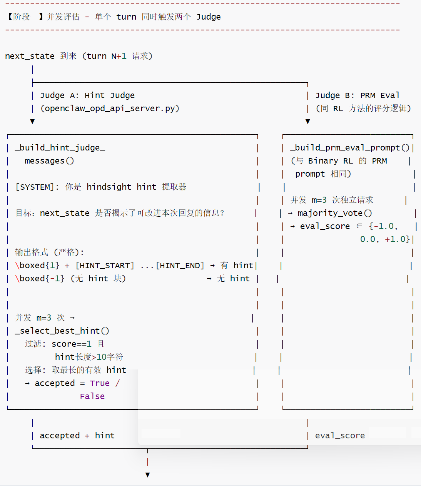
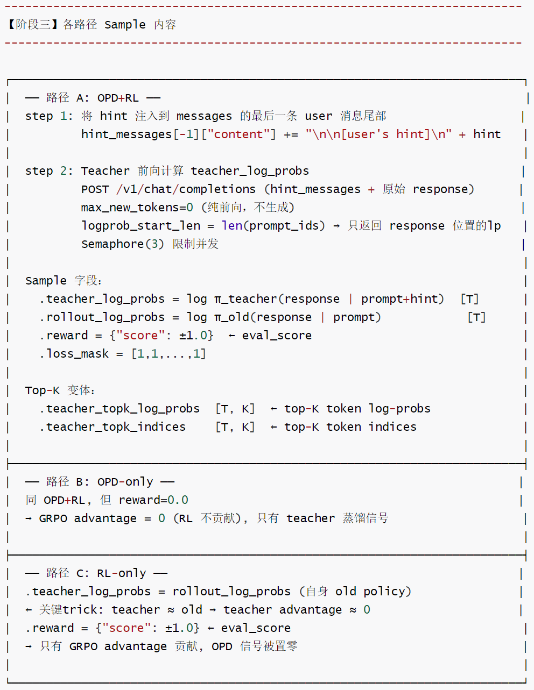
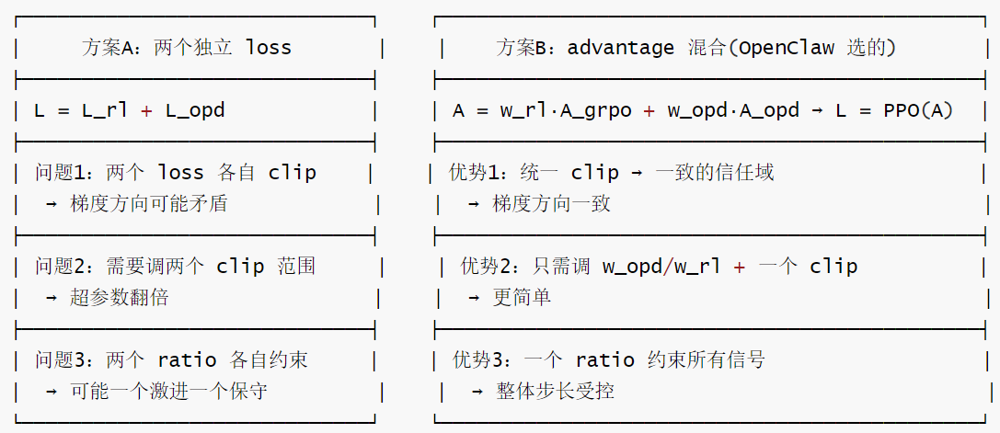

# 【Agentic RL / 强化学习 / OPD】OpenClaw-RL 源码阅读笔记 --- (15)--- Combine模式

# 【Agentic RL / 强化学习 / OPD】OpenClaw-RL 源码阅读笔记 --- (15)--- Combine模式

目录

* [【Agentic RL / 强化学习 / OPD】OpenClaw-RL 源码阅读笔记 --- (15)--- Combine模式](#agentic-rl--强化学习--opdopenclaw-rl-源码阅读笔记-----15----combine模式)
  + [0x00 概要](#0x00-概要)
  + [0x01 架构](#0x01-架构)
    - [1.1 架构：继承而非重写](#11-架构继承而非重写)
    - [1.2 并行评估流水线：两个任务合一](#12-并行评估流水线两个任务合一)
    - [1.3 小结](#13-小结)
  + [0x02 流程](#0x02-流程)
    - [2.1 阶段一](#21-阶段一)
    - [2.2 阶段二](#22-阶段二)
    - [2.3 阶段三](#23-阶段三)
    - [2.4 阶段四](#24-阶段四)
  + [0x03 Combined Loss](#0x03-combined-loss)
    - [3.1 计算公式](#31-计算公式)
    - [3.2 样本](#32-样本)
      * [各样本类型的优势值矩阵](#各样本类型的优势值矩阵)
      * [三种样本的优势向量对比](#三种样本的优势向量对比)
      * [PPO Clipping 如何作用于 Combined Advantage](#ppo-clipping-如何作用于-combined-advantage)
    - [3.3 Combine vs 独立运行两个方法](#33-combine-vs-独立运行两个方法)
    - [3.4 OPD loss 和 GRPO loss 的联合训练](#34-opd-loss-和-grpo-loss-的联合训练)
      * [方案 A: Loss 混合](#方案-a-loss-混合)
      * [方案 B: Advantage 混合(OpenClaw 的选择)](#方案-b-advantage-混合openclaw-的选择)
      * [为什么这样设计？](#为什么这样设计)
        + [梯度方向一致性](#梯度方向一致性)
        + [信任域语义](#信任域语义)
        + [PPO clip 是关于 r\_t 的，不是关于 A 的](#ppo-clip-是关于-r_t-的不是关于-a-的)
        + [与 multi-objective RL 的关系](#与-multi-objective-rl-的关系)
    - [3.5 Combine 的 custom loss 如何拦截并混合？](#35-combine-的-custom-loss-如何拦截并混合)
      * [Shell 脚本配置](#shell-脚本配置)
      * [执行流程](#执行流程)
      * [拦截的精妙之处](#拦截的精妙之处)
  + [0x04 三路分发逻辑](#0x04-三路分发逻辑)
    - [4.1 三路分发逻辑](#41-三路分发逻辑)
    - [4.2 3-Way Dispatch 为何是必要的](#42-3-way-dispatch-为何是必要的)
    - [4.3 与“有条件分支”的对比](#43-与有条件分支的对比)
    - [4.4 hint+eval\_score 如何被利用](#44-hinteval_score-如何被利用)
      * [dispatch决策树](#dispatch决策树)
      * [每种情况的Sample构造与梯度效果](#每种情况的sample构造与梯度效果)
        + [情况 A: OPD-only（\_submit\_turn\_sample with reward=0.0)](#情况-a-opd-only_submit_turn_sample-with-reward00)
        + [情况B: RL-only（\_submit\_rl\_turn\_sample）](#情况b-rl-only_submit_rl_turn_sample)
        + [情况 C: DROP（两信号都无）](#情况-c-drop两信号都无)
        + [情况D: OPD+RL（\_submit\_turn\_sample with reward=±1.0)](#情况d-opdrl_submit_turn_sample-with-reward10)
    - [4.5 信息流总结图](#45-信息流总结图)
    - [4.6 权重参数的语义](#46-权重参数的语义)
      * [权重 w\_rl/w\_opd 的调参建议](#权重-w_rlw_opd-的调参建议)
      * [问题](#问题)
      * [三种确定比例的方法](#三种确定比例的方法)
  + [0x05 讨论](#0x05-讨论)
    - [5.1 符号定义](#51-符号定义)
    - [5.2 不同路径的贡献](#52-不同路径的贡献)
    - [5.3 Combine为何能同时收益于OPD+RL](#53-combine为何能同时收益于opdrl)
      * [理论解释：两种信号的互补视角](#理论解释两种信号的互补视角)
        + [RL信号（Binary RL / GRPO）：](#rl信号binary-rl--grpo)
        + [OPD信号（Teacher LP）](#opd信号teacher-lp)
        + [Combined](#combined)
      * [方差一偏差权衡](#方差一偏差权衡)
      * [最优控制视角：Q函数的近似分解](#最优控制视角q函数的近似分解)
      * [解耦的本质：信号空间的正交分解](#解耦的本质信号空间的正交分解)
      * [梯度分解](#梯度分解)
      * [直觉总结](#直觉总结)
    - [5.4 Combine 方法是否缓解了 OPD 级联错误问题](#54-combine-方法是否缓解了-opd-级联错误问题)
      * [具体场景分析](#具体场景分析)
      * [Combine 3-way Dispatch 中的不对称缓解](#combine-3-way-dispatch-中的不对称缓解)
      * [残余问题](#残余问题)
  + [0xFF 参考](#0xff-参考)

## 0x00 概要

本系列的目的是：借着对 OpenClaw-RL 源码的学习，来梳理强化学习的一些相关概念和思想。所以，会有一些基础知识、扩展和发散，OpenClaw-RL 只是一个切入点。而且，因为整篇系列是一个整体，所以有些概念的解读/学习会在不同的文章中出现，还请大家谅解。

OpenClaw-RL 是一个用于在线强化学习（Online RL）的框架，专门针对智能体工具使用场景。它通过从环境反馈中提取过程奖励信号来训练语言模型，支持三种主要模式：

* **openclaw-rl**：基于二元奖励的强化学习（Binary RL / GRPO）
* **openclaw-opd**：基于后见之明提示的在线策略蒸馏（On-Policy Distillation, OPD）
* **openclaw-combine**：联合方法，在同一 PPO 更新中同时利用 RL reward 和 OPD teacher signal


OpenClaw-Combine：同时使用OPD提示和RL奖励。两个优势互补：OPD提供方向性指导，RL提供精细调优

这种设计体现了OpenClaw框架的灵活性和可扩展性，能够根据不同任务需求选择最适合的训练策略，同时保持统：一的架构接口和数据流规范。

## 0x01 架构

### 1.1 架构：继承而非重写

OpenClawCombineAPIServer 继承了 OpenClawOPDAPIServer，继承的核心组件：

* \_opd\_evaluate() ：hint提取 + teacherlog-probs（来自OPD，未修改）
* query\_judge\_once() ：judge LLM调用（来自OPD，未修改）
* fire\_opd\_task() ：触发异步评估任务（来自OPD，未修改）

```
    class OpenClawCombineAPIServer(OpenClawOPDAPIServer):
        #继承OPD的全部基础设施：
        #-turn 拦截、记录、next_state 等待
        #-hintjudge机制（完整保留）
        #-teacherlog-probs计算（完整保留）
        #-top-K蒸馏（完整保留）
        #新增：override_submit_turn_sample和_maybe_submit_ready_samples
        #使其同时执行eval评分（来自OPD的eval_mode功能）
        
        #重写了_submit_turn_sample()和_maybe_submit_ready_samples()
        #其余（hint提取、teacher log-probs、流量代理等）完全复用父类
```

### 1.2 并行评估流水线：两个任务合一

在 combine 模式下，Turn N+1 到达时, 会触发对 Turn N 的评估:

```
Turn N+1到达后，触发_fire_opd_task()（继承自OPD）
                ↓   
_opd_evaluate() 同时执行：
┌────────────────────────────────────────────────┐
│ Task A: m次并发 hint-judge 调用（asyncio.gather）│
│   → 决定 hint 是否有用                           │
│   → 提取最长 hint                               │
│   → 若 accepted: 计算 teacher log-probs         │
│   → votes:[{score:1,hint:"..."}，...]          |
│   → _select_best_hint()→选最长hint/None         |  
│                                                │
│ Task B: m次并发 eval 调用 (eval_mode=True)       │
│   → 决定 response 质量 ±1/0                     │
│   → majority vote → eval_score                 │
│   → eval_scores:[+1,+1,-1]                     |
│   → _prm_eval_majority_vote() → eval_score:+1/-1/0
└────────────────────────────────────────────────┘
                ↓
_maybe_submit_ready_samples() 调度
```

注意：Task A 和 Task B 在代码中是顺序执行的 (先 hint, 再 eval)，但两者都是并发的 gather, 整体并发度 = 2m 次 LLM 调用

### 1.3 小结

下面是三种模式的对比。

| 对比维度 | Binary RL | 只 OPD | Combine |
| --- | --- | --- | --- |
| 样本覆盖率 | 所有评分 turn | 只有 hint 接受 | Max（4 种情况尽量收集） |
| 信号粒度 | token 统一 | per-token | 混合 |
| 对隐式反馈 | ✅ 支持 | ❌ 不支持 | ✅ 支持 |
| 对显式纠正 | ❌（仅支持 ±1 打分） | ✅（hint 文本精准纠正） | ✅ 全部支持 |
| 单 turn 最大样本 | 1 | 1 | 1（同样只产生 1 个） |
| 权重可调 | N/A | N/A | w\_rl, w\_opd（默认均为 1.0） |
| API Server 类 | OpenClawAPIServer | OpenClawOPDAPIServer | OpenClawCombineAPIServer |
| Judge 调用次数/turn | m=3 (PRM) | m=3 (Hint Judge) + 1次 Teacher LP | m=3 (Hint) + m=3 (Eval) + 1次Teacher LP |
| loss\_mask 控制 | 0 或 1（按 score） | 始终 1 | 始终 1 |
| reward 字段 | ±1 / 0 | 固定 0 | ±1 / 0（来自 eval judge） |
| Advantage 类型 | REINFORCE-like (scalar) | per-token (teacher-studentdiff) | 两者加权求和 |
| Drop 条件 | score=0 且无 at-least-one | hint 被拒绝 | accepted=F 且 eval=0 |
| 丢弃率 | 低 | 高 | 中 |
| at-least-one guarantee | ✓ | × | × |
| teacher\_log\_probs | 无 | 真实 teacher LP | 真实（OPD路径）/ rollout LP（RL路径） |

## 0x02 流程

### 2.1 阶段一



### 2.2 阶段二

```
-------------------------------------------------------------------------------
【阶段二】三路分发 (_maybe_submit_ready_samples)
-------------------------------------------------------------------------------

+----------------+------------+-----------------------------------------------+
| hint accepted? | eval ±1?   | 路径                                          |
+----------------+------------+-----------------------------------------------+
| ✓              | ✓          | OPD+RL  -> _submit_turn_sample(reward=±1)     |
| ✓              | × (=0)     | OPD-only -> _submit_turn_sample(reward=0)     |
| ×              | ✓          | RL-only -> _submit_rl_turn_sample(±1)         |
| ×              | × (=0)     | DROP -> 不产生 sample                         |
+----------------+------------+-----------------------------------------------+
```

### 2.3 阶段三



### 2.4 阶段四

```
-------------------------------------------------------------------------------
【阶段四】combine_loss.py - Combined Advantage 公式
-------------------------------------------------------------------------------

Megatron 训练时 (combine_loss_function):

① GRPO advantage (预计算, 来自 Slime ppo_utils):
    grpo_adv[i] = reward[i] * ones_like(tokens)  (scalar broadcast)

② OPD advantage (per-token, 在 loss 函数中计算):
    teacher_adv[i] = teacher_log_probs[i] - old_log_probs[i]

③ Combined advantage:
    combined_adv = w_opd * teacher_adv + w_rl * grpo_adv
                     ↑                    ↑
           OPENCLAW_COMBINE_W_OPD=1.0   OPENCLAW_COMBINE_W_RL=1.0

④ PPO clipped loss:
    ppo_kl = old_log_probs - new_log_probs  (new = 当前前向)
    ratio  = exp(-ppo_kl)
    pg_loss = -min(ratio * adv, clip(ratio, 1±ε) * adv)
    ε=args.eps_clip (default 0.2), ε_high=args.eps_clip_high (default 0.2 or 0.28, depending on shell flags)

⑤ 最终 loss:
    loss = pg_loss - entropy_coef * entropy
    if args.use_kl_loss and batch.get("ref_log_probs") is not None:
        loss += kl_loss_coef * KL(new||ref)

─────────────────────────────────────────
各路径 advantage 等效性验证:

OPD+RL:  teacher_adv ≠ 0  +  grpo_adv ≠ 0  →  双信号
OPD-only: teacher_adv ≠ 0  +  grpo_adv = 0   →  纯蒸馏
RL-only:  teacher_adv ≈ 0  +  grpo_adv ≠ 0   →  纯RL
          (teacher=rollout → teacher-old=0)
─────────────────────────────────────────
```

## 0x03 Combined Loss

### 3.1 计算公式

给定一个 sample 的每个 token t，对应的计算公式如下：

```
1. GRPO advantage:
   A_t^grpo = R  (reward 标量 broadcast)

2. OPD teacher advantage:
   A_t^opd = log π_teacher(a_t|s_t) - log π_old(a_t|s_t)
   
3. 混合：
	A_t^combined = w_rl · A_t^grpo + w_opd · A_t^opd
	
4. PPO ratio:
	r_t = exp(log π_new(a_t|s_t) - log π_old(a_t|s_t))
	
5. Clipped surrogate:
	L_t = -min(r_t · A_t^combined, clip(r_t, 1-ε, 1+ε_high) · A_t^combined)
	
6. Total loss:
	L = mean_over_tokens(L_t)
```

Combine 不在 Slime 的 advantage\_estimator 枚举内，而是绕过了 Slime 的 advantage 计算！

* 它用 custom\_loss\_function\_path，直接在 loss 函数中合并两种信号
* Slime 还是会调用 GRPO 的 get\_grpo\_returns，但 combine\_loss 覆盖了最终使用的 advantages
* Slime 原生流程：

  + rewards → get\_grpo\_returns() → batch["advantages"] ← GRPO advantages（被 Combine 复用）
* teacher\_log\_probs → 存入 batch["teacher\_log\_probs"] ← OPD 信号（Combine 手动计算差值）

* custom\_loss\_function (combine\_loss)的流程：
  + 取出两者，线性组合，再做 PPO clipping

具体如下：

```
#combine_loss.py中的核心计算：

# Step1: GRPO advantages（预计算，由Slime框架注入batch / reward 广播）
grpo_advantages = torch.cat(batch["advantages"], dim=0)  # reward 广播到所有response tokens
# RL样本：GRPO 用 reward(±1) 广播给所有 token
# OPD样本：reward=0 → GRPO advantage = 0

# Step 2: OPD teacher advantages（per-token)
# teacher_log_probs_list / old_log_probs_list 按 sample 组织, 需逐 sample 计算差值后 cat
teacher_advantages = torch.cat([
    t.to(device=device) - o.to(device=device)  # teacher_lp - old_lp (per-token)
    for t, o in zip(teacher_log_probs_list, old_log_probs_list)
], dim=0)
# OPD样本：真实 hint → 非零 per-token advantage
# RL-only样本：teacher=rollout → teacher_advantage ≈ 0

# Step 3:线性组合
w_opd = float(os.getenv("OPENCLAW_COMBINE_W_OPD", "1.0"))
w_rl  = float(os.getenv("OPENCLAW_COMBINE_W_RL",  "1.0"))
combined_advantages = w_opd * teacher_advantages + w_rl * grpo_advantages

# Step 4: PPO截断surrogate loss（与Slime 标准policy_loss_function 完全一致）
ppo_kl = old_log_probs - new_log_probs
pg_loss, pg_clipfrac = compute_policy_loss(ppo_kl, combined_advantages,
    eps_clip=args.eps_clip, eps_clip_high=args.eps_clip_high)
loss = pg_loss - entropy_coef * entropy_loss
if args.use_kl_loss and batch.get("ref_log_probs") is not None:
    loss = loss + kl_coef * kl_loss
```

### 3.2 样本

具体样本如下：

```
┌──────────┬──────────────────┬─────────────────────┬───────────────┬────────────────┐
│ 样本类型  │ teacher_log_probs│ teacher_adv         │ grpo_adv      │ combined_adv   │
│          │ 内容              │                     │               │                │
├──────────┼──────────────────┼─────────────────────┼───────────────┼────────────────┤
│ OPD+RL   │ 真实 teacher LP   │ teacher - rollout ≠ 0│ reward ±1    │ w_opd*(t-r) +  │
│          │                  │                     │ broadcast     │w_rl*grpo       │
├──────────┼──────────────────┼─────────────────────┼───────────────┼────────────────┤
│ OPD-only │ 真实 teacher LP  │ teacher - rollout ≠ 0│ 0 (reward=0) │ w_opd*(t-r)    │
├──────────┼──────────────────┼─────────────────────┼───────────────┼────────────────┤
│ RL-only  │ rollout_lp（假）  │ 0（对消）            │ reward ±1     │ w_rl * grpo    │
│          │                  │                     │ broadcast     │                │
└──────────┴──────────────────┴─────────────────────┴───────────────┴────────────────┘
```

#### 各样本类型的优势值矩阵

各样本类型的优势值矩阵如下：

| 样本类型 | teacher\_advantages (per-token) | grpo\_advantages (per-token) | combined (per-token) |
| --- | --- | --- | --- |
| OPD+RL sample | hint\_logp – old\_logp | ±1.0（broadcast） | 两者叠加 |
| OPD-only sample | hint\_logp – old\_logp | 0.0（reward=0） | 只有 OPD 信号 |
| RL-only sample | ≈ 0（teacher=rollout） | ±1.0（broadcast） | 只有 RL 信号 |
| 直觉 | 方向性纠正："下一步往哪走" | 好/坏评价："这步走的方向对不对" |  |

#### 三种样本的优势向量对比

假设response =[“None"，“check"，“is"，“added"] （T=4 tokens）

```
┌─────────────────────────────────────────────────────────────────────────────┐
│ RL-only 样本 (hint=None, eval=+1)                                           │
│                                                                             │
│ rollout_log_probs  = [-0.3, -1.2, -0.1, -0.8]                               │
│ teacher_log_probs  = [-0.3, -1.2, -0.1, -0.8] <- 故意=rollout               │
│ reward             = +1.0                                                   │
│                                                                             │
│ teacher_adv_t = teacher - old = [0.0, 0.0, 0.0, 0.0]                        │
│ grpo_adv_t    = [+1.0, +1.0, +1.0, +1.0]                                    │
│                                                                             │
│ combined_adv = 1.0*[0,0,0,0] + 1.0*[1,1,1,1]                                │
│              = [+1.0, +1.0, +1.0, +1.0]                                     │
│                                                                             │
│ 效果: 所有 token 均匀鼓励 (Binary RL 行为)                                     │
└─────────────────────────────────────────────────────────────────────────────┘

┌─────────────────────────────────────────────────────────────────────────────┐
│ OPD-only 样本 (hint=接受, eval=0)                                            │
│                                                                             │
│ rollout_log_probs  = [-0.3, -1.2, -0.1, -0.8]                               │
│ teacher_log_probs  = [-0.1, -0.3, -0.1, -0.2] <- 真实 teacher               │
│ reward             = 0.0                                                    │
│                                                                             │
│ teacher_adv_t = [-0.1-(-0.3), -0.3-(-1.2), -0.1-(-0.1), -0.2-(-0.8)]        │
│               = [+0.2, +0.9, 0.0, +0.6]                                     │
│ grpo_adv_t    = [0.0, 0.0, 0.0, 0.0] (reward=0)                             │
│                                                                             │
│ combined_adv = 1.0*[0.2,0.9,0.0,0.6] + 1.0*[0,0,0,0]                        │
│              = [+0.2, +0.9, 0.0, +0.6]                                      │
│                                                                             │
│ 效果: "check" 这个 token 最受鼓励 (teacher 认为最关键)                          │
└─────────────────────────────────────────────────────────────────────────────┘

┌─────────────────────────────────────────────────────────────────────────────┐
│ Combined 样本 (hint=接受, eval=+1)                                           │
│                                                                             │
│ rollout_log_probs  = [-0.3, -1.2, -0.1, -0.8]                              │
│ teacher_log_probs  = [-0.1, -0.3, -0.1, -0.2] <- 真实 teacher               │
│ reward             = +1.0                                                   │
│                                                                             │
│ teacher_adv_t = [+0.2, +0.9, 0.0, +0.6]                                     │
│ grpo_adv_t    = [+1.0, +1.0, +1.0, +1.0]                                    │
│                                                                             │
│ combined_adv = 1.0*[0.2,0.9,0.0,0.6] + 1.0*[1.0,1.0,1.0,1.0]                │
│              = [+1.2, +1.9, +1.0, +1.6]                                     │
│                                                                             │
│ 效果: 全局鼓励 (来自RL) + per-token 差异化增强 (来自OPD)                         |
│ "check" 的梯度信号最强 (teacher最在意的token 叠加了两个正信号)                    │
└─────────────────────────────────────────────────────────────────────────────┘
```

直觉理解

|  | token 1 | token 2 | token 3 | token 4 | token 5 |  |
| --- | --- | --- | --- | --- | --- | --- |
| GRPO advantage: | +1 | +1 | +1 | +1 | +1 | ← 全部一样(reward=+1) |
| OPD advantage: | +0.3 | -0.1 | +0.5 | +0.8 | -0.2 | ← 每个不同 |
| Combined: | +1.3 | +0.9 | +1.5 | +1.8 | +0.8 | ← w=1,1时 |

含义：

* token 1: GRPO 说"整体好"，OPD 说"teacher也喜欢" → 大力增强
* token 2: GRPO 说"整体好"，OPD 说"teacher不太喜欢" → 温和增强
* token 5: GRPO 说"整体好"，OPD 说"teacher不太喜欢" → 温和增强

GRPO 给出全局方向(好/差)，OPD 细化每个 token 的权重(哪些 token 更好/差)。

#### PPO Clipping 如何作用于 Combined Advantage

Combined 优势对截断的影响:

```
A_t 放大 (如 +1.9 for "check"):
    -> ratio 鼓励增大 π_θ("check" | context)
    -> clipping 防止单步更新过大 (ε_high = 0.28)

A_t 接近 0 (如 +1.0 for "is"):
    -> 更新量较小, 更保守
```

具体代码如下：

```
# ppo_utils.py 中的 compute_policy_loss():
# ratio = exp(new_log_prob - old_log_prob) = π_θ(a_t)/π_old(a_t)
ppo_kl = old_log_probs - new_log_probs  # 近似 KL
ratio = torch.exp(-ppo_kl)              # 策略比率

pg_losses1 = -ratio * advantage         # 未截断
pg_losses2 = -ratio.clamp(1-0.2, 1+0.28) * advantage  # 截断
pg_loss = torch.max(pg_losses1, pg_losses2) # 取保守的 (更大的损失)
```

### 3.3 Combine vs 独立运行两个方法

Combine的优势：

* turn最多提交1个样本（节省databuffer容量）
* 同一个teacher forward pass服务两个目标（节省PRM GPU调用）
* 梯度信号互补（序列级评价+token级方向）

Combine的代价：

* OPD judge和eval judge各需要m次调用（总共2m次；默认m=1）
* accepted率低时（无hint），仍需额外的eval调用

### 3.4 OPD loss 和 GRPO loss 的联合训练

这就是 Combine 方法的核心。它们不是两个独立 loss 相加，而是在 advantage 层面混合后共享一个 PPO loss。

不是这样(两个 loss 加权求和)，我们定义为方案 A：

```
# ✗ 错误理解
total_loss = w_rl * PPO_loss(grpo_advantage) + w_opd * OPD_loss(teacher_advantage)
```

而是这样(advantage 混合 → 单一 PPO loss)，我们称之为方案 B：

```
# ☑ 实际实现(combine_loss.py)
combined_advantage = w_opd * (teacher_lp - old_lp) + w_rl * grpo_advantage
total_loss = PPO_clip_loss(combined_advantage)    # 只有一个 loss！
```

两种方案的形式化定义如下。

#### 方案 A: Loss 混合

```
L = w_rl · L_PPO(A^grpo) + w_opd · L_PPO(A^opd)

其中：L_PPO(A) = -E_t[min(r_t · A_t, clip(r_t) · A_t)]

两个独立的 PPO loss，各自有 clip，最后加权求和。
```

#### 方案 B: Advantage 混合(OpenClaw 的选择)

```
A^combined = w_rl · A^grpo + w_opd · A^opd
L = L_PPO(A^combined)

一个 PPO loss，只是 advantage 是混合的。
```

#### 为什么这样设计？

下表展示了设计原因。



关键理论差异如下。

##### 梯度方向一致性

```
方案 A 的梯度：

    ∇L = w_rl · ∇L_PPO(A^grpo) + w_opd · ∇L_PPO(A^opd)

    两个 clip 可能在同一个 token 上做出相反决定：
    - L_PPO(A^grpo) 的 clip 认为 r_t 太大 → clip 住
    - L_PPO(A^opd) 的 clip 认为 r_t 合适 → 不 clip

    → 同一步更新中，一个力推一个力拉 → 梯度冲突

方案 B 的梯度：

    ∇L = ∇L_PPO(A^combined)

    只有一个 clip 判断：A^combined 确定了方向，r_t 与 clip 的关系只判断一次
    → 梯度方向一致
```

##### 信任域语义

PPO clip 的本质是：限制 policy 每步最多改变多少。

```
方案 A：两个独立信任域
    Trust Region for GRPO (r ∈ [0.8, 1.28])
    Trust Region for OPD (r ∈ [0.8, 1.28]) 

    问题：r_t 同时满足两个约束 → 实际约束可能过松或过紧

方案 B：单一信任域
    Trust Region for combined A (r ∈ [0.8, 1.28])

	r_t 只需满足一个约束 → 语义清晰
```

##### PPO clip 是关于 r\_t 的，不是关于 A 的

这是理解的关键：

```
    # PPO loss 公式：
    L = -min(r_t · A_t, clip(r_t, 1-ε, 1+ε_high) · A_t)
    # r_t = π_new / π_old (策略变化幅度)
	# A_t 只决定方向和大小，clip 约束的是 r_t
	
    # 方案 A:
    L = w1 · [-min(r·A1, clip(r)·A1)] + w2 · [-min(r·A2, clip(r)·A2)]
    = [-min(r·A1, clip(r)·A1)] * w1 + [-min(r·A2, clip(r)·A2)] * w2

    # 如果 A1 > 0 且 A2 < 0(矛盾方向):
    # 第一项想增大 r，第二项想减小 r
    # clip 无法协调，梯度互相抵消
    
    # 方案 B:
    A_combined = w1·A1 + w2·A2 ← 先解决方向冲突
    L = -min(r · A_combined, clip(r) · A_combined)
    # 方向已确定，clip 只管步长
```

##### 与 multi-objective RL 的关系

| 范式 | 公式 | 理论依据 |
| --- | --- | --- |
| Reward 混合(最标准) | R = w1·R1 + w2·R2 → 单一 RL | 线性 scalarization of Pareto front |
| Advantage 混合(OpenClaw) | A = w1·A1 + w2·A2 → 单一 PPO | advantage 是 reward 的函数，混合传递 |
| Loss 混合(方案 A) | L = w1·L1 + w2·L2 | 多任务学习(MTL)，不是标准 RL |

Loss 混合则更接近多任务学习(如 Transformer 同时做 MLM + NSP)，不保证收敛到 Pareto 最优。

而OpenClaw 的方案等价于：先把两个信号在 advantage 空间统一成一个目标，然后用标准单目标 RL 优化。这符合 RL 理论中的线性 scalarization 范式。但是，该方案存在一个理论风险：两个分量的量纲/尺度不同：

* teacher\_lp - old\_lp: 典型值 `[-2, +2](per-token log-prob 差)`
* reward: {-1, 0, +1}(离散标量 broadcast)

如果 w\_opd = w\_rl = 1: → OPD 项可能系统性地比 GRPO 项大/小 → 实际权重不等于名义权重

这是为什么 OPENCLAW\_COMBINE\_W\_OPD 和 OPENCLAW\_COMBINE\_W\_RL 需要仔细调参的原因。

### 3.5 Combine 的 custom loss 如何拦截并混合？

Combine 的巧妙之处：它声称自己是 GRPO，让 Slime 先算好 GRPO advantage，然后 custom loss function 拦截并混合 OPD advantage。

#### Shell 脚本配置

```
--advantage-estimator grpo               ← ① 告诉 Slime 用 GRPO 算 advantage
--loss-type custom_loss                  ← ② 告诉 Slime 用自定义 loss 函数
--custom-loss-function-path combine_loss.combine_loss_function ← ③ 指向哪个函数
```

#### 执行流程

Slime 内部流程如下：

```
Step 1: advantage 阶段 (loss.py L400-420)
    rewards = [±1, 0, ±1, 0, ...] ← API Server 设的
    advantages = get_grpo_returns(rewards) ← GRPO: broadcast reward to all tokens
    batch["advantages"] = advantages ← 存入 batch 字典
        │ 
        │ 
        ▼
Step 2: loss 阶段 (loss.py L944-952)
    match args.loss_type:
        case "policy_loss": func = policy_loss_function ← Binary RL / OPD 走这里
        case "custom_loss": func = load_function(path) ← Combine 走这里！
        │ 
        │ 
        ▼
Step 3: combine_loss.py 被调用
	接收 batch 字典 → 读取 GRPO advantages + teacher_log_probs → 混合
```

combine\_loss.py 核心逻辑 (逐段解读)如下：

```
def combine_loss_function(args, batch, logits, sum_of_sample_mean):

① 读取 GRPO 已算好的 advantage:

    grpo_advantages = torch.cat(batch["advantages"], dim=0)
    # 这就是 Slime 在 Step 1 算好的 GRPO advantage (每 sample 一个标量 broadcast)
    # 对于 reward=±1 的样本: 全 +1 或全 -1
    # 对于 reward=0 的样本 (OPD-only) : 全 0
    
② 当前 forward pass 得到新 log-probs:

    new_log_probs = get_log_probs_and_entropy(logits, ...) # 当前策略的 log π(a|s)
    old_log_probs = batch["rollout_log_probs"] # rollout 时旧策略的 log π_old

③ 计算 OPD teacher advantage:

    teacher_advantages = torch.cat([
        t.to(device) - o.to(device) # teacher_lp - old_lp (per-token!)
        for t, o in zip(teacher_log_probs_list, old_log_probs_list)
    ], dim=0)
 
④ 混合—这是整个 Combine 的核心公式：

    w_opd = float(os.getenv("OPENCLAW_COMBINE_W_OPD", "1.0"))
    w_rl  = float(os.getenv("OPENCLAW_COMBINE_W_RL",  "1.0"))
    combined_advantages = w_opd * teacher_advantages + w_rl * grpo_advantages

⑤ 用混合 advantage 走标准 PPO clip:

    ppo_kl = old_log_probs - new_log_probs       # ratio 的 log 形式
    pg_loss = compute_policy_loss(ppo_kl, combined_advantages, eps_clip, eps_clip_high)
```

#### 拦截的精妙之处

Combine 的精妙在于：不用 if/else，而是通过数据设置让数学自动分流。GRPO 先算好 advantage，custom loss 拦截后叠加 OPD teacher：

* OPD 样本的 GRPO 项为 0(因为 reward=0)
* RL 样本的 OPD 项为 0(因为 teacher=rollout)

能这么做的原因是：三条路径用同-个公式 A = w\_rl \* grpo\_adv + w\_opd \*（teacher\_lp － rollout\_lp)， 不需要条件分支。 dispatch 只决定"给 teacher\_lp 和reward赋什么值"，loss函数本身是统一的。

在combine\_loss.py 里只用一行代码实现了整个"RL-only样本零OPD"的效果，不需要任何条件判断。其数学效果如下：

```
# RL-only样本：
teacher_advantage = teacher_lp - old_lp
				  = response_logprobs - response_logprobs #同—个值！ 
				  = 0 ← OPD信号被完美消除
# OPD-only样本：
grpo_advantage = broadcast(reward)= broadcast(0.0) = 0 ← GRPO 信号被完美消除

# OPD+RL样本：
teacher_advantage = real_teacher_lp-old_lp ≠ 0 ←OPD信号存在
grpo_advantage = broadcast(±1) ≠ 0 ←GRPO信号存在
combined = w_opd * teacher_adv +w_rl * grpo_adv ← 两者都贡献
```

细节如下：

```
                  OPD-only 样本                    RL-only 样本
                  ─────────────                    ────────────
reward            0                                 ±1
grpo_advantages   全 0 ← reward broadcast           全 ±1
teacher_lp        真实 teacher 的 log-probs          = rollout_lp (API Server 设的!)
old_lp (rollout)  旧策略 log-probs                   旧策略 log-probs

teacher_adv =     teacher_lp - old_lp ≠ 0           rollout_lp - old_lp ≈ 0 †
                  ↑ 真正的蒸馏信号                   ↑ 自消了！

combined_adv =    w_opd * teacher_adv + w_rl * 0    w_opd * 0 + w_rl * grpo_adv
                  = 纯 OPD                           = 纯 GRPO

† RL-only 样本中，API Server 把 teacher_log_probs 设为 rollout_log_probs，所以 teacher_lp - old_lp ≈ 0。
```

注意，Combine 的 combine\_loss.py 中，teacher\_advantages 和 grpo\_advantages 分别如下：

* grpo\_advantages：Slime 标准流程计算的 GRPO advantage（标量reward broadcast），来自batch["advantages"]
* teacher\_advantages：teacher\_log\_probs-rollout\_log\_probs（per-token 差异），在 loss 函数内部计算两者加权求和：A=w\_rl*grpo\_advantages+w\_opd*teacher\_advantages

样例（看看如何处理RL only 样本）如下：在 \_submit\_turn\_sample 函数中，分别有设置：

```
# openclaw-combine\openclaw_combine_api_server.py
    # OPD 样本（含 hint 的）：
    sample.teacher_log_probs = teacher_forward_pass(hint + original_response)
    # ↑ 真实的 teacher 分布（包含 hint 信息）

# openclaw-opd\openclaw_opd_api_server.py    
    # RL-only 样本（无 hint）：
    sample.teacher_log_probs = torch.tensor(response_logprobs)  # = rollout_log_probs
    # ↑ 设置为 rollout log-probs 自身!
    # 这样 teacher_advantage = teacher_lp - old_lp ≈ 0
	# RL-only 样本的 OPD 贡献 ≈ 0，由 GRPO advantage 主导
```

这个巧妙设计通过让 teacher\_log\_probs = rollout log-probs，RL only 样本自然地在 combined loss 中贡献 0 的OPD 信号。

## 0x04 三路分发逻辑

| 路径 | 条件 | 训练信号 |
| --- | --- | --- |
| OPD+RL | hint被采纳 + (eval=±1) | teacher\_log\_probs + reward |
| OPD-only | hint被采纳 + (eval=0) | teacher\_log\_probs + (reward=0) |
| RL-only | hint被拒绝 + (eval=±1) | (teacher\_lp ← rollout\_lp) + reward |
| Drop | hint被拒绝 + (eval=0) | 丢弃 |

### 4.1 三路分发逻辑

```
    # _maybe_submit_ready_samples() 中的分发逻辑:
    opd_accepted = opd_result.get("accepted")    # hint 被接受?
    has_valid_rl = self._is_valid_rl_score(eval_score)  # eval 有效?

    if opd_accepted and has_valid_rl:
        → _submit_turn_sample(reward=eval_score)   # 合并样本
    elif opd_accepted:
        → _submit_turn_sample(reward=0.0)          # OPD-only
    elif has_valid_rl:
        → _submit_rl_turn_sample(eval_score)       # RL-only
    else:
        → 丢弃（无任何信号）
        
┌───────────┬─────────────┬─────────────────────────────────────────────┐
│ hint 接受?│ eval = ±1?  │ 提交类型 & 优势信号                             │
├───────────┼─────────────┼─────────────────────────────────────────────┤
│ ✅        │ ✅          │ Combined: A_t = w_opd*(teacher-old) + w_rl*r│
│ ✅        │ ❌ (0/None) │ OPD-only: A_t = w_opd*(teacher-old) + 0     │
│ ❌        │ ✅          │ RL-only:  A_t = 0 + w_rl*r (均匀广播)        │
│ ❌        │ ❌          │ 丢弃                                         │
└───────────┴─────────────┴─────────────────────────────────────────────┘
```

### 4.2 3-Way Dispatch 为何是必要的

dispatch 的理论意义：它保证了两路信号在合并时互不污染。OPD 信号只在"有高质量 hint"时激活；RL 信号只在"有清晰质量判断"时激活。不满足条件的路径，对应信号被零化，而非被随机噪声替代。

四种情况的具体触发条件和设计逻辑如下（4.1 给出了分发表，这里展开每种情况的设计意图）：

| 情况 | 触发条件 | teacher\_log\_probs | reward.score | loss 主导 |
| --- | --- | --- | --- | --- |
| OPD-only | acc + 0 | 真实教师 LP [T] | 0.0 | OPD 主导 |
| RL-only | !acc + ±1 | rollout\_lp [T]（代入） | ±1.0 (PRM Eval) | GRPO 主导 |
| DROP | !acc + 0 | （不提交） | （不提交） | 无 |
| OPD+RL | acc + ±1 | 真实教师 LP [T] | ±1.0 (PRM Eval) | 两路叠加 |

**情况 A（OPD-only）**：hint accepted + eval=0。人类信号不确定（中性），但教师有明确的改进建议 → 用 r=0 → grpo\_adv=0 → 只走 OPD 路径，避免 RL 噪声污染好的蒸馏信号。

**情况 B（RL-only）**：hint rejected + eval=±1。教师没能提炼出 hint（可能回复本来就很好）→ 令 teacher\_lp=rollout\_lp → teacher\_adv≈0 → 纯 GRPO 训练，奖罚清晰，防止强行蒸馏一个没有 hint 的样本。

**情况 C（DROP）**：hint rejected + eval=0。双无信号，什么都不做。

**情况 D（OPD+RL）**：hint accepted + eval=±1。两路信号都可信，联合优化，这是信号最丰富的情况。

> 四种情况的 Sample 构造细节和梯度效果见 4.4 节。

### 4.3 与“有条件分支”的对比

朴素实现（有分支）：

```
if sample_type == "rl_only":    
	loss = rl_loss(r, pi_theta, pi_old) 
elif sample_type == "opd_only":    
	loss = opd_loss(pi_T, pi_theta, pi_old) 
elif sample_type == "opd_rl":    
	loss = rl_loss(...) + opd_loss(...)
```

Combine 实现（无分支）：

```
#combine_loss.py
# old_log_probs 来自 rollout_log_probs (默认) 或 log_probs (依据 args.use_rollout_log_probs 标志)
combined_adv = w_opd * (teacher_lp - old_log_probs) + w_rl * grpo_adv
#样本类型编码在数值里，而非代码逻辑里
```

这类似于L1正则化（用绝对值的次梯度统一处理W=0和W≠0，而非分情况讨论），将控制流转化为数值代数，使得：

* GPU执行路径统一：所有样本走同一段CUDA kernel，无条件分支带来的warp divergence
* 批次可以混合三种样本：同一个mini-batch里OPD样本和RL样本共存，梯度累加后自然叠加
* 解耦是严格的：不是“约等于零"，而是代数上精确为零（`π_T=π_old`时差为精确0）

### 4.4 hint+eval\_score 如何被利用

#### dispatch决策树

关键注意：`eval_score=0` 被判定为 `has_valid_rl=False`（因为 `_is_valid_rl_score` 只接受 ±1）。这意味着中性信号不参与 RL 训练，与 Binary RL 的设计理念（loss\_mask=0 跳过）有所不同。

```
opd_accepted =opd_result.get("accepted") # HintJudge 是否接受了hint
has_valid_rl =self._is_valid_rl_score（eval_score）#eval_score E{+1,-1}.（0不算）

# 情况A
if opd_accepted and has_valid_rl:
	_submit_turn_sample(..., reward=float(eval_score)) # OPD+RL
    
# 情况B 
elif opd_accepted:
	_submit_turn_sample(...,reward=0.0) # OPD-only
    
# 情况C 
elif has_valid_rl:
	_submit_rl_turn_sample(...,eval_score #RL-only
                           
# 情况D：两者都不满足 → 什么都不做（DROP）
```

#### 每种情况的Sample构造与梯度效果

##### 情况 A: OPD-only（\_submit\_turn\_sample with reward=0.0)

* 触发时机：HintJudge给出了有价值的hint（说明回复有改进空间），但PRMEval给出的是中性评分（o），即"看不出这条对话成功与否"。
* 设计逻辑：此时用·RLreward=0会引入方差（零信号但与teacher\_adv叠加可能方向不稳定），干脆令grpo\_adv=0，只让教师引导token-level 改进。

```
	sample.teacher_log_probs = torch.tensor（teacher_log_probs）#教师 LP正常 
	sample.reward ={"score":0.0} #RL信号被置零
	
	#combine_loss.py中的效果：
	grpo_advantages = broadcast(0.0) = 0  # RL 分支贡献 = 0
	teacher_advantages =teacher_lp-rollout_lp  #OPD分支正常
	
	combined_adv_t.=w_opd* teacher_adv_t+0.0
```

##### 情况B: RL-only（\_submit\_rl\_turn\_sample）

* 触发时机：Hint Judge 找不到有价值的 hint（可能回复本身已经很好），但 PRM Eval 有明确的质量判断（+1 或 -1）。
* 设计妙点：不是"不传 teacher\_log\_probs"（这样代码要分叉），而是令 teacher\_log\_probs = rollout\_log\_probs，使教师优势 在 loss 中自然消失。combine\_loss.py 的代码路径完全不变。

```
    #关键行：# 注意：用的是rollout_log_probs，不是教师的！
	sample.teacher_log_probs =torch.tensor(response_logprobs,dtype=torch.float32)
	
	sample.reward ={score":float（eval_score)} #±1.0←PRM Eval 有效
    
    #combine_loss.py中的效果：
    teacher_advantages= teacher_lp-rollout_lp
    				  =rollout_lp-rollout_lp  #teacher=rollout=相同张量！
                      ≈0 #教师优势约为零（数值精度内）
    combined_adv_t = w_opd * 0 + w_rl * eval_score
    			   = w_rl * eval_score # 等价于纯 GRPO
```

##### 情况 C: DROP（两信号都无）

hint rejected (accepted=False) + eval\_score = 0

* → 既没有改进建议，也不知道对话好坏
* → 无有效信号，直接 continue（不进队列）

##### 情况D: OPD+RL（\_submit\_turn\_sample with reward=±1.0)

这是最核心的情况：RL保证方向，OPD在内部精细化每个token的权重。

```
    #调用_submit_turn_sample（重写自父类）
    sample.teacher_log_probs= torch.tensor(teacher_log_probs） #教师 forward pass 结果
    sample.reward = {"score": float(eval_score)}  # ±1.0 来自 PRM Eval

    #combine_loss.py 中的效果：
    teacher_advantages=teacher_lp-rollout_lp #token-level:教师对每个token 的改进建议
    grpo_advantages=broadcast(reward) #sequence-level:eval_score广播

    combined_adv_t=w_opd * teacher_adv_t+w_rl *eval_score
```

两个信号同时起作用的token示例：

```
    假设 eval_score=+1（PRM评为正例）
		teacher_1p_t3-ro1lout_1p_t3=+0.5 #教师特别喜欢第3个token
    
    combined_adv_t3=1.0*0.5+1.0*1.0=+1.5 #→双重强化

    teacher_lp_t7-rollout_lp_t7=-0.3 # 教师不喜欢第7个token，即使整体是正例
                                           
    combined_adv_t7=1.0*（-0.3）+1.0*1.0=+0.7 # →削弱，但仍正
```

### 4.5 信息流总结图

这个设计的核心是信号有效性门控: 只有当 hint 可信时才启用 OPD, 只有当 eval 可信时才启用 RL, 两者独立判定, 不互相干扰。

```
_opd_evaluate() 返回:
{
  accepted: True/False,    <- Hint Judge 多数投票结果
  teacher_log_probs: [...], <- 教师 forward pass (仅 accepted=True 时有值)
  eval_score: 1/0/-1/None,  <- PRM Eval 多数投票 (eval_mode 下)
}
           │
           │ 
           ▼

_maybe_submit_ready_samples() 3-way dispatch:
|
|-- accepted=True, eval_score=±1  ---------------------> OPD+RL Sample
|   teacher_lp = 教师的                                  reward = ±1
|                                                       combined_adv = OPD+GRPO
|
|-- accepted=True, eval_score=0/None -------------------> OPD-only Sample
|   teacher_lp = 教师的                                  reward = 0
|                                                       combined_adv = OPD only
|
|-- accepted=False, eval_score=±1 ----------------------> RL-only Sample
|   teacher_lp = rollout_lp (零化 OPD)                  reward = ±1
|                                                       combined_adv = GRPO only
|
|-- accepted=False, eval_score=0/None -----------------> DROP
```

### 4.6 权重参数的语义

关键洞察：因为两种样本类型“天然解耦”（RL样本的OPD贡献=0，OPD样本的RL贡献为0），权重对各分支的独立样本没有交叉干扰，只有在同一turn同时产生两种信号时（OPD+RL合并样本）才真正合并。

```
OPENCLAW_COMBINE_W_OPD=1.0 #OPD分支的权重 
OPENCLAW_COMBINE_W_RL=1.0 #RL分支的权重

w_rl=1.0,w_opd=0.0 → 退化为纯BinaryRL
w_rl=0.0,w_opd=1.0 → 退化为纯OPD
w_rl=1.0,w_opd=1.0 → Combined（默认，实验显示最优）
```

#### 权重 w\_rl/w\_opd 的调参建议

| 场景 | 建议配置 | 原因 |
| --- | --- | --- |
| 用户反馈简短隐式 | w\_rl=1.5, w\_opd=0.5 | OPD hint 少，RL 更可靠 |
| 用户反馈详细纠正 | w\_rl=0.5, w\_opd=1.5 | OPD hint 质量高，信号更丰富 |
| 平衡场景 | w\_rl=1.0, w\_opd=1.0 | 默认推荐 |

#### 问题

问题：两个分量的尺度天然不同，A^opd 的方差 >> A^grpo 的方差。这会导致：→ OPD 信号在实际中主导梯度方向 → 名义权重 1:1，实际影响力可能是 3:1

#### 三种确定比例的方法

方法 1：方差匹配(理论最优起点)

原理：确保两个信号的 "话语权"等量，然后再通过额外的全局比例调节偏好。

```
# 运行时统计两个分量的标准差
σ_grpo = std(A^grpo across all tokens)    # 通常 ≈ 1.0(因为 reward ∈ {-1,+1})
σ_opd  = std(A^opd across all tokens)     # 需要实际测量

# 归一化使两者方差相等：
w_rl  = 1 / σ_grpo
w_opd = 1 / σ_opd

# 或等价地：
w_rl  = 1.0
w_opd = σ_grpo / σ_opd    # 如果 σ_opd = 2.0, σ_grpo = 1.0 → w_opd = 0.5
```

方法 2：梯度范数匹配(更精确)

这是多任务学习(GradNorm, PCGrad)的经典方法，但计算开销较大。

```
# 不看 advantage，直接看两个信号对梯度的贡献
g_grpo = ∇_θ L_PPO(w_rl * A^grpo)      # GRPO 信号产生的梯度
g_opd  = ∇_θ L_PPO(w_opd * A^opd)      # OPD 信号产生的梯度

# 调节使 ||g_grpo|| ≈ ||g_opd||
```

方法 3：课程调参

原理：

* 早期 model 很弱 → teacher 信号(密集 per-token)比 ±1 reward 更有信息量
* 后期 model 接近 teacher → OPD 信号越来越弱，应让 RL 接管

| 训练阶段 | w\_opd | w\_rl | 理由 |
| --- | --- | --- | --- |
| 早期 (step<100) | 1.0 | 0.1 | OPD 主导：先学 teacher 的分布 |
| 中期 (100-500) | 0.5 | 0.5 | 均衡：同时学分布和 reward 信号 |
| 后期 (500+) | 0.1 | 1.0 | RL 主导：fine-tune reward 优化 |

## 0x05 讨论

### 5.1 符号定义

我们先进行符号定义，设 token 序列长度为 T，对第 t 个 token：

| 符号 | 含义 |
| --- | --- |
| π\_θ(a\_t) | 当前策略（本次前向传播的 log-probs） |
| π\_old(a\_t) | rollout 时的旧策略（rollout\_log\_probs） |
| π\_T(a\_t) | 教师策略（teacher\_log\_probs） |
| r | PRM judge 给出的 reward（±1 或 0） |

### 5.2 不同路径的贡献

对于RL-only样本：

```
teacher_log_probs=rollout_log_probs（故意赋值） 
    → teacher_advantages=teacher-old 0
    → combined_adv=w_opd*0+w_rl*grpo_adv=w_rl*grpo_adv
```

对于OPD-only样本：

```
reward=0.0
    → grpo_advantages=0（GRPO 计算时 reward=0 广播为 0）
    → combined_adv=w_opd*（teacher-old)+w_rl*0=w_opd*（teacher-old)
```

对于Combined样本：

```
teacher_log_probs#rollout_log_probs（真实teacher) 
	→ reward=±1
	→ combined_adv=w_opd *（teacher-old）+w_rl*r （两个分支都贡献）
```

### 5.3 Combine为何能同时收益于OPD+RL

我们看看Combine为何能同时收益于OPD+RL。

#### 理论解释：两种信号的互补视角

两路信号测量的是不同维度

##### RL信号（Binary RL / GRPO）：

* r ∈ {+1, 0, -1} 来自人类行为
* 测量：这条对话轨迹整体是否成功？是从全局（整体response质量）视角出发
* 粒度：序列级，无credit assignment
* 优点：无级联；
* 缺点：无法区分哪些token有责任

具体问题如下：

```
轨迹 [a1, a2, ..., aT] 获得 reward = +1
    ↓
gradient = +1 * Σ_t ∇ log π_θ(a_t)
    ↓
所有 token 同等被强化，包括：
  ✓ 真正好的 token (理应强化)
  × 平庸/随机 token (被误强化 → 方差来源
无法区分哪些token有责任
```

##### OPD信号（Teacher LP）

* `A_t=log π_T(a_t|s,hint)-log π_old(a_t|s)` → 来自教师 forward pass
* 测量：第t个token是否可以被教师改善？
* 粒度：Token 级，自带credit assignment
* 局部（token条件概率）视角
* 优点：细粒度
* 缺点：级联污染

```
teacher_adv_t = log π_T(a_t|hint) - log π_old(a_t)
    ↓
无论对话整体质量如何，都在"教"学生模仿教师
    ↓
即使对话很糟糕 (RL=-1)，OPD 仍在强化某些 token
    → 可能强化"表达方式好但方向错误"的回复
```

##### Combined

上述两路信号在信息论层面不余。RL知道“好不好“但不知道“哪里好”；OPD知道“哪里可以改“但不知道“整体值不值得改”。

Combine 的协同效应：

* 全局信号为锚，局部信号做细化，RL提供“方向正确“的保证，OPD在内部精细化credit
* ∂L/∂θ=OPD梯度（精准但有噪声）+ GRPO梯度（粗糙但无偏）
* 两者在级联位置方向相反→自然对消

```
    combined_adv_t = w_rl * r + w_opd * (teacher_lp_t - old_lp_t)
    
    —— OPD+RL 样本 (hint accepted, eval=+1) ——————
    
    RL 说：这条轨迹是正例 (r = +1)
    OPD 说：token t1 教师特别喜欢，token t2 无差异，token t3 教师不喜欢
    
    combined_adv:
        t1: w_rl*(+1) + w_opd*(big positive) → 双重强化
        t2: w_rl*(+1) + w_opd*(≈0) → 仅被 RL 适度强化
        t3: w_rl*(+1) + w_opd*(negative) → 对冲，净效果小
```

#### 方差一偏差权衡

为什么Combine偏差低：OPD的教师hint是针对"知道next\_state"的反事实，与真实对话质量有相关但不相同。RL的reward直接来自人类行为（user的下一步操作）。Combine中RL扮演“质量门控“角色，防止OPD 在差回复上进行无效蒸馏。

```
			偏差(Bias)   方差(Variance)
----------------------------------------
Binary RL   低            高(all tokens receive same signal)
OPD         中            低(smooth per-token signal) 
Combine     低            较低(RL约束偏差，OPD降方差)
```

#### 最优控制视角：Q函数的近似分解

在RL理论中，最优Q函数可以写成：Q\*（s，a\_1:T）=累积折扣奖励的期望。实践中无法直接计算，需要估计。

Combine隐式地做了这样的分解：

```
Q(S，a_1:T) = R_RL                ---> RL提供轨迹级return估计
              + ∑_t A_OPD(a_t)   ---> OPD提供per-step局部优势估计
```

这与Advantage Actor-Critic（A2c）的结构相似：

* A2C 中的Critic·提供V（s）来减小方差
* OPD中的教师提供per-token的“局部价值“信号

区别：

* A2C的Critic是训练的Value网络，OPD的"Critic"是固定的教师模型+hindsight信息。
* OPD 不用维护额外参数，且信号是“反事实已知结果”，在某种意义上比Critic估计更准确（不是估计，而是观测到的真实 next\_state)。

#### 解耦的本质：信号空间的正交分解

可以把 combined advantage 写成如下，其中：A\_opd = log π\_T - log π\_old （教师优势， per-token）；A\_rl = r （RL 优势，序列级广播）：

```
A = w_opd · A_opd + w_rl · A_rl 

即

a_t=w_opd⋅(logπ_T(a_t)−logπ_old(a_t)) ← OPD 项
       +wrl · ⋅r                      ← GRPO 项（标量广播到每个 token）
```

三路样本的激活矩阵：

```
            A_opd ≠ 0?    A_rl ≠ 0? 
OPD+RL        √                √    → 联合信号 
OPD-only      √                ×    → 仅 OPD 
RL-only       ×                √    → 仅 RL 
Drop          ×                ×    → 丢弃（不入队）
```

关键：× 不是通过 if-else 实现的，而是通过数值赋值让对应项代数归零，即通过trick让公式自然退化：

* RL-only：teacher\_log\_probs=rollout\_log\_probs→OPDadvantage=0→只剩GRPO
* OPD-only：reward=0→GRPOadvantage=0→只剩OPD OPD+RL：两者都非零→加权求和

#### 梯度分解

PPO clip 损失（忽略 clip 边界，分析梯度方向）：

```
∂L/∂θ = -a_t · ∂logπ_θ(a_t)/∂θ
      = -[w_opd·(logπ_T - logπ_old) + w_rl·r] · ∂logπ_θ(a_t)/∂θ
```

三路样本的梯度分解

```
Case 1:OPD+RL（hint 被接受+eval=±1）
    π_T ≠ π_old,r=±1
    At=w_opd·（logπ_T-logπ_old)+w_rl·r
    dL/dθ = -[w_opd·(logπ_T - logπ_old) + w_rl·r] · ∇logπ_θ
    两个信号都有非零贡献，方向由叠加决定。 

Case2:OPD-only（hint 被接受+eval=0）
    π_T ≠ π_old, r=0→grpo_adv=0
    At=w_opd·(logπ_T-logπ_old)+w_r1·0 =w_opd·(logπ_T-log π_old)
    dL/dθ = -w_opd·(logπ_T - logπ_old) · ∇logπ_θ
                                      ↑
                               仅教师信号驱动梯度，RL项完全消失

Case 3:RL-only（hint 被拒绝+ eval=±1）
    π_T←π_o1d，r=±1
    At = w_opd·(log π_old-logπ_old)+w_rl·r
        =w_opd.0                     +w_rl·r
        =w_rl·r
    
    dL/dθ = -w_rl·r · ∇logπ_θ
 					   ↑
               仅reward驱动梯度，教师信号完全消失（代数精确，非近似）
```

#### 直觉总结

比喻：学生（Policy）、老师（Teacher）、用户反馈（RL Reward）

* 纯RL: 用户说“这次对话很棒“学生强化所有行为（含运气）
* 纯OPD: 老师说“第3句可以这样改“ → 学生模仿但不知整体质量
* Combine: 用户验证"对话成功"+老师指出"具体改善点" → 学生知道"朝对的方向，而且知道在哪个词上发力"

### 5.4 Combine 方法是否缓解了 OPD 级联错误问题

结论：

* 有，通过"GRPO 全局惩罚 vs OPD 局部级联"的互补对冲，部分缓解—但仅在 OPD+RL 路径下有效。
* 不是人为消除级联，而是让GRPO的全局信号作为隐式正则，自动压制OPD的局部级联噪声。

#### 具体场景分析

假设最终 PRM 打分 = -1 (Bad) :

```
	response: ["Let", "me", "compute", "1764÷2=882", "then", "sqrt(882)≈29.7"]
                                                ↑ 错误！
```

具体效果如下：

OPD 信号（有级联问题）：

```
teacher_adv: [0.0, 0.0, 0.0, -5.7, +0.8, +2.1]
							   ↑ 级联导致后续 token 被错误正向强化
						     正确惩罚
```

GRPO 信号（无级联，但粗粒度）：

```
grpo_adv: [-1, -1, -1, -1.0, -1.0, -1.0]
                          ↑
                          均匀惩罚所有token
```

Combined（对冲！）：GRPO 的负向均值把 OPD 的错误级联信号向下拉了回来。

```
combined = w_opd * teacher_adv + w_rl * grpo_adv
         = 1.0 * [-5.7, +0.8, +2.1] + 1.0 * [-1.0, -1.0, -1.0]
         = [-6.7, -0.2, +1.1]  ← 级联正向信号被大幅压制
                   ↑        ↑
            从+0.8→-0.2  从+2.1→+1.1（还有残余，但小了很多）
```

#### Combine 3-way Dispatch 中的不对称缓解

```
---------------------|----------------------------------------------------|
| Dispatch 路径      | 级联错误缓解效果                                      |
|--------------------|----------------------------------------------------|
| OPD + RL           | ✓ 有缓解：GRPO 全局信号对抗 OPD 局部级联               |
| (hint接受+eval≠0)  |   负向样本：GRPO 拉低 OPD 级联正值（如上例）             |
|                    |   正向样本：GRPO 拉高 OPD 级联负值（方向对称）           |
|--------------------|----------------------------------------------------|
| OPD only           | × 无缓解：eval=0 无 GRPO 项，级联错误 100% 保留         |
| (hint接受+eval=0)  |   （恰恰是"模型表现平平"的样本，teacher 还不确定对错）     |
|--------------------|----------------------------------------------------|
| RL only            | - 无 OPD 信号（teacher_lp=rollout_lp → 差值≈0）      |
| (hint拒绝+eval≠0)  |   退化为纯 GRPO，无级联问题（但也无细粒度）              |
---------------------|----------------------------------------------------|
```

#### 残余问题

即使Combine.也无法完全解决的情况：

* eval=0的OPD-only样本：hint被接受但模型表现中性，此时恰好级联问题最严重而GRPO缺席
* W\_r1设置过小时：GRPO信号太弱，无法有效对抗级联
* 长CoT开头的错误：越早的级联，污染的token越多，GRPO的均匀惩罚越难精确定位

## 0xFF 参考
