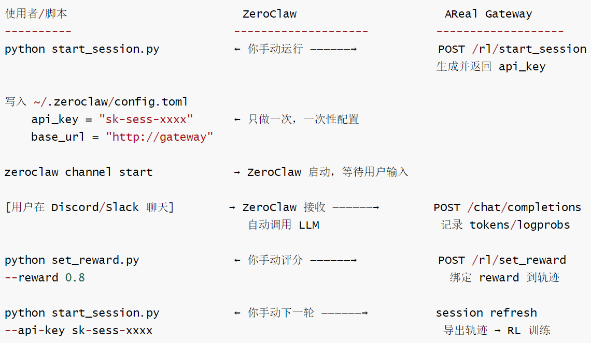

# 【Agentic RL / 强化学习 / OPD】OpenClaw-RL 源码阅读笔记 --- (16)--- AReal

# 【Agentic RL / 强化学习 / OPD】OpenClaw-RL 源码阅读笔记 --- (16)--- AReal

目录

* [【Agentic RL / 强化学习 / OPD】OpenClaw-RL 源码阅读笔记 --- (16)--- AReal](#agentic-rl--强化学习--opdopenclaw-rl-源码阅读笔记-----16----areal)
  + [0x00 概要](#0x00-概要)
  + [0x01 基础背景](#0x01-基础背景)
    - [1.1 AReaL](#11-areal)
    - [1.2 工作](#12-工作)
    - [1.3 训练架构](#13-训练架构)
  + [0x02 具体实现](#0x02-具体实现)
    - [2.1 分工职责](#21-分工职责)
    - [2.2 AReal Proxy Gateway(agent\_service)](#22-areal-proxy-gatewayagent_service)
      * [整体设计](#整体设计)
      * [工作机制](#工作机制)
    - [2.3 OpenClaw-like WebSocket 协议](#23-openclaw-like-websocket-协议)
    - [2.4 Session 生命周期与 Refresh 机制](#24-session-生命周期与-refresh-机制)
    - [2.5 Reward的格式与扩展](#25-reward的格式与扩展)
  + [0x03 算法](#0x03-算法)
    - [3.1 PPO 算法](#31-ppo-算法)
      * [证据链](#证据链)
      * [对比](#对比)
      * [总结](#总结)
    - [3.2 怎么把 OpenClaw 例子改成 GRPO](#32-怎么把-openclaw-例子改成-grpo)
      * [问题](#问题)
      * [方案](#方案)
    - [3.3 多轮agent场景下GRPO还适合吗？](#33-多轮agent场景下grpo还适合吗)
      * [经典 GRPO 的前提假设](#经典-grpo-的前提假设)
      * [多轮 agent 打破了哪几个前提](#多轮-agent-打破了哪几个前提)
      * [AReaL 自己的工程信号](#areal-自己的工程信号)
      * [多轮agent该用什么](#多轮agent该用什么)
      * [一句话总结](#一句话总结)
  + [0xFF 参考](#0xff-参考)

## 0x00 概要

本系列的目的是：借着对 OpenClaw-RL 源码的学习，来梳理强化学习的一些相关概念和思想。所以，会有一些基础知识、扩展和发散，OpenClaw-RL 只是一个切入点。而且，因为整篇系列是一个整体，所以有些概念的解读/学习会在不同的文章中出现，还请大家谅解。

OpenClaw-RL 是一个用于在线强化学习（Online RL）的框架，专门针对智能体工具使用场景。它通过从环境反馈中提取过程奖励信号来训练语言模型，支持三种主要模式：

* **openclaw-rl**：基于二元奖励的强化学习（Binary RL / GRPO）
* **openclaw-opd**：基于后见之明提示的在线策略蒸馏（On-Policy Distillation, OPD）
* **openclaw-combine**：联合方法，在同一 PPO 更新中同时利用 RL reward 和 OPD teacher signal


之前我们都是对OpenClaw-RL的源码进行分析学习。本篇我们来看看AReal是如何处理OpenClaw的。

一句话总结：AReaL 没有侵入 OpenClaw，而是构建了一个OpenAI兼容+OpenClaw协议兼容的Proxy Gateway  
，并提供示例、协议实现、会话刷新机制、文档和CI，让OpenClaw这类agent直接当做RL 数据采集前端使用。

## 0x01 基础背景

OpenClaw (实际上示例里用的是 ZeroClaw (<https://github.com/zeroclaw-labs/zeroclaw>), Rust版替代品) 是一个 AI agent runtime, 是一个支持 Discord/Slack 等渠道、能调用工具和执行任务的 LLM agent。

### 1.1 AReaL

AReaL（Ant Reasoning RL) 是蚂蚁/InclusionAI开源的分布式LLM强化学习训练框架，定位是“让大模型RL训练像普通SFT 一样易用、可扩展到多机多卡”。一句话定位：把“异步rollout+分布式训练+agent 工具/环境交互“统一成一个可配置的训练栈，专注于推理类任务（数学、代码、agent）

AReaL把异步RL当作第一公民，整个训练栈围绕"rollout与训练GPU解耦、重叠执行“设计。

### 1.2 工作

AReaL 做的工作集中在 "无侵入式在线 RL 服务" 这条主线上：

* 提供专门的 `examples/openclaw/` 端到端示例

  + `train.py + config.yaml`：一键拉起 RL 训练服务（Qwen3-0.6B + sglang/fsdp）。
  + `start_session.py` / `set_reward.py` / `demo_lifecycle.py`：会话生命周期管理脚本——开启会话、打分、刷新会话。
  + `README.md`：说明只需把 OpenClaw/ZeroClaw 的 `base_url` 和 `api_key` 改成 AReaL 网关地址，无需改一行 agent 代码。
* 实现 Proxy Gateway / Agent Service（`areal/experimental/agent_service/`），这是为兼容 OpenClaw 而设计的核心基础设施：

  + `protocol.py`：实现 OpenClaw-like WebSocket 协议（req/res/event 三类帧），并参考了 docs.openclaw.ai/gateway/protocol 与 concepts/queue。
  + `gateway/`、`router/`、`worker/`、`controller/`、`auth/`、`data_proxy/`、`guard/`：构成完整的代理网关，在 OpenAI 兼容接口背后透明记录 token、logprob 等 RL 训练所需信号。
  + 支持 session refresh：同一个 API key 多次 `start_session` 会自动结束旧会话 → 导出轨迹 → 开新会话，使 OpenClaw 这种 "一次配置、固定 URL/Key" 的 agent 不需重启或重配。

### 1.3 训练架构

AReal 的训练架构如下：

```
ZeroClaw Agent (外部)
 |                                     
 | 每次 LLM 调用走 proxy gateway
 ▼
AReaL Proxy Gateway
 |                                     
 | 自动记录 tokens + log-probs
 ▼
AReaL RL 训练 (PPOTrainer)
 |                                     
 | 异步收集足够轨迹后自动训练
 ▼
更新模型权重 → 下次 session 自动生效
```

核心流程如下：

```
# 1. 启动 RL 服务
uv run python3 examples/openclaw/train.py --config examples/openclaw/config.yaml actor.path=Qwen/Qwen3-0.6B rollout.backend=sglang:d1
    
# 2. 开始一个 episode (获取 session_id + api_key)
python start_session.py http://<gateway> --admin-key <key>

# 3. Agent 通过 proxy gateway 与用户交互 (Discord/CLI 等)
# AReaL 自动记录所有 LLM 调用

# 4. 人工打分 (reward)
python set_reward.py http://<gateway> --api-key sk-sess-xxx --reward 1.0

# 5.刷新session（触发轨迹导出+开始新episode）
python start_session.py http://<gateway> --admin-key <key> --api-key sk-sess-xxx
```

## 0x02 具体实现

AReaL通过Proxy Gateway实现无侵入式在线RL服务，核心思路是：构建OpenAI兼容的HTTP代理 + OpenClaw兼容的WebSocket协议层。关键设计包括：

* 解耦：四个独立微服务解耦（Gateway/Router/DataProxy/Worker）
* 透明化：所有LLM调用的token和logprob在网关层透明记录。
* 无侵入性：ZeroClaw/OpenClaw 只需配置base\_url指向AReaL.gateway，不需要改代码；Session Refresh机制让OpenClaw无需重启即可接入RL训练
* 异步训练：收集够batch后自动训练，agent在使用中静默变强
* Human-in-the-loop：支持标量reward和interaction\_id多步打分；reward由人工打分（set\_reward.py），适合真实任务场景

### 2.1 分工职责

流程中的三个角色职责如下：



关键点如下：

| 操作 | 谁来做 |
| --- | --- |
| start\_session (第一次) | 你手动调用 start\_session.py |
| 写 ~/.zeroclaw/config.toml | 你手动配置（只做一次） |
| chat/completions (生成) | ZeroClaw 自动（用户聊天时触发） |
| set\_reward (打分) | 你手动调用 set\_reward.py |
| start\_session (refresh, 下一轮) | 你手动调用 start\_session.py --api-key |

可以看到，ZeroClaw自动做的只有一件事：把用户的对话请求转发给Gateway（因为base\_url指向 Gateway，它不知道后面是AReaL还是普通LLM）。

### 2.2 AReal Proxy Gateway(agent\_service)

#### 整体设计

Proxy Gateway 整体走 四个独立 HTTP 微服务的解耦设计，专门为对接 OpenClaw 这类外部 agent 框架而生:

```
Client (WS/HTTP) → Gateway → Router → DataProxy → Worker (Agent)
                    ▲                      |
                    |                      |
                    OpenResponses bridge ──┘
```

设计要点:

* 协议解耦: Worker 只看 AgentRequest / AgentResponse + EventEmitter, 所以可以塞任何 agent SDK (示例里塞了 Claude Agent SDK, OpenClaw 也能塞进来)。
* 历史外置: Worker 不存 state, DataProxy 集中管 history → 训练时容易导出轨迹。
* 流式事件：通过 EventEmitter.emit\_delta/emit\_tool\_call /emit\_tool\_result 把流式token、工具调用统一抽象，对应 OpenClaw 的 event 帧。

其中组件如下：

| 组件 | 职责 | 关键文件 |
| --- | --- | --- |
| Gateway | 公网入口，同时支持 OpenClaw WebSocket 协议 (/ws) 和 OpenResponses HTTP 桥 (POST /v1/responses) | gateway/app.py、bridge.py |
| Router | 会话亲和路由：DataProxy 启动时注册，新会话 round-robin 分配，后续请求保持 session→DataProxy 粘性 | router/app.py、client.py |
| DataProxy | 与 Worker 1:1 配对的有状态会话代理，维护每个 session 的对话历史。每轮：读 history → 拼 AgentRequest → 调 Worker → 追加消息 → 返回 | data\_proxy/app.py |
| Worker | 无状态 agent 执行体，加载实现 AgentRunnable 协议的 agent; POST /run 单轮调用，全量 history 由请求传入 | worker/app.py |
| Controller | 一站式编排器，把以上四个进程拉起并互联 | controller/controller.py |
| Guard | 保护层，转发到 areal.infra.rpc.guard (鉴权/限流) | guard/app.py |

#### 工作机制

Proxy Gateway的工作机制如下：

```
外部 Agent (ZeroClaw/OpenClaw)
    |
    | POST /chat/completions (OpenAI API)
    | Authorization: Bearer sk-sess-xxx ← session key
    |
    ↓
AReal Proxy Gateway
    ├── 验证 session key
    ├── 转发请求到后端 SGLang
    ├── 收到响应后，记录：
    |   - input_ids (prompt tokens)
    |   - output_ids (completion tokens)
    |   - log_probs (每个 token 的对数概率)
    └── 返回标准 OpenAI 格式响应

POST /rl/set_reward ← 人工/自动打分
	└── 把 reward 绑定到最近的 session 轨迹

POST /rl/start_session (refresh)
	└── 触发：end_session → export_trajectory → 推入训练队列 → new_session
```

三个API 端点如下：

| 端点 | 调用者 | 作用 |
| --- | --- | --- |
| GET /health | 监控 | 检查 gateway 状态 |
| POST /rl/start\_session | 训练脚本/管理员 | 开始或刷新 episode |
| POST /chat/completions | Agent runtime | 标准 OpenAI 接口（透明代理+录制） |
| POST /rl/set\_reward | 评估器/人工 | 给当前 session 打分 |

为什么这样设计？

* 无侵入：任何兼容 OpenAI 格式的 agent 只需改 base\_url，不用改代码
* session 隔离：每个 session key 对应一个 episode，不同任务/用户互不干扰
* 异步解耦：reward 可以延迟打，训练在积累够 batch 后才触发，不阻塞 agent 运行

### 2.3 OpenClaw-like WebSocket 协议

直接对齐 docs.openclaw.ai/gateway/protocol, 三种帧 + JSON type discriminator:

| 方向 | type | 数据类 | 关键字段 |
| --- | --- | --- | --- |
| Client → Gateway | req | RequestFrame | id, method(="agent"), params. |
| Gateway → Client | res | ResponseFrame | id (回呼), ok, payload. |
| Gateway → Client | event | EventFrame | event(="agent"), payload. |

状态机:

* RunStatus: accepted → complete /failed (与 OpenClaw 一致)。
* QueueMode (参考 docs.openclaw.ai/concepts/queue):
* COLLECT (默认): 会话正在跑时，新到的 req 合并到下一轮单一 followup;
* FOLLOWUP: 排队，下一轮按序处理。
* idempotencyKey: 用于去重重放 (OpenClaw 客户端可能重连重发)。

### 2.4 Session 生命周期与 Refresh 机制

这是专门为 OpenClaw "一次配置、固定 URL/Key" 的使用模式设计的，而 online\_proxy.md 也明确指出了与一般场景的差异: OpenClaw 是单线程交互、不会开多并发会话、不希望中途换 key。

完整生命周期 (脚本: examples/openclaw/start\_session.py/set\_reward.py/demo\_lifecycle.py)如下：

1. 首次开启

   POST /rl/start\_session (admin Bearer key) → 网关返回 {session\_id,api\_key=sk-sess-xxx}。OpenClaw 在～/.openclaw/config.toml (示例里是ZeroClaw) 只填一次: base\_url=、api\_key=sk-sess-xxx。
2. 正常多轮交互

   OpenClaw 用该 api\_key 走 OpenAI Chat Completions / Responses API。网关在中间透明记录token、logprob、消息，挂到当前 session\_id 的 trajectory 上。
3. 打分

   set\_reward.py --reward r, r ∈ [-1, 1] (训练稳定性建议)。
4. Refresh (核心创新)

再次调用 start\_session.py --api-key sk-sess-xxx 时，网关检测到该 key 已绑活会话，自动执行:

1. 结束旧会话；
2. 若未 set\_reward, 默认 reward=0;
3. 把 trajectory 推到 RL 训练管线 (异步训练，按 train\_dataset.batch\_size 攒批触发一次更新);
4. 启动新会话并复用同一个 api\_key;
5. backend worker 就绪后返回。超过默认 120s 超时 → HTTP 429, 让客户端短暂重试。
6. 权重热更：训练步完成后新权重透明地服务给后续会话 —OpenClaw不需要重启、不需要改配置。这是它能 "一行不改" 接入 RL 的根本前提。

辅助配套:

* auth.py: admin key 用 hmac.compare\_digest 安全比较，避免 timing 攻击。
* 测试 tests/test\_examples.py::test\_openclaw\_online\_rl: 在 CI 里跑 3 个 episode, 验证完整start\_session → chat → set\_reward → 训练步链路。

### 2.5 Reward的格式与扩展

当前约束：只支持标量float

* /rl/set\_reward的请求体：
* reward 字段类型是float（见SetRewardRequest.reward：float），这是硬约束。

想改成非标量怎么办？

| 希望的 | 实现方法 |
| --- | --- |
| 向量 reward（多维评分） | 改内部 workflow, 在 areal/experimental/inference\_service/data\_proxy/session.py 里扩展 set\_reward; Gateway 不对外暴露（需要改源码） |
| token 级 dense reward | 不走 Gateway, 改用内部 RolloutWorkflow (multi\_turn\_v2.py 模式) , reward 函数返回标量，但内部可以计算 token-level 加权 |
| 过程奖励 (ORM/PRM) | 使用 interaction\_id 对每步打分，等效于 process reward |
| 无 reward（纯行为克隆） | 改用 SFT 模式，不走 RL pipeline |

比如，可以用"多次set\_reward“实现多步奖励，即对于多轮对话，你可以对每个interaction\_id单独打分：

```
# 多轮 episode: 每轮都打一次 reward

completion_1 = await client.chat.completions.create(messages=turn1_msgs, store=True)
# ... 外部执行工具 ...
requests.post (f"{GATEWAY}/rl/set_reward",
    headers={"Authorization": f"Bearer {session_key}"},
    json={"reward": 0.3, "interaction_id": completion_1.id})  # ← 第一轮打分

completion_2 = await client.chat.completions.create(messages=turn2_msgs, store=True)
# ... 外部执行工具 ...
requests.post (f"{GATEWAY}/rl/set_reward",
    headers={"Authorization": f"Bearer {session_key}"},
    json={"reward": 1.0, "interaction_id": completion_2.id})  # ← 第二轮打分

# 然后用 turn_discount 做折扣，比如 turn_discount: 0.9, AReaL 自动把后续步骤的 reward 折扣传播。
```

## 0x03 算法

AReaL OpenClaw = PPO 框架 + 无 critic + kl=0 + N=1 ≈ REINFORCE + PPO clip + reward/adv normalization  
≈ 类似 GRPO (但用 GAE 退化而非 group normalize)。

跟 Slime OpenClaw 类似：名义上一个叫 PPO，一个叫 GRPO，但因为 N=1 + 无 critic + kl=0，实际行为趋同。

主要区别：eps\_clip = 0.4 (AReaL) vs 0.2 (Slime)。Slime 的 RL 和 Combine 模式显式设置了 --eps-clip-high 0.28（非对称裁剪），但 OPD 模式未设置该参数，默认退化为对称裁剪 0.2/0.2。

### 3.1 PPO 算法

AReal 使用的是 PPO (带可选 GRPO 风格的组归一化)，由 PPOTrainer 驱动。

#### 证据链

证据链：入口: examples/openclaw/train.py 直接用: from areal import PPOTrainer

```
from areal.api.cli_args import PPOConfig
with PPOTrainer(config) as trainer:
	trainer.train()
```

即 AReaL 的统一 PPO 训练器 + PPOConfig。

* config.yaml 里的关键 PPO 超参:

  + eps\_clip: 0.4 — PPO 重要性采样比率裁剪。
  + ppo\_n\_minibatches: 1
  + use\_decoupled\_loss: true — 解耦的 actor loss (async RL 标配)。
  + kl\_ctl:0.0 — 不加 KL 正则。
  + recompute\_logprob: true — 用最新 policy 重算 logprob, 缓解 off-policy。
  + rejection\_sampling.metric: ratio, upper: 5.0 — 比率过大的样本拒绝。
  + max\_head\_offpolicyness: 2 — 异步 staleness 控制。
* GRPO 风格组件已就位 (同样在 PPO 框架里开关):

  + reward\_norm.mean\_level: group /std\_level: group /group\_size: ${gconfig.n\_samples} —组内奖励归一化 (GRPO 的核心做法)。
  + adv\_norm.mean\_level: batch /std\_level: batch — 批内优势归一化。
  + 当前默认 gconfig.n\_samples: 1, 所以 "组" 退化为单样本，等价于带 reward 归一化的 PPO; 想切到GRPO, 把 n\_samples 改成 >1 即可，配置文件已经预留。
* 奖励处理: reward\_scaling: 10.0、reward\_bias: -0.5 — 把外部 set\_reward ([-1,1]) 线性变换到训练用尺度。

#### 对比

具体参见如下图：

| 特征 | 标准 PPO | 标准 GRPO | AReaL OpenClaw |
| --- | --- | --- | --- |
| Value Model | ✓ | × | × |
| Advantage | GAE | group normalize | GAE (values=0 退化) |
| KL | KL penalty | 无 | 0.0 |
| PPO Clip | ✓ | ✓ | ✓ (eps\_clip: 0.4) |
| Reward Norm | optional | group-based | group level |
| Adv Norm | optional | optional | batch level |
| N samples | 1 | N>1 | n\_samples: 1 |

#### 总结

在 AReal 上，OpenClaw 例子默认跑的是 PPO (async + decoupled loss + group/batch reward normalization), 并已预接 GRPO 开关 — 把 n\_samples 调高就是 GRPO。算法不是为 OpenClaw 单独设计的，OpenClaw 仅充当 rollout 数据来源；训练侧复用 AReaL 通用的 PPOTrainer。

### 3.2 怎么把 OpenClaw 例子改成 GRPO

本小节，我们来看看怎么把 OpenClaw 例子改成 GRPO。

GRPO 的本质 = "同一个 prompt 采样 G 个回答 → 用组内的奖励均值/方差归一化得到 advantage → PPO 损失"。AReaL已经把这套做成可配置开关，所以改YAML即可，无需改代码。

#### 问题

但先注意一个根本问题

OpenClaw 例子里 "prompt" 不是数据集喂的，而是用户在 ZeroClaw 客户端实时聊出来的一条会话。要做GRPO, 需要对同一个 prompt 跑 G 次 — 但用户和agent 的实时交互天然只有一条轨迹。所以有两种思路。

#### 方案

**方案 A: 保持在线交互式 → 退化为 "伪 GRPO"**

对单条 trajectory 设 n\_samples=G, 让 rollout 后端在 LLM 端对每一步 LLM 调用采样 G 条响应 (OpenAI 协议的 n 字段，AReaL 已映射n\_samples → n, 见 cli\_args.py:292)。但这只能做到逐 turn 的多采样，agent实际只会沿其中一条走下去，所以在多轮 agent 场景下 GRPO 的 " 同prompt G 轨迹 " 语义并不严格成立。

**方案 B: 切到数据集驱动 (推荐用 GRPO 的正确姿势)**

OpenClaw 例子是 online\_proxy 模式；要做严肃的 GRPO, 应改用 examples/math/gsm8k\_grpo.yaml 那种数据集驱动的离线 rollout 模式——同一个 prompt 自动 fork G条独立 rollout。这才是 AReaL grpo\_series.md描述的标准 GRPO。

注意：OpenClaw在线交互模式做GRPO在语义上是"逐LLM调用G采样"，不是经典“同prompt 个 G 轨迹"。要严肃做GRPO训练 agent，建议把数据来源切到带固定prompt集的离线rollout（参考 examples/math/gsm8k\_grpo.yaml），OpenClaw模式更适合PPO+ 组归一化的混合形态。

### 3.3 多轮agent场景下GRPO还适合吗？

结论：不太适合直接套用经典GRPO；它在多轮agent上有几个根本性矛盾，AReaL 的工程实践也反映了这一点。下面分四层说。

#### 经典 GRPO 的前提假设

GRPO 论文（DeepSeekMath）假设：

* 单轮：一个prompt→一段completion→一个奖励r。
* 同 promptG轨迹：从同一起点采G个独立 completion，用组内均值/方差代替critic估计 baseline.
* 奖励标量化：r是结尾的一个数（数学正确/不正确）

advantage 公式： $$A\_i=\frac{r\_i-\mu\_{\text{group}}}{\sigma\_{\text{group}}}$$

这个 baseline 才有意义的前提是: G 条轨迹同分布、可比较。

然而，这些假设在多轮agent场景下几乎全部被推翻。下面逐一分析多轮agent如何打破这四个前提。

#### 多轮 agent 打破了哪几个前提

| 经典 GRPO 假设 | 多轮 agent 现实 | 后果 |
| --- | --- | --- |
| 同 prompt G 条独立轨迹 | 用户 / 环境是有状态、随机、单线程的 (OpenClaw 就是单会话)。重采 G 次根本走不出 "同分布" 的 G 条轨迹 — 环境给的工具回复、用户后续提问都不一样 | 组内方差被环境噪声主导，baseline 不再是 policy 质量的低方差估计 |
| 单一标量奖励 | 多轮里只有 episode 结束才有 reward; 中间每步 LLM 调用都没有立即奖励 | 同一组里所有 token 拿到完全一样的 advantage, 逐 turn 信用分配缺失 |
| 轨迹长度可比 | 多轮 agent 轨迹长度差异巨大 (有的 2 turn, 有的 20 turn) | 组内归一化对长轨迹不公平，长度归一不再适用 (这正是 Dr.GRPO 想解决的偏差) |
| Off-policy 程度低 | 异步 RL + 实时交互，rollout 可能比训练 policy 落后好几步 | 重要性比率方差大，PPO 比裁剪救不回来 |

以上四个矛盾并非理论推演——AReaL的工程配置已经明确承认了这些问题。接下来看实际代码和配置中的取舍。

#### AReaL 自己的工程信号

打开 examples/openclaw/config.yaml 默认值就能看出团队的取舍:

* gconfig.n\_samples: 1 — 默认就不做 G 采样，等价标准 PPO。
* kl\_ctl: 0.0 — 不靠 KL 锚定，靠 eps\_clip=0.4 这种较松裁剪 + decoupled loss 控偏移。
* use\_decoupled\_loss: true + recompute\_logprob: true — 典型的 async PPO 组合，针对的是off-policy。
* max\_head\_offpolicyness: rejection\_sampling.upper: 5.0——控staleness而不是组内对比。
* reward\_norm配的是group/group\_size=n\_samples=1一组退化为1，归一化没生效；他们保留接口但默认关掉。

而真正用GRPO的例子在哪？`examples/math/gsm8k_grpo.yaml、examples/distillation/gsm8k_grpo_distill.yaml、`  
`examples/experimental/prox_approx/gsm8k_grpo_prox_approx.yaml`——全部是单轮数学题。这非常说明问题。

既然经典GRPO不适合多轮agent，那该用什么？以下是社区和AReaL实际可行的几条路子。

#### 多轮agent该用什么

社区/AReaL实际可行的路子：

* AsyncPPO：单条轨迹+critic或value-free advantage，用decoupled loss+ recompute\_logprob解决off-policy。OpenClaw例子默认就是这条路。
* Turn-level GRPO：把GRPO的”组”放到单步LLM调用层面——用同一个（state, history）采G个候选 action，用组内归一做baseline。可在OpenClaw例子里把gconfig.n\_samples调高得到，但只对当前 step有baseline收益，不解决episode级信用分配。
* GiGPO/Multi-turnGRPO等改进：重点在turn-level grouping + 累积奖励反传。AReaL还没把这些列进grpo\_series.md。
* DAPO/GSPO：sequence-level importance sampling，对长轨迹更友好；可作为GRPO的多轮替代。
* Reward shaping：给中间turn加process reward（工具调用是否成功、是否走偏），降低纯 episodic reward 带来的高方差，再上任意baseline算法。

#### 一句话总结

经典GRPO是为单轮、可重复采样、有终末标量奖励的任务设计的（数学题最契合）。多轮agent同时违反”同prompt可重采”、”轨迹可比”和”中间有信号”三条假设，所以AReaL在OpenClaw例子里默认用的是AsyncPPO+组归一化的reward shaping框架（n\_samples=1时退化为纯PPO），而推荐将GSPO/DAPO这类sequence-level变体作为GRPO的替代方案，并配合process reward使用。

## 0xFF 参考
