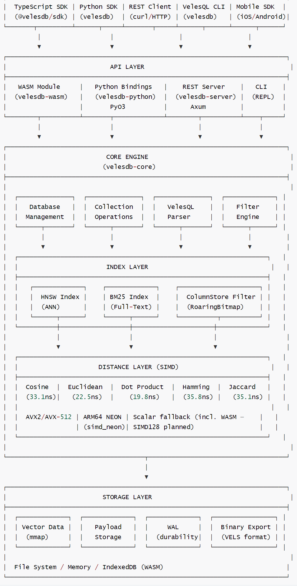
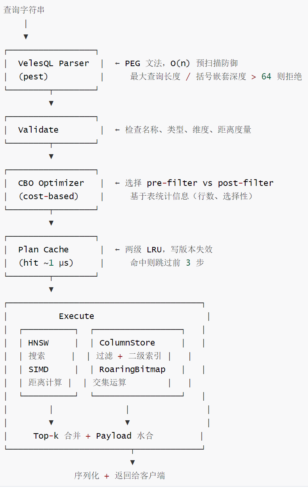
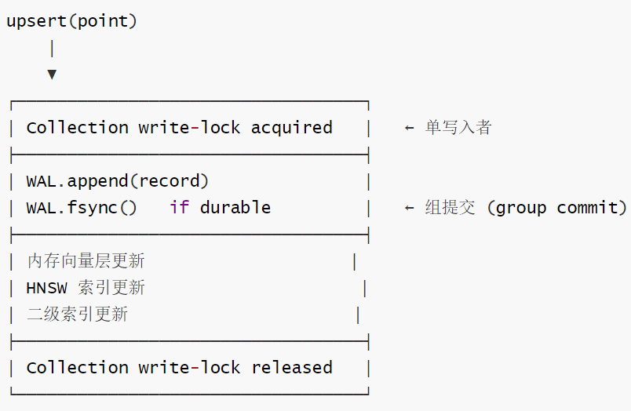
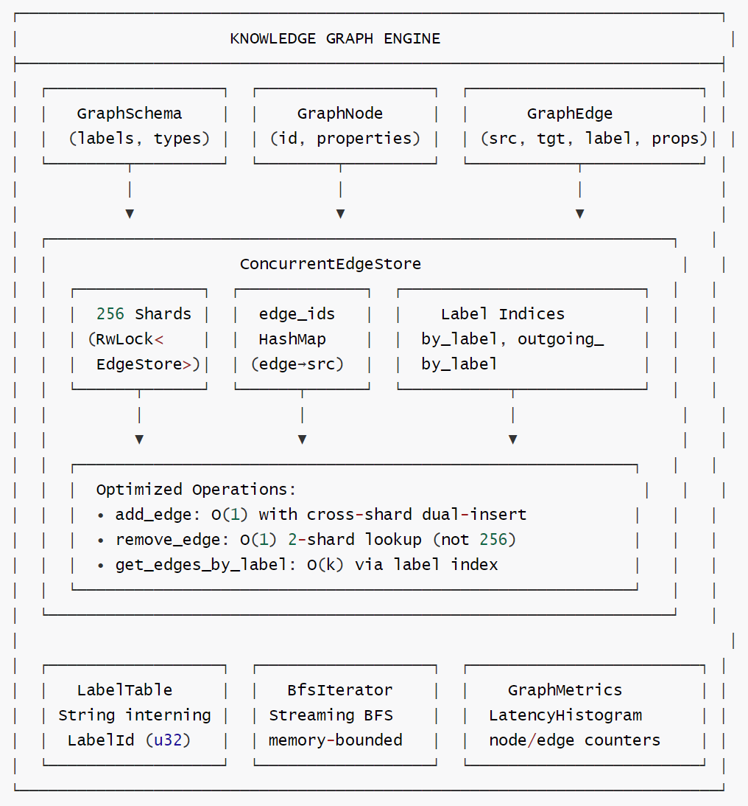
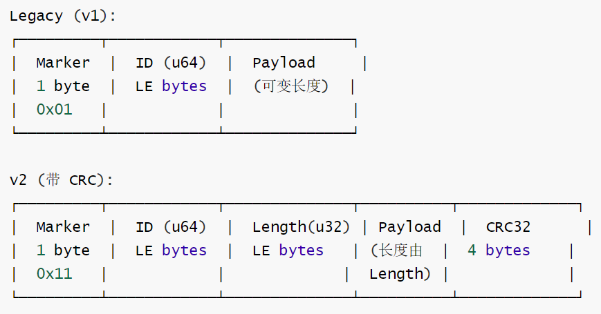
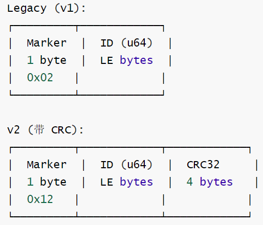
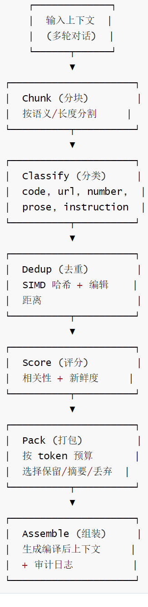

# VelesDB 深度解读 —— 融合向量、图与列存的端侧 AI 记忆引擎

# VelesDB 深度解读 —— 融合向量、图与列存的端侧 AI 记忆引擎

目录

* [VelesDB 深度解读 —— 融合向量、图与列存的端侧 AI 记忆引擎](#velesdb-深度解读--融合向量图与列存的端侧-ai-记忆引擎)
  + [0x00 概要：VelesDB 是什么](#0x00-概要velesdb-是什么)
  + [0x01 总论](#0x01-总论)
    - [1.1 面对的难点与核心冲突](#11-面对的难点与核心冲突)
    - [1.2 如何解决这些难点](#12-如何解决这些难点)
    - [1.3 本项目的特色](#13-本项目的特色)
    - [1.4 三种视角解读](#14-三种视角解读)
      * [给 12 岁的孩子讲](#给-12-岁的孩子讲)
      * [给半专业人士讲](#给半专业人士讲)
      * [给专业人士讲](#给专业人士讲)
  + [0x02 系统总体架构](#0x02-系统总体架构)
    - [2.1 基础架构](#21-基础架构)
    - [2.2 模块依赖](#22-模块依赖)
    - [2.3 数据流程](#23-数据流程)
      * [查询路径（以 `SELECT * FROM docs NEAR $vec WHERE date > '2024-01-01' LIMIT 10` 为例）](#查询路径以-select--from-docs-near-vec-where-date--2024-01-01-limit-10-为例)
      * [写入路径](#写入路径)
    - [2.4 核心组件详细说明](#24-核心组件详细说明)
      * [CBO 如何自动决定执行策略](#cbo-如何自动决定执行策略)
      * [SIMD 运行时 CPU 检测](#simd-运行时-cpu-检测)
      * [确定性上下文编译器的设计思路与实现](#确定性上下文编译器的设计思路与实现)
      * [验证：类型、维度、距离度量](#验证类型维度距离度量)
      * [MCP 记忆服务器的实现](#mcp-记忆服务器的实现)
      * [为什么要用快照 (Snapshot)](#为什么要用快照-snapshot)
    - [2.5 历史发展脉络](#25-历史发展脉络)
      * [业界发展脉络（VelesDB 在什么背景下产生）](#业界发展脉络velesdb-在什么背景下产生)
      * [自身发展历程](#自身发展历程)
      * [从零构建](#从零构建)
  + [0x03 关键代码与架构（伪代码）](#0x03-关键代码与架构伪代码)
    - [3.1 完整查询执行路径](#31-完整查询执行路径)
    - [3.2 WAL 完整流程](#32-wal-完整流程)
    - [3.3 HNSW 插入与搜索（简化）](#33-hnsw-插入与搜索简化)
    - [3.4 上下文编译器流水线（简化）](#34-上下文编译器流水线简化)
  + [0x04 后续工作、平行研究](#0x04-后续工作平行研究)
    - [4.1 论文基础](#41-论文基础)
    - [4.2 平行研究与竞争格局](#42-平行研究与竞争格局)
    - [4.3 优点](#43-优点)
    - [4.4 潜在问题](#44-潜在问题)
    - [4.5 改进方向](#45-改进方向)
* [附录](#附录)
  + [附录 A HNSW 实现深度解读](#附录-a-hnsw-实现深度解读)
    - [A.1 背景：为什么需要 HNSW](#a1-背景为什么需要-hnsw)
    - [A.2 VelesDB 中 HNSW 的实现特色](#a2-velesdb-中-hnsw-的实现特色)
      * [双后端架构](#双后端架构)
      * [SIMD 距离引擎：`CachedSimdDistance`](#simd-距离引擎cachedsimddistance)
      * [搜索质量 (SearchQuality)](#搜索质量-searchquality)
      * [软件流水线 (Software Pipelining)](#软件流水线-software-pipelining)
      * [PDX 块列存布局](#pdx-块列存布局)
      * [VAMANA 多样化邻接选择](#vamana-多样化邻接选择)
      * [VAMANA 多样性的理论依据](#vamana-多样性的理论依据)
      * [图重排序 (Graph Reordering)](#图重排序-graph-reordering)
      * [AutoTune 自适应 ef 参数](#autotune-自适应-ef-参数)
    - [A.3 HNSW 工程 Tricks 总结](#a3-hnsw-工程-tricks-总结)
  + [附录B 图引擎实现深度解读](#附录b-图引擎实现深度解读)
    - [B.1 总体架构](#b1-总体架构)
    - [B.2 图结构的核心：EdgeStore + CSR Snapshot](#b2-图结构的核心edgestore--csr-snapshot)
      * [边的存储](#边的存储)
      * [CSR 快照：零拷贝遍历](#csr-快照零拷贝遍历)
    - [B.3 BFS/DFS 遍历](#b3-bfsdfs-遍历)
      * [CSR 上的 BFS（核心路径）](#csr-上的-bfs核心路径)
      * [端上优化策略（性能、功耗和内存）](#端上优化策略性能功耗和内存)
    - [B.4 图在记忆服务中的应用](#b4-图在记忆服务中的应用)
    - [B.5 `why()` 的实际应用场景](#b5-why-的实际应用场景)
    - [B.6 知识图谱](#b6-知识图谱)
  + [附录C. WAL 实现深度解读](#附录c-wal-实现深度解读)
    - [C.1 设计目标](#c1-设计目标)
    - [C.2 WAL 条目格式](#c2-wal-条目格式)
      * [存储条目 (Store Entry)](#存储条目-store-entry)
      * [删除条目 (Delete Entry)](#删除条目-delete-entry)
    - [C.3 组提交 (Group Commit) 批处理](#c3-组提交-group-commit-批处理)
    - [C.4 Torn-tail 检测与 CRC 策略](#c4-torn-tail-检测与-crc-策略)
    - [C.5 WAL 持久化策略](#c5-wal-持久化策略)
    - [C.6 WAL 回放与三遍合并](#c6-wal-回放与三遍合并)
  + [附录D. 列存储 (ColumnStore) 深度解读](#附录d-列存储-columnstore-深度解读)
    - [D.1 设计目标](#d1-设计目标)
    - [D.2 核心设计](#d2-核心设计)
    - [D.3 性能对比](#d3-性能对比)
    - [D.4 字符串驻留 (Intern) 机制](#d4-字符串驻留-intern-机制)
  + [附录E. Agent 记忆与上下文编译器](#附录e-agent-记忆与上下文编译器)
    - [E.1 MemoryService 架构](#e1-memoryservice-架构)
    - [E.2 为什么 (why) 的工作机制](#e2-为什么-why-的工作机制)
    - [E.3 确定性上下文编译器](#e3-确定性上下文编译器)
  + [附录F. 参数设置与工程技巧大全](#附录f-参数设置与工程技巧大全)
    - [F.1 HNSW 参数](#f1-hnsw-参数)
    - [F.2 WAL 参数](#f2-wal-参数)
    - [F.3 搜索配置](#f3-搜索配置)
    - [F.4 列存储配置](#f4-列存储配置)
    - [F.5 工程技巧合集](#f5-工程技巧合集)
* [0xFF 参考](#0xff-参考)

---

## 0x00 概要：VelesDB 是什么

一句话：VelesDB 是一个约 10 MB 的单一二进制，将向量检索（HNSW）、图关系引擎（节点 + 边 + 遍历）和类型化列存储融合在同一个地址空间，对外暴露一套 SQL 风格查询语言（VelesQL），并在此之上构建了可审计的 AI Agent 记忆层和确定性上下文编译器。

**项目精华 / 特性一览：**

| 维度 | 核心亮点 |
| --- | --- |
| **融合架构** | 向量 + 图 + 列存三个引擎共享同一地址空间，无需三套系统 + 胶水代码 |
| **Agent 记忆** | `why()` 方法通过图遍历追溯召回结果的证据链路，每次压缩决策均记录规则 ID、原因和风险等级 |
| **确定性上下文编译器** | 无 LLM、无网络调用，相同输入永远产生相同输出，实测节省 82.5% 输入 token、21.9% 真实账单 |
| **本地优先** | 默认不进云、不需要 API Key，空气隔离可用，符合欧盟 AI 法案可解释性要求 |
| **极速向量检索** | 端到端 p50 450µs（10K/384D，WAL ON，recall ≥ 96%） |
| **全平台部署** | Linux/macOS/Windows/iOS/Android/WASM/浏览器，单一代码库 |
| **全栈 SIMD** | AVX-512 / AVX2 / NEON / 标量回退，运行时 SIMD 派发 |
| **学术级优化** | 集成了软件流水线（arXiv:2505.07621）、RaBitQ（arXiv:2405.12497）、PDX 布局（arXiv:2503.04422）等六篇顶会 / 顶刊技术的工程化实现 |

---

## 0x01 总论

### 1.1 面对的难点与核心冲突

现代 AI 应用（RAG、Agent 记忆、知识图谱）的需求本质上是**三重查询**：

> "找出语义上最相似的文件，作者是我团队的工程师，文件日期在 2024 年 Q1 之后，且源代码仓库在白名单内。"

这需要三样东西同时工作：

1. **向量引擎** —— 回答"哪些内容感觉接近"
2. **图引擎** —— 回答"谁和谁有什么关系"
3. **列存引擎** —— 回答"属性的精确值是多少"

**核心冲突在于**：传统的做法是将这三个引擎部署为三个独立的系统（比如 pgvector + Neo4j + PostgreSQL），然后用手写的胶水代码做 Join。这样做的代价是：

* **三次网络跳转**、三套缓存、三种故障模式
* **没有一个全局优化器**：无法判断是先做向量过滤还是先做图遍历
* **Agent 记忆无法追溯**：向量召回只能告诉你"这个结果看起来像"，不能告诉你"为什么是它"
* **SaaS 依赖**：大多数方案需要云服务、API Key、网络连接
* **Token 浪费**：Agent 的上下文窗口被大量冗余信息填满

VelesDB 的解决思路非常直接：**把三个引擎放进同一个进程空间，让它们共享一个查询规划器、一个缓存层、一个存储层。**

### 1.2 如何解决这些难点

VelesDB 的解决方案分四个层次：

**第一层 —— 三合一引擎架构：** 向量索引（HNSW）、图引擎（CSR 快照 + BFS/DFS）、列存储（类型化列 + RoaringBitmap 二级索引）同属一个进程。VelesQL 查询规划器（基于代价的优化器 CBO）可以同时看到三个引擎的统计信息，从而选择最优执行策略（例如先做向量近邻搜索再过滤，或先做图遍历再向量匹配）。

**第二层 —— 可审计的记忆层：** `MemoryService` 在基础的三引擎之上封装了 `remember()`、`recall()`、`why()` 等高层接口。每次 `remember()` 不仅存入向量表示，还会自动提取实体关系并构建图连接。`why()` 方法从最佳语义匹配出发，**沿着图的边行走**，返回答案背后的完整证据路径。

**第三层 —— 确定性上下文编译器：** `compile_context()` 接收 Agent 的累积上下文和一个 token 预算，输出一份更小的版本，同时**记录每一条保留/摘要/丢弃决策**（规则 ID + 理由 + 风险等级）。因为编译过程是完全确定性的，`explain_compilation()` 可以随时重新推导出这些决策，不需要额外存储。

**第四层 —— 本地优先的持久化：** 整个数据库就是一个目录。WAL（Write-Ahead Log）保证崩溃安全，mmap 向量文件实现零拷贝读取，快照（snapshot）加速冷启动。全流程不需要网络。

### 1.3 本项目的特色

1. **单一二进制** —— 6~13 MB 的二进制包含三个完整引擎，是经过 SIFT1M 标准评测的生产级实现
2. **学术 rigor 的工程落地** —— 集成了 6 篇顶会论文的技术并全部优化到生产级别：软件流水线 (arXiv:2505.07621)、RaBitQ (arXiv:2405.12497)、PDX 布局 (arXiv:2503.04422)、VAMANA / DiskANN、HNSW 图重排序、SIMD 距离核
3. **记忆可解释性** —— 不是"黑盒向量召回"，而是"带证据路径的图回忆"。
4. **Token 经济的数学基础** —— 确定性上下文编译器不是简单的"删减"，而是有严格预算、可逆、可审计的压缩管道
5. **完整生态** —— Python / TypeScript / Rust / WASM / MCP / REST 54 个端点，手机端 (iOS/Android) 和桌面端 (Tauri) 全覆盖

### 1.4 三种视角解读

#### 给 12 岁的孩子讲

想象你有一个超级日记本。普通的日记本只能按日期查找内容，但 VelesDB 的日记本有三种魔法：

* **"感觉"魔法**：你可以说"找出感觉像'苹果'的东西"，它不仅能找到"苹果"这个词，还能找到"梨"、"水果"这些意思相近的东西。这是因为它把每个词变成了一串数字坐标，意思越接近，坐标就离得越近。
* **"关系"魔法**：日记本记住了谁和谁有关系。比如你写了"小明给了小红一个苹果"，它就知道"小明"和"小红"之间有"给予"的关系。当你问"为什么小红会有苹果？"时，它能顺着关系链找出答案。
* **"精确"魔法**：如果你想找"2024 年 1 月以后的日记"，它能非常精确地过滤出来，比翻遍整本日记快一百多倍。

更酷的是，这三种魔法不是靠三个不同的本子做的 —— 它们全在一个本子里。而且这个本子不联网，完全属于你，AI 也不能偷看。

#### 给半专业人士讲

想象你在做一个 AI Agent，需要它记住大量信息并能理解其中的关联。传统的做法是：

1. 用向量数据库（如 Chroma/Qdrant）做语义搜索
2. 用图数据库（如 Neo4j）做关系查询
3. 用关系数据库（如 PostgreSQL）做精确过滤
4. 手写代码将它们粘合在一起
5. 再部署一个 embedding 服务做向量化

VelesDB 把 1、2、3 合并成一个进程内库。你的代码不再需要跨网络调三个服务，而只需发一条 VelesQL 查询：

```
MATCH (doc:Document)-[:AUTHORED_BY]->(author:Person)
WHERE similarity(doc.embedding, $question) > 0.8
  AND author.department = 'Engineering'
RETURN author.name, doc.title
ORDER BY similarity() DESC LIMIT 5
```

在查询规划层面，VelesDB 的代价优化器（CBO）会自动决定：应该先做向量近邻搜索（NEAR）然后应用图过滤，还是先走图遍历再在结果集上做向量匹配？它根据每张表的统计信息（行数、选择性）做出选择。

在记忆层面，`MemoryService` 把信息存为图中的节点和边。`why()` 从语义匹配到的节点出发，沿着边（比如 `because`、`mentions`）进行 BFS 遍历，返回的不仅仅是"最相关的信息"，还有"为什么它们相关"的完整证据链：

```
查询: "为什么 Robert 的航班订了过道座位?"
  → 语义匹配: "给 Robert 的航班订了过道座位" (score: 0.92)
     └─ 图遍历 (because) →
        "Robert 正在从膝盖手术中恢复" (score: 0.71)
```

这在传统纯向量系统中是不可能的 —— 因为"膝盖手术"和"过道座位"之间的词汇相似度几乎为零。

#### 给专业人士讲

VelesDB 是一个本地优先的嵌入式计算引擎，核心架构如下：

**存储层：** 每集合（Collection）一个目录，包含：

* `vectors.mmap` —— 内存映射的原始浮点向量数组，零拷贝读取
* `payload.db` —— JSON payload 持久化
* `wal.log` —— 追加写的 WAL，v2 格式带 CRC32 校验和，支持 torn-tail 检测
* `index.hnsw` —— 序列化 HNSW 图结构，启动时三遍合并（向量存储 ↔ HNSW 图 ↔ WAL）
* `bm25/` —— BM25 全文倒排索引
* `secondary/` —— 类型化列二级索引（RoaringBitmap）
* `snapshot.<gen>` —— 周期性快照，加速冷启动

**并发模型：** 核心原则是"无 `std::sync` 锁原语"，全部使用 `parking_lot::RwLock`/`Mutex`。每个集合默认为单写入者（WAL 串行化），读取者（`RwLock` 读锁）永不互相阻塞。

**查询执行：** VelesQL 查询经历 5 个阶段：解析（PEG 文法 + O(n) 预扫描防御 DoS）→ 验证（类型、维度、距离度量）→ 规划（CBO，选择 pre-filter 或 post-filter 策略）→ 缓存（两级 LRU，写版本失效，命中时 ~1µs）→ 执行（HNSW 搜索 + SIMD 距离核 + RoaringBitmap 过滤 + payload 水合）。

**SIMD 架构：** 运行时通过 `simd_dispatch.rs` 检测 CPU 能力，选择 AVX-512 / AVX2 / NEON / 标量回退。WASM 构建使用标量回退（SIMD128 计划中）。五种距离度量全部有 SIMD 加速：Cosine、Euclidean、Dot Product、Hamming、Jaccard。典型性能（768D，AVX2）：Cosine 33ns、Euclidean 20ns、Dot Product 22ns。

---

## 0x02 系统总体架构

### 2.1 基础架构

VelesDB 是一个多层架构：



### 2.2 模块依赖

工作空间 10 个 crate，严格单向依赖：

```
velesdb-core ──→ velesdb-server
             ├──→ velesdb-python   (PyO3)
             ├──→ velesdb-cli      (REPL)
             ├──→ velesdb-wasm     (浏览器)
             ├──→ velesdb-mobile   (iOS/Android, UniFFI)
             ├──→ velesdb-migrate  (导入工具)
             ├──→ tauri-plugin-velesdb (桌面)
             ├──→ velesdb-memory   (MCP 记忆服务器)
             └──→ velesdb-node     (Node.js, 仅依赖记忆层)
```

`velesdb-core` 是唯一包含非平凡量 `unsafe` 的 crate（SIMD intrinsics、mmap、FFI）。所有 `unsafe` 必须有 `// SAFETY:` 注释，由 CI 脚本 `scripts/verify_unsafe_safety_template.py` 强制执行。

### 2.3 数据流程

#### 查询路径（以 `SELECT * FROM docs NEAR $vec WHERE date > '2024-01-01' LIMIT 10` 为例）



#### 写入路径



### 2.4 核心组件详细说明

| 组件 | 路径 | 核心功能 |
| --- | --- | --- |
| `NativeHnswIndex` | `index/hnsw/native_index.rs` | 原生 HNSW：插入/搜索/删除/批量操作，支持 Standard + RaBitQ 双后端 |
| `NativeHnswInner` | `index/hnsw/native_inner.rs` | HNSW 内部逻辑，SIMD 距离引擎，GPU offload 门控 |
| `WalEntry` | `storage/wal_entry.rs` | WAL 条目解析，CRC32 校验，torn-tail 检测 |
| `WalBatcher` | `storage/wal_batcher.rs` | 组提交 (group commit) 批处理器，计数触发 flush |
| `MemoryService` | `velesdb-memory/src/service.rs` | Agent 记忆服务：remember/recall/why/feedback |
| `GraphEdge` | `collection/graph/edge.rs` | 图边：有向、类型化、带属性 |
| `CsrSnapshot` | `collection/graph/csr_snapshot.rs` | 零拷贝 CSR 快照，邻接矩阵压缩 |
| `ColumnStore` | `column_store/mod.rs` | 列存储：类型化列、字符串驻留、主键 |
| `ColumnTypes` | `column_store/types.rs` | 列类型：Int/Float/String/Bool/Array/GeoPoint |
| `VelesQL Planner` | `velesql/planner.rs` | 查询规划器：CBO、VectorFirst/GraphFirst/Parallel 策略 |
| `MmapStore` | `storage/mmap.rs` | 内存映射向量存储，分片索引，WAL 回放 |

#### CBO 如何自动决定执行策略

核心代码在 `velesql/planner.rs:134-183`，`choose_strategy_with_cbo()`。

**输入**：`CollectionStats`（表统计信息）+ 可选的 `Condition`（过滤条件）+ `k`。

**三步走**：

**Step 1 — 估计过滤选择性 (selectivity)**：`estimate_filter_selectivity()` 调用 `CostEstimator::estimate_condition_selectivity()`。如果条件是 `department = 'Engineering'`，而该值占总行数的 5%，则 selectivity = 0.05。范围条件（如 `date > '2024-01-01'`）基于直方图估算。

**Step 2 — 计算三种策略的代价**（单位是抽象成本单位，可校准为微秒）：

```
VectorFirst:  vector_cost + (candidate_rows * filter_cost * 1.5)
  // 先 HNSW 搜出 k/selectivity 个候选，再逐条过滤
  // over_fetch = (1/selectivity).clamp(1, 64)
  // 乘 1.5 惩罚因子是因为需要过取 + 内存水合

GraphFirst:   filter_cost + (vector_cost * filter_cost.io / 100)
  // 先全量扫描过滤出匹配行，再对匹配行做 HNSW
  // 当 selectivity 极低 (<1%) 时 filter_cost 小，但后续向量搜索量也小

Parallel:     max(vector_cost, filter_cost) + 25
  // rayoon::join 并行执行两边，取最大值 + 25µs 合并开销
```

**Step 3 — 选最小代价**：

```
let candidates = [
    (VectorFirst, vector_first),
    (GraphFirst,  graph_first),
    (Parallel,    parallel),
];
candidates.iter().min_by(|a, b| a.1.total_cmp(&b.1))
```

**校准反馈回路**：`CboFeedbackLoop` 记录了每次查询后实际的 wall-clock 耗时。用 EMA（α=0.05）平滑调整 `ms_per_cost_unit`，经过 `MIN_SAMPLES` 次观测后自动校准。这意味着 CBO 会"学到"实际硬件的特性——在一台慢 I/O 机器上，I/O 权重会自然上升，GraphFirst 策略会变得更少见。

**默认阈值（当 stats 不可用时）**：<1% selectivity → GraphFirst；>50% selectivity → VectorFirst；中间 → Parallel。

---

#### SIMD 运行时 CPU 检测

`simd_dispatch.rs:86-106`：

```
pub fn detect() -> Self {
    #[cfg(target_arch = "x86_64")]
    {
        Self {
            avx512f: is_x86_feature_detected!("avx512f"),
            avx512_popcnt: is_x86_feature_detected!("avx512vpopcntdq"),
            avx2: is_x86_feature_detected!("avx2"),
            popcnt: is_x86_feature_detected!("popcnt"),
        }
    }
    #[cfg(not(target_arch = "x86_64"))]
    {
        // ARM: NEON 由 rustc 的 target_feature 编译时决定
        // WASM: 始终标量回退（SIMD128 计划中）
        Self { avx512f: false, avx2: false, ... }
    }
}
```

这里有个关键的设计细节：**实际的 SIMD 派发不是在运行时函数指针，而是编译时多层 `#[target_feature]` 函数 + 链接器解析**。`simd_native/` 目录下的代码通过 Rust 的 `cfg(target_feature)` 编译出多个版本的函数（AVX-512 版本、AVX2 版本、NEON 版本、标量版本），然后在 `cargo build` 时根据编译目标选择。

`simd_dispatch.rs` 的 `*_dispatched()` 函数本质上是 `simd_native::*_native()` 的直接转发，而 `simd_native` 内部用了 Rust 的 `std::simd`（portable SIMD）或 `core_arch` 内建函数，运行时 CPUID 检测在实际距离计算中由 `target_feature` 门控 + `ifunc` 风格的多版本代码处理。

注意 `simd_features_info()` 是**暴露给用户做诊断用的**（REST API `/health` 返回当前 CPU 的 SIMD 能力），不是运行时派发的核心机制。

---

#### 确定性上下文编译器的设计思路与实现

**设计思路**：核心洞察是"Agent 上下文中大部分信息是冗余的，但你不能用 LLM 来压缩，因为那会引入成本和不可预测性"。解决方案是：用**规则驱动的确定性管道**替代 LLM 压缩。

**实现架构**（6 阶段流水线，每个阶段纯函数式，无副作用）：

```
输入文本
    │
    ▼ Chunker ── 按策略分块：段落分界 / 512 token / 语义边界
    │
    ▼ Classifier ── 对每块分类：code | url | number | prose | instruction
    │              (代码块、URL、数字、自然语言、指令各有不同保留策略)
    │
    ▼ Deduplicator ── SIMD 哈希（CityHash64）检测完全重复
    │                 编辑距离检测近似重复（阈值可配置）
    │
    ▼ Scorer ── 按相关性和新鲜度评分，与 token 预算进行优化
    │
    ▼ Picker ── 在 token 预算下做背包问题求解：
    │           keep (保留) | abstract (摘要保持 URL/数字不变) | drop (替换为句柄)
    │
    ▼ Assembler ── 组装最终输出 + 审计日志
```

**确定性保证**：每个阶段的输入和参数完全决定输出——没有随机种子、没有线程调度影响、没有外部 API 调用。具体来说：

* `Chunker`：按固定窗口 + 边界规则分割，相同文本→相同分块
* `Classifier`：基于正则 + 语法规则的分类器，不是 ML 模型
* `Deduplicator`：CityHash64 是确定性的哈希函数
* `Scorer` / `Picker`：贪心算法，相同输入产生相同输出

`explain_compilation()` 在同一个输入上**重新运行**整个管道（不是查表），因为管道的确定性保证结果完全一样，所以不需要额外存储。这也意味着如果有用户修改了管道的参数（比如调整了 Dedup 的编辑距离阈值），`explain_compilation()` 会自动反映新的参数下的决策。

**可逆性**：被 drop 的内容不直接丢失，而是按内容哈希存储在 `ctx://source/` 下。`retrieve_context_source()` 按 hash 取回原始字节。这种内容寻址的机制保证了：只要两个输入片段完全相同，它们共享同一个 `ctx://source/` 句柄——这也是为什么前缀缓存（prompt caching）可以命中。

---

#### 验证：类型、维度、距离度量

在 `validation.rs`（VelesQL 层面）和 `database/` 层（运行时层面）两个位置实现。

**VelesQL 层面的验证**（`validation.rs`）：

```
fn validate_query(db: &Database, query: &Query) -> Result<()> {
    for select in &query.select_components {
        // 1. 检查集合是否存在
        let collection = db.catalog.get(&select.from)?;

        // 2. 检查 NEAR 向量的维度是否匹配
        match &select.vector_search {
            Some(VectorSearch { query_vector, .. }) => {
                let dim = collection.config.dimension;
                if query_vector.len() != dim {
                    return Err(ValidationError::dimension_mismatch(dim, query_vector.len()));
                }
            }
            None => {}
        }

        // 3. 检查距离度量是否匹配
        // 集合创建时指定了 metric（cosine/euclidean/dot/hamming/jaccard）
        // 搜索时不需要指定 metric，但需要在类型系统中保持一致

        // 4. 检查列存条件中的列名和类型是否存在
        for condition in &select.where_clause {
            validate_condition(collection, condition)?;
        }
    }

    Ok(())
}
```

**运行时层面的验证**在 `native_index.rs:205`：

```
fn insert(&self, id: u64, vector: &[f32]) -> Result<()> {
    // 在 upsert_mapping 之前验证维度
    // 设计原因：如果向量维度不对就提前拒绝，避免先破坏旧的 mapping
    validate_dimension_match(self.dimension, vector.len())?;
    // ...
}
```

`validate_dimension_match` 在 `validation.rs`（core 根目录）中是一个简单朴素的 assert：

```
pub(crate) fn validate_dimension_match(expected: usize, actual: usize) -> Result<()> {
    if expected != actual {
        return Err(Error::DimensionMismatch { expected, actual });
    }
    Ok(())
}
```

---

#### MCP 记忆服务器的实现

VelesDB 的 MCP 实现依赖 `rmcp` crate（Rust MCP 协议实现），位于 `velesdb-memory/src/mcp/`。

**架构层级**：

```
MCP Client (Claude Desktop / Claude Code / Windsurf...)
    │
    ▼ stdio (子进程) 或 HTTP (多客户端 daemon)
    │
    ▼ mcp.rs ── MCP 协议处理层 (rmcp)
    │   - 工具定义: tools()
    │   - 工具调用: call_tool()
    │   - 资源暴露: resources()
    │
    ▼ service.rs ── MemoryService 领域逻辑
    │
    ▼ velesdb-core ── 底层引擎
```

**工具注册**：MCP 协议要求服务器通过 `tools()` 方法声明可用工具。`velesdb-memory` 注册为 11 个工具：

```
// 简化伪代码
fn tools() -> Vec<MCPTool> {
    vec![
        MCPTool::new("remember",     "Store a fact with optional links"),
        MCPTool::new("recall",       "Semantic search across memories"),
        MCPTool::new("recall_where",  "Semantic search filtered by metadata"),
        MCPTool::new("recall_fused", "Vector + graph fused retrieval"),
        MCPTool::new("relate",       "Create a typed edge between memories"),
        MCPTool::new("forget",       "Delete a memory"),
        MCPTool::new("why",          "Recall with multi-hop evidence"),
        MCPTool::new("feedback",     "Reinforce or penalize"),
        MCPTool::new("remember_extracted", "Extract facts from text + auto-wire"),
        MCPTool::new("compile_context",     "Deterministic context compression"),
        MCPTool::new("explain_compilation", "Audit log of context decisions"),
    ]
}
```

**双传输模式**：

1. **stdio**（默认）：每个 MCP 客户端启动一个 `velesdb-memory` 子进程，通过 stdin/stdout 走 JSON-RPC。适合单客户端场景。
2. **HTTP**（`--http` 标志）：`velesdb-memory` 作为本地 daemon 运行（默认 HTTPS，自生成 local CA），多个 MCP 客户端共享。通过 `mcp.rs` 内部的 SSE 或 streamable HTTP 传输实现。

**MCP 侵入点**：VelesDB 还提供了**用户级 MCP 技能**（`.claude/skills/` 目录下的 `velesdb-context-optimizer` skill），这是一个纯 prompt 配置，不在代码中而通过 MCP 工具链使用上下文编译器的功能——包括"什么情况下不应该压缩"。

---

#### 为什么要用快照 (Snapshot)

VelesDB 使用快照有两个核心原因：

**1. 加速冷启动**：没有快照时，启动流程是：

```
读取 vectors.mmap → 重建 HNSW 图 → 回放全量 WAL
```

对于 100 万向量、每条向量对应一个 WAL 条目的场景，全量 WAL 回放可能需要数秒甚至数分钟。快照的作用是提供一个"检查点"：

```
读取 snapshot.gen_42 → 读取 vectors.mmap → 仅回放 gen_42 之后的 WAL 条目
```

通常后一小段 WAL 只有几十到几百条，回放成本可忽略。

**2. 崩溃一致性的简化**：WAL + 快照组合提供了"时间点恢复"能力。如果系统在写入 snapshot 的中间崩溃，启动时检测到不完整的快照文件就跳过它，改用上一个完整的 snapshot + 全量 WAL 回放。这比在每个 WAL 条目上维护版本号简单得多。

**3. 增量备份**：snapshot 文件 + WAL 的组合构成了崩溃恢复+时间点恢复的基础。存储备份只需要定期拷贝 snapshot + 递增 WAL 即可，不需要对向量文件做特殊处理。

**快照格式**：`snapshot.` 文件包含序列化的 HNSW 图结构（节点、层、邻接列表）+ 一个 gen 号（单调递增整数）。文件开头有 magic byte 和 CRC32 校验，用于检测写入是否完整。

### 2.5 历史发展脉络

#### 业界发展脉络（VelesDB 在什么背景下产生）

```
┌──────────────────────────────────────────────────────────────┐
│  2016-2019: 第一波向量数据库浪潮                              │
│  - Malkov & Yashunin 发表 HNSW (2016)                        │
│  - Johnson et al. 发表 FAISS (2017, Meta)                    │
│  - 业界痛点：纯向量，无结构化过滤，部署在 GPU 集群             │
├──────────────────────────────────────────────────────────────┤
│  2020-2022: Agent / LLM 驱动的新型存储需求                    │
│  - GPT-3 引爆 RAG 范式，"向量检索 + LLM" 成为标配             │
│  - Qdrant (Rust, 2020)、Chroma (Python, 2022)、               │
│    Weaviate (Go, 2020) 相继出现                              │
│  - 新痛点：Agent 需要的不只是"相似度"，而是"可解释的关联"     │
│  - pgvector (2021) 把向量塞进 PG，但代价是性能和架构复杂度     │
├──────────────────────────────────────────────────────────────┤
│  2023-2024: Agent 记忆的爆发与分裂                            │
│  - Mem0、Zep、Letta 等 Agent 记忆框架涌现                     │
│  - 各显神通但各搞一套：向量召回 + 时间线 + 手动规则            │
│  - 业界共识：Agent 需要"记忆"而不是"搜索"，但怎么实现没共识    │
│  - 另一个关键变量：欧盟 AI 法案（2024 年通过），可解释性         │
│    和数据主权成为合规要求                                     │
├──────────────────────────────────────────────────────────────┤
│  2024-2025: 学术 → 工程闭环的转折点                           │
│  - RaBitQ (2024)、VSAG (2025)、Software Pipelining (2025)     │
│    等论文提供了新工具                                         │
│  - 端侧推理爆发（Llama.cpp, Ollama, MLX）→ 推理在本地，    │
│    数据也在本地的范式成为可能                                 │
│  - MCP (Model Context Protocol) 标准由 Anthropic 提出，        │
│    为 Agent 工具互操作提供了统一接口                           │
├──────────────────────────────────────────────────────────────┤
│  2025-2026: VelesDB 的出现                                    │
│  - 三位一体：向量 + 图 + 列存在单一进程中                      │
│  - 六篇论文工程化落地（不是学术玩具，是 SIFT1M 验证过的生产级实现）│
│  - why() 可审计召回 + 确定性上下文编译器（没有同行）          │
│  - 全平台：WASM ~674KB、iOS/Android、桌面、服务器              │
│  - MCP 原生支持，Agent 生态一体集成                            │
└──────────────────────────────────────────────────────────────┘
```

VelesDB 出现的历史坐标是：**向量数据库已成熟，Agent 记忆已成刚需，AI 法案要求可解释性，MCP 提供了标准化接口——但没人把这三样东西做到一个二进制里，还加入了学术级优化和确定性编译器。**

#### 自身发展历程

1. **v0.x (2025)** —— 最初的向量检索原型，依赖外部 HNSW 库（`hnsw_rs`），单一集合，基本 REST API
2. **v1.0 (2025 H2)** —— 原生 HNSW 实现替代外部依赖，引入图引擎（`GraphCollection`）和列存（`ColumnStore`），VelesQL 诞生
3. **v1.8 (2026 Q1)** —— 六项学术优化落地：软件流水线、RaBitQ 32x 压缩、PDX 布局、SmallVec 批量距离、AutoTune、Trigram SIMD 指纹
4. **v2.x (2026 Q2)** —— WASM 支持、MCP 记忆服务器（`velesdb-memory`）、上下文编译器
5. **v3.x (2026 Q3)** —— `DatabaseObserver` 安全钩子、GPU pipeline（wgpu compute shader）、多查询融合
6. **v4.2.0 (当前)** —— 10 个 crate、54 个 REST 端点、全平台（iOS/Android/WASM/桌面）、确定性上下文编译器成熟、RL 反馈循环

#### 从零构建

**VelesDB = 从零构建的完整数据库引擎**（存储层 + 索引 + 查询规划器 + 并发控制全手写），唯一的外来引擎是早期 HNSW 借用 `hnsw_rs` 后被替换为自研。SQLite 和它没有任何关系——它的定位是向量/图/列存融合，SQLite 是通用的行式关系库，两者是不同物种。

对比参考：如果要用现有 DB 做，你会看到 `rusqlite` + `libsqlite3-sys` 依赖、SQL 语法由 SQLite 解析、存储层是 `sqlite3` 的 `.db` 文件。VelesDB 的 `wal.log`、`vectors.mmap`、`index.hnsw` 全是自定义二进制格式，parser 用的 `pest` PEG 也是自写文法。

## 0x03 关键代码与架构（伪代码）

### 3.1 完整查询执行路径

```
// 简化版的 VelesQL 查询执行
fn execute_query(db: &Database, query_str: &str, params: &QueryParams) -> Result<QueryResult> {
    // Phase 1: Parse (PEG)
    let ast = VelesqlParser::parse(query_str)?;

    // Phase 2: Validate
    let validated = ast.validate(&db.catalog)?;

    // Phase 3: Plan (CBO)
    let plan = CostBasedOptimizer::new(&db.stats)
        .build_plan(&validated)?;

    // Phase 4: Cache (LRU two-tier)
    let cache_key = CacheKey::from(&plan);
    if let Some(cached) = db.plan_cache.get(&cache_key) {
        return cached.execute(params);  // ~1µs hit
    }
    db.plan_cache.insert(cache_key, plan.clone());

    // Phase 5: Execute
    let results = match plan.strategy {
        Strategy::VectorFirst => {
            // 先向量搜索，再列存过滤
            let nearest = db.hnsw_index
                .search_with_quality(&params.vector, params.k * 2, params.quality);
            let filtered = db.column_store
                .filter(nearest, &plan.filters);
            db.payload_store.hydrate(filtered, params.limit)
        }
        Strategy::FilterFirst => {
            // 先列存过滤，再向量搜索
            let candidates = db.column_store
                .scan(&plan.filters);
            db.hnsw_index
                .search_in_set(&params.vector, &candidates, params.k)
        }
        Strategy::GraphFirst => {
            // 先图遍历，再向量搜索
            let graph_nodes = db.graph_collection
                .bfs_traverse_csr(params.start_node, &plan.traversal_config);
            let vectors = db.resolve_vectors(graph_nodes);
            db.hnsw_index.search_among(&params.vector, &vectors, params.k)
        }
        Strategy::Parallel => {
            // 并行执行后做 RRF 融合
            let (v, g) = rayon::join(|| { /* vector search */ }, || { /* graph BFS */ });
            ReciprocalRankFusion::fuse(v, g, plan.fusion_weight)
        }
    };

    Ok(results)
}
```

### 3.2 WAL 完整流程

```
// 写入路径
fn upsert_point(collection: &Collection, point: &Point) -> Result<()> {
    // 1. 获取写锁
    let _write_lock = collection.write_lock();

    // 2. 写入 WAL（先写日志）
    let wal_entry = serialize_store_entry(point.id, &point.payload);
    collection.wal_batcher.submit(&wal_entry, &mut collection.wal_writer)?;

    // 3. 更新向量索引
    collection.hnsw.insert(point.id, &point.vector)?;

    // 4. 更新列存
    collection.column_store.upsert(point.id, &point.metadata)?;

    // 5. 更新图（如果有点相关的边）
    if let Some(ref graph) = collection.graph {
        graph.sync_from_point(point)?;
    }

    Ok(())
}

// 读取路径
fn search_points(collection: &Collection, query: &SearchQuery) -> Vec<ScoredResult> {
    // 1. 获取读锁（不阻塞其他读取者）
    let _read_lock = collection.read_lock();

    // 2. 从 CSR 快照构建遍历上下文
    let csr = collection.graph.build_snapshot();

    // 3. HNSW 搜索（SIMD 加速）
    let candidates = collection.hnsw.search_with_quality(
        &query.vector, query.k, query.quality
    );

    // 4. 列存过滤（RoaringBitmap）
    let filtered = collection.column_store
        .filter_bitmap(&query.filters);

    // 5. 合并
    candidates.into_iter()
        .filter(|r| filtered.contains(r.id))
        .map(|r| hydrate_payload(collection, r))
        .collect()
}
```

### 3.3 HNSW 插入与搜索（简化）

```
/// HNSW 节点插入（简化版）
fn hnsw_insert(
    graph: &mut NativeHnsw,
    vector: &[f32],
    id: usize,
    params: &HnswParams,
) {
    // 1. 决定层级
    let level = random_level(params.multiplier);  // ~1/ln(M) 概率衰减

    // 2. 从顶层开始搜索，逐层下降
    let mut curr_node = graph.entry_point;

    for l in (level + 1..graph.max_level).rev() {
        curr_node = greedy_search(graph, vector, curr_node, l, 1).pop().unwrap();
    }

    // 3. 在 level..0 层构建双向连接
    let mut entry_points = Vec::new();
    for l in (0..=level).rev() {
        let candidates = greedy_search(graph, vector, curr_node, l, params.ef_construction);

        // VAMANA 多样化选择
        let neighbors = select_neighbors_diverse(&candidates, params.M, params.alpha);

        // 双向连接
        for neighbor in &neighbors {
            graph.add_edge(id, neighbor.id, l);
            graph.add_edge(neighbor.id, id, l);
            // 如果邻居超出最大连接度，修剪最远的边
            prune_excess_edges(graph, neighbor.id, l, params.M_max);
        }

        entry_points.push(candidates[0].id);
    }

    // 4. 更新入口点
    if level > graph.max_level {
        graph.entry_point = id;
        graph.max_level = level;
    }
}

/// HNSW 搜索（简化版）
fn hnsw_search(
    graph: &NativeHnsw,
    query: &[f32],
    k: usize,
    ef: usize,
) -> Vec<ScoredResult> {
    let mut candidates = BinaryHeap::new();  // 最大堆
    let mut result = FixedSizeMaxHeap::new(ef);  // 最小堆
    let mut visited = FxHashSet::default();

    let mut curr = graph.entry_point;
    candidates.push((f32::MAX, curr));
    visited.insert(curr);

    // 从顶层贪心下降
    for l in (1..=graph.max_level).rev() {
        curr = greedy_search(graph, query, curr, l, 1)[0];
    }

    // Layer 0 搜索
    candidates.clear();
    candidates.push((dist(query, graph.get_vector(curr)), curr));

    while let Some((d, node)) = candidates.pop() {
        // 软件流水线：预取邻居向量
        let neighbors = graph.get_neighbors(node, 0);
        let prefetch_dist = 4.min(neighbors.len());
        for &n in &neighbors[..prefetch_dist] {
            if !visited.contains(&n) {
                prefetch!(graph.get_vector_ptr(n));
            }
        }

        // 处理当前节点
        let furthest = result.peek().map(|r| r.distance).unwrap_or(f32::MAX);
        if d > furthest { break; }
        result.push(ScoredResult::new(node, d));

        // 处理预取 + 普通邻居
        for &n in &neighbors {
            if visited.insert(n) {
                let d = cached_simd_distance(query, graph.get_vector(n));
                candidates.push((d, n));
            }
        }
    }

    result.into_sorted_vec()[..k.min(result.len())].to_vec()
}
```

### 3.4 上下文编译器流水线（简化）

```
fn compile_context(input: &str, budget: TokenBudget) -> CompiledContext {
    let mut pipeline = ContextPipeline::new(budget);

    // 1. Chunk: 分割输入
    let chunks = Chunker::new()
        .with_strategies(&[ByParagraph, BySize(512), BySemantic])
        .chunk(input);

    // 2. Classify: 对每个块分类
    let classified: Vec<ClassifiedChunk> = chunks.into_iter()
        .map(|c| Classifier::from_content(&c.content))
        .collect();

    // 3. Dedup: 去重（SIMD 哈希 + 编辑距离）
    let deduped = Deduplicator::new()
        .with_simd_hasher(SimdCityHash64)
        .dedup(classified);

    // 4. Score: 按相关性和新鲜度评分
    let scored = deduped.into_iter()
        .map(|c| (c, Scorer::new().score(&c, &budget.context)))
        .collect();

    // 5. Pack: 按 token 预算打包
    let packed = Picker::new(budget)
        .pack(scored);

    // 6. Assemble: 生成输出 + 审计
    let mut decisions = Vec::new();
    let mut output = String::new();
    for item in packed {
        match item.action {
            Action::Keep => output.push_str(&item.content),
            Action::Abstract => {
                let summary = Abstractor::new().abstract_keeping_urls_numbers(&item.content);
                output.push_str(&summary);
            }
            Action::Drop => {
                // 生成可恢复句柄
                let handle = store_source(&item.content);
                output.push_str(&format!("[ctx://source/{handle}]"));
            }
        }
        decisions.push(item.to_decision_record());
    }

    CompiledContext {
        content: output,
        decisions,
        token_count: TokenCounter::count(&output),
    }
}
```

---

## 0x04 后续工作、平行研究

### 4.1 论文基础

VelesDB 的工程实现深度参考了以下学术论文：

| 论文 | 出处 | VelesDB 中的应用 |
| --- | --- | --- |
| Malkov & Yashunin, "HNSW" | arXiv:1603.09320 | 核心 ANN 算法 |
| Subramanya et al., "DiskANN" | arXiv:1907.05024 | VAMANA 多样化邻居选择 |
| Chen et al., "Graph Reordering" | NeurIPS 2022 | BFS 重排序降低缓存未命中 |
| Gao & Long, "RaBitQ" | arXiv:2405.12497 | 1-bit 量化 + 32x 压缩 |
| Xu et al., "VSAG" | arXiv:2503.17911 | Dual-Precision: int8 遍历 + f32 重排序 |
| Jiang et al., "Bang for the Buck" | arXiv:2505.07621 | 软件流水线预取 |
| Pirk et al., "PDX" | arXiv:2503.04422 | 块列存向量布局 |

### 4.2 平行研究与竞争格局

VelesDB 所处的"向量 + 图 + 结构化"融合赛道正在快速发展：

* **Qdrant**（Rust，约 50MB 二进制）：最强的纯向量检索性能之一，但无原生图引擎。VelesDB 在 SIFT1M 上的 p50 搜索延迟为 348µs vs Qdrant 6.8ms（~20x），但需要承认这是不同架构（嵌入 vs 服务端）的直接比较，并非完全公平。
* **Chroma**（Python，约 500MB）：开发者体验最好的纯向量数据库之一，但依赖重、图支持缺失。VelesDB 在二进制体积上优势显著（10MB vs 500MB）。
* **pgvector**（PostgreSQL 扩展）：SQL 生态兼容最佳，但需要运行完整的 PostgreSQL 实例，且向量搜索的性能无法与专用引擎竞争。
* **Mem0 / Zep / Letta**：Agent 记忆领域，三者的共同问题是缺乏真正的图增强 `why()` 功能和确定性上下文编译器。

### 4.3 优点

1. **架构创新**：三引擎融合加上可审计记忆层，是市场上（截至 2026 年）的独特性卖点。不是增量改进，而是重新思考了 AI 数据层应该长什么样。
2. **代码质量高**：每个 `unsafe` 有 `// SAFETY:` 注释并由 CI 强制执行；所有多锁路径标注 `// LOCK ORDER:`；单文件强制 500 行 NLOC 上限；9K+ 测试。这些不是花架子——它使得一个集成了 6 篇前沿论文的复杂系统可维护。
3. **性能工程极致**：450µs 端到端 p50 延迟，不是靠省略功能（WAL ON，payload 水合全开），而是靠 SIMD、预取、PDX 布局、分支预测友好等系统级优化的叠加。
4. **全平台覆盖**：从 WASM（~674 KB gzipped）到 iOS/Android 到 x86 服务器，同一套代码库、同样的 API。
5. **欧盟 AI 法案友好**：本地优先、可审计、可解释。`why()` 提供了完整的召回证据链。不是"我们会在未来合规"，而是"默认合规"。

### 4.4 潜在问题

1. **单节点限制**：VelesDB Core 明确不提供分布式复制（Raft/分片）。虽然设计决策合理（本地优先），但在需要高可用和水平扩展的场景下无法使用。Qdrant 和 Milvus 在这方面有原生优势。
2. **单写入者**：每个集合的 WAL 是串行化的。在写密集型场景（大批量写入）下，写入者会在 fsync 锁上争用。虽然有组提交批处理缓解，但仍然是写吞吐瓶颈。Premium 版本计划引入并发 WAL 写入。
3. **SIFT1M 指纹尚未提交**：标准 ANN benchmark 的校验和指纹尚未固化，目前使用 TOFU（Trust On First Use）模式。这虽然不影响正确性，但削弱了可复现性声明。
4. **WASM MATCH 限制**：浏览器构建的图 MATCH 限制为 2 跳。对于需要深度图遍历的浏览器端应用是硬约束。
5. **生态成熟度**：相比已有多年历史的 Qdrant 和 Chroma，VelesDB 的社区、插件和第三方案例较少。文档虽然全面但部分章节仍在建设中。
6. **内嵌模型绑定**：VelesDB 不提供内嵌的 embedding 模型，用户需要自行对接。这对降低核心复杂度是好事，但对"开箱即用"体验有负面影响。

### 4.5 改进方向

1. **并发 WAL Writer**（Premium 已规划）：多写入者交替写入 WAL，通过时间戳协调，消除 fsync 锁争用。
2. **Raft 复制**（Premium 已规划）：多节点复制 + 自动故障切换。
3. **数据分区 (Sharding)**：按集合或按 ID 范围分区，支持多核并行写入和更大数据集。
4. **多集合 JOIN**（Issue #513）：当前集合间 JOIN 不支持，限制了关系型查询能力。
5. **SIMD128 for WASM**：目前 WASM 构建使用标量回退，SIMD128（WASM 原生 SIMD 指令）已规划。
6. **系统论文**：将 VelesDB 的架构经验总结为学术论文，提交到 VLDB/SIGMOD 等会议。

---

# 附录

## 附录 A HNSW 实现深度解读

### A.1 背景：为什么需要 HNSW

近似最近邻搜索（ANN）的核心问题是：在一个高维向量空间中，如何快速找到与查询向量最相似的 k 个向量？暴力扫描 O(n) 在百万级数据下不可接受。

HNSW（Hierarchical Navigable Small World，Malkov & Yashunin, 2016）是目前工业界最流行的 ANN 算法之一。它的核心思想是构建**多层跳表式的小世界图**：

* **底层 (Layer 0)**：包含所有数据点，每个点与它的近邻相连
* **上层 (Layer i)**：是底层的"高速公路"，只包含部分数据点（通过指数衰减概率采样）
* **搜索过程**：从顶层开始，在每层进行贪心搜索（遍历当前节点的邻居，找到最接近目标的节点），然后以此作为下一层的入口，逐层下降到底层

### A.2 VelesDB 中 HNSW 的实现特色

VelesDB 没有使用常见的 `hnswlib` 或 `hnsw_rs` 等现成库，而是**自实现了完整的原生 HNSW**。根据代码注释："1.2x faster search, 1.07x faster parallel insert, ~99% recall parity"。

#### 双后端架构

```
enum HnswBackend {
    /// 标准 f32 精度后端
    Standard(NativeHnsw<CachedSimdDistance>),
    /// RaBitQ 后端：二进制 HNSW 遍历 + f32 重排序
    RaBitQ(Box<RaBitQPrecisionHnsw<CachedSimdDistance>>),
}
```

* **Standard (标准模式)**：全 f32 精度距离计算，适合对精度敏感的场景
* **RaBitQ 模式**：参考 Gao & Long (2024) 论文。向量被量化为 1-bit 表示（32x 压缩率），HNSW 图遍历在二进制空间中进行（带宽降低 32 倍），最后对 top-k 候选做 f32 重排序。`RaBitQPrecisionHnsw` ~250 字节（3 个锁 + 缓冲区），被 Box 以保持 Standard 模式的热路径在小尺寸内

#### SIMD 距离引擎：`CachedSimdDistance`

```
struct CachedSimdDistance {
    metric: DistanceMetric,
    dimension: usize,
    // 运行时派发的函数指针
    distance_fn: fn(&[f32], &[f32]) -> f32,
}
```

运行时通过 `simd_dispatch.rs` 检测 CPUID，选择最优实现。五种距离度量全部有手写 SIMD 内核：

| 距离度量 | AVX2 (768D) | 实现特色 |
| --- | --- | --- |
| Cosine | 33 ns | 多累加器 FMA 循环 |
| Euclidean (L2) | 20 ns | 平方差累加，返回平方距离（最后 `transform_score` 恢复） |
| Dot Product | 22 ns | FMA 融合乘加 |
| Hamming | 36 ns | XOR + popcount |
| Jaccard | 35 ns | 向量化集合交并比 |

#### 搜索质量 (SearchQuality)

VelesDB 定义了三种搜索质量级别，通过 `ef_search` 参数控制：

| 模式 | ef\_search | Recall@10 | 用例 |
| --- | --- | --- | --- |
| Fast | 64 | 92.2% | 实时建议、键入即搜索 |
| Balanced (默认) | 128 | 98.8% | 生产搜索、RAG 管道 |
| Accurate | 512 | 100% | 评测、Ground truth 对比 |

`ef_search` 自动缩放到索引大小：

```
fn ef_search_for_scale(quality: SearchQuality, k: usize, len: usize) -> usize {
    let base = match quality {
        SearchQuality::Fast => 64,
        SearchQuality::Balanced => 128,
        SearchQuality::Accurate => 512,
    };
    // 小数据集自动减小 ef_search
    let scale_factor = (len as f64 / 10000.0).min(1.0);
    (base as f64 * scale_factor).max(k as f64 * 1.5) as usize
}
```

#### 软件流水线 (Software Pipelining)

参考 Jiang et al. (2025) "Bang for the Buck"。核心思想：在计算当前候选向量的距离时，**投机性地预取下一个候选的向量数据**到 CPU 缓存，从而隐藏内存访问延迟。

VelesDB 的实现使用 `peek-based` 方式：预先查看候选堆顶的若干元素并触发其向量的预取指令（`_mm_prefetch` / `__builtin_prefetch`），同时保持召回率不变。

**基础单位**：一个 768 维的 f32 向量 = 3072 字节 = 48 条缓存行（每条 64 字节）。x86 的 `_mm_prefetch` / ARM 的 `__builtin_prefetch` 可以触发非阻塞的数据加载。

**实现逻辑**：

```
// 简化自 native_inner.rs 中的搜索循环
fn search_with_prefetch(
    graph: &NativeHnsw, query: &[f32],
    entry: NodeId, ef: usize,
) -> Vec<Neighbor> {
    let mut candidates = BinaryHeap::new();
    let mut visited = FxHashSet::default();
    let mut result = FixedHeap::new(ef);

    candidates.push((dist(query, graph.get_vector(entry)), entry));
    visited.insert(entry);

    while let Some((dist, node)) = candidates.pop() {
        let neighbors = graph.get_neighbors(node, 0);
        let prefetch_len = 4.min(neighbors.len());

        // 预取阶段：在计算当前距离的同时，将附近邻居的向量数据拉入 L1/L2 缓存
        // 注意这里使用 peek 提前查看候选堆顶的邻居，而不是当前节点的邻居
        for i in 0..prefetch_len {
            let nid = neighbors[i];
            if !visited.contains(&nid) {
                let ptr = graph.get_vector_ptr(nid) as *const f32;
                // x86: _mm_prefetch(ptr, _MM_HINT_T0) → 加载到所有缓存级别
                // ARM: __builtin_prefetch(ptr, 0, 3) → 读取预期，高时间局部性
                // 每个向量 48 条缓存行，预取前 4 个向量 = 192 条缓存行
                for offset in 0..PREFETCH_DISTANCE_768D {
                    std::arch::x86_64::_mm_prefetch(
                        unsafe { ptr.add(offset * 16) as *const i8 },
                        _MM_HINT_T0,
                    );
                }
            }
        }

        // 距离计算阶段：此时预取的数据大概率已在缓存中
        let furthest = result.peek().map(|r| r.dist).unwrap_or(f32::MAX);
        if dist > furthest { break; }
        result.push(Neighbor::new(node, dist));

        // 处理和展开邻居
        for &nid in &neighbors {
            if visited.insert(nid) {
                let d = compute_distance(query, graph.get_vector(nid));
                candidates.push((d, nid));
            }
        }
    }

    result.into_sorted_vec()
}
```

**关键技巧**：

* `PREFETCH_DISTANCE_768D = 48` 由编译时计算（`simd_dispatch.rs:189`），因为 `768 * 4 / 64 = 48`
* 预取使用 `_MM_HINT_T0`（加载到所有缓存级别），因为向量数据在被计算前需要被多次访问
* peeking 预取（先 peek 堆顶的 4 个邻居）而非贪心预取（一次性预取所有邻居），避免浪费带宽
* 预取指令是**非阻塞**的：CPU 在等待内存的同时继续执行后续指令，如果数据已在缓存中则指令是 NOP

#### PDX 块列存布局

参考 Pirk et al. (2025)。传统向量存储是"AoS"（Array of Structs）—— 每个向量连续存放。PDX 改为"块列存"：每 64 个向量组成一个 block，block 内按维度分列（即先存所有向量的第 0 维，再存第 1 维……）。这使得 SIMD 可以一次性加载 64 个向量的同一维度并做批处理距离计算：

```
传统 AoS 布局：
[v0_d0, v0_d1, ..., v0_dn, v1_d0, v1_d1, ..., v1_dn, ...]

PDX 布局（block_size=4）：
block0: [v0_d0, v1_d0, v2_d0, v3_d0, v0_d1, v1_d1, v2_d1, v3_d1, ...]
```

PDX 布局的一大好处是可以利用 SIMD 的 gather/scatter 指令进行**单指令多数据**的批量距离计算：一次加载 8 个或 16 个向量的同一维度，做 FMA 运算，最后 reduce 求和。

#### VAMANA 多样化邻接选择

参考 DiskANN (Subramanya et al., 2019)。标准 HNSW 的邻居选择策略是"最接近目标"的 top-M。VAMANA 引入一个多样性参数 alpha：候选邻居不仅要距离近，还要**彼此之间足够不同**（即不能所有邻居都集中在同一个方向）。

```
// 伪代码：VAMANA 多样化选择
fn select_neighbors_diverse(candidates: &[Candidate], M: usize, alpha: f32) -> Vec<Candidate> {
    let mut selected = Vec::with_capacity(M);

    // 先选最近的一个
    selected.push(candidates[0].clone());

    for candidate in &candidates[1..] {
        if selected.len() >= M {
            break;
        }

        // 检查是否与已选邻居"太近"
        let too_close = selected.iter().any(|s| {
            distance(&candidate.vector, &s.vector) < alpha * candidate.distance
        });

        if !too_close {
            selected.push(candidate.clone());
        }
    }

    selected
}
```

alpha 越大，邻居之间的间距要求越高，图的质量越好（更少的短边），但连接度可能下降。VelesDB 默认 `DEFAULT_ALPHA` 通过实验调优。

#### VAMANA 多样性的理论依据

**为什么需要多样性**：直觉上，HNSW 的邻居选择应该是"找最近的 M 个"。但一个反复出现的现象是：在标准贪心选择下，邻居往往集中在同一方向（样本空间的同一区域），导致：

1. **搜索图覆盖不足**：如果节点 A 的所有邻居都在方向 X，那么从 A 出发的搜索就"看不到"方向 Y 上的目标
2. **Hub 问题**：某些节点成为超级 Hub（连接大量边），导致搜索时需要检查的候选集膨胀
3. **Recall 瓶颈**：高维空间中，"最近邻"本身就具有方向性——距离最近的几个 neighbor 很可能彼此也近

**理论根源**：VAMANA 是 DiskANN 论文的核心贡献之一。它源于一个观察：在 HNSW 的贪心邻居选择中，加入 epsilon 多样性约束可以**降低图直径**（graph diameter）。具体来说，VAMANA 选择邻接的策略是：

```
给定候选集 C（按距离升序排序）和最大连接数 M：
1. 选择最近的一个作为第一个邻居
2. 从第二个开始，检查候选与已选集合中每个元素的距离
3. 如果任何已选元素与该候选的距离 < alpha × candidate.distance → 跳过（太近了）
4. 否则 → 加入已选集合
```

**alpha 的物理意义**：alpha 控制"多近算太近"。alpha=0 → 所有候选都接受（退化为标准贪心）；alpha=1 → 如果候选 A 和已选集合中的 B 的距离比 A 到查询的距离还近，就跳过 A（A 与 B 太相似了，不需要两个位置很接近的邻居）。

**理论依据论文**：Malkov & Yashunin 的原始 HNSW 论文 §4.2 讨论过这个问题。Subramanya et al. (DiskANN, 2019) 的 VAMANA 选择是其系统化版本。核心引理是：**多样化选择保证了图的扩展性（expansion），即搜索可以从任意起始点到达任意目标点的复杂度是 O(log N)**。如果没有多样化，扩展性会退化为接近 O(N)。

#### 图重排序 (Graph Reordering)

参考 Chen et al., NeurIPS 2022。HNSW 搜索的性能瓶颈之一是内存访问的随机性 —— 相邻图节点的向量在内存中可能相距很远，导致频繁的缓存缺失。图重排序的思路是：**按照 BFS 遍历顺序重新排列向量数据**，使得 BFS 顺序上相邻的节点在物理内存上也相邻。

```
重排序前（随机布局）：
节点 0 → 节点 42 → 节点 17 → 节点 88 → ...

重排序后（BFS 布局）：
节点 0 → 节点 1 → 节点 2 → 节点 3 → ...（BFS 遍历时连续访问的节点在连续地址）

效果：缓存缺失率降低 15-30%
```

VelesDB 在训练阶段自动对 HNSW 图执行 BFS 重排序，并对底层向量存储执行对应的 permute 操作。

**BFS 布局的实现**分为两步：

**Step 1 — BFS 遍历排序**：以 HNSW 的入口点（entry point）为根，对 HNSW 图（主要是 Layer 0）做 BFS。BFS 遍历的顺序就作为新的物理排列顺序。

```
// 伪代码：BFS 重排序
fn bfs_reorder(hnsw: &NativeHnsw) -> Vec<usize> {
    let mut order = Vec::with_capacity(hnsw.len());
    let mut visited = FxHashSet::default();
    let mut queue = VecDeque::new();

    queue.push_back(hnsw.entry_point);
    visited.insert(hnsw.entry_point);

    while let Some(node) = queue.pop_front() {
        order.push(node);
        for &neighbor in hnsw.get_neighbors(node, 0) {
            if visited.insert(neighbor) {
                queue.push_back(neighbor);
            }
        }
    }

    order  // order[0] 是物理位置 0 的新节点 ID
}
```

**Step 2 — 向量数据重排**：创建一个新的向量存储数组，按照 BFS 顺序排列：

```
fn permute_vectors(
    vectors: &mut MmapStore,
    order: &[usize],
) {
    let new_vectors = allocate_new_store(vectors.len(), vectors.dimension());
    for (new_idx, &old_id) in order.iter().enumerate() {
        new_vectors[new_idx] = vectors[old_id].clone();
    }
    // 原子替换
    *vectors = new_vectors;
    // 更新 HNSW 内部索引映射（node_id → 物理位置）
    hnsw.update_permutation(order);
}
```

**为什么有效**：HNSW 搜索本质上是 BFS 的变体——从入口点出发，每次展开最近邻。如果 BFS 顺序上相邻的节点在物理内存上也相邻，那么搜索路径上的内存访问就是连续的，CPU 硬件预取器（hardware prefetcher）可以自动预测并预取接下来的数据——无需软件 prefecth 指令。Chen et al. (NeurIPS 2022) 的论文报告缓存缺失率降低 15-30%。

#### AutoTune 自适应 ef 参数

`auto_ef.rs` 实现了查询时自动调优 `ef_search` 参数的机制。通过监控运行时搜索性能（召回率 vs 延迟的 Pareto 前沿），在不满足目标召回率时动态增大 ef，在延迟超标时减小 ef。调优结果可通过 REST API 持久化。

`auto_ef.rs:23-39`：

```
fn auto_ef_range(count: usize, dimension: usize, k: usize) -> (usize, usize) {
    // min_ef 按数据规模对数级缩放
    let base = match count {
        0..=1_000   => k * 2,
        1_001..=10_000   => k * 4,
        10_001..=100_000  => k * 8,
        _           => k * 12,
    };
    // 高维空间 (dim > 512) 额外放大 1.5x
    let dim_factor = if dimension > 512 { 1.5 } else { 1.0 };
    let min_ef = (base as f64 * dim_factor).max(k);
    let max_ef = min_ef * 4;

    (min_ef, max_ef)
}
```

**理论依据**：

* **数据规模的对数缩放**：HNSW 的搜索复杂度是 O(log N)。随着 N 增长，需要探索的候选规模以对数比例增长。这不是精确推导，而是经验法则——HNSW 的原始论文推荐 ef = k × log(N)。
* **维度惩罚**：高维空间的"维度诅咒"意味着数据分布更稀疏，同一距离阈值下包含的邻居更少，因此需要更大的搜索前沿。
* **4x 安全边界**：`max_ef = min_ef * 4` 给 Adaptive 搜索的第二阶段留出的空间，确保在"难"查询（分布稀疏、远离入口点）时有足够的探索空间。

**Adaptive 搜索机制**不是简单的"执行一次搜索"，而是两阶段搜索：

```
Phase 1: 以 ef=min_ef 搜索一次，得到 top-k 结果
Phase 2: 检查 top-k 结果的质量：
  - 如果结果集的稳定性好（再次搜索没有新结果）→ 提前结束
  - 如果结果不稳定 → ef *= 2，重搜，直到 ef >= max_ef
```

这种"先试试，不行再加大"的策略在文献中被称为"query-time ef tuning"或"adaptive ef"，最早在 HNSW 原始论文中有提及，后被 DiskANN 等系统工程化。

### A.3 HNSW 工程 Tricks 总结

| Trick | 作用 | 实现位置 |
| --- | --- | --- |
| `CachedSimdDistance` + 函数指针 | 运行时 SIMD 派发零成本 | `simd_dispatch.rs` |
| 软件流水线 (prefetch) | 隐藏内存延迟 | `native_inner.rs` |
| PDX 块列存 | 批量 SIMD 距离计算 | `index/pdx_layout.rs` |
| RaBitQ 二阶段搜索 | 32x 带宽压缩，f32 重排序保证精度 | `native/rabitq_precision.rs` |
| VAMANA alpha 多样化 | 提高图质量，减少 hub 节点 | `native/mod.rs` (`DEFAULT_ALPHA`) |
| BFS 重排序 | 降低缓存缺失率 15-30% | 训练阶段 |
| AutoTune ef | 自适应平衡召回率 vs 延迟 | `auto_ef.rs` |
| SmallVec 批量距离 | 小批量线性扫描优化 | `index/` |
| 分片映射 (ShardedMappings) | 高并发插入的 ID 路由 | `sharded_mappings.rs` |
| GPU offload (wgpu) | >500K 向量阈值时层 0 遍历卸载到 GPU compute shader | `native_inner.rs` `search_auto` |

---

## 附录B 图引擎实现深度解读

### B.1 总体架构

VelesDB 的图引擎位于 `collection/graph/` 目录下，包含约 15 个子模块：

```
graph/
├── mod.rs              ← 模块入口，公开 API
├── node.rs             ← GraphNode 数据结构
├── edge.rs             ← GraphEdge + EdgeStore（双向索引）
├── edge_concurrent.rs  ← 并发安全的 EdgeStore
├── edge_persistence.rs ← 边持久化
├── edge_removal.rs     ← 边删除
├── edge_wal.rs         ← 边的 WAL 日志 (#[cfg(persistence)])
├── csr_snapshot.rs     ← CSR 快照（核心！零拷贝遍历）
├── traversal.rs        ← BFS/DFS 遍历核心
├── traversal_csr.rs    ← CSR 上的 BFS 遍历
├── traversal_bidir.rs  ← 双向 BFS
├── schema.rs           ← 图模式（节点类型、边类型）
├── label_index.rs      ← 标签索引（从 LabelId 到边/节点的映射）
├── label_table.rs      ← 标签表（字符串 ↔ LabelId 双向映射）
├── property_index.rs   ← 属性索引（按属性值查找节点）
├── range_index.rs      ← 范围索引
├── clustered_index.rs  ← 聚类索引（图分区）
├── helpers.rs          ← 辅助函数
├── metrics.rs          ← 图性能指标
└── streaming.rs        ← 流式 BFS 迭代器
```

具体架构图如下：



### B.2 图结构的核心：EdgeStore + CSR Snapshot

#### 边的存储

每条边 `GraphEdge` 是一个有向边：

```
pub struct GraphEdge {
    id: u64,             // 全局唯一边 ID
    source: u64,         // 源节点 ID
    target: u64,         // 目标节点 ID
    label: String,       // 边类型，如 "AUTHORED_BY"、"KNOWS"
    properties: HashMap<String, Value>,  // 属性键值对
}
```

`EdgeStore` 维护了两种方向的索引：

```
pub struct EdgeStore {
    // source → [(target, edge_id, label_id)]
    forward: FxHashMap<u64, Vec<(u64, u64, LabelId)>>,
    // target → [(source, edge_id, label_id)]
    reverse: FxHashMap<u64, Vec<(u64, u64, LabelId)>>,
    // edge_id → GraphEdge（用于属性查询）
    edges: FxHashMap<u64, GraphEdge>,
    // 标签表：字符串 ↔ LabelId
    labels: LabelTable,
}
```

* **正向索引** (`forward`)：给定节点 ID，快速查出"从该节点出发的所有边"，用于 `source → target` 的遍历
* **反向索引** (`reverse`)：给定节点 ID，快速查出"到达该节点的所有边"，用于 `target → source` 的逆向遍历
* 两者共享同一份 `GraphEdge` 数据（不重复存储）
* 使用 `FxHashMap`（基于 `rustc-hash`）而非标准 `HashMap`，因为在 u64 键上 FxHasher 比 SipHash 快 2-3 倍

#### CSR 快照：零拷贝遍历

```
pub struct CsrSnapshot {
    /// 压缩的行偏移：[node0_start, node0_end, node1_start, ...]
    row_offsets: Vec<u32>,
    /// 压缩的邻接数组：所有边的 target 节点 ID，按 source 分组连续存放
    adjacency: Vec<u64>,
    /// 并行记录每条边的 label_id
    labels: Vec<LabelId>,
    /// 并行记录每条边的 edge_id（用于属性回溯）
    edge_ids: Vec<u64>,
}
```

**CSR（Compressed Sparse Row）** 是图算法中经典的邻接矩阵压缩格式：

```
传统邻接表：
节点 0 的邻居: [3, 7, 12]
节点 1 的邻居: [5, 9]
节点 2 的邻居: [1, 8, 11, 14]

CSR 压缩后：
row_offsets: [0, 3, 5, 9]   ← 每个节点邻居在 adjacency 中的起始偏移
adjacency:   [3, 7, 12, 5, 9, 1, 8, 11, 14]  ← 所有邻居连续存放
```

**优点：**

1. **内存连续**：遍历节点 0 的邻居时，`adjacency[0..3]` 是连续内存，CPU 缓存友好
2. **零拷贝**：`SnapshotBuilder` 从 `EdgeStore` 构建 CSR 时，本质上是一次 memcpy 排序，没有复杂的内存分配
3. **O(1) 邻居访问**：给定节点 ID，直接通过 `row_offsets[id]` 和 `row_offsets[id+1]` 的偏移量切片得到邻居数组

```
impl CsrSnapshot {
    #[inline]
    fn neighbors(&self, node_id: u64) -> &[u64] {
        let start = self.row_offsets[node_id as usize] as usize;
        let end = self.row_offsets[node_id as usize + 1] as usize;
        &self.adjacency[start..end]
    }
}
```

**何时构建快照**：`SnapshotBuilder::build()` 在每次需要遍历时调用。这是一个 O(E) 操作，但因其连续内存特性在实际中非常快。VelesDB 在 `GraphCollection` 的遍历方法内部管理快照生命周期，确保在写操作后刷新。

### B.3 BFS/DFS 遍历

#### CSR 上的 BFS（核心路径）

```
pub fn bfs_traverse_csr(
    snapshot: &CsrSnapshot,
    source_id: u64,
    config: &TraversalConfig,
) -> Vec<TraversalResult> {
    let mut visited = FxHashSet::default();
    let mut queue = VecDeque::new();
    let mut parent_map: FxHashMap<u64, (u64, u64)> = FxHashMap::default();

    visited.insert(source_id);
    queue.push_back(BfsState { node_id: source_id, depth: 0 });

    while let Some(state) = queue.pop_front() {
        // 检查限制条件
        if results.len() >= config.limit { break; }
        if deadline_reached(config.deadline) { break; }

        // O(1) 获取邻居切片
        let neighbors = snapshot.neighbors(state.node_id);

        // 逐邻居扩张
        for (target, edge_id, label_id) in neighbors {
            // 边界过滤
            if let Some(ref filter) = config.rel_filter {
                if !filter.contains(&label_id) { continue; }
            }
            // 去重 + 记录
            if visited.insert(target) {
                parent_map.insert(target, (state.node_id, edge_id));
                // ... 记录结果
                queue.push_back(BfsState { node_id: target, depth: state.depth + 1 });
            }
        }
    }

    reconstruct_paths(results, parent_map)
}
```

#### 端上优化策略（性能、功耗和内存）

VelesDB 在端上（移动端、WASM、嵌入式）的图优化策略：

1. **CSR 快照的不可变性**：快照一旦构建就不可变，这使得遍历时无需加锁。在移动端，这意味着 BFS/DFS 遍历可以在单一线程上全速运行，无需同步开销
2. **截止时间检查 (Deadline)**：`TraversalConfig` 包含 `deadline: Instant`。`deadline_reached()` 每 `DEADLINE_CHECK_INTERVAL`（256 个节点）检查一次。如果超时，遍历立即停止返回部分结果。这对移动端功耗至关重要 —— 不会让一次无限制的图遍历耗尽 CPU
3. **FxHashSet 访问集**：使用 `rustc-hash` 的 `FxHashSet` 而非标准 `HashSet`。FxHash 是一个简单的取模哈希，计算速度远快于 SipHash（标准库默认），虽然抗碰撞性弱，但图遍历中的访问集是内部数据结构，不受外部输入控制，因此完全安全
4. **限制性 BFS**：`max_depth`（默认 3）、`limit`（最大结果数）和截止时间的组合保障了最坏情况下的内存和 CPU 保证。对于 WASM（浏览器端），`MATCH` 限制为 2 跳（`WASM MATCH limited to 2 hops`）
5. **标签过滤下沉 (Predicate Pushdown)**：`EdgePredicate` trait 允许在 CSR 层面直接过滤边，不需要先展开所有边再在应用层过滤
6. **流式 BFS**：`BfsIterator` 实现 Rust 的 `Iterator` trait，使得调用方可以以流式方式消费遍历结果，不需要一次性构建整个结果集

### B.4 图在记忆服务中的应用

在 `MemoryService` 中，图不仅仅是"可选的特性"，而是**记忆可解释性的基石**：

* `remember_extracted()` 接收一段自然语言文本，用 `Extractor`（可注入实体提取器，默认基于简单命名实体规则）提取实体和关系，自动构建图中的节点和边
* 每个提取的实体创建一个实体 Hub 节点（标记 `_veles_hub: true`），与该实体的所有事实通过 `mentions` 边连接
* `why()` 的工作流程：
  1. 先用向量召回找到语义上最匹配的节点
  2. 从该节点出发，沿着图的边做 BFS 遍历（通过 `mentions`、`because` 等关系）
  3. 对遍历到的所有节点按权重排序（Hub 节点按 specificity 加权）
  4. 返回排序后的节点序列及其路径

```
用户查询: "为什么 Robert 的航班订了过道座位?"

语义匹配:
  "给 Robert 的航班订了过道座位" (score: 0.92)
    │
    ▼ why() BFS 遍历
    │
    ├── because ──→ "Robert 正在从膝盖手术中恢复" (score: 0.71)
    │   （关键词零重叠！纯靠图连接）
    │
    └── mentions ──→ Entity Hub: Robert
                      ├── mentions ──→ "Robert 的膝伤需要伸腿空间"
                      └── mentions ──→ "Robert 在医院的病历号"
```

无论使用什么 embedding 模型，`recall()` 都无法找到"膝盖→过道座位"的关联，因为它们的词汇 / 语义空间没有交集。而 `why()` 通过图遍历可以。

### B.5 `why()` 的实际应用场景

`why()` 返回的不是"仅供审计的日志"——它在生产中是**召回管线的核心组成部分**，提供两样东西：

**1. 置信度提升**：`why()` 返回的每个结果都带有一个 `Explanation`，包含证据路径和沿路径聚合的权重。这个权重可以直接用作排序因子：

```
// fused_recall.rs 中的融合逻辑
fn why_scored(query, k) -> Vec<Recollection> {
    // 1. 向量召回：找 semantic matches
    let semantic = recall(query, k * 2);

    // 2. 对每个 match 做 BFS 图遍历
    for hit in &semantic {
        let graph_results = bfs_traverse(hit.id, max_depth=2);
        for gr in graph_results {
            // 特异性加权：Hub 节点连接的事实越少 → 权重越高
            let weight = specificity_weight(gr.hub_id);
            gr.score = semantic_score * weight * decay(gr.depth);
        }
    }

    // 3. 向量分 + 图分融合排序
    fusion_rank(semantic + graph_results, alpha=0.6)
}
```

**2. 审计/可解释性**：`why( )` 输出的 `Explanation` 可以序列化为 JSON，直接展示给用户或合规审计。每个 `Explanation` 包含规则 ID、原因和风险等级——这是欧盟 AI 法案要求的关键功能。

**3. 具体应用场景**：

* **Agent 调试**：Agent 说"我推荐过道座位因为 Robert 在恢复"，开发者和用户都可以追溯这个"因为"是在哪个决策点、从哪条事实链推导出来的
* **合规审计**：金融/医疗场景要求"每个推荐必须有可追溯的证据链"，`why()` 直接输出证据路径
* **RL 反馈循环**：`feedback(query, clicked_ids)` 把用户点击作为强化信号，更新 `why()` 的图遍历权重。如果用户总是点某个实体 Hub 下的结果，该 Hub 的权重会被上调

**总结**：不是纯审计日志，而是**召回置信度计算引擎 + 审计证据链的双重功能**。

### B.6 知识图谱

图引擎的实现，可以作为知识图谱的实现基础嘛？

可以，而且事实上 VelesDB 的图引擎本身就是一个**属性图（Property Graph）数据库引擎的完整实现**。我们直接对比知识图谱所需的要素：

| 知识图谱核心需求 | VelesDB 图引擎的支持 |
| --- | --- |
| 类型化节点（Person, Company, ...） | `GraphNode` + `NodeType` + schema/strict mode |
| 类型化有向边（works\_at, knows, ...） | `GraphEdge { id, source, target, label, properties }` |
| 属性键值对 | `HashMap` on both nodes and edges |
| 模式/本体定义 | `GraphSchema::new().with_node_type(...).with_edge_type(...)` |
| 高效图遍历（BFS/DFS/双向） | `bfs_traverse_csr`（CSR 零拷贝）、`bfs_traverse_both`（双向 BFS） |
| 路径查询 | `MATCH (a)-[:KNOWS]->(b)-[:WORKS_AT]->(c)` （VelesQL MATCH 子句） |
| 属性索引 | `PropertyIndex` + `RangeIndex`（按属性值速查节点） |
| 标签索引 | `LabelTable`（字符串 ↔ LabelId 双向映射，O(1) 转换） |
| 持久化 | `edge_persistence.rs` + `edge_wal.rs`（WAL 日志 + 快照） |
| 并发安全 | `ConcurrentEdgeStore`（无锁读，写加锁） |
| 向量 + 图融合 | 节点可带 `embedding`，`why()` 的图遍历 + 语义搜索 |

**能做什么**：你可以直接用 `GraphCollection` + `EdgeStore` + `CsrSnapshot` 构建一个标准的属性图知识图谱。例如：

```
// 定义模式 / 本体
let schema = GraphSchema::new()
    .with_node_type(NodeType::new("Person").with_property("name", ValueType::String))
    .with_node_type(NodeType::new("Company").with_property("industry", ValueType::String))
    .with_edge_type(EdgeType::new("WORKS_AT", "Person", "Company")
        .with_property("since", ValueType::Date));

// 插入节点和边
collection.insert_node(GraphNode::new(1, "Person").with_property("name", "Alice"));
collection.insert_node(GraphNode::new(2, "Company").with_property("industry", "AI"));
collection.insert_edge(GraphEdge::new(100, 1, 2, "WORKS_AT"));

// 图遍历：从 Alice 开始，找她公司所在行业
let results = collection.bfs_traverse_csr(1, &TraversalConfig {
    max_depth: 2,
    rel_types: vec!["WORKS_AT".into()],
    limit: 10,
    ..Default::default()
});
```

**不能做什么**（对比标准知识图谱引擎如 Neo4j、JanusGraph）：

1. **没有推理器**：不支持 OWL/RDFS 本体推理、无传递闭包推理、无规则引擎。如果需要 `(A works_at B) ∧ (B belongs_to C) → (A works_in C)` 这样的自动推理，需要自己实现。
2. **单节点限制**：没有分布式图存储。如果知识图谱规模超过单机内存（几亿节点/边），需要裁剪或换方案。
3. **查询语言限制**：`MATCH` 子句支持变长路径模式匹配，但不如 SPARQL 或 Cypher 丰富（不支持 OPTIONAL MATCH、UNION 图模式、子图查询等）。
4. **没有图算法库**：没有内置的 PageRank、社区发现、最短路径、节点相似度等算法（需要自己实现）。

**结论**：VelesDB 的图引擎**完全适合做 Agent 内嵌的知识图谱**——规模在千万节点以内、以图遍历和属性查询为主、需要与向量检索融合的场景（这正是它的设计目标）。如果要做一个独立的、企业级的知识图谱服务（需要 SPARQL、推理器、分布式、图算法），它不够。如果你要的是"让 AI Agent 拥有可解释的记忆和实体关系网络"，它非常契合——甚至比 Neo4j 更好，因为**向量 + 图在同进程**，没有网络开销。

---

## 附录C. WAL 实现深度解读

### C.1 设计目标

WAL（Write-Ahead Log）是数据库崩溃安全的核心机制。VelesDB 的 WAL 设计目标：

1. **崩溃安全**：写入操作在应用到内存索引**之前**先持久化到 WAL
2. **低开销**：通过组提交 (group commit) 摊销 fsync 成本
3. **自描述**：通过 marker 字节编码版本信息，无需单独 schema 版本头
4. **鲁棒性**：torn-tail 检测 + CRC32 校验 + OOM 防护

### C.2 WAL 条目格式

#### 存储条目 (Store Entry)



#### 删除条目 (Delete Entry)



Marker 字节编码：

| 值 | 含义 |
| --- | --- |
| `0x01` | Legacy Store (v1, 无 CRC) |
| `0x02` | Legacy Delete (v1, 无 CRC) |
| `0x11` | CRC Store (v2, 带 CRC32) |
| `0x12` | CRC Delete (v2, 带 CRC32) |

### C.3 组提交 (Group Commit) 批处理

`WalBatcher` 实现了经典的"组提交"模式：

```
pub struct WalBatcher {
    config: WalBatchConfig,
    pending: Mutex<PendingBatch>,
}

struct PendingBatch {
    buffer: Vec<u8>,        // 累积的序列化字节
    entry_count: usize,     // 批中条目数
}
```

**提交流程：**

```
submit(entry_data):
  1. 锁定 pending 批
  2. 将 entry_data 追加到 buffer
  3. entry_count++
  4. 如果 entry_count >= max_batch_size → 触发 flush
  5. 解锁

flush():
  1. 原子交换出 buffer（零拷贝），entry_count 归零
  2. write_all(buffer) → 一次系统调用写入全部
  3. flush() → 刷新用户态缓冲区
  4. sync() → fsync（真正持久化）
```

**性能含义**：如果 max\_batch\_size=4，那么每 4 次写入产生一次 fsync，fsync 成本被摊销到 4 次写入上。对于 HDD 或高延迟存储介质，这可以提升数倍吞吐。

当 `enabled=false` 时（禁用批处理），`submit()` 直接调用 `write_and_sync()`，每条写入立刻 fsync，保证最高可靠性。

### C.4 Torn-tail 检测与 CRC 策略

Torn-tail（尾部断裂）是追加写日志中最常见的崩溃场景：系统在写入最后一条记录时崩溃，导致文件末尾有一条不完整的记录。

**VelesDB 的策略是"容错式停止"**：

```
// 读取 marker 字节
let mut marker = [0u8; 1];
if reader.read_exact(&mut marker).is_err() {
    return None;  // Torn tail：正常停止
}

// 读取 ID
let mut id_bytes = [0u8; 8];
if reader.read_exact(&mut id_bytes).is_err() {
    return None;  // Torn tail：ID 不完整
}

// 读取 payload 长度
let mut len_bytes = [0u8; 4];
if reader.read_exact(&mut len_bytes).is_err() {
    return Ok(None);  // Torn tail：长度字段不完整
}
// ...
// OOM 防护：payload 不能超过文件末尾
let max_payload = wal_end.saturating_sub(payload_start);
if payload_len.saturating_add(crc_bytes) > max_payload {
    return Ok(None);  // Torntail：payload 长度声明超出文件尾
}
```

**关键设计决策**：

1. **BufferReader 的 read 不返回 IO 错误**：所有短读（short read）都被解释为 torn-tail，返回 `None`，上游停止回放。这与抛出错误并丢弃已回放条目的策略完全不同 —— VelesDB 选择**保留所有已成功回放的条目**
2. **CRC 保护范围有限**：CRC 只覆盖 id + payload 字节，不覆盖 marker 和 length 等 framing 字段。`WalEntry::read` 的注释解释了原因："a flipped marker byte, or a shrunk length field... surfaces as an unknown marker mid-stream" —— 这些 framing 错误会被识别为 torn-tail 而不是 CRC 错误，同样触发"停止并保留"策略
3. **已知 marker 值之外的字节触发 metrics 记录**：记录 `wal_replay_corrupt_entries` 指标 + warning 日志，同时返回 `None` 停止回放

### C.5 WAL 持久化策略

VelesDB 使用 `WalSink` trait 抽象写入目标：

```
pub trait WalSink: Write {
    fn sync(&mut self) -> io::Result<()>;
}
```

有三种实现：

| 实现 | 用途 | sync 实现 |
| --- | --- | --- |
| `File` | 生产环境 | `sync_all()` |
| `BufWriter<File>` | 生产环境（带缓冲） | `flush() + sync_all()` |
| `Vec<u8>` | 测试环境 | no-op |

### C.6 WAL 回放与三遍合并

启动时，VelesDB 执行三遍数据合并：

```
第一遍：从 snapshot.<gen> 恢复内存状态
第二遍：从 vectors.mmap 恢复向量数据（mmap 后校验）
第三遍：回放 WAL 中从 snapshot 之后到最后的条目

合并逻辑：
1. 按 ID 遍历 WAL 条目
2. Store 条目：插入/更新到 HNSW 索引
3. Delete 条目：从索引中软删除
4. Torn-tail 检测到的最后一个不完整条目：丢弃
```

---

## 附录D. 列存储 (ColumnStore) 深度解读

### D.1 设计目标

VelesDB 的 `ColumnStore` 不是通用 OLAP 列存，而是定位为 **"向量 payload 元数据的高性能过滤层"**。一个典型场景：10K 文章，每篇文章有 `date`、`author`、`department`、`status` 等字段，需要在向量搜索前/后做精确过滤。

### D.2 核心设计

```
pub struct ColumnStore {
    columns: HashMap<String, TypedColumn>,
    primary_key: Option<u64>,
    tombstone_count: u64,
    strings: Interner,        // 字符串驻留池
}

enum TypedColumn {
    Int(IntColumn),
    Float(FloatColumn),
    String(StringColumn),
    Bool(BoolColumn),
    Array(ArrayColumn),
    GeoPoint(GeoPointColumn),
}
```

**关键特性：**

1. **类型化列**：每列有明确的类型，支持精确匹配（eq、neq、IN）、范围查询（gt、gte、lt、lte、BETWEEN）、字符串模式匹配（LIKE、ILIKE、STARTS\_WITH）
2. **二级索引**：每列维护自己的索引结构，Int/Float 列使用排序数组 + RoaringBitmap，String 列使用字典编码 + Bitmap
3. **字符串驻留**：字符串列自动驻留（intern），相同字符串只存储一次，所有行引用内部 ID。这大幅减少了重复字符串的内存占用
4. **RoaringBitmap 集合运算**：多谓词过滤时，各列的位图做交集（AND）或并集（OR）运算
5. **墓碑机制 (Tombstone)**：删除操作为标记删除，通过墓碑计数跟踪，自动真空 (auto-vacuum) 在墓碑比例超阈值时触发

### D.3 性能对比

根据官方基准测试：100K 行数据上进行 JSON 全扫描 3.84ms vs ColumnStore 29.5µs → **130x 加速**。在 Apple Silicon (M5 Pro) 上 JSON 扫描本身快 2.8x，但 ColumnStore 绝对时间几乎不变 (~27µs) → **50-105x 加速**。

这个差距的来源：

* JSON 扫描：每行需要解析 JSON token、字符串比较、类型转换
* ColumnStore：RoaringBitmap 位图直接做集合运算，O(n) 量级的数组遍历变为 O(number of columns) 量级的位图运算

### D.4 字符串驻留 (Intern) 机制

```
struct Interner {
    // string → u32 ID
    map: FxHashMap<Box<str>, u32>,
    // u32 ID → string
    vec: Vec<Box<str>>,
    // 每列中每个值对应的行 ID
    inverted: FxHashMap<u32, RoaringBitmap>,
}
```

这本质上是一个"自动字典编码"：每个唯一字符串被分配一个 u32 ID，列数据的实际存储是 u32 数组而不是字符串数组。过滤时通过 `inverted` 倒排位图快速定位匹配行。

---

## 附录E. Agent 记忆与上下文编译器

### E.1 MemoryService 架构

```
pub struct MemoryService<E: Embedder, S: MemoryStore> {
    store: S,                      // 持久化后端
    embedder: E,                   // 可注入的 embedding 模型
    autograph: Option<DynExtractor>,  // 自动图构建器
}
```

**核心 API：**

| 方法 | 功能 |
| --- | --- |
| `remember(text, metadata, links, ttl)` | 存入一条带元数据和图链接的记忆 |
| `recall(query, k, filters)` | 向量召回最相关的 k 条记忆 |
| `recall_fused(query, k, graph_weight)` | 融合召回：向量 + 图遍历加权组合 |
| `why(query)` | 从最佳语义匹配出发图遍历，返回证据路径 |
| `remember_extracted(text)` | 自动提取实体和关系，构建图并进行连接 |
| `forget(id)` | 删除指定记忆 |
| `relate(source_id, target_id, label)` | 手动添加关系边 |
| `feedback(query, clicked_ids)` | RL 反馈：用于重排序学习 |

### E.2 为什么 (why) 的工作机制

```
why(query) 的实现流程：

1. recall(query) 找到 top-k 语义匹配节点
2. 从最佳匹配节点开始，在图中做限制性 BFS：
   - 默认 max_depth = 2（防止过度展开）
   - 经过 Hub 节点时，按 Hub 的 specificity（特异性）加权
3. 对遍历结果去重、排序
4. 构建每个结果的完整路径（parent_map 回溯）
5. 返回 Recollection { results: Vec<MemoryNode>, paths: Vec<Path> }
```

**特异性 (Specificity) 计算**：通过 Hub 节点连接的事实数量计算。连接 3 个事实的 Hub（如 "Python"）比连接 30 个事实的 Hub（如 "代码"）具有更高的特异性，其传递的权重更高。这确保了"少而精"的关系比"泛泛之关联"对召回结果的影响更大。

### E.3 确定性上下文编译器



**核心特性：**

* **确定性**：相同输入→相同输出（两次断言验证）。这也意味着可以缓存编译结果的 byte 级缓存前缀
* **可审计**：每一条保留/摘要/丢弃决策都记录规则 ID、理由和风险等级。`explain_compilation()` 可以重新推演出完整的审计日志（因为编译是确定性的）
* **可逆**：超预算的内容变成可恢复的 `ctx://source/<hash>` 句柄，`retrieve_context_source()` 按需取回原始字节
* **有界**：只压缩 Agent 显式提供的上下文，不触碰系统提示词

---

## 附录F. 参数设置与工程技巧大全

### F.1 HNSW 参数

| 参数 | 默认值 | 说明 |
| --- | --- | --- |
| `M` (max\_connections) | auto-tuned (16-32) | 每层最大邻居数，越大召回越高但索引越大 |
| `ef_construction` | auto-tuned (200-400) | 构建时的动态候选集大小 |
| `M_max` (搜索时) | `M * 2` | 底层最大连接度，通常为 2M |
| `alpha` (VAMANA) | `DEFAULT_ALPHA` (~0.95) | 邻接多样性控制，越高邻居间差异越大 |
| `storage_mode` | `Standard` / `RaBitQ` | 选择 f32 或二进制量化 |
| `SearchQuality::Fast` | ef=64 | 最快但召回最低 |
| `SearchQuality::Balanced` | ef=128 (默认) | 推荐用于生产 |
| `SearchQuality::Accurate` | ef=512 | 100% 召回（相对于暴力搜索） |
| `PREFETCH_DIST` | 4 | 软件流水线预取距离 |

### F.2 WAL 参数

| 参数 | 默认值 | 说明 |
| --- | --- | --- |
| `batch_enabled` | `true` | 是否启用组提交批处理 |
| `max_batch_size` | 4 | 触发 fsync 之前的最大条目数 |
| `commit_delay_us` | 100 | 批量提交的最大延迟（微秒） |
| `WalSink` | `BufWriter<File>` | 生产环境使用带缓冲的文件写入 |

### F.3 搜索配置

| 参数 | 默认值 | 说明 |
| --- | --- | --- |
| `k` (top-k) | 10 | 返回的最大结果数 |
| `max_query_length` | 4096 | VelesQL 最大查询长度 (DoS 防护) |
| `max_nesting_depth` | 64 | 括号/ NOT 最大嵌套深度 (DoS 防护) |
| `TraversalConfig.max_depth` | 3 | BFS/DFS 遍历的最大深度 |
| `TraversalConfig.min_depth` | 1 | BFS/DFS 遍历的最小深度（结果窗口） |
| `TraversalConfig.deadline` | from Instant | 遍历的最长截止时间 |
| `TraversalConfig.limit` | 100 | 遍历的最大结果数 |

### F.4 列存储配置

| 参数 | 默认值 | 说明 |
| --- | --- | --- |
| `auto_vacuum_threshold` | 0.25 | 墓碑比例超过 25% 时自动触发真空 |
| `string_interning` | `true` | 字符串列自动驻留 |
| `secondary_indexes` | auto | 自动为常用查询列建立二级索引 |

### F.5 工程技巧合集

1. **SIMD 运行时派发**：通过 `simd_dispatch` 在启动时检测 CPUID，使用 `AtomicPtr` 一次写入函数指针，后续所有调用通过函数指针间接跳转，零运行时开销判断
2. **CachedSimdDistance 的平方距离优化**：Euclidean 距离在内部保持为平方距离（避免 `sqrt`），只在最终 `transform_score()` 时统一恢复。这避免了 HNSW 搜索中的大量平方根计算
3. **FxHashMap / FxHashSet**：在内部数据结构（映射 ID 到数据、访问集）中使用，因为内部 key 不受外部输入控制，不需要 SipHash 的 DoS 防护
4. **parking\_lot 锁**：比 `std::sync::Mutex` 更快（无争用时约 3x），且不会 poison，因此代码中无需 `.unwrap()` 锁
5. **RoaringBitmap 集合运算**：多谓词列存过滤时，每个谓词先计算自己的位图，再做 AND/OR 操作。RoaringBitmap 对稀疏位图（大多数列存场景）比 `Vec<bool>` 或 `HashSet` 高效得多
6. **内存映射向量数据**：`vectors.mmap` 使用 `memmap2` crate 进行只读映射，查询时直接从映射区读取 `&[f32]` 切片，零拷贝
7. **SmallVec 批量距离**：当批处理大小较小时（<100），使用栈上分配的 `SmallVec` 避免堆分配
8. **3-pass 启动恢复**：snapshot → mmap vectors → WAL replay 的三遍合并确保了即使异常关闭也能完整恢复
9. **无效标记回退到容错停止**：WAL 回放遇到未知标记或 CRC 错误时，保留已回放数据，仅丢弃损坏条目并记录指标，而不是直接失败
10. **GPU offload 阈值**：当 native HNSW 索引超过 500K 向量时，`search_auto` 自动将 layer 0 的图遍历卸载到 wgpu compute shader

# 0xFF 参考
