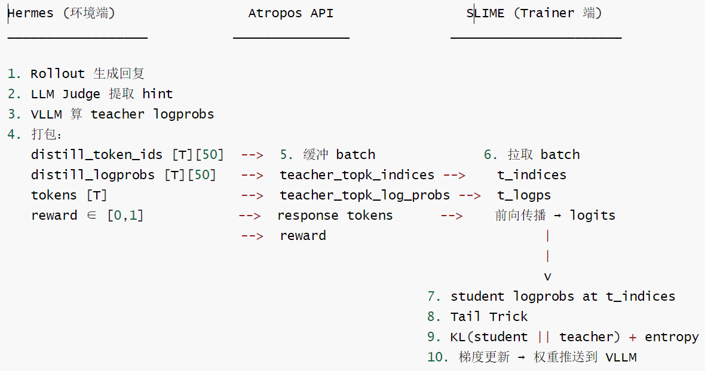
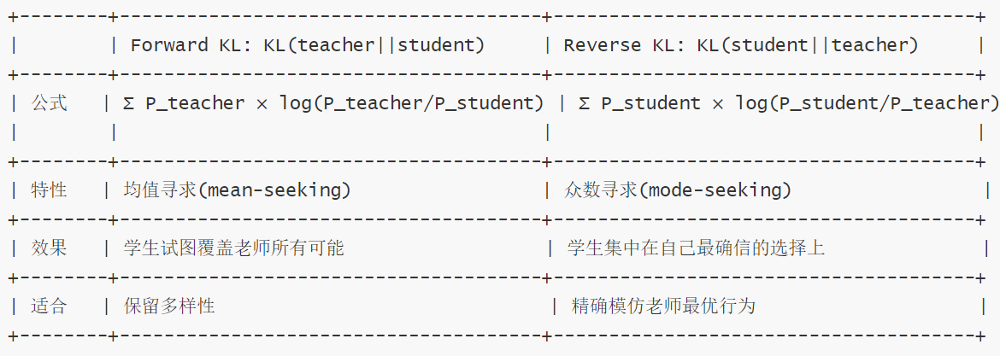
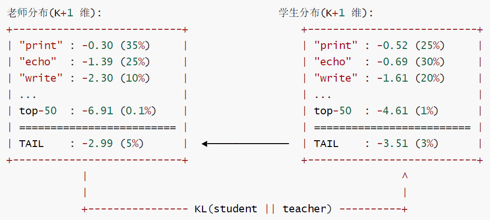
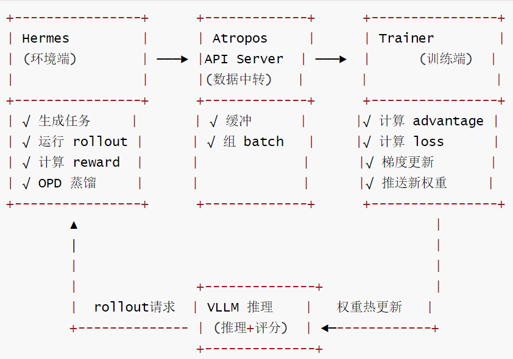

# 【Agentic RL / 强化学习 / OPD】Hermes & OPD 源码阅读笔记

# 【Agentic RL / 强化学习 / OPD】Hermes & OPD 源码阅读笔记

目录

* [【Agentic RL / 强化学习 / OPD】Hermes & OPD 源码阅读笔记](#agentic-rl--强化学习--opdhermes--opd-源码阅读笔记)
  + [0x00 概要](#0x00-概要)
  + [0x01 OPD 机制原理 —— "OPD 是什么，怎么工作"](#0x01-opd-机制原理--opd-是什么怎么工作)
    - [1.1 OPD 的完整数据流](#11-opd-的完整数据流)
    - [1.2 vLLM](#12-vllm)
    - [1.3 Teacher Scoring vs Teacher Forcing](#13-teacher-scoring-vs-teacher-forcing)
      * [1.3.1 两者的本质区别](#131-两者的本质区别)
      * [1.3.2 总结](#132-总结)
    - [1.4 OPD 对于推理的特殊需求](#14-opd-对于推理的特殊需求)
      * [1.4.1 使用 vLLM](#141-使用--vllm)
      * [1.4.2 精确的 token IDs](#142-精确的-token-ids)
      * [1.4.3 双重角色](#143-双重角色)
    - [1.5 OPD 蒸馏完整管线详细分析](#15-opd-蒸馏完整管线详细分析)
      * [1.5.1 Step 1: 标准 Rollout (继承自 HermesAgentBaseEnv)](#151-step-1-标准-rollout-继承自-hermesagentbaseenv)
      * [1.5.2 Step 2: 提取 Turn Pairs - \_extract\_turn\_pairs()](#152-step-2-提取-turn-pairs---_extract_turn_pairs)
      * [1.5.3 Step 3: LLM Judge 提取 Hint - \_extract\_hint()](#153-step-3-llm-judge-提取-hint---_extract_hint)
      * [1.5.4 Step 4: 构建增强 Prompt + VLLM Scoring - \_opd\_for\_sequence()](#154-step-4-构建增强-prompt--vllm-scoring---_opd_for_sequence)
      * [1.5.5 Step 5: 打包训练信号 - \_apply\_opd\_pipeline()](#155-step-5-打包训练信号---_apply_opd_pipeline)
      * [1.5.6 训练端如何使用新字段？](#156-训练端如何使用新字段)
    - [1.6 论文定义的四个关键机制](#16-论文定义的四个关键机制)
  + [0x02 实现对比 —— "同一算法，两套系统"](#0x02-实现对比--同一算法两套系统)
    - [2.1 从代码看 OPD 实现](#21-从代码看-opd-实现)
      * [2.1.1 逐项对比](#211-逐项对比)
      * [2.1.2 结论](#212-结论)
        + [完全一致的部分](#完全一致的部分)
        + [关键差异](#关键差异)
    - [2.2 OpenClaw-RL 异步Proxy 架构 vs Hermes Batch 架构](#22-openclaw-rl-异步proxy-架构-vs-hermes-batch-架构)
      * [2.2.1 OpenClaw-RL 架构：在线异步Proxy](#221-openclaw-rl-架构在线异步proxy)
      * [2.2.2 Hermes架构：离线Batch环境](#222-hermes架构离线batch环境)
      * [2.2.3 设计差异对比](#223-设计差异对比)
      * [2.2.4 三个最重要的架构差异](#224-三个最重要的架构差异)
        + [在线 vs 离线-本质区别](#在线-vs-离线-本质区别)
        + [数据流时序](#数据流时序)
        + [Reward信号来源](#reward信号来源)
    - [2.3 logprobs & loss & advantage](#23-logprobs--loss--advantage)
      * [2.3.1 logprobs](#231-logprobs)
        + [Student logprobs 的两种获取时机](#student-logprobs-的两种获取时机)
        + [关键区别](#关键区别)
        + [为什么两种方式有不同的语义？](#为什么两种方式有不同的语义)
        + [小结](#小结)
      * [2.3.2 loss](#232-loss)
        + [openclaw-tinker](#openclaw-tinker)
        + [Hermes 的 OPD](#hermes-的-opd)
        + [最终结论](#最终结论)
        + [一句话](#一句话)
      * [2.3.3 Hermes Reward vs OpenClaw-RL Reward](#233-hermes-reward-vs-openclaw-rl-reward)
        + [Hermes Reward](#hermes-reward)
        + [OpenClaw-RL 的 Reward: 两套独立系统](#openclaw-rl-的-reward-两套独立系统)
        + [设计哲学差异](#设计哲学差异)
    - [2.4 架构级差异](#24-架构级差异)
    - [2.5 一句话总结](#25-一句话总结)
  + [0x03 训练端分歧 — "传单值 vs 传分布"](#0x03-训练端分歧---传单值-vs-传分布)
    - [3.1 通俗类比](#31-通俗类比)
      * [3.1.1 传单值(OpenClaw-RL的做法)](#311-传单值openclaw-rl的做法)
      * [3.1.2 传分布(Hermes/Atropos的做法)](#312-传分布hermesatropos的做法)
      * [3.1.3 训练时的区别](#313-训练时的区别)
        + [单值训练(简单advantage)](#单值训练简单advantage)
        + [分布训练(KL散度/reverse KL)：](#分布训练kl散度reverse-kl)
      * [一句话总结](#一句话总结)
    - [3.2 Reward vs Advantage 概念澄清](#32-reward-vs-advantage-概念澄清)
      * [3.2.1 术语澄清](#321-术语澄清)
      * [3.2.2 OPD区别](#322-opd区别)
        + [OpenClaw-RL的做法](#openclaw-rl的做法)
        + [Hermes 如何处理OPD advantage](#hermes-如何处理opd-advantage)
        + [关键区别](#关键区别-1)
      * [3.2.3 训练](#323-训练)
      * [3.2.4 总结](#324-总结)
    - [3.3 KL散度蒸馏 loss 的实际实现](#33-kl散度蒸馏-loss-的实际实现)
      * [3.3.1 Reverse KL](#331-reverse-kl)
      * [3.3.2 核心算法："Top-K + Tail Trick"](#332-核心算法top-k--tail-trick)
      * [3.3.3 实际代码解读](#333-实际代码解读)
  + [0x04 设计哲学 — "为什么选这条路"](#0x04-设计哲学----为什么选这条路)
    - [4.1 选择原因](#41-选择原因)
      * [4.1.1 原因 1：解耦架构的必然结果](#411-原因-1解耦架构的必然结果)
      * [4.1.2 原因 2：Trainer 可替换性](#412-原因-2trainer-可替换性)
      * [4.1.3 原因3：数据格式的约束](#413-原因3数据格式的约束)
      * [4.1.4 原因4：工程简洁性](#414-原因4工程简洁性)
    - [4.2 RL 训练全流水线](#42-rl-训练全流水线)
    - [4.3 OPD 蒸馏管线](#43-opd-蒸馏管线)
    - [4.4 数据交付](#44-数据交付)
  + [0x05 Top-K 解读](#0x05-top-k-解读)
    - [5.1 为什么需要 Top-K 蒸馏？单值 OPD 的局限](#51-为什么需要-top-k-蒸馏单值-opd-的局限)
    - [5.2 Top-K 蒸馏在 OpenClaw 中的位置](#52-top-k-蒸馏在-openclaw-中的位置)
    - [5.3 核心机制：Tail Trick + Reverse KL](#53-核心机制tail-trick--reverse-kl)
      * [5.3.1 问题：15 万词表 vs 50 个 top-K](#531-问题15-万词表-vs-50-个-top-k)
      * [5.3.2 Tail 的数值计算](#532-tail-的数值计算)
      * [5.3.3 Reverse KL 散度](#533-reverse-kl-散度)
    - [5.4 完整数据流：从 API Server 到 Loss](#54-完整数据流从-api-server-到-loss)
    - [5.5 关键设计选择：Teacher Top-K vs Student Top-K](#55-关键设计选择teacher-top-k-vs-student-top-k)
      * [5.5.1 为什么选 Teacher Top-K？](#551-为什么选-teacher-top-k)
      * [5.5.2 Student Top-K 的优势(OpenClaw 放弃的)](#552-student-top-k-的优势openclaw-放弃的)
    - [5.6 数值风险](#56-数值风险)
    - [5.7 两种 OPD 路径对比总表](#57-两种-opd-路径对比总表)
    - [5.8 常见问题](#58-常见问题)
  + [0xFF 参考](#0xff-参考)

## 0x00 概要

本系列的目的是：借着对 OpenClaw-RL 源码的学习，来梳理强化学习的一些相关概念和思想。所以，会有一些基础知识、扩展和发散，OpenClaw-RL 只是一个切入点。而且，因为整篇系列是一个整体，所以有些概念的解读/学习会在不同的文章中出现，还请大家谅解。

OpenClaw-RL 是一个用于在线强化学习(Online RL)的框架，专门针对智能体工具使用场景。它通过从环境反馈中提取过程奖励信号来训练语言模型，支持三种主要模式：

* **openclaw-rl**：基于二元奖励的强化学习(Binary RL / GRPO)
* **openclaw-opd**：基于后见之明提示的在线策略蒸馏(On-Policy Distillation, OPD)
* **openclaw-combine**：联合方法，在同一 PPO 更新中同时利用 RL reward 和 OPD teacher signal


Hermes Agent 中也涉及到了 OPD，事实上，Hermes OPD=OpenClaw OPD 的"Atropos 移植版"

```
相同(100%一致)：
    Judge prompt 文本
    投票策略(选最长positivehint)
    Hint 插入格式([user'shint/ instruction])
    Parse 逻辑 (\boXed{} + [HINT_START]...[HINT_END]) 
    Top-K teacher scoring 思路
    
不同
	(架构适配)：在线vs离线
    SGLang vs VLLM
    单turn vs 全 trajectory 
    有student logprobs vs 无 
    reward=1.0 vs 三信号加权
    advantage 融合 vs 分离式 loss
```

本质：相同的OPD算法，不同的工程实现。

* Hermes适配了Atropos 解耦架构(环境-trainer 分离)，
* OpenClaw适配了SLIME一体化架构(环境-trainer 紧耦合)。

## 0x01 OPD 机制原理 —— "OPD 是什么，怎么工作"

━━━━━━━━━━━━━━━━━━━━━━━━━━━━━━━━━━━━━━━━━━━━━━━━━━━━━━━━━━━

### 1.1 OPD 的完整数据流

OPD 的完整数据流如下图所示。

```
1.学生模型rollout → 生成agent对话(含tool calls + results)
            ↓
2.找到 (assistant_turn，next_state)对
  例如：assistant写了有bug的代码 → tool返回pytest失败信息
            ↓
3.LLM Judge 从 next_state 提取 hint
  例如："应该用dict而不是list来存储映射关系" 
            ↓
4.构建enhanced prompt=原始上下文+hint
            ↓
5.关键步骤：用VLLM的get_logprobs()计算：
  - 输入：enhanced_prompt+学生原始回复的tokens
  - 输出：模型在"知道hint"的条件下，对学生每个token的top-k logprobs 
            ↓
6.得到 distill_token_ids[pos][k] 和 distill_logprobs[pos][k]
  这就是 "teacher distribution"———带有后验知识的概率分布 
            ↓    
7.Trainer计算逐token优势：
  A_t = teacher_logprob(token_t) - student_logprob(token_t)
  正值→teacher认可这个token→上调权重
  负值→teacher不认可→下调权重
```

### 1.2 vLLM

OPD 使用vLLM(Managed Server)进行推理。VLLM get\_logprobs完整技术链如下：

```
OPD 环境(agentic_opd_env.py)
   └────self.server.get_logprobs(input_ids=enhanced_ids, top_k=50) 
			↓    
   ManagedServer.get_logprobs() (managed_server.py)
   	- 如果传入 messages→用tokenizer.apply_chat_template 转为 prompt 
   	- 委托给底层server
			↓ 
    VLLMServer._get_logprobs_wrapper() (vllm_server.py)
    	- 构建请求：{"prompt":{"prompt_token_ids":[...]}， "prompt_logprobs": 50} 
    	- 发送HTTP POST 到VLLM的/generate端点
    	- 解析返回的prompt_logprobs，归一化为统一格式 
    		↓ 
    VLLM/generate端点(VLLM服务进程)
    	- 接收prompt_token_ids(精确的token 序列)
    	- 对每个位置计算条件概率 P(token_i | token_0, ..., token_{i-1})
    	- 返回每个位置的 top-K token IDs+logprobs
```

VLLM/generate的关键请求参数如下。其中的关键设计：max\_tokens=1一这个请求几乎不生成新文本。它的目的纯粹是让 VLLM 对输入的 prompt token 序列进行一次完整的前向传播，返回每个位置的prompt\_logprobs(即条件概率)。

```
 request_data = {
    "prompt":{"prompt_token_ids":prompt_tokens}，# 精确 token 序列
    "prompt_logprobs":,top_k, # 每个位置返回top-k个logprobs
    "n":1,                    # 只要1个序列
    "temperature":0.0,        # 确定性(不需要采样)
    "top_p":1.0,
    "max_tokens":1,           # 几乎不生成新token(只要promptlogprobs)
}
```

返回数据格式

```
{
    "prompt_tokens":[101，2023,3854,...], #输入 token IDs
    "prompt_topk_token_ids":[  #每个位置的 top-K token IDs
        [3854,7142,9821,...] #位置0
        [2001,5431, 1234,...] #位置1
   		 ...
    ],
	"prompt_topk_logprobs":[   #对应的logprobs  
		[-0.12，-1.45，-2.31，...]，#位置0
		[-0.05，-0.89,-1.67，...]，#位置1
        ...
    ],
}
```

为什么是prompt\_logprobs而不是生成log probs？

这是整个设计中最精妙的部分。普通的 LLM API 返回的 logprobs是模型自己生成的 token 的概率。但OPD 需要的不是这个一它需要：给定enhanced prompt(含hint)，模型对学生已经生成的每个token的评分是多少？

这在技术上叫做teacher scoring：你把"增强后的上下文+学生原始回复" 拼接成一个完整序列，让模型做一次前向传播，读取prompt\_logprobs。这告诉你：如果模型看到了 hint，它在每个位置会给学生的 token 多高的概率？

```
增强prompt=[系统提示]+[任务］+[hint："应该用dict"]+[学生的原始代码]
                                                    ↑
										VLLM在这里的prompt_logprobs 就是teacher 的评分
```

### 1.3 Teacher Scoring vs Teacher Forcing

OPD 数据流的核心动作是第 5 步的 Teacher Scoring。OpenClaw的"teacher scoring"本质上是：

* 用 hint 增强后的 teacher 视角，对 student 的 response 做概率评估，
* 得到的 teacher\_log\_probs 用于OPD advantage 计算。

在深入技术细节之前，有必要先厘清两个看起来很像的概念：Teacher Scoring 与 Teacher Forcing。

Teacher Scoring vs Teacher Forcing 这是两个完全不同的概念，虽然名字相似。 前者是"评估已有答案的概率"，后者是"用正确答案训练"。两者都利用了全序列并行的 forward pass，但目的不同。

Teacher Forcing(经典 NLP 技术)

```
训练时：
    输入：[The，cat，sat，on]    ← 真实ground truth tokens
    预测： [cat，sat，on，the]    ← 模型预测下一个token

关键：每步输入是ground truth token，不是模型自己上一步的输出
    →避免error accumulation(错误滚雪球) → 所有SFT/预训练都用teacher forcing
```

Teacher Scoring(OpenClaw OPD 中使用的技术)

```
不是"forcing"，是"scoring"：

给teacher一个完整序列(prompt+hint+学生的response)
让teacher 做 forward pass，输出每个 token 的 log-prob。

teacher不生成任何新token，只是"打分"(评估每个token的概率)
```

#### 1.3.1 两者的本质区别

|  | Teacher Forcing | Teacher Scoring |
| --- | --- | --- |
| 目的 | 训练(提供 ground truth 输入) | 评估(获取概率分布) |
| 谁的 token | Ground truth 数据 | Student 已生成的 response |
| 产出 | 模型的预测 + loss | 每个 token 的 log-prob |
| 是否生成 | 不生成(但计算 loss) | 不生成(只计算 prob) |
| 并行性 | ✓ 全序列并行 | ✓ 全序列并行 |
| 用途 | SFT/预训练 | 知识蒸馏(OPD) |

#### 1.3.2 总结

* Teacher Forcing："我告诉你正确答案，你学着预测"
* Teacher Scoring："你已经写好了答案，我来评估每个词写得好不好"。Teacher Scoring 本质就是：给一个完整序列做 forward pass，返回 log-probs，不生成新 token。

两者都利用了"已知完整序列 → 一次 forward pass"的并行性，但目的完全不同。

### 1.4 OPD 对于推理的特殊需求

#### 1.4.1 使用 vLLM

为什么 OPD 必须是 VLLM(或者类似的工具，比如SGLang)而不是 OpenAI API？这是因为OPD需要：

* Tokenizer ---- 将 enhanced prompt + response 编码为 token IDs
* prompt\_logprobs --- 计算增强分布下对每个response token的概率
* 精确token 对齐 ---- 将teacher logprobs映射回学生序列的正确位置

这三个都是VLLM独有的。OpenAI API只能告诉你"模型生成了什么"，但OPD需要知道"如果模型看到了hint，它会对学生的每个token 给出怎样的概率"。

这里的关键是token 对齐。OPD 需要知道"位置 37的 teacher logprob 对应学生 token 序列的位置 37"。这要求输入是精确的prompt\_token\_ids 不是文本(文本会被重新tokenize，可能产生不同的分词)

这就是为什么VLLM是OPD的硬依赖一一一整个teacher scoring pipeline建立在VLLM独有的prompt\_logprobs 能力之上，需要token 级别的精确控制。

#### 1.4.2 精确的 token IDs

RL 训练为什么需要精确的 token IDs。下面从 RL 训练的数学本质开始分析。

核心原因：RL训练的梯度计算发生在token级别，不是文本级别。

**1. 训练目标公式**

RL训练(GRPO/PPO)的核心 loss 是：

```
L=-E[A(s,a)·log π_θ(a_t | s_t)]
```

其中：

```
π_θ(a_t | s_t)=模型在位置t生成token a_t的概率
A(s，a) = advantage(这个 rollout 有多好)
```

因此，计算 logπ\_θ(a\_t| s\_t)需要知道a\_t是哪个 token ID。

**2. 如果只有文本会怎样？**

```
    文本："Hello world"
        │ 自己tokenize
        ▼
    Token IDs：[15496，995]  ←  你用你的tokenizer编码的
```

但因为 tokenizer 版本的原因，模型实际生成时的token可能是：

```
 Token IDs:[15496，995]  ←  恰好一样(简单词) 
 
 or [1544，7799，995]     ←  如果tokenizer版本不同
```

另外，对简单文本可能对得上，但 agentic 场景充满特殊 token：

```
<tool_call>terminal</tool_call>{"command":"ls"}
```

这段文本的tokenization方式取决于：

* 是否有特殊token<tool\_call>→可能是1个token或多个
* 模型的chat template如何处理
* BPE merge 在上下文中的行为

因此，只有推理服务器本身产出的token IDs才是"ground truth"。

**3. Mask 也需要精确对齐**

训练时只对 assistant产出的 token 计算loss:

```
System:... User:...    Assistant:Hello world <tool_call>...
[mask] [mask] [mask]            [TRAIN] [TRAIN] [TRAIN][TRAIN]
```

如果你事后tokenize，mask的边界会错位→训练信号错误。

Managed Server的Sequence Nodes天然记录了哪些token是生成的(需要训练)，哪些是prompt(需要 mask)。

**4. OPD更极端**

OPD需要计算teacher的逐token logprob分布：

```
Teacher distribution at position t: 
    token_3847 → -0.23 (logprob)
    token_9182→-1.05 
    token_5521→-2.31
    ...Top-50 tokens
```

Student要模仿这个分布→KL(student || teacher)

如果tokenIDs对不上，student在位置t看到的分布就对不上实际的token序列，KL loss完全无意义。

**5.一句话总结**

| 场景 | 需要什么 | 为什么 |
| --- | --- | --- |
| SFT | 文本就够 | 目标明确（"照着说"），框架自行tokenize |
| RL(GRPO/PPO) | 精确 token IDs + mask | Loss = per-token logprob x advantage |
| OPD | 精确token IDs + 逐token logprob 分布 | Loss = per-token KL divergence |

注：SFT可以事后tokenize，是因为目标序列是"标准答案"。RL的目标序列是模型自己生成的 rollout—必须和模型内部token完全一致，否则梯度计算就是垃圾。

#### 1.4.3 双重角色

OPD 设计上的巧妙之处在于：OPD用同一个VLLM服务器同时扮演两个角色：

* 学生(Phase 2 rollout)：通过 ManagedServer 生成 trajectory，获取精确 token +logprobs
* Teacher(hint-augmented scoring)：通过 get\_logprobs()评估学生token，提供密集蒸馏信号

这意味着自蒸馏(self-distillation)—teacher 和 student 是同一个模型，但 teacher 拥有"后验知识"(hint)。随着训练推进，student逐渐内化这些hints，不再需要显式的工具反馈就能生成更好的代码。

### 1.5 OPD 蒸馏完整管线详细分析

总览: 5 步管线：

```
Rollout → 提取 Turn Pairs → LLM Judge 提取 Hint → 构建增强 Prompt → VLLM Scoring → 训练信号
```

#### 1.5.1 Step 1: 标准 Rollout (继承自 HermesAgentBaseEnv)

collect\_trajectories() 先调用 super().collect\_trajectories(item) 执行标准的 Phase 2 rollout, 得到ScoredDataGroup (包含 tokens/masks/scores)。OPD 是在此基础上的后处理增强。

#### 1.5.2 Step 2: 提取 Turn Pairs - \_extract\_turn\_pairs()

遍历对话历史, 找到所有 (assistant\_turn, next\_state) 对:

```
messages = [system, user, assistant₁, tool₁, tool₂, assistant₂, tool₃, assistant₃(final)]
                          ^^^^^^^^^^^^^^^^^^^^^^    ^^^^^^^^^^^^^^^^^^
                           turn pair 1              turn pair 2
```

每个 pair 包含:

* context\_messages - 该 assistant turn 之前的所有消息
* assistant\_text - assistant 的回复内容
* next\_state\_text - 后续的 tool 结果/user 回复 (多个结果用 --- 连接)
* next\_state\_role - "tool" 或 "user"

长工具输出按 hint\_max\_next\_state\_chars 截断。

#### 1.5.3 Step 3: LLM Judge 提取 Hint - \_extract\_hint()

核心思想: next\_state 包含事后才知道的信息 (hindsight), 例如:

* 测试失败的错误信息 → 揭示了代码 bug
* 命令执行的输出 → 揭示了环境状态
* 用户的纠正 → 揭示了需求理解偏差

Judge Prompt :

```
System: "You are a process reward model used for hindsight hint extraction..."
User:  "## Assistant response (turn t)\n{response}\n## Next state (turn t+1) [role: {role}]\n{next_state}"
```

关键设计: Judge 被明确告知 role 的语义—role='tool' 意味着这是 assistant调用工具后才产生的结果, 不应视为 assistant事先应该知道的信息。成功的工具调用意味着 assistant 的行为是合理的。

多数投票:

* 并发发送 prm\_votes (默认 3) 次 judge 查询
* 每次 temperature=0.7
* 输出格式: \boxed{1} + [HINT\_START]...[HINT\_END] 或 \boxed
* \_select\_best\_hint(): 从所有 score=1 的投票中选最长的 hint (信息量最大)
* 至少一个投票为正且 hint 长度 > 10 字符才返回

#### 1.5.4 Step 4: 构建增强 Prompt + VLLM Scoring - \_opd\_for\_sequence()

对每个有效 hint:

4a. 构建增强消息 - \_append\_hint\_to\_messages() (288-310):

```
# 深拷贝 context_messages, 在最后一个 user 消息末尾附加:
"\n\n[user's hint / instruction]\n{hint}"
```

4b. Tokenize 增强 Prompt:

```
enhanced_prompt = tokenizer.apply_chat_template(enhanced_messages, add_generation_prompt=True)
enhanced_full = enhanced_prompt + assistant_text  # 原始 response 追加在后面
enhanced_ids = tokenizer(enhanced_full)["input_ids"]
```

4c. VLLM get\_logprobs 调用:

```
logprob_result = await self.server.get_logprobs(
    input_ids=enhanced_ids,    # 增强 prompt + student response
    top_k=k,                   # distill_topk (默认 5)
    split="eval",              # 使用 eval semaphore, 不阻塞训练
)
```

返回每个 token 位置的 top-K 预测: {prompt\_topk\_token\_ids, prompt\_topk\_logprobs}

4d. 提取 response 部分的 teacher 分布 只取最后 response\_len 个位置的  
logprobs, 这些对应 assistant 回复的token 在增强分布下的概率。

4e. 映射回全序列：通过 \_find\_token\_span() 在学生的完整 token 序列中定位该 assistant  
turn 的位置, 将 teacher 的top-K logprobs 写入对应位置。

#### 1.5.5 Step 5: 打包训练信号 - \_apply\_opd\_pipeline()

最终在 ScoredDataGroup 上设置两个新字段:

```
group["distill_token_ids"]    # shape: [group_size][seq_len][top_k]
group["distill_logprobs"]     # shape: [group_size][seq_len][top_k]
```

失败的序列用零填充 `[[0]*k]*seq_len`, 保证 shape 一致。

#### 1.5.6 训练端如何使用新字段？

Atropos trainer 读取这些字段计算逐 token 优势:

```
A_t = teacher_logprob(token_t) - student_logprob(token_t)
    -A_t>O:teacher(知道hint后).认为这个token更好→upweight
    -A_t<O：teacher认为这个token不好→downweight
    -A_t=O(零填充位置)：没有蒸馏信号→退化为标准RL
```

数据流图如下

```
Rollout (Phase 2)
    |
    | messages + tokens
    |
    ▼
[ _extract_turn_pairs ]
    |
    | turn pairs[]
    |
    ▼
[ _extract_hint (per turn pair) ] <-- LLM Judge x prm_votes (majority vote)
    |
    | hint string
    |
    ▼
[ _append_hint_to_msgs + tokenize ] <-- context + hint -> enhanced prompt
    |
    | enhanced_ids
    |
    ▼
[ server.get_logprobs (teacher scoring) ] <-- VLLM prompt_logprobs
    |
    | top-K teacher dist
    |
    ▼
[ _find_token_span + merge into array ] <-- map back to student sequence
    |
    | distill_token_ids[seq_len][k]
    | distill_logprobs[seq_len][k]
    |
    ▼
[ ScoredDataGroup + distill fields ] --> Atropos Trainer
                                         A_t = teacher_lp - student_lp
```

### 1.6 论文定义的四个关键机制

OPD 论文将上述管线中的核心设计抽象为四个关键机制。这是从 OPD 机制走向实际系统实现的桥梁。

```
OPD → token 级 teacher logprobs → 逐token指导 → 独立于reward运行
```

OpenClaw-RL论文的设计：

* Evaluative signal(标量reward)：通过 PRM Judge打分，基于 next\_state评价 action 好坏
* Directive signal(OPD 蒸馏)：从 next\_state提取hint→teacher logprobs→ token 级指导
* 两者组合为 hybrid RL objective

| 机制 | 论文描述 |
| --- | --- |
| Hint 提取 | PRM Judge 从 next-state 中提取 textual hint |
| Teacher scoring | 用 hint 增强 prompt -> 计算 token-level logprob gap |
| Overlap-guided hint selection | 当 teacher/student 分布差异过大时，选择与 student top-K 重叠度最高的 hint |
| Log-prob-difference clip | 裁剪逐 token 的 advantage 估计，防止 teacher/student 严重不一致时训练不稳定 |

以上是 OPD 的机制原理——它是什么、怎么工作、依赖什么基础设施。

而 Hermes 和 OpenClaw-RL 实现了相同的 OPD 算法，但架构路线完全不同。

## 0x02 实现对比 —— "同一算法，两套系统"

━━━━━━━━━━━━━━━━━━━━━━━━━━━━━━━━━━━━━━━━━━━━━━━━━━━━━━━━━━━

Hermes 的 OPD 实现本质上就是 OpenClaw-RL 官方代码的移植，适配到了 Atropos/VLLM 的技术栈上。

最大的架构差异是OpenClaw-RL作为异步proxy server 运行(拦截实时对话)，而Hermes 作为离线batch env 运行(收集 rollout 后再做 OPD)

|  | Hermes/Tinker (分离式) | OpenClaw (融合式) |
| --- | --- | --- |
| 选择原因 | 解耦架构约束 + Trainer 可替换 | 单进程控制所有数据 |
| 数据要求 | 只需 teacher logprobs | 需要 teacher + student logprobs |
| Trainer 接口 | 标准化（可选蒸馏字段） | 定制化（必须理解 combined advantage） |
| 优点 | 灵活、可插拔、易调试 | 训练更稳定、无 loss 量级冲突 |
| 缺点 | 两个 loss 可能方向冲突、需调 α | 环境-trainer 耦合更紧 |
| 适用场景 | 多 trainer 生态（Tinker/SLIME/Axolotl 都能接） | 自研一体化系统 |

### 2.1 从代码看 OPD 实现

从代码层面的对比可以得出结论：Hermes 的 OPD 算法实现与 OpenClaw-RL 高度相似，核心逻辑(Judge Prompt、投票策略、Hint 插入方式、Teacher scoring 原理)完全相同。**真正的差异在系统架构层面。**

#### 2.1.1 逐项对比

以下逐项对比。

1. Hint 选择策略 —— 两者一致，都是选最长的

OpenClaw-RL 的 `_select_best_hint()` 使用"选最长 hint"策略(openclaw\_opd\_api\_server.py:112-119)。Hermes 推断使用相同策略。

2. Judge Prompt —— 完全相同

两者的 `_HINT_JUDGE_SYSTEM` prompt 几乎逐字相同，包括：

* \boxed{1} / \boxed{-1} 决策格式
* [HINT\_START] / [HINT\_END] 标记
* role='tool' 的特殊说明

3. Hint 插入方式 —— 完全相同

两者的 `_append_hint_to_messages()` 逻辑相同：深拷贝 → 找最后一个 user 消息 → 追加 `\n\n[user's hint / instruction]\n{hint}`。

4. Teacher scoring —— 架构差异(本质相同)

|  | OpenClaw-RL | Hermes |
| --- | --- | --- |
| 后端 | SGLang /generate | VLLM /generate (via atroposlib) |
| 调用方式 | \_compute\_teacher\_log\_probs() 直接 HTTP | server.get\_logprobs() 通过 ManagedServer |
| Top-K | 可选 (--distill-topk 50) | 默认 50 |
| 返回格式 | input\_token\_logprobs + input\_top\_logprobs | prompt\_topk\_token\_ids + prompt\_topk\_logprobs |

本质相同：都是将 (enhanced\_prompt + response) tokenize → 发给推理引擎 → 获取 response 部分每个位置的 logprobs。

5. 关于 "overlap-guided" —— 论文理论 vs 实际代码

论文摘要/方法论中提到 overlap-guided hint selection，但官方代码中并没有实现 —— 它用的是和 Hermes 一样的"选最长 hint"启发式。这可能是：

* 论文中描述的是一个更理想的方案，代码中做了工程简化
* 或者 overlap-guided 在某个未公开的实验分支中

6. Log-prob clip —— 在 trainer (SLIME) 端实现

OpenClaw-RL 的 env 端(openclaw\_opd\_api\_server.py)也没有做 clip，clip 逻辑在 SLIME trainer 的 PPO loss 计算中。Hermes 将 distill fields 传给 Atropos trainer 处理，推断同理。

#### 2.1.2 结论

##### 完全一致的部分

| 环节 | 说明 |
| --- | --- |
| Judge Prompt | 逐字相同—\boxed{1/-1} + [HINT\_START/END]，含 role='tool' 说明 |
| 投票策略 | 并发 m 次查询（默认3），temperature 0.6-0.7 |
| Hint 选择 | 从 score=1 且长度>10 的投票中选最长的 |
| Hint 插入 | 深拷贝消息 -> 最后一个 user 消息末尾追加 [user's hint / instruction] |
| Teacher scoring | tokenize(enhanced\_prompt + response) -> 推理引擎获取 response 部分的 prompt logprobs |
| Top-K 蒸馏 | 支持，默认 K=50 |
| Advantage 公式 | A\_t = teacher\_lp - student\_lp |

##### 关键差异

| 维度 | OpenClaw-RL | Hermes |
| --- | --- | --- |
| 运行模式 | 在线 proxy（拦截实时对话） | 离线 batch（先跑 rollout 再做 OPD） |
| OPD 触发 | 实时—下一条消息到达触发上一轮 | 批量—整个 rollout 结束后遍历 |
| 推理后端 | SGLang /generate | VLLM /generate (via atroposlib) |
| Reward | 固定 1.0（有 hint 即正样本） | 多信号加权（correctness+efficiency+tool\_usage） |
| 权重更新 | 连续异步（SLIME trainer 后台更新） | 同步批次（Atropos trainer） |
| Session 管理 | 有状态（pending dict + session\_done 清理） | 无状态（每次重新遍历 messages） |
| 数据来源 | 真实用户交互 | 合成编程任务rollout |
| PRM Eval | 独立的 evaluative PRM judge（可选） | 集成在 compute\_reward 中的程序化验证 |
| Turn 分类 | main/side标记（side跳过） | 无—所有 assistant turn 都处理 |
| Logprob clip | 交给 SLIME trainer | 交给 Atropos trainer |

### 2.2 OpenClaw-RL 异步Proxy 架构 vs Hermes Batch 架构

#### 2.2.1 OpenClaw-RL 架构：在线异步Proxy

```
User/Environment <--> OpenClaw Proxy (FastAPI) <--> SGLang Policy Server
                              |
                    (intercepts live chat)
                              |
                              v
              PRM/Judge Server       SLIME Trainer
              (hint + teacher lp)    (PPO updates)
```

核心设计：proxy模式，拦截实时对话

* 用户正常使用模型(通过OpenAI-compatibleAPI/v1/chat/completions)
* Proxy透明转发请求到SGLang，同时获取responselogprobs
* Turn分类：turn\_type="main"(可训练)vs"side"(跳过)
* 延迟触发OPD：当下一条消息到达时，才对上一条回复做OPD(因为此时才有next\_state)
* 即时提交Sample→trainer在后台持续更新权重
* submission\_enabled event控制权重更新时暂停提交

#### 2.2.2 Hermes架构：离线Batch环境

```
Atropos Trainer --> HermesAgentBaseEnv.collect_trajectories()
                              |
                              v
                    group_size 个并行 rollout
                              |
                              | (完整 rollout 结束后)
                              v
              AgenticOPDEnv._apply_opd_pipeline()
                              |
                              v
                        per-serquence | OPD 处理
                              |
                              v
                        ScoredDataGroup + distill fields → Trainer
```

核心设计：先跑完rollout，再做OPD

* Rollout全部完成后，得到完整messages+tokens+reward
* 一次性遍历整个对话，提取所有turn pairs
* 批量做OPD：每个turnpair 的 hint 提取 + teacher scoring
* 打包成ScoredDataGroup →返回给Atropos trainer

#### 2.2.3 设计差异对比

| 维度 | OpenClaw-RL (Proxy) | Hermes (Batch) |
| --- | --- | --- |
| 训练模式 | 在线持续学习 | 离线 batch 训练 |
| 数据来源 | 真实用户交互 | 合成 rollout |
| OPD 触发时机 | 实时—下一条消息到达时 | 延迟—整个 rollout 结束后 |
| 延迟 | 秒级（对话间隔） | 分钟级（rollout 周期） |
| 并发模型 | 每个 session 独立的 asyncio Task | group\_size 并行 + 顺序 OPD |
| 状态管理 | session\_id 为 key 的 pending dict | 无状态（每次重新遍历 messages） |
| 权重更新 | 连续（trainer 后台更新） | 同步（batch 提交后 trainer 更新） |
| 策略新鲜度 | 高—用最新权重生成 | 中—一批 rollout 共享同一权重 |
| 适用场景 | 有真实用户流量的部署 | 研究/实验/离线 fine-tuning |
| reward | 固定 1.0（hint 存在即为正样本） | 程序化验证（0.0~1.0 连续值） |
| session 管理 | 支持 session\_done 信号清理状态 | 不需要—每个 rollout 自动隔离 |

---

#### 2.2.4 三个最重要的架构差异

##### 在线 vs 离线-本质区别

* OpenClaw-RL 的核心价值是**"边用边练"**：用户正常使用 AI assistant，每一次对话都在后台产生训练信号。这是论文标题 "Train Any Agent Simply by Talking" 的精髓。
* Hermes 是传统 RL 研究范式：先收集大量合成 rollout，再一批训练。优点是可控性强、可复现，缺点是 policy 更新不够及时。

##### 数据流时序

OpenClaw-RL的精妙之处一延迟一步：

```
turn 1:user msg → proxy → policy →response1 (save pending)
turn 2:user msg → proxy 触发 opD(response1，user_msg2)→ policy → response2 (save pending)
turn 3:user msg →proxy 触发 OPD(response2,user_msg3)→...
session_done→丢弃最后一个pending(无next_state)
```

Hermes—-次性回顾如下，Hermes的方式更简单(不需要维护session 状态)，但丧失了在线学习的能力。

```
rollout 完成 → messages =[sys， user， asst1, tool1，asst2，tool2，asst3]
遍历 → pair1=(asst1，tool1)，pair2=(asst2，tool2) 
并行 OPD → distill fields
```

##### Reward信号来源

OpenClaw-RL:

* 每个有效hint的样本reward固定为1.0(sample.reward={"score": 1.0})
* 论文依赖OPD的 token级信号，不需要精细的 trajectory-level reward
* 可选的PRM eval mode提供额外标量评分

Hermes:

* 有独立的多信号reward函数(correctness + efficiency + tool\_usage)
* OPD distill fields 和reward 共存在ScoredDataGroup 中
* Trainer同时使用两者

两者信号不同，是因为 Hermes 有真实沙箱可以执行测试 →能产出有意义的连续 reward→没理由浪费它。OPD 的 KL loss 告诉模型“每个token怎么选”，reward 告诉模型“整体策略对不对“一两者互补。OpenClaw用 reward=1.0是因为它的 OPD 纯模式不需要RL信号一它只想蒸馏 teacher，不评判好坏。

### 2.3 logprobs & loss & advantage

#### 2.3.1 logprobs

##### Student logprobs 的两种获取时机

```
时机 A: Rollout 时截获 (OpenClaw 的做法)
模型生成 token → 同时记录每个 token 的 logprob → 存入 sample.rollout_log_probs
用途: combine_loss 中计算 teacher_adv = teacher_lp - student_lp(rollout时的)

时机 B: Training forward pass 时重算 (Hermes/Tinker 的做法)
Trainer 拿到 tokens → 做一次 forward pass → 得到当前模型对每个 token 的 logprob
用途: KL loss 中计算 KL(student_current || teacher)
```

Hermes 不存 rollout-time student logprobs, 但 Trainer 会重算（推断，因为没有tinker代码）

```
# topk_distillation_loss.py 的逻辑 (Tinker 大概率类似)
# 1. Trainer 做 forward pass → 得到 student 的 logits
student_logits = model(tokens)  # [T, vocab_size]

# 2. 用 distill_token_ids 从 student logits 中取对应位置的 logprob
#    只看 teacher 认为重要的那 K=50 个 token
student_topk = student_logits.gather(dim=-1, indices=distill_token_ids)  # [T, K]

# 3. 构建 teacher 的 K+1 分布 (来自 distill_logprobs)
teacher_topk = distill_logprobs  # [T, K]
teacher_tail = log(1 - sum(exp(teacher_topk)))  # tail bin

# 4. 构建 student 的 K+1 分布
student_tail = log(1 - sum(exp(student_topk)))

# 5. KL(student || teacher) over K+1 bins
loss = F.kl_div(teacher_dist, student_dist, log_target=True)
```

##### 关键区别

|  | OpenClaw combine\_loss | Hermes/Tinker Top-K KL |
| --- | --- | --- |
| 需要什么 | rollout 时的 student logprob (旧的) | training 时的 student logprob (当前的) |
| 什么时候算 | rollout 时存好 | training forward pass 时重算 |
| 数据里需要存吗 | ✔ 必须存 rollout\_log\_probs | ✘ 不需要 (训练时现算) |
| 用途 | teacher\_adv = teacher\_lp - old\_student\_lp | KL(current\_student |

##### 为什么两种方式有不同的语义？

```
OpenClaw combine_loss:
"teacher 在位置 t 觉得该生成 token X 的信心 - 当初 student 生成 X 的信心"
→ 正值 = teacher 比 student 当初更确信 → 应该增大 X 的概率
→ 这是一个 advantage (方向信号)

Hermes/Tinker Top-K KL:
"当前 student 的分布 和 teacher 的分布 有多远"
→ 直接最小化分布距离
→ 这是一个 loss (距离度量)
```

##### 小结

Hermes 的 OPD 不需要存储 rollout-time 的 student logprobs, 因为它用的是 "让当前模型逼近 teacher 分布" (KL loss), student logprobs 在训练时通过 forward pass 实时计算。OpenClaw combine 需要存储是因为它用的是 "teacher 比旧student强多少"（advantage信号），需要知道rollout时的旧值。

#### 2.3.2 loss

##### openclaw-tinker

openclaw-tinker/ 完整暴露了 Tinker 上训练 OPD 的方式。它和 OpenClaw-RL 的 SLIME 版本用的是同一种融合式设计!

Tinker 上 OPD 的 Loss (从 data\_formatter.py 确认)

```
# data_formatter.py L106-123: RL / OPD 模式
def sample_to_datum(sample, advantage, kl_penalty_coef=0.0):
    # 基础 advantage = GRPO 标量 reward
    resp_advantages = [advantage * mask for mask in sample.loss_mask]

    # OPD: 叠加 reverse-KL penalty
    if sample.teacher_logprobs is not None and kl_penalty_coef > 0:
        for i in range(len(resp_advantages)):
            student_lp = sample.response_logprobs[i]  # rollout 时的 student logprob
            teacher_lp = sample.teacher_logprobs[i]  # 有 hint 的 teacher logprob
            kl_i = student_lp - teacher_lp            # per-token KL
            resp_advantages[i] += -kl_penalty_coef * kl_i  # 加到 advantage 上

# data_formatter.py L146-178: Combined 模式
def sample_to_datum_combined(sample, w_opd=1.0, w_rl=1.0, kl_penalty_coef=0.0):
    for i in range(len(sample.response_tokens)):
        rl_adv = w_rl * sample.reward * mask
        opd_adv = w_opd * (-kl_penalty_coef * (student_lp - teacher_lp)) * mask
        resp_advantages[i] = rl_adv + opd_adv  # 融合!
```

关键发现: Tinker 版和 SLIME 版本本质相同，两者都是 advantage 融合式:

combined\_advantage = w\_rl × reward + w\_opd × (-kl\_coef × (student\_lp - teacher\_lp))

而不是分离式：L = L\_GRPO + α × L\_OPD

##### Hermes 的 OPD

现在问题是: Hermes 环境产出的数据能走 openclaw-tinker 的路径吗？

看 TrainingSample 的字段:

```
@dataclass
class TrainingSample:
    prompt_tokens: list[int]      # ← Hermes 有 (ScoredDataItem.tokens 的 prompt 部分)
    response_tokens: list[int]   # ← Hermes 有 (ScoredDataItem.tokens 的 response 部分)
    response_logprobs: list[float] # ← Hermes ✘ 没有! (不存 student rollout logprobs)
    loss_mask: list[int]         # ← Hermes 有 (ScoredDataItem.masks)
    reward: float                # ← Hermes 有 (ScoredDataItem.scores)
    teacher_logprobs: list[float] # ← Hermes ⚠️ 有 Top-K 但不是单值
```

矛盾!

| 字段 | Hermes 产出 | openclaw-tinker 需要 | 兼容? |
| --- | --- | --- | --- |
| tokens | ✔ | ✔ | ✔ |
| masks | ✔ | ✔ | ✔ |
| reward | ✔ 连续 0–1 | ✔ 标量 | ✔ |
| response\_logprobs | ✘ 不存 | ✔ 需要 | ✘ 不兼容 |
| teacher\_logprobs | Top-K 分布 [T][50] | 单值 [T] | ✘ 格式不同 |

##### 最终结论

```
openclaw-tinker (reference/ 中的代码):
  - 使用 advantage 融合式 (和 SLIME combine_loss 相同)
  - 需要: student rollout logprobs + teacher 单值 logprobs
  - OPD advantage = -kl_coef × (student_lp - teacher_lp)

Hermes 环境产出:
  - 不存 student rollout logprobs
  - teacher 是 Top-K 分布 [T][K=50], 不是单值

→ Hermes 的数据格式和 openclaw-tinker 不兼容!
→ Hermes 配套的真正 Tinker (nousresearch/tinker-atropos)
  大概率用的是 Top-K KL 方式 (直接消费 distill_token_ids/distill_logprobs)
  而不是 openclaw-tinker 的 advantage 融合方式
```

##### 一句话

OpenClaw-RL 项目中的 openclaw-tinker/ 确实用了 advantage 融合式 (和 SLIME combine\_loss 相同), 但这条路需要 student rollout logprobs 和 teacher 单值 logprobs—而 Hermes 环境不提供这些。所以 NousResearch 的 nousresearch/tinker-atropos (私有仓库) 大概率有一条不同的 Top-K KL loss 路径来消费 Hermes' 的 `distill_token_ids[T][50] + distill_logprobs[T][50]` 格式的数据。

换句话说:

* openclaw-tinker = OpenClaw 团队为 Tinker 云平台适配的训练代码 (用他们自己的数据格式)
* nousresearch/tinker-atropos = NousResearch 为 Hermes 环境适配的训练代码 (消费 Hermes 的 Top-K 分布格式)

两者都跑在 Tinker 平台上, 但数据格式和 loss 实现不同。

#### 2.3.3 Hermes Reward vs OpenClaw-RL Reward

##### Hermes Reward

Hermes 的 Reward: 三信号连续打分 (0.0–1.0)

```
# agentic_opd_env.py compute_reward()
reward = correctness_weight × correctness       # 默认 0.7
       + efficiency_weight × efficiency         # 默认 0.15
       + tool_usage_weight × tool_usage         # 默认 0.15
# clamp 到 [0.0, 1.0]
```

信号如下：

| 信号 | 量化方式 | 值域 |
| --- | --- | --- |
| correctness | 实际执行测试: exit\_code=0 + "passed" → 1.0; exit=0 → 0.8; assertion fail → 0.2; crash → 0.1; 完全失败 → 0.0 | [0, 1] |
| efficiency | turns\_used ≤ 3 → 1.0; ≤ half → 0.8; ≤ 3/4 → 0.5; else → 0.2 |  |
| tool\_usage | terminal + write\_file → 1.0; terminal only → 0.6; 有工具 → 0.3; 无 → 0.0 |  |

特点:

* ✔ 真正的环境执行 (跑 python test\_solution.py)
* ✔ 区分部分正确 / 完全正确
* ✔ 鼓励高效解题 (少用 turns)
* ✔ 鼓励正确行为模式 (用 terminal + 写文件)
* ✔ 连续值, 梯度信号更丰富

##### OpenClaw-RL 的 Reward: 两套独立系统

A) OPD 模式: 硬编码 reward = 1.0

```
# openclaw_opd_api_server.py L884
sample.reward = {"score": 1.0}  # 所有 OPD 样本统一 reward
```

为什么 OPD 不需要 reward? 因为 OPD 的训练信号来自 teacher logprobs (KL loss), 不来自 reward。reward=1.0 只是个占位值, 让 GRPO advantage 不置零。

B) RL 模式 (PRM): LLM 二元判决 (+1 / -1)

```
# scorers.py PRMScorer:
# 用 teacher LLM 做 3 次投票 → majority_vote → {+1, -1, 0}
# +1 = 助手成功完成了用户意图
# -1 = 助手失败
# 0 = 投票无效 (所有投票都失败)
```

特点:

* ✘ 不执行代码 (纯 LLM 判断)
* ✘ 二元 (无 "部分正确" 概念)
* ✔ 通用性强 (不需要 test\_solution.py)
* ✔ 成本可控 (LLM 调用 vs 沙箱执行)

C) Combined 模式: PRM (+1/-1) + OPD (teacher logprobs) 同时作用

| 维度 | Hermes | OpenClaw-RL |
| --- | --- | --- |
| reward 来源 | 实际执行 (真沙箱) | LLM 判断 (PRM 投票) |
| 值域 | 连续 [0, 1] | 离散 |
| 信号密度 | 3 维组合 (正确性+效率+工具) | 1 维 (成功/失败) |
| 部分奖励 | ✔ 有 (0.1, 0.2, 0.5...) | ✘ 无 |
| OPD 时 reward | 连续值 (和 RL 相同) | 固定 1.0 |
| 可扩展性 | 需要 test\_solution.py | 只需下一轮对话 |
| 成本 | 沙箱执行 (便宜但需 Docker) | Teacher LLM 调用 (贵) |
| GRPO 梯度信号 | 丰富 (连续差异产生精细 advantage) | 粗糙 (只有好/坏两极) |

##### 设计哲学差异

Hermes 理念:

* "我们有完整的工具沙箱 → 直接跑测试 → 最精确的 reward"
* "连续 reward + 多信号 = GRPO advantage 更有区分度"

OpenClaw 理念:

* "通用性优先 → 不是所有任务都有 test case → LLM PRM 万能评估"
* "OPD 的真正信号在 teacher logprobs, reward 只是 GRPO 的权重因子"
* "二元 PRM 够用 → RL 本身就是 contrastive (好/坏对比)"

对GRPO的影响

* GRPO advantage =(sample\_reward - group\_mean) / group\_std
* Hermes：连续reward→group内差异丰富→advantage分布平滑
* OpenClawRL：二元reward→group 内只有+1/-1→advantage 是01开关

OpenClaw OPD：全是 1.0 → advantage 全 = 0 → GRPO 无效，只有 KL loss 训练！

这就解释了为什么 OpenClaw OPD 模式把 reward 设为 1.0 —— 它故意让 GRPO 的 advantage 归零，只依赖 teacher KL 做蒸馏。

### 2.4 架构级差异

* Hermes 选分离式是因为它的核心价值观是"解耦"—环境和 Trainer 通过标准数据格式通信，任何一方都可以独立替换。
* OpenClaw 选融合式是因为它是自研一体化系统(SLIME + 环境紧耦合)，追求训练效果最优。

| 维度 | Hermes (agentic\_opd\_env.py) | OpenClaw-RL (openclaw\_opd\_api\_server.py) |
| --- | --- | --- |
| 运行模式 | 离线批处理：先跑完整个 rollout，再回溯做 OPD | 在线代理：实时拦截每个 turn，流式做 OPD |
| 集成方式 | Atropos BaseEnv 子类，collect\_trajectories() 覆写 | FastAPI 中间代理，拦截 /v1/chat/completions |
| Turn pair 提取 | Rollout 完成后遍历 messages 数组 | 实时 session 状态追踪，turn 计数器 |
| 并发模型 | asyncio 协程 (Atropos event loop 内) | asyncio + httpx + FastAPI |
| Token 来源 | VLLM ManagedServer.get\_logprobs() | SGLang /generate endpoint |

### 2.5 一句话总结

Hermes 的OPD是OpenClaw-RL 官方代码的直接移植，核心算法(hint提取 → teacher scoring →token advantage)完全一致。区别仅在系统架构层：OpenClaw-RL是面向真实部署的在线持续学习系统，Hermes 是面向研究的离线 batch 训练环境。

## 0x03 训练端分歧 — "传单值 vs 传分布"

有一个非常大的分歧：OpenClaw-RL 是传单值，Hermes 是传分布。

从 Hermes 数据到 Loss 的完整链路如下：



### 3.1 通俗类比

这是传分布 VS 传单值的通俗解释。

场景类比：想象你是一个厨师学徒(学生模型)，正在跟大厨(老师模型)学做菜。

#### 3.1.1 传单值(OpenClaw-RL的做法)

大厨品尝完你做的菜后，只告诉你："这道菜我打7.2分”

你知道大厨觉得还行，但不知道他觉得：一盐放多了还是少了？一火候偏大还是偏小？-该加醋还是加糖？

对应OPD：对于学生 生成的每个token，老师只给一个数字：

```
 token "print"→teacher_logprob=-0.3(老师觉得不错) 
 token "echo"→teacher_logprob=-2.1(老师觉得不太好)
```

Trainer 能算出advantage =teacher\_logprob-student\_logprob，知道"这个token 老师喜不喜欢”，但不知道老师更喜欢什么替代品。

#### 3.1.2 传分布(Hermes/Atropos的做法)

大厨不仅打了分，还告诉你他心目中的Top-50选择排名："我觉得最好的是加白胡椒(概率35%)，其次是黑胡椒(概率25%)，再次是花椒(概率15%)你用的辣椒粉排第12位(概率2%)

现在你不仅知道自己的选择不太好，还知道：

* 老师最偏好什么
* 各个替代方案的相对优劣
* 你的选择离最优有多远

对应OPD：则是对于每个token位置，老师给出Top-K=50的完整分布：

```
位置[5]：
    token_id 1234 ("print") → logprob -0.3 (老师首选) 
    token_id 5678 ("println") → logprob -1.2
    token_id 9012 ("write") → logprob -1.8
    ......
共50个候选
```

#### 3.1.3 训练时的区别

|  | 单值 | 分布 |
| --- | --- | --- |
| 能算什么loss | 只能算A=teacher\_lp-student\_lp（一个标量差值） | 可以算KL散度（两个分布之间的距离） |
| 训练信号丰富度 | 只知道“老师喜不喜欢这个 token" | 知道“老师喜欢什么、不喜欢什么、你离最优差多远” |
| 类比 | 考试只告诉你对错 | 考试告诉你标准答案+每个选项的得分理由 |

具体来说如下：

##### 单值训练(简单advantage)

```
loss ≈ -advantage x log P_student(token) = -(teacher_lp -student_lp) x log P_student(token)
```

方向：如果老师比学生更喜欢这个 token →鼓励；反之→抑制。

##### 分布训练(KL散度/reverse KL)：

```
loss  KL(P_teacher_top50 || P_student)
= ∑ P_teacher(t) x [log P_teacher(t) -log P_student(t)]
```

方向：让学生的概率分布整体靠近老师的分布，不只是在当前 token 上。

#### 一句话总结

传单值=告诉你"这个答案好不好”(打分)

传分布=告诉你"所有答案中哪些好哪些差"(给答案册)

Hermes选择传分布，是因为它给了trainer更多自由度一trainer 可以选择只用单值(退化为OpenClaw-RL 的做法)，也可以用完整分布做更精细的蒸馏。

### 3.2 Reward vs Advantage 概念澄清

#### 3.2.1 术语澄清

1. Reward 函数 (compute\_reward) - env 端计算，返回一个标量分数
2. Advantage 函数 - trainer 端计算，决定每个 token 的梯度方向和大小
3. 这两个是不同层级的东西

#### 3.2.2 OPD区别

##### OpenClaw-RL的做法

在OpenClaw-RL中：

* env 端(openclaw\_opd\_api\_server.py)计算teacher\_log\_probs(每个token一个值)和  
  rollout\_log\_probs(student，每个token一个值)
* 两者都放入 Sample对象提交给SLIME trainer
* SLIME trainer 内部做 A\_t=teacher\_lp[t]-rollout\_lp[t]
* 然后用PPO clipped loss:L=L\_pg(A)+β\_KL\*L\_KL

##### Hermes 如何处理OPD advantage

Hermes 不计算也不传递 student logprobs 给 trainer。它传递的是:

```
group ["distill_token_ids"]       # [seq_len][top_k=50] - teacher 的 top-50 token IDs
group ["distill_logprobs"]        # [seq_len][top_k=50] - teacher 的 top-50 logprobs
```

##### 关键区别

注意关键区别:

* OpenClaw-RL 传的是 单值 teacher\_log\_probs [T] (每位置一个 logprob)
* Hermes 传的是 top-K 分布 `[T][50]` (每位置 50 个候选 token + 对应 logprobs)
* 这意味着 tinker-atropos trainer 端的 advantage 计算方式不同于 SLIME

#### 3.2.3 训练

Trainer 拿到 `distill_token_ids [t][k]` 和 `distill_logprobs [t][k]` 后，有两种用法:

```
方法 A (Token-level OPD, 等价于 OpenClaw-RL):
    对位置 t, student 生成了 token_t
    在 distill_token_ids [t] 中找到 token_t 的位置
    k_idx = distill_token_ids [t].index (token_t)
    teacher_lp = distill_logprobs [t][k_idx] # teacher 给 token_t 的 logprob
    student_lp = model.forward (tokens [:t+1]).logprob [t] # student 当前策略的 logprob
    A_t = teacher_lp - student_lp

方法 B(Top-K reverse KL，SDFT/SDPO 风格)：
    #不针对单 token，而是用完整 top-k分布做 KL散度
    L_distill = KL(student_topk Il teacher_topk) # reverse KL over K+1 bins
```

#### 3.2.4 总结

Hermes的设计比 OpenClaw-RL 更通用：

* OpenClaw-RL 硬编码了A =teacher\_lp -student\_lp(单值)
* Hermes 传递了完整 top-K teacher 分布，让 trainer 可以选择用简单差值 / top-K KL 散度 / 其他方法

|  | OpenClaw-RL (SLIME) | Hermes (Tinker-Atropos) |
| --- | --- | --- |
| Env 提供 | teacher\_lp[T] + rollout\_lp[T] | `distill_token_ids[T][K] + distill_logprobs[T][K]` |
| Student logprob | env 端获取 (response 时带回) | trainer 端自己 forward 一遍获取 |
| Advantage 公式 | A\_t = teacher\_lp[t] - rollout\_lp[t] | trainer 需从 top-K 中查找 student token, 取对应 teacher logprob, 减去 student logprob |
| 等价性 | 简单差值 | 更灵活：可以用 top-K reverse KL (如 SDFT/SDP0), 也可以退化为简单差值 |

### 3.3 KL散度蒸馏 loss 的实际实现

#### 3.3.1 Reverse KL

为什么选 Reverse KL(学生→老师)而不是 Forward KL(老师→学生)？因为Reverse KL 更适合 agent 训练：我们希望学生专注学好老师最强的行为模式，而不是试图模仿所有可能性(那会分散注意力)。



#### 3.3.2 核心算法："Top-K + Tail Trick"

问题：老师给了 Top-50 token 的概率，但词表有 ~15 万个 token。剩下的 14.995 万个 token 怎么办？

解法：Tail Trick(尾部合并技巧)，把词表从 15 万个 token 压缩为 K+1 = 51 个 bin。

```
原始词表(~150K tokens)：
  token_1: P=0.35, token_2: P=0.25, ..., token_50: P=0.001
  token_51: P=0.0003, token_52: P=0.0002, ..., token_150000: P=0.000001

压缩后(K+1 = 51 bins)：
  bin_1: P=0.35 (top-1 token)
  bin_2: P=0.25 (top-2 token)
  ...
  bin_50: P=0.001 (top-50 token)
  bin_51: P=? (tail bin = 所有其他 token 的总概率)

Tail 的计算方法：
    # 1. Top-K 的概率总和(在 log 空间)
    log_sum_topk = logsumexp(topk_logprobs)    # log(P1 + P2 + ... + P_K)
    # 2. 剩余概率 = 1 - sum_topk(在 log 空间)
    tail_logprob = log(1 - exp(log_sum_topk))  # = log(1 - 0.95) = log(0.05)
    # 3. 拼出 K+1 维的简化分布
    distribution = [topk_logprobs..., tail_logprob]  # shape: [K+1]
```

图示如下：



#### 3.3.3 实际代码解读

```
# ===== 第一步：收集学生在老师 Top-K 位置的 logprobs =====
for i, (logits_chunk, tokens_chunk) in enumerate(get_responses(...)):
    t_logps = teacher_topk_logprobs[i]   # 老师的 Top-K logprobs [R, K]
    t_indices = teacher_topk_indices[i]  # 老师的 Top-K token IDs [R, K]

    # 对每个 k，计算学生在"老师选的第 k 个 token"上的 logprob
    for k in range(K):
        lp_k = compute_log_probs(logits_chunk, t_indices[:, k])
        student_logps_k.append(lp_k)

# ===== 第二步：Tail Trick =====
# 学生的 tail
student_log_s = logsumexp(student_topk)      # 学生 Top-K 总概率
student_tail = log(1 - exp(student_log_s))   # 学生剩余概率

# 老师的 tail
teacher_log_s = logsumexp(teacher_topk)      # 老师 Top-K 总概率
teacher_tail = log(1 - exp(teacher_log_s))   # 老师剩余概率

# 拼出 K+1 维分布
student_with_tail = cat([student_topk, student_tail])  # [T, K+1]
teacher_with_tail = cat([teacher_topk, teacher_tail])  # [T, K+1]

# ===== 第三步：计算 Reverse KL =====
per_token_kl = F.kl_div(
    input=teacher_with_tail,      # log Q (老师)
    target=student_with_tail,     # log P (学生)
    log_target=True,
).sum(dim=-1)
# 注意：F.kl_div(log Q, log P) = Σ P * (log P - log Q) = KL(P||Q) = KL(student||teacher)

loss = sum_of_sample_mean(per_token_kl)  # 按 sample 平均
```

## 0x04 设计哲学 — "为什么选这条路"

Hermes-agent在整个RL训练流水线中扮演的是**环境(Environment)**角色一它生成任务、运行agent 对话(rollout)、计算奖励、准备蒸馏数据，然后把打包好的数据交给外部训练器。Hermes不包含任何训练代码。没有loss计算、没有梯度更新、没有权重修改。训练由独立的trainer 组件完成(tinker-atropos 或SLIME)

### 4.1 选择原因

#### 4.1.1 原因 1：解耦架构的必然结果

OpenClaw的融合式需要：

```
    teacher_advantages = teacher_log_probs - student_log_probs
    #                                          ↑ 需要 student 在 rollout 时的精确 logprob
```

Hermes的设计哲学：环境HTTP API →Trainer(完全解耦)

```
环境端产出的 ScoredDataItem：
{
    "tokens":[...],
    "masks": [...],
    "scores":0.85,                       ← reward标量
    "distill_token_ids": [[...]...],     ← OPD Top-K token IDs
    "distill_logprobs": [[...]...],      ← OPD Top-K logprobs
}
但 Hermes 的 ScoredDataItem 里只有 teacher 的 logprobs，没有 student 的。
```

为什么？因为 Hermes 的 OPD 是在 rollout 之后做的，不是在线，所以可以解耦：

```
Hermes OPD 流程：
    1. Student rollout → 得到 trajectory (tokens + masks + reward)
    2. 事后：提取 turn pairs → LLM Judge → 生成 hint
    3. 事后：VLLM teacher scoring (同模型+hint) → teacher logprobs
    4. 打包：tokens + masks + reward + teacher_logprobs
```

OpenClaw 的流程不同，因为 OpenClaw 用 SGLang 同步 rollout + scoring，数据全在同一个进程里：

```
OpenClaw OPD 流程：
    1. Student rollout → 同时记录 student_logprobs
    2. Teacher scoring → teacher_logprobs
    3. teacher_advantage = teacher_logprobs - student_logprobs ← 都需要有
```

#### 4.1.2 原因 2：Trainer 可替换性

Hermes 的架构目标：任何 trainer 都能接入。

```
如果 OPD 信号已经融入 advantage：
    → Trainer 必须理解 "这个 advantage 包含蒸馏成分"
    → 破坏了标准 GRPO/PPO 的接口契约
    → 换一个 trainer 就要重新实现融合逻辑

如果 OPD 是独立的 loss 项：
    → Trainer 收到 (tokens, masks, reward) 做标准 GRPO
    → 额外收到 (distill_token_ids, distill_logprobs) 做蒸馏 loss
    → 两者独立，trainer 可以选择性实现
    → 甚至可以只用 GRPO 不用 OPD(忽略 distill 字段即可)
```

#### 4.1.3 原因3：数据格式的约束

```
Hermes 传给 Atropos API 的是 ScoredDataGroup: 
{
	items: [ScoredDataItem,...]
}
Atropos API是通用的数据仓库，要服务多种环境：

- 有的环境只有reward(纯GRPO)
- 有的环境有distill数据(GRPO+OPD)
- 有的环境可能未来有别的辅助信号

通用格式→辅助数据只能作为可选附加字段 → Trainer 看到有 distill 字段就加一个loss项 → 如果看不到，就可以采用纯GRPO
```

#### 4.1.4 原因4：工程简洁性

* 分离式：
  + 环境：只管产数据(各字段独立)
  + Trainer：各算各的 loss 再加起来
  + 调试：可以分别关闭 GRPO 或 OPD，看各自效果
* 融合式(OpenClaw)：
  + 环境：要同时给出 teacher + student logprobs
  + Trainer：先融合 advantage，再做 PPO
  + 调试：combined\_advantage 里两个信号耦合，不好拆解

OpenClaw 的好处：一个目标函数 → 不存在 loss 量级冲突

### 4.2 RL 训练全流水线



### 4.3 OPD 蒸馏管线

OPD (On-Policy Distillation) 在标准 rollout 之后额外执行：

```
Step 1: 提取 turn pairs
    从 rollout 历史中找 (assistant回复，下一状态) 对
    下一状态 = 紧跟的 tool 返回结果
    [assistant: "让我运行测试"] -> [tool: "3 passed, 2 failed"]
          ↑ response                        ↑ next_state

Step 2: LLM Judge 提取 hint
    把 (response, next_state) 发给 judge 模型 (3 次投票)
    judge prompt: "你是一个 AI 助手训练师...给出一句话的 hint"
    投票策略：选最长的 hint (不是真正的多数投票)

Step 3: 构建增强 prompt
    原始用户消息 + 插入的 hint:
    "请修复这个 bug。[user's hint / instruction]
    在修复时注意检查边界条件。"

Step 4: Teacher scoring
    把增强 prompt + 学生的原始回复 -> 拼接 -> tokenize
    发送给 VLLM 的 prompt_logprobs 接口
    得到：老师在每个 token 位置上的 Top-K=50 分布

Step 5: 打包 distill fields
    distill_token_ids [序列数][序列长度][K=50] - 每位置老师 Top-50 token ID
    distill_logprobs  [序列数][序列长度][K=50] - 每位置老师 Top-50 logprob
    附加到 ScoredDataGroup -> 发送给 Atropos API -> Trainer 消费
```

OPD 的直觉

* 没有 hint -> 老师和学生看一样的 prompt -> teacher logprobs 提供有限的额外信息
* 有 hint -> 老师看到了"未来会发生什么”的线索 -> 老师的判断更好 -> 蒸馏信号更有价值

类比：开卷考试(老师)vs 闭卷考试(学生)，让学生学会不用打开书也能做出和老师一样好的判断。

### 4.4 数据交付

环境最终产出的是 ScoredDataGroup(atroposlib 定义的 TypedDict)：

```
ScoredDataGroup = {
    "tokens":            [[int]],      # 每条轨迹的 token ID 序列
    "masks":             [[int]],      # 1=assistant生成, 0=非assistant
    "scores":            [float],      # 每条轨迹的 reward
    "distill_token_ids": [[[int]]],    # OPD: 老师 Top-K token IDs (可选)
    "distill_logprobs":  [[[float]]],  # OPD: 老师 Top-K logprobs (可选)
}

数据通过 HTTP POST 发送到 Atropos API Server，训练器从 API Server 拉取 batch 进行训练。

环境 --POST /scored_data--> Atropos API -----GET /batch---> Trainer
                           (缓冲+组 batch)                (loss+梯度+权重更新)
                                                             |
                                                             v
                                                           VLLM (热更新权重)
                                                             |
                                                             v
                                                          下一轮rollout
```

## 0x05 Top-K 解读

### 5.1 为什么需要 Top-K 蒸馏？单值 OPD 的局限

标准 OPD(token-level)的工作方式是：对每个 token 位置，teacher 给一个 scalar logprob，trainer 计算 `A_t = teacher_lp - student_lp`，然后走 PPO。

这个方案有一个根本的信息瓶颈：**teacher 对每个位置只传了一个数字**。teacher 知道"第 5 个 token 应该是 `print`"，但它也知道"如果不用 `print`，`write` 也比 `echo` 好得多"——这个排序信息在单值传输中完全丢失了。

| 问题 | 单 token OPD | Top-K OPD |
| --- | --- | --- |
| 信息量 | 每位置 1 个 scalar | 每位置 K+1 维分布 |
| teacher 的第 2,3...K 选择 | 丢失 | 保留偏好排序 |
| 尾部 token 的处理 | 完全不知道 | tail bin 保底 |
| 存储 | `[T]` | `[T, K]`（K=50 时 ×50） |
| 学生遗忘风险 | 只看 teacher 最强 token，可能过拟合 | K+1 维 KL 更温和 |

Top-K 蒸馏本质上是从"teacher 告诉你哪个 token 对"升级为"teacher 给你一份参考答案册"——不仅告诉你标准答案，还告诉你每个备选答案能得多少分。这个想法来自 SDFT (arXiv:2601.19897) 和 SDPO (arXiv:2601.20802) 两篇工作，它们的共同思路是：用 teacher 的 top-K logits + tail bin 做 KL 散度蒸馏，而不是传统的全词表 KL 或单 token CE。

---

### 5.2 Top-K 蒸馏在 OpenClaw 中的位置

Top-K 蒸馏不是替代标准 OPD，而是作为 OPD 的可选增强。两者的关系如下：

```
                         OPD
                          │
       ┌──────────────────┼──────────────────┐
       ▼                  ▼                  ▼
   标准 OPD            Top-K OPD           RL-only
   teacher_lp         teacher_topk_lp      无 teacher
                      teacher_topk_idx
                          │
                          ▼
               topk_distillation_loss.py
               (含 tail bin + reverse KL)

                         Combine
                          │
                       (继承 OPD)
                          │
                    可以用 Top-K 路径
```

两种模式通过 shell 脚本区分：

|  | 标准 OPD | Top-K OPD |
| --- | --- | --- |
| Shell 脚本 | `run_qwen3_4b_openclaw_opd.sh` | `run_qwen3_4b_openclaw_opd_topk.sh` |
| 传输字段 | `teacher_log_probs [T]` | `teacher_topk_log_probs [T,K]` + `teacher_topk_indices [T,K]` |
| Advantage / Loss | `--advantage-estimator on_policy_distillation` (Slime 内置 PPO) | `--custom-loss-function-path topk_distillation_loss` (自定义 reverse KL) |
| 数据量 | ~300MB/sample（全 vocab logprobs） | ~200KB/sample（K+1 维分布） |

Binary RL 完全不涉及 Top-K——它只有 reward ±1 + GRPO advantage，没有任何蒸馏。

---

### 5.3 核心机制：Tail Trick + Reverse KL

#### 5.3.1 问题：15 万词表 vs 50 个 top-K

teacher 只传了 Top-50 token 的 logprobs，但词表有 ~150K 个 token。剩下的 149,950 个 token 怎么办？

解法：**Tail Trick**。把词表从 150K 维压缩为 K+1 = 51 维——前 50 个 bin 各对应一个 teacher 选的 token，第 51 个 bin("tail")是所有剩余 token 的概率之和。

```
原始词表 (~150K tokens):
  token_1: P=0.35, token_2: P=0.25, ..., token_50: P=0.001
  token_51: P=0.0003, ..., token_150000: P=0.000001
       ↓ Tail Trick
压缩为 K+1 = 51 bins:
  bin_1: P=0.35, bin_2: P=0.25, ..., bin_50: P=0.001
  bin_51 (tail): P = 1 - Σ(top-50)  ← 所有剩余 token 的总概率
```

#### 5.3.2 Tail 的数值计算

实际计算在 log 空间进行，代码位于 `openclaw-opd/topk_distillation_loss.py:83-89`：

```
# 1. Top-K 概率之和(log 空间)
log_sum_topk = logsumexp(topk_logprobs)          # log(P1 + P2 + ... + P_K)

# 2. 数值稳定：clamp 防止 log_sum_topk 接近 0 导致下溢
log_sum_topk = clamp(log_sum_topk, max=-1e-7)

# 3. 用 expm1 计算 tail，避免 log(1-x) 的灾难性抵消
tail_logprob = log(-expm1(log_sum_topk))         # = log(1 - exp(log_sum_topk))

# 4. 拼出 K+1 维分布
distribution = [topk_logprobs..., tail_logprob]  # shape: [K+1]
```

关键细节：`clamp(max=-1e-7)` 确保 log\_sum\_topk < 0，防止 `exp(log_sum_topk)=1` 导致 `log(0) = -inf`。`expm1` 是比 `1-exp(x)` 更数值稳定的实现。

#### 5.3.3 Reverse KL 散度

有了 student 和 teacher 各自的 K+1 维分布后，计算 reverse KL：

```
# openclaw-opd/topk_distillation_loss.py:94-99
per_token_kl = F.kl_div(
    input=teacher_with_tail,      # teacher 的 log-prob
    target=student_with_tail,     # student 的 log-prob
    log_target=True,
    reduction="none",             # 不聚合，保留逐 token 维度
).sum(dim=-1)                    # 对 K+1 个 bin 求和

loss = sum_of_sample_mean(per_token_kl)
```

PyTorch 约定：`F.kl_div(input, target, log_target=True)` 计算的是 `D_KL(target || input)`。代码中 `input=teacher, target=student`，因此计算的是 **`D_KL(student || teacher)`**——反向 KL。

选反向 KL 的原因是它的 **mode-seeking** 特性：

|  | Forward KL: KL(teacher||student) | Reverse KL: KL(student||teacher) |
| --- | --- | --- |
| 公式 | Σ P\_teacher × log(P\_teacher/P\_student) | Σ P\_student × log(P\_student/P\_teacher) |
| 行为 | 均值寻求（mean-seeking） | 众数寻求（mode-seeking） |
| 效果 | student 试图覆盖 teacher 的所有模式 | student 集中学 teacher 最强的模式 |
| Agent 场景 | 分散注意力 | 精确模仿最优行为 |

在 agent 训练中，我们希望学生专注学好 teacher 最强的行为模式，而不是试图模仿所有可能性。反向 KL 恰好鼓励这种行为。

**可选：Entropy 正则化**

```
if args.entropy_coef != 0.0:
    entropy = -(student_probs * student_logprobs).sum(dim=-1)
    loss = loss - entropy_coef * entropy  # 减去 → 鼓励探索
```

防止学生分布坍塌到单点(太确定)，保持探索能力。完整 loss：

```
L = KL(P_student || P_teacher)_{K+1 bins}  -  λ × H(P_student)
```

---

### 5.4 完整数据流：从 API Server 到 Loss

**Step 1 — API Server 获取 teacher top-K**(`openclaw_opd_api_server.py`)：

```
_compute_teacher_topk_logprobs(input_ids, response_len)
  ├─ payload: max_new_tokens=0, return_logprob=True, top_logprobs_num=K
  │           (只做 forward pass, 不生成新 token)
  ├─ 返回: teacher_topk_log_probs [T, K]  ← 每个位置 top-K 的 log P
  │       teacher_topk_indices  [T, K]  ← 对应的 token ID
  └─ 并发控制: self._teacher_lp_semaphore (max=3)
```

**Step 2 — 传入 Slime 训练管道**(`slime/ray/rollout.py`)：

```
train_data["teacher_topk_log_probs"] = [sample.teacher_topk_log_probs ...]
train_data["teacher_topk_indices"]  = [sample.teacher_topk_indices  ...]
```

**Step 3 — 损失计算**(`openclaw-opd/topk_distillation_loss.py`)：

```
# A. 收集 student 在 teacher 所选 K 个 token 上的 log-prob
for k in range(K):
    lp_k = compute_log_probs(logits, t_indices[:, k])
student_topk = stack(student_logps_k, dim=-1)        # [T, K]

# B. Tail Trick(teacher 同理)
student_log_s = logsumexp(student_topk, dim=-1)       # Top-K 概率之和
student_log_s = clamp(student_log_s, max=-1e-7)       # 数值稳定
student_tail  = log(-expm1(student_log_s))            # 1 - Σtop_K

# C. 拼成 K+1 维分布
student_with_tail = cat([student_topk, student_tail]) # [T, K+1]
teacher_with_tail = cat([teacher_topk, teacher_tail]) # [T, K+1]

# D. Reverse KL
per_token_kl = F.kl_div(teacher, student, log_target=True,
                         reduction="none").sum(dim=-1)  # [T]

# E. 聚合
loss = sum_of_sample_mean(per_token_kl)
```

---

### 5.5 关键设计选择：Teacher Top-K vs Student Top-K

OpenClaw 做了一个有别于原版 SDFT/SDPO 的修改：使用 **Teacher Top-K**(查 teacher 概率最高的 K 个 token，再看 student 在这些位置上的概率)，而非 Student Top-K(查 student 的 top-K，再看 teacher 在这些位置上的概率)。代码注释中也提到："we use teacher top K instead of student top K, see issue #7."

```
# Top-K 的原版 SDFT/SDPO: Student Top-K
Step 1: Student forward → 取 student 概率最高的 K 个 token
Step 2: 查 teacher 在这 K 个位置上的 logprob
Step 3: D_KL(student_K+1 || teacher_K+1)

# OpenClaw 修改: Teacher Top-K
Step 1: Teacher forward → 取 teacher 概率最高的 K 个 token(API 端完成)
Step 2: Student forward → 查 student 在这 K 个位置上的 logprob(训练端完成)
Step 3: D_KL(student_K+1 || teacher_K+1)
```

代码中的体现(`topk_distillation_loss.py`)：

```
t_indices = teacher_topk_indices[i]     # teacher 选的 K 个 token ID
for k in range(K):
    lp_k = compute_log_probs(logits, t_indices[:, k])
    # ↑ 查 student 在 teacher 位置上的 prob，而非用 student 自己的 argmax top-K
```

#### 5.5.1 为什么选 Teacher Top-K？

**原因一：架构约束(最根本)**

Teacher Top-K 只需 1 次 HTTP 往返——SGLang 原生支持 `top_logprobs_num=K` 参数，teacher 一次返回 top-K logprobs + indices。Student Top-K 需要 2 次：先 student forward 取 top-K indices，再发给 teacher，teacher 返回对应位置的 logprob。

在 OpenClaw 的异步解耦架构中(teacher 在 GPU 6-7，trainer 在 GPU 0-3，中间只传 `[T, K]` 个数字)，Teacher Top-K 的实现成本远低于 Student Top-K。

**原因二：teacher >> student 场景更合理**

OpenClaw 的实际场景是 teacher 强于 student(teacher 有 hint 辅助)。Student 的 top-K 可能指向"垃圾模式"，teacher 在这些位置的分布不含有效信息。Teacher top-K 直接回答"应该学什么"，而非"我哪里和 teacher 不同"。

**原因三：Tail Bin 更有区分度**

```
Teacher Top-K 的 student_tail = 1 - Σ student_log_prob(teacher 选的 K 个 token)
    → student 在 teacher 重视的位置上概率可能很低
    → tail 很大，有信息量："student 的大部分概率不在 teacher 重视的地方"

Student Top-K 的 student_tail = 1 - Σ student_log_prob(student 自己选的 K 个 token)
    → student 自己的 top-K 已捕获大部分概率质量
    → tail 很小，信息量低
```

当 student 和 teacher 分布差异大时，Teacher Top-K 的 tail bin 差异更大，信号更强。

| 维度 | Teacher Top-K (OpenClaw) | Student Top-K (原版 SDFT/SDPO) |
| --- | --- | --- |
| 实现难度 | 简单（1 次 API 调用） | 复杂（2 次往返） |
| 适合场景 | teacher >> student | teacher ≈ student |
| 信息方向 | "学 teacher 重视什么" | "发现自己哪里错" |
| 自我强化风险 | 低 | 高 |
| Tail bin 精度 | 高（差异大时） | 低（student 自身 top-K 已占大部分质量） |
| K 的合适大小 | 可以较大（K=50） | 较小（K=10-20）即可 |

#### 5.5.2 Student Top-K 的优势(OpenClaw 放弃的)

* **梯度更直接**：student 优化的就是自己概率最高的 token，梯度信号直指"把我的 top token 调整得更像 teacher"
* **更好的 mode coverage**：如果 student 有一个 teacher 没有的高概率 mode，Student Top-K 能发现并用 KL 惩罚修正
* **自适应采样区域**：随着训练推进，student 的 top-K 会变化

这些优势在 teacher ≈ student 的后期训练中更明显，但在 teacher 明显强于 student 的蒸馏场景下，Teacher Top-K 更合理。

---

### 5.6 数值风险

当 student 在 teacher 的 top-K 位置上概率之和接近 1 时(训练后期，student 已经学得很好)，`1 - exp(log_sum_topk) → 0`，tail → -∞。代码通过 `clamp(log_sum_topk, max=-1e-7)` 做了上界保护，但 **没有 clamp tail 的下界**，极端情况下可能产生 NaN。这是已知的工程取舍——训练初期 student 分布与 teacher 差异大时 tail 的行为是正常的，而后期 student 收敛后通常不再需要继续 Top-K 蒸馏。

---

### 5.7 两种 OPD 路径对比总表

| 维度 | 标准 OPD (token-level) | Top-K 蒸馏 (SDFT/SDPO 风格) |
| --- | --- | --- |
| 存储字段 | `teacher_log_probs [T]` | `teacher_topk_log_probs [T,K]` + `teacher_topk_indices [T,K]` |
| Advantage / Loss | `A_t = teacher_lp - rollout_lp`，融入 PPO clip | 独立 `D_KL(student || teacher)` over K+1 bins |
| 代码路径 | Slime `loss.py` 内置 `on_policy_distillation` 分支 | `topk_distillation_loss.py` 自定义 loss |
| 信息量 | 每位置 1 个值 | 每位置 K+1 维分布 |
| 可并存性 | 字段不冲突 | 字段不冲突 |
| 适用场景 | 大多数 OPD 训练场景（默认推荐） | 需要更丰富 teacher 信号的研究/高级蒸馏 |
| Shell 启用 | 默认 | `--custom-loss-function-path topk_distillation_loss` |

---

### 5.8 常见问题

**Q1: 反向 KL 在 Top-K 蒸馏中有什么潜在问题？何时该切换？**

反向 KL 是 mode-seeking 的——student 一旦放弃 teacher 的某个 mode(某 bin 的 `q_k → 0`)，梯度 `q_k·log(q_k/p_k) → 0`，永远学不回来。训练后期 student ≈ teacher 时，考虑改用 JSD(对称、有界)或混合 KL：`(1-α)·D_KL(Q||P) + α·D_KL(P||Q)`，α 从 0 渐增到 0.5。

**Q2: 从全词表 KL 到 Top-K+Tail 蒸馏，信息损失有多大？**

tail bin 把 |V|-K 个 token 聚合为一个标量，丢失了 tail 内部的分布结构。可忽略的条件：teacher 分布足够 peaked(top-K 已捕获 >95% 概率质量)、K 足够大(K=50 对 |V|=150K 通常足够)、目标只是蒸馏(只需排序，不需精确匹配)。不可忽略的条件：teacher 分布平坦(高 entropy)或 K 太小(如 K=5)。

**Q3: Top-K 蒸馏中的 Reverse KL 是 D\_KL(student || teacher) 还是 D\_KL(teacher || student)？**

是 `D_KL(student || teacher)`。代码中 `F.kl_div(input=teacher, target=student, log_target=True)`，PyTorch 定义为 `D_KL(target || input)`，即 `D_KL(student || teacher)`。teacher 在 input 位置，student 在 target 位置。

## 0xFF 参考
