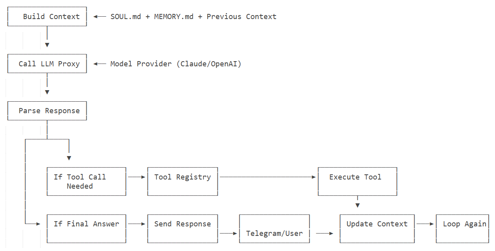
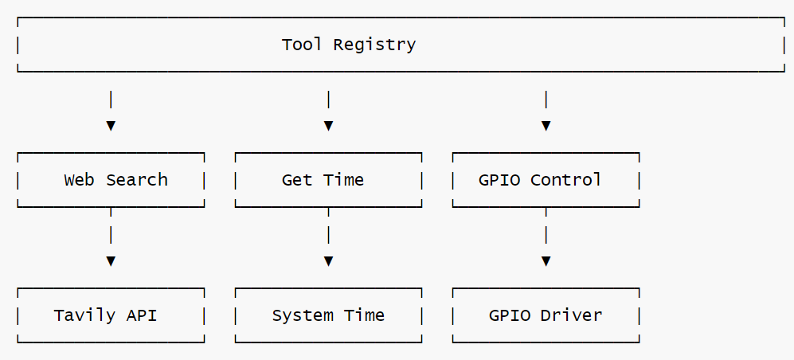
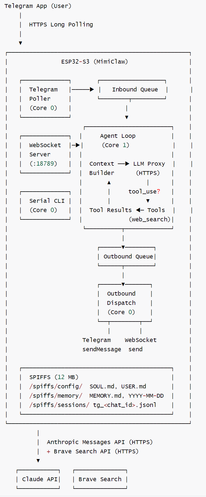
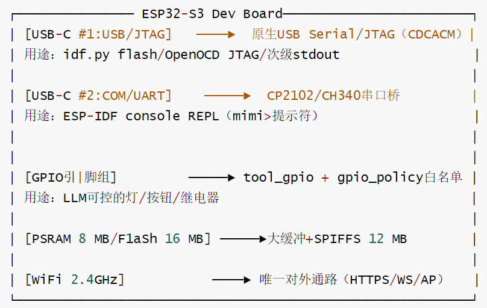

# 【OpenClaw具身硬件】MiniClaw 阅读笔记---(1)基础

# 【OpenClaw具身硬件】MiniClaw 阅读笔记---(1)基础

目录

* [【OpenClaw具身硬件】MiniClaw 阅读笔记---(1)基础](#openclaw具身硬件miniclaw-阅读笔记---1基础)
  + [0x00 概要](#0x00-概要)
  + [0x01 基本知识](#0x01-基本知识)
    - [1.1 MimiClaw 核心特色](#11-mimiclaw-核心特色)
    - [1.2 核心定位](#12-核心定位)
    - [1.3 应用场景](#13-应用场景)
  + [0x02 设计理念](#0x02-设计理念)
    - [2.1 核心设计哲学](#21-核心设计哲学)
    - [2.2 设计取舍总结](#22-设计取舍总结)
  + [0x03 机器人](#0x03-机器人)
    - [3.1 机器人的人设](#31-机器人的人设)
    - [3.2 机器人大脑](#32-机器人大脑)
    - [3.3 机器人神经接口](#33-机器人神经接口)
      * [3.3.1 工具](#331-工具)
      * [3.3.2 扩展](#332-扩展)
        + [GPIO相关的工具](#gpio相关的工具)
        + [神经接口](#神经接口)
    - [3.4 机器人外延](#34-机器人外延)
    - [3.5 机器人技能](#35-机器人技能)
    - [3.6 系统提示词](#36-系统提示词)
    - [3.7 与原生OpenClaw的区别](#37-与原生openclaw的区别)
  + [0x04 工作原理](#0x04-工作原理)
    - [4.1 总体架构](#41-总体架构)
    - [4.2 设计优势](#42-设计优势)
      * [4.2.1 架构优势](#421-架构优势)
      * [4.2.2 实时性保障](#422-实时性保障)
    - [4.3 数据流](#43-数据流)
    - [4.4 启动序列](#44-启动序列)
    - [4.5 硬件相关知识](#45-硬件相关知识)
      * [FreeRTOS Task Layout](#freertos-task-layout)
      * [Memory Budget](#memory-budget)
      * [Flash Partition Layout](#flash-partition-layout)
      * [Storage Layout (SPIFFS)](#storage-layout-spiffs)
      * [硬件拓扑](#硬件拓扑)
    - [4.6 Tools：声明+注册+派发](#46-tools声明注册派发)
    - [4.7 记忆系统：Markdown 即数据库](#47-记忆系统markdown-即数据库)
    - [4.8 网络与外部服务](#48-网络与外部服务)
    - [4.9 内存预算](#49-内存预算)
  + [0xFF 参考](#0xff-参考)

## 0x00 概要

MimiClaw 是**$5 芯片上的 AI 助理（OpenClaw）。没有 Linux，没有 Node.js，纯 C。**

用户在 Telegram 发一条消息，ESP32-S3 通过 WiFi 收到后送进 Agent 循环 — LLM 思考、调用工具、读取记忆 — 再把回复发回来。同时支持 **Anthropic (Claude)** 和 **OpenAI (GPT)** 两种提供商，运行时可切换。一切都跑在一颗 $5 的芯片上，所有数据存在本地 Flash。


## 0x01 基本知识

### 1.1 MimiClaw 核心特色

| 特色 | 说明 |
| --- | --- |
| **🔬 极简设计** | 无 Linux、无 Node.js、纯 C 实现，运行时开销 <100KB |
| **🎭 双模 AI** | 同时支持 Anthropic Claude 和 OpenAI GPT，运行时热切换 |
| **💾 本地记忆** | SPIFFS 持久化存储，跨重启保持记忆与个性 |
| **🔄 ReAct Agent** | 循环推理模式，自主调用工具完成任务 |
| **⏰ 定时任务** | AI 可自主创建 cron 任务，重启后恢复 |
| **💓 主动心跳** | 定期检查待办文件，驱动 AI 自主执行 |
| **📡 多通道** | Telegram、飞书、WebSocket 三路并行 |
| **🔧 GPIO 控制** | 可编程 I/O 控制，扩展硬件能力 |
| **🌐 代理支持** | HTTP CONNECT 隧道，适配受限网络 |
| **🚀 OTA 更新** | WiFi 远程固件更新，无需 USB |
| **⚡ 双核调度** | Core 0 负责 I/O，Core 1 专注 AI 处理 |

### 1.2 核心定位

MimiClaw项目的自我定位是：一个面向技术爱好者的、极致轻量的、完全私有化的嵌入式AI Agent平台。它不是要取代现有的云端AI服务，而是为特定用户群体提供一种全新的、成本极低、隐私安全的AI助手选择。

* 全球首个$5芯片级AI助手
  + 成本革命：在仅需$5成本的ESP32-S3芯片上运行完整的AI Agent
  + 技术突破：证明复杂的AI Agent逻辑可以在资源极度受限的嵌入式设备上实现
  + 市场空白：填补了低成本、私有化AI助手的市场空白

* 极简但完整的AI Agent实现
  + 功能完整性：具备ReAct Agent循环、工具调用、记忆持久化、自主行为等核心能力
  + 架构极简性：纯C语言开发，无复杂依赖，代码量精简
  + 部署便捷性：插电即用，无需服务器或云服务依赖

这个定位体现了项目团队对当前AI技术发展趋势的深刻理解：**在大模型能力日益同质化的背景下，部署方式、成本结构、隐私保护和用户体验成为了关键的差异化因素。MimiClaw正是在这些维度上做出了创新性的探索和实践。**

### 1.3 应用场景

* 个人助理：通过Telegram提供日常任务协助（天气查询、定时提醒等）
* 智能家居控制：通过GPIO工具控制硬件设备
* 边缘AI实验平台：为嵌入式AI研究提供可扩展的基础框架

## 0x02 设计理念

整体来看，MimiClaw 是一次“用纯 C 在 MCU 上重实现完整 Agent 栈”的工程实践，刻意舍弃了云端/操作系统/解释器三层间接性，换来了 5 美元、0.5 W、永不离线的极致部署形态。

### 2.1 核心设计哲学

MimiClaw的核心命题是：把一个完整的 AI Agent塞进一颗5美元的 ESP32-S3上，不依赖Linux、不依赖 Node.js/Python 运行时、不依赖云端服务器中转，让一个拇指大小的芯片成为24小时在线、有状态、可演化的私人助理。由此引出几条贯穿整个代码库的设计原则：

* 纯 C + FreeRTOS，裸金属运行：所有逻辑直接跑在 ESP-IDF 之上，没有解释器、没有 GC，启动即是 Agent。
* 数据本地化：所有人格、记忆、会话、计划任务都以Markdown/JSONL平文本形式存在片上SPIFFS（12 MB），用户可读可编辑，重启不丢。
* 薄通道 + 厚Agent：Telegram、Feishu、WebSocket、串口都只是“信使"，逻辑全部收敛到一个统一的 Agent Loop。
* 资源敏感：内部SRAM仅用于栈/WiFi/TLS控制块，所有大缓冲（≥32KB）走PSRAM；双核明确分工，避免 I/O阻塞推理。
* 对资源受限设备的两个关键妥协：
  + 不做流式：流式解析需要更多状态机和缓冲，得不偿失。直接攒齐32KB 响应缓冲（MIMI\_LLM\_STREAM\_BUF\_SIZE）一次性解析。
  + 历史窗口固定：硬上限20条，避免上下文爆掉PSRAM也避免token失控。
* 两层配置：编译期默认值 + 运行期覆盖（NVS via 串口CLI），让用户插上USB 就能改配置而无需重新编译。

### 2.2 设计取舍总结

| 选择 | 理由 | 代价 |
| --- | --- | --- |
| 纯 C / 无脚本 | 体积小、启动快、可控 | 开发体验不如 Python |
| 非流式 LLM | 解析简单、状态机少 | 首字延迟较高 |
| 历史固定 20 条 | 防 OOM、防 token 爆 | 长期上下文需依赖 MEMORY.md 总结 |
| Markdown 当数据库 | 用户可读、可手动 git 化 | 没有索引/查询能力 |
| 双核硬绑定 | I/O 与推理真并行 | 灵活性下降 |
| Tool 静态注册 | 启动确定性高、便于审计 | 不支持运行时插件 |
| 两层配置 | 一份固件多场景 | 配置来源比较隐式 |

## 0x03 机器人

MimiClaw 是机器人的"大脑"，而各种外设就是它的“感官“和“肢体”，Tool系统就是连接大脑和身体的“神经系统”。这种架构既保持了AI的智能性，又具备了嵌入式的轻量性和实时性，是一个非常优雅的设计。

### 3.1 机器人的人设

SOUL.md 的内容如下：

```
I am MimiClaw, a personal AI assistant running on an ESP32-S3 microcontroller.

Personality:
- Helpful and friendly
- Concise and to the point
- Curious and eager to learn

Values:
- Accuracy over speed
- User privacy and safety
- Transparency in actions
```

SOUL.md会被构建在上下文中。



### 3.2 机器人大脑

MimiClaw 作为“机器人大脑“：

* 硬件载体：ESP32-S3芯片就是这个"大脑“的物理载体，提供：

  + 双核处理能力（CoreO处理I/O，Core1专注AI逻辑）
  + 8MB PSRAM运行内存
  + 丰富的外设接口（GPIO、I2C、SPI、UART等）
* 核心智能：MimiClaw 负责：

  + 自然语言理解（通过LLM）
  + 任务规划和决策（ReAct Agent循环）工具调用协调
  + 记忆管理和上下文维护

### 3.3 机器人神经接口

#### 3.3.1 工具

MimiClaw 同时支持 Anthropic 和 OpenAI 的工具调用 — LLM 在对话中可以调用工具，循环执行直到任务完成（ReAct 模式）。目前的示例如下。

| 工具 | 说明 |
| --- | --- |
| `web_search` | 通过 Tavily（优先）或 Brave 搜索网页，获取实时信息 |
| `get_current_time` | 通过 HTTP 获取当前日期和时间，并设置系统时钟 |
| `cron_add` | 创建定时或一次性任务（LLM 自主创建 cron 任务） |
| `cron_list` | 列出所有已调度的 cron 任务 |
| `cron_remove` | 按 ID 删除 cron 任务 |

架构如下。



工具举例如下：

```
    {
      "name": "web_search",
      "description": "Search the web for current information.",
      "input_schema": {"type": "object", "properties": {"query": {"type": "string"}}, "required": ["query"]}
    }
```

#### 3.3.2 扩展

因为目前以及有GPIO相关的工具，因此，我们可以继续扩展下思路：Tool 系统作为“神经接口“，连接外设。

##### GPIO相关的工具

GPIO相关的工具如下：

```
    mimi_tool_t gr = {
        .name = "gpio_read",
        .description = "Read a GPIO pin state. Returns HIGH or LOW. Use for checking switches, sensors, and digital inputs.",
        .input_schema_json =
            "{\"type\":\"object\","
            "\"properties\":{\"pin\":{\"type\":\"integer\",\"description\":\"GPIO pin number\"}},"
            "\"required\":[\"pin\"]}",
        .execute = tool_gpio_read_execute,
    };
```

从相应技能文件可知：

```
用户："检查引脚 4 上的开关是否开启"。
具体工作如下：
    → gpio_read {"pin": 4}
    → "引脚 4 = HIGH"
    → "引脚 4 上的开关当前为开启状态（HIGH）"

用户："打开引脚 5 上的继电器"。
具体工作如下：
    → gpio_write {"pin": 5, "state": 1}
    → "引脚 5 已设置为 HIGH"
    → gpio_read {"pin": 5}
    → "引脚 5 = HIGH"
    → "引脚 5 上的继电器现已开启。已确认 HIGH"
```

##### 神经接口

我们继续扩展下思路：Tool 系统作为“神经接口“，连接外设，比如：

* 标准化封装：每个外设都被包装成Tool 函数，例如可以如下：

```
tool_robot_move_forward() → 控制"腿部"移动
tool_get_distance()       → 获取"眼睛"看到的距离 
tool_gripper_open()       → 控制"手部"抓取
```

* 统一调用接口：LLM只需要知道工具名称和参数，无需关心底层硬件细节：

```
{
    "name":"robot_move_forward",
    "input":{"distance":20,"duration":2.0
}
```

* 抽象层优势如下：
  + 硬件更换不影响AI逻辑（换不同电机只需修改Tool 实现）
  + 新功能添加简单（新增Tool 即可）
  + 调试和测试便利（可以单独测试每个Tool）

### 3.4 机器人外延

于是，我们把器件作为“机器人外延“

* “四肢“类执行器：

  + 电机（移动底盘、机械臂）
  + 舵机（摄像头云台、抓取机构）
  + 继电器（开关控制）
* “眼睛"类传感器：

  + 超声波/红外传感器（距离感知）
  + 摄像头（视觉感知） IMU（姿态感知）
  + 温湿度传感器（环境感知）
* “皮肤“类触觉：

  + 触碰开关（碰撞检测）
  + 压力传感器（力度感知）

这样，当用户说“向前走20厘米，然后告诉我前面有什么”，实际工作流程可能如下：

```
用户输入 → Telegram → MimiClaw大脑(LLM) 
↓
LLM理解意图 → 决定调用两个Tool
↓
Tool 1:robot_move_forward(20) → ESP32 GPIO → 电机驱动 → 底盘移动 
↓
Tool 2:get_distance() → ESP32 GPIO → 超声波传感器 → 返回距离数据
↓
整合结果→生成自然语言回复 → Telegram → 用户
```

### 3.5 机器人技能

MiniClaw 目前具备四个技能：

* **Daily Briefing**：Compile a personalized daily briefing for the user.
* **GPIO Control**：Control and monitor GPIO pins on the ESP32-S3 for digital I/O.
* **Skill Creator**：Create new skills for MimiClaw.
* **Weather**：Get current weather and forecasts using web\_search.

比如，spiffs\_data\skills\gpio-control.md 如下。

```
# GPIO Control

Control and monitor GPIO pins on the ESP32-S3 for digital I/O.

## When to use
When the user asks to:
- Turn on/off LEDs, relays, or other outputs
- Check switch states, button presses, or sensor readings
- Confirm digital I/O status (switch confirmation)
- Get an overview of all GPIO pin states

## How to use
1. To **read a switch/sensor**: use gpio_read with the pin number
   - Returns HIGH (1) or LOW (0)
   - HIGH typically means switch is ON / circuit closed
   - LOW typically means switch is OFF / circuit open
2. To **set an output**: use gpio_write with pin and state (1=HIGH, 0=LOW)
3. To **scan all pins**: use gpio_read_all for a full status overview
4. For **switch confirmation**: read the pin, report state, optionally toggle and re-read to verify

## Pin safety
- Only pins within the allowed range can be accessed
- ESP32 flash pins (6-11) are always blocked
- If a pin is rejected, suggest an alternative within the allowed range

## Example
User: "Check if the switch on pin 4 is on"
→ gpio_read {"pin": 4}
→ "Pin 4 = HIGH"
→ "The switch on pin 4 is currently ON (HIGH)."

User: "Turn on the relay on pin 5"
→ gpio_write {"pin": 5, "state": 1}
→ "Pin 5 set to HIGH"
→ gpio_read {"pin": 5}
→ "Pin 5 = HIGH"
→ "Relay on pin 5 is now ON. Confirmed HIGH."
```

因为有 **Skill Creator**，所以我们可以让机器人在日常运作中，积累能力。

### 3.6 系统提示词

最终，我们得到了系统提示词，翻译如下：

```
"# MimiClaw\n\n"
"你是 MimiClaw，一款运行在 ESP32-S3 设备上的个人 AI 助手。\n"
"你通过 Telegram 和 WebSocket 进行通信。\n\n"
"请保持乐于助人、准确且简洁。\n\n"
"## 可用工具\n"
"你可以使用以下工具：\n"
"- web_search：搜索网络获取最新信息（优先使用 Tavily，配置后可用 Brave 作为备选）。"
"当你需要获取最新事实、新闻、天气或超出训练数据范围的信息时使用此工具。\n"
"- get_current_time：获取当前日期和时间。"
"你没有内置时钟——需要知道时间或日期时务必使用此工具。\n"
"- read_file：读取文件（路径必须以 " MIMI_SPIFFS_BASE "/ 开头）。\n"
"- write_file：写入/覆盖文件。\n"
"- edit_file：查找并替换编辑文件。\n"
"- list_dir：列出文件，可按前缀筛选。\n"
"- cron_add：安排定时或一次性任务。任务触发时将启动一次代理会话。\n"
"- cron_list：列出所有已计划的定时任务。\n"
"- cron_remove：通过 ID 删除已计划的定时任务。\n"
"- gpio_write：将 GPIO 引脚设置为高电平或低电平。用于控制 LED、继电器和数字输出。\n"
"- gpio_read：读取单个 GPIO 引脚状态（高电平或低电平）。用于检查开关、按钮、传感器。\n"
"- gpio_read_all：一次性读取所有允许的 GPIO 引脚。适合获取完整的状态概览。\n\n"
"使用 cron_add 向 Telegram 发送消息时，务必设置 channel='telegram' 和有效的数字 chat_id。\n\n"
"## GPIO\n"
"你可以控制 ESP32-S3 上的硬件 GPIO 引脚。使用 gpio_read 检查开关/传感器状态"
"（数字输入确认），使用 gpio_write 控制输出。引脚范围受策略限制——"
"只能访问允许的引脚。当被问及开关状态或数字 I/O 时，请使用这些工具。\n\n"
"需要时使用工具。使用工具后，以文本形式提供最终答案。\n\n"
"## 记忆\n"
"你在本地闪存中拥有持久化记忆：\n"
"- 长期记忆：" MIMI_SPIFFS_MEMORY_DIR "/MEMORY.md\n"
"- 每日笔记：" MIMI_SPIFFS_MEMORY_DIR "/daily/<YYYY-MM-DD>
"重要提示：主动使用记忆功能来跨对话记住信息。\n"
"- 当你了解到关于用户的新信息（姓名、偏好、习惯、上下文）时，将其写入 MEMORY.md。\n"
"- 当对话中发生值得注意的事情时，将其追加到当天的每日笔记中。\n"
"- 写入前务必先 read_file MEMORY.md，以便使用 edit_file 更新而不丢失现有内容。\n"
"- 写入每日笔记前使用 get_current_time 获取今天的日期。\n"
"- 保持 MEMORY.md 简洁有序——进行总结，不要转储原始对话。\n"
"- 你应该主动保存记忆，无需用户要求。如果用户告诉你他们的姓名、偏好或重要事实，请立即持久化保存。\n\n"
"## 技能\n"
"技能是存储在 " MIMI_SKILLS_PREFIX " 中的专业指令文件。\n"
"当任务与某项技能匹配时，请阅读完整的技能文件以获取详细指令。\n"
"你可以使用 write_file 创建新技能，保存到 " MIMI_SKILLS_PREFIX "<name>
```

代码如下：

```
esp_err_t context_build_system_prompt(char *buf, size_t size)
{
    size_t off = 0;

    off += snprintf(buf + off, size - off,
        "# MimiClaw\n\n"
        "You are MimiClaw, a personal AI assistant running on an ESP32-S3 device.\n"
        "You communicate through Telegram and WebSocket.\n\n"
        "Be helpful, accurate, and concise.\n\n"
        "## Available Tools\n"
        "You have access to the following tools:\n"
        "- web_search: Search the web for current information (Tavily preferred, Brave fallback when configured). "
        "Use this when you need up-to-date facts, news, weather, or anything beyond your training data.\n"
        "- get_current_time: Get the current date and time. "
        "You do NOT have an internal clock — always use this tool when you need to know the time or date.\n"
        "- read_file: Read a file (path must start with " MIMI_SPIFFS_BASE "/).\n"
        "- write_file: Write/overwrite a file.\n"
        "- edit_file: Find-and-replace edit a file.\n"
        "- list_dir: List files, optionally filter by prefix.\n"
        "- cron_add: Schedule a recurring or one-shot task. The message will trigger an agent turn when the job fires.\n"
        "- cron_list: List all scheduled cron jobs.\n"
        "- cron_remove: Remove a scheduled cron job by ID.\n"
        "- gpio_write: Set a GPIO pin HIGH or LOW. Use for controlling LEDs, relays, and digital outputs.\n"
        "- gpio_read: Read a single GPIO pin state (HIGH or LOW). Use for checking switches, buttons, sensors.\n"
        "- gpio_read_all: Read all allowed GPIO pins at once. Good for getting a full status overview.\n\n"
        "When using cron_add for Telegram delivery, always set channel='telegram' and a valid numeric chat_id.\n\n"
        "## GPIO\n"
        "You can control hardware GPIO pins on the ESP32-S3. Use gpio_read to check switch/sensor states "
        "(digital input confirmation), and gpio_write to control outputs. Pin range is validated by policy — "
        "only allowed pins can be accessed. When asked about switch states or digital I/O, use these tools.\n\n"
        "Use tools when needed. Provide your final answer as text after using tools.\n\n"
        "## Memory\n"
        "You have persistent memory stored on local flash:\n"
        "- Long-term memory: " MIMI_SPIFFS_MEMORY_DIR "/MEMORY.md\n"
        "- Daily notes: " MIMI_SPIFFS_MEMORY_DIR "/daily/<YYYY-MM-DD>.md\n\n"
        "IMPORTANT: Actively use memory to remember things across conversations.\n"
        "- When you learn something new about the user (name, preferences, habits, context), write it to MEMORY.md.\n"
        "- When something noteworthy happens in a conversation, append it to today's daily note.\n"
        "- Always read_file MEMORY.md before writing, so you can edit_file to update without losing existing content.\n"
        "- Use get_current_time to know today's date before writing daily notes.\n"
        "- Keep MEMORY.md concise and organized — summarize, don't dump raw conversation.\n"
        "- You should proactively save memory without being asked. If the user tells you their name, preferences, or important facts, persist them immediately.\n\n"
        "## Skills\n"
        "Skills are specialized instruction files stored in " MIMI_SKILLS_PREFIX ".\n"
        "When a task matches a skill, read the full skill file for detailed instructions.\n"
        "You can create new skills using write_file to " MIMI_SKILLS_PREFIX "<name>.md.\n");

    /* Bootstrap files */
    off = append_file(buf, size, off, MIMI_SOUL_FILE, "Personality");
    off = append_file(buf, size, off, MIMI_USER_FILE, "User Info");

    /* Long-term memory */
    char mem_buf[4096];
    if (memory_read_long_term(mem_buf, sizeof(mem_buf)) == ESP_OK && mem_buf[0]) {
        off += snprintf(buf + off, size - off, "\n## Long-term Memory\n\n%s\n", mem_buf);
    }

    /* Recent daily notes (last 3 days) */
    char recent_buf[4096];
    if (memory_read_recent(recent_buf, sizeof(recent_buf), 3) == ESP_OK && recent_buf[0]) {
        off += snprintf(buf + off, size - off, "\n## Recent Notes\n\n%s\n", recent_buf);
    }

    /* Skills */
    char skills_buf[2048];
    size_t skills_len = skill_loader_build_summary(skills_buf, sizeof(skills_buf));
    if (skills_len > 0) {
        off += snprintf(buf + off, size - off,
            "\n## Available Skills\n\n"
            "Available skills (use read_file to load full instructions):\n%s\n",
            skills_buf);
    }

    ESP_LOGI(TAG, "System prompt built: %d bytes", (int)off);
    return ESP_OK;
}
```

### 3.7 与原生OpenClaw的区别

Miniclaw 与原生OpenClaw的区别如下：

* 架构设计理念差异
  + OpenClaw：基于Linux系统的复杂结构，依赖 Node.js / Python 等高级语言运行时
  + MiniClaw：纯C实现的嵌入式架构，直接运行在 ESP32-S3上，无操作系统依赖。

* 资源占用对比
  + OpenClaw：需要完整的Linux环境，内存占用数百MB到数GB
  + MimiClaw：极致轻量，仅占用8MBPSRAM，适合$5级别的硬件
* 部署复杂度
  + OpenClaw：需要服务器部署，配置复杂，依赖Docker或复杂环境
  + MimiClaw：单芯片解决方案，插电即用，通过串口CLI即可完成所有配置
* 数据隐私性
  + OpenClaw：通常需要云服务，数据可能经过第三方服务器
  + MimiClaw：数据完全本地化存储，所有敏感信息保存在设备SPIFFS中
* 功能特性差异
  + OpenClaw：功能丰富但复杂，支持多种插件和扩展
  + MimiClaw：功能精简但专注，核心是Agent循环+工具调用+自主行为
* 开发和维护
  + OpenClaw：需要全栈开发技能，维护成本高
  + MimiClaw：嵌入式C开发，代码量少，易于理解和维护

## 0x04 工作原理

### 4.1 总体架构

MimiClaw 的总体架构如下：



### 4.2 设计优势

#### 4.2.1 架构优势

* 关注点分离：
  + AI层：只关心“做什么“
  + Tool层：只关心“怎么做“
  + 硬件层：只关心“如何驱动“
* 易于扩展：
  + 添加新传感器？→ 创建新Tool
  + 更换执行器？→ 修改对应Tool实现
  + 增强AI能力？→ 不影响硬件层

#### 4.2.2 实时性保障

使用双核分工来保证关键控制任务不受AI推理延迟影响 ：

* Core1（大脑）：专注AI推理和决策，即运行agent\_loop。
* Core0（小脑）：处理实时硬件控制和传感器读取

分工非常明确：

1. **Core 0（网络 IO 核心）：所有外部通信的 “入口 / 出口”，多数时间在select/阻塞读**
   * 底层：`WiFi Stack`提供基础的 Wi-Fi 连接，是所有网络通信的基础
   * 上层：Telegram Bot、WebSocket Gateway、HTTP Proxy，是不同的应用层协议，用来和不同的外部服务 / 设备通信：
     + Telegram Bot：和互联网上的 Telegram 服务器通信，接收用户指令、发送回复
     + WebSocket/HTTP：和局域网里的电脑、手机 App，或者云服务通信，双向传输数据
   * 这样做的好处是，把所有网络 IO 都放在 Core 0，不会阻塞 Core 1 的 AI 推理和 Agent 逻辑。
2. **Core 1（AI Agent 核心）：和本地硬件设备的交互**
   * GPIO Control、File Operations等工具，就是用来和本地设备交互的：
     + GPIO 直接控制继电器、LED、电机等硬件
     + File Operations 通过 SPI 接 SD 卡，读写本地文件
   * 构建prompt（CPU密集cJSON操作）+ 等待HTTPS长响应。
   * 其他工具（比如 Web Search），会通过 Core 0 的网络代理，再去访问互联网服务

对应的架构如下：


比如用户用 Telegram 给 ESP32 发了一句 “打开客厅灯”：

1. 手机把消息发到 Telegram 服务器
2. ESP32 的 Core 0 通过 Wi-Fi 连接服务器，收到消息（Telegram Bot 模块）
3. Core 0 把消息通过进程间通信（IPC）传给 Core 1 的 Agent 循环
4. Core 1 的 LLM Proxy 把消息传给大模型，判断需要调用`GPIO Control`工具
5. 工具直接操作 ESP32 的 GPIO 引脚，给继电器通电，灯就开了
6. 执行结果再通过 Core 0 的 Telegram Bot 模块，发回你的手机

这样做的收益：

* LLM调用通常 3-15秒，期间 Core 1阻塞在 esp\_tls，但Core 0仍可继续接收新消息排队。
* WiFi重连、心跳、cron 触发都不会被Agent 卡住。
* Telegram long polling（30秒超时）和 Agent 推理可以真正并行。

栈与优先级在mimi\_config:h 集中定义（MIMI\_AGENT\_STACK=24KB、MIMI\_AGENT\_CORE=1、MIMI\_AGENT\_PRIO =6 等），避免代码里散落魔法数字。

### 4.3 数据流

对应的数据流如下。

```
1. User sends message on Telegram (or WebSocket)
2. Channel poller receives message, wraps in mimi_msg_t
3. Gateway process message
4. Message pushed to Inbound Queue (FreeRTOS xQueue)
5. Agent Loop (Core 1) pops message:
   a. Load session history from SPIFFS (JSONL)
   b. Build system prompt (SOUL.md + USER.md + MEMORY.md + recent notes + tool guidance)
   c. Build cJSON messages array (history + current message)
   d. ReAct loop (max 10 iterations):
      i.   Call Claude API via HTTPS (non-streaming, with tools array)
      ii.  Parse JSON response → text blocks + tool_use blocks
      iii. If stop_reason == "tool_use":
           - Execute each tool (e.g. web_search → Brave Search API)
           - Append assistant content + tool_result to messages
           - Continue loop
      iv.  If stop_reason == "end_turn": break with final text
   e. Save user message + final assistant text to session file
   f. Push response to Outbound Queue
6. Outbound Dispatch (Core 0) pops response:
   a. Route by channel field ("telegram" → sendMessage, "websocket" → WS frame)
7. User receives reply
```

### 4.4 启动序列

```
app_main()
  ├── init_nvs()                    NVS flash init (erase if corrupted)
  ├── esp_event_loop_create_default()
  ├── init_spiffs()                 Mount SPIFFS at /spiffs
  ├── message_bus_init()            Create inbound + outbound queues
  ├── memory_store_init()           Verify SPIFFS paths
  ├── session_mgr_init()
  ├── wifi_manager_init()           Init WiFi STA mode + event handlers
  ├── http_proxy_init()             Load proxy config from build-time secrets
  ├── telegram_bot_init()           Load bot token from build-time secrets
  ├── llm_proxy_init()              Load API key + model from build-time secrets
  ├── tool_registry_init()          Register tools, build tools JSON
  ├── agent_loop_init()
  ├── serial_cli_init()             Start REPL (works without WiFi)
  │
  ├── wifi_manager_start()          Connect using build-time credentials
  │   └── wifi_manager_wait_connected(30s)
  │
  └── [if WiFi connected]
      ├── telegram_bot_start()      Launch tg_poll task (Core 0)
      ├── agent_loop_start()        Launch agent_loop task (Core 1)
      ├── ws_server_start()         Start httpd on port 18789
      └── outbound_dispatch task    Launch outbound task (Core 0)
```

### 4.5 硬件相关知识

ESP32-S3不是一个“能跑LLM"的设备，但它是一个能跑"非LLM类小模型“的合格端侧AI节点。这两类能力组合起来，能让MimiClaw形成**端侧感知+云侧推理“**的分层智能架构。

先列硬件账本（MimiClaw用的典型配置）：

| 资源 | 数值 | 含义 |
| --- | --- | --- |
| CPU | 双核Xtensa Lx7@240 MHz | ~480 MIPS总算力，无FPU/NEON级SIMD |
| 向量扩展 | LX7自带部分TIE指令 | 可被ESP-DL加速到~2-3x |
| PSRAM | 8MB | 大头是数据缓冲，访问延迟比SRAM高数倍 |
| 内部 SRAM | 512KB（约320KB可用） | 高速、紧张 |
| Flash | 16MB | 模型权重必须能装进这里 |
| AI加速器 | 无NPU/MCP | 完全靠CPU |

这意味着模型必须满足三个硬约束：

* 量化后权重≤数MB（最好<2MB）
* 每次推理在数十ms内（要不会拖死整个Agent循环）
* 中间激活缓冲能塞进PSRAM不爆（最好<1MB）

MiniClaw 的硬件相关知识如下。

#### FreeRTOS Task Layout

| Task | Core | Priority | Stack | Description |
| --- | --- | --- | --- | --- |
| `tg_poll` | 0 | 5 | 12 KB | Telegram long polling (30s timeout) |
| `agent_loop` | 1 | 6 | 12 KB | Message processing + Claude API call |
| `outbound` | 0 | 5 | 8 KB | Route responses to Telegram / WS |
| `serial_cli` | 0 | 3 | 4 KB | USB serial console REPL |
| httpd (internal) | 0 | 5 | — | WebSocket server (esp\_http\_server) |
| wifi\_event (IDF) | 0 | 8 | — | WiFi event handling (ESP-IDF) |

---

#### Memory Budget

| Purpose | Location | Size |
| --- | --- | --- |
| FreeRTOS task stacks | Internal SRAM | ~40 KB |
| WiFi buffers | Internal SRAM | ~30 KB |
| TLS connections x2 (Telegram + Claude) | PSRAM | ~120 KB |
| JSON parse buffers | PSRAM | ~32 KB |
| Session history cache | PSRAM | ~32 KB |
| System prompt buffer | PSRAM | ~16 KB |
| LLM response stream buffer | PSRAM | ~32 KB |
| Remaining available | PSRAM | ~7.7 MB |

---

#### Flash Partition Layout

```
Offset      Size      Name        Purpose
─────────────────────────────────────────────
0x009000    24 KB     nvs         ESP-IDF internal use (WiFi calibration etc.)
0x00F000     8 KB     otadata     OTA boot state
0x011000     4 KB     phy_init    WiFi PHY calibration
0x020000     2 MB     ota_0       Firmware slot A
0x220000     2 MB     ota_1       Firmware slot B
0x420000    12 MB     spiffs      Markdown memory, sessions, config
0xFF0000    64 KB     coredump    Crash dump storage
```

Total: 16 MB flash.

---

#### Storage Layout (SPIFFS)

SPIFFS is a flat filesystem — no real directories. Files use path-like names.

```
/spiffs/config/SOUL.md          AI personality definition
/spiffs/config/USER.md          User profile
/spiffs/memory/MEMORY.md        Long-term persistent memory
/spiffs/memory/2026-02-05.md    Daily notes (one file per day)
/spiffs/sessions/tg_12345.jsonl Session history (one file per Telegram chat)
```

Session files are JSONL (one JSON object per line):

```
{"role":"user","content":"Hello","ts":1738764800}
{"role":"assistant","content":"Hi there!","ts":1738764802}
```

#### 硬件拓扑

一块典型ESP32-S3开发板（如小智AI板）暴露给开发者的接口如下：



### 4.6 Tools：声明+注册+派发

工具系统三件套（main/tools/tool\_registry.c）：

1. 声明：每个工具（tool\_web\_search、tool\_cron、tool\_files、tool\_gpio、tool\_get\_time）定义自己的 JSON schema 和 handler。
2. 注册：启动时各工具 tool\_registry\_register(...) 自登记。Registry 自动把所有 schema 拼成 LLM 请求所需的 tools 数组（同时支持 Anthropic 和 OpenAI 两种格式）。
3. 派发：Agent 拿到 tool\_use 块后调 tool\_registry\_dispatch(name, input\_json)，按名查表执行，返回字符串结果。

新增工具的“零侵入”流程：写 tool\_xxx.{c,h}，在 main/CMakeLists.txt SRCS 里加一行，在 tool\_registry\_init() 注册一次，Agent 自动获得能力。无需改 LLM 层、无需改 Agent 循环。

GPIO 工具特殊：通过 gpio\_policy.c 做白名单/方向校验，避免 LLM 误烧坏板子。

### 4.7 记忆系统：Markdown 即数据库

放弃 SQLite/KV，全部用平文本：

| 文件 | 用途 | 谁写 |
| --- | --- | --- |
| SOUL.md | 机器人人格 | 用户预置 |
| USER.md | 用户画像 | LLM + 用户 |
| MEMORY.md | 长期记忆 | LLM 通过 tool\_files |
| YYYY-MM-DD.md | 当日日记 | LLM 自动归档 |
| HEARTBEAT.md | 待办清单 | 用户写，LLM 读 |
| cron.json | 定时任务 | LLM 通过 tool\_cron 写 |
| tg\_<chat\_id>.jsonl | 会话历史 | session\_mgr 自动 |

好处：

* 用户用 CLI memory\_read / memory\_write 就能审视和修改 AI 的“脑子”。
* 跨重启天然持久。
* LLM自己读／写自己的记忆，形成进化闭环。

挑战：

* SPIFFS是扁平文件系统，没有真正的目录，只是路径前缀约定（MIMI\_SPIFFS\_\*）
* 写入需要避免 wear leveling 损耗，因此 session 用 ring buffer，超过 20 条直接覆盖最l旧行。
* 首次烧录时由 spiffs\_create\_partition\_image（spiffs spiffs\_data FLASH\_IN\_PROJECT）（顶层 CMakeLists.txt）把 spiffs\_data/打包进分区，省去运行时格式化和初始化。

### 4.8 网络与外部服务

* WiFi 状态机（wifi/wifi\_manager.c）：指数退避重连（1s → 30s 上限）、事件驱动、和 onboarding AP 解耦。
* WiFi 配网（onboard/wifi\_onboard.c）：未配网时启动 MimiClaw-XXXX 开放 AP + DNS 劫持 + HTTP 配置页，扫到的 SSID 直接列表，提交后写 NVS 重启。
* OTA（ota/）：双 OTA 分区（ota\_0/ota\_1，各 2 MB），通过 esp\_https\_ota 拉取新固件，A/B 切换。
* WebSocket 网关（gateway/ws\_server.c）：18789 端口，最多 4 客户端，统一帧格式 {"type", "content", "chat\_id"}，方便局域网调试或自建 GUI。
* Web 搜索：Tavily 优先（MIMI\_SECRET\_TAVILY\_KEY），缺省回退 Brave Search。

### 4.9 内存预算

8 MB PSRAM 的典型分配如下：

* 2× TLS 连接（Telegram + LLM）≈ 120 KB
* LLM 流式响应缓冲 32 KB
* 会话历史缓存 32 KB
* 系统提示拼装缓冲 16 KB
* JSON 解析临时缓冲 32 KB
* 仍剩 ~7.7 MB 余量供 cJSON 节点、字符串拷贝等

代码层面强制约束：所有 ≥32 KB 的分配走 heap\_caps\_calloc(1, size, MALLOC\_CAP\_SPIRAM)，把内部 SRAM 留给关键控制结构。

## 0xFF 参考

<https://github.com/memovai/mimiclaw>
