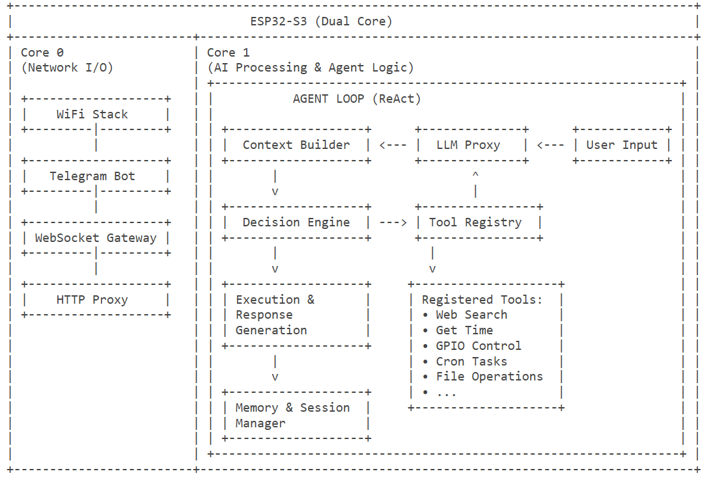

# 【OpenClaw具身硬件】MiniClaw 阅读笔记---(2)钉核 & 上下文

# 【OpenClaw具身硬件】MiniClaw 阅读笔记---(2)钉核 & 上下文

目录

* [【OpenClaw具身硬件】MiniClaw 阅读笔记---(2)钉核 & 上下文](#openclaw具身硬件miniclaw-阅读笔记---2钉核--上下文)
  + [0x00 概要](#0x00-概要)
  + [0x01 双核配置](#0x01-双核配置)
    - [1.1 ESP32-S3 核](#11-esp32-s3-核)
    - [1.2 MimiClaw实际的钉核决策](#12-mimiclaw实际的钉核决策)
    - [1.3 钉核原因](#13-钉核原因)
      * [引力1：WiFi/lwIP协议栈默认绑Core 0](#引力1wifilwip协议栈默认绑core-0)
      * [引力 2：HTTPS + cJSON是真正的 CPU大户，需要独占核](#引力-2https--cjson是真正的-cpu大户需要独占核)
      * [引力 3：FreeRTOS任务亲和性API 鼓励显式分核](#引力-3freertos任务亲和性api-鼓励显式分核)
    - [1.4 如果改成单核或反过来钉，会怎样？](#14-如果改成单核或反过来钉会怎样)
    - [1.5 一句话总结](#15-一句话总结)
  + [0x02 上下文工程策略特色](#0x02-上下文工程策略特色)
    - [2.1 整体策略：分层装配，单缓冲一锤定音。](#21-整体策略分层装配单缓冲一锤定音)
    - [2.2 五条特色策略](#22-五条特色策略)
      * [特色1：静态指令+动态文件的“双层“系统提示](#特色1静态指令动态文件的双层系统提示)
      * [特色2：分级时间窗的记忆一长期/近期/当前](#特色2分级时间窗的记忆一长期近期当前)
      * [特色3：Skills是“目录页+按需取阅"，不是全量灌入](#特色3skills是目录页按需取阅不是全量灌入)
      * [特色4：会话历史用RingBuffer截断，硬上限即护栏](#特色4会话历史用ringbuffer截断硬上限即护栏)
      * [特色5：上下文是prompt工程纪律，不是数据结构](#特色5上下文是prompt工程纪律不是数据结构)
    - [2.3 和云端Agent的对照表](#23-和云端agent的对照表)
  + [0x03 SOUL.md与Prompt压缩的表达得失](#0x03-soulmd与prompt压缩的表达得失)
    - [3.1 为什么必须被压缩？](#31-为什么必须被压缩)
    - [3.2 表达策略](#32-表达策略)
      * [手法1：用“标签+形容词“代替“叙事+例子“](#手法1用标签形容词代替叙事例子)
      * [手法2：用类别（Personality/Values）做语义分组](#手法2用类别personalityvalues做语义分组)
      * [手法3：断言式英语，零修辞、零反例](#手法3断言式英语零修辞零反例)
    - [3.3 压缩带来的“失“](#33-压缩带来的失)
      * [失1：人格趋同](#失1人格趋同)
      * [失2：复杂指令丢失](#失2复杂指令丢失)
      * [失3：风格不可学习](#失3风格不可学习)
      * [失4：跨语言表达单薄](#失4跨语言表达单薄)
    - [3.4 压缩带来的“得“](#34-压缩带来的得)
    - [3.5 可能的折中：分层SOUL](#35-可能的折中分层soul)
      * [思路1：核心SOUL+可选片段](#思路1核心soul可选片段)
      * [思路2：用few-shot取代抽象形容词](#思路2用few-shot取代抽象形容词)
      * [思路3：用元数据替代散文](#思路3用元数据替代散文)
      * [思路4：让记忆反哺人格](#思路4让记忆反哺人格)
    - [7.6 小结](#76-小结)
  + [0xFF 参考](#0xff-参考)

## 0x00 概要

MimiClaw 是**$5 芯片上的 AI 助理（OpenClaw）。没有 Linux，没有 Node.js，纯 C。**

用户在 TG 发一条消息，ESP32-S3 通过 WiFi 收到后送进 Agent 循环 — LLM 思考、调用工具、读取记忆 — 再把回复发回来。同时支持 **Anthropic (Claude)** 和 **OpenAI (GPT)** 两种提供商，运行时可切换。一切都跑在一颗 $5 的芯片上，所有数据存在本地 Flash。


---

本篇会对MiniClaw 的思路和实现细节做进一步讨论。

## 0x01 双核配置

MiniClaw 使用双核分工来保证关键控制任务不受AI推理延迟影响 ：

* Core1（大脑）：专注AI推理和决策，即运行agent\_loop。
* Core0（小脑）：处理实时硬件控制和传感器读取

对应的架构如下：



### 1.1 ESP32-S3 核

ESP32-S3的核到底是怎样的？具体如下：

| 维度 | 实际情况 |
| --- | --- |
| 核数 | 2个Xtensa LX7（240MHz） |
| 对称性 | 完全对称（SMP）一指令集、缓存、外设访问权限都一致 |
| 命名 | Core 0=PRO\_CPU，Core 1=APP\_CPU（命名是历史习惯，硬件上没区别） |
| FreeRTOS | ESP-IDF跑的是 SMP FreeRTOS，任意任务可调度到任意核 |
| 中断 | 中断可以路由到任一核（启动时按“谁先attach谁拿“的策略） |

结论：硬件层面，两个核是平等的，没有“必须谁干I/O、谁干计算“的规则。这一点和 ARM big.LITTLE（异构）或Cortex-M 单核完全不同。

为什么Mimiclaw还是把I/O 钉在Core 0、Agent钉在Core 1？这是因为有几条“事实上的引力“把任务往特定核拉。

### 1.2 MimiClaw实际的钉核决策

| 任务 | 绑定 | 真正原因 |
| --- | --- | --- |
| tg\_poll（TG 长轮询） | Core 0 | 紧贴 WiFi 栈，网络密集 |
| Feishu webhook poller | Core 0 | 同上 |
| ws\_server（httpd） | Core 0 | 同上 |
| outbound 派发 | Core 0 | 输出走网络 |
| serial\_cli | Core 0 | UART ISR 默认在 Core 0；CLI 几乎不耗 CPU，跟 I/O 一起放无影响 |
| agent\_loop | Core 1 | 唯一 CPU 重活，需要独占核 |
| WiFi 内部任务 | Core 0（IDF 默认） | 没去改 |
| cron / heartbeat | 没强制绑（用默认） | 触发频率极低，无所谓 |

可以看到：Core 1上几乎只有agent\_loop在跑，这是有意识地“留白"—让LLM推理路径享受最低延迟、最少抢占。

### 1.3 钉核原因

#### 引力1：WiFi/lwIP协议栈默认绑Core 0

ESP-IDF的WiFi驱动有一个kconfig选项CONFIG\_ESP\_WIFI\_TASK\_CORE\_ID，默认值是0。它本身可以改成1或  
NO\_AFFINITY；但绝大多数项目（包括 MimiClaw）保持默认。这带来的连锁反应：

* WiFi 中断处理、RX/TX任务都跑在Core 0。
* lwIP 的 tcpip\_thread 也通常跟在 Core 0。
* 这意味着网络收包路径已经在Core 0占了一块时间片。

如果把TG poller、WS server、HTTPS 客户端再放 Core 1，每次收包都要跨核唤醒一增加上下文切换、缓存抖动和不可预测延迟。

把“用网络的人“和“实现网络的人“放同一核，是性能上几乎免费的优化。这条不是硬限，但调整代价很高，所以在工程上接近硬限。

#### 引力 2：HTTPS + cJSON是真正的 CPU大户，需要独占核

* 一次 LLM 请求要构建几 KB 到几十 KB的 cJSON树，再序列化、TLS 加密。
* 收回来的4KB-32KB响应要TLS解密+cJSON解析。

* 这两段是MimiClaw里唯一能持续打满一个核的工作。

如果让它和WiFi/lwIP抢Core 0:

* 推理期间网络中断响应会变慢，长轮询超时风险增加。
* TLS握手中如果被 WiFi中断频繁打断，握手时间会显著拉长。
* 串口CLI的 REPL可能"卡住"，影响调试体验。

所以把Agent钉到Core 1，本质是给重CPU任务一个安静的"专核"环境，不被WiFi中断和 I/O 任务搅扰。这是纯软件设计选择，硬件没有要求这么做。

#### 引力 3：FreeRTOS任务亲和性API 鼓励显式分核

ESP-IDF 提供的 xTaskCreatePinnedToCore（...，core\_id）让你必须显式选核或写 tskNO\_AFFINITY（让调度器自由迁移）

* 写tskNO\_AFFINITY看似省事，但任务在两核之间漂移会导致 cachemiss、TLS上下文切换成本高。
* 多数ESP-IDF教程和开源项目采用“显式钉核“风格。
* MimiClaw跟这条主流约定走，所以 mimi\_config.h 里每个任务都有 MIMI\_\*\_CORE 宏。

这是生态惯例，不是硬件限制。

### 1.4 如果改成单核或反过来钉，会怎样？

我们做几个反事实推演，能更清楚看出“是设计选择还是硬限"：

| 方案 | 结果 | 说明 |
| --- | --- | --- |
| 全 NO\_AFFINITY（让 SMP 调度器自由迁移） | 能跑，但 TLS 握手抖动会变大，PSRAM cache miss 增多 | 证明硬件不强制 |
| Agent 钉 Core 0、I/O 钉 Core 1 | 能跑，但跨核唤醒成本翻倍，因为 WiFi 中断在 Core 0 | 证明 WiFi 软约束的影响 |
| 全部跑 Core 0（关掉 Core 1） | 也能跑，性能下降明显——LLM 调用期间整个机器看起来“假死” | 证明只是性能问题，不是功能问题 |
| WiFi 也改到 Core 1 | 改 kconfig 即可，但 lwIP 配套调整有一堆隐式坑 | 证明默认 Core 0 是软约束但不轻易动 |

如果是ESP32-C3（单核RISC-V）那种型号，MimiClaw这套架构理论上也能跑，只是所有任务排队共享一个核，LLM推理期间网络/CLI响应会明显变慢一但这是性能退化而不是功能不可用。

### 1.5 一句话总结

双核分工不是ESP32-S3硬件强迫的产物一两个核硬件上完全对称。

但WiFi协议栈默认在Core 0这条IDF软约束，加上LLM推理是唯一持续打满CPU的任务这个工作负载特征，让"I/O留 Core 0、Agent独占Core 1成为唯一在工程上明智的分法。

所以更准确的说法是：硬件给了对称双核这个机会，软件生态和负载画像把分工塑造成了今天的样子。

如果哪天换了一颗单核MCU，MimiClaw的代码框架基本不需要重写，只是性能会差一截；如果换到四核 SoC（比如 ESP32-P4），就有空间把“工具调度“或“记忆压缩“再分一个独立核一架构是为这种扩展留了余地的。

## 0x02 上下文工程策略特色

把context\_builder.c+memory\_store.c+session\_mgr.c+skill\_loader.c这四块代码放在一起看，能提炼出一套为 Mcu 资源约束量身设计的上下文工程方法论。

MimiClaw 和云端Agent（LangChain/LlamaIndex一类）的常规做法有几个明显不同。

* MimiClaw的上下文工程不是“如何把更多信息塞进prompt"，而是：在16KB的硬约束里，用markdown文件+工具调用，把“检索、摘要、技能加载“这些通常由后端管线完成的工作，全部交给 LLM自己用纪律去执行。
* MimiClaw把上下文窗口当作一份永远在线的“配置+工作记忆"，把SPIFFS当作可被LLM读写的“扩展存储”，把tool\_use 当作连接两者的“虚拟内存换页机制”。这种“窗口小但有外存“的范式，是嵌入式Agent实践中，非常有意思的一笔。

### 2.1 整体策略：分层装配，单缓冲一锤定音。

每次轮到Agent处理消息时，完整prompt都在一个固定大小的缓冲区里现搭现拼：

```
char *system_prompt = heap_caps_ca1loc(1,MIMI_CONTEXT_BUF_SIZE /*16 KB*/,MALLOC_CAP_SPIRAM); context_build_system_prompt(system_prompt,MIMI_coNTEXT_BUF_SIZE);
```

context\_build\_system\_prompt() 把以下内容按固定顺序追加进同一个16KB缓冲：

```
1.硬编码的 "我是谁+工具清单+GPIO守则+记忆守则+Skills守则"
2.SOUL.md（人格）
3.USER.md（用户画像）
4.Long-term Memory  <--- MEMORY.md，最多 4 KB 
5.Recent Notes      <--- 最近3天的daily notes，最多4KB
6.Available Skills  <--- skill 标题+简介列表，最多2KB
```

这是第一个特色：上下文不是检索出来的，是装配出来的。云端RAG那一套“先embedding检索top-k chunk"在MCU 上不可行（向量库放不下、embedding模型跑不动），所以 MimiClaw 预先约定好哪几个文件总是进上下文，靠人格/记忆文件的写入纪律来控制信息密度。

### 2.2 五条特色策略

#### 特色1：静态指令+动态文件的“双层“系统提示

context\_builder.c里能看到一个清晰分层：

| 层 | 内容 | 谁负责 |
| --- | --- | --- |
| 静态层（硬编码） | 工具清单、记忆/Skills使用纪律、安全护栏 | 开发者，编译期固定 |
| 动态层（文件） | SOUL.md、USER.md、MEMORY.md、daily notes、skill 索引 | LLM自己+用户，运行期可变 |

静态层提供不可被覆盖的护栏（比如"读MEMORY.md之前一定先read\_file"、“GPIO 引脚由策略校验"），动态层提供可演化的人格和记忆。

云端Agent通常把所有prompt放在一份yaml/markdown里随版本走；MimiClaw把它显式劈成“代码里的部分“和“文件系统里的部分”—前者跟固件一起OTA，后者用户/AI自己改，不用重刷。

#### 特色2：分级时间窗的记忆一长期/近期/当前

三个时间尺度叠加，覆盖了“我是谁、最近发生了什么、刚才在说什么“：

| 层 | 来源 | 大小上限 | 更新频率 |
| --- | --- | --- | --- |
| 长期记忆 | MEMORY.md | 4KB | 显著事件，由LLM自己edit\_file |
| 近期记忆 | 最近3天YYYY-MM-DD.md | 4KB | 每天累加 |
| 当前记忆 |  | 由ring buffer控制 | 每轮自动 |

代码里memory\_read\_recent(buf，4096，days=3)写死了“最近3天"，这是用时间窗 + 字节上限双重截断的非常嵌入式风格的做法一既不用算 token，也不会因为某天日记太长而爆缓冲。

值得注意的是：当前会话历史不进system prompt，而是作为messages[]数组传给LLM；只有“当前消息之前的对话“才出现在messages里。这种"system prompt=长期身份， messages=当前剧情"的切分非常干净。

#### 特色3：Skills是“目录页+按需取阅"，不是全量灌入

这是MimiClaw上下文工程最具特色的一招。

skill\_loader\_build\_summary()只往system prompt里塞每个skill的第一行标题+第一段描述（最多2 KB），完整内容存在/spiffs/skills/.md。LLM看到的是这样的“目录页"：

```
## Available Skills
Available skills (use read_file to load full instructions):
- daily-briefing:Generate a morning briefing summarizing today's plans..
- gpio-control: Patterns for controiling LEDs, relays, and switches.
- skill-creator:Create new skills for MimiClaw. 
- weather:Fetch andpresent weather information.
```

当用户的问题命中某个skill时，LLM自己决定调read\_file("/spiffs/skills/weather.md")。把完整指令拉进对话。本质是把“检索“这一步外包给了LLM的判断----用tool\_use 替代embedding。

这套设计的妙处：

* 零检索基础设施：不需要向量库、不需要BM25索引。
* 天然可解释：哪个skill被加载是显式的工具调用，日志一目了然。
* 可演化：skill-creator 这个 meta-skill让AI自己写新skill 存到SPIFFS，下次重启就生效。
* token友好：默认上下文里只有几百token的“目录"，真正展开的skill只在需要时占token。

这是一种典型的“progressive disclosure”上下文管理，和Anthropic自己提倡的skills模式高度一致，但用SPIFFS 平文本+tool\_use实现，没有任何额外依赖。

#### 特色4：会话历史用RingBuffer截断，硬上限即护栏

memory/session\_mgr.c 里：

```
cJSON *messages[MIMI_SESSION_MAX_MSGS];// 20
```

每次加载会话只读JSONL文件末尾2O条；超过的更老的行保留在文件里但不进prompt。这样：

* token预算可预测（20条×平均长度，最坏不会爆4096 max\_tokens）。
* 长期对话不会让LLM反复重读长历史导致延迟和成本升。
* 完整历史依然在SPIFFS里，可以被read\_file精准引用（“上周我们说过的那个项目"）

云端Agent常用的“动态摘要+渐变窗口“在MCU上太昂贵，MimiClaw直接用文件 + 摘要工具替代摘要管线一LLM 觉得需要时自己写到MEMORY.md，等于把摘要的责任转嫁给LLM自身。

#### 特色5：上下文是prompt工程纪律，不是数据结构

仔细看硬编码的部分，会发现它不只是“我是谁”，还包含了一份操作规范：

```
- Always read_file MEMORY.md before writing, so you can edit_file to update without losing existing content.-Use get_current_time to know today's date before writing daily notes.
- Keep MEMoRY.md concise and organized 
- summarize, don't dump raw conversation.
- You should proactively save memory without being asked.
- When using cron_add for TG delivery, always set channel='TG' and a valid numeric chat_id.
```

些是用自然语言写在系统提示里的“协议”一把“如何安全地维护自身记忆“以纪律的形式固化进上下文。背后的设计假设是：

* LLM是上下文的协作者，不是被动消费者。
* 上下文工程的一半工作不是“喂数据”，而是“教模型如何写回这些数据”。

这和把MEMORY/USER/SOUL都做成LLM可读可写的markdown是同一套理念的两面：上下文不是只读的快照，而是一个LLM 与文件系统共同维护的可演化状态。

### 2.3 和云端Agent的对照表

| 维度 | 云端 RAG/Agent | MimiClaw |
| --- | --- | --- |
| 检索 | 向量库 + top-k | LLM 自主 read\_file |
| 摘要 | 专门的 summarization chain | LLM 写 MEMORY.md |
| 长记忆 | 数据库 + embedding | 平 markdown 文件 |
| 短记忆 | 滑动窗口 + 摘要 | 固定 20 条 ring buffer |
| Skills/Tools 选择 | RAG router / function calling | tool\_use + 目录页 |
| Prompt 拼装 | yaml + Jinja 模板 | C 函数 + snprintf |
| 上下文上限 | 数十/数百 KB token | 硬性 16 KB 字节 |
| 是否可演化 | 通常需要重新部署 | LLM 自己改文件即生效 |

## 0x03 SOUL.md与Prompt压缩的表达得失

MimiClaw出厂的SOUL.md 如下：

```
I am MimiClaw, a personal AI assistant running on an ESP32-S3 microcontroller.

Personality:
- Helpful and friendly
- Concise and to the point
- Curious and eager to learn

Values:
- Accuracy over speed
- User privacy and safety
- Transparency in actions
```

只有11行、约250字节、不到100个token。这份“灵魂“在Agent每一轮都被原样追加到16KB 上下文窗口里。看起来朴素，但它承担着MimiClaw整个prompt压缩策略的所有得失。

### 3.1 为什么必须被压缩？

为什么SOUL.md必须被压缩？

回顾上下文预算（mimi\_config.h）：

| 区段 | 上限 |
| --- | --- |
| 整个 system prompt | 16 KB (MIMI\_CONTEXT\_BUF\_SIZE) |
| 静态指令（工具说明 + 守则） | ~3 KB（硬编码） |
| SOUL.md + USER.md | 期望 ≤1 KB |
| MEMORY.md | ≤4 KB |
| Recent Notes（3 天） | ≤4 KB |
| Skills 目录页 | ≤2 KB |
| 留给 messages[] 的余量 | ~2 KB |

SOUL.md一旦写到2KB，长期记忆和近期日记就要被挤压。这是一个零和博奔的预算：人格表达多一分，记忆容量少一分。所以“如何用最少的字节传达最丰富的人格“成了核心命题。

云端Agent不存在这个问题一GPT-4o的128K窗口里塞5KB人格描述毫无压力。MimiClaw 16KB窗口里塞5KB 人格就是用记忆换戏剧性，而记忆的丧失会让“长期相处“这个产品卖点崩塌。

### 3.2 表达策略

当前SOUL.md的表达策略：极简、列表化、断言式。

仔细看默认SOUL.md的写法，能看出三条压缩手法：

#### 手法1：用“标签+形容词“代替“叙事+例子“

* Helpful and friendly

* Concise and to the point

而不是：

```
I always try to be helpful by anticipating what the user needs before they ask.
For example，when someone says "I'm tired",Imight gently suggest taking a break.
```

* 得：信息密度极高，3个词传达一个特质，每条~8token。
* 失：LLM 缺乏“行为锚"。“Helpful" 在不同文化、不同上下文里可解释空间巨大；没有具体例子，模型只能调用训练分布里的“平均helpful"。

#### 手法2：用类别（Personality/Values）做语义分组

把零散特质按“性格/价值观“两栏分类，让LLM用语义槽位读取而不是逐字记忆。

* 得：扫描成本低，LLM能在生成时直接“查这一栏“做风格回路。
* 失：分类粒度粗，“Curious"同时是性格也是价值，硬塞到Personality 下显得武断；缺少“语气、词汇偏好、句长偏好“等表层操作性更强的栏目。

#### 手法3：断言式英语，零修辞、零反例

每行都是"X is Y"或"do x"形式，没有"avoid X"、"unless Y"、"X but not Z"这种带条件的表达。

* 得：token 极省、歧义少。
* 失：LLM难以学到风格的"边界"。比如"Concise"没说"how concise"—遇到要解释复杂概念时，模型会在“过度精简导致信息丢失“和“啰嗦“之间反复横跳。

### 3.3 压缩带来的“失“

压缩会带来一些问题。

#### 失1：人格趋同

250字节的SOUL几乎可以直接套到任意一个通用助理上（“helpful，friendly，concise“是所有LLM 的训练目标基线）。结果：

* 用户感觉MimiClaw“和默认ChatGPT没啥区别"。
* 区分度只能靠USER.md里的用户画像反向赋予一但USER.md也是同样的 1KB量级。

这是SOUL.md最致命的得失点：压得太狠，“灵魂“就退化成“礼貌模板”。

#### 失2：复杂指令丢失

像“在涉及金钱建议时永远先反问、不主动给方案“这种条件型行为约束，在断言式列表里很难表达。要写就要50 token 起步，对预算非常不友好。结果是大量“应当如何“的细则被迫挤进硬编码静态指令（开发者说了算），用户/AI自己没法通过编辑 SOUL.md来微调。

#### 失3：风格不可学习

LLM学风格主要靠例子（few-shot）。但SOUL.md 里没有任何我会这样说话“的样例，所以LLM只能从250  
字节的形容词里“反推“风格。每次生成的语气都依赖运行时温度和最近一两条对话的牵引，风格不稳定。

#### 失4：跨语言表达单薄

USER.md里写着“Language: Chinese / English"，但SOUL.md里没有任何关于"用中文说话时该怎样“的指引。LLM 切到中文输出时，“Concise and to the point"这个英文标签会被它自行翻译为“简洁”，但中文里“简洁“和英文的“concise” 的文化语用并不完全对应一这种翻译丢失是单语SOUL的隐性代价。

### 3.4 压缩带来的“得“

压缩带来的“得“也很真实，列出收益如下：

| 收益 | 量化 |
| --- | --- |
| 给MEMORY.md留出4KB | 等于约4000字节人物事实，比“灵魂“的250字节宽裕16倍 |
| 给Skills目录留出2KB | 可容纳20个skill的标题 + 描述 |
| 减少每轮请求 token | ~100 token×上千轮 = 显著省API 费 |
| 减少cJSON节点+PSRAM占用 | 16 KB缓冲不易爆，TLS上传也更快 |
| 用户/LLM写起来负担小 | 250字节markdown 任何人都能改，不需要prompt engineer |

特别是第 4条：在 ESP32-S3上，每减一 KB 系统提示就等于多 1 KB PSRAM 余量给 cJSON 解析一这是真金白银的资源。

### 3.5 可能的折中：分层SOUL

如果想缓解“灵魂太薄”，几条务实的演进方向如下（都不破坏现有架构）

#### 思路1：核心SOUL+可选片段

* SOUL.md保持~500字节（始终加载）
* SOUL\_voice.md、souL\_humor.md 等放/spiffs/skills/ 或 /spiffs/config/
* 在 SOUL.md 末尾写："When tone matters，read\_file SOUL\_voice.md

LLM按需加载，等于把skill那套**"目录页+按需展开“**用到了人格上

#### 思路2：用few-shot取代抽象形容词

把“Concise and to the point"换成一两个对话片段：

```
Example tone:
User：北京今天多冷？
MimiClaw：-3°C，记得加外套。要看一周预报吗？
```

50 token的样例对LLM风格复刻力远大于5 token的标签。

#### 思路3：用元数据替代散文

```
SOUL meta:
sentence_max_tokens: 40 
opening_style:direct
emoji_density:low 
languages: zh, en
```

这种结构化形式 token 紧凑、可被 LLM 直接当 config 读，避免自然语言歧义。

#### 思路4：让记忆反哺人格

LLM把“用户喜欢的回应风格“积累到MEMORY.md里，相当于让灵魂在运行时自我演化一SOUL.md提供基线，MEMORY 提供个性化外壳。这其实是MimiClaw当前架构鼓励的方向，但缺少明确的prompt 纪律去引导它。

### 7.6 小结

最后回到设计哲学：

SOUL.md 是MCU 资源约束vs人格表达力之间的承重墙。

* 写得太薄--->人格扁平，产品差异化丧失。
* 写得太厚--->记忆/技能预算被挤占，长期相处感丧失。

MimiClaw当前默认值是**“极薄派“**一把空间让给记忆和技能，赌“长期一起生活的痕迹“比“开箱即来的鲜明性格“更能定义这个 AI是谁。这个赌注是否值得，取决于产品定位：

* 如果是短交互工具型助理（“帮我搜个天气"），薄SOUL是对的，节省的预算花在工具响应上更划算。
* 如果是陪伴型/角色扮演型助理，薄SOUL是错的一用户在见到 MEMORY 沉淀之前的“前 100 次对话“会觉得它毫无个性而流失。

MimiClaw默认 SOUL的 250字节，本质是在押注“用户能熬过冷启动期“。这是嵌入式Agent 设计里一个非常微妙、又非常真实的取舍。

## 0xFF 参考

<https://github.com/memovai/mimiclaw>
