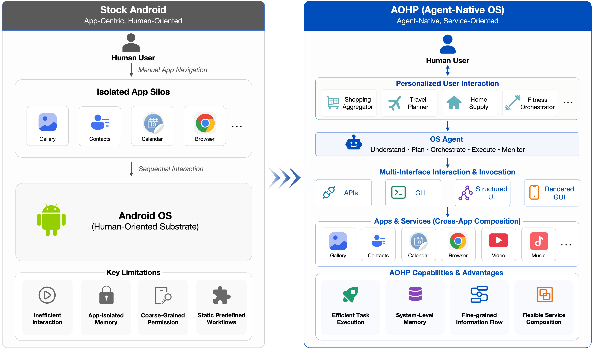
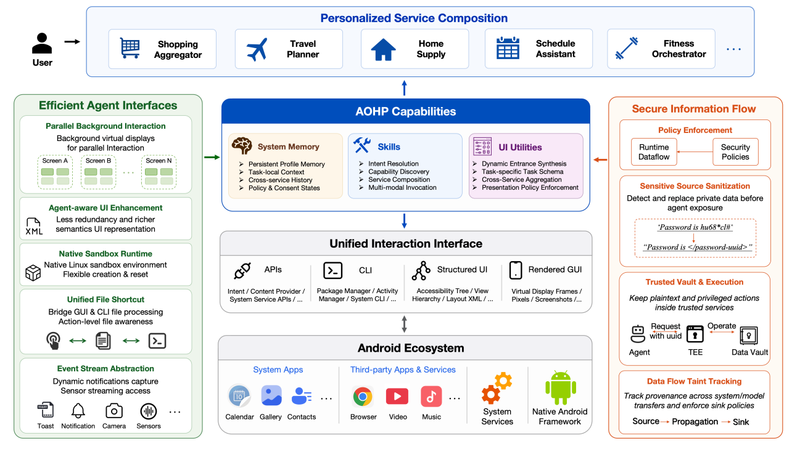
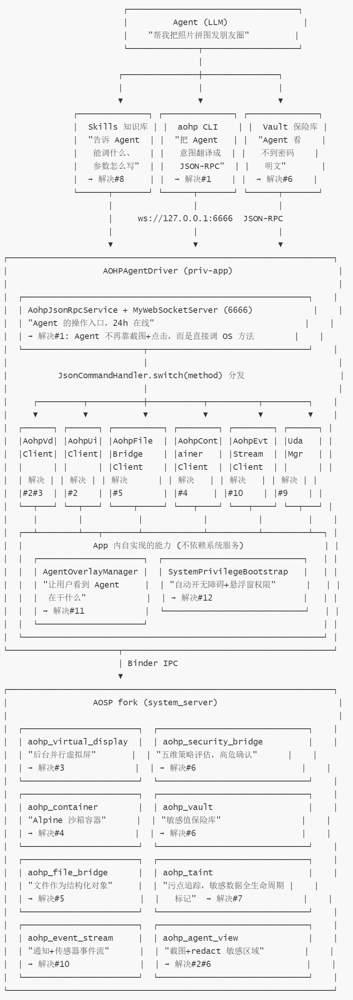
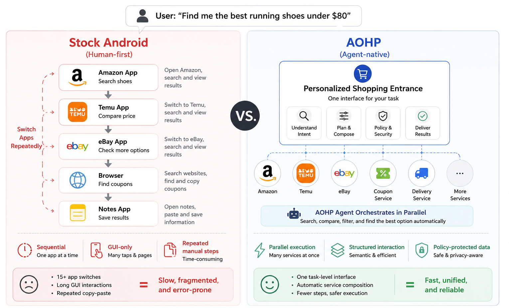
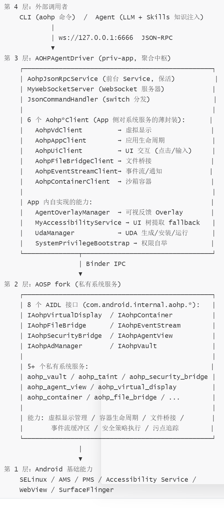
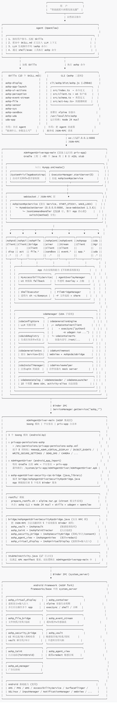
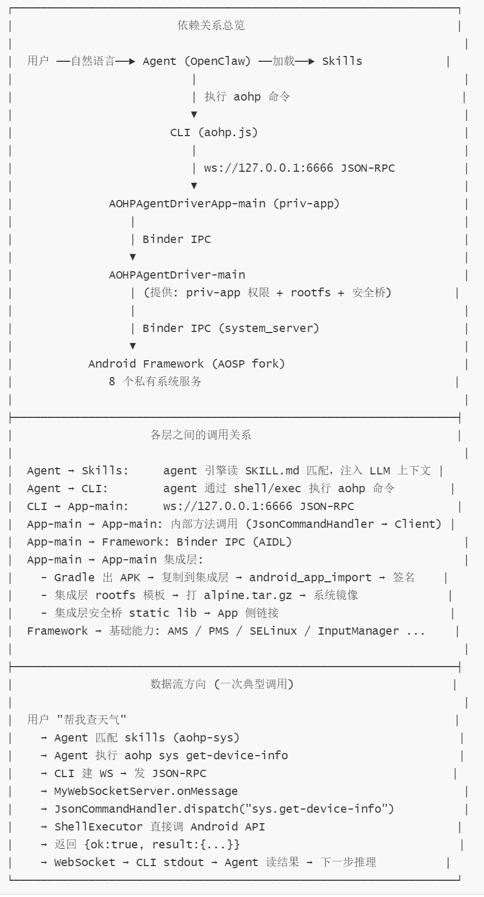
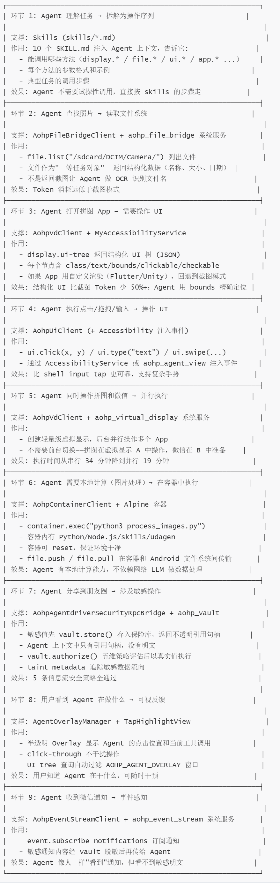

# 【Agent OS / AIOS】AOHP 深度解读：当 OS 开始为 Agent 而设计

# 【Agent OS / AIOS】AOHP 深度解读：当 OS 开始为 Agent 而设计

目录

* + [0x00 摘要](#0x00-摘要)
  + [0x01 问题：Agent 为什么在传统 OS 上"水土不服"](#0x01-问题agent-为什么在传统-os-上水土不服)
    - [1.1 传统 OS 的根本假设](#11-传统-os-的根本假设)
    - [1.2 Agent 的工作模式与 传统OS 的错配](#12-agent-的工作模式与-传统os-的错配)
    - [1.3 核心矛盾](#13-核心矛盾)
    - [1.4 设计原则](#14-设计原则)
  + [0x02 总体说明：AOHP 到底做了什么](#0x02-总体说明aohp-到底做了什么)
    - [2.1 一句话定义](#21-一句话定义)
    - [2.2 AOHP 不是什么](#22-aohp-不是什么)
    - [2.3 AOHP 的三层能力体系](#23-aohp-的三层能力体系)
      * [2.3.1 个性化服务组合（Personalized Service Composition）](#231-个性化服务组合personalized-service-composition)
      * [2.3.2 高效 Agent 接口（Efficient Agent Interfaces）](#232-高效-agent-接口efficient-agent-interfaces)
      * [2.3.3 安全信息流（Secure Information Flow）](#233-安全信息流secure-information-flow)
    - [2.4 问题-现状-解法对照表](#24-问题-现状-解法对照表)
    - [2.5 架构图：谁解决了什么问题](#25-架构图谁解决了什么问题)
    - [2.6 一句话总结](#26-一句话总结)
  + [0x03 分析](#0x03-分析)
    - [3.1 正确且有价值的部分](#31-正确且有价值的部分)
    - [3.2 改进方向](#32-改进方向)
      * [短期可改进](#短期可改进)
      * [中长期方向](#中长期方向)
  + [0x04 总体评价](#0x04-总体评价)
* [附录](#附录)
  + [附录A 论文功能点深度分析：个性化服务组合](#附录a-论文功能点深度分析个性化服务组合)
    - [A.1 Generated Service Entrances（生成式服务入口）](#a1-generated-service-entrances生成式服务入口)
    - [A.2 Capability Discovery and Composition（能力发现与组合）](#a2-capability-discovery-and-composition能力发现与组合)
    - [A.3 Cross-Service Personalization（跨服务个性化）](#a3-cross-service-personalization跨服务个性化)
  + [附录B 论文功能点深度分析：高效 Agent 接口](#附录b-论文功能点深度分析高效-agent-接口)
    - [B.1 Parallel Background Interaction（并行后台交互）](#b1-parallel-background-interaction并行后台交互)
    - [B.2 Agent-aware UI Enhancement（Agent 感知 UI 增强）](#b2-agent-aware-ui-enhancementagent-感知-ui-增强)
    - [B.3 Native Sandbox Runtime（原生沙箱运行时）](#b3-native-sandbox-runtime原生沙箱运行时)
    - [B.4 Unified File Shortcut（统一文件快捷方式）](#b4-unified-file-shortcut统一文件快捷方式)
    - [B.5 Event Stream Abstraction（事件流抽象）](#b5-event-stream-abstraction事件流抽象)
  + [附录C 论文功能点深度分析：安全信息流](#附录c-论文功能点深度分析安全信息流)
    - [C.1 Policy Enforcement（策略执行）](#c1-policy-enforcement策略执行)
    - [C.2 Sensitive Source Sanitization（敏感源脱敏）](#c2-sensitive-source-sanitization敏感源脱敏)
    - [C.3 Trusted Vault and Execution（可信保险库与执行）](#c3-trusted-vault-and-execution可信保险库与执行)
    - [C.4 Data-Flow Taint Tracking（数据流污点追踪）](#c4-data-flow-taint-tracking数据流污点追踪)
  + [附录D 模块全景：每个组件做什么、如何配合](#附录d-模块全景每个组件做什么如何配合)
    - [D.1 架构分层](#d1-架构分层)
    - [D.2 全链路交互流程](#d2-全链路交互流程)
    - [D.3 依赖关系说明](#d3-依赖关系说明)
  + [附录E Agent 视角：哪些模块在帮 Agent，怎么帮](#附录e-agent-视角哪些模块在帮-agent怎么帮)
    - [E.1 一个完整 Agent 任务的模块协作全景](#e1-一个完整-agent-任务的模块协作全景)
    - [E.2 对 Agent 起作用的模块，按"帮了什么"分类](#e2-对-agent-起作用的模块按帮了什么分类)
    - [E.3 两个不直接帮 Agent 但不可或缺的模块](#e3-两个不直接帮-agent-但不可或缺的模块)
  + [附录F：深入 AohpVirtualDisplayService：它为何能解决 Agent 的核心痛点](#附录f深入-aohpvirtualdisplayservice它为何能解决-agent-的核心痛点)
    - [F.1 定位](#f1-定位)
    - [F.2 Agent 的痛点 → AohpVirtualDisplayService 的解法](#f2-agent-的痛点--aohpvirtualdisplayservice-的解法)
    - [F.3 四大核心机制逐一解析](#f3-四大核心机制逐一解析)
      * [机制一：虚拟显示创建 —— 让 Agent 拥有"后台工作台"](#机制一虚拟显示创建--让-agent-拥有后台工作台)
      * [机制二：输入注入 —— 让 Agent 的"手"精确到达目标](#机制二输入注入--让-agent-的手精确到达目标)
      * [机制三：安全策略检查 —— 每次操作前自动评估风险](#机制三安全策略检查--每次操作前自动评估风险)
      * [机制四：UI 树导出 —— 让 Agent 的"眼睛"看到结构化界面](#机制四ui-树导出--让-agent-的眼睛看到结构化界面)
    - [F.4 完整的 AIDL 方法清单与功能分类](#f4-完整的-aidl-方法清单与功能分类)
    - [F.5 小结](#f5-小结)

## 0x00 摘要

AOHP（Android Open Harness Project）是一个基于 **AOSP（Android 16 QPR2）的 Agent-native 操作系统项目**。对应论文是"AOHP: An Open-Source OS-Level Agent Harness for Personalized, Efficient and Secure Interaction"。

AOHP不是桌面端跨平台 Agent 框架，而是在 Android 系统层面做改造。AOHP 在 AOSP 之上构建了三层能力：

* 个性化服务组合——OS 层聚合多个 App/API/CLI 的能力，包含生成式服务入口、能力发现与组合、跨服务个性化三个子组件；
* 高效 Agent 接口——通过并行虚拟显示、结构化 UI 树、原生沙箱运行时、统一文件快捷方式、事件流抽象五个机制，解决 Agent 在传统 OS 上太慢太贵的问题；
* 安全信息流——通过敏感源脱敏（vault reference）、可信保险库执行、数据流污点追踪（TaintDroid）、五维策略执行，让 Agent 操作敏感数据但看不到明文。

注意：

* 基于代码（ <https://github.com/aohp-os/aohp> ）和论文的推断，肯定有错误，希望大家不吝指出。
* 论文认为Android Framework 属于OS。
* 论文属于对Android进行适配，如果从零开始打造一个Agent OS，很多实现应该会不一样。所以，该实现对安卓开发同学很有用处，对于其它领域的同学，启发意义大于实际意义。

---

## 0x01 问题：Agent 为什么在传统 OS 上"水土不服"

### 1.1 传统 OS 的根本假设

所有主流操作系统——无论是 Android、iOS、Windows 还是 macOS——都是围绕**"人-应用"交互模型**设计的。这个模型有几个隐含假设：

* **单应用前台独占**：用户一次只在一个 App 里操作，OS 负责把前台窗口切给当前 App
* **GUI 为主要交互界面**：用户通过像素（眼睛看）和触控（手指点）来驱动操作
* **App 边界即权限边界**：每个 App 的权限由安装时授予、开发者声明，跨 App 的数据传递需要用户手动参与（分享菜单、Intent 选择器）
* **瞬态交互无状态**：用户离开 App 后，OS 不保留操作意图——下一次打开 App，一切从头开始

这些假设对人是合理的。但对 AI Agent 来说，每一个都是障碍。

### 1.2 Agent 的工作模式与 传统OS 的错配

Agent 的核心工作方式是：接收自然语言指令 → 拆解为多步操作序列 → 调用工具执行 → 观察反馈 → 调整下一步。这个循环在传统 OS 上运行时，会暴露出三类结构性矛盾：

**第一，只能通过"截图+视觉理解+模拟点击"来操作。** 就像一个蒙着眼睛的人靠触觉摸索手机——每点一下要先"看"（截图），再"想"（视觉理解），再"碰"（坐标点击）。每一步都充满冗余和不确定性。一个简单的"帮我在淘宝搜一双跑鞋，然后在京东对比价格"，Agent 需要反复截屏、识别按钮、定位输入框、判断页面是否加载完成——这个过程消耗大量 Token，而且容易在动态 UI 变化时失败。

**第二，安全模型与 Agent 需求冲突。** 现有方案走两个极端：要么是应用内 Agent（只能调用自身 API，无法跨 App），要么是全局高权限 Agent（把系统调用、文件读写、进程操作全部交给 LLM，缺少细粒度隔离）。两者都无法兼顾"全系统操作能力"与"细粒度安全管控"。

**第三，交互低效、无法个性化。** Agent 每次执行任务都需要从零开始——重新枚举已安装应用、重新识别 UI 布局、重新推理操作路径。它没有"记忆"：不知道你习惯把文件放哪个目录、常用哪个邮箱、偏好哪个支付方式。每次都重复推理，Token 消耗巨大。

### 1.3 核心矛盾

传统 OS 以 App 为中心，用户手动编排 App 之间的协作。Agent 需要以意图为中心，OS 主动组合跨 App 的服务能力。

AOHP 的核心洞察是：与其让 Agent 去适应 OS，不如让 OS 来适应 Agent。AOHP 把 Android 从"以 App 为中心"改造成"以 Agent 为中心"，让 OS 主动为用户组合个性化服务。

* 这不是给现有 OS 打补丁（如换个更好的视觉模型），而是从 OS 架构层面重新定义 Agent 与系统服务的关系。
* 不是新写一个 Agent，而是**改 OS 让 Agent 能安全、高效地驾驭 OS**。

### 1.4 设计原则

AOHP 将上述问题/需求转化为三条设计原则。

* 第一，用户界面应按需组合：OS Agent 应打破 App 和服务孤岛，通过发现并重组跨服务提供者的能力，构建由用户意图、上下文和状态驱动的个性化交互界面。
* 第二，Agent 与服务之间的交互应具备兼容性、高效性和接口无关性：OS 应提供一个统一基座，既保留对传统 Android App 交互的兼容，又支持面向 Agent 的服务逻辑，使 Agent 能以更低开销和更高精度获取能力。
* 第三，敏感数据应默认隔离：Agent 默认不应看到隐私明文，系统在整个任务过程中强制执行细粒度的信息流追踪、审批和审计。

下图给出了 Stock Android 和 AOHP 之间的区别。



---

## 0x02 总体说明：AOHP 到底做了什么

### 2.1 一句话定义

**AOHP = 一个平台签名的 priv-app**（AOHPAgentDriver），它把 AOSP fork 里 8 个 IAohp\* 系统服务的能力"聚合"成一个 ws://:6666 上的 JSON-RPC 面——上层 CLI/Agent 无需关心 Binder、无障碍、Shell、容器，只发 {method, params}；下面用一张 switch(method) 表把请求分发到 6 个 Binder client、accessibility fallback、shell、file bridge、UDA 引擎、Overlay 等实现。

### 2.2 AOHP 不是什么

| 常见误解 | 实际情况 |
| --- | --- |
| 跨 Windows/macOS/Linux 的桌面 Agent 框架 | 仅基于 AOSP（Android 16 QPR2），依赖 Binder IPC、Accessibility Service、priv-app 签名等 Android 特有机制 |
| 内核级 Hook 安全方案 | 安全机制运行在 Android 用户态，通过 AOSP fork 中新增的系统服务 + SELinux + priv-app 实现 |
| 自带三层推理调度器 | 论文中的"分层推理调度器"是理论蓝图，代码中没有看到；实际提效靠 Skills 知识注入 + 结构化 UI + 并行虚拟显示 |
| 已实现完整的个性化记忆引擎 | 论文中描述的向量库 + 行为图谱在代码中没有看到；当前个性化主要通过 UDA 生成/缓存 + Skills 模板体现 |

README.md 中有 Stock Android vs AOHP 对比表：

| Dimension | Stock Android | AOHP |
| --- | --- | --- |
| **Interaction Model** | Users operate app-defined workflows directly | Agents act as first-class OS actors under user intent |
| **Interaction Surface** | Fixed app GUIs defined by developers | Personalized service entrances mediated by agents |
| **Process Execution** | Single-tenant foreground execution bound to physical displays | Parallel background interaction decoupled from the screen |
| **System Memory** | Fragmented and locked inside individual applications | OS-managed cross-app memory for task personalization |
| **Security & Privacy** | Coarse-grained app permissions and opaque data flows | Fine-grained data-flow tracking and sandboxed sensitive values |

### 2.3 AOHP 的三层能力体系

AOHP 在 AOSP 之上构建了三层核心能力。



上图展示了最终架构。在纵向上，AOHP 分为四层。

* 最底层是 Android 生态层，保留现有 App、系统服务、硬件资源和平台 API 作为兼容基础。
* 其上是统一交互接口层，将传统 Android 接口和新兴 Agent 接口统一为四种调用模式：API、CLI、结构化 UI 和渲染 GUI。该层让 Agent 在可用时选择紧凑的符号路径，在兼容性要求时回退到视觉操作。
* 第三层是 AOHP 能力层。它将 App、系统组件和 Agent 工具提供的服务与功能重组为系统记忆、技能和 UI 工具三类。系统记忆在任意单个 App 之外存储偏好、任务状态、历史记录和策略决策。技能打包可复用的服务能力和执行例程。UI 工具支撑生成式入口和任务特定交互界面的构建。
* 最顶层是个性化服务组合层，将上述能力组装为面向用户当前任务的新界面。这一层代表了 AOHP 所启用的应用模型：用户与个性化服务入口交互，OS Agent 则解析底层的服务图谱和执行路径。

在横向上，AOHP 包含两个跨层机制。① 高效 Agent 接口优化 Agent 访问系统资源、App 状态、文件、事件和隔离执行基座的方式，降低视觉处理开销，避免不必要的前台串行化，使 Agent 动作减少对脆弱 GUI 导航的依赖。② 安全信息流提供 Agent 中介执行所需的更严格保护模型，在敏感数据到达外部出口或触发状态变更操作之前，对敏感源进行脱敏、通过可信保险库操作路由私有值、传播污点元数据并记录可审计的追踪轨迹。

#### 2.3.1 个性化服务组合（Personalized Service Composition）

**要解决的问题**：传统 Android 中，用户想完成一个跨 App 任务（如"比价购物"），必须手动打开淘宝→搜索→截图→打开京东→重复搜索→对比。Agent 要做同样的事，只能模拟这个手动流程。

**AOHP 的做法**：OS 层生成一个"任务级服务入口"，聚合多个 App/API/CLI 的能力，作为统一界面呈现给用户。Agent 在底层处理服务发现、调用协调和策略执行。

三个子组件：

| 子组件 | 功能 |
| --- | --- |
| **生成式服务入口** | 包含任务 Schema（定义用户意图）、服务图谱（映射到具体能力）、呈现策略（决定展示哪些中间结果） |
| **能力发现与组合** | 跨 API/CLI/GUI 通道发现服务能力，用 Input/Output Schema、前置条件、副作用、策略标签描述每个能力 |
| **跨服务个性化** | System Memory 分为持久化偏好记忆、任务局部记忆、敏感记忆三类，让个性化跨越 App 边界 |

#### 2.3.2 高效 Agent 接口（Efficient Agent Interfaces）

**要解决的问题**：Agent 通过截图+点击操作 GUI 太慢、太贵。

**AOHP 的 5 个机制**：

| 机制 | 解决的问题 | 技术手段 |
| --- | --- | --- |
| **并行后台交互** | 传统 OS 前台独占，Agent 只能串行 | 轻量级虚拟显示（Virtual Display），后台并行执行多个任务 |
| **Agent 感知 UI 增强** | GUI 截图冗余信息太多 | 将 GUI 抽象为结构化 UI 树（增强版 Accessibility Tree），保留截图回退能力 |
| **原生沙箱运行时** | Agent 需要本地执行环境做计算/转换 | OS 管理的 Alpine Linux 容器，可创建/重置，独立于 App 接口 |
| **统一文件快捷方式** | 跨 App 文件传递需要推断路径 | 文件作为一等任务对象，GUI 操作自动反映为结构化文件观察 |
| **事件流抽象** | 瞬态通知、传感器数据难以轮询捕获 | 通知缓冲区 + 传感器流，Agent 可订阅处理 |

#### 2.3.3 安全信息流（Secure Information Flow）

**要解决的问题**：Agent 需要操作敏感数据（密码、验证码、支付金额），但不应该看到这些数据的明文。

**AOHP 的 4 层安全机制**：

1. **敏感源脱敏（Vault Reference）**：敏感内容进入 Agent 上下文前，替换为类型化占位符（指向 vault 的不透明引用句柄），真实值存入系统数据保险库。Agent 在推理/日志/上下文中携带的永远只是引用，即使泄漏也无法反查明文。
2. **可信保险库执行**：Agent 用占位符提交操作意图，保险库检查策略、获取用户授权后，在可信环境中以真实值执行——Agent 自始至终看不到明文。
3. **数据流污点追踪（Taint Metadata）**：基于 TaintDroid 的移动端污点追踪体系。敏感数据在复制、转换、组合、传输过程中始终携带污点元数据。事件流中的敏感字段被 redact 但保留污染标记，确保下游消费者知道"这里曾有敏感信息"。
4. **五维策略执行**：每次敏感操作在**数据源、请求目的、目标、操作敏感度、授权状态**五个维度上评估。高危操作强制弹窗人工二次确认。

结合 Stock Android vs AOHP 对比表，AOHP 的具体改进如下：

| 维度 | 核心代码模块 | 如何改进 |
| --- | --- | --- |
| Interaction Model | AohpJsonRpcService + MyWebSocketServer + JsonCommandHandler | Agent 通过 JSON-RPC "调用 OS"，而不是"截图+点击" |
| Interaction Surface | UDAGen + UdaManager + UdaAppActivity + WebView | 界面从"开发者预定义"变成"按用户需求动态生成" |
| Process Execution | AohpVdClient + aohp\_virtual\_display + AohpContainerClient | 从"前台串行"变成"后台并行虚拟显示" |
| System Memory | Skills + UdaInstallStore + UdaContainerFs | 从"App 内孤立记忆"变成"跨 App 知识库 + 可复用 UDA" |
| Security & Privacy | SecurityRpcBridge + aohp\_vault + aohp\_taint | 从"粗粒度 App 权限"变成"vault reference + taint 细粒度追踪" |

### 2.4 问题-现状-解法对照表

| # | Agent 遇到的问题 | Android 的表现 | AOHP 如何解决 | 对应代码组件 |
| --- | --- | --- | --- | --- |
| 1 | Agent 需要操作 App，但只能"截图→识别→点击"，每一步都像蒙眼摸象 | 没有给 Agent 的 API，Agent 只能靠 adb shell input tap + screencap 模拟人类操作 | 在 OS 里开一个 **JSON-RPC 接口**（ws://:6666），Agent 直接发 `{"method":"app.launch","params":{...}}` 调用 OS 能力 | `AohpJsonRpcService` + `MyWebSocketServer` + `JsonCommandHandler` |
| 2 | Agent 不知道当前屏幕上有哪些按钮、输入框，只能靠截图做 OCR/视觉识别 | 只有 AccessibilityService 能拿到 View 树，但普通 Agent 拿不到 | 把 **View 树导出为结构化 JSON**（含 class/text/bounds/clickable），Agent 直接读到"坐标 (100,200) 有个确定按钮" | `AohpVdClient` + `MyAccessibilityService` → `display.ui-tree` |
| 3 | Agent 需要跨 App 协作（比如同时查淘宝和京东），但只能串行操作 | 只有前台 Activity 接收输入事件，Agent 必须切来切去 | 创建 **轻量级虚拟显示**，在后台并行操作多个 App——淘宝在虚拟显示 A，京东在虚拟显示 B，互不干扰 | `AohpVdClient` + `aohp_virtual_display` 系统服务 |
| 4 | Agent 需要本地计算（图片处理、数据分析），但每次都要调用云端 LLM | 没有给 Agent 的本地执行环境 | 提供一个 **Alpine Linux 容器**，Agent 可以在里面跑 Python 脚本、处理文件，结果通过 file.push/pull 传回 | `AohpContainerClient` + `aohp_container` 系统服务 + Alpine rootfs |
| 5 | Agent 操作文件时，只能通过截图看文件名，再 OCR 识别 | 文件系统对 Agent 不可见 | 文件作为 **结构化一等对象**，`file.list()` 直接返回文件名/大小/日期，`file.read()` 返回内容——不需要截图 | `AohpFileBridgeClient` + `aohp_file_bridge` 系统服务 |
| 6 | Agent 操作敏感数据（密码、验证码）时，明文会出现在日志/推理记录中，可能泄露 | App 权限粗粒度，Agent 拿到权限后就能随意读取敏感值 | 敏感值存入 **vault 保险库**，Agent 手里只有不透明引用句柄（ref\_a1b2c3），看不到明文；操作时由保险库在可信环境执行 | `AohpAgentdriverSecurityRpcBridge` + `aohp_vault` 系统服务 |
| 7 | Agent 不知道敏感数据流向了哪里，可能被复制、转发、泄露 | 数据流不透明，无法追踪 | 基于 TaintDroid 的 **污点追踪**，敏感值从 vault 取出后自动携带 taint tag，复制/拼接/传输时 tag 自动传播，输出时自动 redact | `aohp_taint` 系统服务 |
| 8 | Agent 每次执行任务都从零开始，不知道用户习惯、文件布局、常用 App | 每个 App 的记忆是孤立的，OS 不保存跨 App 的用户偏好 | 通过 **Skills 知识库**（10 个 SKILL.md）注入 Agent 上下文，告诉它参数格式和调用步骤；通过的 **UDA 缓存**复用已生成的个性化 App | `skills/*/SKILL.md` + `UdaInstallStore` |
| 9 | Agent 需要生成个性化 App，但传统 App 开发需要写代码、编译、打包 | 用户只能用 Play Store 安装的固定 App | 用户说一句话，LLM 自动生成 **UDA**（HTML/JS/CSS 前端 + mock 后端），安装到桌面，Agent 在幕后调用系统服务组合出真实功能 | `UdaManager` + `UDAGen` 三阶段流水线 + `UdaAppActivity` + `WebView` |
| 10 | Agent 收不到系统通知/传感器数据，无法像人一样感知环境变化 | 通知和传感器数据对 Agent 不可见 | 提供 **事件流缓冲区**，Agent 可以订阅通知和传感器数据流；敏感通知经 vault 脱敏后再传给 Agent | `AohpEventStreamClient` + `aohp_event_stream` 系统服务 |
| 11 | Agent 执行任务时用户看不到它在干什么，无法干预 | 没有 Agent 操作的可视化反馈 | 在屏幕上叠加 **半透明 Overlay**，实时显示 Agent 的点击位置和当前工具调用；click-through 不干扰操作 | `AgentOverlayManager` + `TapHighlightView` |
| 12 | Agent 需要无障碍和悬浮窗权限才能正常工作，但普通 App 需要用户手动去设置里开启 | 用户必须手动去系统设置里开启无障碍服务 | priv-app 利用 **WRITE\_SECURE\_SETTINGS** 权限，在 App 启动时自动开启无障碍和悬浮窗，无需用户手动操作 | `SystemPrivilegeBootstrap` |

### 2.5 架构图：谁解决了什么问题

下图的 #n，就是上表的第一列。



### 2.6 一句话总结

| 12 个痛点 | 一句话解法 |
| --- | --- |
| #1 无法调用 OS | JSON-RPC 面：Agent 不再截图+点击，直接发 `{method, params}` |
| #2 看不到 UI 结构 | 结构化 UI 树：Accessibility Tree → JSON，含 class/text/bounds |
| #3 只能串行操作 | 虚拟显示：后台并行操作多个 App，互不干扰 |
| #4 无本地计算 | Alpine 容器：容器内跑 Python/Node.js，file.push/pull 传输 |
| #5 文件不可见 | 文件桥：直接 list/read/write，文件作为结构化一等对象 |
| #6 敏感值泄露 | Vault 保险库：敏感值存为引用句柄，Agent 看不到明文 |
| #7 数据流不透明 | Taint 污点追踪：敏感值全生命周期标记，输出自动 redact |
| #8 每次从零开始 | Skills 知识库：10 个 SKILL.md 注入 Agent 上下文 |
| #9 无法动态生成 App | UDA：用户说一句话 → LLM 生成 HTML App → 安装到桌面 |
| #10 收不到通知 | 事件流：通知/传感器数据缓冲，Agent 订阅处理 |
| #11 看不到 Agent 操作 | Overlay：半透明悬浮层显示点击位置和工具调用 |
| #12 权限需手动开 | 自举：priv-app 用 WRITE\_SECURE\_SETTINGS 自动开无障碍+悬浮窗 |

---

下图给出了一个用户操作，在Stock Android 和 AOHP 之中操作的区别。



---

## 0x03 分析

### 3.1 正确且有价值的部分

* Agent 作为一等公民的设计理念：当 Agent 成为 OS 的主要交互模式时，OS 提供原生 Agent 接口就像当年提供 GUI 框架一样自然
* 安全信息流设计：TaintDroid 污点追踪 + vault reference 在"Agent 需要处理隐私数据"和"Agent 不应看到隐私明文"之间找到了平衡点

### 3.2 改进方向

#### 短期可改进

* 自动化能力推断：利用 LLM 自动从 App 的界面描述、用户评论、使用手册中推断服务能力 Schema，减少人工标注
* 分级安全策略：根据操作风险等级（查看 vs. 修改 vs. 支付）采用不同的授权粒度——低风险操作静默通过，高风险才需确认
* 更全面的 benchmark：加入自定义渲染应用、游戏、金融类 App 等薄弱场景，测量回退模式下的性能

#### 中长期方向

* 与 App 开发者的协作协议：设计一种 App 可以自愿暴露"Agent 友好接口"的声明式规范（类似 Android 的 Intent Filter），让 AOHP 从"逆向工程"变为"原生支持"
* 联邦式个性化：用户偏好和记忆的跨设备同步与隐私保护——当前设计假设单设备场景
* Agent 到 Agent 的协作协议：当多个 Agent 同时运行时，它们之间如何协调资源和优先级
* 移动端完整底层适配：将当前基于 Cuttlefish 虚拟设备的方案扩展到真实硬件，适配更多 Android 设备形态

## 0x04 总体评价

AOHP = **改造过的 AOSP + 设备端 Agent 服务（RPC over WS）+ 主机侧 CLI + UDA 生成流水线 + Overlay/沙箱/信息流安全**，共同构成让 Agent 成为 OS 一等公民、并能安全地代替用户完成跨 App 任务的基础设施。

AOHP 的核心贡献不是某个 benchmark 分数的提升，而是**提出了"Agent-native OS"这个研究议程**并给出了可复现的开源实现。它将 Agent 研究从"如何让模型更好地操作现有 OS"推进到了"OS 本身应该如何为 Agent 而设计"——这个视角转换的意义，类似于从"如何让程序更好地操作硬件"到"设计操作系统来管理硬件资源"的跨越。

但它最大的局限也在于此：OS 层面的改造需要整个生态的配合，而生态的惯性是巨大的。AOHP 展示了"可以做什么"，但"如何让它真正落地"——这个问题论文没有回答，也几乎不可能由一篇学术论文来回答。

对于开发者来说，AOHP 最有价值的不是某个 benchmark 分数，而是它展示了一套完整的 Agent-OS 交互范式。理解这套范式后，你可以：在 AOHP 框架上接入自己的 LLM 和 skills；参考其 JSON-RPC 接口设计构建类似的控制面；借鉴其安全信息流设计（vault reference + taint tracking）在自己的 Agent 系统中实现数据隐私保护。

---

---

---

# 附录

## 附录A 论文功能点深度分析：个性化服务组合

AOHP 最显著的变化是交互界面变得个性化且动态生成，而非完全由开发者预定义。传统 App 暴露开发者选择的功能，AOHP 让 OS Agent 围绕用户的重复性目标合成服务入口，将交互从 App 导航转变为任务级服务访问。

### A.1 Generated Service Entrances（生成式服务入口）

生成式入口是由 OS 管理的服务组合支撑的用户界面壳层。一个购物入口可以聚合多个服务提供者的商品搜索、归一化商品属性、应用偏好（如尺寸和预算）并暴露一个用于比较和购买的任务特定界面。每个入口包含三个部分：任务 Schema、服务图谱和呈现策略。任务 Schema 定义用户试图完成什么，例如"在预算内比较跑鞋"或"补充家庭日用品"。服务图谱将此任务映射到具体的服务能力。呈现策略决定哪些中间结果应展示给用户，哪些可保留在 Agent 内部。这种分离使 AOHP 能够在不隐藏重要决策的前提下个性化入口。

**1. 要解决什么问题？为何对 Agent 很麻烦？**

传统 Android 中，Agent 完成跨 App 任务只能模拟手动流程——反复截图、识别按钮、定位输入框。Agent 面对的不是"任务"而是"App 操作序列"，每次试探都是完整的截图→识别→点击→等待循环。

**2. 解决方案的设计思路**

把"用户手动编排 App"变成"OS 主动组合服务"。入口包含三部分：任务 Schema（定义用户意图）、服务图谱（映射到具体能力）、呈现策略（决定展示哪些中间结果）。

**3. 在代码中如何实现？**

UDA 体系：用户说一句话 → LLM 生成 HTML/JS/CSS 前端 + mock 后端 → 安装到桌面。Agent 在幕后调用 display.\* / app.\* / ui.\* 组合真实服务。

* `udagen/pipeline.py` — 三阶段流水线（draft\_prd → draft\_design → build\_app）
* `UdaManager.java` — facade，编排整个生成流程
* `UdaGenerationEngine.java` — 在 Alpine 容器中执行 `python3 -m udagen run ...`
* `UdaAppActivity.java` — WebView 加载生成的前端，AohpUdaJsBridge 代理到 mock server
* `UdaInstallManager.java` — 将生成的 UDA pin 到桌面

**但论文中的"服务图谱"和"跨服务提供者聚合"在当前代码中仅以 UDA 的 mock 层体现。** 真实的跨 App 服务发现和动态组合能力尚未实现。

**4. 弱点**

* 生成成本高：每次生成 UDA 需要完整 LLM 三阶段流水线
* 静态而非动态：UDA 生成后固定，无法运行时动态添加新服务提供者

**5. 改进方向**

* 服务能力注册表：类似 Android Intent Filter 的声明式规范
* 运行时动态组合：Agent 根据注册表动态发现服务提供者
* 增量生成：只生成差异部分，而非重新生成整个 UDA

### A.2 Capability Discovery and Composition（能力发现与组合）

AOHP 通过跨 API、CLI 和 GUI 通道发现服务能力来构建这些入口。每个能力用输入/输出 Schema、前置条件、副作用和策略标签表示。OS Agent 随后可将能力组合为更高层的工作流。这种设计让传统 App 通过 GUI 导出参与其中，同时允许新服务暴露更直接的 API。组合受策略约束。例如，商品搜索可以在多个服务提供者间自由并行执行，而购买提交则是需要显式确认的状态变更操作。同样，配送地址只能通过信息流沙箱用于估算运费。生成式入口既是便利层，也是策略执行面。

**1. 问题**

Agent 不知道"这个 App 能做什么"，只能通过打开 App → 截图 → 视觉识别来推断。没有统一的"能力描述语言"。

**2. 设计思路**

每个能力用 Input/Output Schema + 前置条件 + 副作用 + 策略标签描述。OS Agent 跨 API/CLI/GUI 通道发现这些能力，然后组合为更高层工作流。

**3. 代码实现**

* `skills/*/SKILL.md` — 描述了 AOHP 自身暴露的能力，不是"发现第三方 App 的能力"
* `JsonCommandHandler.java` switch 表 — 硬编码的方法路由，不是动态能力发现
* `app.*` 的 `list-installed` — 只能列出包名，不能描述每个 App 能做什么

**4. 弱点**

论文最大差距之一。论文在 "Future Work" 中承认："未来版本应结合开发者描述符和自动能力推断"——翻译过来就是：现在基本靠人工标注，且连人工标注的框架都没有。

**5. 改进方向**

* App 能力描述 SDK：类似 `<intent-filter>` 但更细粒度
* LLM 自动推断：从 App 描述、用户评论、界面截图中自动推断能力 Schema
* 能力注册中心：OS 层维护，Agent 执行前查询可用服务

### A.3 Cross-Service Personalization（跨服务个性化）

系统记忆让个性化跨越 App 边界而存在。在使用一个服务时学到的偏好可以改善另一个服务，但受策略约束。例如，用户在一个购物工作流中偏好的配送时间窗口，可以在另一个市场的商品比较中被使用。设计要求是记忆保持在 OS 中介层：个性化可以共享、审计和撤销，而不依赖每个 App 的私有数据模型。AOHP 区分为持久画像记忆、任务局部记忆和敏感记忆三类。持久画像记忆存储稳定的偏好。任务局部记忆存储临时状态，如候选商品或部分填写的表单。敏感记忆通过沙箱索引存储私有值。这种区分可防止个性化变成不受控的私密上下文积累。

**1. 问题**

Agent 每次执行任务都从零开始，用户偏好分散在不同 App 中——淘宝知道尺码，京东知道地址，Agent 无法跨 App 获取。

**2. 设计思路**

System Memory 分三类：持久画像记忆（稳定偏好）、任务局部记忆（临时状态）、敏感记忆（通过沙箱索引存储私有值）。记忆是 OS 中介的——可共享、审计、撤销。

**3. 代码实现**

**论文描述的完整个性化记忆引擎尚未实现。** 实际生效的机制：

* `skills/*/SKILL.md` — 预定义的 Agent 能力模板，不是"学到的"用户偏好
* `UdaInstallStore.java` — 已生成的 UDA 持久化存储（只是 App 缓存，不是用户偏好记忆）
* `UdaContainerFs.java` — 容器内保存 UDA 产物

**4. 弱点**

Skills 是静态模板，无法学习。UDA 缓存只是"复用已生成的 App"，不是"复用用户偏好"。

**5. 改进方向**

* 偏好向量库：本地轻量向量库存储用户偏好，Agent 任务开始时检索
* 自动学习：捕获用户修正行为，增量更新本地偏好库
* 老化淘汰：时间衰减权重，自动删除长期不用的临时偏好

---

## 附录B 论文功能点深度分析：高效 Agent 接口

AOHP 将执行环境、UI 语义、存储和事件作为 Agent 原生原语暴露。这些抽象减少了 Agent 中介工作流中的视觉处理开销、刚性串行执行和脆弱的跨 App 交接。

### B.1 Parallel Background Interaction（并行后台交互）

传统移动 OS 将 App 生命周期与物理显示器耦合。AOHP 通过轻量级虚拟显示将执行与屏幕解耦，允许 Agent 在后台运行等待密集型或独立工作流，而不抢占活动的前台会话。

**1. 问题**

只有前台 Activity 能接收输入事件。Agent 同时操作两个 App 必须反复切前台，串行等待。OpenClaw 评测中并行执行时间从 33.94 分钟降到 18.93 分钟（-44.21%）。

**2. 设计思路**

通过轻量级虚拟显示将 App 生命周期与物理屏幕解耦。Agent 在后台虚拟显示中并行操作多个 App。

**3. 代码实现**

* `AohpVirtualDisplayService.createVirtualDisplay()` — 创建带 `OWN_FOCUS` 的虚拟显示，每个显示拥有独立输入焦点
* `ImageReader` 保活 — producer-attached Surface 让虚拟显示始终 `STATE_ON`
* `OWN_FOCUS` 标志 — `effectiveFlags |= DisplayManager.VIRTUAL_DISPLAY_FLAG_OWN_FOCUS`（代码第 482 行）
* `AohpVdClient.java` — 通过 `ServiceManager.getService("aohp_virtual_display")` 获取 Binder 代理
* `MultiVirtualDisplayManager.java` — 跟踪 AOHP 创建的虚拟显示 ID 集合

**4. 弱点**

* 资源开销：每个虚拟显示需独立 Surface + ImageReader + GPU 资源
* OWN\_FOCUS 副作用：两个虚拟显示上都有"微信"时，输入可能路由到错误 display
* 依赖系统服务：`DisplayManagerInternal` 是系统内部 API，仅限 priv-app
* 仅限 Android：虚拟显示是 Android 特有概念

**5. 改进方向**

* 资源池化：预创建虚拟显示池，用完归还
* 显示优先级：低优先级任务用更少 GPU 资源
* 跨平台抽象：非 Android 平台用容器/虚拟机替代

### B.2 Agent-aware UI Enhancement（Agent 感知 UI 增强）

传统 App GUI 包含大量对 Agent 推理无用的渲染细节。AOHP 将 GUI 抽象为具有更低冗余和更丰富语义的结构化表示，同时保留渲染 GUI 回退以处理视觉组件。

**1. 问题**

Agent 通过截图+视觉理解来"看"界面，1080p 截图经视觉模型处理后 Token 消耗巨大。AOHP 减少了 51.55% Token。

**2. 设计思路**

将 GUI 抽象为结构化 UI 树（JSON），保留每个节点的 class/text/bounds/clickable/checkable。自定义渲染 App 回退到截图。

**3. 代码实现**

* `AohpVirtualDisplayService.dumpUiTree()` — 通过 `AccessibilityManagerInternal.get().dumpUiTreeForDisplay()` 获取 UI 树，经 `filterUiTreeTrusted()` 安全过滤
* `ENHANCED_UI_TREE_FLAGS = 0x7` — 0x1 装饰过滤 + 0x2 离屏 + 0x4 视觉标记
* `MyAccessibilityService.java` — 系统服务不可用时的 fallback
* `AohpSecurityBridgeService.filterUiTreeTrusted()` — 敏感字段替换为占位符或 redact

**4. 弱点**

* 自定义渲染 App 的致命弱点：Flutter、Unity、游戏引擎无标准 View 树，Accessibility Tree 为空 → 回退截图 → 与 Stock Android 无差异
* 真实世界覆盖率：国内大量 App 使用自研渲染引擎

**5. 改进方向**

* 非标准 UI 的结构化提取：Flutter `Semantics` widget 或引擎 hook
* 混合模式：部分可提取的用结构化，不可提取的用截图+区域标注
* 增量 UI 树：只返回变化节点，减少传输开销

### B.3 Native Sandbox Runtime（原生沙箱运行时）

通过 App 中介的 GUI、API 和 CLI 路径并不能覆盖 Agent 的全部工作。Agent 通常需要一个本地执行基座来进行计算、转换和工具调用。AOHP 包含一个原生的、OS 管理的沙箱运行时，可作为独立于 App 接口的执行面创建和重置。Agent 可以在沙箱内执行代码、处理数据并托管长驻服务，然后将结构化结果返回到任务上下文，而无需将中间步骤放入 Agent 上下文。

**1. 问题**

Agent 需要本地执行环境，但 Stock Android 没有给 Agent 的沙箱——要么云端执行（延迟高、隐私风险），要么 App 受限环境。

**2. 设计思路**

OS 管理的原生沙箱运行时（Alpine Linux 容器），可创建和重置。Agent 在沙箱内执行代码、处理数据、托管长驻服务。

**3. 代码实现**

* `AohpContainerClient.java` — 通过 `IAohpContainer.aidl` → `aohp_container` 系统服务操作容器
* `aohp_container` 系统服务 — 容器生命周期：`createContainer / execSync / openShell / startService`
* `prepare_rootfs.sh` — 打包 Alpine rootfs（alpine.tar.gz），内含：aohp CLI + Node 24 musl + skills + udagen + openclaw
* `UdaContainerFs.java` — 容器内读写文件
* `FileBridgeManager.java` — 容器内外文件传输（file.push / file.pull）

**4. 弱点**

* 容器启动开销：每次 `sandbox.create` 解压 alpine.tar.gz 并 chroot
* chroot 而非完整容器：缺少网络隔离、cgroup 资源限制
* 单容器单任务：不支持多容器并行
* Node 运行时体积：嵌入 rootfs 增加镜像体积

**5. 改进方向**

* 容器预热池：预创建容器池，用完归还
* 资源限制：添加 cgroup 限制（CPU/内存/IO）
* 多容器支持：一个 Agent 会话可创建多个隔离容器
* 增量 rootfs：使用 overlayfs 替代完整解压

### B.4 Unified File Shortcut（统一文件快捷方式）

跨 App 的 Agent 工作流通常依赖文件作为共享中间产物，例如在一个 App 中保存附件并在另一个 App 中复用。在 Stock 系统上，这些产物是隐式的：GUI 操作可能创建或修改存储，但 Agent 缺乏稳定的 OS 级结果描述。反之，程序化文件操作没有统一的方式调用 App 原生能力（如系统分享流程），当目标方期望这些能力时更是如此。AOHP 在 OS 边界将文件作为一等任务对象处理。影响存储的 GUI 交互被反映为结构化文件观察，使 Agent 能够推理哪些内容发生了变化，而无需从截图或每个 App 的选择器推断路径。在反向方向上，同一层让 Agent 将已解析的产物交给另一个接口，既可通过直接程序化访问，也可通过在指定显示器上启动相应的系统 UI 流程。这统一了文件产生型 GUI 步骤和文件消耗型程序化步骤，形成单一的跨 App 数据平面，并减少跨不透明存储布局的脆弱交接。

**1. 问题**

Agent 无法知道"App 刚刚保存的文件路径是什么"，只能通过截图看文件名→猜测路径。反之，Agent 生成文件后也无法方便触发系统分享流程。

**2. 设计思路**

文件作为一等任务对象。GUI 交互影响存储时自动反映为结构化文件观察（名称、大小、路径、MIME）。Agent 不需要靠截图推断文件路径。

**3. 代码实现**

* `AohpFileBridgeClient.java` — 通过 `IAohpFileBridge.aidl` → `aohp_file_bridge` 系统服务
* `aohp_file_bridge` 系统服务 — 文件快照/差异/追踪：`stat / list / snapshot / diff`
* `FileBridgeManager.java` — 含 `withFilePathReport` 包装
* `-F` 标志 — `aohp act tap-node -d 2 -i 17 -F`，操作后自动追踪新生成文件
* `file.*` 命名空间 — `list / read / write / delete / mkdir / show-in-folder / share`

**4. 弱点**

* 快照粒度：基于时间戳，操作频繁时可能漏报或误报
* 仅限特定目录：文件追踪 roots 范围有限
* 跨 App 文件传递：share 流程仍依赖系统分享面板
* 大文件性能：GB 级文件快照有 I/O 开销

**5. 改进方向**

* inotify 替代轮询：监听文件变化而非定期扫快照
* 扩展追踪范围：自定义追踪目录
* 直接文件传递：绕过分享面板，通过 ContentProvider 或 Binder 传递 URI

### B.5 Event Stream Abstraction（事件流抽象）

操作系统持续产生异步和瞬态事件，这些事件难以用请求-响应接口捕获。AOHP 引入事件流抽象，让 Agent 可以订阅、处理和取消订阅持续数据源。当前支持两种流类型：

**动态通知捕获**：瞬态系统事件，如 Toast、弹窗或推送通知，往往在 Agent 能够轮询之前就消失了。AOHP 实现了一个通知缓冲区来拦截并保留这些短暂消息，使 Agent 不会错过关键的 UI 上下文。

**传感器流访问**：为了感知物理环境，AOHP 流式传输硬件传感器数据（如加速度计、陀螺仪、麦克风或摄像头事件）。Agent 可以处理实时物理状态而无需反复轮询。

该抽象将事件生成与消费分离，使 Agent 能够对系统和环境变化做出反应而无需反复轮询。

**1. 问题**

Agent 像"聋子"和"瞎子"——不会"看到"通知弹出，不会"感知"手机横竖屏变化。通知是瞬态的，出现几秒后消失。

**2. 设计思路**

事件流抽象将事件生成与消费分离。Agent 订阅事件流，系统缓冲事件，Agent 异步处理。支持通知捕获和传感器流。

**3. 代码实现**

* `AohpEventStreamClient.java` — 通过 `IAohpEventStream.aidl` → `aohp_event_stream` 系统服务
* `aohp_event_stream` 系统服务 — 事件流缓冲区：注册/拉取/注销
* `event.*` 命名空间 — `subscribe-notifications / subscribe-sensors / get-buffer`
* 通知缓冲区 — 拦截并保留 Toast/推送通知等短暂消息
* 传感器流 — 加速度计、陀螺仪、光线传感器等数据以流形式暴露
* 安全过滤 — 敏感通知内容经 vault 脱敏后再传给 Agent

**4. 弱点**

* 拉取模式而非推送：Agent 主动 `get-buffer`，拉取间隔太长事件可能被覆盖
* 缓冲区大小：Agent 长时间不拉取，缓冲区可能溢出
* 事件过滤粒度：只有"订阅/不订阅"，无法按来源或类型过滤
* 传感器采样率：无采样率控制，可能产生大量数据

**5. 改进方向**

* WebSocket 推送：利用现有连接主动推送事件
* 事件过滤规则：支持按 source package / event type / priority 过滤
* 传感器采样率配置：Agent 可配置采样率（如"加速度计 10Hz"）
* 事件持久化：关键事件持久化到磁盘，Agent 重启后可回溯

---

## 附录C 论文功能点深度分析：安全信息流

AOHP 将敏感数据视为 OS 控制的状态而非 Agent 可见的上下文。默认情况下，私有明文在到达 Agent 之前被替换为类型化引用；受信系统组件中介明文操作、外部传输和审批，同时保留审计证据。这一模型之所以必要，是因为 Agent 任务跨越 App、工具、记忆和服务边界，而传统的 App 权限无法追踪私有数据如何传播。

### C.1 Policy Enforcement（策略执行）

AOHP 在运行时数据使用上执行隐私策略，而非仅对静态权限或应用身份执行。对每次敏感操作，策略层评估数据源、请求目的、目标、操作敏感度和审批状态。这使普通的非敏感流可以正常进行，而涉及私有数据的传输和状态变更操作则需要同意或被阻止。

相同的策略上下文使授权对用户更可理解。当需要审批时，AOHP 可以用数据源、目的、目标和下游影响来解释所请求的使用，而非弹出一个不透明的权限提示。因此，执行与任务中私有数据的具体使用直接挂钩。

**1. 问题**

Agent 一旦获得权限就可随意操作敏感数据。但 LLM 可能被 prompt 注入诱导执行不该执行的操作。需要在"阻止所有"和"允许所有"之间找到细粒度中间地带。

**2. 设计思路**

在运行时数据使用上执行隐私策略，评估五个维度：数据源、请求目的、目标、操作敏感度、审批状态。普通非敏感流自动通过，高风险操作才需确认。

**3. 代码实现**

* `AohpSecurityBridgeService.java` (AOSP fork) — 安全策略执行核心：
  + `checkTapPolicyTrusted(fg, rid)` — 检查点击目标是否敏感
  + `checkInputPolicyTrusted(fg, rid, text)` — 检查输入操作是否敏感
  + `filterUiTreeTrusted(raw, fg, displayId)` — 过滤 UI 树中的敏感字段
  + `resolveVaultToken(token)` — 解引用 vault 令牌
  + `sanitizeEvent(event)` — 脱敏事件流中的敏感数据
  + `audit_tail()` — 审计日志查询
* `AohpVirtualDisplayService.injectTapWithTarget()` — 每次点击前调用 `checkTapPolicyTrusted()`，只有 `ALLOW` 才执行
* `AohpVirtualDisplayService.injectTextWithTarget()` — 每次输入前调用 `checkInputPolicyTrusted()`
* `AohpAgentdriverSecurityRpcBridge.java` — 封装 vault.\* / taint.\* / security.\* / secure.\* 等 RPC

**4. 弱点**

* 安全与效率的张力：100 个操作需要确认，效率优势消失
* 策略定义粒度：当前是二元 ALLOW/DENY，缺少分级机制
* 策略维护成本：每个 App 每个敏感操作都需定义规则，无法规模化
* 策略绕过风险：Agent 可能拆分操作序列绕过单次检查

**5. 改进方向**

* 分级安全策略：低风险静默，中风险记录日志，高风险强制确认
* 上下文感知：检测操作序列模式（如"10 次小金额转账"）
* 自动策略生成：LLM 从 App 描述和用户历史行为推断操作敏感度
* 用户信任模型：高频低风险操作逐渐降低确认频率

### C.2 Sensitive Source Sanitization（敏感源脱敏）

AOHP 对敏感源采用保守的保护策略。在敏感内容进入 Agent 上下文之前，AOHP 将明文替换为类型化占位符，如 `<phone_number>` 或 `<email_address>`。这些占位符保留任务级语义，同时隐藏底层值。系统维护一个数据保险库，将敏感值存储在不透明标识符背后。AOHP 对支持的源进行脱敏，包括应用页面、文件、事件流、API 响应、系统记忆和用户交互。开发者提供的注解可以显式标记敏感字段；当注解不可用时，AOHP 应用保守的检测规则来保护可能的敏感内容。

**1. 问题**

Agent 推理过程中会"看到"密码、验证码、银行卡号。明文出现在 LLM 上下文中，任何日志、推理记录、调试输出都可能泄露。

**2. 设计思路**

敏感内容在进入 Agent 上下文前替换为类型化占位符（如 `<phone_number>` 或 `<email_address>`）。系统维护数据保险库，将敏感值存储在不透明标识符背后。支持脱敏源：应用页面、文件、事件流、API 响应、系统记忆、用户交互。

**3. 代码实现**

* `AohpSecurityBridgeService.filterUiTreeTrusted()` — UI 树导出时过滤敏感字段
* `AohpSecurityBridgeService.sanitizeEvent()` — 事件流中敏感字段脱敏
* `AohpAgentView` 系统服务 — `captureDisplayRedacted()` 截图中敏感区域打码
* `shot.full_redacted` — 通过 SecurityRpcBridge 调用，返回带 redact 矩形的截图
* 开发者注解支持 — 论文提到但当前代码中未见具体实现

**4. 弱点**

* 脱敏准确性：保守检测规则误报率高，可能把非敏感内容也脱敏
* 脱敏范围：主要实现了 UI 树和事件流，文件和 API 响应脱敏未完整
* 占位符语义：`<phone_number>` 保留了类型但可能泄露关联身份信息

**5. 改进方向**

* 更精细的占位符：保留非敏感的上下文信息（如 `<phone_number:contact_name>`）
* 自动敏感字段检测：LLM 自动识别 UI 树中的敏感字段，降低误报率
* 全链路脱敏：补齐文件内容和 API 响应的脱敏

### C.3 Trusted Vault and Execution（可信保险库与执行）

当 Agent 需要对敏感信息进行操作时，它使用对应的占位符向可信保险库执行器提交操作意图。执行器检查策略，在必要时获取用户批准，并在可信环境内执行格式化、比较、验证或组合等操作。如果结果仍然敏感，执行器返回另一个占位符而非明文。可信执行器还中介敏感数据到外部接口的传输。对于 GUI 使用，它可以直接填充已批准的字段；对于 API 或 CLI 使用，它可以在系统边界替换明文，同时将其保持在 Agent 上下文之外。这种设计让 Agent 完成需要私有数据的任务，同时仅将敏感值暴露给受信系统组件。

**1. 问题**

脱敏把敏感值替换成了占位符，但 Agent 最终还是要"用"这些值。谁来做"解引用"？Agent 做，占位符失去意义；用户做，效率优势消失。

**2. 设计思路**

Agent 使用占位符提交操作意图到可信执行器。执行器检查策略、获取用户批准，在可信环境内执行操作。如果结果仍敏感，返回另一个占位符。对于 GUI 使用，直接填充已批准字段；对于 API/CLI 使用，在系统边界替换明文。

**3. 代码实现**

* `IAohpVault.aidl` — 保险库接口：`listEntries / getInfo / revoke`
* `aohp_vault` 系统服务 — 敏感值存储和检索，返回不透明引用句柄
* `AohpAgentdriverSecurityRpcBridge.java` — 安全 RPC 桥：
  + `vault.list / vault.info / vault.revoke` — 保险库管理
  + `secure.input` — 先 vault 解引用再注入
  + `vault.store` → 返回 `ref_a1b2c3` 不透明句柄
* `AohpSecurityBridgeService.resolveVaultToken()` — 解引用 vault 令牌

**关键流程**（以支付为例）：

1. 用户预先 `vault.store("payment_password", "123456")` → 返回 `ref_a1b2c3`
2. Agent 上下文：密码=ref\_a1b2c3（Agent 看不到明文）
3. Agent 调用 `secure.input(displayId, ref_a1b2c3)` 提交操作意图
4. 系统服务检查策略 → 获取用户授权 → 解引用 → 以真实密码执行注入
5. Agent 从未看到 "123456"

**4. 弱点**

* 用户授权频率：每次敏感操作都可能触发弹窗
* vault 存储安全：明文存储在系统服务中，系统服务被攻破则全部泄露
* 解引用原子性：`secure.input` 需要原子完成"解引用→注入→不暴露明文"
* 信任边界：哪些系统组件可调用 `resolveVaultToken()`？边界不清晰可能泄露

**5. 改进方向**

* 智能授权：根据历史行为学习授权模式
* 硬件安全模块：vault 密钥存储在 TEE/SE 中
* 操作原子性：`secure.input` 增加事务支持
* 信任链审计：每次 `resolveVaultToken()` 调用记录完整调用链

### C.4 Data-Flow Taint Tracking（数据流污点追踪）

脱敏在入口点保护敏感源；污点追踪则在使用后保留其来源。一旦敏感数据进入 AOHP，它被关联到污点元数据，该元数据在复制、转换、组合和传输过程中跟随该值。这使得 AOHP 即使在私有数据跨多个任务步骤间接使用时也能保留信息流链。在系统出口和其他策略相关边界，AOHP 在显示、存储、提交或传输之前检查被污染的数据。生成的污点路径也提供了审计追踪，用于解释哪个源通过哪些任务步骤到达了哪个出口。通过这种方式，Agent 可以对敏感引用进行推理，而操作系统保持负责追踪和控制私有数据何时可以离开受信组件。

**1. 问题**

脱敏保护了入口点，但敏感数据被使用后——复制到剪贴板、拼接到文本、转发到另一个 App——就失去了保护。传统系统无法追踪"这个字符串是从一个手机号复制来的"。

**2. 设计思路**

敏感数据进入 AOHP 后关联污点元数据（taint\_type、source、timestamp），在复制、转换、组合、传输过程中自动传播。在系统出口检查被污染的数据。污点路径提供审计追踪。

**3. 代码实现**

* `aohp_taint` 系统服务（AOSP fork） — 基于 TaintDroid 的污点追踪体系
* `IAohpTaintTracker` (AIDL) — 污点追踪接口
* `AohpAgentdriverSecurityRpcBridge.java` — `taint.list / taint.info` 方法
* 自动传播 — 敏感值从 vault 取出后自动携带 taint tag
* 输出控制 — 事件流、UI 展示、日志输出中的敏感字段被 redact

**注意**：`aohp_taint` 系统服务的源码在 AOSP fork 中，当前开源仓库中只有 AIDL stub 和 App 侧调用。

**4. 弱点**

* 性能开销：TaintDroid 在每次数据操作时都需检查/传播 taint tag
* 追踪粒度：变量级别，敏感值被拆分/编码/加密后追踪可能丢失
* 跨进程追踪：通过 Binder IPC 传递时需修改 Binder 框架
* 代码可见性：关键实现在 AOSP fork 中，当前开源仓库不可见

**5. 改进方向**

* 分级追踪：高风险数据全量追踪，低风险数据轻量追踪或跳过
* 跨边界追踪：确保 Binder IPC、文件读写、数据库操作中不丢失
* 追踪可视化：工具让用户/开发者可视化污点传播路径
* 性能优化：SIMD 或硬件加速优化 taint propagation

## 附录D 模块全景：每个组件做什么、如何配合

### D.1 架构分层

AOHP 的模块按职责可分为四层：



### D.2 全链路交互流程



### D.3 依赖关系说明



## 附录E Agent 视角：哪些模块在帮 Agent，怎么帮

从 Agent 的一次典型任务出发，看每个模块在哪个环节介入。

### E.1 一个完整 Agent 任务的模块协作全景

用户说："帮我把昨天拍的 5 张照片做成一个拼图，分享到微信朋友圈"。Agent 经历以下环节：



### E.2 对 Agent 起作用的模块，按"帮了什么"分类

| 帮 Agent 做什么 | 具体模块 | 关键技术 |
| --- | --- | --- |
| **知道能干什么** | Skills (10 个 SKILL.md) | 知识注入：参数格式、调用步骤、使用示例 |
| **看到界面** | AohpVdClient + MyAccessibilityService | 结构化 UI 树 (JSON) → 截图回退 |
| **操作界面** | AohpUiClient + Accessibility 注入 | 点击/输入/滑动/长按/拖拽 |
| **并行多任务** | AohpVdClient + aohp\_virtual\_display | 虚拟显示后台并行执行 |
| **本地计算** | AohpContainerClient + Alpine 容器 | container.exec() + file.push/pull |
| **操作文件** | AohpFileBridgeClient + aohp\_file\_bridge | 文件作为结构化一等对象 |
| **感知事件** | AohpEventStreamClient + aohp\_event\_stream | 通知缓冲 + 传感器流 |
| **安全管理** | SecurityRpcBridge + aohp\_vault + aohp\_taint | vault reference + taint tracking |
| **生成个性化 App** | UdaManager + UDAGen 三阶段流水线 | LLM 生成前端 + Agent 支撑后台 |
| **用户可见反馈** | AgentOverlayManager + TapHighlightView | click-through Overlay |

### E.3 两个不直接帮 Agent 但不可或缺的模块

| 模块 | 为什么重要 | 作用 |
| --- | --- | --- |
| **SystemPrivilegeBootstrap** | 没有它，Agent 什么都做不了 | 利用 WRITE\_SECURE\_SETTINGS 权限自动开启无障碍服务和悬浮窗权限——Agent 启动前的基础设施自举 |
| **AohpJsonRpcService (前台 Service)** | 没有它，连接随时断开 | 保活——确保 MyWebSocketServer 不会因 App 进入后台而被系统杀死 |

## 附录F：深入 AohpVirtualDisplayService：它为何能解决 Agent 的核心痛点

### F.1 定位

`AohpVirtualDisplayService` 是 AOHP 在 AOSP fork 中新增的**私有系统服务**，注册在 system\_server 中，服务名 `"aohp_virtual_display"`。它是整个 AOHP 架构中**最核心的系统服务**——承担了 Agent 的"眼睛"（UI 树）和"手"（输入注入）以及"并行工作台"（虚拟显示）。

文件落点：

* **AIDL 契约**：`AOHPAgentDriverApp-main/.../aidl/.../IAohpVirtualDisplay.aidl`（27 行，18 个方法）
* **服务端实现**：`platform_frameworks_base-main/.../AohpVirtualDisplayService.java`（665 行）
* **App 侧客户端**：`AOHPAgentDriverApp-main/.../executor/AohpVdClient.java`（593 行）

### F.2 Agent 的痛点 → AohpVirtualDisplayService 的解法

这个服务直接解决了 12 个 Agent 痛点中的 4 个：

| # | Agent 的痛点 | Stock Android 的表现 | AohpVirtualDisplayService 如何解决 | 对应方法 |
| --- | --- | --- | --- | --- |
| #2 | Agent 看不到 UI 结构 | 只能截图 → OCR/视觉识别 | 通过 `dumpUiTree(displayId, flags)` 把 Accessibility Tree 导出为结构化 JSON，经安全过滤后返回 | `dumpUiTree()` |
| #3 | Agent 只能串行操作多个 App | 只有前台 Activity 接收输入 | 通过 `createVirtualDisplay()` 创建**轻量级虚拟显示**，Agent 在后台并行操作多个 App | `createVirtualDisplay()` |
| #4 | Agent 操作 UI 需要注入点击/滑动/输入 | adb shell input tap 不稳定，无法指定目标 display | 通过 `injectTap/injectSwipe/injectText/injectKeyEvent` 等**精确注入到指定虚拟显示**，带安全策略检查 | `injectTap*() / injectSwipe() / injectText*() / injectKeyEvent()` |
| #6 | 敏感操作（如支付按钮）无细粒度控制 | 无法区分"点普通按钮"和"点支付按钮" | `injectTapWithTarget()` 和 `injectTextWithTarget()` 在每次注入前调用 `AohpSecurityBridgeService.checkTapPolicyTrusted()` / `checkInputPolicyTrusted()` 进行**五维策略评估**，高危操作可被拦截 | `injectTapWithTarget()` / `injectTextWithTarget()` |

### F.3 四大核心机制逐一解析

#### 机制一：虚拟显示创建 —— 让 Agent 拥有"后台工作台"

```
// 源码位置: AohpVirtualDisplayService.java:463-566
```

Stock Android 的限制：只有前台 Activity 所在 display 能接收输入事件。Agent 同时操作淘宝和京东时，必须反复切前台，串行等待。

AOHP 的解法：`createVirtualDisplay()` 创建的虚拟显示带有 `OWN_FOCUS` 标志，这意味着：

1. **独立焦点**：每个虚拟显示有自己的输入焦点，注入到 displayId=X 的点击不会被路由到 displayId=Y 的窗口
2. **ImageReader 保活**：代码用 `ImageReader` 创建一个 producer-attached Surface，让虚拟显示始终处于 `STATE_ON`——否则 WindowManager 会添加 sleep token，导致 Activity 暂停、窗口变为 NOT\_VISIBLE、输入事件被丢弃
3. **GPU 渲染支持**：`IMAGE_READER_USAGE` 包含 `GPU_COLOR_OUTPUT | GPU_SAMPLED_IMAGE | COMPOSER_OVERLAY`，确保 GPU 能正常渲染
4. **Session 绑定**：每次创建时自动调用 `AohpVirtualDisplayPolicy.registerSession()`，绑定 displayId ↔ uid ↔ packageName 的映射关系

```
// 关键代码片段 (AohpVirtualDisplayService.java:478-482)
effectiveFlags |= DisplayManager.VIRTUAL_DISPLAY_FLAG_OWN_FOCUS;
// OWN_FOCUS 让虚拟显示拥有独立输入焦点，KeyEvents 路由到正确的 display
```

#### 机制二：输入注入 —— 让 Agent 的"手"精确到达目标

```
// 源码位置: AohpVirtualDisplayService.java:623-664
```

Stock Android 的 `adb shell input tap` 有两个致命问题：只能注入到默认 display，且使用物理触摸屏 ID 导致路由错误。

AOHP 的解法：

1. **合成设备 ID = 0**：`injectMotionEvent()` 使用 `syntheticTouchDeviceId = 0`，让 `MotionEvent` 按 `getDisplayId()` 路由而非物理设备 ID 路由
2. **防御性 displayId 重设**：代码在 `MotionEvent.obtain()` 之后检查 `ev.getDisplayId() != displayId`，如果不匹配则强制 `ev.setDisplayId(displayId)`——这是实战中踩过的坑，某些 build 中 MotionEvent 构造器会静默丢弃 displayId
3. **通过 InputManagerService 注入**：`mInputManager.injectInputEvent(ev, INJECT_INPUT_EVENT_MODE_WAIT_FOR_FINISH)`——等待注入完成再返回，保证 Agent 拿到的是"操作已执行"的结果

```
// 关键代码片段 (AohpVirtualDisplayService.java:638-651)
final int syntheticTouchDeviceId = 0;
ev = MotionEvent.obtain(downTime, eventTime, action, x, y,
        DEFAULT_PRESSURE, DEFAULT_SIZE, DEFAULT_META_STATE,
        1.0f, 1.0f, syntheticTouchDeviceId, DEFAULT_EDGE_FLAGS,
        InputDevice.SOURCE_TOUCHSCREEN, displayId);
if (ev.getDisplayId() != displayId) {
    ev.setDisplayId(displayId);  // 防御性修复
}
```

滑动的实现：`injectSwipe()` 在 DOWN 和 UP 之间插入了 2-20 个 MOVE 中间帧，帧数由 `durationMs / 25` 决定，模拟真实手指滑动轨迹。

文本注入的实现：`injectText()` 通过 `KeyCharacterMap.load(VIRTUAL_KEYBOARD)` 将字符串转为 `KeyEvent[]` 序列后逐个注入，并提供了 `fallbackLatinKeyEvents()` 作为 ASCII 字符的回退方案。

#### 机制三：安全策略检查 —— 每次操作前自动评估风险

```
// 源码位置: AohpVirtualDisplayService.java:224-245 (injectTapWithTarget)
//                    AohpVirtualDisplayService.java:276-317 (injectTextWithTarget)
```

这是 AOHP 安全设计的核心落地。`injectTapWithTarget()` 和 `injectTextWithTarget()` 在每次注入前都会：

1. 获取当前前台包名：`AohpForegroundPackage.forDisplay(mAtm, displayId)`
2. 调用安全策略检查：`AohpSecurityBridgeService.checkTapPolicyTrusted(fg, rid)` 或 `checkInputPolicyTrusted(fg, rid, text)`
3. 解析返回的 JSON 策略：`{ "mode": "ALLOW" }` 或 `{ "mode": "DENY" }`
4. 只有 `ALLOW` 才真正执行注入，否则返回 false

这意味着：Agent 点"分享"按钮可以通过，但点"支付 5000 元"按钮时，如果该按钮的 resourceId 在安全策略中被标记为高危，注入会被拦截，需要用户人工确认。

```
// 关键代码片段 (AohpVirtualDisplayService.java:229-242)
String fg = AohpForegroundPackage.forDisplay(mAtm, displayId);
JSONObject pol = new JSONObject(
        AohpSecurityBridgeService.checkTapPolicyTrusted(fg, rid));
String mode = pol.optString("mode", "DENY");
if (!ALLOW_POLICY.equals(mode)) {
    Slog.w(TAG, "injectTapWithTarget blocked policy=" + pol);
    return false;
}
```

#### 机制四：UI 树导出 —— 让 Agent 的"眼睛"看到结构化界面

```
// 源码位置: AohpVirtualDisplayService.java:394-404
```

Stock Android 的 AccessibilityService 可以拿到 UI 树，但普通 App/Agent 无法直接访问。

AOHP 的解法：`dumpUiTree(displayId, flags)` 通过 `AccessibilityManagerInternal.get().dumpUiTreeForDisplay()` 获取原始 UI 树，然后**经过 `AohpSecurityBridgeService.filterUiTreeTrusted()` 过滤**——敏感字段（如密码框内容、验证码）被替换为占位符或 redact 标记，再返回给 Agent。

```
// 关键代码片段 (AohpVirtualDisplayService.java:398-400)
String raw = AccessibilityManagerInternal.get().dumpUiTreeForDisplay(displayId, flags);
String fg = AohpForegroundPackage.forDisplay(mAtm, displayId);
return AohpSecurityBridgeService.filterUiTreeTrusted(raw, fg, displayId);
```

`setNodeProgress()` 和 `setEditableText()` 则是通过 `AccessibilityManagerInternal` 的 `ACTION_SET_PROGRESS` 和 `ACTION_SET_TEXT` 来操作 SeekBar 和输入框——这比 `input tap` 更可靠，因为它是 Accessibility 级别的操作，不依赖像素坐标。

### F.4 完整的 AIDL 方法清单与功能分类

| 分类 | 方法 | 功能 |
| --- | --- | --- |
| **会话管理** | `registerSession()` | 注册 displayId/uid/packageName 三元组到 AohpVirtualDisplayPolicy |
|  | `unregisterSession()` | 注销当前会话 |
|  | `setFocusPackage()` | 设置当前焦点包名（用于后续安全策略检查的上下文） |
| **虚拟显示** | `createVirtualDisplay()` | 创建带 OWN\_FOCUS 的虚拟显示，ImageReader 保活，自动注册 session |
|  | `destroyVirtualDisplay()` | 销毁虚拟显示，释放 ImageReader 和 callback |
|  | `startLauncherOnDisplay()` | 在指定虚拟显示上启动 App（通过 AMS + SafeActivityOptions） |
| **输入注入** | `injectTap()` | 简单点击（无安全策略检查，用于普通 UI 操作） |
|  | `injectTapWithTarget()` | 带安全策略检查的点击（检查目标 resourceId 的敏感度） |
|  | `injectSwipe()` | 滑动（含 2-20 个 MOVE 中间帧） |
|  | `injectText()` | 文本输入（KeyCharacterMap 转 KeyEvent 序列） |
|  | `injectTextWithTarget()` | 带安全策略检查的文本输入 |
|  | `injectKeyEvent()` | 单键注入 |
| **UI 感知** | `dumpUiTree()` | 导出 Accessibility Tree → 经安全过滤 → 返回结构化 JSON |
|  | `setNodeProgress()` | 通过 Accessibility ACTION\_SET\_PROGRESS 操作 SeekBar |
|  | `setEditableText()` | 通过 Accessibility ACTION\_SET\_TEXT 操作输入框 |
|  | `clearEditableText()` | 清空输入框 |
| **系统配置** | `applyMultiDisplayDeveloperSettings()` | 设置 force\_resizable\_activities 等全局开关 |
|  | `getDisplayRuntimeSnapshotJson()` | 获取显示运行时快照（含 display 状态、前台 App 信息） |

### F.5 小结

`AohpVirtualDisplayService` = **Agent 的"眼睛 + 手 + 并行工作台"**。它通过 (1) 带 OWN\_FOCUS 的虚拟显示让 Agent 并行操作多个 App、(2) 合成设备 ID 的精确输入注入让 Agent 的操作到达正确的 display、(3) 每次注入前的安全策略检查让高危操作被拦截、(4) 经安全过滤的 UI 树导出让 Agent 看到结构化界面而非像素——四个机制共同解决了 Agent 在 Stock Android 上"看不到、点不准、只能串行、无安全细粒度控制"的核心痛点。
