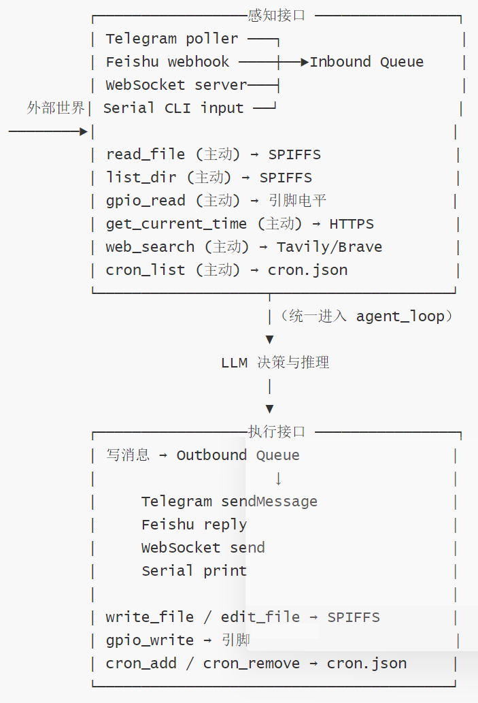
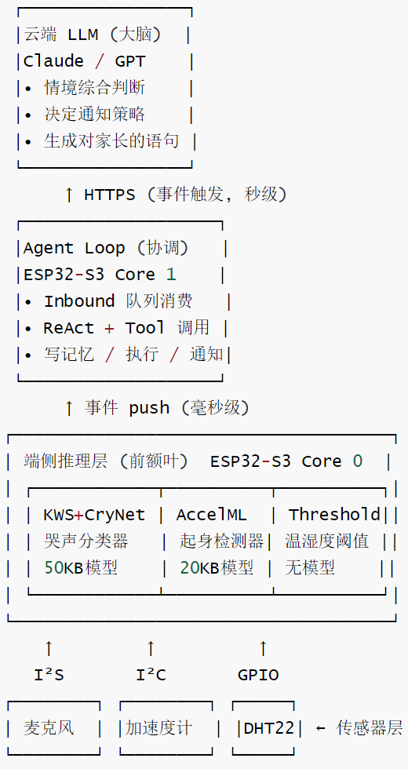

# 【OpenClaw具身硬件】MiniClaw 阅读笔记---(3) 接口 & 混合智能

# 【OpenClaw具身硬件】MiniClaw 阅读笔记---(3) 接口 & 混合智能

目录

* [【OpenClaw具身硬件】MiniClaw 阅读笔记---(3) 接口 & 混合智能](#openclaw具身硬件miniclaw-阅读笔记---3-接口--混合智能)
  + [0x00 概要](#0x00-概要)
  + [0x01 MimiClaw的感知接口与执行接口分析](#0x01-mimiclaw的感知接口与执行接口分析)
    - [1.1 接口全景图](#11-接口全景图)
    - [1.2 设计哲学浓缩](#12-设计哲学浓缩)
    - [1.3 感知接口的两种范式：Push vs Pull](#13-感知接口的两种范式push-vs-pull)
      * [范式A：Push（推送式感知）](#范式apush推送式感知)
      * [范式B：Pull（拉取式感知）](#范式bpull拉取式感知)
      * [两种范式的分工](#两种范式的分工)
    - [1.4 执行接口的统一抽象：万物皆tool](#14-执行接口的统一抽象万物皆tool)
      * [特性1：执行接口对LLM完全对称](#特性1执行接口对llm完全对称)
      * [特性2：回复是隐式的“默认执行“](#特性2回复是隐式的默认执行)
      * [特性3：物理执行有“硬护栏“](#特性3物理执行有硬护栏)
      * [特性4：文件写入也有路径护栏](#特性4文件写入也有路径护栏)
    - [1.5 感知与执行的不对称性](#15-感知与执行的不对称性)
      * [不对称1：感知更“自由”，执行更“受限”](#不对称1感知更自由执行更受限)
      * [不对称2：感知有Push+Pull两路，执行只有Push](#不对称2感知有pushpull两路执行只有push)
      * [不对称3：感知数据可以“积累”，执行结果一锤定音](#不对称3感知数据可以积累执行结果一锤定音)
    - [1.6 接口边界上的“具身性”特征](#16-接口边界上的具身性特征)
    - [1.7 一句话总结](#17-一句话总结)
  + [0x02 混合智能](#0x02-混合智能)
    - [2.1 ESP32-S3端上能跑什么模型？](#21-esp32-s3端上能跑什么模型)
    - [2.2 混合智能的本质](#22-混合智能的本质)
    - [2.3 端云协同架构](#23-端云协同架构)
      * [四层智能架构](#四层智能架构)
      * [关键设计原则](#关键设计原则)
        + [原则1：信息密度沿流向单调递增](#原则1信息密度沿流向单调递增)
        + [原则2：端侧负责“频繁但简单"，云端负责“稀疏但复杂“](#原则2端侧负责频繁但简单云端负责稀疏但复杂)
        + [原则3：事件而非数据穿越层级](#原则3事件而非数据穿越层级)
        + [原则4：端侧防抖+端侧记忆](#原则4端侧防抖端侧记忆)
        + [原则5：反馈闭环必须通过云端走完一圈](#原则5反馈闭环必须通过云端走完一圈)
        + [原则6：长期模式留给云端LLM学习](#原则6长期模式留给云端llm学习)
      * [为什么MimiClaw当前没做这些？](#为什么mimiclaw当前没做这些)
    - [2.4 端侧模型如何与云端LLM配合？](#24-端侧模型如何与云端llm配合)
      * [范式1：唤醒过滤（Wake-on-Demand）](#范式1唤醒过滤wake-on-demand)
      * [范式2:意图路由（Edge-first Routing）](#范式2意图路由edge-first-routing)
      * [范式3:语义压缩（Edge Summarization）](#范式3语义压缩edge-summarization)
      * [范式4：本地缓存+嵌入近似（LocalCache）](#范式4本地缓存嵌入近似localcache)
      * [范式5：保护性预处理（Edge Filtering）](#范式5保护性预处理edge-filtering)
      * [范式6:级联（Cascade/Speculative）](#范式6级联cascadespeculative)
      * [把六种范式映射到MimiClaw现有架构](#把六种范式映射到mimiclaw现有架构)
    - [2.5 小结](#25-小结)
  + [0xFF 参考](#0xff-参考)

## 0x00 概要

MimiClaw 是**$5 芯片上的 AI 助理（OpenClaw）。没有 Linux，没有 Node.js，纯 C。**

用户在 TG 发一条消息，ESP32-S3 通过 WiFi 收到后送进 Agent 循环 — LLM 思考、调用工具、读取记忆 — 再把回复发回来。同时支持 **Anthropic (Claude)** 和 **OpenAI (GPT)** 两种提供商，运行时可切换。一切都跑在一颗 $5 的芯片上，所有数据存在本地 Flash。


---

本篇会对MiniClaw 的思路和实现细节做进一步讨论。

## 0x01 MimiClaw的感知接口与执行接口分析

把MimiClaw看成一个具身Agent，它和“世界“打交道的所有边界都收敛在两类接口上：

* 感知接口（Sensing）一 Agent用来“知道发生了什么“的所有入口
* 执行接口（Acting）一 Agent用来“让某件事发生“的所有出口

### 1.1 接口全景图



可以看到，接口是分两类、两个方向、两种触发模式的：

| 维度 | 感知 | 执行 |
| --- | --- | --- |
| 数据方向 | 外部 → Agent | Agent → 外部 |
| 主动性 | 被动（队列收） + 主动（工具拉） | 全部主动（工具推） |
| 触发者 | 通道 / Cron / Heartbeat / LLM | 仅 LLM |

### 1.2 设计哲学浓缩

接口设计可以浓缩成几条原则：

* 感知双轨制：被动Push（事件来找你）+ 主动Pull（你去找信息），两者都汇入统一的messages[]时间线。
* 执行单轨制：所有执行都是显式tool\_use，没有隐藏副作用，唯一例外是“纯text输出 = 给用户回消息"这一惯例。 信任不对称：感知近似零约束（让LLM自由探索），执行有C层硬护栏（防止物理或安全损害）。
* 物理与虚拟同构：GPIO、文件、网络在LLM视角下都是同样的工具调用，消除了具身/虚拟的接口边界。
* 回环必须显式：执行后的状态变化不会自动回到感知，要么靠工具立即返回结果，要么LLM必须主动再次感知。
* 稀缺资源驱动显式化：在MCU上，连"当前时间"这种云端隐式的接口都被迫做成显式的tool\_use一资源约束反而让接口模型更干净、更一致。

下面拆解它们的实际形态、设计取舍、对称性，以及为何这套接口设计是MimiClaw整个Agent范式得以成立的物理基础。

### 1.3 感知接口的两种范式：Push vs Pull

MimiClaw感知接口不是单一形态，而是有两种互补的范式。

#### 范式A：Push（推送式感知）

外部事件主动推到Agent面前，Agent不需要请求。

| Push 源 | 推送时机 | 进入路径 |
| --- | --- | --- |
| TG poller | 每 30 秒 long-polling 唤醒 | Inbound Queue |
| Feishu webhook | HTTP POST 到 :18790 | Inbound Queue |
| WebSocket | 客户端发帧 | Inbound Queue |
| Serial CLI | 用户敲键盘 | Inbound Queue（间接） |
| Cron 触发 | 时间到 | Inbound Queue（伪造的“用户消息”） |
| Heartbeat | 30 分钟周期 | Inbound Queue（同上） |

Cron和Heartbeat伪装成“用户消息“进入同一个Inbound队列。这是一个非常聪明的统一抽象 ----- Agent  
不需要知道“这条消息是用户来的还是定时器来的”，处理逻辑完全一致。这把“被动响应“和“主动行为“塞进了同一个数据流，是MimiClaw实现“主动Agent"的核心机制。

#### 范式B：Pull（拉取式感知）

Agent在思考过程中主动伸手取信息。这是"LLM自主read\_file"哲学。

| Pull 工具 | 拉的对象 |
| --- | --- |
| read\_file | SPIFFS 文件（记忆、技能、历史） |
| list\_dir | SPIFFS 目录索引 |
| gpio\_read / gpio\_read\_all | 物理引脚电平 |
| get\_current\_time | 网络时间 / 系统时钟 |
| web\_search | 互联网内容 |
| cron\_list | 自身的调度状态 |

Pull接口对Agent来说完全同构一不论拉的是文件、引l脚、时间还是网络，都是同一种tool\_use→tool\_result 模式。这意味着LLM看待“读自己的记忆“和“读传感器“和“上网搜索“是同一个动作，消解了“虚拟世界“和“物理世界“的接口差异。

#### 两种范式的分工

* Push用于“事件驱动”一一必须及时响应的外部刺激（用户提问、定时任务、紧急通知）
* Pull用于“按需补充上下文”一一LLM推理过程中发现需要更多信息时主动获取

这种分工和人类感知非常类似：你不会持续盯着所有信息源，而是默认状态下被外界推送提醒，需要时再主动查阅。MimiClaw 的接口设计复刻了这种模式。

### 1.4 执行接口的统一抽象：万物皆tool

执行侧的设计要简单得多一一一所有执行都是tool\_use。但这种简单背后有几个值得注意的特性：

#### 特性1：执行接口对LLM完全对称

不论LLM想做的是：

* 给用户回消息（隐式：把text推到Outbound）
* 改记忆文件（write\_file/edit\_file）
* 点亮LED（gpio\_write）
* 排定时任务（cron\_add）

它面对的都是统一的JSON工具调用。没有特权操作、没有保留语法。这种对称性意味着：

* 加新的执行能力 = 加新的工具 = 不动Agent核心
* LLM在选择行动时不需要学习不同API的语法
* 所有动作都被工具调用日志捕获，可审计

#### 特性2：回复是隐式的“默认执行“

仔细看ReAct循环：当LLM发出纯text块而非tool\_use块时，这段text自动被当作“给用户的回复“推到Outbound。这是一个被忽略但极其重要的设计：“回消息“没有被实现成send\_message工具，而是“不做任何工具调用 = 隐式回复用户“。

好处：

* LLM不需要学习“该把回复包成send\_message tool"
* 兼容所有LLM的训练分布（默认输出=文本）一一一减少一轮tool\_use往返，省延迟和token

代价：

* LLM不能控制回复要发到哪个通道（依赖inbound消息携带的channel字段做反向路由）
* 不能在一次turn里同时发到多个用户

这是一个**"按惯例而非按显式“**的设计权衡，用了“惯例“换简洁。

#### 特性3：物理执行有“硬护栏“

gpio\_policy.c的存在，让执行接口和感知接口出现了一个重要的不对称：

| 接口 | 输入校验 | 副作用 |
| --- | --- | --- |
| gpio\_read | 只校验"引脚是否合法“ | 无（纯感知） |
| gpio\_write | 校验合法+阻止保留引脚+阻止USB/Flash引脚+白名单可选 | 物理状态改变，可能损坏硬件 |

具体的硬护栏：

* ESP32-S3的GPIO 19/20（USBSeria1/JTAG）永远禁止一一旦改了用户就再也无法烧录
* ESP32的GPIO 6-11（Flash/PSRAM）永远禁止—改了直接brick
* 可选的CSV白名单（MIMI\_GPIO\_ALLOWED\_CSV）做更严格收紧

这套护栏的设计哲学是："LLM的判断不可信任到放进物理执行路径”。LLM可能因为幻觉、prompt  
注入、或者纯粹理解错误尝试改一个不该改的引脚。所以执行接口必须有一层与LLM完全独立的、用C写死的白名单做最终防线。

这是MimiClaw整个安全模型里最关键的一行字一一一一感知接口可以信任LLM自由探索，但执行接口必须用代码而非prompt 守住边界。

#### 特性4：文件写入也有路径护栏

tool\_files.c 的validate\_path()强制：

* 必须以/spiffs/开头
* 不能含·.. 路径穿越

防止 LLM 写出/dev/null、/etc/passwd 这类“想象中存在但其实不该写“的路径，或者用..跳出 SPIFFS 范围。和GPIO守则一样，这是C层强制的，不依赖prompt守纪律。

### 1.5 感知与执行的不对称性

把两侧接口放在一起对比，能看到几条很本质的不对称：

#### 不对称1：感知更“自由”，执行更“受限”

* 感知接口几乎没有白名单一一一你可以读任何SPIFFS文件、查任何GPIO输入、搜任何网页
* 执行接口处处是约束一一GPIO白名单、文件路径校验、cron任务上限（MIMI\_CRON\_MAX\_JOBS=16）

这反映一种正确的安全思想：感知错了最多浪费token，执行错了可能损坏设备或骚扰用户。不对称的信任=不对称的护栏。

#### 不对称2：感知有Push+Pull两路，执行只有Push

LLM不能“被动等执行“一一一它一旦做出决定，必须立即发出tool\_use。这意味着：

* 没有“延迟执行“机制（除了cron，但cron本质是把“未来执行“提前注册）
* 没有“事务回滚“机制（写文件出错就出错了）
* 没有“批量执行“机制（每个动作都独立tool\_use）

这些缺失对一个5美元MCU来说是合理简化，但也意味着MimiClaw不适合做需要复杂事务语义的任务（比如金融操作）。

#### 不对称3：感知数据可以“积累”，执行结果一锤定音

* 感知到的内容会进入 messages[］，多轮叠加，LLM能跨轮综合
* 执行的副作用一旦产生就不可见—LLM写了文件，下一轮要再read\_file才能确认；点了LED，要gpio\_read 才知道现在亮没亮

这暗含一个反馈环依赖：执行后的状态变化必须经由感知接口被重新观察到，LLM 才能知道“执行成功了吗”。MimiClaw 当前的工具实现会把执行结果作为 tool\_result 返回（“GPIO 17 set to HIGH”），相当于把“执行 + 立即感知”合并成一次 tool\_use一一一这是嵌入式接口设计里非常重要的一点。

### 1.6 接口边界上的“具身性”特征

把 MimiClaw 的接口集合和云端 Agent 对比：

| 接口类型 | 云端 Agent | MimiClaw |
| --- | --- | --- |
| 感知—用户消息 | HTTP/WS | 同（多通道统一抽象） |
| 感知—内部状态 | DB query | read\_file + 文件系统 |
| 感知—外部世界 | API 调用 | web\_search |
| 感知—物理 | 无 | GPIO 输入 |
| 感知—时间 | 系统调用 | get\_current\_time（无内部时钟，必须从网络拿） |
| 执行—回复 | HTTP response | 隐式 text → Outbound |
| 执行—持久化 | DB write | write\_file + SPIFFS |
| 执行—物理 | 无 | GPIO 输出 |
| 执行—定时 | 调度器 | cron\_add 写到 cron.json |

MimiClaw 比云端 Agent 多出两类接口：物理感知（GPIO 输入、未来可扩展为 ADC / I²C 传感器）和物理执行（GPIO 输出）。这是它作为具身 AI 的核心标志。

另外，MimiClaw 没有独立的实时时钟，所以它要“知道现在几点”必须经由 get\_current\_time 网络拉取—这等于把“时间感知”也变成了主动 pull。在云端这是免费的系统调用，在 MCU 上变成了一个网络 RTT 的工具调用。物理资源的稀缺让原本“隐式”的接口被迫“显式化”。

### 1.7 一句话总结

MimiClaw的接口设计本质上是一个“双轨感知+受限执行“的最小集：

* 感知端用Push/Pull双范式覆盖事件驱动和按需补给
* 执行端用统一的tool\_use抽象把虚拟动作和物理动作放在同一层，再在执行边界用C 层硬护栏隔离LLM不可信的判断。

这套接口设计的优雅之处不在于功能丰富，而在于它把“具身AI"应该长什么样的最小可行表面积，雕刻成了一组对称、对仗、容易扩展的工具调用语义 ----- 加新感知=加pull tool；加新执行 = 加tool+一条policy；通道扩展=加一个push入口。框架不变，能力增长。

如果未来MimiClaw接上I2C温湿度传感器、I2S麦克风、ADC电池监测，架构上不需要改一行一一一全部以新tool  
的形式挂上去，沿用同一套感知/执行哲学。

这就是接口设计的终极考验：面对未来的扩展，你的抽象是否还成立。MimiClaw的答案是：成立。

## 0x02 混合智能

### 2.1 ESP32-S3端上能跑什么模型？

我们先来推断看看ESP32-S3端上能跑什么模型？

ESP32-S3上最多只能跑约束极小、专用化的模型，按工作负载从轻到重排列，可行的类别如下：

类别1：KWS/唤醒词检测（最成熟）

* MimiClaw用法：未来加麦克风后，“嘿小米“唤醒不需要联网

类别2：VAD/简单音频特征提取

* MimiClaw用法：判断“用户是否在说话"，决定是否需要把音频发往云端STT，节省带宽和云端费用

类别3：TinyML分类器（图像/时序）

* MimiClaw用法：接摄像头时做“有没有人/有没有动"二分类

类别4：手势/传感器时序识别

* MimiClaw用法：MPU6050加速度计判断“敲了一下"、“摇晃了“

类别5：极小语言任务模型（边界）

* 可选：n-gram语言模型、超小意图分类（<100K词表+LR分类器）-规模：几KB-几百KB
* MimiClaw用法：本地意图路由一“用户说的是控制类还是查询类"，命中前者直接走GPIO工具，不进云端

因此，任何“通用智能“必须留给云端。

### 2.2 混合智能的本质

跳出MimiClaw看一下整个端云协同的趋势：大模型时代的“端侧AI"不是“小型LLM"一它是“为大模型服务的廉价感知层”。

* 端侧负责带宽友好的过滤、压缩、节流
* 云端负责通用推理、长上下文、工具协调
* 二者通过接口契约（事件、文本、压缩特征）通信

MimiClaw的设计哲学和这个趋势完美吻合：

| MimiClaw 已有 | 对应混合智能 |
| --- | --- |
| 通道 + Inbound 队列 | 端侧 "上行接口" |
| Agent Loop 在 Core 1 | 端侧 "协调器" |
| Anthropic/OpenAI HTTPS 调用 | 云端 "大脑" |
| GPIO Tools | 端侧 "执行器" |
| SPIFFS 平文本记忆 | 端侧 "持久化层" |

加端侧模型只需在 inbound 路径上嵌入一层 "端侧分流器"———架构完全 ready。MimiClaw 当前的接口模型已经为混合智能预留了所有插槽，只是 v1 选择了把分流器留空。

### 2.3 端云协同架构

端云协同架构可以细分为四层。四层协作的本质是把“持续的物理感知“和“稀疏的语义推理“解耦：

* 传感器层是“皮肤“持续收集刺激；
* 端侧小模型层是“脊髓反射“ 用毫秒级的简单规则把刺激压缩成事件；
* Agent Loop 层负责：协调 / 写记忆 / 执行 / 通知
* 云端LLM 是“大脑“用秒级推理把事件转化为决策；执行接口让决策回到物理世界。

任何环节越级（比如让传感器直接调云端，或让LLM 处理原始音频），整个系统的功耗、隐私、成本和延迟都会失控。

#### 四层智能架构



每一层各司其职：

```
┌──────────┬──────────────────────┬──────────────────────┬─────────────┐
│ 层       │ 时间尺度               │ 数据规模              │算力代价      │
├──────────┼──────────────────────┼──────────────────────┤─────────────┤
│ 传感器层  │ 持续 (kHz~Hz)         │ KB/s                 │几乎为零      │
│ 端侧推理层│ 持续 (每秒数次)         | 输出几 byte 标签      │几ms CPU     │
│ Agent 层 │ 事件驱动 (每分钟最多几次)│ 输入几百 byte         │1-10s含云端   │
│ 云端 LLM │ 事件驱动               │ 输入几 KB → 输出几 KB  │网络+推理费用  │
└──────────┴──────────────────────┴──────────────────────┴─────────────┘
```

MimiClaw 的接口模型已经完美契合这个分层结构，后续如果加端侧模型不是改架构，而是给已有架构填上“前额叶“那块拼图。

#### 关键设计原则

混合智能可以成几条可复用的混合AI设计原则：

##### 原则1：信息密度沿流向单调递增

原始信号（kB/s）→特征（B/s）→标签（事件级）→语义（句级）→决策（动作）

每往上一层，数据量减少1一3个数量级，语义抽象增加。云端不应该看到下游层应该处理的数据粒度。

##### 原则2：端侧负责“频繁但简单"，云端负责“稀疏但复杂“

* 端侧：1000次/秒的判断（声音是哭吗？）
* 云端：10次/天的判断（这次哭是否需要打扰家长？）

判断频率与判断复杂度成反比一这是分层智能的根本依据。

##### 原则3：事件而非数据穿越层级

绝对不要把“原始音频“或“加速度向量“送到云端。送“Crying detected，35s，sustained”。这同时解决了：

* 带宽（数据→几行文本）
* 隐私（音频→标签）
* 延迟（无需STT）
* 成本（无需大量token）

##### 原则4：端侧防抖+端侧记忆

端侧不只是“分类”，还要做短期状态机一防抖、连续性判断、冷却时间。否则云端会被同一个事件刷屏。

if（already\_reported\_in\_last\_2min）skip；这种逻辑必须在端侧完成。

##### 原则5：反馈闭环必须通过云端走完一圈

端侧检测到事件→云端决策→执行回到端侧（点灯、蜂鸣、消息）→端侧检测执行后的新状态→决定是否再上报。

这是“具身智能“区别于“云端chatbot"的关键一它能感知自己执行后的世界变化。

##### 原则6：长期模式留给云端LLM学习

端侧模型是静态规则（训练好的权重）。模式演化由云端LLM通过写MEMORY.md实现一它发现“这家孩子总在02：00 哭”，写进记忆，下次提前预警。端侧不学习，云端学习。这是ESP32-S3资源约束下唯一可行的“持续学习“路径。

#### 为什么MimiClaw当前没做这些？

MimiClaw 完全跳过了端侧模型这一层，直接“通道→Agent→云端LLM"。这不是疏忽，是故意的产品取舍。

核心判断：在没有持续音视频流的场景下，云端 LLM的延迟和成本还没高到必须用端侧模型分摊的地步。等到 MimiClaw 接了麦克风做语音助手，平衡才会反过来一端侧模型变成必需而非奢侈。

### 2.4 端侧模型如何与云端LLM配合？

混合智能架构的本质是：用端侧模型把“廉价但海量“的输入过滤/压缩成“昂贵但稀疏“的云端调用。

下面六种范式按集成深度排列。

#### 范式1：唤醒过滤（Wake-on-Demand）

连续音频流→[WakeNeton-device]→检测到“嘿小米”→启动云端会话

* 端侧模型永远在线
* 云端LLM按需启动
* 节省：99%+的“无意义音频“不上云

Mimiclaw适用度：极高。这是最经典也最稳的混合模式，espressif已经有完整工具链。

#### 范式2:意图路由（Edge-first Routing）

* ```
  用户消息→[意图分类器on-device]→
  - “控制类“（开灯/关灯）→直接执行gpio_write，不调云
  - “对话/查询类”→走Agent+LLM
  ```
* 端侧分类器：~10KB，毫秒级
* 命中率高的简单指令完全不上云
* 节省：每次“开灯“省一次LLM调用（~$0.001+数秒延迟）

MimiClaw适用度：高，但收益门槛在于“是否真的有大量重复的简单指令”。如果用户只是聊天，这个分类器派不上用场。

实现思路：在 bus/message\_bus.c的 inbound 端加一个 hook，命中规则直接构造tool\_use 推到 outbound，绕过 agent\_loop.

#### 范式3:语义压缩（Edge Summarization）

长音频→[VAD+KWS]→截取有效片段→上云STT→文本进Agent

长视频→[人/动检测]→仅在事件发生时发送→上云

* 端侧做“信息密度提取“
* 云端只接收已经压缩过的有效信号
* 节省：带宽、云端token、隐私

MimiClaw适用度：中（取决于硬件扩展）。一旦加了麦克风/摄像头，这是必经之路一直传原始音视频既贵又慢。

#### 范式4：本地缓存+嵌入近似（LocalCache）

```
用户问题→[极小embedding或哈希]→
- 命中本地FAQ缓存→直接返回上次答案
- 未命中→调云端LLM→把答案写回本地
```

* 端侧模型很小（甚至是hash+字典）
* 重复问题不再上云
* 节省：高重复率场景下50%+调用

MimiClaw适用度：中等。问题是ESP32-S3跑不动真正的embedding模型，要么用极简的token-levelJaccard 相似度，要么把这层功能放到LLM自己（让LLM在read MEMORY时认出“这个问题之前回答过“—其实就是MimiC1aw当前的范式）。

#### 范式5：保护性预处理（Edge Filtering）

传感器→[异常检测器on-device]→异常时才打包成消息推inbound→Agent决策

* 端侧持续监控
* 云端只在“值得思考“时介入
* 节省：避免Agent被无意义信号刷屏

MimiClaw适用度：高，与现有Heartbeat机制天然契合。Heartbeat 当前是定时触发，可以升级为“端侧检测器触发"一温度异常、震动异常、GPIO状态翻转都能成为新的Push源。

#### 范式6:级联（Cascade/Speculative）

```
用户消息→[小LLM/规则on-device]→给出初步答案
- 置信度高→直接返回
- 置信度低→升级到云端LLM重答
```

* 端侧“先尝试“
* 云端“兜底
* 节省：简单问题省钱，复杂问题保质

MimiClaw适用度：低。ESP32-S3跑不动有“对话能力“的小模型；这个范式在更强的边缘SoC（树莓派、Jetson）上才有意义。MimiClaw这一档的设备不应该尝试Cascade。

#### 把六种范式映射到MimiClaw现有架构

把它们落到MimiClaw当前的接口模型上看：

| 范式 | 在 MimiClaw 哪一层接入 | 改动量 |
| --- | --- | --- |
| 唤醒过滤 | 新增 "audio" 通道，在 inbound 入口 | 中（需要麦克风 + ESP-Skainet） |
| 意图路由 | bus/message\_bus.c 的 inbound hook | 小（纯软件） |
| 语义压缩 | 通道层（TG\_bot 之前 / 摄像头驱动之后） | 中-大 |
| 本地缓存 | agent\_loop.c 的循环开头 | 小（但效果有限） |
| 保护性预处理 | heartbeat/ 升级 + 新增传感器轮询 | 中 |
| 级联 | 不推荐 | ✓ |

最有性价比的两条：

* 意图路由一纯软件，立刻能省云端调用
* 保护性预处理一升级Heartbeat让设备真正"主动“

这两条合起来能让MimiClaw从“被问才答的端侧Bot"进化为“自己注意周围、必要时调用大脑思考“的具身  
Agent一一一本质上是给当前架构补上“端侧前额叶”。

### 2.5 小结

ESP32-S3上永远跑不了LLM，但完全跑得了KWS、VAD、TinyML分类器、意图路由器这一类“非语言"小模型；它们和云端LLM 的配合方式不是“端侧也思考、云端也思考“的对等关系，而是“端侧做高频廉价的感知过滤、云端做低频昂贵的语义推理“的金字塔关系。

MimiClaw当前架构故意跳过了端侧模型层，但接口模型已经为它预留了位置一一一一未来加麦克风、加传感器、加摄像头时，端侧模型可以以push通道或inbound hook 的形式无侵入地接入，把MimiClaw从“打字Bot"演进为“具身感知节点"，而云端 LLM始终承担“大脑“的角色不变。

## 0xFF 参考
